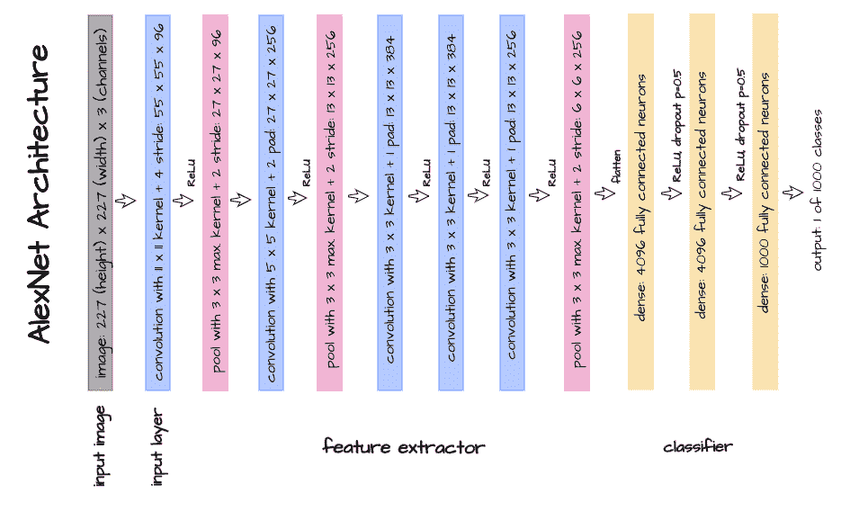
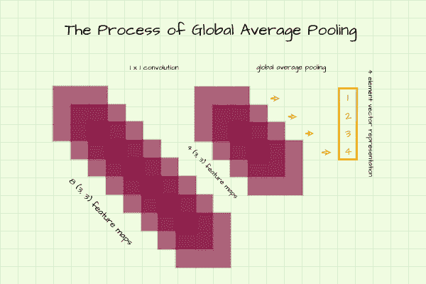
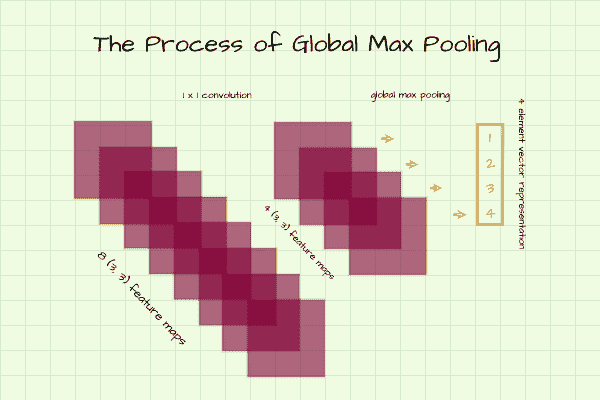
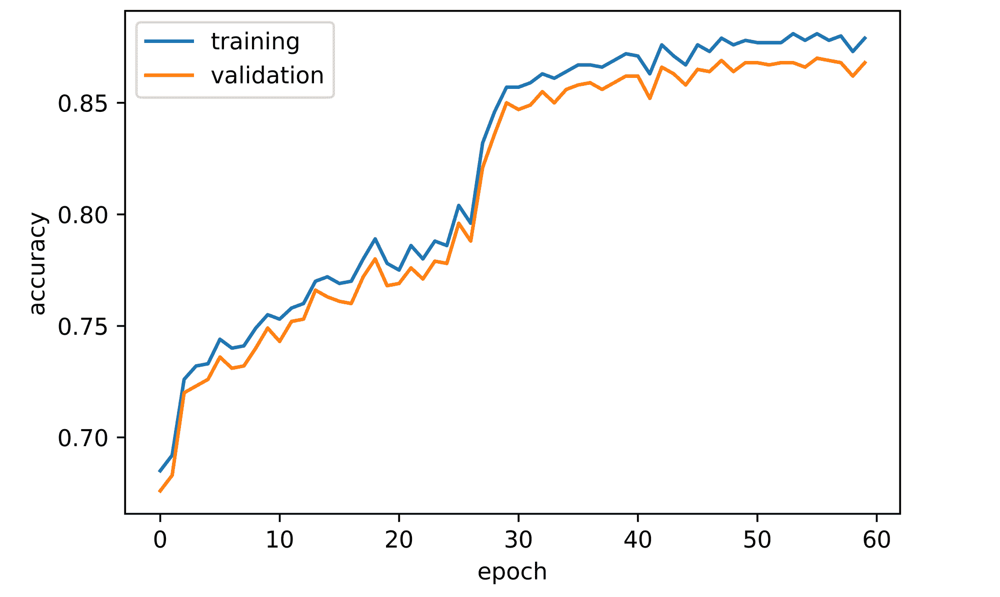
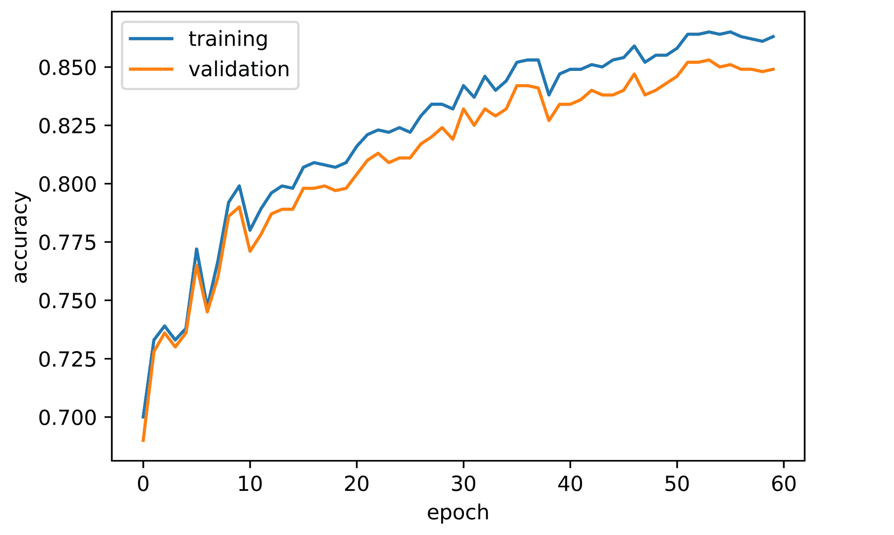
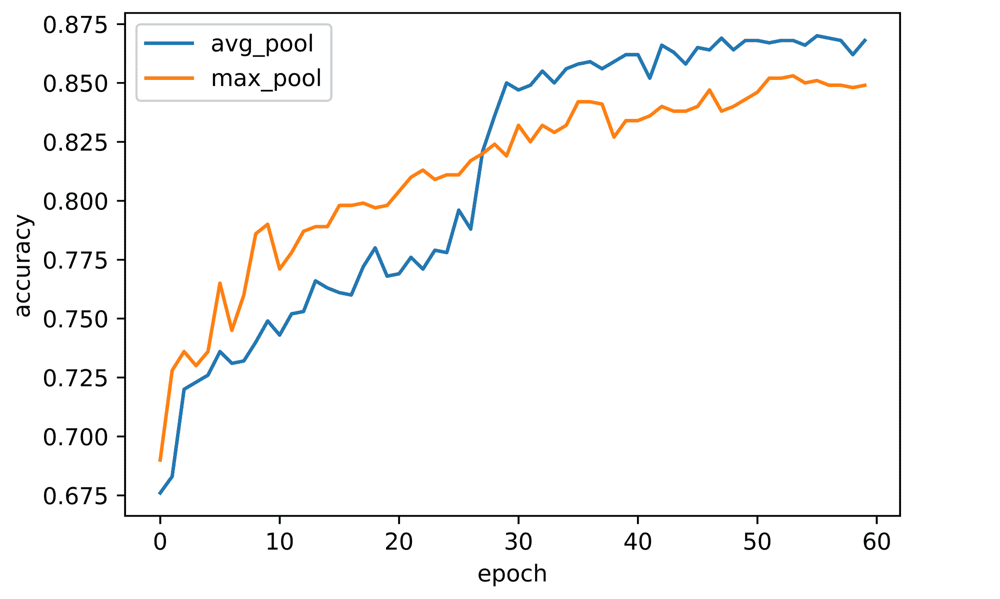
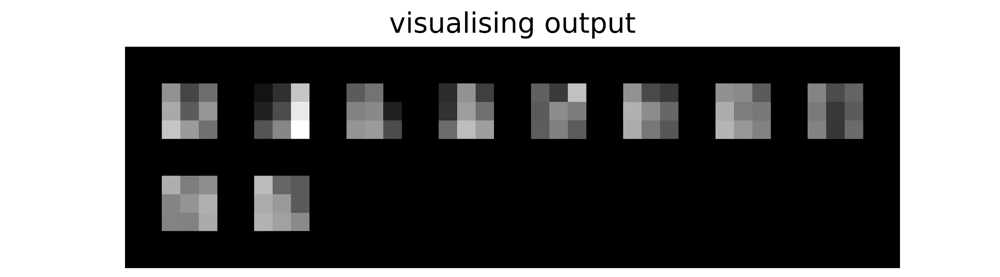

# 卷积神经网络中的全局池

> 原文：<https://blog.paperspace.com/global-pooling-in-convolutional-neural-networks/>

一段时间以来，池操作一直是卷积神经网络的支柱。虽然像最大池和平均池这样的过程经常占据更多的中心位置，但它们不太为人所知的表亲全局最大池和全局平均池已经变得同等重要。在本文中，我们将探讨这两种常见的池技术的全局变量是什么，以及它们之间的比较。

```py
#  article dependencies
import torch
import torch.nn as nn
import torch.nn.functional as F
import torchvision
import torchvision.transforms as transforms
import torchvision.datasets as Datasets
from torch.utils.data import Dataset, DataLoader
import numpy as np
import matplotlib.pyplot as plt
import cv2
from tqdm.notebook import tqdm
import seaborn as sns
from torchvision.utils import make_grid
```

```py
if torch.cuda.is_available():
  device = torch.device('cuda:0')
  print('Running on the GPU')
else:
  device = torch.device('cpu')
  print('Running on the CPU')
```

### 经典卷积神经网络

许多计算机视觉的初学者经常被介绍到卷积神经网络作为图像数据的理想神经网络，因为它保留了输入图像的空间结构，同时从它们学习/提取特征。通过这样做，它能够学习图像中相邻像素和对象位置之间的关系，从而使它成为一个非常强大的神经网络。

多层感知器也可以在图像分类环境中工作，但是与它的 convnet 对应物相比，它的性能会严重下降，因为它通过展平/矢量化立即破坏了图像的空间结构，从而去除了相邻像素之间的大部分关系。

#### 特征提取器和分类器组合

许多经典的卷积神经网络实际上是 convnets 和 MLPs 的组合。例如，看看 [LeNet](https://blog.paperspace.com/writing-lenet5-from-scratch-in-python/) 和 [AlexNet](https://blog.paperspace.com/alexnet-pytorch/) 的架构，人们可以清楚地看到，他们的架构只是一对卷积层，最后附有线性层。

这种配置很有意义，它允许卷积层做他们最擅长的事情，即提取二维空间数据中的特征。之后，提取的特征被传递到线性层上，因此它们也可以做它们擅长的事情，找到特征向量和目标之间的关系。



#### 设计中的缺陷

这种设计的问题是线性图层非常容易过度适应数据。辍学管制的引入有助于缓解这一问题，但这仍然是一个问题。此外，对于一个以不破坏空间结构而自豪的神经网络来说，经典的 convnet 仍然做到了这一点，尽管在网络中更深，程度更低。

### 一个经典问题的现代解答

为了防止 convnets 中的这种过拟合问题，尝试 dropout 正则化后，合乎逻辑的下一步是完全消除所有线性图层。如果要排除线性图层，则需要寻找一种全新的方法来对特征地图进行下采样，并生成与所讨论的类别数量相等的矢量表示。这正是全球统筹的用武之地。

考虑一个 4 类分类任务，1 x 1 卷积图层将有助于对要素地图进行下采样，直到它们的数量为 4，而全局池将有助于创建一个 4 元素长的矢量表示，然后损失函数可以使用它来计算梯度。

### 全球平均池

仍然在上面描述的相同分类任务中，想象一个场景，其中我们感觉我们的卷积层处于足够的深度，但是我们有 8 个大小为`(3, 3)`的特征图。我们可以利用 1×1 卷积层来将 8 个特征映射下采样到 4 个。现在我们有 4 个大小为`(3, 3)`的矩阵，而我们实际需要的是一个 4 个元素的向量。

从这些特征图中导出 4 元素向量的一种方法是计算每个特征图中所有像素的平均值，并将其作为单个元素返回。这基本上是全球平均池所需要的。



### 全局最大池

就像上面的场景一样，我们希望从 4 个矩阵中产生 4 个元素的向量，在这种情况下，我们不是取每个特征图中所有像素的平均值，而是取最大值，并将其作为感兴趣的向量表示中的单个元素返回。



### 基准全球统筹方法

这里的基准测试目标是基于两种全局池技术在用于生成分类向量表示时的性能来比较它们。用于基准测试的数据集是 FashionMNIST 数据集，它包含常见时尚物品的 28 像素乘 28 像素图像。

```py
#  loading training data
training_set = Datasets.FashionMNIST(root='./', download=True,
                                      transform=transforms.ToTensor())

#  loading validation data
validation_set = Datasets.FashionMNIST(root='./', download=True, train=False,
                                        transform=transforms.ToTensor())
```

| 标签 | 描述 |
| --- | --- |
| Zero | t 恤 |
| one | 裤子 |
| Two | 套衫 |
| three | 连衣裙 |
| four | 外套 |
| five | 凉鞋 |
| six | 衬衫 |
| seven | 运动鞋 |
| eight | 包 |
| nine | 踝靴 |

#### 使用全球平均池进行转换

下面定义的 convnet 使用 1 x 1 卷积层与全局平均池，而不是线性层，来产生 10 个元素的矢量表示，而无需正则化。关于 PyTorch 中全局平均池的实现，所有需要做的就是利用常规的平均池类，但是使用大小等于每个单独特征图大小的内核/过滤器。举例来说，从第 6 层出来的特征映射的大小为`(3, 3)`，因此为了执行全局平均池，使用大小为 3 的内核。*注意:简单地取每个特征图的平均值会得到相同的结果。*

```py
class ConvNet_1(nn.Module):
  def __init__(self):
    super().__init__()
    self.network = nn.Sequential(
        #  layer 1
        nn.Conv2d(1, 8, 3, padding=1),
        nn.ReLU(), #  feature map size = (28, 28)
        #  layer 2
        nn.Conv2d(8, 8, 3, padding=1),
        nn.ReLU(),
        nn.MaxPool2d(2), #  feature map size = (14, 14)
        #  layer 3
        nn.Conv2d(8, 16, 3, padding=1),
        nn.ReLU(), #  feature map size = (14, 14)
        #  layer 4
        nn.Conv2d(16, 16, 3, padding=1),
        nn.ReLU(),
        nn.MaxPool2d(2), #  feature map size = (7, 7)
        #  layer 5
        nn.Conv2d(16, 32, 3, padding=1),
        nn.ReLU(), #  feature map size = (7, 7)
        #  layer 6
        nn.Conv2d(32, 32, 3, padding=1),
        nn.ReLU(),
        nn.MaxPool2d(2), #  feature map size = (3, 3)
        #  output layer
        nn.Conv2d(32, 10, 1),
        nn.AvgPool2d(3)
    )

  def forward(self, x):
    x = x.view(-1, 1, 28, 28)
    output = self.network(x)
    output = output.view(-1, 10)
    return torch.sigmoid(output)
```

#### 具有全局最大池的 Convnet

另一方面，下面的 ConvNet_2 用 1 x 1 卷积层替换线性层，与全局最大池协同工作，以便产生 10 个元素的向量，而无需正则化。与全局平均池类似，要在 PyTorch 中实现全局最大池，需要使用常规的最大池类，其内核大小等于此时的特征映射大小。*注意:简单地导出每个特征图中的最大像素值会产生相同的结果。*

```py
class ConvNet_2(nn.Module):
  def __init__(self):
    super().__init__()
    self.network = nn.Sequential(
        #  layer 1
        nn.Conv2d(1, 8, 3, padding=1),
        nn.ReLU(), #  feature map size = (28, 28)
        #  layer 2
        nn.Conv2d(8, 8, 3, padding=1),
        nn.ReLU(),
        nn.MaxPool2d(2), #  feature map size = (14, 14)
        #  layer 3
        nn.Conv2d(8, 16, 3, padding=1),
        nn.ReLU(), #  feature map size = (14, 14)
        #  layer 4
        nn.Conv2d(16, 16, 3, padding=1),
        nn.ReLU(),
        nn.MaxPool2d(2), #  feature map size = (7, 7)
        #  layer 5
        nn.Conv2d(16, 32, 3, padding=1),
        nn.ReLU(), #  feature map size = (7, 7)
        #  layer 6
        nn.Conv2d(32, 32, 3, padding=1),
        nn.ReLU(),
        nn.MaxPool2d(2), #  feature map size = (3, 3)
        #  output layer
        nn.Conv2d(32, 10, 1),
        nn.MaxPool2d(3)
    )

  def forward(self, x):
    x = x.view(-1, 1, 28, 28)
    output = self.network(x)
    output = output.view(-1, 10)
    return torch.sigmoid(output)
```

#### 卷积神经网络类

下面定义的类包含用于训练和利用 convnets 的训练和分类函数。

```py
class ConvolutionalNeuralNet():
  def __init__(self, network):
    self.network = network.to(device)
    self.optimizer = torch.optim.Adam(self.network.parameters(), lr=3e-4)

  def train(self, loss_function, epochs, batch_size, 
            training_set, validation_set):

    #  creating log
    log_dict = {
        'training_loss_per_batch': [],
        'validation_loss_per_batch': [],
        'training_accuracy_per_epoch': [],
        'validation_accuracy_per_epoch': []
    } 

    #  defining weight initialization function
    def init_weights(module):
      if isinstance(module, nn.Conv2d):
        torch.nn.init.xavier_uniform_(module.weight)
        module.bias.data.fill_(0.01)

    #  defining accuracy function
    def accuracy(network, dataloader):
      total_correct = 0
      total_instances = 0
      for images, labels in tqdm(dataloader):
        images, labels = images.to(device), labels.to(device)
        predictions = torch.argmax(network(images), dim=1)
        correct_predictions = sum(predictions==labels).item()
        total_correct+=correct_predictions
        total_instances+=len(images)
      return round(total_correct/total_instances, 3)

    #  initializing network weights
    self.network.apply(init_weights)

    #  creating dataloaders
    train_loader = DataLoader(training_set, batch_size)
    val_loader = DataLoader(validation_set, batch_size)

    for epoch in range(epochs):
      print(f'Epoch {epoch+1}/{epochs}')
      train_losses = []

      #  training
      print('training...')
      for images, labels in tqdm(train_loader):
        #  sending data to device
        images, labels = images.to(device), labels.to(device)
        #  resetting gradients
        self.optimizer.zero_grad()
        #  making predictions
        predictions = self.network(images)
        #  computing loss
        loss = loss_function(predictions, labels)
        log_dict['training_loss_per_batch'].append(loss.item())
        train_losses.append(loss.item())
        #  computing gradients
        loss.backward()
        #  updating weights
        self.optimizer.step()
      with torch.no_grad():
        print('deriving training accuracy...')
        #  computing training accuracy
        train_accuracy = accuracy(self.network, train_loader)
        log_dict['training_accuracy_per_epoch'].append(train_accuracy)

      #  validation
      print('validating...')
      val_losses = []

      with torch.no_grad():
        for images, labels in tqdm(val_loader):
          #  sending data to device
          images, labels = images.to(device), labels.to(device)
          #  making predictions
          predictions = self.network(images)
          #  computing loss
          val_loss = loss_function(predictions, labels)
          log_dict['validation_loss_per_batch'].append(val_loss.item())
          val_losses.append(val_loss.item())
        #  computing accuracy
        print('deriving validation accuracy...')
        val_accuracy = accuracy(self.network, val_loader)
        log_dict['validation_accuracy_per_epoch'].append(val_accuracy)

      train_losses = np.array(train_losses).mean()
      val_losses = np.array(val_losses).mean()

      print(f'training_loss: {round(train_losses, 4)}  training_accuracy: '+
      f'{train_accuracy}  validation_loss: {round(val_losses, 4)} '+  
      f'validation_accuracy: {val_accuracy}\n')

    return log_dict

  def predict(self, x):
    return self.network(x) 
```

### 基准测试结果

#### ConvNet_1(全局平均池)

ConvNet_1 使用全局平均池来产生分类向量。设置感兴趣的参数和 60 个时期的训练产生如下分析的度量日志。

```py
model_1 = ConvolutionalNeuralNet(ConvNet_1())

log_dict_1 = model_1.train(nn.CrossEntropyLoss(), epochs=60, batch_size=64, 
                       training_set=training_set, validation_set=validation_set)
```

从获得的日志来看，在模型训练过程中，训练和验证的准确性都有所提高。验证准确度在大约 66%开始，然后在第 28 个时期稳定地增加到略低于 80%的值。然后在第 31 个时期观察到急剧增加到低于 85%的值，最终在第 60 个时期达到大约 87%的峰值。

```py
sns.lineplot(y=log_dict_1['training_accuracy_per_epoch'], x=range(len(log_dict_1['training_accuracy_per_epoch'])), label='training')

sns.lineplot(y=log_dict_1['validation_accuracy_per_epoch'], x=range(len(log_dict_1['validation_accuracy_per_epoch'])), label='validation')

plt.xlabel('epoch')
plt.ylabel('accuracy')
```



#### ConvNet_2(全局最大池)

ConvNet_2 利用全局最大池而不是全局平均池来产生 10 个元素的分类向量。保持所有参数不变并训练 60 个时期会产生下面的度量日志。

```py
model_2 = ConvolutionalNeuralNet(ConvNet_2())

log_dict_2 = model_2.train(nn.CrossEntropyLoss(), epochs=60, batch_size=64, 
                       training_set=training_set, validation_set=validation_set)
```

总的来说，在 60 个时期的过程中，训练和验证的准确性都增加了。验证准确度在波动之前开始时略低于 70%,而到第 60 个时期时稳定地增加到略低于 85%的值。

```py
sns.lineplot(y=log_dict_2['training_accuracy_per_epoch'], x=range(len(log_dict_2['training_accuracy_per_epoch'])), label='training')

sns.lineplot(y=log_dict_2['validation_accuracy_per_epoch'], x=range(len(log_dict_2['validation_accuracy_per_epoch'])), label='validation')

plt.xlabel('epoch')
plt.ylabel('accuracy')
plt.savefig('maxpool_benchmark.png', dpi=1000)
```



#### 比较性能

比较两种全局池技术的性能，我们可以很容易地推断出全局平均池的性能更好，至少在我们选择使用的数据集(FashionMNIST)上。这似乎真的很符合逻辑，因为全局平均池产生代表每个特征图中所有像素的一般性质的单个值，而全局最大池产生孤立的单个值，而不考虑特征图中存在的其他像素。然而，为了得出更具结论性的结论，应该对几个数据集进行基准测试。



### 引擎盖下的全球统筹

为了直观地了解为什么全局池实际工作，我们需要编写一个函数，使我们能够可视化卷积神经网络中中间层的输出。很多时候，神经网络被认为是黑盒模型，但至少有某些方法可以尝试撬开黑盒，以了解里面发生了什么。下面的函数就是这么做的。

```py
def visualize_layer(model, dataset, image_idx: int, layer_idx: int):
  """
  This function visulizes intermediate layers in a convolutional neural 
  network defined using the PyTorch sequential class 
  """
  #  creating a dataloader
  dataloader = DataLoader(dataset, 250)

  #  deriving a single batch from dataloader
  for images, labels in dataloader:
    images, labels = images.to(device), labels.to(device)
    break

  #  deriving output from layer of interest
  output = model.network.network[:layer_idx].forward(images[image_idx])
  #  deriving output shape
  out_shape = output.shape

  #  classifying image
  predicted_class = model.predict(images[image_idx])

  print(f'actual class: {labels[image_idx]}\npredicted class: {torch.argmax(predicted_class)}')

  #  visualising layer
  plt.figure(dpi=150)
  plt.title(f'visualising output')
  plt.imshow(np.transpose(make_grid(output.cpu().view(out_shape[0], 1, 
                                                        out_shape[1], 
                                                        out_shape[2]), 
                                    padding=2, normalize=True), (1,2,0)))
  plt.axis('off')
```

为了使用该功能，应正确理解参数。该模型是指一个卷积神经网络实例化相同的方式，我们在这篇文章中，其他类型将不会与此功能。在这种情况下，数据集可以是任何数据集，但最好是验证集。Image_idx 是所提供的第一批数据集中图像的索引，该函数将一批图像定义为 250 个图像，因此 image_idx 的范围可以是 0 - 249。另一方面，Layer_idx 并不是指卷积层，而是指 PyTorch sequential 类定义的层，如下所示。

```py
model_1.network

#  output
>>>> ConvNet_1(
  (network): Sequential(
    (0): Conv2d(1, 8, kernel_size=(3, 3), stride=(1, 1), padding=(1, 1))
    (1): ReLU()
    (2): Conv2d(8, 8, kernel_size=(3, 3), stride=(1, 1), padding=(1, 1))
    (3): ReLU()
    (4): MaxPool2d(kernel_size=2, stride=2, padding=0, dilation=1, ceil_mode=False)
    (5): Conv2d(8, 16, kernel_size=(3, 3), stride=(1, 1), padding=(1, 1))
    (6): ReLU()
    (7): Conv2d(16, 16, kernel_size=(3, 3), stride=(1, 1), padding=(1, 1))
    (8): ReLU()
    (9): MaxPool2d(kernel_size=2, stride=2, padding=0, dilation=1, ceil_mode=False)
    (10): Conv2d(16, 32, kernel_size=(3, 3), stride=(1, 1), padding=(1, 1))
    (11): ReLU()
    (12): Conv2d(32, 32, kernel_size=(3, 3), stride=(1, 1), padding=(1, 1))
    (13): ReLU()
    (14): MaxPool2d(kernel_size=2, stride=2, padding=0, dilation=1, ceil_mode=False)
    (15): Conv2d(32, 10, kernel_size=(1, 1), stride=(1, 1))
    (16): AvgPool2d(kernel_size=3, stride=3, padding=0)
  )
)
```

#### 为什么全球平均池有效

为了理解全局平均池的工作原理，我们需要在完成全局平均池之前可视化输出层的输出，这对应于第 15 层，因此我们需要抓取/索引第 15 层，这意味着 layer_idx=16。使用 model_1 (ConvNet_1 ),我们产生了下面的结果。

```py
visualize_layer(model=model_1, dataset=validation_set, image_idx=2, layer_idx=16)

#  output
>>>> actual class: 1
>>>> predicted class: 1
```

当我们在全局平均汇集之前可视化图像 3 的输出(索引 2)时，我们可以看到模型已经正确地预测了它的类别为类别 1(裤子),如上所示。观察可视化，我们可以看到，与其他特征图相比，索引 1 处的特征图平均具有最亮的像素。换句话说，就在全局平均汇集之前，convnet 已经学会了通过在感兴趣的特征图中“打开”更多像素来对图像进行分类。然后，当进行全局平均池化时，最高值的元素将位于索引 1 处，因此它被选为正确的类。


Global average pooling output.

#### 为什么全球最大池有效

保持所有参数不变，但在本例中使用 model_2 (ConvNet_2 ),我们获得以下结果。同样，convnet 正确地将该图像分类为属于类别 1。查看生成的可视化，我们可以看到索引 1 处的特征图包含最亮的像素。

在这种情况下，convnet 已经学会通过在全局最大值汇集之前“打开”感兴趣的特征图中最亮的像素来对图像进行分类。

```py
visualize_layer(model=model_2, dataset=validation_set, image_idx=2, layer_idx=16)

#  output
>>>> actual class: 1
>>>> predicted class: 1
```



Global max pooling output.

### 结束语

在本文中，我们探讨了全局平均池和最大池的含义。我们讨论了它们为什么会被使用，以及它们如何相互比较。我们还通过对我们的神经网络进行活组织检查和可视化中间层，对它们的工作原理有了一种直觉。