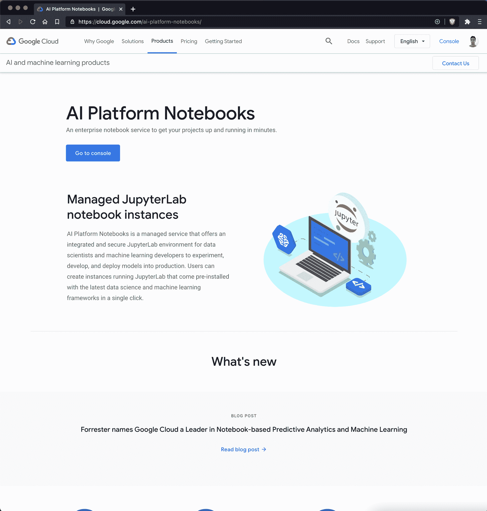
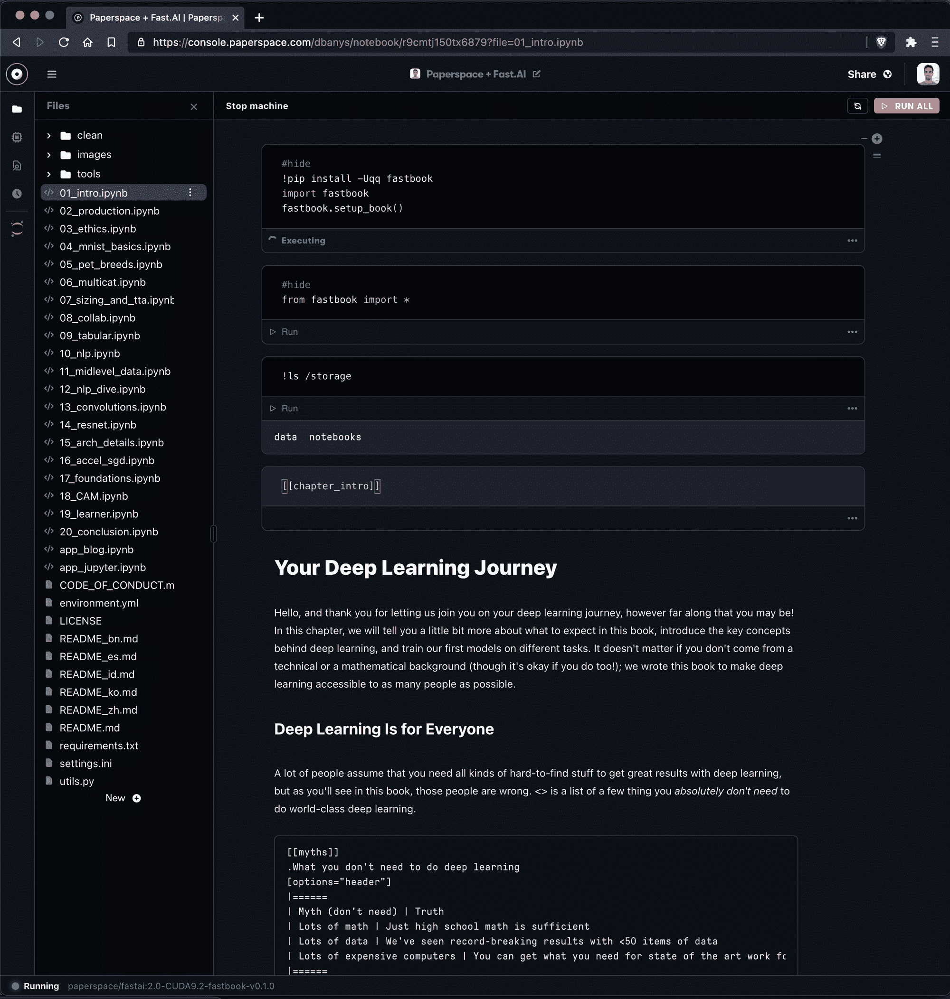
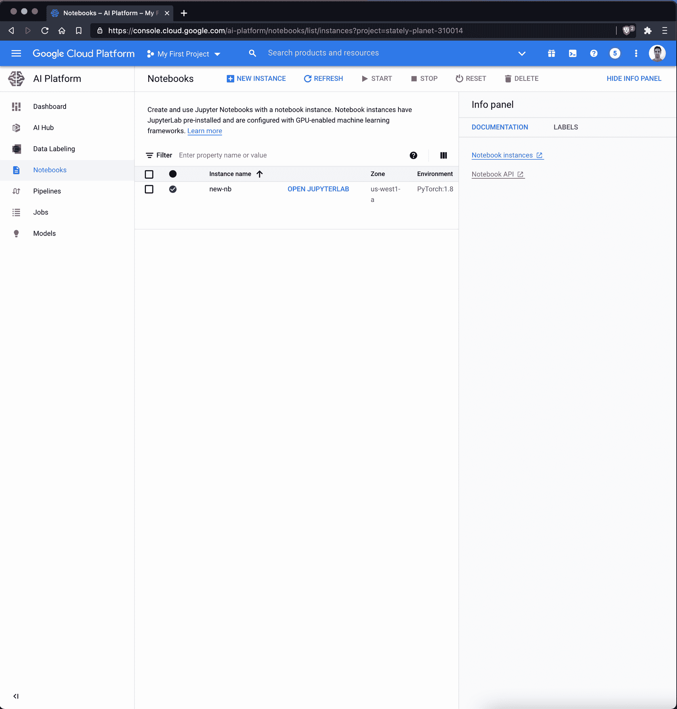
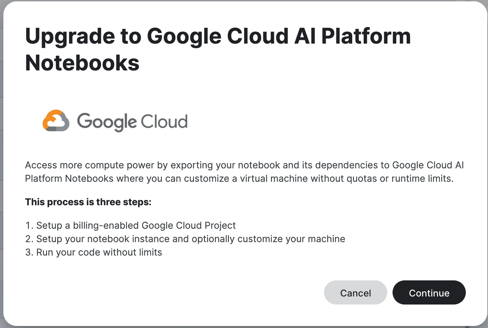

# 对比:谷歌的 AI 平台笔记本和 Paperspace 的渐变笔记本

> 原文：<https://blog.paperspace.com/google-cloud-platform-notebooks/>

谷歌云平台提供了一套名为 [AI Platform](https://cloud.google.com/ai-platform/) 的机器学习工具，其中包括标记数据、创建管道(通过 Kubeflow)、运行作业、部署模型以及创建可共享的基于云的笔记本的工具。

今天，我们将关注人工智能平台笔记本电脑——这是一款与来自其他公共云的企业笔记本电脑直接竞争的产品，如 [Azure 的机器学习笔记本电脑](https://blog.paperspace.com/azure-machine-learning-jupyter-notebooks-comparison-alternative/)和 AWS 的 SageMaker 笔记本电脑——我们将把它与 Paperspace Gradient 进行比较，paper space Gradient 是一款在可用性和功能方面进行竞争的产品。

# 谷歌在超大规模笔记本领域的地位

谷歌在机器学习领域拥有并运营着大量公司。需要明确的是，我们今天比较的目标是谷歌云平台的人工智能笔记本产品——而不是 Kaggle Kernels 或谷歌 Colab——尽管我们将在稍后的日期更深入地研究这些产品。

AI Notebooks are part of Google GCP's AI Project – and are a different product entirely than Google Colab or Kaggle Notebooks

**GCP 人工智能笔记本**(今天的对比)面向需要在云(GCP)上托管完整 JupyterLab 实例的企业客户，这些实例具有基于角色的访问控制和合规性保证等企业功能。

与此同时，Google Colab 是 JupyterLab 的“轻量级”版本，通常用作 ML 工程师进行探索工作的便笺本，并与合作者和公众共享最新的库和工具。

与此同时，Kaggle 内核是 Kaggle 社区的以数据科学为中心的“轻量级”JupyterLab 风格的 IDE 版本，它也支持 r。

尽管 Colab 和 Kaggle 内核各有利弊，但 AI 笔记本是谷歌在云中提供的唯一“完整”版本的 JupyterLab。谷歌笔记本产品之间的其他一些差异如下:

|  | Kaggle 笔记本 | Google Colab | GCP 人工智能笔记本 |
| --- | --- | --- | --- |
| 谷歌做的？ | 是 | 是 | 是 |
| 自由层 | 是 | 是 | 不 |
| 自由层 GPU | 1 个英伟达特斯拉 P100 | 1 x NVIDIA K80 | 不适用的 |
| 自由层会话限制 | 9 小时(60 分钟后重启) | 12 小时(90 分钟后重启) | 不适用的 |
| 语言支持 | Python 河 | Python，Swift | Python 河 |
| 下载笔记本？ | 不 | 不 | 是 |
| 费用 | 自由的 | 免费或每月 9.99 美元 | 实例定价 |
| JupyterLab or IDE | 仅限 IDE | 仅限 IDE | JupyterLab only |
| API 访问？ | 不 | 是 | 是 |
| 链接分享？ | 是 | 是 | 不 |

# Paperspace 渐变如何比较？

与谷歌相比，Paperspace 是一家年轻的公司，但在三个数据中心区域拥有近 50 万云 GPU 用户。2018 年初推出的【Paperspace Gradient 笔记本已经是最受欢迎的云笔记本之一，产品[由 Fast.ai](https://course.fast.ai/start_gradient) 作为云笔记本提供商正式推荐。

Paperspace Gradient 笔记本提供了谷歌人工智能平台笔记本的一些专业吸引力(如强大的 GPU 实例、团队协作和从您自己的容器中构建)，但具有 Kaggle 内核和谷歌 Colab 用户喜欢的许多可用性功能-如能够在几秒钟内启动笔记本，并通过按下按钮来邀请合作者。

Console view of a Paperspace Gradient notebook running the latest version of Fast.ai's **[Practical Deep Learning for Coders](https://course.fast.ai/start_gradient)**

# TL；博士；医生

谷歌人工智能平台笔记本电脑是企业级笔记本电脑，最适合那些有合规要求的人，那些需要从 BigQuery 等 GCP 来源获取数据的人，以及那些已经在 GCP 生态系统中并可以利用现有计算实例的人。

缺点是，人工智能平台笔记本需要大量的设置时间，需要 GCP 实例来为笔记本提供资金，并且有一些令人困惑的界面怪癖，使其难以快速启动和运行——甚至难以完成一些基本任务。

# 深度看 GCP 上的云 AI 笔记本

谷歌为机器学习提供软件工具全生命周期的努力被称为 AI 平台。

AI 平台被宣传为“端到端的机器学习生命周期”，包含以下组件:

*   准备-[big query](https://cloud.google.com/bigquery/)、[云存储、](https://cloud.google.com/storage/)、[数据标注服务](https://cloud.google.com/ai-platform/data-labeling/docs/)
*   build-[AutoML](https://cloud.google.com/automl/)， [AI 项目笔记本](https://cloud.google.com/ai-platform/notebooks/docs/)
*   验证-[人工智能解释](https://cloud.google.com/explainable-ai/)、[假设分析工具](https://pair-code.github.io/what-if-tool/)、[维兹尔](https://cloud.google.com/ai-platform/optimizer/docs/overview)
*   部署-[预测](https://cloud.google.com/ai-platform/prediction/docs/overview)、[汽车视觉边缘](https://firebase.google.com/docs/ml/automl-image-labeling)、[腾迅企业](https://cloud.google.com/tensorflow-enterprise/)
*   MLOps-[管道](https://cloud.google.com/ai-platform/pipelines/docs)

用谷歌的话说，人工智能项目笔记本是“构建”步骤的一部分。该产品不同于其他谷歌支持的笔记本选项，如 Kaggle Notebooks 或 Colab，因为这些笔记本由特定的(可能比你在 Kaggle 上获得的 P100 或 Colab 的 K80 更强大)GCP 实例支持。

Notebooks view in GCP AI Platform Notebooks

如前所述，谷歌有 3 款笔记本产品:

1.  人工智能平台笔记本
2.  Google Colab
3.  Kaggle 笔记本

谷歌人工智能平台笔记本相对于谷歌 Colab 和 Kaggle 笔记本来说，功能更加全面。

人工智能平台笔记本电脑是为企业用户设计的。事实上，Kaggle 有几个提示鼓励你升级到 AI 平台笔记本。

所以 AI 平台笔记本是谷歌在笔记本方面最高的产品。

Google Colab 和 Kaggle 笔记本的用途要广泛得多，但是没有享受到 AI 笔记本的健壮性和可扩展性。

例如，如果您需要创建不可抢占的笔记本，或者可以在多个 K80 GPU 上运行的笔记本，或者任何数量的任何其他场景，您将需要使用 AI 项目笔记本来满足这些要求。

# 特征比较

总的来说，梯度笔记本和 AI 平台笔记本提供了一个全功能和受管版本的 JupyterLab，具有一些关于数据摄取、计算管理等的附加功能。

让我们比较一下 Paperspace Gradient 和 AI 平台笔记本:

|  | 谷歌人工智能平台笔记本 | 图纸空间渐变笔记本 |
| --- | --- | --- |
| **成本** | 新用户可获得 300 美元的免费积分 | 免费的 CPU 和 GPU 笔记本电脑 |
| **资源** | 任何 GCP 实例 | 任何图纸空间实例 |
| **从零要求开始** | 信用卡，GPU 批准 | 免费的 CPU 和 GPU，无需信用卡或批准 |
| **启动时间** | 计算需要几分钟来初始化 | 计算需要几秒钟来初始化 |
| **自动关机** | 不* | 是 |
| **Jupyter 笔记本选项** | 是 | 是 |
| **JupyterLab Option** | 是 | 是 |
| **从容器构建** | 是 | 是 |

**有许多需要自定义代码的变通方法。一个例子使用 Google 的云调度器，另一个例子需要编写一个 cronjob，通过 API 访问实例。更多关于[堆栈溢出](https://stackoverflow.com/questions/58830867/gcp-auto-shutdown-and-startup-using-google-cloud-schedulers)的信息。*

# 成本比较

谷歌人工智能平台笔记本运行在 GCP 实例上，定价非常难以预测。

以下是基于 GPU 类型的谷歌人工智能平台笔记本价格的尝试:

| 实例类型 | 图纸空间渐变笔记本 | 实例类型 | 谷歌人工智能平台笔记本 |
| --- | --- | --- | --- |
| 免费(M4000) | 每小时 0.00 美元 | A100 | $2.93/GPU/hr |
| 免费(P5000) | 每小时 0.00 美元 | T4 | $0.35/GPU/hr |
| P4000* | 每小时 0.51 美元 | P4 | $0.60/GPU/hr |
| P5000* | 每小时 0.78 美元 | V100 | $2.48/GPU/hr |
| P6000* | 每小时 1.10 美元 | P100 | $1.46/GPU/hr |
| V100* | 每小时 2.30 美元 | K80 | $0.45/GPU/hr |
| P5000 x4* | 每小时 3.12 美元 | - | - |
| P6000 x4* | 每小时 4.40 美元 | - | - |

Paperspace 的付费实例需要订阅计划，而 GCP AI 笔记本不需要订阅。梯度订购层级如下:

| 梯度订阅类型 | 费用 | 细节 |
| --- | --- | --- |
| 自由的 | 0 美元/月 | -仅免费实例
-笔记本是公共的
-限制 1 台并发笔记本
-每次会话最多限制 12 小时
- 5GB 永久存储 |
| G1(个人) | 8 美元/月 | -免费和付费实例
-私人笔记本
-限制 5 个并发笔记本
-无限会话长度
- 200GB 永久存储 |
| G2(个人) | 24 美元/月 | -免费和付费实例
-私人笔记本
-限制 10 个并发笔记本
-无限会话长度
- 1TB 永久存储 |
| T1(团队) | 12 美元/用户/月 | -免费和付费实例
-私有笔记本
-限制 10 个并发笔记本
-无限会话长度
- 500GB 持久存储
-私有团队协作
-私有托管集群 |
| T2(团队) | 49 美元/用户/月 | -免费和付费实例
-私有笔记本
-限制 50 个并发笔记本
-无限会话长度
- 1TB 持久存储
-私有团队协作
-私有托管集群 |

# 入门指南

## 使用谷歌 GCP 的人工智能平台设置 Jupyter 笔记本:

*   如果需要，创建一个 GCP 帐户(您可以使用现有的谷歌帐户)
*   导航到 GCP 控制台([链接](https://console.cloud.google.com))并为该帐户启用计费
*   同意条款并添加信用卡
*   一旦你的信用卡再次通过验证，请访问 GCP 控制台
*   从 GCP 工具条中，选择人工智能>人工智能平台>笔记本
*   创建一个新实例，并选择要运行的计算。您将根据所选实例的大小付费。
*   *注意:GCP 目前为新账户提供 300 美元的信贷*

## 在图纸空间渐变中设置 Jupyter 笔记本

若要开始使用渐变笔记本:

*   创建一个 Paperspace 帐户([链接](https://console.paperspace.com/signup))
*   导航到渐变>笔记本，并选择创建笔记本
*   输入笔记本的名称、运行时(可选)，并选择一个实例
*   如果你选择了一个自由的 CPU 或自由的 GPU 实例，选择开始笔记本，就是这样！(付费实例需要信用卡。)
*   *注意:Paperspace 提供对自由层 CPU 和 GPU 支持的笔记本电脑的无限制使用*

# 启动时间

任何云提供商都需要一些时间来启动 CPU 或 GPU 实例。GCP 人工智能平台创建第一个资源大约需要 3 分钟，而 Paperspace 大约需要 30 秒。

# 结论

谷歌有三款云笔记本产品——Google Colab、Kaggle 笔记本和 AI 平台笔记本——每一款都有不同的优势，从社交(例如 Kaggle)到强大(AI 平台笔记本)。

AI 平台笔记本电脑是一种企业产品，专为那些拥有监控访问控制和资源消耗的 IT 功能的公司而设计。该产品最适合已经充分利用 GCP 资源的公司——因为与 GCP 计算实例和 BigQuery 等 GCP 数据管理工具的集成是人工智能平台笔记本可用性的关键。

同时，Paperspace Gradient 笔记本电脑还提供可扩展性(通过 Paperspace 云或已配置的公共云中的其他集群)和更多功能，让您更快地启动和运行，包括链接共享、轻松的协作者管理、共享您的工作的公共“梯度运行”链接、简单的计费等。

我们希望您喜欢这个比较！

要阅读该比较系列的更多内容，请查看[比较:Azure ML 笔记本和渐变笔记本](https://blog.paperspace.com/azure-machine-learning-jupyter-notebooks-comparison-alternative/)或访问 [Paperspace Learn](https://learn.paperspace.com/) 。