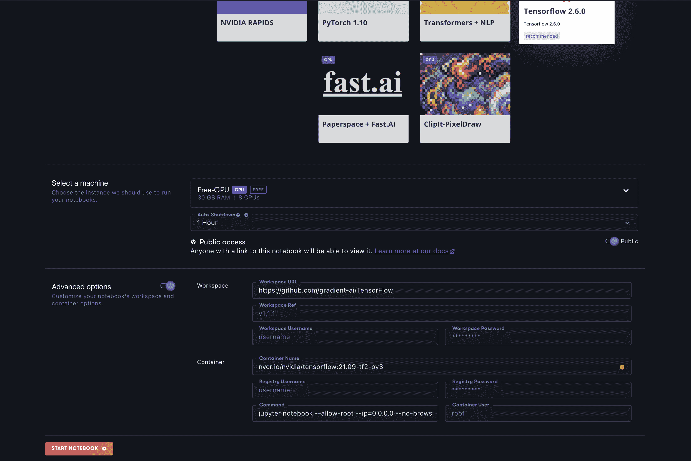
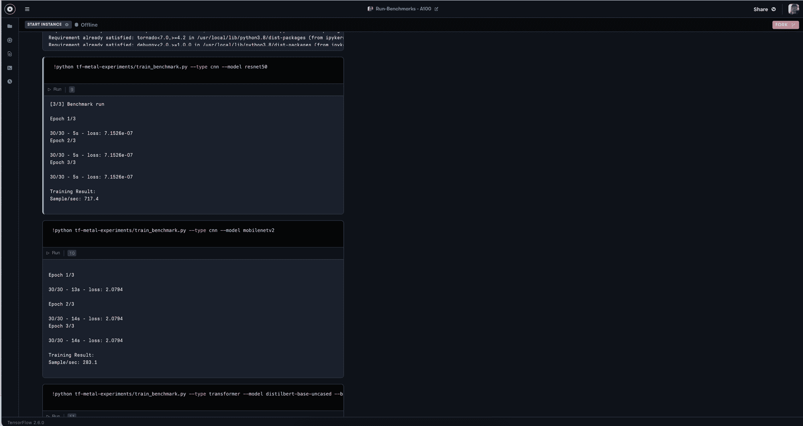

# Gradient 上的免费 GPU 有多厉害？

> 原文：<https://blog.paperspace.com/gpu-benchmarking/>

在选择平台、实例类型或 GPU 来进行机器学习时，根据手头的情况优化您的硬件非常重要。首先，大多数阅读本文的人关心三个因素:功率、可访问性和成本。

获得足够强大的 GPU 对于完成许多涉及大数据、机器学习和深度学习的任务至关重要。持续轻松地访问这些强大的 GPU 可确保用户能够完成他们需要 GPU 完成的任务。成本是所有用户在计划一项需要高计算费用和易于访问的任务时必须考虑的平衡。

梯度上也是如此。通过让我们的免费层用户免费访问 Quadro M4000，许多用户可以获得他们需要的电源。我们的 Pro plan 用户每月支付 8 美元，甚至有更好的好处:所有 Pro plan 用户都可以免费获得带有 RTX4000、P4000、RTX5000 和 P5000 GPUs 的实例。最后，用户可以访问更强大的 GPU 实例，如 A100，只需支付订阅费用和额外的每小时费用(在本例中为 3.09 美元/小时)。

本文旨在为寻求最佳平衡的用户提供指导。使用以下关于可用机器的见解和事实，帮助您做出关于渐变项目所需实例的明智决策。

## 快速事实:


| GPU 类型 | 免费？ | 内存带宽(GB/秒) | FP32 带宽(TFLOPS) | CUDA 核心 | CPU 核心的数量 | 内存大小(千兆字节) |
| 免费 M4000 | 是 | One hundred and ninety-two | Two point six | One thousand six hundred and sixty-four | eight | eight |
| P4000 | 是的，在专业计划上 | Two hundred and forty-three point three | Five point three | One thousand seven hundred and ninety-two | eight | eight |
| RTX4000 | 是的，在专业计划上 | Four hundred and sixteen | Seven point one | Two thousand three hundred and four | eight | eight |
| P5000 | 是的，在专业计划上 | Two hundred and eighty-eight | Eight point nine | Two thousand five hundred and sixty | eight | Sixteen |
| RTX5000 | 是的，在专业计划上 | Four hundred and forty-eight | Eleven point one five | Three thousand and seventy-two | eight | Sixteen |
| A100 | 不 | One thousand five hundred and fifty-five | Nineteen point five | Six thousand nine hundred and twelve | Twelve | Forty |

以上是之前列出的可供免费用户使用的 GPU 的细分，以及最强大的单个 GPU A100 的基准数据。

通过比较每个单元的 RAM 和 CUDA 内核数量，您可以看到，底层架构会影响每个 GPU 的整体处理速度。这一点最明显的体现在 CUDA 核心数量和内存带宽上:RTX 系列 GPU 的 CUDA 核心数量明显更多，与相应的 Pascal 系列 GPU 相比，在相同的内存级别上实现了更快的内存带宽。

现在，我们已经了解了可用的硬件是如何变化的，让我们看看它们在一系列基准测试中的实际表现

## 基准测试

#### 测试本身

[tf-metal-experiments](https://github.com/tlkh/tf-metal-experiments) 是由用户 tlkh 创建的 GitHub repo，旨在帮助他们比较苹果 M1 系列芯片与传统 GPU 的机器学习性能。测试本身旨在评估 TensorFlow CNN 或 HuggingFace Transformer 模型成功训练所需的时间，并输出结果以衡量每秒可处理的样本数量。

那些试图利用这个测试的人需要确保他们进行测试的环境安装了 TensorFlow 和 HuggingFace 的变形金刚库。这些将用于执行基线测试。

对于下面的这个基准测试示例，我将使用与原作者相同的 4 个测试模型框架:ResNet50、MobileNetv2、DistilBert 和 BertLarge。由于我们正在测试的最弱 GPU Quadro m 4000 的性能相对较弱，我们必须限制所有测试的批量大小，以便每台机器都能够在不耗尽内存的情况下完成每个基准测试。

除了可用的最强大的单个 GPU A100 之外，所有测试都相继完成，并且分析了所有 free 和 free for Pro 实例类型。

*注:这些结果是我自己的，并且是使用渐变进行的。如果您想复制这些结果，请遵循本文底部的指南。*

要查看我们在 Paperspace 上提供的其他 GPU 类型，请查看我们的[文档页面](https://docs.paperspace.com/gradient/more/instance-types)中的指南。

#### 结果呢


| GPU 类型 | ResNet50，批量= 32(样品/秒) | MobileNetv2，批量= 32(样本/秒) | 蒸馏仪，批量= 8(样品/秒) | BertLarge，批量= 4(样本/秒) |
| 免费 M4000 | 58, 56.6, 56.7 | 67.2, 65.7, 65.9 | 32.4, 32.6, 32.6 | 5.2, 5.1, 5.1 |
| P4000 | 105, 105.1, 104.4 | 159.5, 159.3, 158.5 | 63.6, 63.4, 63.6 | 9.9, 8.8, 8.8 |
| RTX4000 | 153.5, 154.3, 154 | 242.2, 243, 241.9 | 108.7, 107, 106.3 | 16.7, 16.3, 16.4 |
| P5000 | 133.2, 133.5,133.2 | 185.3, 187.5,184.6 | 80.6, 80.5, 80.6 | 15.2, 15.2, 15.1 |
| RTX5000 | 182.5, 181.3, 181.2 | 263.8, 262.8, 261.4 | 135.2, 134.3, 133.8 | 21.4, 21.4, 21.3 |
| A100 | 561.3, 616, 618 | 276.9, 273, 276.2 | 510.7, 507.8, 507.5 | 81.4, 81.3, 80.7 |

正如预期的那样，训练率的结果因实例类型而异。表现最差的不出所料是 M4000，它是我们列表中最老、最弱的 GPU。作为每个类别中表现最差的人，我们也可以将其作为一个很好的比较点。例如，在两个 BERT transformer 基准测试中，A100 的性能都比 M4000 快 16 倍，尽管可用内存只有 m 4000 的 5 倍。这在很大程度上是基础架构一代又一代进步以及 CUDA 内核随之增加的结果。

在专业级用户无需支付额外费用的 GPU 中，RTX5000 是每个类别中的明显赢家。尽管在 CUDA 内核和 RAM 方面存在显著差异，但 RTX5000 在 MobileNetV2 基准测试中的表现甚至与 A100 不相上下。这表明，我们的专业层用户在使用 MobileNetv2 等特别轻的型号时，除了订阅 Paperspace 之外，可以免费获得几乎与 A100 相同的功率。这有一些直观的意义；RTX 图形处理器是基于图灵微架构，安培的直接前身。

总的来说，RTX5000 在其价格点上表现非常好，我建议我们的专业用户尽可能使用这种设备。

## 复制这些基准

虽然上述指标为用户应该为渐变选择什么 GPU 提供了很好的见解，但我们自己测试这些结果总是更好。如果您想重现上述测试的结果，请使用以下指南。

首先，登录到 Paperspace Gradient 并创建一个笔记本。对于您的运行时，选择 TensorFlow。



Here is what set up should look like if you wanted to run a benchmark on a M4000

其次，选择您有兴趣测试的实例。鉴于上面的结果可供比较，我建议您从列出的“免费 GPU”(m 4000)之一开始。

第三，切换页面底部的高级选项，粘贴“[https://github.com/tlkh/tf-metal-experiments](https://github.com/tlkh/tf-metal-experiments)”作为工作区的 URL。

第四，推出笔记本。

第五，当实例运行时，在渐变笔记本中创建一个新的 iPython 笔记本。请注意，以下步骤是在 ipynb 单元中执行的，以便于记录基准测试的分数，但它们也可以直接在终端中运行。

第六，在一个新的单元格中粘贴以下内容:

```py
# run each time you make a new instance
!python3 -m pip install --upgrade regex --no-use-pep517
!pip install transformers ipywidgets
```

最后，选择您想要运行的测试，并将其粘贴到要运行的单元格中。如果您想准确地重现我的测试，请在单个单元格中运行以下命令:

```py
!python tf-metal-experiments/train_benchmark.py --type cnn --model resnet50 --bs 32
!python tf-metal-experiments/train_benchmark.py --type cnn --model mobilenetv2 --bs 32
!python tf-metal-experiments/train_benchmark.py --type transformer --model distilbert-base-uncased --bs 8
!python tf-metal-experiments/train_benchmark.py --type transformer --model bert-large-uncased --bs 4
```

您的结果将以每秒样本数的形式输出:



## 结论

甚至 Gradient 上免费提供的 GPU 也足够强大，可以为 ML/DL 运行大型复杂的训练，例如 BertLarge 架构所需的训练。对于这样一项任务，运行如此昂贵的培训过程的成本是显而易见的:M4000 的培训时间将是 A100 的近 16 倍，但培训仍然完成了。

这个基准测试练习旨在展示使用更快的 GPU 有多大优势，不是通过展示它们对于适当复杂的任务是必需的，而是通过展示正确的硬件可以让处理计算成本高昂的任务快多少。因此，我鼓励这篇文章的读者考虑一下他们的时间相对于 GPU 成本的价值。花一个小时等待一个模型在你的 GPU 上训练远不如花一个小时验证和测试那个模型有价值。