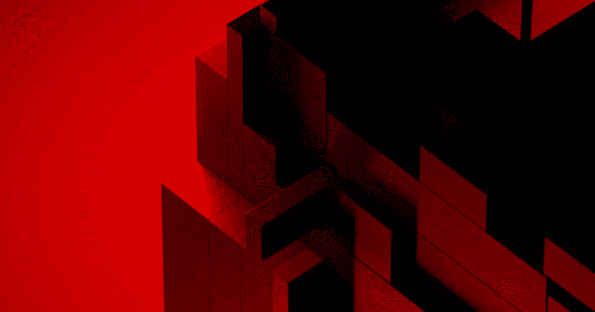
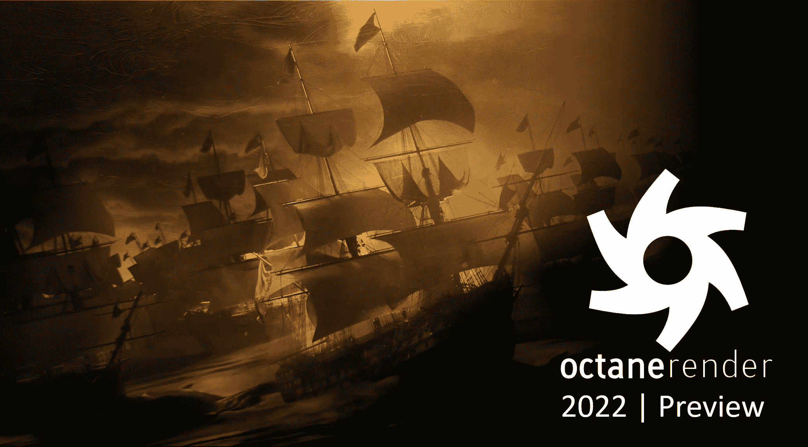
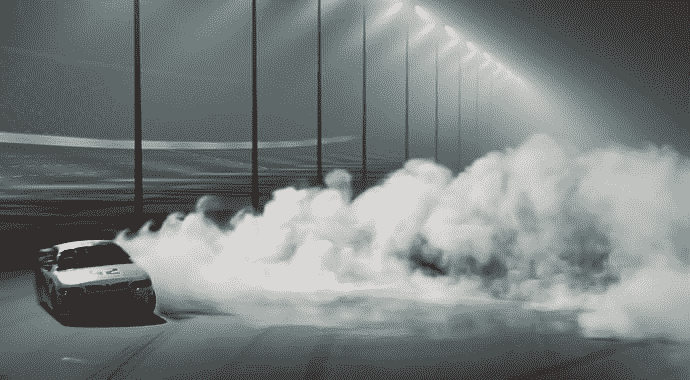

# GPU 渲染序列背后的精彩

> 原文：<https://blog.paperspace.com/gpu-rendering-with-core/>

在本文中，我们将讨论 GPU 渲染幕后的魔力以及被称为 GPU 渲染的 3 大 GPU 渲染引擎。这篇文章中的信息旨在帮助你做出明智的职业选择。

## GPU 渲染:简介

单词**‘rendering’**来源于图形领域，其中渲染是艺术家对新结构的表现。计算机辅助设计(CAD)中的渲染是将 3D 模型的某个角度转换为逼真的图像。它既包括像美食家阴影这样的基本照明技术，也包括模拟阴影、反射和折射的更复杂的效果。它可能还包括给表面不同的纹理。

> **快速提示:GPU 是连接到计算机主板的专用单元-** 在当代系统中，GPU 用于渲染、人工智能、机器和深度学习、大数据应用、游戏和数据挖掘。

作为一个术语，渲染指的是简单地赋予事物生命。有不同的方法可以进行渲染，其中一种是使用图形处理单元(GPU)。渲染过程受益于 GPU 中数千个微小的低功耗内核执行的并行数据计算。由于其并行处理能力，GPU 可以快速轻松地计算大量数据。

现在你明白了什么是 GPU 和渲染，我们可以说: **GPU 渲染是使用图形处理器，使用计算机程序从模型中自动创建二维或三维图像的过程。**

图形要求苛刻的应用程序拖累了 CPU 并影响了处理性能，导致了 GPU 的引入。GPU 渲染不使用 CPU，而是使用显卡来渲染数据。由于 GPU 是专为快速图像渲染而构建的，因此这种技术可以显著加快渲染速度。

## 为什么使用 GPU 进行渲染

GPU 加速渲染是各种应用程序的热门选择，包括建筑、动画、电影和产品设计等领域的照片级渲染。其他应用包括 GPU 加速分析、3D 模型图形、游戏中的神经图形处理、虚拟现实和人工智能创新。

虽然 CPU 和 GPU 处理数据的方式基本相似，但 GPU 更强大，可以更快地执行有限的任务。这与 CPU 处理各种活动的能力形成对比。

只有在某些工作中，GPU 明显比 CPU 快。由于使用相同的图形卡进行渲染和显示时的交互性问题，或者由于内存不足，GPU 生成复杂场景的能力可能会受到限制。

以下是使用 GPU 渲染工作负载的理由:

*   与 CPU 相比，GPU 渲染技术使用更少的能量
*   速度提升——许多当代渲染系统与 GPU 硬件和软件兼容，这些系统专为大规模并行工作负载而构建，可以提供更高的整体性能
*   由于计算能力的提高，硬件变得更便宜
*   与 CPU 相反，为计算机添加额外的 GPU 要简单得多，并且会提高性能(在一定程度上)。因此，从这个意义上来说，它们具有难以置信的适应性和可扩展性
*   通过 Paperspace Core 等在线服务轻松访问

在讨论 4 大 GPU 渲染引擎之前，我们先来讨论一下渲染的特性和组件。

## GPU 渲染的独特功能和方面

以下是基于 GPU 的渲染系统的显著特征:

*   **快速**-GPU 专为并行计算而生，受益于几个内核的性能。当处理成千上万的微内核时，可以获得相当大的速度。模型在 GPU 上的渲染速度比在 CPU 上快得多。这种速度有助于快速迭代和渲染的实时可视化。
*   **效率-** 制造商在设计 GPU 时考虑了特定的功能。不同的 GPU 适用于不同的任务，如渲染、设计和游戏。为渲染而设计的 GPU 可以更快地给出可靠的结果，这使得它们更省时。他们也很好地渲染场景。
*   **新技术的出现-** 自诞生以来，GPU 取得了显著进步。GPU 的性能随着每次后续迭代呈指数级增长。由于 GPU 比 CPU 更频繁地接收更新，渲染性能逐年提高。
*   **合理的低成本-** 像 Threadripper 3990x 这样的高端 CPU 比 RTX 3090 这样的高端 GPU 更贵。此外，GPU 易于升级，使得在单个系统上组合一个或多个 GPU 变得简单，每个 GPU 都专用于执行特定的任务。GPU 较低的入门成本使更多人可以使用它，使他们能够在预算有限的情况下开始渲染。对于租用 GPU 的远程访问来说尤其如此，其成本可以用每小时的美分来衡量。
*   **视口性能** -视口是一个窗口，可让您查看根据您的输入设置所做的调整。快速的工作流程源于快速的视口可视化。既然 GPU 擅长一次处理多个作业，这将导致输入的快速执行，从而加速视口渲染。修改几乎是实时可见的。

## 前三大 GPU 渲染引擎

如上所述，GPU 渲染概念是在多个内核上对大量数据执行，将并行处理集中在一个特定的活动上。由于 GPU 渲染时间的减少，有许多不同的渲染引擎使用 GPU 渲染。

特别是，在多个 GPU 上同时渲染比在单个 GPU 上渲染快 5 倍、10 倍或 20 倍。因此，世界上一些顶级品牌主要致力于创建增强多 GPU 性能的解决方案。

Redshift、Octane 和 Vray 是当今使用的一些流行的多 GPU 渲染引擎。这些引擎已经取得了巨大的进步，并且在受欢迎程度和渲染速度方面正在迅速超越基于 CPU 的渲染引擎。

### 红移

强大的 GPU 加速渲染器 Redshift 旨在满足当今大规模生产渲染的独特需求。Redshift 提供了一系列强大的功能，与业界广泛使用的 CG 应用程序相连接，旨在为各种规模的创意个人和工作室提供服务。

#### 主要特征

*   **除了基本的几何和纹理-** Redshift 的有效内存管理支持渲染具有数 TB 纹理数据和数亿多边形的场景。
*   **通用照明-** 使用基于偏置点的 GI 方法和强力 GI 来提供闪电般的间接照明。
*   **代理-** 红移代理文件，可以很容易地被其他场景引用，可以被用户用来导出对象和灯光组。代理为生产中经常需要的着色器、遮罩和可见性标志提供了强覆盖。
*   **命令行渲染-** 用户可以使用 Redshift CMD Line 工具导出他们的场景，并独立于他们的 3D 应用程序进行渲染。

[Application Manager - MaxonOur Application Manager allows you to manage the installation, licensing, upgrades, and updates for all your Maxon products.Maxon](https://www.maxon.net/en/try)

Try Redshift on your Paperspace Core machine today!

### 辛烷

简单地说，Octane 是一个 GPU 渲染引擎，它采用了一种计算最终生成的图片的方法，这种方法寻求照片真实感。采用 GPU 技术，类似阿诺德。Octane 是世界上第一个也是最快的物理精确、无偏见的 GPU 加速渲染器。目前，它被用于主要的电影，广告，甚至建筑渲染。一旦 Octane 可以在云上使用，预计它将更多地融入这些企业的创意流程。

#### 主要特征

*   与 CPU 渲染相比，GPU 渲染技术的一个好处是你可以多快地渲染一张图片。如果您目前正在使用 Cinema 的物理或传统渲染，您会意识到即使对于一个简单的场景，渲染一帧也可能需要几分钟。简单的序列像黄油一样被辛烷分割，变成秒。
*   **借助实时查看器，Octane 将加速您的工作流程-** 交互式预览区域是使用任何第三方渲染引擎(IPR)的主要优势。IPR 的时髦术语是 LiveViewer。用户可以非常即时地查看渲染的场景。尤其是考虑到 Octane 使用 GPU 执行渲染。当一个对象被修改，一个光被添加，或者一个纹理属性被改变，IPRs 立即更新。太棒了。
*   octane 有一个很大的社区- 有很多平台可以找到 Octane 用户，并在遇到任何问题时提供帮助。

[Octane 2022 Preview is Here with KitBash3D, Greyscalegorilla Plus and more!OTOY® announces the next-generation of the industry’s first and fastest unbiased GPU renderer Octane 2022 with monthly KitBash3D Kits and full commercial access to Greyscalegorilla Plus, World Creator, EmberGenFX, Architron, LightStage MetaFace scans, and Render.OTOY](https://home.otoy.com/render/octane-render/demo/)

Try Octane on your Paperspace Core machine today!

### Vray GPU

V-Ray GPU 生成的输出等同于其他渲染器的输出，同时通过利用所有的 GPU 和/或 CPU 来提高交互性能。现在，V-Ray Next GPU 可以通过利用 NVIDIA RTX 级 GPU 中的专用光线跟踪硬件来加速产品渲染。V-Ray GPU 支持任何支持 CUDA 的 GPU，包括过去 7 年的大多数 NVIDIA GPUs。

#### 主要特点

*   **GPU + CPU 渲染-** 在 CPU 和 NVIDIA GPUs 上，V-Ray GPU 渲染产生相同的结果。添加 CPU 有助于减少 13%和 25%的渲染时间。速度的提高是好的，而不是让这些强大的 CPU 闲置。

[V-Ray GPU | GPU rendering by ChaosV-Ray® GPU is full-featured 3D GPU rendering software that delivers fast, photorealistic results and instant feedback while you work.GPU rendering by Chaos](https://www.chaos.com/vray-gpu#free-trial)

Try Vray on your Paperspace Core machine today!

## 总结

你正在通过使用 GPU 引擎进入未来。使用 GPU 获得的速度提升是难以否认的，即使仍然有许多充分的理由利用 CPU 渲染引擎。

与计算机的任何其他组件相比，GPU 的升级也要简单得多。在使用 GPU 几年后，随着技术的进步，你可以打开 PC 的侧面，用新卡替换旧卡。如果你想要最新、最快的 CPU，你不必总是创建一个全新的系统。你现在可以把钱存起来，花在必需品上。