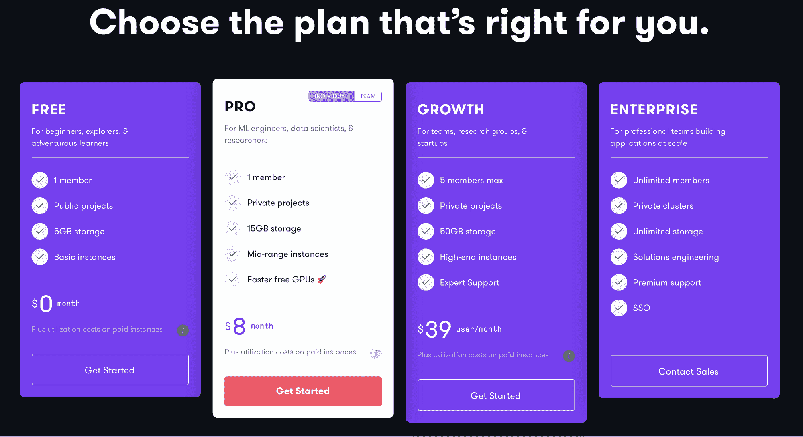
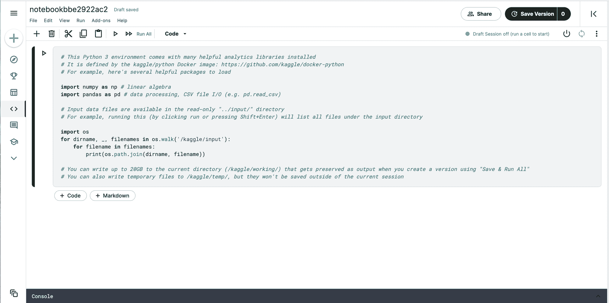
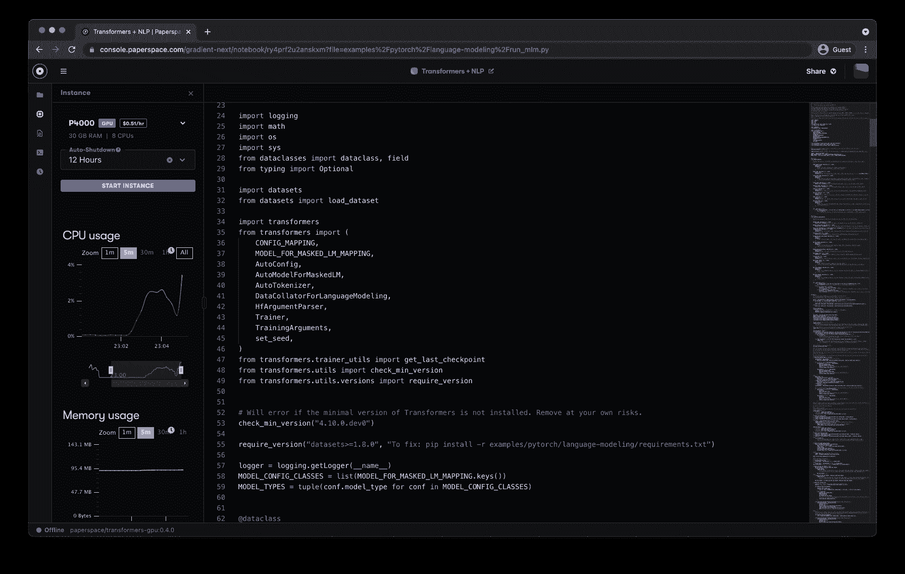

# 比较 Gradient 和 Kaggle 的免费 GPU 访问和可用资源

> 原文：<https://blog.paperspace.com/gradient-kaggle-notebook-comparison/>

# 介绍

Kaggle 是 Google 的一个流行的代码和数据科学工作区，支持大量数据集和公共数据科学笔记本。

Paperspace Gradient 是一个用于构建和扩展真实世界机器学习应用程序的平台，Gradient Notebooks 是一个基于 web 的 Jupyter IDE，带有免费的 GPU。

在这篇博文中，我们将看看 Google Kaggle 和 Paperspace Gradient，并根据使用案例确定每个产品的优势和劣势。

我们开始吧！

# 什么是机器学习的好工作空间？

好的机器学习管道的关键是可访问性。这包括获得良好的信息，一个强大的处理环境，以及一个可靠的传播结果和训练模型的方法。

机器学习工程师和数据科学家经常在数据科学探索的一个或多个阶段遇到挑战。

Kaggle 在提供可访问的公共数据集方面取得了巨大成功。Kaggle 擅长维护丰富的数据集，并为数据科学竞赛提供基础。

Gradient 已经成功地为 GPU 提供了加速的计算实例，并为在该平台上生产项目提供了可行的途径。

这篇博客将试图分析两种方法之间的差异 Kaggle 的方法和 Gradient 的方法——在他们试图建立一个功能齐全的机器学习探索和 MLOps 平台的过程中。

本文的每一节都将比较和对比这两种产品的不同方面或特性，您可以使用右边的目录导航到每一节。

# 绘图处理器

Kaggle 和 Gradient 都提供免费的 GPU。让我们来看看免费的 GPU 类型。

## 可用的免费类型

|  | 卡格尔 | 渐变笔记本(免费) | 渐变笔记本(付费) |
| --- | --- | --- | --- |
| 类型 | P100 | M4000 | P5000 |
| 核心 | Two | eight | eight |
| 内存(GB) | Thirteen | eight | Sixteen |

#### 卡格尔:

GPU: TESLA P100，带 2 个 CPU 内核和 13 GB 内存

TPU: TPU v3-8，带 4 个 CPU 内核和 16 GB 内存

#### 渐变:

GPU:空闲层:带有 8 个 CPU 内核和 8 GB RAM 的 QUADRO M4000

Pro tier(用户以每月 8 美元的价格免费使用更多 GPU):带有 8 个 cpu 内核和 8 GB RAM 的 QUADRO P4000，带有 8 个内核和 16 GB RAM 的 QUADRO P5000，以及带有 8 个 CPU 内核和 8 GB Ram 的 Quadro RTX4000

TPU:不适用于坡度

## 易接近

#### 卡格尔:

对于 Kaggle 上的每种类型的处理器，GPU/TPU 访问被限制在每周 30 小时。由于高需求，也有可用性问题，所以你可能会被放在一个队列中，要求在他们的笔记本电脑平台的 GPU。

#### 渐变:

GPU 访问仅受可用性限制。

## 免费 GPU 可用性

#### 卡格尔:

每个笔记本编辑会话在被中断之前有 9 个小时的可用执行时间，只有 20 分钟的空闲时间(这意味着 20 分钟的不活动将导致内核关闭)。

#### 渐变:

GPU 访问仅受可用性限制。每个 free-GPU 实例将在运行 6 小时后关闭，但在此期间有无限的空闲时间。

# 定价

#### 卡格尔:

Kaggle 在实际的 Kaggle 平台上是完全免费的。然而，你可以在谷歌云项目的付费版本上访问 Kaggle 笔记本，这就是 Kaggle 用户如何使用不同的 GPU、docker 容器等来访问更多可定制的环境。然而，实际的设置过程可能非常复杂且耗时，因此我们建议您遵循[本指南](https://www.kaggle.com/getting-started/234090)。

Gradient Pricing

#### 渐变:

Gradient 为个人客户提供了三个价格等级，每个价格等级的免费 GPU 数量和质量都在增加。[第一个付费层以每月 8 美元的价格扩展到 3 种新的免费 GPU 类型和 15 GB 存储。](https://gradient.run/pricing)

# 资源

### 卡格尔:

竞赛:基于社区的产品，竞赛允许 Kaggle、第三方和用户创建和参与 ML 相关的竞赛。众所周知，这里是这类比赛最受欢迎的地方之一，也是世界著名的 Netflix 奖的举办地。

笔记本:类似 IDE 的 Jupyter 笔记本，带有代码和 markdown 单元、一个终端和一个可定制的环境(仅 CPU、GPU 或 TPU)。作为用户可以对易于访问的 Kaggle 数据集进行 ML 和数据分析的地方。

### 渐变:

笔记本:类似 IDE 的 Jupyter 笔记本，有代码和 markdown 单元、终端、日志、版本和非常可定制的环境。用户可以在这里探索自己的数据，对自己的数据或[在梯度存储](https://docs.paperspace.com/gradient/data/data-overview/private-datasets-repository/public-datasets-repository)中公开存储的数据进行 ML 和数据分析，并准备建立 ML 管道。

[工作流](https://gradient.run/workflows):一旦探索和初始分析完成并确定了工作流，工作流允许用户通过连接到 GitHub 来动态更新他们的建模管道。这允许随着进展进行模型的版本化开发。

[部署](https://gradient.run/deployments):一旦最终确定的模型被确定并保存到 [Gradient 的持久存储](https://docs.paperspace.com/gradient/explore-train-deploy/workflows/gradient-actions#model-create)，部署资源允许用户通过几个简单的步骤将其新模型部署为 API 端点，从而避免了 Kubernetes、Docker 和框架设置的许多令人头疼的问题。

# 储存；储备

#### 卡格尔:

用户大多被限制使用 Kaggle 的内置存储。他们可以通过他们的客户端连接到 AWS s3 或类似的产品，但与仅使用 Kaggle 数据集功能相比，这是笨重的。

所有笔记本电脑的工作数据总量不得超过 20 GB。

#### 渐变:

在 Gradient 上，用户可以使用大量的存储服务，包括 Gradient 自带的持久存储、AWS s3、[等等](https://docs.paperspace.com/gradient/data/data-overview/private-datasets-repository/storage-providers)。

自由层用户在 Gradient 的永久存储上将被限制为每台笔记本电脑有 5 GB 的自由存储空间(在任何给定时间最多可进行五个项目和运行一台笔记本电脑)。超额部分将按每 GB 存储 0.29 美元收取费用。

# 笔记本功能

A Kaggle Notebook

#### 卡格尔:

优点:

*   即时启动速度(然而，一旦代码运行，您必须等待会话开始)
*   笔记本启动页面上的灵感建议项目库
*   类似 Jupyer 的 IDE
*   笔记本日程安排
*   私人和公共笔记本
*   Kaggle 社区允许协作和轻松的工作共享
*   9 小时执行时间限制
*   比无梯度层更高的 GPU RAM (13 GB)
*   完全自由
*   所有笔记本电脑都有 20 GB 存储空间

缺点:

*   难以定制笔记本电脑环境(容器、工作区等)。).通过谷歌云项目可以做到这一点，但迁移到一个新的平台[和](https://www.kaggle.com/getting-started/234090) [n 设置](https://www.kaggle.com/getting-started/234090)笔记本电脑既费时又费力
*   20 分钟的短暂空闲时间使得在没有持续关注的情况下很难在大数据上训练模型。
*   GPU 驱动的笔记本电脑每周限制 30 小时
*   如果不迁移到单独的平台，就无法访问更好或不同的 GPU

#### 渐变:

A Gradient Notebook

优点:

*   Jupyter-like IDE
*   私人和公共笔记本
*   Python、R、JavaScript 等等都可以在笔记本上工作
*   项目和团队格式便于公司或团队内部的协作
*   从工作空间到容器再到 GPU 类型的高度可定制的设置非常简单
*   没有空闲时间限制(但在 GPU 驱动的笔记本电脑上有 6 小时的执行时间限制)
*   访问梯度持久存储&能够连接到 AWS s3 等外部存储提供商
*   能够升级到更高层并访问更好的 GPU
*   空闲层实例上的 CPU 内核比 Kaggle 多(8 对 2)
*   轻松切换到付费版本，获得更强大的资源

缺点:

*   免费 GPU 的 6 小时执行时间限制
*   免费层的 5 GB 永久存储限制(能够以 0.29 美元/GB 的价格支付更多费用)
*   无法访问自由层中的笔记本电脑终端

# 结论

这两个平台都提供了对有价值的计算能力和 GPU 可访问性的免费访问，一个使用该计算进行 ML/DL 工作的强大环境，以及一个集成到笔记本电脑中的有用的存储系统，以方便所有这一切。

虽然 Kaggle 在免费 GPU 的 RAM (13 GB 与免费层的 8 GB 相比)、免费可用存储容量(20 GB 与 5 GB)以及调度笔记本电脑的能力方面具有明显的优势，但 Gradient 的多功能性似乎使其超越了竞争对手。梯度笔记本电脑在其自由层实例中提供了更多数量的 CPU 内核，对 GPU 访问时间没有每周限制，更可定制的笔记本电脑环境，以及由于其超长的空闲时间而更加用户友好的 UX。此外，其他两个 Gradient 资源，工作流和部署，将 Gradient 的功能与 Kaggle 分隔得更远。