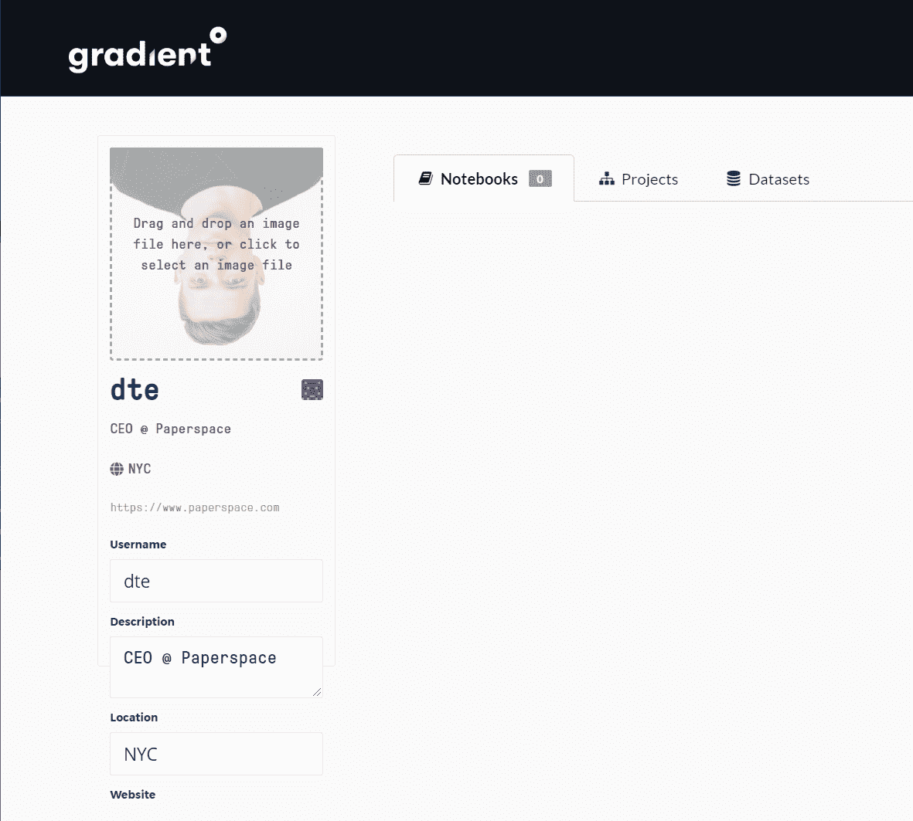
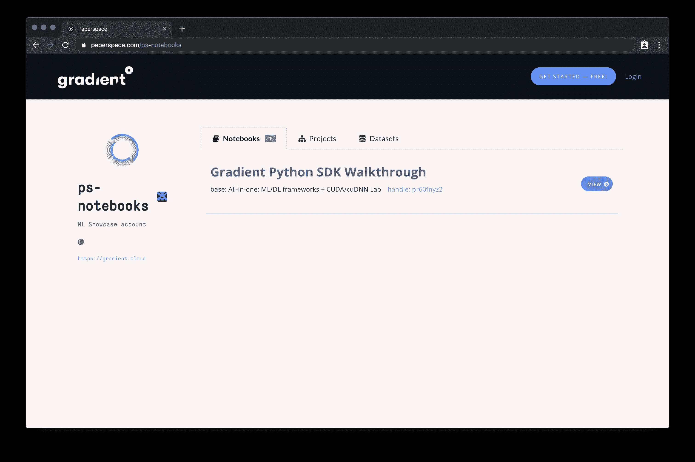
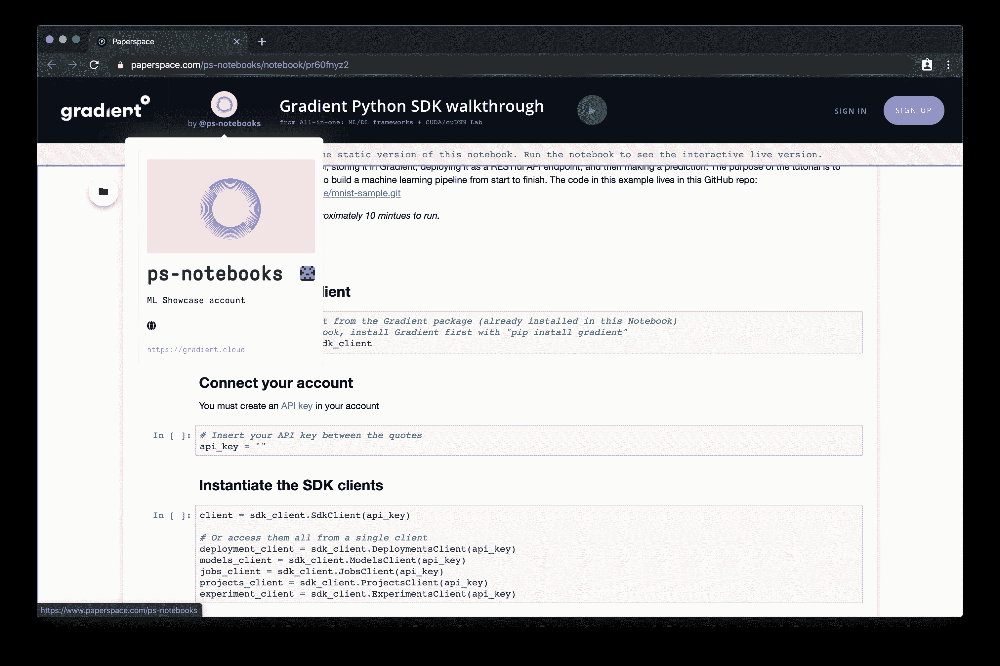
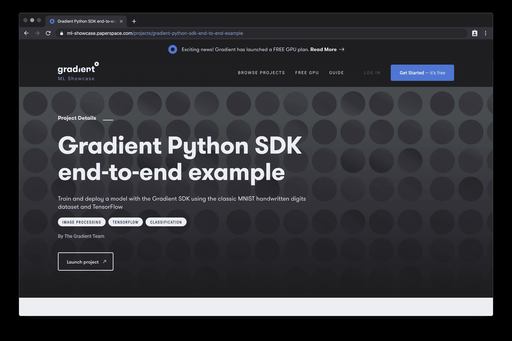

# 引入渐变公共配置文件📣

> 原文：<https://blog.paperspace.com/gradient-public-profiles/>

Gradient 中的公共配置文件旨在更容易地在 Gradient 平台上发布和发现机器学习项目。

一如既往，我们渴望听到您的反馈。今天就要求你的用户或团队处理，让我们知道你的想法。我们很期待看到你的作品！🙌

## 要求您的用户或团队处理！

您可以为您的个人帐户以及您管理的任何共享团队创建自定义句柄。这使您能够轻松地与全世界共享您的公共笔记本！

您的公开个人资料将在[https://www.paperspace.com/](https://www.paperspace.com/){**your _ handle**可见

## 共享您的个人资料

一旦你公开了你的个人资料，你就可以开始分享你的作品了。目前，公共配置文件仅支持公共笔记本，但很快您将能够共享项目、模型、数据集等。

## 在文档中了解更多信息

[查看文档](https://docs.paperspace.com/gradient/public-profiles/gradient-public-profiles)了解更多关于 Gradient public profiles 的信息以及我们下一步的发展方向。

[Gradient Public ProfilesPublic profiles in Gradient are designed to make it easier to publish and discover machine learning projects on the Gradient platform. Currently they support sharing public notebooks.Gradient Docs](https://docs.paperspace.com/gradient/public-profiles/gradient-public-profiles)

## 想看看一些示例公共笔记本吗？

前往我们新的 ML 展示区，在那里我们收集公共笔记本和项目样本。

[Gradient - ML ShowcaseA collection of interactive Machine Learning projects curated by Paperspace Gradient.ML Showcase](https://ml-showcase.paperspace.com/)