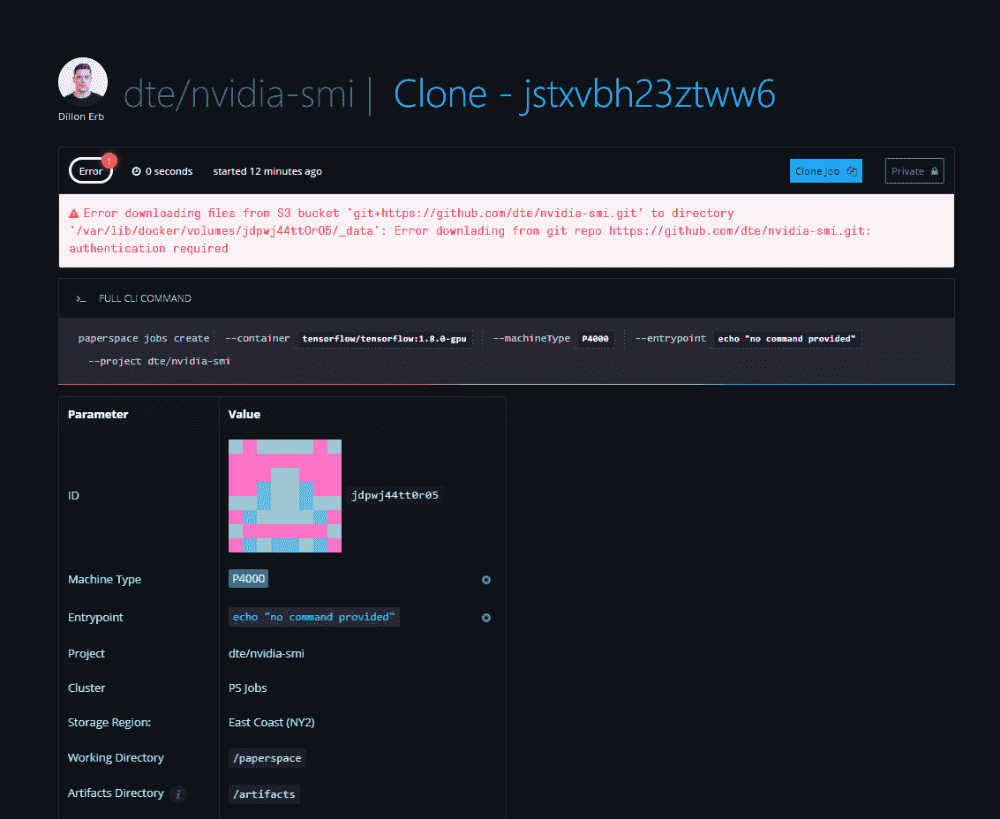
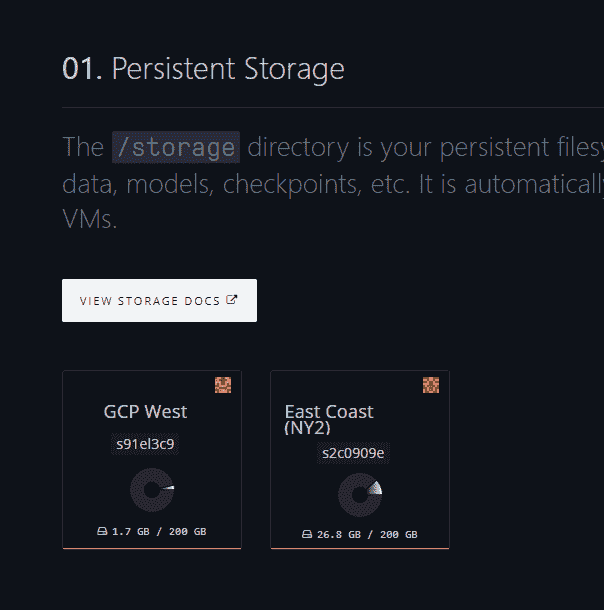
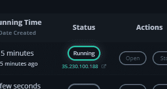
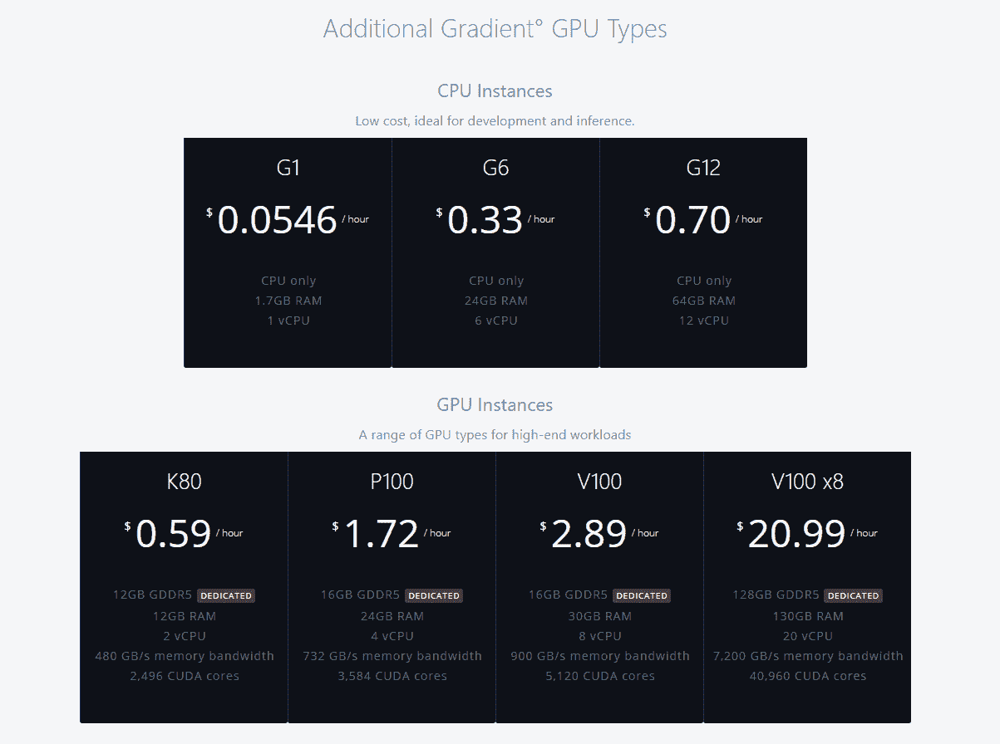
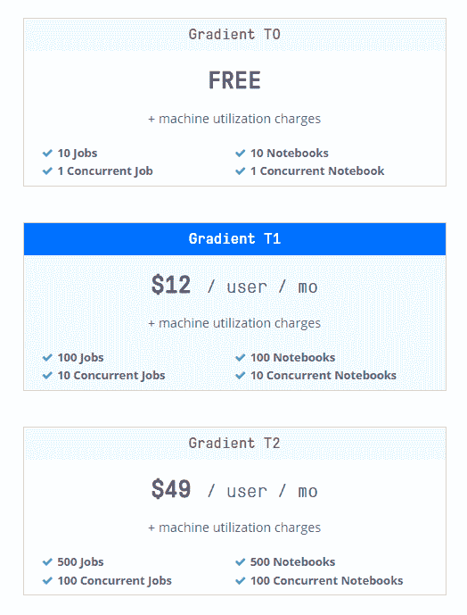
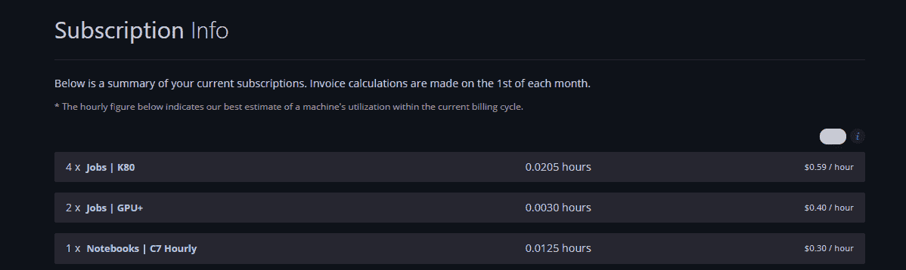

# 渐变更新(2018 年 7 月 18 日)

> 原文：<https://blog.paperspace.com/gradient-update-july/>

[Gradient](http://paperspace.com/gradient) 已经更新，以回应来自社区的大量反馈。以下是我们最近添加的一些内容的综述:

产品发布说明可以在[这里找到](https://paperspace.zendesk.com/hc/en-us/articles/217560197-Release-Notes)，API 发布说明可以在[这里找到](https://github.com/Paperspace/paperspace-node/blob/master/releasenotes.md)

## 职务页面更新

渐变作业界面已更新，包括一些新项目。最引人注目的是，你会看到这些新的彩色块，对应于界面中每个独特的 UUID。这些块给你一个快速的方法来区分界面中不同的独特元素，并使移动更加容易。

其他更新包括:

*   更好地报告工作中的错误
*   用于公开工作的更清晰的界面
*   更快的记录

## 作业存储

在新的`/data`选项卡下，我们还可以更轻松地查看您的梯度存储选项及其当前利用率。我们正在努力使存储管理变得更加简单，这是将可视性添加到纸张空间生态系统的这一部分的第一步。

## 笔记本电脑改进

笔记本电脑是我们最受欢迎的功能之一。除了一些新的模板和对 Jupyter 实验室更好的支持，我们还推出了一些小的修复来解决用户的反馈。

例如，您现在可以直接在笔记本列表中找到正在运行的作业的 URL，从而更容易共享您的笔记本并在多个浏览器选项卡中工作。

## 新机器类型(支持多 GPU！)

在此版本中，我们现在支持更多的机器类型。其中包括新的机器类型，如 V100，以及多 GPU 机器实例。

在[定价页面](https://www.paperspace.com/pricing)了解更多信息

## 新计划类型

越来越多的团队正在使用 Gradient 构建他们的 ML/AI 工作流，为了支持这些团队，我们添加了额外的计划类型，以支持更多的作业、笔记本和存储。

## 更好的可视性

最后，现在比以往任何时候都更容易检查您的账单选项卡下的梯度利用率。你可以在月底结账前看到你到底用了多少钱。

## 对存储数据集的 linux 访问

我们添加了一些新的数据集，包括[可可](http://cocodataset.org/#home)，并使直接从您的虚拟机、笔记本电脑和作业中访问`/storage`和`/datasets`变得前所未有的简单。所有新的 linux 虚拟机都会自动挂载这些目录，这使得在您的机器学习项目中处理大型数据集变得前所未有的简单。

## 更便宜的实例！

深度学习可能会变得昂贵，所以我们一直在降低一些最受欢迎的实例类型的价格。例如，P100 现在只需 1.72 美元/小时，包括您的梯度持久存储！