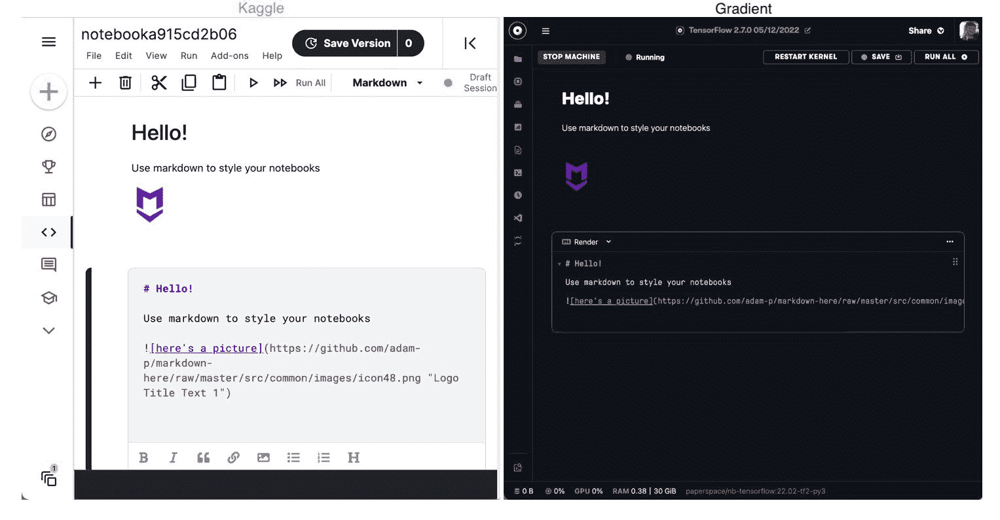
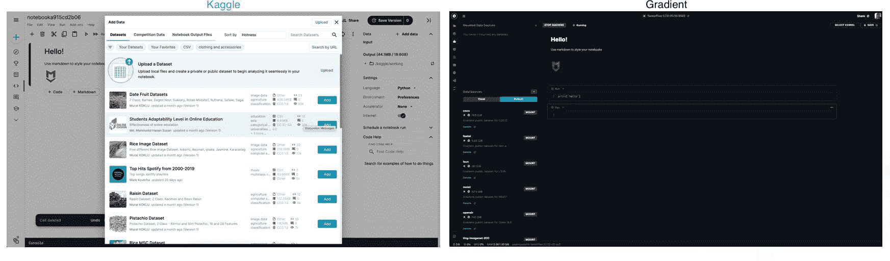
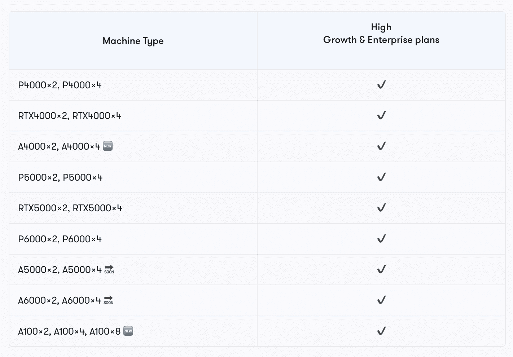
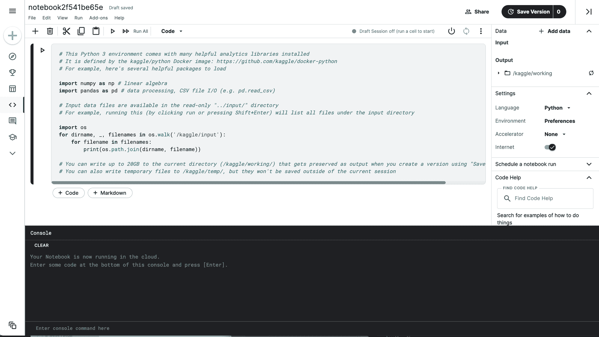
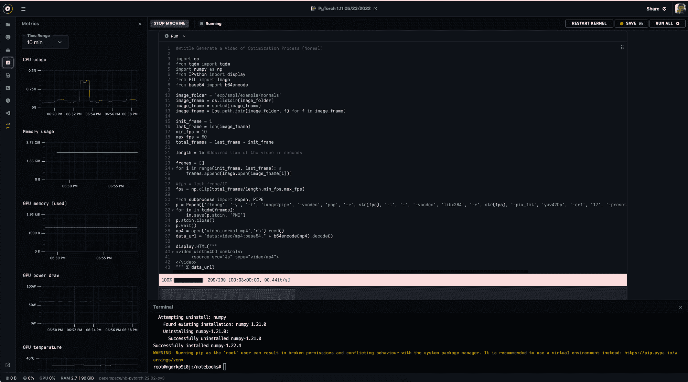

# Paperspace Gradient 与 Google Kaggle:选择深度学习的最佳平台

> 原文：<https://blog.paperspace.com/gradient-vs-kaggle-2022/>

最好的 ML 平台通常是平台的 IDE、硬件和成本的函数。考虑到这些因素，我们将比较 Kaggle 笔记本和 Paperspace 的渐变笔记本。

在本指南中，我们的目标是展示每个平台的优势，并为何时使用其中一种产品提供清晰的论据。

#### 图纸空间渐变笔记本

[Gradient](https://gradient.run/) 是一个 MLOps 平台，旨在帮助用户扩展真实世界的机器学习应用。[渐变笔记本](https://gradient.run/notebooks)拥有一个由 [Jupyter](https://jupyter.org/) 支持的笔记本工作区，用户可以在其中执行代码单元格。笔记本对于处理和运行直接上传到工作目录的数据、上传到团队数据集卷并装载到笔记本中的数据，或者来自所提供的公共数据集之一的装载卷的数据非常有用。

#### Kaggle 笔记本

[Kaggle](https://kaggle.com/) 是一个受欢迎的平台，供用户查找和发布数据集，在数据科学环境中创建和测试模型，通过社交媒体功能与其他用户协作和交流，以及参加比赛以解决数据科学挑战。用户可以在基于网络的平台上运行的 IPython 笔记本上操作，并使用 Kaggle 笔记本来执行代码和 markdown 单元格，以处理用户上传到平台的数据。Kaggle 笔记本还有一个控制台窗口，如果需要在笔记本之外运行任何命令的话。

### 它们总体上有什么相似之处？

渐变笔记本和 Kaggle 笔记本共享许多功能。熟悉 Jupyter 笔记本的用户在这两种环境下都会感到舒适。

The Kaggle and Gradient Notebook IDEs

首先，这两种 ide 都允许用户执行代码和标记单元格。Markdown 单元格使得在笔记本中提供上下文散文、标签、描述性语句和注释变得容易，而 code 单元格则支持在笔记本中执行代码。这种类似 Jupyter 的行为使得这两个平台都非常适合以描述性和可重复的方式探索数据或试验新模型。

<https://blog.paperspace.com/content/media/2022/05/exit-this.mp4>

The interactive session allows you to start and stop kernels at will.

这两个平台都具有访问在 Docker 容器中运行的交互式会话的功能，该容器带有预安装的软件包。这种容器化的会话运行允许用户使用期望的包启动会话。然而，在这两种 ide 中，容器的定制范围有很大的不同。我们将在下面更详细地介绍这一点。

每个平台都能够装载版本化数据源并在平台内访问它们。这使用户能够通过安装的卷在笔记本电脑中处理上传到主机平台的文件。同样，这里功能的范围变化很大，但是两个平台都能够在导入的数据上执行代码。

最后，每个平台都允许用户访问可定制的计算资源，如 GPU——但是 Kaggle 和 Gradient 处理 GPU 硬件分配和可用性的方式不同，Gradient 提供更多选项和更高端的硬件。我们将在下面详细讨论这些和其他的区别。

* * *

# 对比 Kaggle 笔记本和渐变笔记本

## 五金器具

|  | 卡格尔 | 梯度 |
| --- | --- | --- |
| 国家政治保卫局。参见 OGPU | 是的，P100 | 有，M4000、P4000、RTX4000、A4000、P5000、RTX5000、A5000、A6000、V100 - 16GB、V100 - 32GB、A100 - 40GB、A100 - 80GB |
| TPU | 是 | 不 |
| 中央处理器 | 是 | 是 |

### 机器种类和性能

Kaggle 笔记本能够运行 CPU、GPU 或 TPU 驱动的实例，而 Gradient 只能选择 CPU 或 GPU 机器。如果看重 TPUs，Kaggle 是更好的选择。然而，如果你重视对 CPU 和 GPU 硬件有更多的选择，Gradient 是一个更好的选择。

Kaggle 只提供 P100 GPU，这是一种 Pascal 系列 GPU，现已有两代历史。与 Gradient 上提供的 V100 和 A100 实例相比，P100 的效率将相形见绌，尽管这些 GPU 只能通过 Gradient 上的订阅获得。

TPU 是谷歌开发的人工智能 ASIC，用于加速深度学习应用程序的张量计算。这主要是为了与深度学习库 TensorFlow 配合使用，软件和硬件的开发是为了优化彼此的使用。

<https://blog.paperspace.com/content/media/2022/05/vid-1.mp4>

Gradient's GPU selection from the Notebook create page

Gradient 的可用[GPU](https://docs.paperspace.com/gradient/machines/)及其[基准](https://blog.paperspace.com/best-gpu-paperspace-2022/)的完整列表可以在这些链接中找到。

### 机器选择

对 Kaggle 不利的最大因素之一是机器选择。众所周知，在给定的时间框架内完成深度学习任务的能力取决于硬件以及操作员。

对于 Kaggle，没有选择不同机器类型的选项。对于平台上的大多数爱好者、学生和爱好者来说，这不是问题。P100 足以完成许多深度学习任务。然而，随着深度学习领域的发展，P100 无法处理许多越来越普遍的大型数据问题。企业级用户会很快发现 P100 不足，这种影响只会因 Kaggle 上 GPU 笔记本的 30 小时限制而加剧。

梯度不存在这个问题。在所有 Paperspace Core 和 Gradient 实例上，用户可以以不同的价格访问各种 Maxwell、Pascal、Volta、Turing 和 Ampere GPUs。这使得用户能够对使用多少数据以及深度学习算法处理梯度数据的速度有更多的控制。

Multi-GPU machines on Gradient

此外，Gradient 拥有多个 GPU 实例，可以支持 Kaggle 用户无法使用的整个库和并行化范例，如 rise 或 DeepMind。

## 连接

由于与 Jupyter 共享遗产，渐变笔记本 IDE 和 Kaggle 笔记本界面的相似性大于差异，但也有明显的差异。

这两个平台都是编译 Python 或 R 代码的优秀环境，拥有完整的编辑器和控制台，并且可以通过。ipynb 文件和。py 脚本虽然它们都是健壮的编码环境，但它们的主要区别实际上与用户体验的质量有关。这些差异在于额外的特性:度量、日志和定制。

Monitoring your GPU power draw or total memory used is easy with the Metrics tab

在 Kaggle 中，很难显示代码中发生了什么。对于日志记录和获取关于实例的各种度量，这是一个双重问题。您需要设置自己的专有日志记录应用程序来记录笔记本电脑上正在执行的操作或查找错误代码，并且通常需要第三方应用程序来识别有关机器本身的指标，如内存消耗或温度。幸运的是，有了渐变，这些事情就变得简单了。只需使用任何笔记本左侧的按钮，即可访问日志记录、指标、版本历史记录等等。

## 其他功能

在这一节中，我们将了解区分这两个平台的许多其他特性。

### Github 集成

虽然 Kaggle 有一个 API 和一个流行的 Github 动作来推送数据集内核，但它目前缺乏与 Github 的任何进一步集成。这是合理的；Kaggle 笔记本主要是为在玩具数据集上进行快速实验而设计的，而不是用于迭代 Github repo 的工作空间。

然而，Gradient 的特点是与 Github 的强大集成，以便让用户能够管理他们的笔记本工作区，并通过工作流更新 repos。通过将 Gradient account 与 Github Gradient 应用程序集成在一起，Gradient 可以用于在使用 Gradient 工作流完成工作时迭代地更新存储库。实际上，这允许用户在应用程序开发过程中对代码进行版本控制，并确保任何同事和合作者都将获得最佳体验。在较低的集成级别上，Gradient 还支持使用 Github URL 作为笔记本创建的工作区 URL。通过这样做，用户可以自定义笔记本中可用的启动文件。

### S3 数据集

对于 ML ops 平台用户来说，访问不同的存储位置和类型非常重要。在 Kaggle 上，这完全是在 Kaggle 生态系统内处理的，这是无法改变的。然而，在 Gradient 上，用户可以选择将数据存储在 Gradient Managed 上或连接到 S3 存储桶。通过一个[f](https://docs.paperspace.com/gradient/data/)T2【ew】的配置步骤，任何 Gradient 用户都可以将一个 S3 桶直接连接到他们的账户。这将允许用户设置他们自己的数据存储限制，并克服用户可能招致的超过梯度管理存储限制的任何限制或超额费用。对于任何希望使用大数据的用户来说，这是必须的。

### 运行时间限制

Kaggle 笔记本只能用于执行代码，CPU 和 GPU 笔记本会话执行时间为 12 小时，TPU 笔记本会话执行时间为 9 小时。此外，每个用户每周最多只能使用 30 小时的 GPU 和 20 小时的 TPU 时间。这个限制无法克服，所有用户都必须遵守。

另一方面，在渐变笔记本中，唯一具有设定时间限制的笔记本是免费的 GPU 笔记本。这些在免费层上最多只能运行 6 个小时。然而，用户可以为梯度笔记本的 GPU 访问付费，从几个小时到几天到没有运行时间限制。这使得梯度更可取，每当你有一个计算昂贵或长时间的训练任务要完成。

### 公共和团队数据集

Kaggle 最大的特点是它可以访问用户提交和管理的海量数据。在 Kaggle 笔记本中，用户可以轻松地访问这些数据集的不可变版本，以用于他们的代码，并且可以使用 Kaggle API 更新这些版本。出于这个原因，Kaggle 目录也是新数据科学家开始玩具项目工作的一个非常常见的地方。

Gradient 还让用户可以访问一系列公共数据集，其中包含越来越多的流行机器和深度学习数据集。目前，这些数据集比 Kaggle 数据集更加有限，但它们允许用户几乎立即将数据安装到笔记本上，并包括像 MS-COCO 这样的流行大型数据集。用户还能够通过团队数据集上传和使用他们自己的数据。

总而言之，虽然 Kaggle 目前是平台内快速访问数据的首选，但 Gradient 正在通过其数据集功能快速接近用户的生存能力。Kaggle 数据集的优势也受到其 API 的严重阻碍，因为它使任何用户都可以在很短的时间内以 Paperspace 数据中心的互联网速度轻松下载任何 Kaggle 数据集。

## 结论

在这篇博文中，我们试图分析 Kaggle 和 Gradient 之间的区别。我们试图展示 Kaggle 是如何成为学生和业余爱好者的理想起点的，这要归功于它简单的 IDE、数据共享工具和缺乏术语定制选项。与此同时，我们还展示了 Gradient 提供了许多相同的功能，并增加了企业级可伸缩性、优于 Jupyter 的生活质量改善和部署能力。

出于这些原因，我们建议只有早期职业用户和那些需要使用 Kaggle 笔记本电脑的 TPU 工作。Gradient 应该是企业级用户的首选，也有很强的理由作为任何寻求进行深度学习的用户的首选。