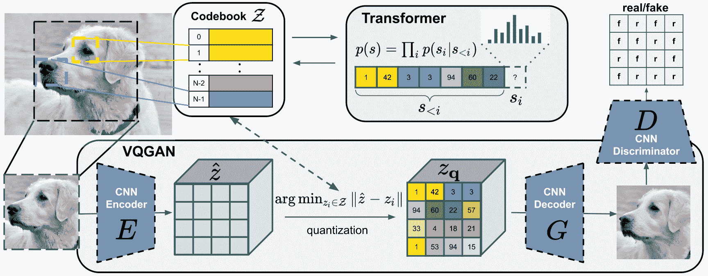
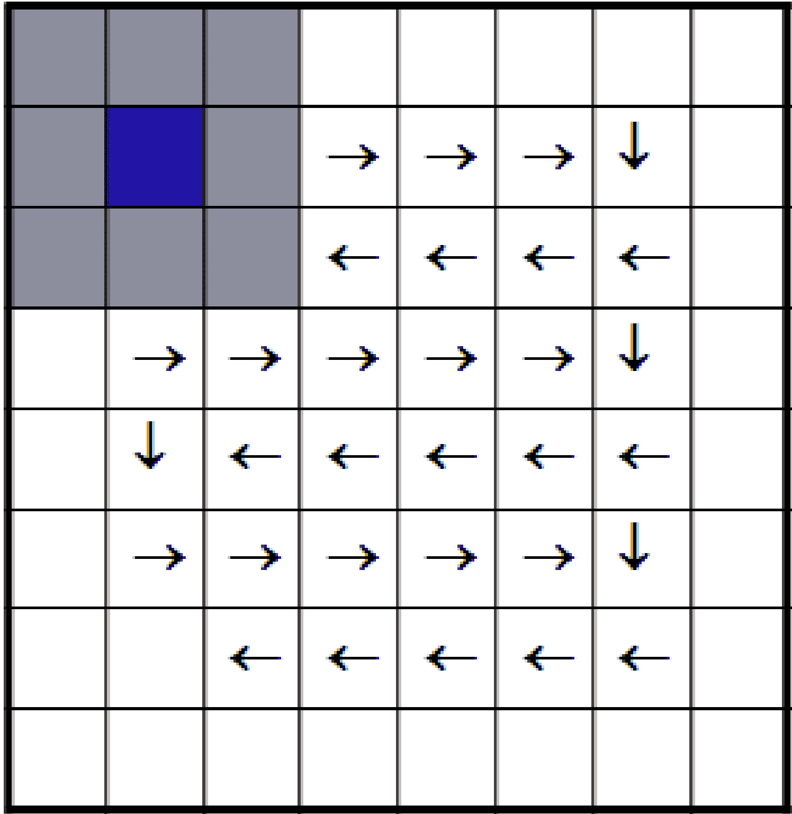
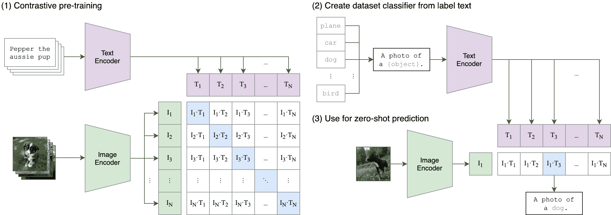
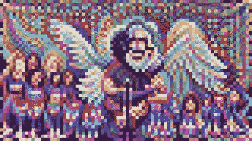
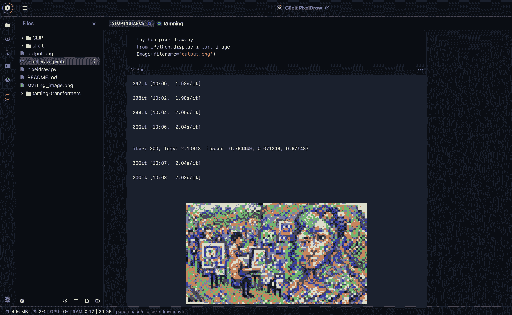

# 我如何用 VQGAN-CLIP 制作这篇文章的封面照片

> 原文：<https://blog.paperspace.com/how-i-made-this-articles-cover-photo-with-vqgan-clip/>

[https://www.youtube.com/embed/Z_9iGP9fsDk?feature=oembed](https://www.youtube.com/embed/Z_9iGP9fsDk?feature=oembed)

Video tutorial of VQGAN-CLIP. Be sure to go to advanced options and set your workspace url to [https://github.com/gradient-ai/ClipIt-PixelDraw.git](https://github.com/gradient-ai/ClipIt-PixelDraw.git) and your container name to paperspace/clip-pixeldraw:jupyter

使用深度学习来生成艺术或智能修改现有图像并不是一个新概念。像 Alexander Mordvintsev 的 DeepDream architecture 这样的著名项目已经存在了五年，该项目使用 CNN 的通过[算法](https://en.wikipedia.org/wiki/Algorithm) [pareidolia](https://en.wikipedia.org/wiki/Pareidolia) 对输入的图像进行变形，以发现并强化视觉数据中的模式，或者使用 [Pix2Pix](https://phillipi.github.io/pix2pix/) 对黑白绘图的轮廓进行填充和着色。这些技术有着巨大的潜力，安全、营销、购物和一般生活的用例都来自于上述突破。当计算机视觉和深度学习的进步的影响开始渗透到 ML 社区之外的商业世界时，艺术世界中 DL 技术的存在也变得越来越受欢迎。NFT 和虚拟影响者的出现，[人工智能产生了音乐](https://www.youtube.com/watch?v=sgdTHbgzLr8&t=49s)和艺术作品，以及更多提供了明确的证据，表明深度学习技术正在产生巨大的文化影响。
在本文中，我们将着眼于最有前途的图像生成器之一，VQGAN-CLIP，并了解它如何与 NLP 和 Gradient 一起使用，使用单一提示生成新颖的剪贴画。

### 什么是 VQGAN-CLIP？

简而言之，VQGAN-CLIP 是两种神经网络架构(VQGAN & CLIP)之间的交互，这两种架构协同工作，从文本提示中生成新颖的图像。这两个工具协同工作，生成并限定 PixRay 的像素艺术，VQGAN 生成图像，CLIP 评估图像与输入文本的对应程度。

> 我们的方法使用卷积 VQGAN 来学习上下文丰富的视觉部分的码本，其组成随后用自回归变换器架构建模。离散码本提供了这些架构之间的接口，基于补丁的鉴别器支持强压缩，同时保持高感知质量。该方法将卷积方法的效率引入到基于变换的高分辨率图像合成中。

[报价来源](https://compvis.github.io/taming-transformers/)



A visualization of the flow of VQGAN image processing with a CNN discriminator, as used in the original paper. [Source](https://compvis.github.io/taming-transformers/)

**VQGAN (** ***矢量量化生成对抗网络*** **)** : VQGAN 是一种 GAN 架构，可以用来学习并基于之前看到的数据生成新颖的图像。它最初是由埃塞尔、罗姆巴赫和奥姆尔在论文[《驯服变形金刚》(2021)中介绍的。其工作原理是首先将图像数据直接输入到 GAN，以对图像可视部分的特征图进行编码。然后，该图像数据被矢量量化:一种信号处理形式，将矢量分组编码成可由标记质心的代表矢量访问的簇，该代表矢量被称为“码字”。一旦编码，矢量量化数据被记录为码字字典，也称为码本。码本作为图像数据的中间表示，然后作为序列输入到变换器。然后，变换器被训练以将这些编码序列的合成建模为作为生成器的高分辨率图像。](https://compvis.github.io/taming-transformers/)

VQGAN 的主要创新——也是它如此令人兴奋的原因——是能够通过自回归码本编码序列将图像数据直接输入转换器。在实践中，变换器以自回归方式在从码本输入的量化记号序列上被训练:它学习如何基于先前记号的序列来预测下一个记号的分布。 [1](https://www.casualganpapers.com/vqvae-discrete-vision-transformer/VQGAN.html) 该步骤极大地降低了生成这种图像的预期成本，并且允许更快地处理图像数据。



How a sliding-window works with image data [Source](https://www.researchgate.net/figure/Moving-Sliding-Window-Algorithm-diagram-using-3X3-pixel-area-The-algorithm-for-Mean_fig3_320564070)

转换器还通过滑动窗口将图像生成的上下文限制为像素的“补丁”。这允许转换器仅考虑补丁的本地上下文:在生成图像和提高资源效率时，仅“查看”相邻补丁的信息。

最后，转换器输出无条件生成的高分辨率图像，或者随着训练的迭代进行，如 VQGAN-CLIP go by，有条件地基于生成事件的上下文。



[Source](https://github.com/openai/CLIP)

**CLIP(对比语言-图像预训练)**:简单来说， [CLIP](https://arxiv.org/abs/2103.00020) 是一个经过训练的模型，用来评估一个字幕相对于一组中其他字幕对图像的适合度。CLIP 能够进行零触发学习，使其即使在未知数据上也能表现良好。当在 VQGAN-CLIP 中应用时，CLIP 能够与用户输入的字幕相比评估生成的图像的质量，并且输出的分数可以用作权重来“指导”VQGAN 的学习，以通过递归迭代更准确地匹配主题。²



An example image generated using PixelDraw on Gradient.

**组装起来**:

当一起使用时，VQGAN-CLIP 创建一系列模型，这些模型可用于从一串文本生成图像。通过使 VQGAN 首先生成随机噪声图像来创建这些图像，该随机噪声图像被矢量量化并在码本中编码，然后该码本被用作从编码信号生成新图像的变换器的输入，然后该输出被用于评估图像对通过 CLIP 输入的提示的准确性，然后该得分被发送回 VQGAN 以更新图像生成模型来更接近地反映提示。

## PixelDraw 是什么？

[渐变笔记本](https://console.paperspace.com/signup?gradient=true)【**注**:分叉附送笔记本目前无法工作。按照文章顶部的视频说明来创建您自己的图像，当问题解决后，我们将删除此注释]我们用来创建图像的脚本由用户 Dribnet 领导的项目团队编写，用于开源项目 [PixRay](https://github.com/dribnet/pixray) 。PixRay 于 2021 年 9 月推出，是一个使用 VQGAN-CLIP、感知引擎、CLIPDraw 和采样生成网络从用户提交的文本提示中创建新颖像素艺术的库。您可以在这里访问该项目的 GitHub，也可以在这里访问该项目的公开演示笔记本。这个笔记本设置为使用 clip it(PixRay 的前身)和 PixRay 的组件脚本 PixelDraw 生成像素艺术。PixelDraw 专门用来生成 PixelArt。

## 笔记本

### 环境和要求

PixRay 经过优化，可以在 GPU 环境中运行，您必须在本地机器上安装一个，或者远程访问一个。如果您可以在本地访问 GPU，那么您可以使用 Cog 通过 Docker 运行 PixRay。

我们在这个项目中使用的笔记本电脑运行在 P6000 GPU 上，训练和图像生成大约需要 10 分钟。我们建议您按照本文顶部视频中的说明来设置自己的笔记本。**注意:**请务必进入高级选项，将您的工作区 url 设置为 https://github.com/gradient-ai/ClipIt-PixelDraw.git，将您的容器名称设置为 paper space/clip-pixeldraw:jupyter。

要在 Gradient 上访问此项目，[单击此链接。](https://console.paperspace.com/signup?gradient=true)

### 代码:

```py
git clone https://github.com/openai/CLIP
git clone https://github.com/CompVis/taming-transformers.git
git clone https://github.com/dribnet/clipit 
```

首先，我们需要安装相关的库。为了让 PixelDraw 正常工作，这意味着 CLIP、clipit 和驯服变形金刚。转到您的终端，输入上面的代码片段。然后打开“pixeldraw.py”文件。

```py
#Setup Paths
import sys
sys.path.append("clipit")
sys.path.append("/clipit")
sys.path.append("CLIP")
sys.path.append("/CLIP")
sys.path.append("diffvg")
sys.path.append("/diffvg")
sys.path.append("taming-transformers")
sys.path.append("/taming-transformers") 
```

当设置 pixeldraw.py 脚本本身时，我们必须首先设置环境中库的相关路径。完成初始设置后，我们可以开始对 PixelDrawer.py 脚本本身进行设置。以下是我们使用的一些设置

```py
# Settings: these are variables that can be used to adjust the output of the model

# prompts: the sentence the model will try to interpret to produce an image
prompts = "Humans use Machine Learning to make art #pixelart" #@param {type:"string"}

# aspect: the shape/size of the outputted .png
aspect = "widescreen" #@param ["widescreen", "square"]

# use_pixeldraw: set to True to ensure ClipIt uses PixelDraw rather than other options, clipdraw or vqgandraw
use_pixeldraw = True #@param {type:"boolean"} 
```

*   其中最重要的是**提示**。该提示是一个文本字符串，它将指导我们生成图像，因为 CLIP 使用该提示作为测试标题来评估生成图像的质量。
*   接下来要考虑的设置是**方面**。长宽比用于决定我们生成的图像的形状，可以设置为“宽屏”，表示宽的矩形图像，也可以设置为方形，表示图像在两个维度上的大小相等。
*   最后，对于这个例子，我们希望确保使用正确的绘图脚本，所以我们将 **use_pixeldraw** 设置为等于 True。其他选项是 clipdraw 和 vqgandraw，它们将从 PixelDrawer.py 生成类似但最终不同的图像。

我们可以应用的其他设置包括**质量**和**比例**，它们分别影响图像的分辨率和大小。**迭代**影响训练迭代的次数，而 **display_every** 告诉 ipython 小部件在 *n* 训练周期结束时显示图像。

既然我们已经分配了设置，那么就需要实例化 clipit 并随后应用设置。

```py
# Import clipit to access relevant functions
import clipit

# reset_settings() ensures we are using defaults
clipit.reset_settings()
# add_settings creates a dictionary of the settings we defined above, and make other adjustments to output
clipit.add_settings(prompts=prompts, aspect=aspect)
clipit.add_settings(quality="better", scale=2.5)
clipit.add_settings(use_pixeldraw=use_pixeldraw)

# Use iterations and display_every params to adjust training time and information display throughout
# This is the example of how to run longer with less frequent display
clipit.add_settings(iterations=300, display_every=50)

# apply_settings() to implement the settings from the add_settings() dict
settings = clipit.apply_settings()

# Run and create the image
clipit.do_init(settings)
clipit.do_run(settings) 
```

为了将设置应用到 clipit，我们首先导入库。

*   然后，我们首先使用 **reset_settings()** 方法来确保没有预设参数，并且我们使用的是默认参数。
*   接下来，我们使用 **add_settings()** 将我们的设置输入到 clipit 中。这将准备在下一步中完全应用的设置。
*   然后，我们使用 **apply_settings()** 创建一个字典，其中包含我们在训练运行期间要应用的设置。
*   最后，我们可以通过连续输入 **clipit.do_init(settings)** 和 **clipit.do_run(settings)** 来运行模型并生成图像，以使用我们的用户输入设置来运行 clipit。

要实际运行这个脚本，只需将它输入到笔记本或您的终端中。如果成功完成，图像生成训练应该开始，并运行输入的训练迭代次数。



An example of pixeldraw running for 300 iterations to generate this articles cover photo.

该图像将输出为 500 x 280 像素的 png 文件，并将作为“output.png”直接保存到您的文件中

## 总结发言

从一个看似平凡的来源创造出新颖艺术的能力永远是一件有趣的事情。今天，我们看了用户如何只用 GPU 和文本输入就能生成像素艺术。这种技术的使用案例几乎是无限的，但是我将列出一些:

*   自动化内容生成(营销和设计):未来的团队将能够使用简单的文本输入为他们的内容生成有趣的新作品。这可以为品牌和艺术资产创造节省数百个小时。
*   自动内容生成(艺术家):这也延伸到创意，因为艺术家可以利用人工智能艺术生成作为一种新的工具。不能低估文本到图像技术的创造潜力。
*   自动照片处理:用户可以选择性地选择输入的照片。如果起始照片已经具有显著的设计/图案而不是随机噪声，则该照片可以用作照片处理的指导模板。理论上，一旦这一点得到充分优化，我们可以使用类似的架构对现有图像进行适当的编辑，而不是手动进行。例如，如果我们给模型一个小丑的图像，并带有文本提示“没有帽子的小丑”,我们可以预期模型会尝试摘掉那些帽子。不过这还有很长的路要走。

感谢您阅读 PixRay 的 PixelDrawer 使用指南！期待更多像这样的教程和我们的新指南，看看我们如何在渐变上创建 [Adoro 应用程序。](https://blog.paperspace.com/adoro-deepfake-your-selfie-first-order-motion-model/)

## 视频的代码片段

**进口**

```py
!pip install ftfy regex tqdm omegaconf pytorch-lightning
!pip install kornia
!pip install imageio-ffmpeg   
!pip install einops
!pip install torch-optimizer
!pip install easydict
!pip install braceexpand
!pip install git+https://github.com/pvigier/perlin-numpy 
```

### 学分:

1: @casual_gan，“24: VQGAN 解释”。[https://www . casualganpapers . com/vqvae-discrete-vision-transformer/vqgan . html](https://www.casualganpapers.com/vqvae-discrete-vision-transformer/VQGAN.html)

2: [亚历克·拉德福德](https://openai.com/blog/authors/alec/)，[伊利亚·苏茨基弗](https://openai.com/blog/authors/ilya/)，[琼·金旭](https://openai.com/blog/authors/jong/)，[格雷琴·克鲁格](https://openai.com/blog/authors/gretchen/)，[桑迪尼·阿加瓦尔](https://openai.com/blog/authors/sandhini/)，《剪辑:连接文字和图像》[https://openai.com/blog/clip/](https://openai.com/blog/clip/)