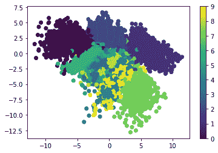
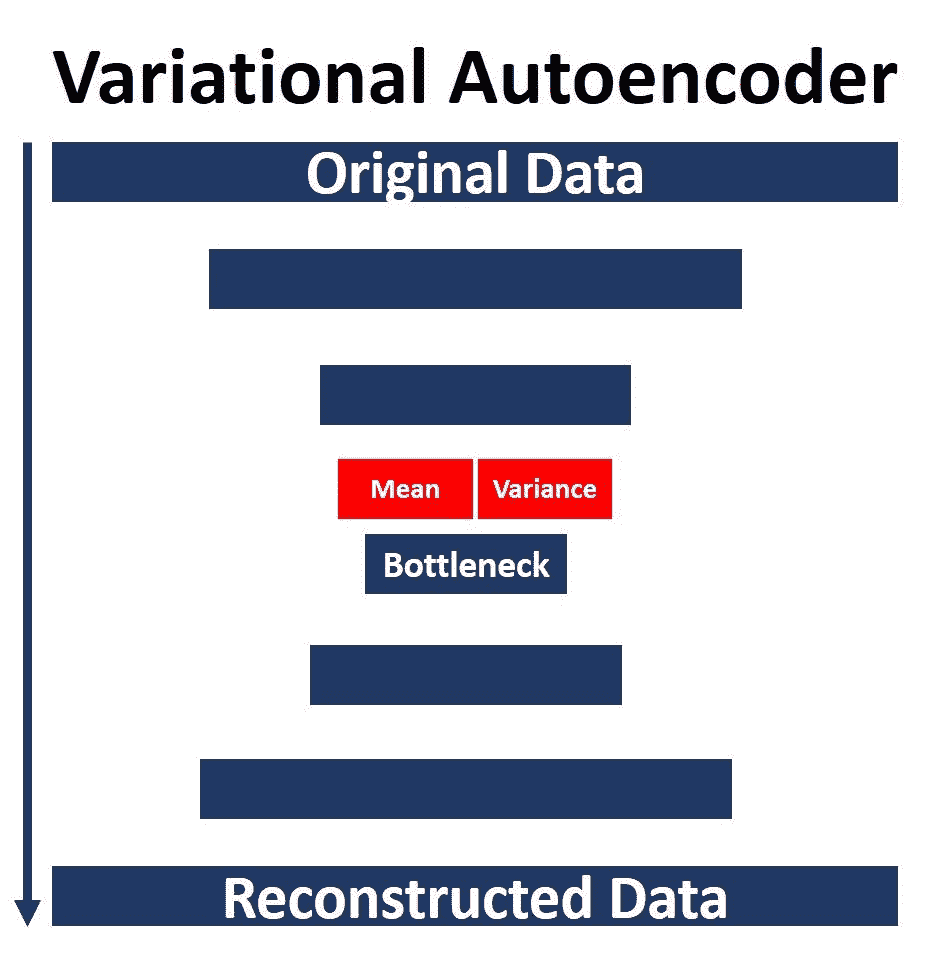
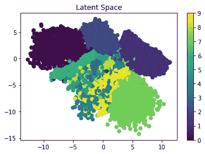
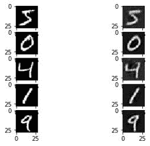

# 如何在 Keras 中建立一个可变的自动编码器

> 原文：<https://blog.paperspace.com/how-to-build-variational-autoencoder-keras/>

本教程介绍了变分自动编码器(VAE)神经网络，它如何不同于典型的自动编码器，以及它的好处。然后，我们将在 Keras 中构建一个可以编码和解码图像的 VAE。

本教程的大纲如下:

*   变分自动编码器简介
*   构建编码器
*   构建解码器
*   建造 VAE
*   训练 VAE
*   看一看代码
*   测试模型

您可以在 [ML Showcase](https://ml-showcase.paperspace.com/projects/build-an-autoencoder-from-scratch-in-keras) 上跟随完整的代码。

## 变分自动编码器简介

自动编码器是一种卷积神经网络(CNN ),它将高维输入转换为低维输入(即潜在向量),然后以可能的最高质量重建原始输入。它由两个相连的 CNN 组成。第一个是编码器网络，它接受原始数据作为输入，并返回一个向量。这个向量然后被馈送到第二 CNN，即重建原始数据的解码器。关于这个架构的更多信息，你可以查看 Keras 中使用自动编码器的教程[图像压缩，也在 Paperspace 博客上。](https://blog.paperspace.com/autoencoder-image-compression-keras)

自动编码器的一个问题是，它们独立于其他样本对数据的每个样本进行编码，即使它们来自同一类。但是如果两个样本属于同一类，则编码版本之间应该存在某种关系。形式化这个讨论，我们可以说这个问题是由于自动编码器没有遵循预定义的分布来编码数据。

换句话说，假设我们有两个来自同一类的样本，`S1`和`S2`。每个样本将被独立编码，这样`S1`被编码成`E1`，而`S2`被编码成`E2`。当`E1`和`E2`被解码时，不能保证重构的样本是相似的，因为每个样本都被独立处理。

这使得事情变得模棱两可。数据编码后，每个样本被编码成一个向量。假设向量长度为 2，那么向量中每个元素的取值范围是多少？是从-1 到 1 吗？还是 0 到 5？还是 100 到 200？答案是未知的，因为没有任何东西迫使向量在某个范围内。例如，您可能会训练编码器网络，发现范围是-10 到 20。另一次可能会变成-15 到 12。您将不得不探索编码的数据来推断向量的值的范围。

下图显示了使用自动编码器压缩的 MNIST 样本的潜在向量(更多细节请看本教程)。范围几乎是从-2.5 到 15.0。当然，当网络再次被训练时，它可能会改变，尤其是当参数改变时。


*variable*auto encoder 通过创建代表数据的定义分布来解决这个问题。VAEs 试图使分布尽可能接近标准的正态分布，正态分布以 0 为中心。因此，当您从分布中选择一个随机样本进行解码时，您至少知道它的值大约为 0。下图显示了使用 VAE 的编码样本是如何分布的。如你所见，样本以 0 为中心。



因为正态分布的特征是基于平均值和方差，所以变分自动编码器计算每个样本的平均值和方差，并确保它们遵循标准的正态分布(因此样本以 0 为中心)。有两层用于计算每个样本的平均值和方差。因此，在较高的层面上，您可以想象该架构如下图所示。



(关于 VAEs 的更多信息，我推荐这本书:[生成性深度学习:教机器画画、写字、作曲、演奏](https://www.amazon.com/Generative-Deep-Learning-Teaching-Machines/dp/1492041947)大卫·福斯特著。)

现在我们已经有了 VAE 的概述，让我们使用 Keras 来构建编码器。

## **构建编码器**

在本教程中，我们将重点关注如何在 Keras 中构建 VAE，因此我们将坚持使用基本的 MNIST 数据集，以避免从代码中分心。当然，您可以很容易地将它换成您自己感兴趣的数据。

该数据集中的图像是二进制的，宽度和高度为 28 像素。结果，单个图像大小为`28x28x1`。请注意，图像中只有一个通道。下一行创建两个变量来保存图像中通道的大小和数量。

```py
img_size = 28
num_channels = 1
```

根据下一行，我们将使用这些变量来创建编码器的输入层。

```py
x = tensorflow.keras.layers.Input(shape=(img_size, img_size, num_channels), name="encoder_input")
```

输入层之后是以下三层的许多组合:

1.  2D 卷积
2.  批量标准化
3.  李奇注意到了

下面是创建这些层的第一个组合的代码。

```py
encoder_conv_layer1 = tensorflow.keras.layers.Conv2D(filters=1, kernel_size=(3, 3), padding="same", strides=1, name="encoder_conv_1")
encoder_norm_layer1 = tensorflow.keras.layers.BatchNormalization(name="encoder_norm_1")(encoder_conv_layer1)
encoder_activ_layer1 = tensorflow.keras.layers.LeakyReLU(name="encoder_leakyrelu_1")(encoder_norm_layer1)
```

下一个代码块创建 code 诺姆-雷卢层的其他组合。

```py
encoder_conv_layer2 = tensorflow.keras.layers.Conv2D(filters=32, kernel_size=(3,3), padding="same", strides=1, name="encoder_conv_2")(encoder_activ_layer1)
encoder_norm_layer2 = tensorflow.keras.layers.BatchNormalization(name="encoder_norm_2")(encoder_conv_layer2)
encoder_activ_layer2 = tensorflow.keras.layers.LeakyReLU(name="encoder_activ_layer_2")(encoder_norm_layer2)

encoder_conv_layer3 = tensorflow.keras.layers.Conv2D(filters=64, kernel_size=(3,3), padding="same", strides=2, name="encoder_conv_3")(encoder_activ_layer2)
encoder_norm_layer3 = tensorflow.keras.layers.BatchNormalization(name="encoder_norm_3")(encoder_conv_layer3)
encoder_activ_layer3 = tensorflow.keras.layers.LeakyReLU(name="encoder_activ_layer_3")(encoder_norm_layer3)

encoder_conv_layer4 = tensorflow.keras.layers.Conv2D(filters=64, kernel_size=(3,3), padding="same", strides=2, name="encoder_conv_4")(encoder_activ_layer3)
encoder_norm_layer4 = tensorflow.keras.layers.BatchNormalization(name="encoder_norm_4")(encoder_conv_layer4)
encoder_activ_layer4 = tensorflow.keras.layers.LeakyReLU(name="encoder_activ_layer_4")(encoder_norm_layer4)

encoder_conv_layer5 = tensorflow.keras.layers.Conv2D(filters=64, kernel_size=(3,3), padding="same", strides=1, name="encoder_conv_5")(encoder_activ_layer4)
encoder_norm_layer5 = tensorflow.keras.layers.BatchNormalization(name="encoder_norm_5")(encoder_conv_layer5)
encoder_activ_layer5 = tensorflow.keras.layers.LeakyReLU(name="encoder_activ_layer_5")(encoder_norm_layer5)
```

之前架构中最后一层的输出大小为`(7, 7, 64)`。因此，图像大小从`28x28`减少到只有`7x7`，通道数量现在是`64`。由于 VAE 将多维数据转换为矢量，因此必须使用密集图层将输出转换为 1D 矢量(如下所示)。`shape_before_flatten`变量的目的是在结果被展平之前保持其形状，以便成功解码结果。

```py
shape_before_flatten = tensorflow.keras.backend.int_shape(encoder_activ_layer5)[1:]
encoder_flatten = tensorflow.keras.layers.Flatten()(encoder_activ_layer5)
```

在常规自动编码器中，将数据转换为矢量标志着编码器的结束。这不是 VAE 的情况。原因是 VAE 创建了一个标准的正态分布来表示数据。为此，必须考虑分布的参数(平均值和方差)。以下代码为这两个参数创建了两个层。

```py
latent_space_dim = 2

encoder_mu = tensorflow.keras.layers.Dense(units=latent_space_dim, name="encoder_mu")(encoder_flatten)
encoder_log_variance = tensorflow.keras.layers.Dense(units=latent_space_dim, name="encoder_log_variance")(encoder_flatten)
```

`Dense`类构造函数中的`units`参数设置为等于`latent_space_dim`，是设置为`2`的变量，代表潜在向量的长度。如果你想创建一个任意长度的潜在向量，只需为`latent_space_dim`变量指定合适的值。

使用这两层，`encoder_mu`和`encoder_log_variance`，正态分布被随机采样以返回编码器的输出。下一行为此创建了一个自定义的`Lambda`层。有关 Keras 中 Lambda 层的更多信息，请查看教程[在 Keras](https://blog.paperspace.com/working-with-the-lambda-layer-in-keras/) 中使用 Lambda 层。

```py
encoder_output = tensorflow.keras.layers.Lambda(sampling, name="encoder_output")([encoder_mu, encoder_log_variance])
```

Lambda 层调用一个名为`sampling()`的函数，实现如下。

```py
def sampling(mu_log_variance):
    mu, log_variance = mu_log_variance
    epsilon = tensorflow.keras.backend.random_normal(shape=tensorflow.keras.backend.shape(mu), mean=0.0, stddev=1.0)
    random_sample = mu + tensorflow.keras.backend.exp(log_variance/2) * epsilon
    return random_sample
```

现在，从输入层到输出层的编码器架构已经完成。剩下的最后一步是根据下一行创建一个模型，将编码器的输入层与输出层关联起来。

```py
encoder = tensorflow.keras.models.Model(x, encoder_output, name="encoder_model")
```

这是构建 VAE 编码器的完整代码。

```py
# Encoder
x = tensorflow.keras.layers.Input(shape=(img_size, img_size, num_channels), name="encoder_input")

encoder_conv_layer1 = tensorflow.keras.layers.Conv2D(filters=1, kernel_size=(3, 3), padding="same", strides=1, name="encoder_conv_1")(x)
encoder_norm_layer1 = tensorflow.keras.layers.BatchNormalization(name="encoder_norm_1")(encoder_conv_layer1)
encoder_activ_layer1 = tensorflow.keras.layers.LeakyReLU(name="encoder_leakyrelu_1")(encoder_norm_layer1)

encoder_conv_layer2 = tensorflow.keras.layers.Conv2D(filters=32, kernel_size=(3,3), padding="same", strides=1, name="encoder_conv_2")(encoder_activ_layer1)
encoder_norm_layer2 = tensorflow.keras.layers.BatchNormalization(name="encoder_norm_2")(encoder_conv_layer2)
encoder_activ_layer2 = tensorflow.keras.layers.LeakyReLU(name="encoder_activ_layer_2")(encoder_norm_layer2)

encoder_conv_layer3 = tensorflow.keras.layers.Conv2D(filters=64, kernel_size=(3,3), padding="same", strides=2, name="encoder_conv_3")(encoder_activ_layer2)
encoder_norm_layer3 = tensorflow.keras.layers.BatchNormalization(name="encoder_norm_3")(encoder_conv_layer3)
encoder_activ_layer3 = tensorflow.keras.layers.LeakyReLU(name="encoder_activ_layer_3")(encoder_norm_layer3)

encoder_conv_layer4 = tensorflow.keras.layers.Conv2D(filters=64, kernel_size=(3,3), padding="same", strides=2, name="encoder_conv_4")(encoder_activ_layer3)
encoder_norm_layer4 = tensorflow.keras.layers.BatchNormalization(name="encoder_norm_4")(encoder_conv_layer4)
encoder_activ_layer4 = tensorflow.keras.layers.LeakyReLU(name="encoder_activ_layer_4")(encoder_norm_layer4)

encoder_conv_layer5 = tensorflow.keras.layers.Conv2D(filters=64, kernel_size=(3,3), padding="same", strides=1, name="encoder_conv_5")(encoder_activ_layer4)
encoder_norm_layer5 = tensorflow.keras.layers.BatchNormalization(name="encoder_norm_5")(encoder_conv_layer5)
encoder_activ_layer5 = tensorflow.keras.layers.LeakyReLU(name="encoder_activ_layer_5")(encoder_norm_layer5)

shape_before_flatten = tensorflow.keras.backend.int_shape(encoder_activ_layer5)[1:]
encoder_flatten = tensorflow.keras.layers.Flatten()(encoder_activ_layer5)

encoder_mu = tensorflow.keras.layers.Dense(units=latent_space_dim, name="encoder_mu")(encoder_flatten)
encoder_log_variance = tensorflow.keras.layers.Dense(units=latent_space_dim, name="encoder_log_variance")(encoder_flatten)

encoder_mu_log_variance_model = tensorflow.keras.models.Model(x, (encoder_mu, encoder_log_variance), name="encoder_mu_log_variance_model")

def sampling(mu_log_variance):
    mu, log_variance = mu_log_variance
    epsilon = tensorflow.keras.backend.random_normal(shape=tensorflow.keras.backend.shape(mu), mean=0.0, stddev=1.0)
    random_sample = mu + tensorflow.keras.backend.exp(log_variance/2) * epsilon
    return random_sample

encoder_output = tensorflow.keras.layers.Lambda(sampling, name="encoder_output")([encoder_mu, encoder_log_variance])

encoder = tensorflow.keras.models.Model(x, encoder_output, name="encoder_model")
```

为了总结编码器的架构，发出了`encoder.summary()`命令。下面是结果。共有`105,680`个可训练参数。输出的大小是`(None, 2)`，这意味着它为每个输入返回一个长度为 2 的向量。注意，展平图层之前的图层形状是`(7, 7, 64)`，这是保存在`shape_before_flatten`变量中的值。

请注意，您可以自由地更改层中的参数值，并添加或删除层来定制应用程序的模型。

```py
_________________________________________________________________________________________
Layer (type)                    Output Shape         Param #  Connected to                     
=========================================================================================
encoder_input (InputLayer)      [(None, 28, 28, 1)]  0                                   
_________________________________________________________________________________________
encoder_conv_1 (Conv2D)         (None, 28, 28, 1)    10       encoder_input[0][0]     
_________________________________________________________________________________________
encoder_norm_1 (BatchNormalizat (None, 28, 28, 1)    4        encoder_conv_1[0][0]     
_________________________________________________________________________________________
encoder_leakyrelu_1 (LeakyReLU) (None, 28, 28, 1)    0        encoder_norm_1[0][0]       
_________________________________________________________________________________________
encoder_conv_2 (Conv2D)         (None, 28, 28, 32)   320      encoder_leakyrelu_1[0][0]   
_________________________________________________________________________________________
encoder_norm_2 (BatchNormalizat (None, 28, 28, 32)   128      encoder_conv_2[0][0]       
_________________________________________________________________________________________
encoder_activ_layer_2 (LeakyReL (None, 28, 28, 32)   0        encoder_norm_2[0][0]       
_________________________________________________________________________________________
encoder_conv_3 (Conv2D)         (None, 14, 14, 64)   18496    encoder_activ_layer_2[0][0]
_________________________________________________________________________________________
encoder_norm_3 (BatchNormalizat (None, 14, 14, 64)   256      encoder_conv_3[0][0]     
_________________________________________________________________________________________
encoder_activ_layer_3 (LeakyReL (None, 14, 14, 64)   0        encoder_norm_3[0][0]     
_________________________________________________________________________________________
encoder_conv_4 (Conv2D)         (None, 7, 7, 64)     36928    encoder_activ_layer_3[0][0]      
_________________________________________________________________________________________
encoder_norm_4 (BatchNormalizat (None, 7, 7, 64)     256      encoder_conv_4[0][0]     
_________________________________________________________________________________________
encoder_activ_layer_4 (LeakyReL (None, 7, 7, 64)     0        encoder_norm_4[0][0]     
_________________________________________________________________________________________
encoder_conv_5 (Conv2D)         (None, 7, 7, 64)     36928    encoder_activ_layer_4[0][0]      
_________________________________________________________________________________________
encoder_norm_5 (BatchNormalizat (None, 7, 7, 64)     256      encoder_conv_5[0][0]       
_________________________________________________________________________________________
encoder_activ_layer_5 (LeakyReL (None, 7, 7, 64)     0        encoder_norm_5[0][0]     
_________________________________________________________________________________________
flatten (Flatten)               (None, 3136)         0        encoder_activ_layer_5[0][0] 
_________________________________________________________________________________________
encoder_mu (Dense)              (None, 2)            6274     flatten[0][0]           
_________________________________________________________________________________________
encoder_log_variance (Dense)    (None, 2)            6274     flatten[0][0]               
_________________________________________________________________________________________
encoder_output (Lambda)         (None, 2)            0        encoder_mu[0][0]         
                                                              encoder_log_variance[0][0] 
=========================================================================================
Total params: 106,130
Trainable params: 105,680
Non-trainable params: 450
_________________________________________________________________________________________
```

现在我们已经建立了编码器网络，让我们建立我们的解码器。

## **构建解码器**

在前面的部分中，编码器接受了一个形状为`(28, 28)`的输入，并返回了一个长度为`2`的向量。在这一部分，解码器应该做相反的事情:接受一个长度为`2`的输入向量，并返回一个形状为`(28, 28)`的结果。

第一步是创建一个保存输入的层，如下所示。请注意，输入的形状被设置为等于`latent_space_dim`，该值之前被赋值为`2`。这意味着解码器的输入将是一个长度为`2`的向量。

```py
decoder_input = tensorflow.keras.layers.Input(shape=(latent_space_dim), name="decoder_input")
```

下一步是创建一个`dense`层，将矢量的长度从`2`扩展到在`shape_before_flatten`变量中指定的值，即`(7, 7, 64)`。`numpy.prod()`用于将三个值相乘并返回一个值。现在密层的形状是`(None, 3136)`。

```py
decoder_dense_layer1 = tensorflow.keras.layers.Dense(units=numpy.prod(shape_before_flatten), name="decoder_dense_1")(decoder_input)
```

下一步是使用`Reshape`层将结果从矢量重塑为矩阵。

```py
decoder_reshape = tensorflow.keras.layers.Reshape(target_shape=shape_before_flatten)(decoder_dense_layer1)
```

之后，我们可以添加一些层来扩展形状，直到达到原始输入的期望形状。

```py
decoder_conv_tran_layer1 = tensorflow.keras.layers.Conv2DTranspose(filters=64, kernel_size=(3, 3), padding="same", strides=1, name="decoder_conv_tran_1")(decoder_reshape)
decoder_norm_layer1 = tensorflow.keras.layers.BatchNormalization(name="decoder_norm_1")(decoder_conv_tran_layer1)
decoder_activ_layer1 = tensorflow.keras.layers.LeakyReLU(name="decoder_leakyrelu_1")(decoder_norm_layer1)

decoder_conv_tran_layer2 = tensorflow.keras.layers.Conv2DTranspose(filters=64, kernel_size=(3, 3), padding="same", strides=2, name="decoder_conv_tran_2")(decoder_activ_layer1)
decoder_norm_layer2 = tensorflow.keras.layers.BatchNormalization(name="decoder_norm_2")(decoder_conv_tran_layer2)
decoder_activ_layer2 = tensorflow.keras.layers.LeakyReLU(name="decoder_leakyrelu_2")(decoder_norm_layer2)

decoder_conv_tran_layer3 = tensorflow.keras.layers.Conv2DTranspose(filters=64, kernel_size=(3, 3), padding="same", strides=2, name="decoder_conv_tran_3")(decoder_activ_layer2)
decoder_norm_layer3 = tensorflow.keras.layers.BatchNormalization(name="decoder_norm_3")(decoder_conv_tran_layer3)
decoder_activ_layer3 = tensorflow.keras.layers.LeakyReLU(name="decoder_leakyrelu_3")(decoder_norm_layer3)

decoder_conv_tran_layer4 = tensorflow.keras.layers.Conv2DTranspose(filters=1, kernel_size=(3, 3), padding="same", strides=1, name="decoder_conv_tran_4")(decoder_activ_layer3)
decoder_output = tensorflow.keras.layers.LeakyReLU(name="decoder_output")(decoder_conv_tran_layer4 )
```

现在，解码器的架构已经完成。剩下的步骤是创建一个连接解码器输入和输出的模型。

```py
decoder = tensorflow.keras.models.Model(decoder_input, decoder_output, name="decoder_model")
```

下面是解码器模型的总结。

```py
_________________________________________________________________
Layer (type)                 Output Shape              Param #   
=================================================================
decoder_input (InputLayer)   [(None, 2)]               0         
_________________________________________________________________
decoder_dense_1 (Dense)      (None, 3136)              9408      
_________________________________________________________________
reshape (Reshape)            (None, 7, 7, 64)          0         
_________________________________________________________________
decoder_conv_tran_1 (Conv2DT (None, 7, 7, 64)          36928     
_________________________________________________________________
decoder_norm_1 (BatchNormali (None, 7, 7, 64)          256       
_________________________________________________________________
decoder_leakyrelu_1 (LeakyRe (None, 7, 7, 64)          0         
_________________________________________________________________
decoder_conv_tran_2 (Conv2DT (None, 14, 14, 64)        36928     
_________________________________________________________________
decoder_norm_2 (BatchNormali (None, 14, 14, 64)        256       
_________________________________________________________________
decoder_leakyrelu_2 (LeakyRe (None, 14, 14, 64)        0         
_________________________________________________________________
decoder_conv_tran_3 (Conv2DT (None, 28, 28, 64)        36928     
_________________________________________________________________
decoder_norm_3 (BatchNormali (None, 28, 28, 64)        256       
_________________________________________________________________
decoder_leakyrelu_3 (LeakyRe (None, 28, 28, 64)        0         
_________________________________________________________________
decoder_conv_tran_4 (Conv2DT (None, 28, 28, 1)         577       
_________________________________________________________________
decoder_output (LeakyReLU)   (None, 28, 28, 1)         0         
=================================================================
Total params: 121,537
Trainable params: 121,153
Non-trainable params: 384
_________________________________________________________________
```

在构建了编码器和解码器的架构之后，剩下的步骤是创建完整的 VAE。

## **建造 VAE**

在前两节中，为编码器和解码器创建了两个独立的模型。在本节中，我们将构建第三个模型，将两者结合起来。

要回答的一个问题是:如果我们已经有了编码器和解码器，为什么还要为 VAE 建立一个模型？原因是我们需要同时训练编码器和解码器，当模型彼此分离时，我们无法这样做。

完成编码器和解码器的架构后，构建 VAE 的架构就非常简单了。我们需要做的就是创建一个输入层来表示 VAE 的输入(与编码器的输入相同)。

```py
vae_input = tensorflow.keras.layers.Input(shape=(img_size, img_size, num_channels), name="VAE_input")
```

然后，VAE 输入层连接到编码器，对输入进行编码并返回潜在向量。

```py
vae_encoder_output = encoder(vae_input)
```

编码器的输出然后连接到解码器以重构输入。

```py
vae_decoder_output = decoder(vae_encoder_output)
```

最后，建立连接编码器和解码器的 VAE 模型。

```py
vae = tensorflow.keras.models.Model(vae_input, vae_decoder_output, name="VAE")
```

这是 VAE 模式的总结。

```py
_________________________________________________________________
Layer (type)                 Output Shape              Param #   
=================================================================
VAE_input (InputLayer)       [(None, 28, 28, 1)]       0         
_________________________________________________________________
encoder_model (Model)        (None, 2)                 106130    
_________________________________________________________________
decoder_model (Model)        (None, 28, 28, 1)         121537    
=================================================================
Total params: 227,667
Trainable params: 226,833
Non-trainable params: 834
_________________________________________________________________
```

在开始训练之前，VAE 模型编译如下。

```py
vae.compile(optimizer=tensorflow.keras.optimizers.Adam(lr=0.0005), loss=loss_func(encoder_mu, encoder_log_variance))
```

损失函数的实现如下所示。

```py
def loss_func(encoder_mu, encoder_log_variance):
    def vae_reconstruction_loss(y_true, y_predict):
        reconstruction_loss_factor = 1000
        reconstruction_loss = tensorflow.keras.backend.mean(tensorflow.keras.backend.square(y_true-y_predict), axis=[1, 2, 3])
        return reconstruction_loss_factor * reconstruction_loss

    def vae_kl_loss(encoder_mu, encoder_log_variance):
        kl_loss = -0.5 * tensorflow.keras.backend.sum(1.0 + encoder_log_variance - tensorflow.keras.backend.square(encoder_mu) - tensorflow.keras.backend.exp(encoder_log_variance), axis=1)
        return kl_loss

    def vae_kl_loss_metric(y_true, y_predict):
        kl_loss = -0.5 * tensorflow.keras.backend.sum(1.0 + encoder_log_variance - tensorflow.keras.backend.square(encoder_mu) - tensorflow.keras.backend.exp(encoder_log_variance), axis=1)
        return kl_loss

    def vae_loss(y_true, y_predict):
        reconstruction_loss = vae_reconstruction_loss(y_true, y_predict)
        kl_loss = vae_kl_loss(y_true, y_predict)

        loss = reconstruction_loss + kl_loss
        return loss

    return vae_loss
```

现在我们准备训练我们的模型。

## **训练 VAE**

在训练之前，必须加载数据。幸运的是，可以根据这个命令`tensorflow.keras.datasets.mnist.load_data()`使用 Keras 加载 MNIST 数据集。以下是如何加载训练和测试数据。

```py
(x_train, y_train), (x_test, y_test) = tensorflow.keras.datasets.mnist.load_data() 
x_train = x_train.astype("float32") / 255.0 x_test = x_test.astype("float32") / 255.0
```

数据集中每张图像的形状只是`(28, 28)`，模型期望的形状是`(28, 28, 1)`。为此，训练和测试数据的形状改变如下:

```py
x_train = numpy.reshape(x_train, newshape=(x_train.shape[0], x_train.shape[1], x_train.shape[2], 1)) 
x_test = numpy.reshape(x_test, newshape=(x_test.shape[0], x_train.shape[1], x_train.shape[2], 1))
```

终于，VAE 的训练可以开始了。您可以自由更改分配给`epochs`和`batch_size`参数的值。

```py
vae.fit(x_train, x_train, epochs=20, batch_size=32, shuffle=True, validation_data=(x_test, x_test))
```

模型训练完成后，我们可以保存三个模型(编码器、解码器和 VAE)供以后使用。

```py
encoder.save("VAE_encoder.h5") 
decoder.save("VAE_decoder.h5") 
vae.save("VAE.h5")
```

下图显示了使用 VAE 编码器编码后样本的潜在空间。样本现在以`0`为中心，这意味着 VAE 能够使用正态分布来表示编码样本。



## **完整代码**

在 ML Showcase 上免费运行构建和训练 VAE[的完整代码。](https://ml-showcase.paperspace.com/projects/build-an-autoencoder-from-scratch-in-keras)

## **测试 VAE**

为了测试 VAE，我们可以根据下面两行代码加载编码器和解码器模型。

```py
encoder = tensorflow.keras.models.load_model("VAE_encoder.h5") 
decoder = tensorflow.keras.models.load_model("VAE_decoder.h5")
```

我们还必须确保数据已经加载。

```py
(x_train, y_train), (x_test, y_test) = tensorflow.keras.datasets.mnist.load_data() 

x_test = x_test.astype("float32") / 255.0  

x_test = numpy.reshape(x_test, newshape=(x_test.shape[0], x_train.shape[1], x_train.shape[2], 1))
```

现在，我们准备编码和解码测试数据。

```py
encoded_data = encoder.predict(x_test)
decoded_data = decoder.predict(encoded_data)
```

以下是使用 VAE 重建的一些图像的摘要。



## **总结**

本教程介绍了 variable auto encoder，这是一种卷积神经网络，用于将数据从高维空间转换到低维空间，然后进行重构。

与普通自动编码器相比，VAE 的优势在于它将数据的分布建模为以 0 为中心的标准正态分布。

使用 Keras，我们实现了一个 VAE 来压缩 MNIST 数据集的图像。编码器、解码器和 VAE 的模型被保存以供以后加载用于测试目的。如有任何意见或问题，请在评论中联系我们。