# 如何在 Paperspace 上运行 StyleGAN2-ADA-PyTorch

> 原文：<https://blog.paperspace.com/how-to-set-up-stylegan2-ada-pytorch-on-paperspace/>

阅读本文后，您将能够设置、训练、测试和使用 PyTorch 的最新 StyleGAN2 实现。

这篇文章的结构如下。如果您只想开始运行 StyleGAN2-ADA，请直接跳到第 4 部分。

1.  StyleGAN2 是什么？
2.  训练 StyleGAN2 有什么要求？
3.  最新的 StyleGAN2 (ADA-PyTorch)与以前的实现
4.  在图纸空间
    1 上设置。创建新笔记本
    2。配置笔记本
    3。等待笔记本启动
    4。创建笔记本文件
    5。安装依赖包
    6。生成种子
    7。开始训练
5.  进一步阅读

# 1.StyleGAN2 是什么？

NVIDIA 的 StyleGAN2 基于一个生成式对抗网络(GAN)。gan 是由 [Ian Goodfellow 和他的同事在 2014 年](https://arxiv.org/abs/1406.2661)设计并推出的。

在 [vanilla GAN](https://docs.paperspace.com/machine-learning/wiki/generative-adversarial-network-gan) 中，一个神经网络(生成器)生成数据，另一个神经网络(鉴别器)试图将生成的数据与原始数据(训练数据)区分开来。

换句话说——一个网络试图愚弄另一个网络，而另一个网络试图发现自己是否被愚弄了。通过这种机制，GANs 能够产生最先进的结果。

有很多 GAN 应用，从数据增强到文本到图像的翻译。GANs 的优势之一是图像生成。在撰写本文时，StyleGAN2-ADA 是用于图像生成的最先进的 GAN 实现( [FID](https://en.wikipedia.org/wiki/Fr%C3%A9chet_inception_distance) 得分为 [2.42](https://arxiv.org/abs/2006.06676) )。

# 2.训练 StyleGAN2 有什么要求？

训练用于图像生成的 GAN 需要大量的计算能力。

建议至少使用一个 16GB 的 NVIDIA V100(更多 RAM 和/或更多 GPU 更好)。

更差的 GPU 可能会导致相同的结果，但会花费很多时间，即使是低分辨率。根据经验，16GB 内存的 NVIDIA Tesla P100 比 V100 多花了将近 4 倍的时间！

| 解决 | 绘图处理器 | 1000 kimg | 25000 kimg | 秒/千克 | GPU 内存 | CPU 内存 |
| --- | --- | --- | --- | --- | --- | --- |
| 128x128 | one | 4h 05m | 4d 06h | 12.8–13.7 | 7.2 GB | 3.9 GB |
| 128x128 | Two | 2h 06m | 2d 04h | 6.5–6.8 | 7.4 GB | 7.9 GB |
| 128x128 | four | 1h 20m | 1d 09h | 4.1–4.6 | 4.2 GB | 16.3 GB |
| 128x128 | eight | 1 小时 13 分钟 | 1d 06h | 3.9–4.9 | 2.6 GB | 31.9 GB |
| 256x256 | one | 6h 36m | 6d 21h | 21.6–24.2 | 5.0 GB | 4.5 GB |
| 256x256 | Two | 3h 27m | 3d 14h | 11.2–11.8 | 5.2 GB | 9.0 GB |
| 256x256 | four | 1h 45m | 1 天 20 小时 | 5.6–5.9 | 5.2 GB | 17.8 GB |
| 256x256 | eight | 1h 24m | 1d 11h | 4.4–5.5 | 3.2 GB | 34.7 GB |
| 512x512 | one | 21 小时 03 分 | 21d 22h | 72.5–74.9 | 7.6 GB | 5.0 GB |
| 512x512 | Two | 10 小时 59 分钟 | 11d 10h | 37.7–40.0 | 7.8 GB | 9.8 GB |
| 512x512 | four | 5h 29m | 5d 17h | 18.7–19.1 | 7.9 GB | 17.7 GB |
| 512x512 | eight | 2h 48m | 2d 22h | 9.5–9.7 | 7.8 GB | 38.2 GB |
| 1024x1024 | one | 1 天 20 小时 | 46d 03h | 154.3–161.6 | 8.1 GB | 5.3 GB |
| 1024x1024 | Two | 23h 09m | 24d 02h | 80.6–86.2 | 8.6 GB | 11.9 GB |
| 1024x1024 | four | 11h 36m | 12d 02h | 40.1–40.8 | 8.4 GB | 21.9 GB |
| 1024x1024 | eight | 5h 54m | 6d 03h | 20.2–20.6 | 8.3 GB | 44.7 GB |

*NVIDIA Tesla V100 上的预期培训时间。*
*来源:*[https://github . com/NV labs/style gan 2-ada-py torch/blob/main/readme . MD](https://github.com/NVlabs/stylegan2-ada-pytorch/blob/main/README.md)

通常，为了达到收敛(模型的最佳状态)，需要 25000 个 kimg(其中 1 个 kimg = 1,000 个图像)显示给鉴别器。

在 5000 kimg 左右可以得到合理的结果。

请注意，在接下来的教程中，`train.py`文件[指定了](https://github.com/NVlabs/stylegan2-ada-pytorch/blob/d4b2afe9c27e3c305b721bc886d2cb5229458eba/train.py#L154)相当长的基本配置！

```py
cfg_specs = {
      'auto':      dict(ref_gpus=-1, kimg=25000,  mb=-1, mbstd=-1, fmaps=-1,  lrate=-1,     gamma=-1,   ema=-1,  ramp=0.05, map=2),
      'stylegan2': dict(ref_gpus=8,  kimg=25000,  mb=32, mbstd=4,  fmaps=1,   lrate=0.002,  gamma=10,   ema=10,  ramp=None, map=8),
      'paper256':  dict(ref_gpus=8,  kimg=25000,  mb=64, mbstd=8,  fmaps=0.5, lrate=0.0025, gamma=1,    ema=20,  ramp=None, map=8),
      'paper512':  dict(ref_gpus=8,  kimg=25000,  mb=64, mbstd=8,  fmaps=1,   lrate=0.0025, gamma=0.5,  ema=20,  ramp=None, map=8),
      'paper1024': dict(ref_gpus=8,  kimg=25000,  mb=32, mbstd=4,  fmaps=1,   lrate=0.002,  gamma=2,    ema=10,  ramp=None, map=8),
      'cifar':     dict(ref_gpus=2,  kimg=100000, mb=64, mbstd=32, fmaps=1,   lrate=0.0025, gamma=0.01, ema=500, ramp=0.05, map=2),
  } 
```

如果计算能力有限，将您的模型训练到 5000 kimg 是一个很好的策略，评估它，调整它，然后再次训练它。一旦你对你的结果感到满意，你可以试着把它训练到 25000 kimg。

此外，要使用您自己的数据集训练模型，您将需要图像。

虽然官方论文指出，一个人只需要几千张图像就可以获得良好的结果，但你将从更多的图像中获得更多样、更准确的结果。

在本教程中，我们将使用 [Met Faces](https://github.com/NVlabs/metfaces-dataset) 图像数据集。请注意[通过 NVIDIA 已经有了 metfaces](https://nvlabs-fi-cdn.nvidia.com/stylegan2-ada-pytorch/pretrained/) 的预训练模型，所以我们从 metfaces repo 进行训练只是为了提供一个演示！

# 3.最新的 StyleGAN2 (ADA-PyTorch)与以前的实现

我们将在本教程中使用的 StyleGAN2-ADA Pytorch 实现[代码](https://github.com/NVlabs/stylegan2-ada-pytorch)是该算法的最新实现。

第一个实现是在 2017 年推出的渐进式 GAN。2018 年，StyleGAN 作为新版本紧随其后。StyleGAN2 于 2019 年发布，StyleGAN2-ADA 于 2020 年发布。

StyleGAN2-ADA 最初是使用 TensorFlow 实现的。在 2021 年，这个版本被我们将在这里使用的版本所取代 PyTorch 实现。

你可以在这里找到所有版本的完整列表。PyTorch 版本相对于 TensorFlow 版本的一个最重要的优势就是训练速度快了 5%-30%。

# 4.在图纸空间上设置

操作 StyleGAN2 代码最简单的方法就是使用笔记本。因此，我们将使用[纸张空间渐变](https://gradient.paperspace.com/)笔记本环境。

如果您不熟悉，Paperspace 的渐变笔记本只是托管在 Paperspace CPU 和 GPU 实例上的 Jupyter 笔记本。

今天，我们将使用 Paperspace [V100 实例](https://gradient.paperspace.com/instances)，但也可以使用任何 GPU 实例，包括 Paperspace 的[免费 GPU 实例](https://gradient.paperspace.com/free-gpu)——只是要注意，StyleGAN2 是非常计算密集型的，可能需要非常长的时间来训练较少的 GPU。

我们开始吧！

## 1.创建新笔记本

首先，你需要在 Gradient 中创建新的笔记本。

这里我们使用的是我们的[团队工作空间](https://docs.paperspace.com/gradient/more/overview/teams/creating-a-team)，而不是我们的个人工作空间。我们将通过导航到`Notebooks`选项卡并选择`Create`来创建一个笔记本。

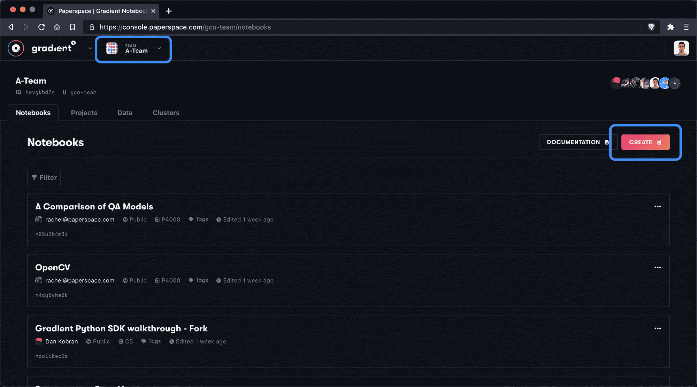

Select the team you'd like to use, navigate to the Notebooks tab, and then create a new notebook

## 2.配置笔记本

接下来，我们将为笔记本命名并选择 PyTorch 1.8 运行时，它将预装许多 PyTorch 助手。我们还将指定我们想要手动使用的 PyTorch 版本。

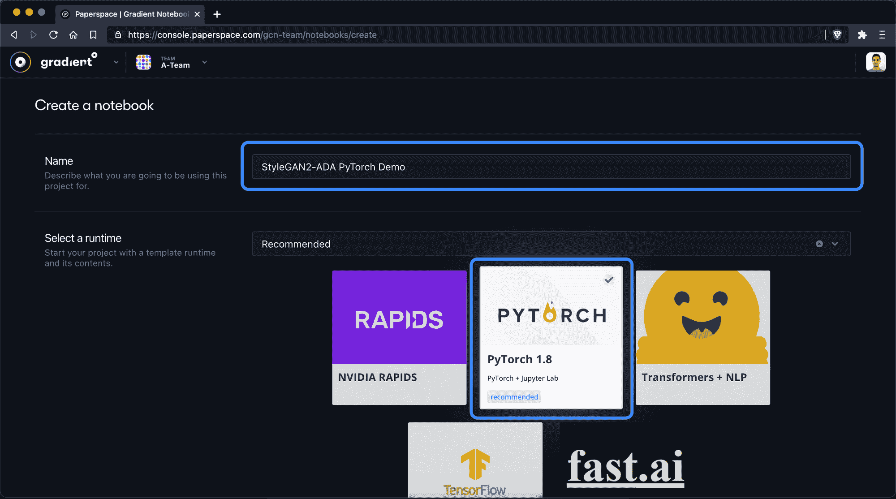

Give your notebook a name and select the PyTorch runtime

然后我们应该选择 [V100 GPU](https://gradient.paperspace.com/instances) 并配置一个至少 12 小时的[自动关闭](https://docs.paperspace.com/gradient/get-started/tutorials-list/getting-started-with-gradient-notebooks-old#launching-a-notebook-instance)周期。如果你想从头开始训练你的网络，考虑至少 12-24 小时。

请注意，一旦达到自动关机时间间隔，无论您是否仍在笔记本中工作，它都会保存并停止您的笔记本。

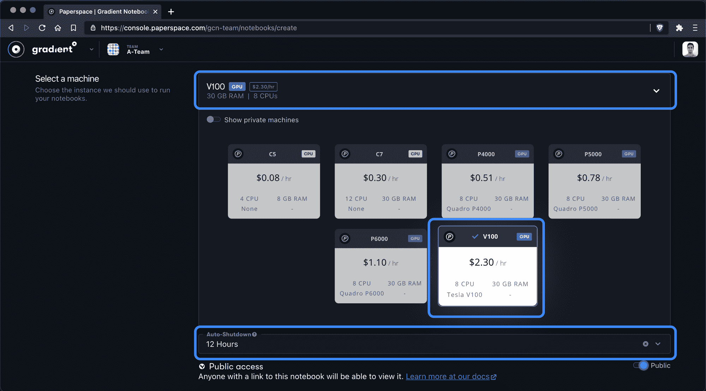

Select the V100 instance and at least 12 hours for auto-shutdown interval

接下来我们将打开高级选项，这样我们就可以插入一个自定义的`Workspace URL`。这将告诉 Paperspace 将 GitHub repo 的所有内容提取到新笔记本中。

在这里，我们将输入:

```py
https://github.com/NVlabs/stylegan2-ada-pytorch.git 
```

梯度笔记本现在将自动下载整个回购到我们的新笔记本！

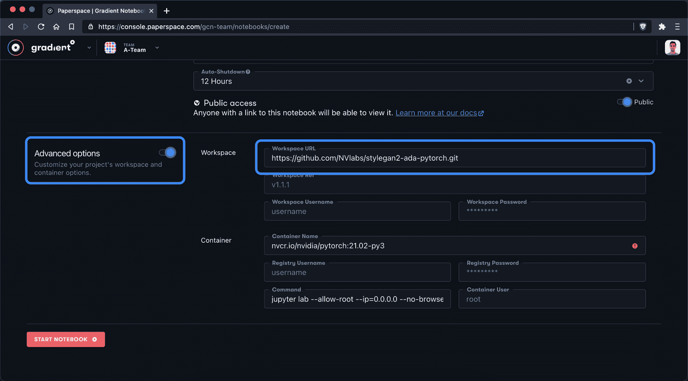

Add the StyleGAN2-ADA PyTorch GitHub repository to the custom workspace field 

## 3.等待笔记本启动

接下来，Paperspace 需要几分钟时间来复制 GitHub 存储库并启动 PyTorch 1.8 容器。耐心点！


It will take a few minutes to copy over the repository and build the notebook from the PyTorch container

现在容器正在运行，我们可以切换到实例选择器，查看 CPU 和 RAM 的使用情况。此信息也可以在底部状态栏上找到。

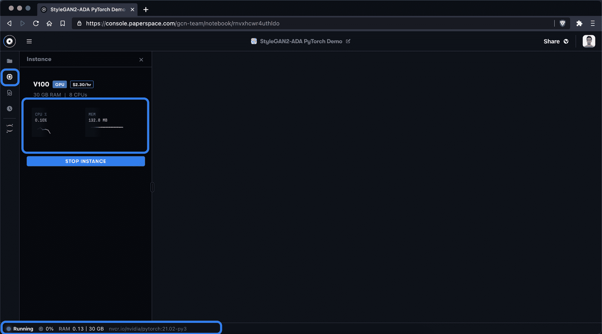

System metrics are available in the instance selector panel

## 4.创建笔记本文件

接下来，我们将创建一个新的。ipynb 文件来执行我们的工作。确保创建一个以`.ipynb`结尾的文件。

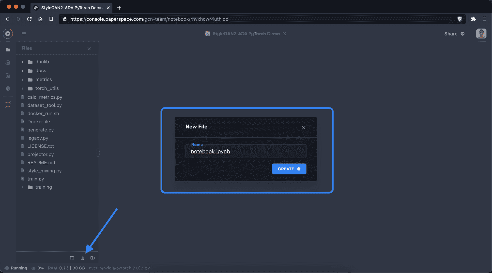

Select the `New File` button in the file manager in the sidebar and give your new file a name

## 5.安装依赖包

在撰写本文时，存储库的[最新提交](https://github.com/NVlabs/stylegan2-ada-pytorch/commit/25063950fc72acaa9740ba936379b36df1c5e456)使用以下依赖关系:

*   64 位 Python 3.7 和 PyTorch 1.7.1
*   包:点击请求 tqdm pyspng 忍者 imageio-ffmpeg==0.4.3

Paperspace 笔记本附带 Python 3.8 和 Anaconda。让我们确认这个事实:

```py
!python --version 
```

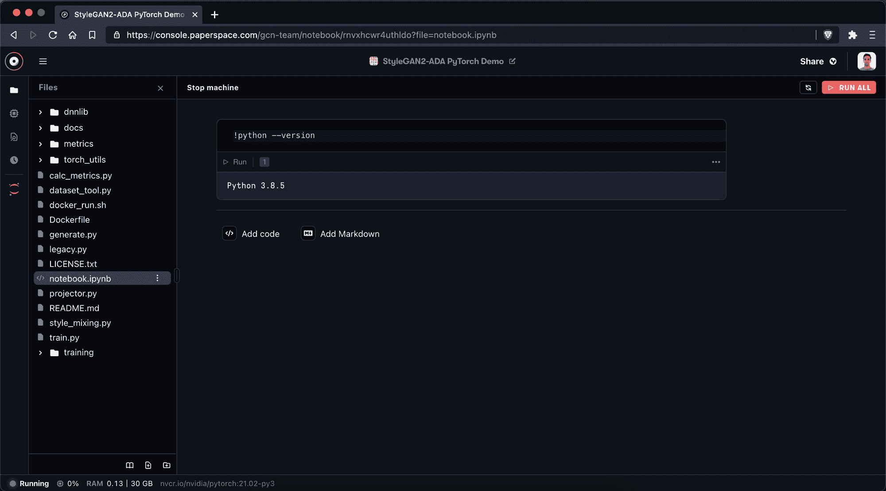

First we check to see what version of Python is installed in our notebook

好极了。看起来我们在这个实例上有 Python 3.8.5，所以我们应该降级到 Python 3.7 以避免任何冲突。

```py
!conda install -y python=3.7 
```

这里我们包含了`-y`标签，以确保我们提前确认了安装选项。我们这样做是因为我们从笔记本而不是从终端运行这个命令。

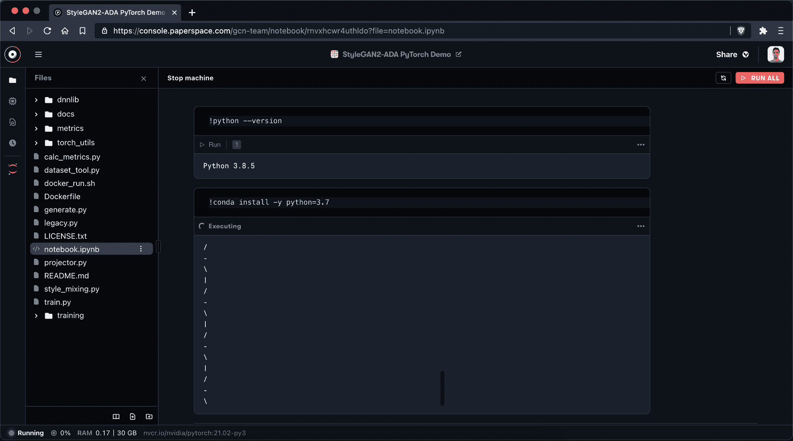

We downgrade to Python 3.7

现在，我们再次检查以确保 Python 安装正确

```py
!python --version 
```

这应该会返回一个 Python 3.7.x 版本。如果没有，请再次尝试上述命令或重新创建笔记本。

我们还可以检查我们的 GPU，看看我们的 GPU 设置是否成功。为此，请执行以下命令:

```py
!nvidia-smi 
```

您的输出应该如下所示:

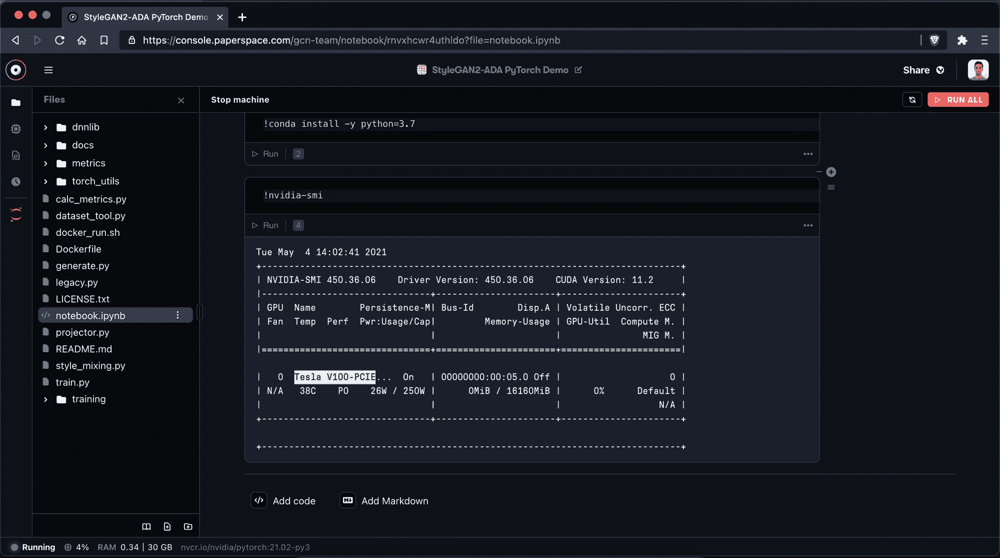

Check to make sure the notebook has GPU attached

你应该会看到 GPU 名称“Tesla V100-PCIE”。如果您看不到此 GPU(或您选择的 GPU)，请重新创建您的笔记本并确保您选择了 GPU。

接下来，我们将创建一个名为`requirements.txt`的文件，在一个地方管理我们的依赖关系。

再次使用“新建文件”按钮，并将文件命名为:


Create a new file in the root called "requirements.txt"

接下来，我们切换到刚刚创建的文件，并添加我们的依赖项:

```py
install
click
requests
tqdm
pyspng
ninja
imageio-ffmpeg==0.4.3
torch==1.7.1+cu110
torchvision==0.8.2+cu110
torchaudio===0.7.2 
```

确保使用 CMD + S 保存文件！

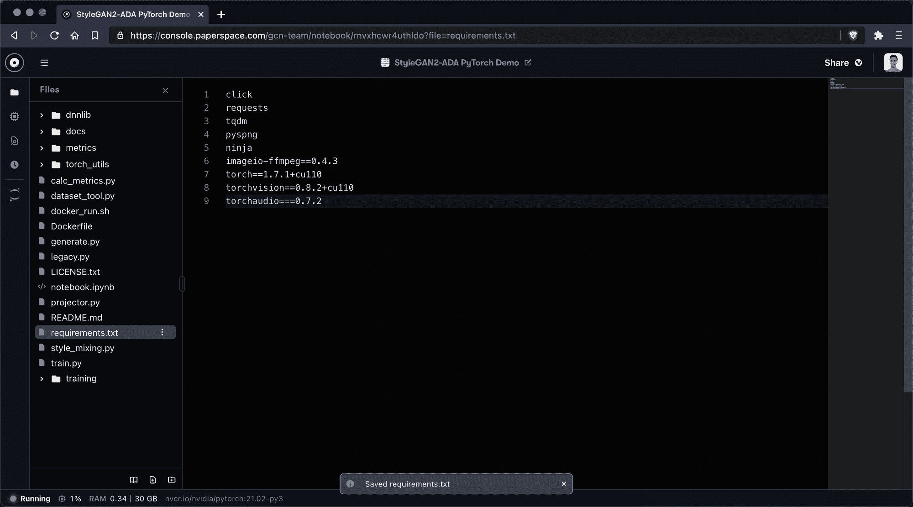

Save the .txt file with CMD + S

一旦我们保存了`requirements.txt`,我们运行命令:

```py
!pip install -r ./requirements.txt -f https://download.pytorch.org/whl/torch_stable.html 
```

这告诉笔记本安装依赖项列表。

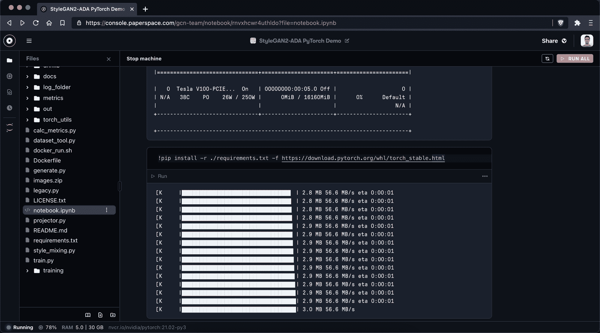

Install dependencies from requirements.txt file

太好了！

## 6.生成种子

为了检查一切是否正常，让我们使用预训练的 metfaces 模型并创建几个样本:

```py
!python generate.py --outdir=out --trunc=1 --seeds=85,265,297 --network=https://nvlabs-fi-cdn.nvidia.com/stylegan2-ada-pytorch/pretrained/metfaces.pkl 
```

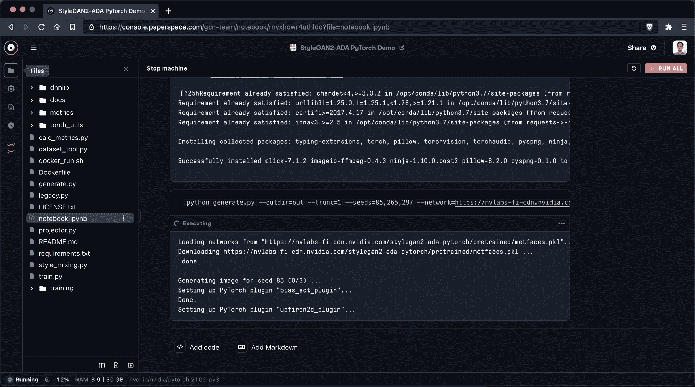

Generate seed images using the pre-trained metfaces model

在新创建的文件夹`out/`中，您可以找到您的样本！太棒了。

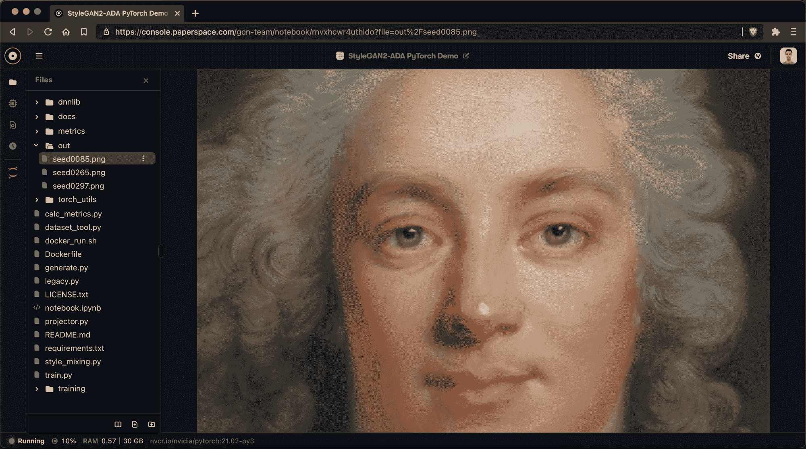

Sample image created via the pretrained metfaces model that comes with this repository.

## 7.开始训练

要开始我们自己的训练，我们应该首先上传您的数据集。

如前所述，出于本教程的目的，我们将使用 [Metfaces 数据集](https://github.com/NVlabs/metfaces-dataset)，但请记住已经有一个使用 metfaces 的预训练模型，因此在该数据集上的训练不一定会有成效。

为了方便起见，我们在这里上传了 metfaces 数据[的 zip 文件，我们将使用这个端点将图像集上传到我们的笔记本中。](https://s3.amazonaws.com/ps.public.resources/ml-showcase/stylegan2-ada-pytorch/n02106166-Border_collie.zip)

首先，我们从链接上传压缩数据集:

```py
!wget https://s3.amazonaws.com/ps.public.resources/ml-showcase/stylegan2-ada-pytorch/n02106166-Border_collie.zip 
```

上传 zip 文件后，我们将使用三个变量:

```py
raw_dataset_path = /notebooks/images.zip  # change name of images.zip
dataset_path = /notebooks/dataset_ready
log_path = /notebooks/log_folder 
```

然后，我们可以将我们的图像转换成正确的格式。

官方存储库提供了一个工具，因为宽度和高度应该是 x 值。如果你最初的图像不是方形的，这会导致奇怪的图像。

不同的图像尺寸有不同的解决方案(请阅读[官方文档](https://github.com/NVlabs/stylegan2-ada-pytorch))。

现在，我们将创建宽度和高度为 64px 的图像:

```py
!python dataset_tool.py --source {raw_dataset_path} --dest {dataset_path} --width=64 --height=64 
```

对于更高的分辨率，这可能需要相当长的时间。

做完了，现在是时候从头开始训练我们的网络了！

当我们在 V100 上运行本教程时，需要几个 ***小时*** 才能达到 kimg = 1000。

所以请注意，这个模型可能需要一些时间来训练-特别是如果你使用的东西没有 V100 强大。

也就是说，我们现在可以通过运行以下命令从头开始训练网络:

```py
!python train.py --outdir={log_path} --data={dataset_path} --gpus=1 
```

在“log_folder”文件夹中，我们可以找到不同的文件。最有趣的是 fakesxxxxxx.png 档案。这个文件向我们展示了由我们新训练的模型创建的不同样本。

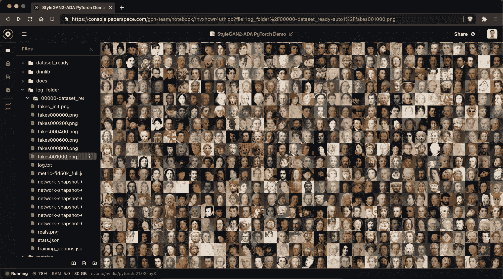

Images within log_folder get better and better each 200 kimg sample

随着你越来越多地训练模型，你会看到那些图像变得越来越好。

默认情况下，每 200 kimg 创建一个样本和检查点。这也意味着你不必担心失去你的进步。您可以随时使用`--resume={insert_path_to_pkl}`标志继续训练(点击了解更多信息[)。](https://github.com/NVlabs/stylegan2-ada-pytorch/blob/main/docs/train-help.txt)

为了充分利用您的模型，您应该阅读 StyleGAN 资源库的官方文档[。他们非常详细地解释了不同的功能以及如何应用它们。](https://github.com/NVlabs/stylegan2-ada-pytorch)

# 5.进一步阅读

感谢您的阅读！

除了官方资料库，我强烈推荐你查看 YouTube 频道[人工图像](https://www.youtube.com/user/bustbright/videos)。他有很多很好的教程和讲解。

更技术性的理解，我推荐阅读[官方研究论文](https://arxiv.org/abs/2006.06676)。