# 如何在 YouTube 上流式播放&用 OBS 抽动

> 原文：<https://blog.paperspace.com/how-to-stream-on-youtube-twitch-with-obs/>

开放广播软件(OBS)是最流行的视频录制和直播工具之一。它是免费和开源的，易于设置，并内置了对 Twitch 和 YouTube 等最常见的直播平台的支持。在本指南中，我们将从头到尾介绍如何使用 OBS Studio 开始直播。

[Open Broadcaster 软件](https://obsproject.com/)(即 OBS)是最流行的视频录制和直播工具之一。OBS 是免费和开源的，易于设置，并内置了对 Twitch 和 YouTube 等最常见的直播平台的支持。在本指南中，我们将从头到尾介绍如何使用 OBS Studio 开始流媒体播放。

想要更多曝光？

如果你想让你的信息流被 Paperspace 收录，请给我们发邮件到 hello@paperspace.com，或者发推特给我们，附上#PoweredByPaperspace 的标签

## **教程大纲**

*   [推出一款机子](#launch)
    *   高性能:游戏流媒体
    1.  基本:音频和简单应用流
*   [安装 OBS](#install)
    *   下载安装 OBS
    1.  下载并安装 Visual Studio 2013 运行时
*   [配置 OBS](#configuring)
    *   比特率
    *   编码
    *   设置您的场景
    1.  解决
*   [连接到 Twitch](#twitch)
    *   配置 OBS 连接到 Twitch

    1.  找到您的流密钥
*   [连接 YouTube](#youtube)
    *   配置 OBS 连接 YouTube
    1.  找到您的流密钥
*   [结论](#conclusion)

* * *

### **1。**创造一种新的纸张空间机器

登录到 Paperspace 后，创建一台新机器。

*   选择最近的*区域*

*   选择一个 Windows *模板*

*   选择*每月*或*每小时*取决于你的流媒体播放频率

*   选择你的*计划*:

    *   **音频和非图形密集型应用(基本):**如果您正在传输非密集型应用，如代码编辑器、在线扑克游戏或音频混音等。，这些*标准 GPU* 机器( *Air* 、*标准*、*高级*和 *Pro* )工作起来棒极了。在这种情况下，您将在 OBS 中使用软件编码。您无法在这一层上运行任何高端游戏，也无法获得与 GPU 编码一样高的比特率。如果这听起来像你想要的设置，那么*高级*计划是最受欢迎的。

    *   **游戏流(高性能):**如果您正在运行图形密集型游戏，如《巫师》、《守望先锋》等。，并希望向您的观众交付高比特率流，需要一台*专用 GPU* 机器( *GPU+* 、 *P5000* 和 *P6000* )。 *GPU+* 是中端游戏的理想选择，而 *P5000* 和 *P6000* 旨在实现最高性能。

*   选择您的*存储空间* —您可以在未来随时增加存储空间

*   点击*创建*

### **2。**安装 OBS

**步骤 1 -先决条件**

请下载并运行所需的 [Vistual Studio 运行时](https://obsproject.com/visual-studio-2013-runtimes)的**两个**，以便继续设置:

[Visual Studio 2013 运行时[64 位] - vcredist_x64.exe](https://obsproject.com/downloads/vcredist_x64.exe)

[Visual Studio 2013 运行时[32 位] - vcredist_x86.exe](https://obsproject.com/downloads/vcredist_x86.exe)

注意:*即使您有 64 位版本的 Windows，也应该安装 32 位和 64 位版本。*

现在您已经准备好安装 OBS Studio 了:

**步骤 2 -安装 OBS Studio**

[下载链接](https://obsproject.com/download)

使用默认设置运行安装程序。在最后一步，取消选中“运行 OBS studio”

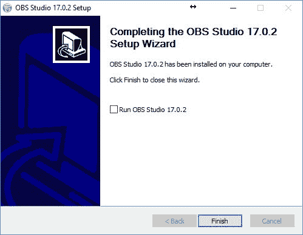

为什么？默认情况下，OBS 以 32 位模式启动，没有 64 位选项快。单击开始菜单并启动 64 位版本:

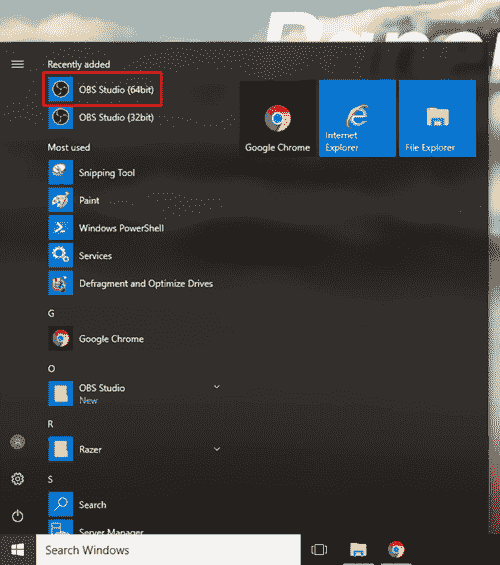

当 OBS 启动时，您可以忽略自动配置向导，因为我们将手动配置 OBS。如果您想在以后启动该向导，可以在工具下拉列表中找到它:

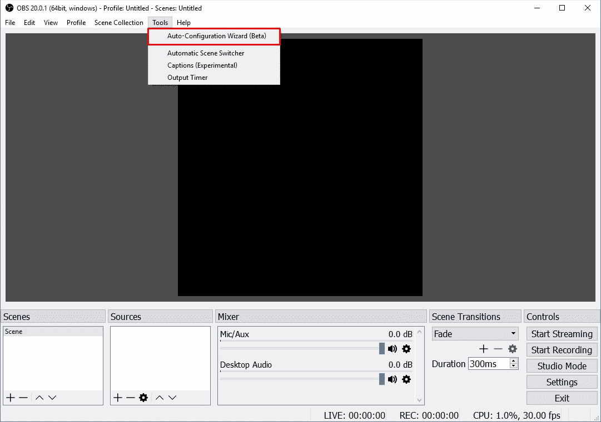

### **3。**配置 OBS

要启动一个基本流，您只需要在 OBS 中配置一些东西。对于 OBS 中更高级的定制，查看他们的指南或其他在线教程。

我们将从选择流的分辨率开始。单击右下方的设置图标:

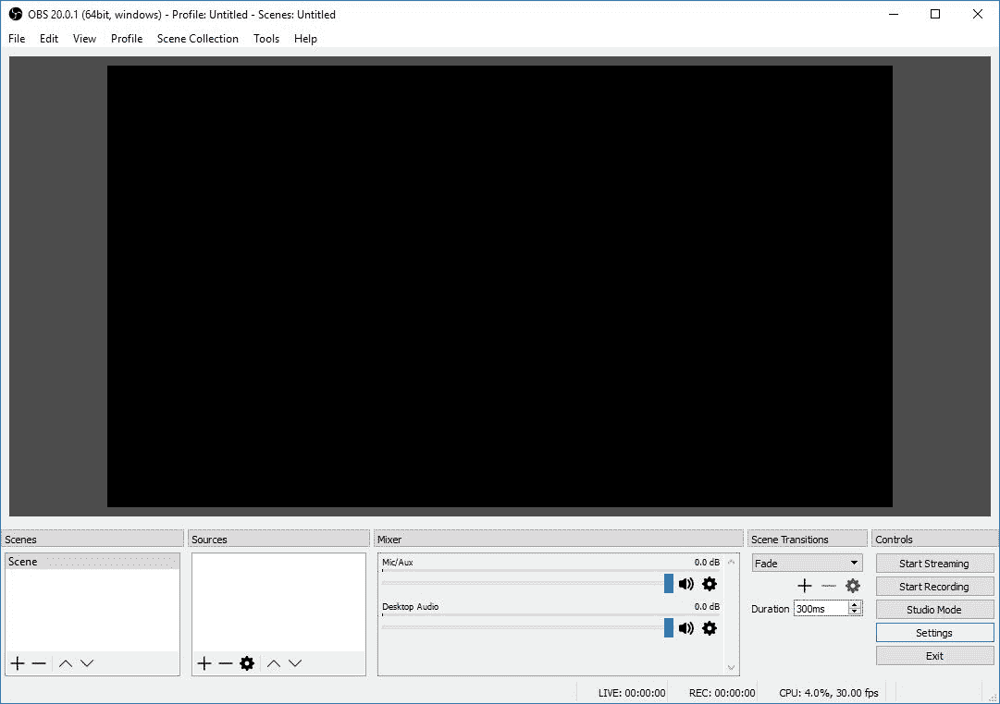

在视频选项卡上，选择所需的基本分辨率和输出分辨率:

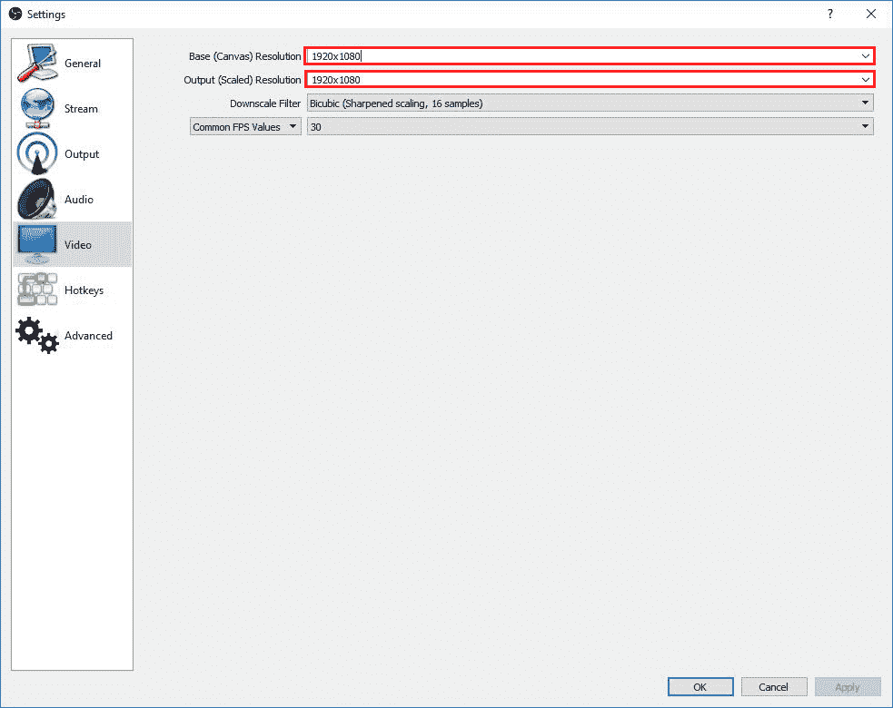

接下来，我们将跳转到*输出*选项卡，选择*视频比特率*和*编码器*。

默认比特率 2，500 足以满足大多数情况，但可以根据您的喜好增加/减少。

编码器取决于运行的[机器的类型。](#launch)

*   如果您使用的是*标准 GPU* 机器( *Air* 、*标准*、*高级*和 *Pro* )，您需要选择 ***软件(x264)*** 选项，该选项将使用 CPU 对流进行编码(较慢)。
*   如果您使用的是*专用 GPU* 机器( *GPU+* 、 *P5000* 和 *P6000* )，您应该选择 ***硬件(NVENC)*** 选项，该选项将使用 GPU 来编码流(更快)。

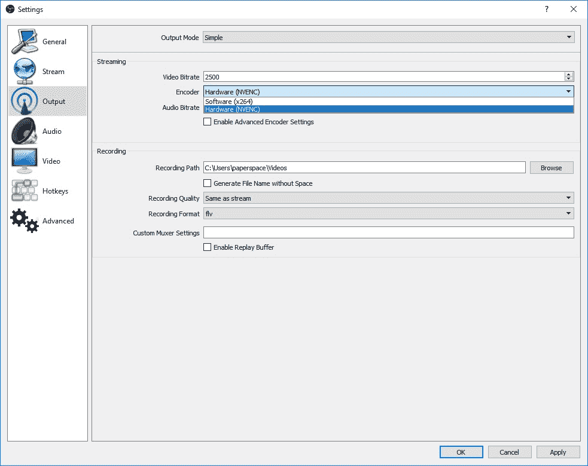

关闭设置菜单，我们将创建一个*信号源*。这基本上是我们将要捕获的屏幕的一部分。单击“+”号开始:

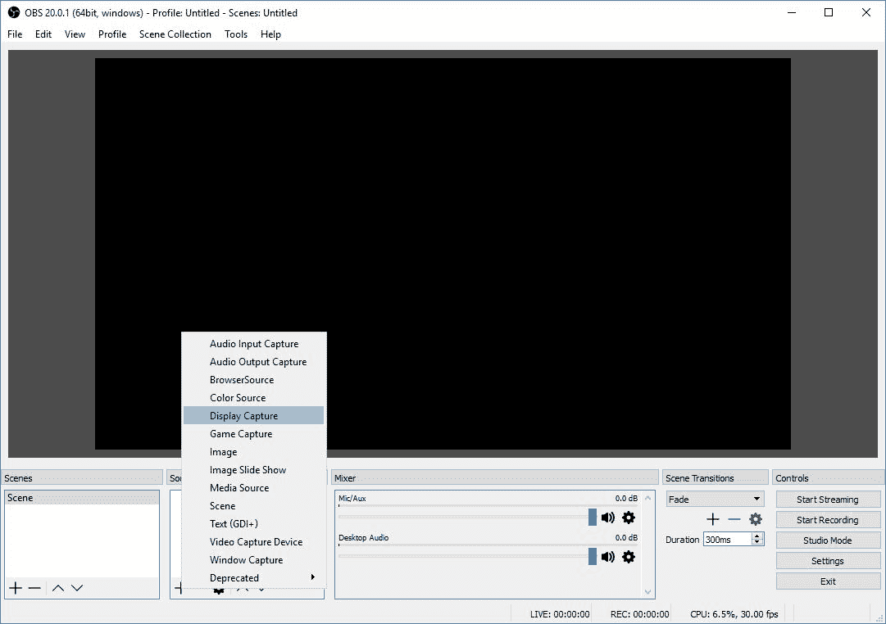

对于各种类型的流，这里有几个选项:

*   *显示捕获*将捕获整个显示，但不是全屏游戏
*   *游戏捕捉*用于全屏捕捉游戏
*   *窗口捕获*用于捕获您正在运行的特定窗口(应用程序)

其他模式不太常见。更多信息请参考 OBS 工作室的[文档](https://obsproject.com/forum/)。在这个演示中，我们将使用*显示捕捉*模式。单击“确定”添加源:

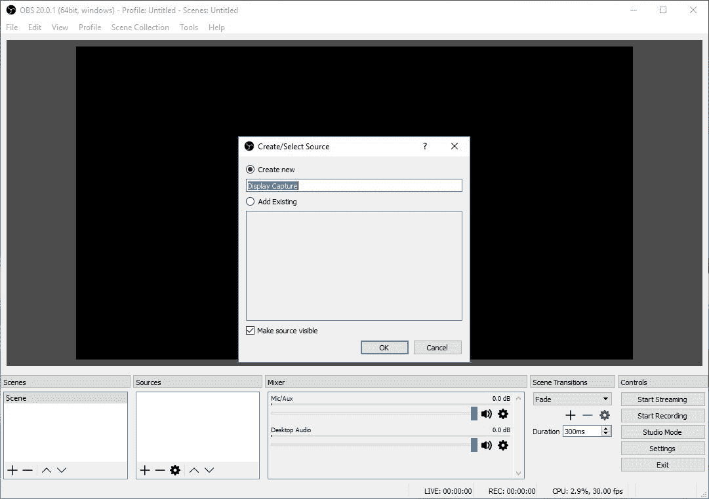

再次单击“确定”接受属性:

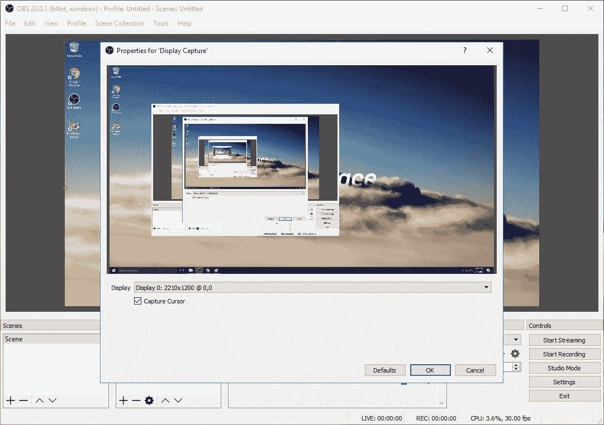

通过抓取红色轮廓并将其拉进以适应黑盒(场景)来完成流的合成:

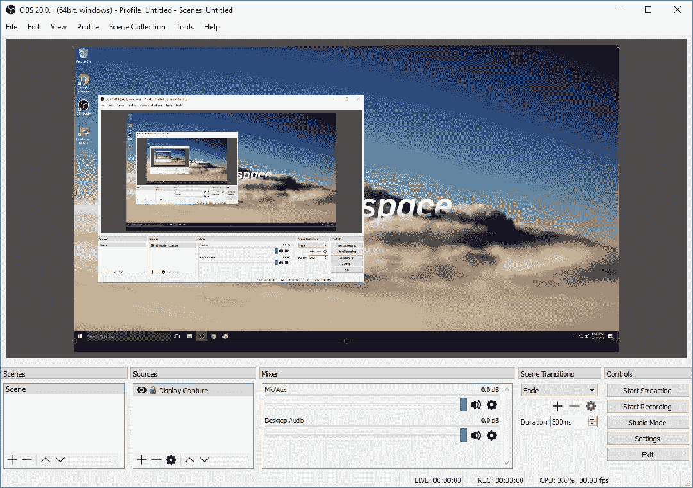

就是这样！您现在可以开始流式播放了。

### **4。**连着抽动

首先导航到抽动[设置页面](https://www.twitch.tv/papertest1/dashboard/settings)。在这里，您将看到一个显示您的密钥的选项，我们会将该密钥插入 OBS:

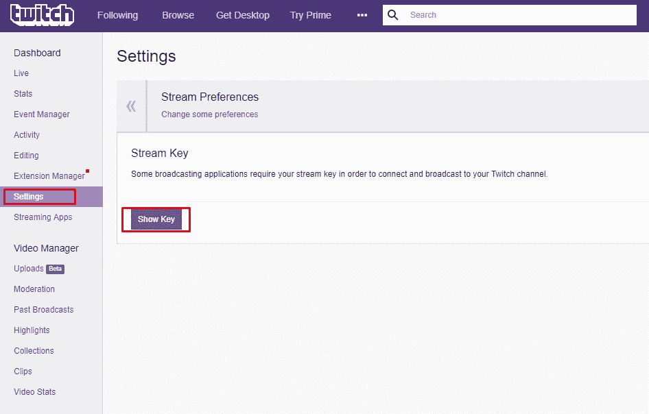

**请注意:** *确保不要与任何人共享您的流密钥，否则他们将能够流至您的 Twitch 频道。*

复制密钥并导航回 OBS 中的*流*选项卡。在*服务*下，选择*抽动*。然后选择最近的服务器(在本例中，*美国东部:纽约，NY* ，然后将您的流密钥粘贴到*流密钥*字段:

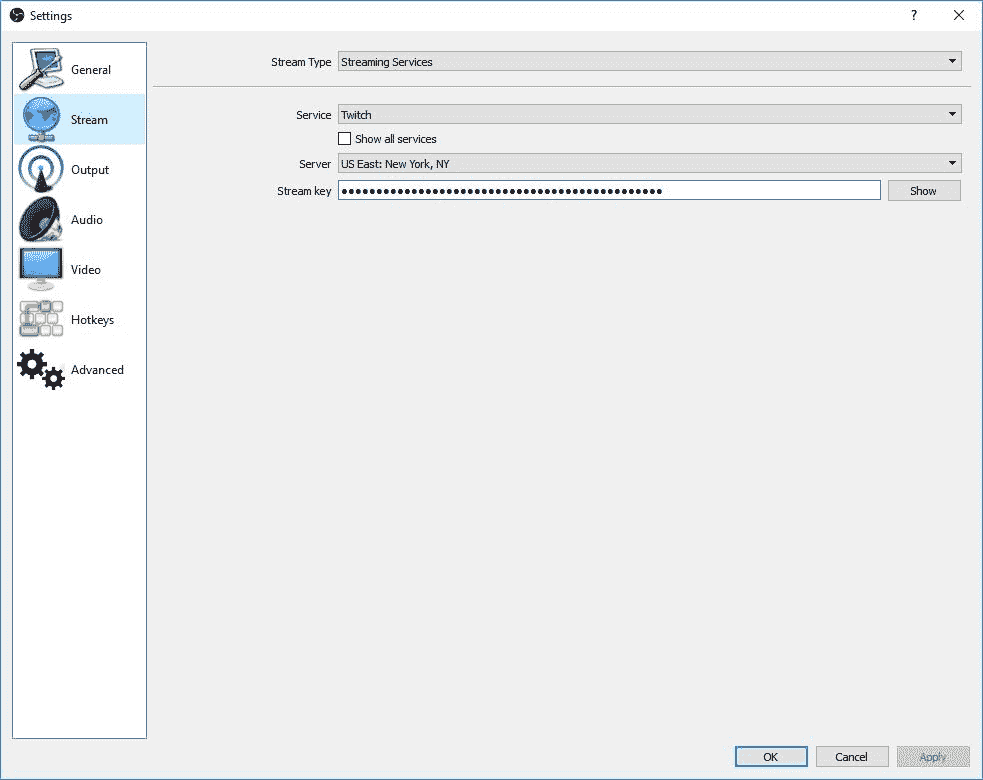

你都准备好了！只需点击“开始播放”即可开始播放:

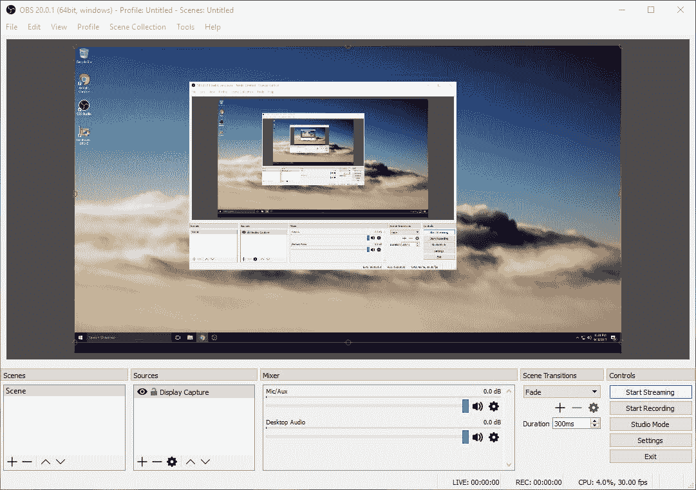

### **5。**连接到 YouTube

首先导航到 [YouTube 直播仪表盘](https://www.youtube.com/live_dashboard)。在页面底部的*编码器设置*部分，你会找到你的*流键*。

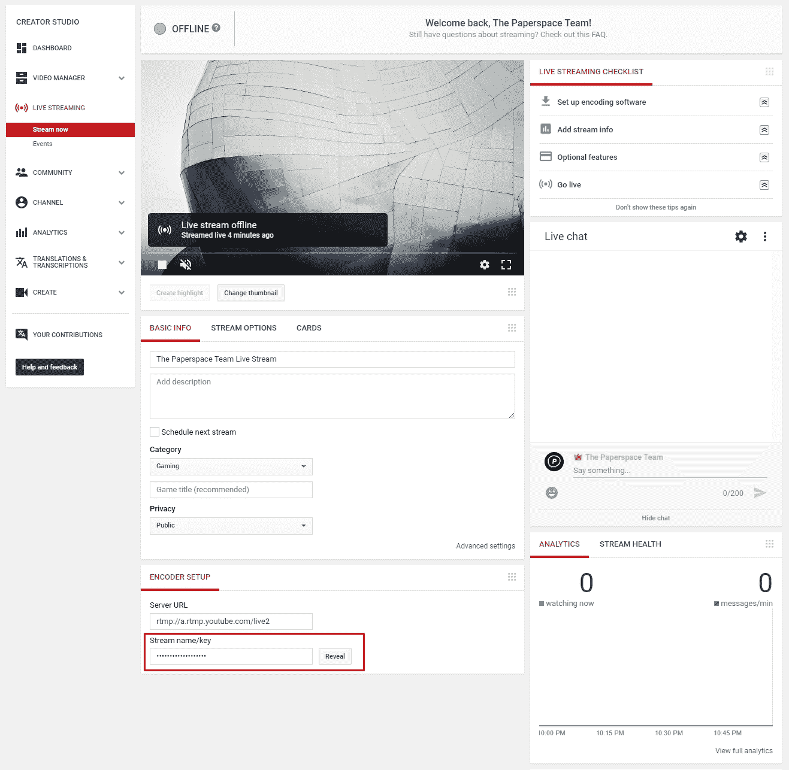

**请注意:** *确保不要与任何人共享您的流密钥，否则他们将能够传输到您的 YouTube 频道。*

复制密钥并导航回 OBS 中的*流*选项卡。在*服务*下，选择 *YouTube / YouTube 游戏*。在*服务器*下，选择*主 YouTube 摄取服务器*，然后将您的流密钥粘贴到*流密钥*字段:

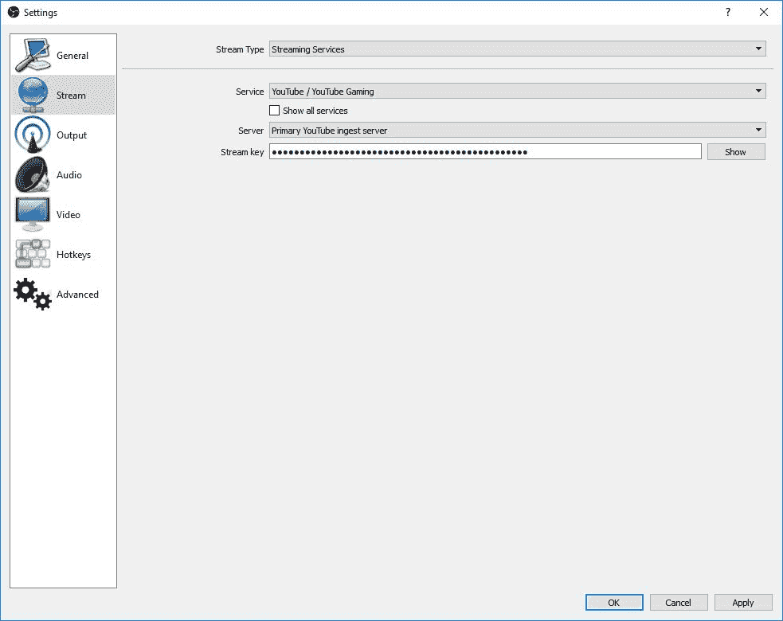

你都准备好了！只需点击“开始播放”即可开始播放:

### **6。**结论

在短短几分钟内，我们就能够使用 OBS Studio 和 Twitch/YouTube 启动并运行实时流。如您所见，OBS 消除了屏幕捕获组件的麻烦。尽管 OBS 使用起来非常简单，但它仍然具有值得探索的高级功能。尽情享受吧！

要开始自己的直播，请在此注册。