# 如何训练缩放的 YOLOv4 对象检测模型

> 原文：<https://blog.paperspace.com/how-to-train-scaled-yolov4-object-detection/>

随着 [Scaled-YOLOv4](https://arxiv.org/abs/2011.08036) 的发布，物体检测技术向前迈进了一步——这是一种用于[物体检测](https://blog.roboflow.com/object-detection/)的最新机器学习模型。

在这篇博文中，我们将看看在创建缩放的 YOLOv4 模型中涉及的突破，然后我们将通过一个示例来研究如何在自定义数据集上概括和训练该模型，以检测自定义对象。

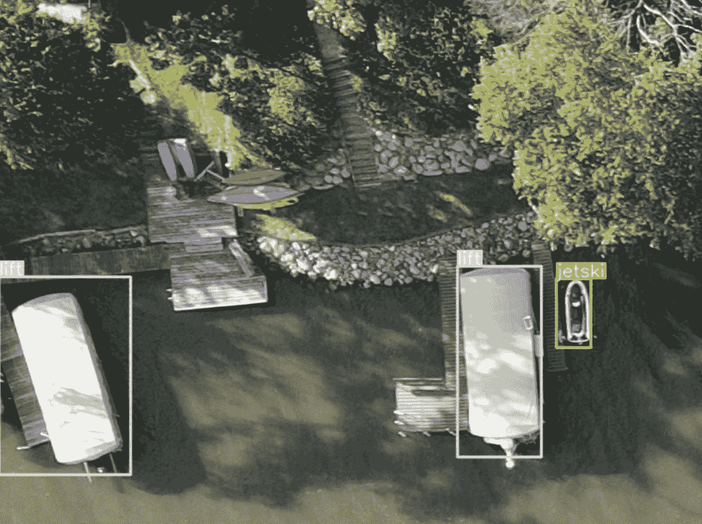

Detecting lifts and jet skis from above via drone using Scaled-YOLOv4\. Training data: [public Aerial Maritime dataset](https://public.roboflow.com/object-detection/aerial-maritime).

我们在本教程中包含了以下资源:

*   [缩放后的 YOLOv4 分解](https://blog.roboflow.com/scaled-yolov4-tops-efficientdet/)
*   [缩放后的 YOLOv4 回购](https://github.com/WongKinYiu/ScaledYOLOv4)
*   [公共航空海事数据集](https://public.roboflow.com/object-detection/aerial-maritime)
*   缩放的 YOLOv4 自定义培训代码(如下)

在本教程中，我们将利用 [**Roboflow**](https://roboflow.com/) 进行计算机视觉数据管理，利用 [**Paperspace**](https://www.paperspace.com/) 进行 GPU 计算资源。

## 为什么选择 Scaled-YOLOv4？

基于微软 COCO 基准测试的[，缩放后的 YOLOv4 现在](https://blog.roboflow.com/coco-dataset/)[是对象检测](https://blog.roboflow.com/scaled-yolov4-tops-efficientdet/)的最佳模型。

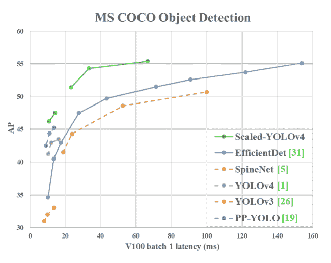

Scaled-YOLOv4 achieves record breaking performance on the [COCO benchmark](https://blog.roboflow.com/coco-dataset/). Not pictured [YOLOv4-tiny](https://blog.roboflow.com/train-yolov4-tiny-on-custom-data-lighting-fast-detection/) running at 1774 FPS on the RTX 2080ti ([source](https://arxiv.org/pdf/2011.08036.pdf))

在 Roboflow，我们发现，在推理速度和网络准确性的权衡连续体中，缩放后的 YOLOv4 系列模型在效率和所有其他现有的对象检测网络(由 T2 平均精度衡量)中名列前茅。

如果你想了解为什么 Scaled-YOLOv4 这么好，请查看我们在 Roboflow 博客上写的 [Scaled-YOLOv4 分解](https://blog.roboflow.com/scaled-yolov4-tops-efficientdet/)。我们还建议查看一下[缩放的 YOLOv4 论文](https://arxiv.org/abs/2011.08036)，以探索原作者提出的基准。

一旦您阅读了支持技术，让我们开始培训吧！

## 组装自定义对象检测数据

为了监督我们定制的缩放 YOLOv4 对象检测器，我们需要收集对象检测训练数据。如果您想直接学习本教程，您可以使用数据集页面右上角的`Fork`按钮来分叉[公共航空海事数据集](https://public.roboflow.com/object-detection/aerial-maritime):

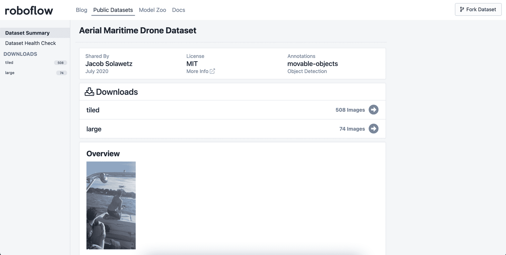

To fork the public aerial maritime dataset, use the **Fork Dataset** feature in Roboflow

### 收集您自己的图像

或者，如果您想使用自己的图像，我们建议您收集能够代表您的模型在部署时将面临的条件的图像。你可以从一小批图像开始，以评估可行性，然后扩大规模——但一般来说，图像越多样化，最终结果越好。

### 标注您的数据

在本教程中，我们将使用公共航空海事数据集中的影像。一旦你有了你想用来训练你的模型的图像，就该给它们贴标签了。

您现在可以直接在 [Roboflow](https://roboflow.com/) 中标记您的数据，如下所示:


Uploading data Roboflow after creating a new dataset

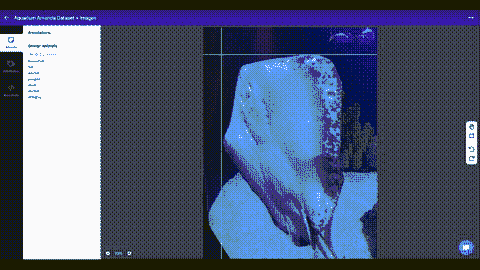

Labeling data in Roboflow

要给图像加标签，需要在要检测的对象周围绘制边界框。这里有一些关于为这种计算机视觉应用标记图像的提示:

1.  标记每幅图像中的每个感兴趣的对象
2.  标记一个物体的整体
3.  标记遮挡的对象
4.  创建紧密的边界框
5.  创建特定的标签名称
6.  保持清晰的标签说明
7.  使用标签工具，如 [CVAT](https://blog.roboflow.com/getting-started-with-cvat/) 、[标签](https://blog.roboflow.com/labelimg/)、矩形标签和[机器人流程](https://docs.roboflow.com/annotate)

要在 Roboflow 中手动标记数据，首先需要[上传原始图像并创建一个新的数据集](https://docs.roboflow.com/adding-data)。在新数据集页面中，开始标注所需的全部操作就是单击图像并绘制边界框。关于注释的更多细节，请查看[标签文档](https://docs.roboflow.com/annotate)。

### 将数据导出到图纸空间

一旦您对标注的数据集感到满意，您就可以继续在 Roboflow 中生成数据集版本。为此，从 Roboflow 的数据集视图中选择`Download`。您还可以选择任何您喜欢的预处理和增强选项。

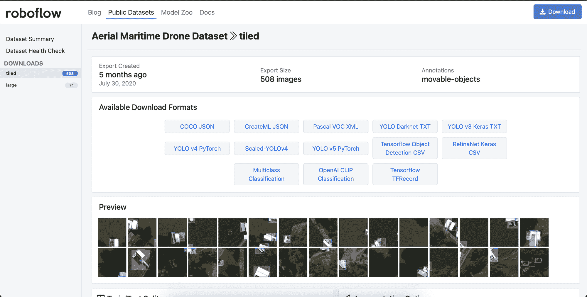

Select **Download** to generate a dataset

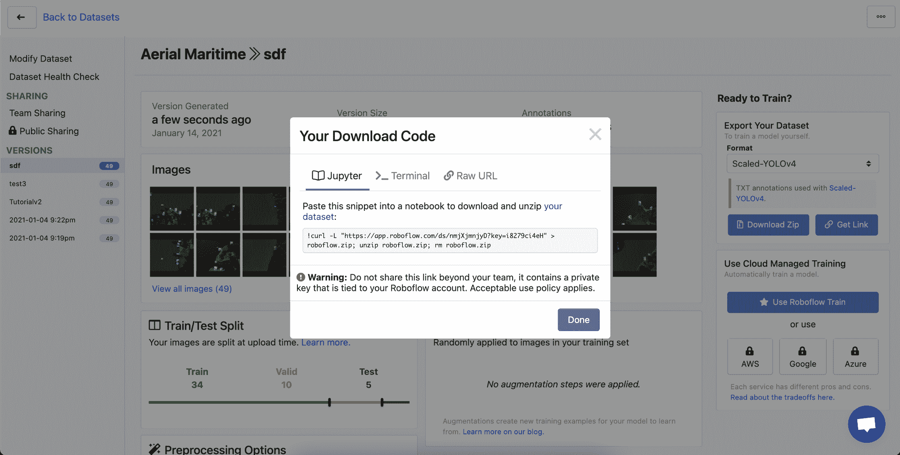

You should end up with a curl link to the dataset

选择`Download`后，选择`TXT > Scaled-YOLOv4`作为输出格式，然后选择`Get Link`获得一个`curl`链接到您的数据。

请保留此链接，因为您将使用它在一分钟内将您的数据集导入到您的 Paperspace 笔记本中。

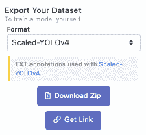

Choose the Scaled-YOLOv4 dataset format

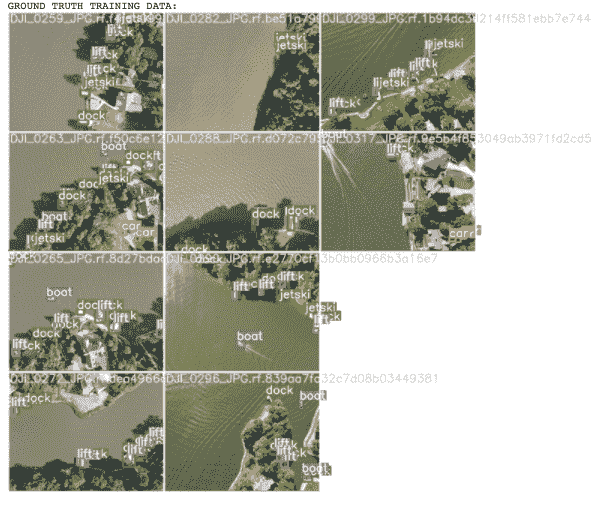

Visualizing our training data within Scaled YOLOv4

## 在 Paperspace 上设置我们的培训环境

为了训练我们的缩放 YOLOv4 模型，我们首先需要提供 GPU 资源来运行我们的训练作业。

由于在家庭中使用更大的网络时，Scaled-YOLOv4 培训需求会大幅增加，因此 Paperspace 是一个自然的起点，因为有各种各样的[按需 GPU 支持的实例](https://gradient.paperspace.com/instances)可用。

当然，您可以使用任何可用的 GPU 资源，并且仍然遵循本教程。

### 创建托管集群

首先，您需要创建一个 Paperspace 帐户。

登录到 Paperspace 后，导航到`Gradient`和`Clusters`，然后选择`Create a Managed Cluster`。

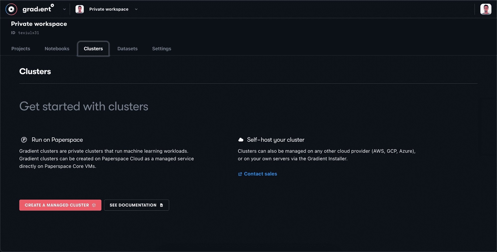

Navigate to the Clusters tab in Paperspace Gradient and select **Create a Managed Cluster**

您将看到新的私有集群处于`Provisioning`状态，集群将需要几分钟的时间进行配置，因此请耐心等待。

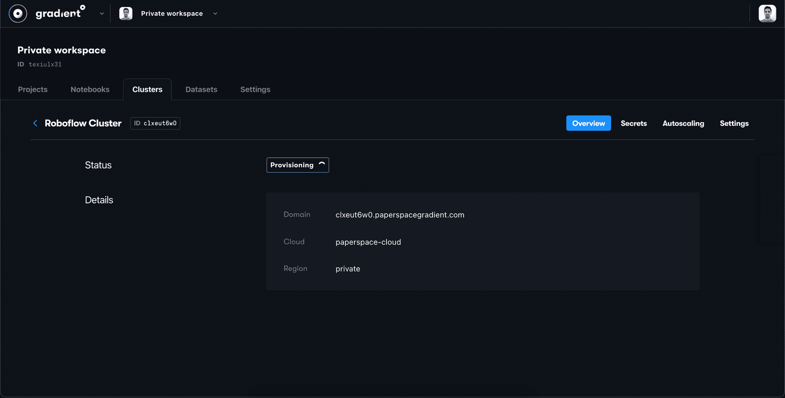

It will take a few minutes for the new cluster to provision

### 创建笔记本

配置好集群后，您可以在`Notebooks`选项卡中启动笔记本进行培训。

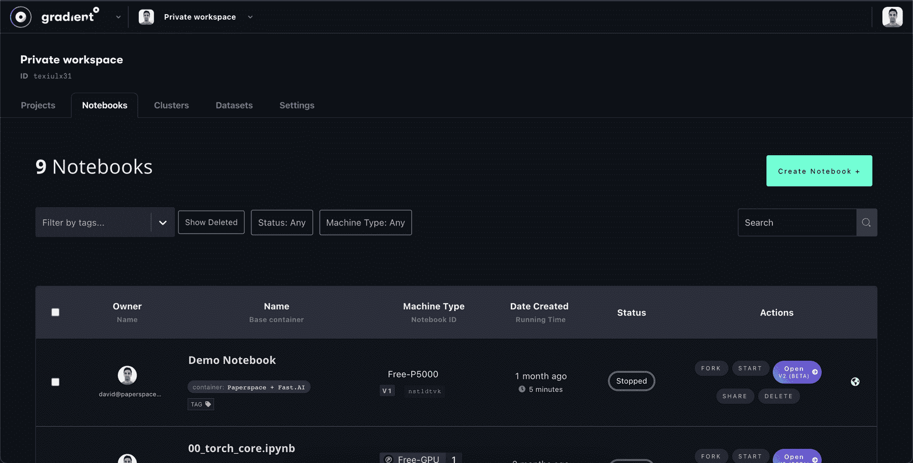

Select Create Notebook to initialize a new notebook in Paperspace

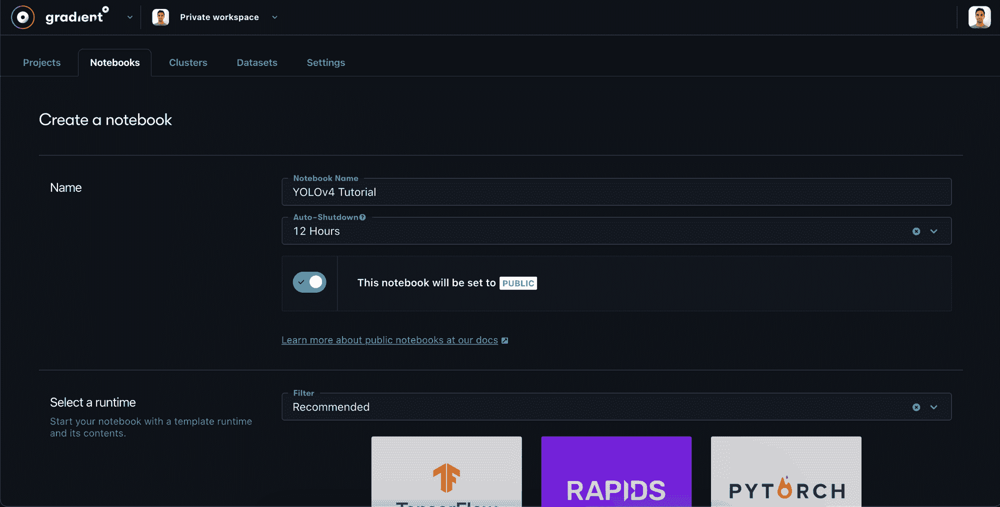

Name your notebook and select an auto-shutdown interval

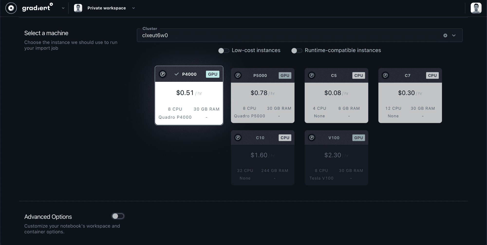

Select an instance from your new private cluster

在图纸空间的笔记本设置提示中:

1.  在步骤 1 中，给你的笔记本起一个名字，例如 **YOLOv4 教程**。您可能还想将`auto-shutdown`设置为 1 小时，以防万一您稍后忘记关机时过度充电。
2.  在步骤 2 中，我们可以将容器选择留空。我们将在步骤 4 中指定一个自定义容器。
3.  在第 3 步中，选择`My Private Clusters`，然后选择带有您想要训练的 GPU 的私有集群。更大的 GPU 将更快地训练你的模型——我们在本教程中使用了 P4000。
4.  在步骤 4 中，打开`Advanced Options`并将下面的 [NVIDIA PyTorch 容器](https://ngc.nvidia.com/catalog/containers/nvidia:pytorch)复制到`Container Name`字段中:

```py
nvcr.io/nvidia/pytorch:20.06-py3
```

Paste this image location in `Container Name` field under Advanced Options

高级选项应该是这样的:

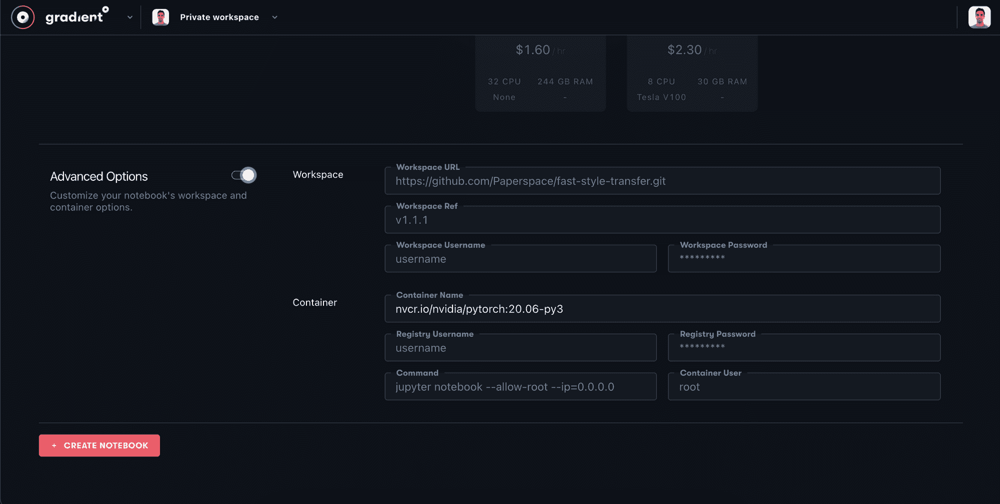

Enter the image location into the **Container Name** field

点击`Create Notebook`，Paperspace 将在您的新私有集群上启动您的培训环境。这个过程也可能需要几分钟。

## 安装缩放的 YOLOv4 依赖项

现在是时候打开朱庇特笔记本了。

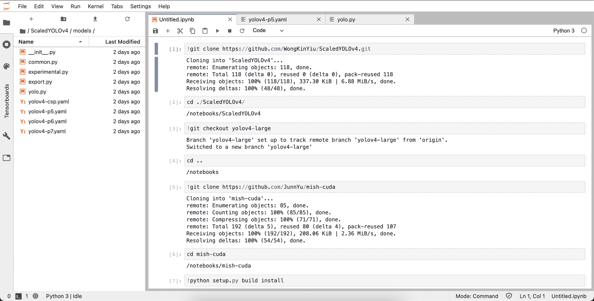

Installing a few dependencies in the new notebook

一旦我们进入笔记本电脑，我们需要在准备培训之前进行一些安装。

### 安装依赖项

我们克隆了[缩放后的 YOLOv4 回购](https://github.com/WongKinYiu/ScaledYOLOv4)，并切换到`yolov4-large`分支。

```py
#clone Scaled_YOLOv4
!git clone https://github.com/WongKinYiu/ScaledYOLOv4.git  # clone repo
%cd ./ScaledYOLOv4/
#checkout the yolov4-large branch
!git checkout yolov4-large
%cd ..
```

接下来，我们将为我们的 GPU 安装`mish-cuda`，这样我们就可以在笔记本的 GPU 上快速运行 mish 激活功能。

```py
!git clone https://github.com/JunnYu/mish-cuda
%cd mish-cuda
!python setup.py build install
%cd ..
```

### 下载数据

最后，从 Roboflow 导入您的`curl`链接，以正确的格式导入您的数据。这应该从`ScaledYOLOv4` repo 文件夹向上一个目录执行。

```py
!curl -L "https://app.roboflow.com/ds/h91wwIw5An?key=[YOUR KEY HERE]" > roboflow.zip; unzip roboflow.zip; rm roboflow.zip
```

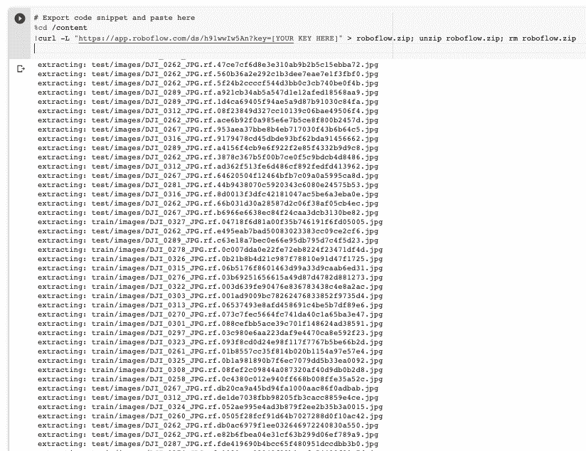

Downloading data into the notebook

## 开始规模化 YOLOv4 培训

现在我们已经设置好了一切，我们只需要调用一个命令来开始对我们的定制数据进行训练。

```py
cd ./ScaledYOLOv4/
!python train.py --img 416 --batch 16 --epochs 50 --data '../data.yaml' --cfg ./models/yolov4-csp.yaml --weights '' --name yolov4-csp-results  --cache
```

以下选项是可能的:

```py
- img: define input image size
- batch: determine batch size
- epochs: define the number of training epochs. (Note: often, 3000+ are common here!)
- data: set the path to our yaml file
- cfg: specify our model configuration
- weights: specify a custom path to weights.
- name: result names
- nosave: only save the final checkpoint
- cache: cache images for faster training
```

一旦训练开始，你要观察 [图(平均精度)](https://blog.roboflow.com/mean-average-precision/)度量上升，如果它稳定下来你就可以停止脚本。

训练结束后，你可以看看你的 Tensorboard 指标，再次关注地图:

```py
# Start tensorboard
# Launch after you have started training
# logs save in the folder "runs"
%load_ext tensorboard
%tensorboard --logdir runs
```

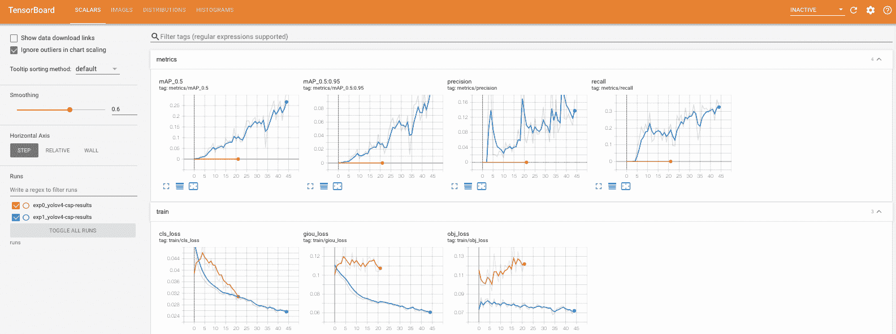

Scaled YOLOv4 Tensorboard

### 按比例放大

如果你想使用更大版本的网络，在训练中切换 cfg 参数。在`models`文件夹中，你会看到各种型号配置选项，包括`yolov4-p5`、`yolov4-p6`和著名的`yolov4-p7`。为了训练这些较大的模型，单个 GPU 可能不适合您，您可能需要启动一个多 GPU 服务器，并通过分布式启动在多 GPU 上进行训练:

```py
python -m torch.distributed.launch --nproc_per_node 4 train.py --batch-size 64 --img 896 896 --data coco.yaml --cfg yolov4-p5.yaml --weights '' --sync-bn --device 0,1,2,3 --name yolov4-p5 
```

## 使用缩放的 YOLOv4 模型进行推理

现在您已经训练了缩放的 YOLOv4 模型，您可以利用您的模型对新图像进行推断。为此，我们将模型指向数据集的测试集，并将检测脚本指向我们的自定义权重(您也可以在此处指定视频):

```py
!python detect.py --weights ./runs/exp0_yolov4-csp-results/weights/best.pt --img 416 --conf 0.4 --source ../test/images
```

并且推理发生得很快(特别是在 GPU 上)

```py
/content/ScaledYOLOv4
Namespace(agnostic_nms=False, augment=False, classes=None, conf_thres=0.4, device='', img_size=416, iou_thres=0.5, output='inference/output', save_txt=False, source='../test/images', update=False, view_img=False, weights=['./runs/exp1_yolov4-csp-results/weights/best.pt'])
Using CUDA device0 _CudaDeviceProperties(name='Tesla V100-SXM2-16GB', total_memory=16130MB)

Fusing layers... Model Summary: 235 layers, 5.24921e+07 parameters, 5.04494e+07 gradients
image 1/32 /content/teimg/DJI_0262_JPG.rf.3878c367b5f00b7ce0f5c9bdcb4d8486.jpg: 416x416 Done. (0.020s)
image 2/32 /content/teimg/DJI_0262_JPG.rf.47ce7cf6d8e3e310ab9b2b5c15ebba72.jpg: 416x416 Done. (0.020s)
image 3/32 /content/teimg/DJI_0262_JPG.rf.560b36a2e292c1b3dee7eae7e1f3fbf0.jpg: 416x416 1 docks, Done. (0.021s)
image 4/32 /content/teimg/DJI_0262_JPG.rf.5f24b2ccccf544d3bb0c3cb740be0f4b.jpg: 416x416 1 lifts, Done. (0.021s)
image 5/32 /content/teimg/DJI_0262_JPG.rf.66b031d30a28587d2c06f38af05cb4ec.jpg: 416x416 1 docks, Done. (0.021s)
image 6/32 /content/teimg/DJI_0262_JPG.rf.8c378a23b8822f63a44ad24c8787fab3.jpg: 416x416 1 lifts, Done. (0.025s)
```

Inference speed of YOLOv4-CSP on Colab V100, single batch, 50FPS

然后，我们可以可视化我们的网络测试推理。


Test inference on an image the model has never seen. 

## 导出重量和部署

最后，在笔记本的最后，我们可以下载我们定制的模型重量。这些目前在 PyTorch 框架中，您可以使用我们用于培训的相同软件来调用它们。你也可以把这些权重转换成其他框架，比如`Tensor RT`、`ONNX`、`TorchScript`、`TensorFlow Saved Graph`、`TFLite`。

这些其他格式的实现将是具有新依赖性的新软件。旅程开始了！

## 后续步骤

一旦您对在笔记本中训练您的网络有了感觉，您可以考虑在存储库中正式化您的训练和推理流程，并利用 Paperspace 的自动缩放功能来[部署您的推理网络](https://docs.paperspace.com/gradient/tutorials/dealing-with-gradient-deployments)。

## 结论

恭喜你！您已经学习了如何使用 Scaled-YOLOv4 在自定义对象上训练最先进的技术。

在 Paperspace 和 Roboflow，我们总是对您下一步可能要做的事情感到兴奋。

一如既往，快乐训练！