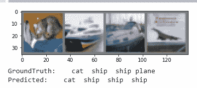
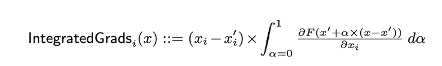

# 在 CIFAR10 数据集上应用模型可解释性算法

> 原文：<https://blog.paperspace.com/illustration-of-integrated-gradients-on-cifar10-dataset/>

### 介绍

像 Torchvision 和 Torchtext 这样的 PyTorch 库支持专门的数据，如计算机视觉和自然语言数据。[torch vision . datasets](https://pytorch.org/vision/0.8/datasets.html)模块演示了如何使用内置类加载数据。使用 [torchvision.datasets](https://pytorch.org/vision/0.8/datasets.html) 模块时，您可以通过各种子类从众所周知的数据集中加载图像数据。本教程演示了如何将 Captum 库中的模型可解释性算法应用于一个简单的模型和来自 CIFAR 数据集的测试样本。

在本教程中，我们将建立一个基本模型，类似于这里的[所示的](https://pytorch.org/tutorials/beginner/blitz/cifar10_tutorial.html#sphx-glr-beginner-blitz-cifar10-tutorial-py)。然后，我们将使用 IntegratedGradients、显著性、DeepLift 和 NoiseTunnel 等归因算法将图像的标签归因于输入像素，并将其可视化。在学习本教程之前，需要安装 torchvision 和 captum。

### 导入库:

```py
import matplotlib.pyplot as plt
import numpy as np

%matplotlib inline

import torch
import torchvision
import torchvision.transforms as transforms
import torchvision.transforms.functional as TF
import torch.optim as optim
import torch.nn as nn
import torch.nn.functional as F

from torchvision import models

from captum.attr import IntegratedGradients
from captum.attr import Saliency
from captum.attr import DeepLift
from captum.attr import NoiseTunnel
from captum.attr import visualization as v
```

### 使用数据加载器为培训准备数据

我们通过下面的代码加载测试和训练数据集，定义图像转换器，并支持分类标签类。在使用数据对 NN 模型进行训练和测试之前，可能需要对数据进行一些调整。数据的值可以被标准化以促进训练过程，被补充以产生更广泛的数据集，或者从一种类型的对象改变为张量。

通过使用**[transforms . compose](https://pytorch.org/vision/stable/generated/torchvision.transforms.Compose.html)**，我们定义了一个转换集合。这个类将接受一个转换列表，然后按照给定的顺序应用它们。在这一步中，我们首先将图像转换为张量，然后根据预设的平均值和标准偏差对张量的值进行归一化。**torch . utils . data . data loader**类使批处理变得简单。

一种常见的做法是以“小批量”的方式通过模型输入样本，在每次迭代中重新排列数据以最小化过度拟合，并利用 Python 的多重处理来加速数据检索。一个名为`DataLoader`的 iterable 用一个简单的 API 为我们包装了这种复杂性。我们的模型使用两个卷积层、两个最大池层和三个全连接或线性层。

```py
 class Net(nn.Module): ## create layers as class attributes
    def __init__(self): ## Parameters initialization with __init__() function
        super(Net, self).__init__() ## call the parent constuctor
        self.conv1 = nn.Conv2d(3, 6, 5) ## Appy our first set of conv layers
        self.pool1 = nn.MaxPool2d(2, 2) ## Apply our first set of max pooling layers
        self.pool2 = nn.MaxPool2d(2, 2) ## Apply our second set of maxpooling layers
        self.conv2 = nn.Conv2d(6, 16, 5) ## second set of conv layers
        self.fc1 = nn.Linear(16 * 5 * 5, 120) ##first set of fully conneted layers
        self.fc2 = nn.Linear(120, 84) ## second set of fullly conneted layers
        self.fc3 = nn.Linear(84, 10) ## third set of fully connected layer
        self.relu1 = nn.ReLU() ## Apply RELU activation function
        self.relu2 = nn.ReLU()
        self.relu3 = nn.ReLU()
        self.relu4 = nn.ReLU()

    def forward(self, x): ## specify how the model handles the data. 
        x = self.pool1(self.relu1(self.conv1(x)))
        x = self.pool2(self.relu2(self.conv2(x)))
        x = x.view(-1, 16 * 5 * 5)
        x = self.relu3(self.fc1(x))
        x = self.relu4(self.fc2(x))
        x = self.fc3(x)
        return x

## Model initialization
net = Net()
```

### 定义损失函数和优化器

接下来，我们需要指定损失函数(也称为标准)，以及优化它的技术。损失函数决定了我们的模型表现如何，它用于计算实际结果和预测之间的损失。在训练过程中，我们将调整模型参数，以尽量减少损失。确保在代码中包含您的型号的`model.parameters()` 。本教程将 [CrossEntropyLoss()](https://pytorch.org/docs/stable/generated/torch.nn.CrossEntropyLoss.html) 函数与随机梯度下降(SGD)优化器结合使用。以下代码显示了如何使用 [torch.optim](https://pytorch.org/docs/stable/optim.html) 和 [torch.nn](https://pytorch.org/docs/stable/nn.html) 包来创建损失函数和优化器。

```py
# Initialize criterion and optimizer
criterion = nn.CrossEntropyLoss()
optimizer = optim.SGD(net.parameters(), lr=0.001, momentum=0.9)
```

### 训练模型

我们在“模型”文件夹中保存了一个预训练模型的版本，以便我们可以加载它，而不必每次都从头开始训练过程。您可以从这里下载:

[https://github . com/py torch/captum/blob/master/tutorials/models/cifar _ torch vision . pt](https://github.com/pytorch/captum/blob/master/tutorials/models/cifar_torchvision.pt)

```py
USE_PRETRAINED_MODEL = True
## If using the pretrained model, load it through the function load_state_dict
if USE_PRETRAINED_MODEL:
    print("Using existing trained model")
    net.load_state_dict(torch.load('models/cifar_torchvision.pt'))
else:
    for epoch in range(5):  # loop over the dataset multiple times

        running_loss = 0.0 ## Resetting running_loss to zero 
        for i, data in enumerate(trainloader, 0): ## restarts the trainloader iterator on each epoch.
            # get the inputs
            inputs, labels = data
            # If you don't reset the gradients to zero before each ##backpropagation run, you'll end up with an accumulation of them. 
            optimizer.zero_grad()

            outputs = net(inputs) ## Carry out the forward pass. 
            loss = criterion(outputs, labels)## loss computation
            loss.backward() ## Carry out backpropagation, and estimate ##gradients. 
            optimizer.step() ## Make adjustments to the parameters according ##to the gradients. 

            # print statistics
            running_loss += loss.item() ## Build up the batch loss so that we ##can get an average across the epoch. 
            if i % 2000 == 1999:    # print every 2000 mini-batches
                print('[%d, %5d] loss: %.3f' %
                      (epoch + 1, i + 1, running_loss / 2000))
                running_loss = 0.0

    print('Finished Training')
    torch.save(net.state_dict(), 'models/cifar_torchvision.pt')
```

*   如果使用预先训练好的模型，通过函数 [load_state_dict()](https://pytorch.org/docs/stable/generated/torch.nn.Module.html?highlight=load_state_dict#torch.nn.Module.load_state_dict) 加载。如果没有，就跟着程序的其余部分走。
*   对于生成的每一批，输入都被传递到模型中。成功完成正向传递后，它返回计算的输出。
*   我们的下一步是使用`criterion()`函数，通过将模型结果(输出)与来自训练数据集的实际值进行比较来计算误差或损失。
*   接下来，我们通过调整模型参数来最小化损失。为此，我们将首先使用`loss.backward()` 对梯度计算进行反向传播，然后使用`backward().step()`执行优化程序，根据已经计算的梯度更新参数。

### 制作一个图像网格

下面的代码加载测试数据集中的大量图像样本，然后进行一些预测。我们使用函数[torch vision . utils . make _ grid()](https://pytorch.org/vision/stable/generated/torchvision.utils.make_grid.html)来制作图像网格，并显示 groundtruth 和预测标签。一步一步来就行了。

```py
## Define imwshow function
def imshow(img, transpose = True):
    img = img / 2 + 0.5     # unnormalize
    npimg = img.numpy() ## convert image to numpy
    plt.imshow(np.transpose(npimg, (1, 2, 0))) ## The supplied matrix, npimg, ##has to be transposed into numpy with the values of x,y, and z positioned at ##the indexes 1,2,0 respectively. 
    plt.show()
## iterate through the dataset. Each iteration returns a batch of images and ##labels
dataiter = iter(testloader)
images, labels = dataiter.next()
# print images
imshow(torchvision.utils.make_grid(images)) ## Display images with ##torchvision.utils.make_grid() function
print('GroundTruth: ', ' '.join('%5s' % classes[labels[j]] for j in range(4))) ## Display labels for ground truth

outputs = net(images) ## outcome prediction for each batch
_, predicted = torch.max(outputs, 1) ## Find the class index that has the ##highest probability and pick that one. 

print('Predicted: ', ' '.join('%5s' % classes[predicted[j]] ## Display labels for predicted classes
                              for j in range(4)))
```

输出:



让我们选择一个索引为`ind`的测试图像，并对其运行一些属性算法。

```py
ind = 3
input = images[ind].unsqueeze(0) ## adds an additional dimension to the tensor.
input.requires_grad = True
```

**注**:最常用的 [requires grad_()](https://pytorch.org/docs/stable/generated/torch.Tensor.requires_grad_.html) 功能是指示亲笔签名开始对张量**张量**进行记录操作。如果一个**张量**具有 **requires_grad=False** 属性(因为它是通过数据加载器或所需的预处理或初始化获得的)，调用`tensor.requires_grad_()` 将导致亲笔签名的开始对**张量**进行记录操作。

现在，出于解释目的，我们将模型设置为 eval 模式。重要的是要记住，在开始推理之前，您需要执行`model.eval()`方法。如果不采取这一步骤，推理结果将是不一致的。

```py
## Set the model in evaluation mode
net.eval()
```

输出:

```py
Net(
  (conv1): Conv2d(3, 6, kernel_size=(5, 5), stride=(1, 1))
  (pool1): MaxPool2d(kernel_size=2, stride=2, padding=0, dilation=1, ceil_mode=False)
  (pool2): MaxPool2d(kernel_size=2, stride=2, padding=0, dilation=1, ceil_mode=False)
  (conv2): Conv2d(6, 16, kernel_size=(5, 5), stride=(1, 1))
  (fc1): Linear(in_features=400, out_features=120, bias=True)
  (fc2): Linear(in_features=120, out_features=84, bias=True)
  (fc3): Linear(in_features=84, out_features=10, bias=True)
  (relu1): ReLU()
  (relu2): ReLU()
  (relu3): ReLU()
  (relu4): ReLU()
) 
```

让我们定义特征属性的函数。

```py
def attribute_image_f(algorithm, input, **kwargs):
    net.zero_grad()
    tensor_attributions = algorithm.attribute(input,
                                              target=labels[ind],
                                              **kwargs
                                             )

    return tensor_attributions 
```

### 什么是显著图

[显著性](https://captum.ai/api/saliency.html)图是神经网络决策过程的可视化表示。它们也有助于确定卷积层的具体重点，让我们更好地了解如何做出决策。

卷积神经网络使用显著图向我们展示它们对预测结果最感兴趣的地方。

这是计算输入属性的基本方法。它返回相对于输入的梯度。显著图的目的是强调输入图像中对输出分类贡献最大的像素。现在，考虑输出类得分相对于输入图像像素值的梯度。具有显著(正或负)梯度的像素是那些需要最轻微的变化来最大程度地影响类分数的像素。物体在图像中的位置可以从这些像素中推断出来。这是显著图背后的基本概念。在这里，我们计算关于类“ind”的梯度，并为了可视化的目的对它们进行转置。

```py
saliency = Saliency(net)
grads = saliency.attribute(input, target=labels[ind].item())
grads = np.transpose(grads.squeeze().cpu().detach().numpy(), (1, 2, 0))
```

### 集成渐变

Mukund Sundararajan、Ankur Taly 和 Qiqi Yan 在他们题为“[深层网络的公理化属性(ICML 2017)](https://arxiv.org/pdf/1703.01365.pdf) 的论文中研究了使用集成梯度的概念。通过他们对当时流行的归因方案的分析，作者关注于他们认为所有特征归因方案都应该遵守的两个公理:

*   **敏感度:**如果每个输入和基线在一个特征上不同，但具有不同的预测，则不同的特征应被赋予非零属性。可以证明 [LRP](https://journals.plos.org/plosone/article?id=10.1371/journal.pone.0130140) 和 DeepLiFT 由于总相关性守恒而坚持敏感性。然而，基于梯度的方法不能保证灵敏度公理。当分数函数在某些输入特征上局部“平坦”时，饱和发生在 ReLU 或 MaxPool 阶段。特征归因研究中的一个常见主题是需要通过饱和激活来恰当地传递相关性或归因。
*   **实现不变性:**尽管具有非常不同的实现，但是如果所有输入的输出相同，则两个网络被认为是功能相似的。[香草渐变](https://christophm.github.io/interpretable-ml-book/pixel-attribution.html)理论上确保实现不变性。LRP 和迪普利特可以通过对梯度的粗略近似来突破这一假设。作者提供了 LRP 和深度提升破坏实现不变性的例子。

作者建议对特征属性采用综合梯度，其定义如下:



作者证明了上述定义符合两个期望的假设:

*   **灵敏度:**积分梯度，像 LRP 和 DeepLiFT，根据微积分的[基本定理，对特征分数的差异求和。](https://openstax.org/books/calculus-volume-1/pages/5-3-the-fundamental-theorem-of-calculus) LRP 和 DeepLiFT 同样敏感。
*   **实现不变性:**由于其基于梯度的定义，所以尊重实现不变性的原则。

我们将对测试图像应用[综合梯度](https://captum.ai/api/integrated_gradients.html)属性技术。积分梯度执行必要的计算，以确定类别索引`ind`相对于输入图像像素的输出预测的梯度积分。

```py
ig = IntegratedGradients(net)
attrig, delta = attribute_image_f(ig, input, baselines=input * 0, return_convergence_delta=True)
attrig = np.transpose(attrig.squeeze().cpu().detach().numpy(), (1, 2, 0))
print('Approximation delta: ', abs(delta))
```

使用测试图像，使用综合梯度和带有 smoothgrad square 选项的噪声隧道所需的步骤如下所示。[带 smoothgrad square 选项的噪声隧道](https://captum.ai/api/noise_tunnel.html)将标准偏差为 **stdevs=0.2** 的高斯噪声应用于输入图像 **nt_samples** 次，计算 **nt_samples** 图像的属性，然后返回 **nt_samples** 图像的平方属性的平均值。

```py
ig = IntegratedGradients(net)
nt = NoiseTunnel(ig)
attrig_nt = attribute_image_f(nt, input, baselines=input * 0, nt_type='smoothgrad_sq',
                                      nt_samples=100, stdevs=0.2)
attrig_nt = np.transpose(attrig_nt.squeeze(0).cpu().detach().numpy(), (1, 2, 0))
```

### 深层提升

在他们的工作[通过传播激活差异学习重要特征](https://arxiv.org/pdf/1704.02685.pdf) (ICML 2017)中，两代情·施里库马尔、佩顿·格林赛德和安舒尔·昆达杰介绍了深度提升方法。这些研究人员受到塞巴斯蒂安·巴赫及其同事对[LRP/泰勒分解](https://journals.plos.org/plosone/article?id=10.1371/journal.pone.0130140)的研究的启发。
与输入图像一起，被称为 DeepLiFT(深度学习重要特征)的深度学习算法使用参考图像来解释输入像素。

尽管 LRP 坚持守恒原则，但仍不清楚净相关性应如何分布在不同的像素上。DeepLiFT 通过强制使用额外的公理来向下传播相关性，为这个问题提供了一个解决方案。以下是 DeepLiFT 坚持的两条公理:

*   **总相关性守恒:**它规定所有输入的相关性之和必须等于每个神经元的输入图像分数和基线图像分数之间的分数差。这个公理是相同的一个可以在 LRP 发现。
*   **链式法则/反向传播:**每个输入的相关性像梯度一样遵循链式法则。使用这些信息，我们可以使用每个输入的类似梯度的相关性来反向传播它。这个公理使 DeepLiFT 的梯度反向传播更接近于普通梯度。

在下面的代码中，我们对测试图像执行 DeepLift 操作。 [DeepLIFT](https://captum.ai/api/deep_lift.html) 根据输入与某些“参考”输入的差异来解释输出与某些“参考”输出的差异。

```py
dl = DeepLift(net)
attrdl = attribute_image_f(dl, input, baselines=input * 0)
attrdl = np.transpose(attrdl.squeeze(0).cpu().detach().numpy(), (1, 2, 0))
```

### 属性可视化

在接下来的程序中，我们将看到如何使用 SmoothGrad 可视化显著图、深度提升、集成梯度和集成梯度的属性。我们使用函数 [visualize_image_attr](https://captum.ai/api/utilities.html) ，它负责可视化给定图像的属性。这是通过首先标准化所需符号的属性值(正、负、绝对值或全部)来实现的，然后使用所选模式在 matplotlib 图形中显示它们。

```py
print('Original Image')
print('Predicted:', classes[predicted[ind]], 
      ' Probability:', torch.max(F.softmax(outputs, 1)).item())

original_image = np.transpose((images[ind].cpu().detach().numpy() / 2) + 0.5, (1, 2, 0))

_ = v.visualize_image_attr(None, original_image, 
                      method="original_image", title="Original Image")

_ = v.visualize_image_attr(grads, original_image, method="blended_heat_map", sign="absolute_value",
                          show_colorbar=True, title="Overlayed Gradient Magnitudes")

_ = v.visualize_image_attr(attrig, original_image, method="blended_heat_map",sign="all",
                          show_colorbar=True, title="Overlayed Integrated Gradients")

_ = v.visualize_image_attr(attrig_nt, original_image, method="blended_heat_map", sign="absolute_value", 
                             outlier_perc=10, show_colorbar=True, 
                             title="Overlayed Integrated Gradients \n with SmoothGrad Squared")

_ = v.visualize_image_attr(attrdl, original_image, method="blended_heat_map",sign="all",show_colorbar=True, 
                          title="Overlayed DeepLift")
```

**注意**:读者可以运行代码并可视化输出。

### 结论

在本教程中，我们展示了如何将 Captum 库中的模型可解释性算法应用于一个简单的模型和来自 CIFAR 数据集的测试样本。我们已经建立了一个基本模型，并使用属性算法，如综合梯度，显著性，深度提升和噪声隧道，将图像的标签归因于输入像素并将其可视化。

### 参考

[https://arxiv.org/pdf/1703.01365.pdf](https://arxiv.org/pdf/1703.01365.pdf)
[https://debugger cafe . com/凸图-卷积-神经网络/](https://debuggercafe.com/saliency-maps-in-convolutional-neural-networks/)
[https://towardsdatascience . com/explable-神经网络-近期-进展-part-4-73 cacc 910 fef](https://towardsdatascience.com/explainable-neural-networks-recent-advancements-part-4-73cacc910fef)
[https://captum.ai/tutorials/CIFAR_TorchVision_Interpret](https://captum.ai/tutorials/CIFAR_TorchVision_Interpret)
[https://www . oreilly . com/library/view/py torch-pocket-reference/97814920](https://www.oreilly.com/library/view/pytorch-pocket-reference/9781492089995/)