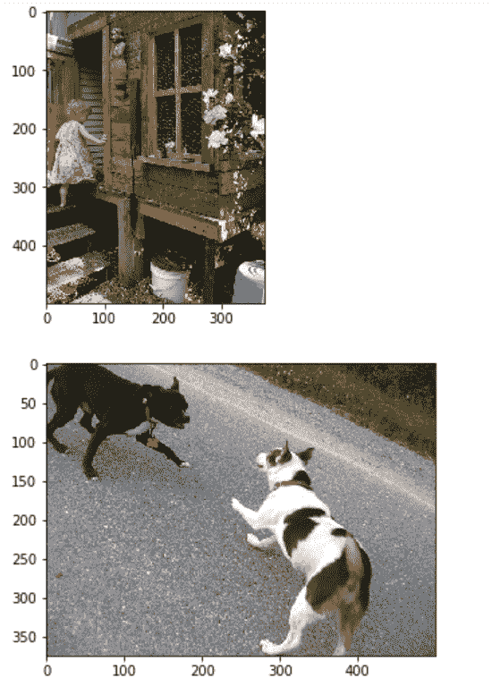
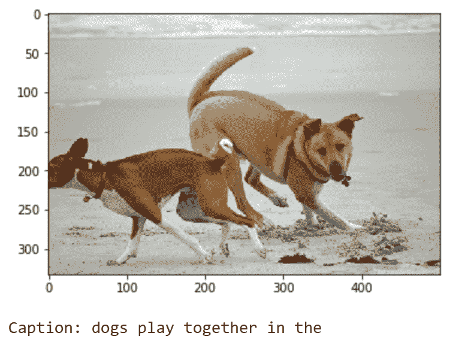
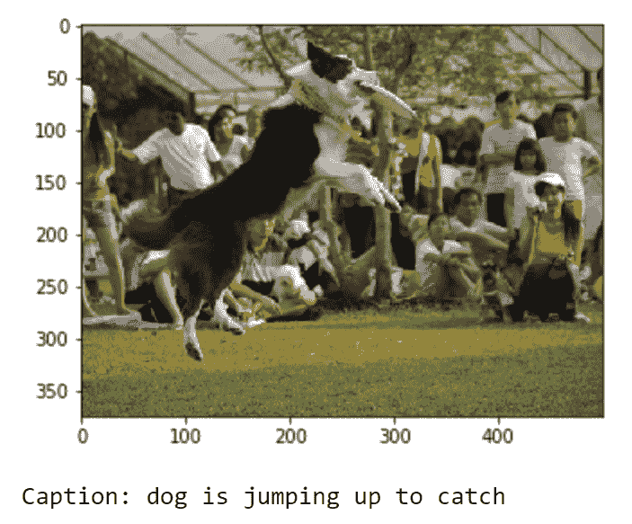

# 使用 TensorFlow 和 Keras 的图像字幕

> 原文：<https://blog.paperspace.com/image-captioning-with-tensorflow/>

当我们看一幅图像时，我们对该特定图像的视觉感知可以解释许多不同的事情。例如，在上面的图像中，我们大脑中的视觉感知的一个解释可能是“一艘载有乘客的船在河中航行”，或者我们可以完全忽略船，而专注于其他元素，例如“一个美丽的风景描绘了一些有桥的建筑。”虽然所提供的任何图像的这些观点都是正确的，但有时必须指出图像模式中的主要实体，并对其进行注释。在观察任何特定的视觉模式时，人类大脑访问以下任何信息应该没有问题。然而，神经网络真的有可能发现如此复杂的问题，并像我们拥有完美视觉受体的人脑那样解释解决方案吗？

这个问题挺耐人寻味的。这个问题的解决方案看起来非常乐观，因为有了正确的想法，我们可以成功地执行前面提到的任务。图像字幕的问题可以通过结合使用我们之前的两篇文章来解决，即“[具有序列到序列模型和点注意机制的机器翻译](https://blog.paperspace.com/nlp-machine-translation-with-keras/)和[“迁移学习的完整直观指南”](https://blog.paperspace.com/transfer-learning-explained/)我强烈建议尚未阅读以下两篇文章的读者，如果他们对这两个要素没有完整的理论知识，请立即阅读。用于分析图像的迁移学习和注意解释适当文本数据的序列到序列模型的组合知识对于解决图像字幕问题是有用的。

通过简短的介绍和一些其他更小的复杂的细节，本指南将直接进入 TensorFlow 和 Keras 的图像字幕项目的收缩。我强烈建议任何深度学习的初学者在不跳过任何基本概念的情况下检查大多数基本主题。但是，如果您对图像字幕项目感到满意，并且只想关注某些细节或要点，下面提供了目录列表。本指南应该能够引导您完成本文中讨论的各种重要主题。

## 简介:

在我们直接进入项目的构造之前，让我们了解一下图像字幕的概念。那么，到底什么是图像字幕呢？ ***图像字幕*** 是一种为任何提供的视觉表示(如图像或视频)生成文本描述的方法。虽然为特定图像思考适当的说明或标题的过程对于任何人来说都不是复杂的问题，但这种情况对于深度学习模型或一般机器来说并不相同。然而，有了适量的信息和数据集、完善的建筑结构和足够的有用资源，就可以实现相当高精度的图像字幕任务。

在现代社会中，图像字幕的应用极其广泛。为了提及图像字幕的一些显著应用，我们可以将它们的用例包括在编辑应用程序的推荐中、在虚拟助理中的使用中、在图像索引中的使用中、在视障人士中的使用中、在社交媒体中的使用中，以及在许多其他自然语言处理应用程序中的使用中。在 TensorFlow 和 Keras 的帮助下从头开始构建也是一个有趣的项目，但请确保您的环境满足运行这样一个项目的要求。

深度学习框架 TensorFlow 和 Keras 的知识对于理解这个项目中实现的所有理论和实践概念极其重要。在深入研究任何进一步的代码块之前，强烈建议您查看我以前关于这些主题的文章，这些文章详细介绍了 [TensorFlow](https://blog.paperspace.com/absolute-guide-to-tensorflow/) 和 [Keras](https://blog.paperspace.com/the-absolute-guide-to-keras/) 。此外，如前所述，我们将利用迁移学习的方法进行模型的视觉推理。我们还可以利用[序列的概念，对注意力](https://blog.paperspace.com/nlp-machine-translation-with-keras/)进行序列建模，以成功生成以下每个图像的文本描述或标题。那些至少对这些主题有基本了解的人将从这篇文章中受益匪浅。

* * *

## 方法和途径:

对于这个关于 TensorFlow 和 Keras 图像字幕的项目，我们的首要目标是收集所有有用的信息和数据。用于这项任务的流行数据集之一是 Flickr 数据集。一旦我们为我们的训练过程和模型架构的构建收集了足够的信息，我们将理解预处理的基本方法。我们将相应地预处理和准备图像及其各自的标签/说明。

对于标题的准备，我们将删除任何不必要的元素，并将重点放在主要要求上。首先，我们必须执行自然语言处理(NLP)风格的清理和数据集准备。我们会将所有的字母更新为小写格式，并从句子中删除任何单个字母或标点符号。为了处理每个图像，我们将利用迁移学习模型 inception V3。这种迁移学习模型的目的是将我们的图像转换成适当的矢量表示。对于这一步，我们将排除最后的 SoftMax 功能层。我们将使用 2048 特性来执行精确的矢量编码。

一旦我们将所有的图像向量和单词转换成它们各自的索引号，我们将定义一个预先设想的最大长度，并创建适当的嵌入。下一个重要步骤是构建我们的数据加载器/数据生成器，用于相应地提供相应的输入和输出。最后，我们将为图像字幕任务的计算构建我们的 LSTM 模型架构。训练过程完成后，我们将保存模型及其重量。这些保存的模型可用于重新训练以提高准确性。您还可以将此保存的模型用于部署目的，以便对其他影像和数据集进行预测。有了这个主题的基本要点和理解，让我们从主要目标开始。

* * *

### 数据集集合:

任何深度学习项目的第一个基本步骤是收集可用于完成特定任务的有用数据。对于图像字幕问题，我们将考虑的两个主要数据收集来源如下:

1.  1gb 飞行数据集-[https://www.kaggle.com/adityajn105/flickr8k/activity](https://www.kaggle.com/adityajn105/flickr8k/activity)
2.  完整的飞行数据集-[https://www.kaggle.com/hsankesara/flickr-image-dataset](https://www.kaggle.com/hsankesara/flickr-image-dataset)

Kaggle 数据集存储库中的 zip 文件包含 8000 多张图像。以下每张图片都来自六个不同的 Flickr 群组。这些图片被配上了五种不同的说明文字。所有这些标题都清晰准确地描述了可能的特征、突出的实体和其他事件。第二个 URL 链接为用户提供了一个使用更大的数据集来构建一个整体复杂且高效的模型的机会。数据集包含更多的信息和数据，可用于构建有效的模型架构。

然而，对于本文，我们将坚持使用更小的 1gb 数据集，因为这样更方便。它也适用于更广泛的受众，这些受众由于缺乏资源而无法准备和训练更复杂的数据集。无论如何，如果你对处理大型数据集感兴趣，如果你想用有限的 PC 资源开发更高端的模型，我强烈建议你看看 Paperspace 上的[渐变平台](https://gradient.run)。Gradient 使个人和团队能够快速开发、跟踪和协作任何规模和复杂性的机器学习模型。

* * *

## **数据集准备:**

我们项目中最重要的第一步是预处理我们使用的所有数据。这个过程以这样一种方式完成，即，当使用深度学习模型(即，LSTM 层)来获得自然语言处理任务的上下文的知识时，所获得的所有结果都是以兼容的形式来获得最佳结果。在这一步的第一部分，我们将导入解决图像字幕任务所需的所有基本库。我们将需要 TensorFlow 和 Keras 深度学习框架以及一些其他基本库，如 numpy、glob、cv2 等。，以顺利完成本项目。如果你想了解这两个深度学习框架的更多信息，你可以从以下链接中了解它们。下面的[链接](https://blog.paperspace.com/absolute-guide-to-tensorflow/)用于 TensorFlow，这个[链接](https://blog.paperspace.com/the-absolute-guide-to-keras/)用于 Keras。

### 导入基本库:

```py
import tensorflow as tf
from tensorflow import keras
import matplotlib.pyplot as plt
from tensorflow.keras.applications import InceptionV3
from tensorflow.keras.models import Model
from keras.preprocessing.sequence import pad_sequences
from keras.utils import to_categorical
import numpy as np
from numpy import array
import pandas as pd
import cv2
from glob import glob
import PIL
import time
from tqdm import tqdm
import os
```

一旦我们导入了完成任务所需的所有必要的库，我们就可以继续添加各自的路径，并在存储图像的目录中找到图像的总数。为了执行这个操作，我们将利用 glob 库并计算。jpg 格式在我们的图像目录。如果路径不同于您正在使用的特定系统，请随意更改。

```py
image_path = "Images/"
images = glob(image_path + "*.jpg")
len(images)
```

### 输出:

```py
8091 
```

### 可视化数据:

在下面的块中，我们将可视化一个小的数据样本(大约五个图像),以了解我们在该数据集中处理的图像类型。matplotlib 库用于绘制这些图像，而计算机视觉 OpenCV 库用于读取图像，然后将它们从默认的 BGR 格式转换为 RGB 格式。

```py
for i in range(5):
    plt.figure()
    image = cv2.imread(images[i])
    image = cv2.cvtColor(image, cv2.COLOR_BGR2RGB)
    plt.imshow(image)
```



2 sample images from the Flickr datasets, converted to RGB format.

这是通过运行以下代码可以看到的前两个图像。运行代码块后，您可以看到另外三个图像。[整个 Jupyter 笔记本可以在这里找到](https://github.com/gradient-ai/Image_Captioning_TF_Keras/blob/main/Image%20Captioning.ipynb)。请随意查看提供的笔记本中的完整代码和可视化效果，看看其他三个图像是什么样子的。

### 数据预处理:

现在，我们已经对我们的可视化效果和我们正在处理的图像类型有了一个简单的概念，是时候预处理标题了。让我们创建一个函数来加载适当的文件，然后相应地查看它们。

```py
# Defining the function to load the captions

def load(filename):
    file = open(filename, 'r')
    text = file.read()
    file.close()
    return text

file = "captions.txt"
info = load(file)
print(info[:484])
```

### 输出:

```py
image,caption
1000268201_693b08cb0e.jpg,A child in a pink dress is climbing up a set of stairs in an entry way . 
```

您将收到另外五个输出，但它们与我们当前的目标无关。我们可以看到，每个图像都用逗号与它的特定语句隔开。我们的目标是分离这两个实体。但首先，让我们删除第一行，这是不必要的，也要确保在文本文档的结尾没有空行。将此文件重命名并保存为 captions1.txt。这样做是为了确保万一我们犯了错误，我们可以用初始的 captions.txt 重新执行这些步骤。保存预处理数据的副本通常也是一种好的做法。现在让我们想象一下您的数据应该是什么样子。

```py
# Delete the first line as well as the last empty line and then rename the file as captions1.txt

file = "captions1.txt"
info = load(file)
print(info[:470])
```

### 输出:

```py
1000268201_693b08cb0e.jpg,A child in a pink dress is climbing up a set of stairs in an entry way . 
```

在下一步中，我们将创建一个字典来存储图像文件及其相应的标题。我们知道每张图片都有五种不同的标题可供选择。因此，我们将定义。jpg 图像作为键，它们各自的五个标题代表这些值。我们将适当地拆分这些值，并将它们存储在一个字典中。下面的函数可以这样写。请注意，我们将所有这些信息存储在数据变量中。

```py
# Creating a function to create a dictionary for the images and their respective captions

def load_captions(info):
    dict_1 = dict()
    count = 0
    for line in info.split('\n'):

        splitter = line.split('.jpg,')
#         print(splitter)
        # The image_code and image_captions are the list of the images with their respective captions
        image_code, image_caption = splitter[0], splitter[1]

        # Create dictionary
        if image_code not in dict_1:
            dict_1[image_code] = list()

        dict_1[image_code].append(image_caption)

    return dict_1

data = load_captions(info)
print(len(data))
```

您可以用下面几行来查看字典的键和值。

```py
list(data.keys())[:5]
```

```py
['1000268201_693b08cb0e',
 '1001773457_577c3a7d70',
 '1002674143_1b742ab4b8',
 '1003163366_44323f5815',
 '1007129816_e794419615'] 
```

```py
data['1000268201_693b08cb0e']
```

```py
['A child in a pink dress is climbing up a set of stairs in an entry way .',
 'A girl going into a wooden building .',
 'A little girl climbing into a wooden playhouse .',
 'A little girl climbing the stairs to her playhouse .',
 'A little girl in a pink dress going into a wooden cabin .'] 
```

我们的下一步是继续进一步预处理数据集，并通过进行一些必要的更改来准备字幕数据。我们将确保每个句子中的所有单词都被转换为小写，因为我们不希望在计算问题时将同一个单词存储为两个独立的向量。我们还将删除长度小于 2 的单词，以确保我们删除了不相关的字符，如单个字母和标点符号。完成此任务的函数和代码编写如下:

```py
# Cleanse and pre-process the data

def cleanse_data(data):
    dict_2 = dict()
    for key, value in data.items():
        for i in range(len(value)):
            lines = ""
            line1 = value[i]
            for j in line1.split():
                if len(j) < 2:
                    continue
                j = j.lower()
                lines += j + " "
            if key not in dict_2:
                dict_2[key] = list()

            dict_2[key].append(lines)

    return dict_2

data2 = cleanse_data(data)
print(len(data2)) 
```

请注意，我们将所有这些重要的清理信息存储在 data2 变量中，需要时将在编程部分的其余部分使用该变量。

### 更新词汇和数据:

一旦我们完成了文本文件中图像标题的清理和预处理，我们就可以继续创建单词的词汇表，并计算存在的唯一实体的总数。在我们完成构建模型架构之后，我们将更新用于计算和进行预测的唯一单词。让我们看看执行以下任务的代码块。

```py
# convert the following into a vocabulary of words and calculate the total words

def vocabulary(data2):
    all_desc = set()
    for key in data2.keys():
        [all_desc.update(d.split()) for d in data2[key]]
    return all_desc

# summarize vocabulary
vocabulary_data = vocabulary(data2)
print(len(vocabulary_data))
```

最后，在完成所有这些基本步骤之后，我们现在可以用下面的代码更新 captions1.txt 文件了。

```py
# save descriptions to file, one per line

def save_dict(data2, filename):
    lines = list()
    for key, value in data2.items():
        for desc in value:
            lines.append(key + ' ' + desc)
    data = '\n'.join(lines)
    file = open(filename, 'w')
    file.write(data)
    file.close()

save_dict(data2, 'captions1.txt')
```

您的文本文件和存储的数据应该类似于下面的几行。

```py
1000268201_693b08cb0e child in pink dress is climbing up set of stairs in an entry way 
1000268201_693b08cb0e girl going into wooden building 
```

随着文本数据的初始预处理的完成，让我们继续下一步并构建我们的模型架构，用于预测相应图像的适当标题。

* * *

## 图像预处理:

现在我们已经完成了文本描述的预处理，让我们继续相应地预处理图像。我们将利用预处理功能并加载每个图像的图像路径来适当地执行这个动作。让我们先看看代码，然后理解我们的下一步。另外，请注意，在本文的其余部分，我们将利用以下两个参考来简化完整的操作图像字幕任务。我们将使用官方 TensorFlow [文档](https://www.tensorflow.org/tutorials/text/image_captioning)中关于具有视觉注意力的图像标题和下面的 GitHub [参考](https://github.com/hlamba28/Automatic-Image-Captioning/blob/master/Automatic%20Image%20Captioning.ipynb)链接来成功计算下面的任务。现在让我们来看看相应地预处理图像的代码块。

```py
images = 'Images/'
img = glob(images + '*.jpg')
print(len(img))

def preprocess(image_path):
    # Convert all the images to size 299x299 as expected by the inception v3 model
    img = keras.preprocessing.image.load_img(image_path, target_size=(299, 299))
    # Convert PIL image to numpy array of 3-dimensions
    x = keras.preprocessing.image.img_to_array(img)
    # Add one more dimension
    x = np.expand_dims(x, axis=0)
    # pre-process the images using preprocess_input() from inception module
    x = keras.applications.inception_v3.preprocess_input(x)
    return x
```

这一步是最关键的步骤之一，因为我们将利用 Inception V3 迁移学习模型来将每个相应的图像转换成它们的固定向量大小。该自动特征提取过程包括排除最终的 SoftMax 激活函数，以达到 2096 个矢量特征的瓶颈。该模型利用图像网络上预先训练的权重，相对容易地实现后续任务的计算。众所周知，Inception V3 模型在包含图像的数据集上表现更好。然而，我也建议尝试其他迁移学习模式，看看它们在相同问题上的表现如何。

```py
# Load the inception v3 model
input1 = InceptionV3(weights='imagenet')

# Create a new model, by removing the last layer (output layer) from the inception v3
model = Model(input1.input, input1.layers[-2].output)

model.summary()
```

一旦我们完成图像预处理的计算，我们将把所有这些值保存在一个 pickle 文件中。将这些文件保存为单独的元素将有助于我们在预测过程中单独使用这些模型。这个过程可以用下面的代码块来完成。

```py
# Function to encode a given image into a vector of size (2048, )
def encode(image):
    image = preprocess(image) # preprocess the image
    fea_vec = model.predict(image) # Get the encoding vector for the image
    fea_vec = np.reshape(fea_vec, fea_vec.shape[1]) # reshape from (1, 2048) to (2048, )
    return fea_vec

 encoding = {}

for i in tqdm(img):
    encoding[i[len(images):]] = encode(i)

import pickle

# Save the features in the images1 pickle file
with open("images1.pkl", "wb") as encoded_pickle:
    pickle.dump(encoding, encoded_pickle)
```

* * *

## 创建我们的数据加载器:

在我们创建数据加载器和数据生成器之前，让我们保存包含要索引的唯一单词的信息的所有基本文件，以及链接到它们各自单词的所有索引。执行此操作对于模型的生成器和预测阶段都至关重要。我们还将为此操作定义一个固定的最大长度，以便它不会超过我们设置的限制。包括将这些必要的文档保存在 pickle 文件中的整个过程可以如下进行:

```py
# Create a list of all the training captions

all_train_captions = []

for key, val in data2.items():
    for cap in val:
        all_train_captions.append(cap)

len(all_train_captions)

# Consider only words which occur at least 10 times in the corpus

word_count_threshold = 10
word_counts = {}
nsents = 0

for sent in all_train_captions:
    nsents += 1
    for w in sent.split(' '):
        word_counts[w] = word_counts.get(w, 0) + 1

vocab = [w for w in word_counts if word_counts[w] >= word_count_threshold]
print('preprocessed words %d -> %d' % (len(word_counts), len(vocab)))

# Converting the words to indices and vice versa.

ixtoword = {}
wordtoix = {}

ix = 1
for w in vocab:
    wordtoix[w] = ix
    ixtoword[ix] = w
    ix += 1

vocab_size = len(ixtoword) + 1 # one for appended 0's
vocab_size

# Save the words to index and index to word as pickle files

with open("words.pkl", "wb") as encoded_pickle:
    pickle.dump(wordtoix, encoded_pickle)

with open("words1.pkl", "wb") as encoded_pickle:
    pickle.dump(ixtoword, encoded_pickle)

# convert a dictionary of clean descriptions to a list of descriptions

def to_lines(descriptions):
    all_desc = list()
    for key in descriptions.keys():
        [all_desc.append(d) for d in descriptions[key]]
    return all_desc

# calculate the length of the description with the most words
def max_length(descriptions):
    lines = to_lines(descriptions)
    return max(len(d.split()) for d in lines)

# determine the maximum sequence length
max_length = max_length(data2)
print('Description Length: %d' % max_length)
```

### 构建发电机:

我们的最后一步是创建数据生成器，它将加载图像向量的全部信息、模型的相应描述、最大长度、索引值的固定字、每个时期运行的步数以及所有其他基本操作。每个图像被转换成其各自的特征长度，并且所有的描述被相应地填充，使得当通过 LSTM 类型的结构时，我们可以预测未来的单词。使用带有注意力模型的序列到序列的 TensorFlow 文档方法更好地获得了更高的准确性，并且使用 tf.data()方法进行了更好的训练。然而，我们将使用一个稍微简单的方法来解决这个问题，以获得更快的结果。

```py
# data generator, intended to be used in a call to model.fit_generator()

def data_generator(descriptions, photos, wordtoix, max_length, num_photos_per_batch):
    X1, X2, y = list(), list(), list()
    n=0
    # loop for ever over images
    while 1:
        for key, desc_list in descriptions.items():
            n+=1
            # retrieve the photo feature
            photo = photos[key+'.jpg']
            for desc in desc_list:
                # encode the sequence
                seq = [wordtoix[word] for word in desc.split(' ') if word in wordtoix]
                # split one sequence into multiple X, y pairs
                for i in range(1, len(seq)):
                    # split into input and output pair
                    in_seq, out_seq = seq[:i], seq[i]
                    # pad input sequence
                    in_seq = pad_sequences([in_seq], maxlen=max_length)[0]
                    # encode output sequence
                    out_seq = to_categorical([out_seq], num_classes=vocab_size)[0]
                    # store
                    X1.append(photo)
                    X2.append(in_seq)
                    y.append(out_seq)
            # yield the batch data
            if n==num_photos_per_batch:
                yield ([array(X1), array(X2)], array(y))
                X1, X2, y = list(), list(), list()
                n=0
```

通过构建训练生成器来适当地加载我们的值，我们可以进入构建模型架构的最后一步，以完成图像字幕的任务。

* * *

## 构建最终的模型架构:

现在，我们已经完成了预处理标题标签、文本描述和图像数据的大部分步骤，我们终于可以开始构建模型了。然而，在我们构建模型之前，我们需要为每个固定长度的唯一单词创建单词嵌入向量。单词嵌入方法用于将单词的每个索引映射到 200 长度的向量，以使其大小均匀分布。请从这个[链接](https://github.com/stanfordnlp/GloVe)下载下面的手套矢量。预训练的 glove.6B.200d.txt 用于该模型，以为所有唯一的单词创建均匀分布的 200 长度的嵌入矩阵。下面的代码块执行所需的操作。

```py
# Download, install, and then Load the Glove vectors
# https://github.com/stanfordnlp/GloVe

embeddings_index = {} # empty dictionary
f = open('glove.6B.200d.txt', encoding="utf-8")

for line in f:
    values = line.split()
    word = values[0]
    coefs = np.asarray(values[1:], dtype='float32')
    embeddings_index[word] = coefs
f.close()
print('Found %s word vectors.' % len(embeddings_index))

embedding_dim = 200

# Get 200-dim dense vector for each of the 10000 words in out vocabulary
embedding_matrix = np.zeros((vocab_size, embedding_dim))

for word, i in wordtoix.items():
    #if i < max_words:
    embedding_vector = embeddings_index.get(word)
    if embedding_vector is not None:
        # Words not found in the embedding index will be all zeros,
        embedding_matrix[i] = embedding_vector

embedding_matrix.shape
```

### 输出:

```py
Found 400001 word vectors.
(1976, 200) 
```

最后，让我们定义 LSTM 和嵌入层来创建我们的模型架构。对于这个模型，我们将利用两个输入，即图像向量和字幕的单词嵌入，来进行预测。嵌入向量通过 LSTM 架构，该架构将学习如何进行适当的字预测。图像向量和 LSTM 预测被组合在一起作为一个单元，并通过一些密集层和 SoftMax 激活函数，这相当于预定义词汇的大小。最后，我们将构建这个模型，并从我们的培训流程开始。

```py
from tensorflow.keras.layers import Dense, Input, Conv2D, MaxPool2D, LSTM, add
from tensorflow.keras.layers import Activation, Dropout, Flatten, Embedding
from tensorflow.keras.models import Model

inputs1 = Input(shape=(2048,))
fe1 = Dropout(0.5)(inputs1)
fe2 = Dense(256, activation='relu')(fe1)

inputs2 = Input(shape=(max_length,))
se1 = Embedding(vocab_size, embedding_dim, mask_zero=True)(inputs2)
se2 = Dropout(0.5)(se1)
se3 = LSTM(256)(se2)

decoder1 = add([fe2, se3])
decoder2 = Dense(256, activation='relu')(decoder1)
outputs = Dense(vocab_size, activation='softmax')(decoder2)

model = Model(inputs=[inputs1, inputs2], outputs=outputs)
model.summary()
```

```py
Model: "model_1"
__________________________________________________________________________________________________
Layer (type)                    Output Shape         Param #     Connected to                     
==================================================================================================
input_3 (InputLayer)            [(None, 33)]         0                                            
__________________________________________________________________________________________________
input_2 (InputLayer)            [(None, 2048)]       0                                            
__________________________________________________________________________________________________
embedding (Embedding)           (None, 33, 200)      395200      input_3[0][0]                    
__________________________________________________________________________________________________
dropout (Dropout)               (None, 2048)         0           input_2[0][0]                    
__________________________________________________________________________________________________
dropout_1 (Dropout)             (None, 33, 200)      0           embedding[0][0]                  
__________________________________________________________________________________________________
dense (Dense)                   (None, 256)          524544      dropout[0][0]                    
__________________________________________________________________________________________________
lstm (LSTM)                     (None, 256)          467968      dropout_1[0][0]                  
__________________________________________________________________________________________________
add (Add)                       (None, 256)          0           dense[0][0]                      
                                                                 lstm[0][0]                       
__________________________________________________________________________________________________
dense_1 (Dense)                 (None, 256)          65792       add[0][0]                        
__________________________________________________________________________________________________
dense_2 (Dense)                 (None, 1976)         507832      dense_1[0][0]                    
==================================================================================================
Total params: 1,961,336
Trainable params: 1,961,336
Non-trainable params: 0
__________________________________________________________________________________________________ 
```

现在，我们已经完成了整体模型架构的构建，让我们继续使用分类交叉熵损失函数和 Adam 优化器来编译模型。由于时间限制，我将对模型进行大约十个纪元的训练。然而，你可以选择在你方便的时候探索和训练更多的纪元。

```py
model.layers[2].set_weights([embedding_matrix])
model.layers[2].trainable = False

model.compile(loss='categorical_crossentropy', optimizer='adam')

epochs = 10
number_pics_per_bath = 3
steps = len(data2)//number_pics_per_bath

features = pickle.load(open("images1.pkl", "rb"))

# https://stackoverflow.com/questions/58352326/running-the-tensorflow-2-0-code-gives-valueerror-tf-function-decorated-functio

tf.config.run_functions_eagerly(True)

for i in range(epochs):
    generator = data_generator(data2, features, wordtoix, max_length, number_pics_per_bath)
    model.fit(generator, epochs=1, steps_per_epoch=steps, verbose=1)
    model.save('model_' + str(i) + '.h5')
```

### 输出:

```py
2697/2697 [==============================] - 986s 365ms/step - loss: 4.5665
2697/2697 [==============================] - 983s 365ms/step - loss: 3.4063
2697/2697 [==============================] - 987s 366ms/step - loss: 3.1929
2697/2697 [==============================] - 987s 366ms/step - loss: 3.0570
2697/2697 [==============================] - 989s 366ms/step - loss: 2.9662
2697/2697 [==============================] - 995s 369ms/step - loss: 2.9011
2697/2697 [==============================] - 989s 367ms/step - loss: 2.8475
2697/2697 [==============================] - 986s 366ms/step - loss: 2.8062
2697/2697 [==============================] - 986s 366ms/step - loss: 2.7689
2697/2697 [==============================] - 987s 365ms/step - loss: 2.7409 
```

我们可以注意到，通过仅仅十个时期的训练，我们的损失已经从初始值显著减少。我只训练了十个纪元的模型，因为你可以注意到每个纪元在我的 GPU 上运行大约需要 1000 秒。如果您有一个更快的计算 GPU 或更多的时间，您可以为更多的历元训练模型，以实现整体更好的结果。

* * *

## 做出预测:

在进行适当的预测时，我们将使用一个[单独的笔记本。](https://github.com/gradient-ai/Image_Captioning_TF_Keras/blob/main/Prediction.ipynb)这样做是为了证明所有保存的文件和模型都可以独立用于对给定的图像数据进行最精确的预测。让我们首先导入所有必要的库并开始特定的任务。

### 导入所需的库

这些是定义预测函数时必须导入的一些基本库。

```py
import tensorflow as tf
from tensorflow import keras
from tensorflow.keras.models import load_model
from tensorflow.keras.preprocessing.sequence import pad_sequences
import numpy as np
import matplotlib.pyplot as plt
import pickle
```

### 加载各自的功能:

让我们将所有保存的文件加载到它们各自的变量中。该过程如下进行。

```py
features = pickle.load(open("images1.pkl", "rb"))
model = load_model('model_9.h5')
images = "Images/"
max_length = 33
words_to_index = pickle.load(open("words.pkl", "rb"))
index_to_words = pickle.load(open("words1.pkl", "rb"))
```

### 做出预测:

最后，让我们定义相应的函数，该函数将接收图像，加载它们的向量，创建单词嵌入，并利用保存的模型进行适当的预测。让我们随机测试两幅图像，并想象它们各自的结果。

```py
def Image_Caption(picture):
    in_text = 'startseq'
    for i in range(max_length):
        sequence = [words_to_index[w] for w in in_text.split() if w in words_to_index]
        sequence = pad_sequences([sequence], maxlen=max_length)
        yhat = model.predict([picture,sequence], verbose=0)
        yhat = np.argmax(yhat)
        word = index_to_words[yhat]
        in_text += ' ' + word
        if word == 'endseq':
            break
    final = in_text.split()
    final = final[1:-1]
    final = ' '.join(final)
    return final
```

我将随机选择一张图片，我们将尝试对两张图片的模型产生的输出进行可视化。

```py
z = 20
pic = list(features.keys())[z]
image = features[pic].reshape((1,2048))
x = plt.imread(images+pic)
plt.imshow(x)
plt.show()
print("Caption:", Image_Caption(image))
```



```py
z = 100
pic = list(features.keys())[z]
image = features[pic].reshape((1,2048))
x = plt.imread(images+pic)
plt.imshow(x)
plt.show()
print("Caption:", Image_Caption(image))
```



我们可以注意到，我们的图像字幕模型的性能对于仅仅十个时期的训练和小数据集来说是相当好的。虽然图像字幕任务工作得相当不错，但值得注意的是，可以进一步降低损耗，以实现更高的准确度和精度。可以进行的两个主要更改和改进是增加数据集的大小，以及在当前模型上运行更多时期的以下计算。具有注意力的序列对序列模型也可以用于实现更好的结果。也可以对不同类型的迁移学习模型进行其他实验。

* * *

## 结论:


Photo by [Daryan Shamkhali](https://unsplash.com/@daryan?utm_source=ghost&utm_medium=referral&utm_campaign=api-credit) / [Unsplash](https://unsplash.com/?utm_source=ghost&utm_medium=referral&utm_campaign=api-credit)

在这个使用 Keras 和 TensorFlow 生成图像标题的演示中，我们展示了如何使用 Flickr 数据集中先前识别的文本标题数据来生成新颖的标题。该过程包括加载相关库、预处理图像和文本数据、创建数据加载器和生成器，以及最终构建 LSTM 架构以生成预测字幕的步骤。用户可以进一步了解细节，并通过使用 Gradient-AI 的 GitHub 上的公共笔记本[来尝试重现这一作品。](https://github.com/gradient-ai/Image_Captioning_TF_Keras/)