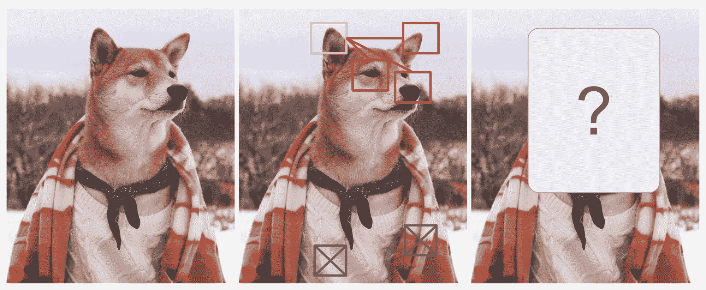
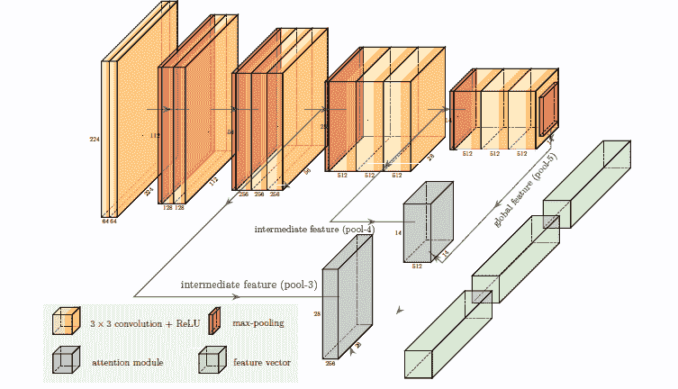
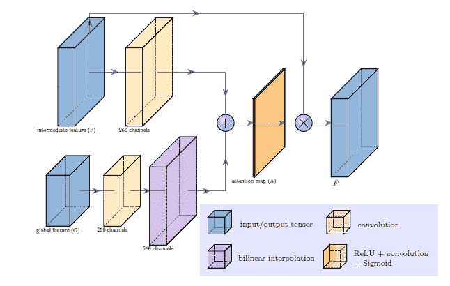
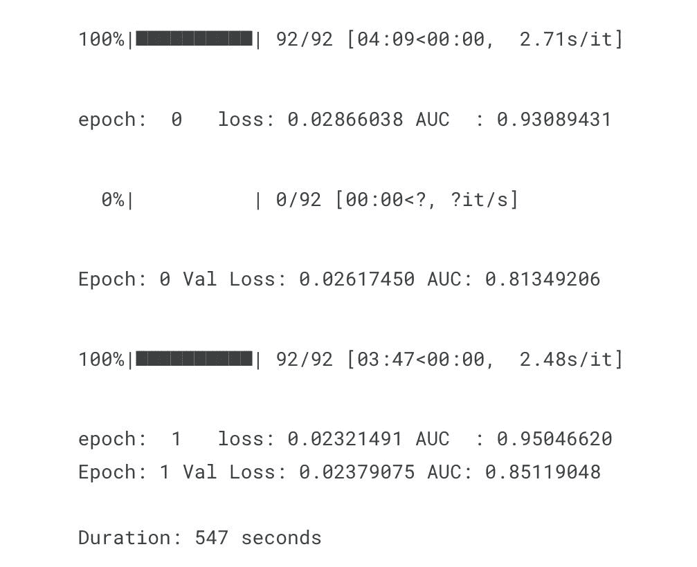
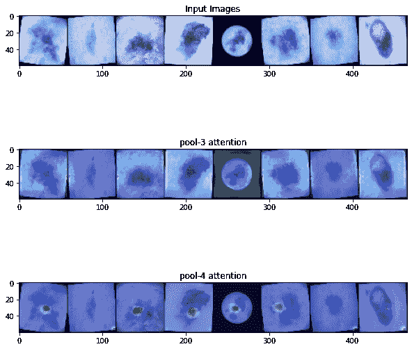

# 注意力图像分类

> 原文：<https://blog.paperspace.com/image-classification-with-attention/>

图像分类可能是计算机视觉中最流行的子领域之一。图像分类的过程包括理解图像中的上下文信息以将它们分类到一组预定义的标签中。作为一个领域，图像分类在第一次 ImageNet 挑战赛后变得很有名，因为庞大的 ImageNet 数据集的新颖可用性，深度神经网络的成功以及它在数据集上获得的相应的惊人性能。第一个网络叫做 Alexnet。

然后，谷歌的 Inception networks 引入了一种新的概念，即采用不同大小的过滤器来接收相同的输入，并在 Imagenet 挑战中成功超越了 Alexnet。然后是 Resnet、VGG-16 和许多其他算法，它们在 Imagenet 和 Alexnet 的基础上继续改进。

与此同时，NLP 领域也在迅速发展，随着开创性论文[的发布，你所需要的就是关注！](https://arxiv.org/abs/1706.03762)，从来没有一样。虽然注意力从根本上改变了 NLP，但它仍然没有广泛应用于计算机视觉问题。

在我们继续之前，让我们试着更好地理解注意力。

神经网络中的注意机制倾向于模仿人类所拥有的认知注意。该功能的主要目的是强调信息的重要部分，并尽量不强调不相关的部分。由于人类和机器的工作记忆都是有限的，所以这个过程是避免系统记忆负担过重的关键。在深度学习中，注意力可以被解释为重要性权重的向量。当我们预测一个元素时，它可能是图像中的一个像素或句子中的一个单词，我们使用注意力向量来推断它与其他元素的相关程度。

让我们来看看这篇优秀博客中提到的一个例子， *[关注？立正！](https://lilianweng.github.io/posts/2018-06-24-attention/)* 。



The name of the dog is Shiba Inu

如果我们把注意力集中在红色盒子里的狗的特征上，比如它的鼻子、尖尖的右耳和神秘的眼睛，我们就能猜出黄色盒子里应该是什么。然而，仅通过查看灰色框中的像素，您将无法预测黄色框中应该出现什么。注意机制对正确方框中的像素比对黄色方框中的像素的权重更大。而灰色框中的像素权重较低。

现在，我们对注意力的作用有了一个很好的了解。在这个博客中，我们将注意力用于一个崇高的追求。我们将黑色素瘤图像分为恶性和良性，然后尝试解释这些预测。

但是我们可以在没有注意的情况下对图像进行分类，对吗？

如果你仍然不相信为什么我们应该把注意力放在图像上，这里有更多的观点来证明这一点:

*   在训练图像模型时，我们希望模型能够关注图像的重要部分。实现这一点的方法之一是通过 ****可训练的注意力**** 机制(但你已经知道这一点了，对吗？继续读..)
*   在我们的例子中，我们正在处理病变图像，并且能够 ****解释**** 模型变得更加必要。理解图像的哪一部分对癌症被分类为良性/恶性更有贡献是很重要的。
*   像 ****Grad-CAM**** 这样的事后分析并不等同于关注。它们并不打算改变模型学习的方式，或者改变模型学习的内容。它们被应用于已经训练好的具有固定权重的模型，并且仅用于提供对模型决策的洞察。

现在，你已经对我们为什么使用注意力进行图像分类有了全面的了解，让我们深入了解一下。我们将使用 Pytorch。它更冗长，似乎有很多代码，但由于它广泛使用了类，所以更 pythonic 化，并且与 TensorFlow 相比，给了用户更多的控制权。

我正在使用来自 Kaggle 的这个数据集。所有图像都是皮肤损伤，形状为 512 x 512 x 3。要设置 Kaggle API 并将数据集下载到渐变笔记本中以下载该数据，请按照以下步骤操作:

*   首先，创建并登录 Kaggle 帐户
*   其次，通过进入您的帐户设置创建一个 API 令牌，并将 kaggle.json 保存到您的本地机器上
*   三、上传 kaggle.json 到渐变记事本第四、把文件移到~/。kaggle/使用终端命令`cp kaggle.json ~/.kaggle/`
*   四、安装 kaggle: `pip install kaggle`
*   第五，使用 API 通过终端下载数据集:`kaggle datasets download shonenkov/melanoma-merged-external-data-512x512-jpeg`
*   六、使用终端解压数据集:`unzip melanoma-merged-external-data-512x512-jpeg.zip`

您还需要再做几个步骤来设置以使其正确运行。在终端中，`pip install opencv-python kaggle`然后运行`apt-get install libgl1`。

然后通过运行包含以下内容的单元来导入以下库:

```py
import pandas as pd

from sklearn.model_selection import train_test_split
from torchvision import transforms
import torch.nn as nn

import torch
from torch.utils.data import Dataset
from torchvision import datasets
from torchvision.transforms import ToTensor
import matplotlib.pyplot as plt
import torchvision.models as models

from torch.utils.data import DataLoader 
```

## 预处理数据

我只使用了图像中的一个样本(因为数据集很大),并做了以下预处理:

*   调整大小、标准化、居中和裁剪训练和测试图像。
*   仅在训练图像上的数据扩充(随机旋转/水平翻转)。

```py
# read the data 
data_dir='melanoma-merged-external-data-512x512-jpeg/512x512-dataset-melanoma/512x512-dataset-melanoma/'
data=pd.read_csv('melanoma-merged-external-data-512x512-jpeg/marking.csv')

# balance the data a bit
df_0=data[data['target']==0].sample(6000,random_state=42)
df_1=data[data['target']==1]
data=pd.concat([df_0,df_1]).reset_index()

#prepare the data
labels=[]
images=[]
for i in range(data.shape[0]):
    images.append(data_dir + data['image_id'].iloc[i]+'.jpg')
    labels.append(data['target'].iloc[i])
df=pd.DataFrame(images)
df.columns=['images']
df['target']=labels

# Split train into train and val
X_train, X_val, y_train, y_val = train_test_split(df['images'],df['target'], test_size=0.2, random_state=1234) 
```

现在让我们使用 PyTorch 的转换模块来转换图像。

```py
train_transform = transforms.Compose([
        transforms.RandomRotation(10),      # rotate +/- 10 degrees
        transforms.RandomHorizontalFlip(),  # reverse 50% of images
        transforms.Resize(224),             # resize shortest side to 224 pixels
        transforms.CenterCrop(224),         # crop longest side to 224 pixels at center
        transforms.ToTensor(),
        transforms.Normalize([0.485, 0.456, 0.406],
                             [0.229, 0.224, 0.225])
    ])

val_transform = transforms.Compose([
        transforms.Resize(224),
        transforms.CenterCrop(224),
        transforms.ToTensor(),
        transforms.Normalize([0.485, 0.456, 0.406],
                             [0.229, 0.224, 0.225])
    ])
```

接下来，让我们编写一个继承 PyTorch 的 Dataset 类的类。我们将使用这个类来读取、转换和放大图像。

```py
class ImageDataset(Dataset):

    def __init__(self,data_paths,labels,transform=None,mode='train'):
         self.data=data_paths
         self.labels=labels
         self.transform=transform
         self.mode=mode
    def __len__(self):
       return len(self.data)

    def __getitem__(self,idx):
        img_name = self.data[idx]
        img = cv2.imread(img_name)
        img = cv2.cvtColor(img, cv2.COLOR_BGR2RGB)
        img=Image.fromarray(img)
        if self.transform is not None:
          img = self.transform(img)
        img=img.cuda()

        labels = torch.tensor(self.labels[idx]).cuda()

        return img, labels

train_dataset=ImageDataset(data_paths=X_train.values,labels=y_train.values,transform=train_transform)
val_dataset=ImageDataset(data_paths=X_val.values,labels=y_val.values,transform=val_transform)

train_loader=DataLoader(train_dataset,batch_size=100,shuffle=True)
val_loader=DataLoader(val_dataset,batch_size=50,shuffle=False)
```

### 型号- VGG16 注意

在实际的分类任务中，我们将使用带有注意力层的 VGG16。该架构最初是在这篇论文中提出的，你可以在我们的博客[这里](https://blog.paperspace.com/vgg-from-scratch-pytorch/)找到从头开始编写该算法的指南(较少关注注意力机制)。给你一个 VGG16 的入门，它有 16 层深，设计在 2014 年赢得了 ImageNet 竞赛。他们使用 3×3 滤波器大小的卷积层，步长为 1，ReLu 作为其激活函数。Maxpooling 层具有跨距为 2 的 2x2 过滤器。最后有 2 个密集层，后面是一个 softmax 层。

VGG16 将是主干，不会有任何密集层。



[[Source](https://www2.cs.sfu.ca/~hamarneh/ecopy/ipmi2019.pdf)]

*   应用了两个注意模块(灰色块)。中间特征图(池 3 和池 4)的输出用于推断注意力图。pool-5 的输出充当一种形式的全局引导，因为最后一级特征包含整个图像的最抽象和最压缩的信息。
*   三个特征向量(绿色块)通过全局平均池计算，并连接在一起以形成最终的特征向量，其用作分类层的输入(此处未示出)。

如果您对此不太清楚，请不要担心，我将在下一步对其进行详细说明。

### 实现关注层

下面是一个定义注意力层的类。

```py
class AttentionBlock(nn.Module):
    def __init__(self, in_features_l, in_features_g, attn_features, up_factor, normalize_attn=True):
        super(AttentionBlock, self).__init__()
        self.up_factor = up_factor
        self.normalize_attn = normalize_attn
        self.W_l = nn.Conv2d(in_channels=in_features_l, out_channels=attn_features, kernel_size=1, padding=0, bias=False)
        self.W_g = nn.Conv2d(in_channels=in_features_g, out_channels=attn_features, kernel_size=1, padding=0, bias=False)
        self.phi = nn.Conv2d(in_channels=attn_features, out_channels=1, kernel_size=1, padding=0, bias=True)
    def forward(self, l, g):
        N, C, W, H = l.size()
        l_ = self.W_l(l)
        g_ = self.W_g(g)
        if self.up_factor > 1:
            g_ = F.interpolate(g_, scale_factor=self.up_factor, mode='bilinear', align_corners=False)
        c = self.phi(F.relu(l_ + g_)) # batch_sizex1xWxH

        # compute attn map
        if self.normalize_attn:
            a = F.softmax(c.view(N,1,-1), dim=2).view(N,1,W,H)
        else:
            a = torch.sigmoid(c)
        # re-weight the local feature
        f = torch.mul(a.expand_as(l), l) # batch_sizexCxWxH
        if self.normalize_attn:
            output = f.view(N,C,-1).sum(dim=2) # weighted sum
        else:
            output = F.adaptive_avg_pool2d(f, (1,1)).view(N,C) # global average pooling
        return a, output 
```

这个图可以解释注意力层内部发生了什么。



[Source]

*   中间特征向量(F)是池-3 或池-4 的输出，而全局特征向量(池-5 的输出)作为输入被馈送到注意层。
*   两个特征向量都通过卷积层。当全局特征和中间特征的空间大小不同时，通过双线性插值进行特征上采样。 *up_factor* 确定卷积的全局特征向量必须被放大的因子。
*   之后，进行逐元素求和，然后进行卷积运算，将 256 个通道减少到 1 个。
*   这然后被输入到一个 Softmax 层，这给了我们一个标准化的注意力地图(A)。A 中的每个标量元素代表 f 中对应的空间特征向量的受关注程度。
*   然后通过*逐像素*乘法计算新的特征向量𝐹̂。也就是说，每个特征向量 f 乘以关注元素 a
*   因此，注意力图 a 和新的特征向量𝐹̂是注意力层的输出。

```py
class AttnVGG(nn.Module):
    def __init__(self, num_classes, normalize_attn=False, dropout=None):
        super(AttnVGG, self).__init__()
        net = models.vgg16_bn(pretrained=True)
        self.conv_block1 = nn.Sequential(*list(net.features.children())[0:6])
        self.conv_block2 = nn.Sequential(*list(net.features.children())[7:13])
        self.conv_block3 = nn.Sequential(*list(net.features.children())[14:23])
        self.conv_block4 = nn.Sequential(*list(net.features.children())[24:33])
        self.conv_block5 = nn.Sequential(*list(net.features.children())[34:43])
        self.pool = nn.AvgPool2d(7, stride=1)
        self.dpt = None
        if dropout is not None:
            self.dpt = nn.Dropout(dropout)
        self.cls = nn.Linear(in_features=512+512+256, out_features=num_classes, bias=True)

       # initialize the attention blocks defined above
        self.attn1 = AttentionBlock(256, 512, 256, 4, normalize_attn=normalize_attn)
        self.attn2 = AttentionBlock(512, 512, 256, 2, normalize_attn=normalize_attn)

        self.reset_parameters(self.cls)
        self.reset_parameters(self.attn1)
        self.reset_parameters(self.attn2)
    def reset_parameters(self, module):
        for m in module.modules():
            if isinstance(m, nn.Conv2d):
                nn.init.kaiming_normal_(m.weight, mode='fan_in', nonlinearity='relu')
                if m.bias is not None:
                    nn.init.constant_(m.bias, 0.)
            elif isinstance(m, nn.BatchNorm2d):
                nn.init.constant_(m.weight, 1.)
                nn.init.constant_(m.bias, 0.)
            elif isinstance(m, nn.Linear):
                nn.init.normal_(m.weight, 0., 0.01)
                nn.init.constant_(m.bias, 0.)
    def forward(self, x):
        block1 = self.conv_block1(x)       # /1
        pool1 = F.max_pool2d(block1, 2, 2) # /2
        block2 = self.conv_block2(pool1)   # /2
        pool2 = F.max_pool2d(block2, 2, 2) # /4
        block3 = self.conv_block3(pool2)   # /4
        pool3 = F.max_pool2d(block3, 2, 2) # /8
        block4 = self.conv_block4(pool3)   # /8
        pool4 = F.max_pool2d(block4, 2, 2) # /16
        block5 = self.conv_block5(pool4)   # /16
        pool5 = F.max_pool2d(block5, 2, 2) # /32
        N, __, __, __ = pool5.size()

        g = self.pool(pool5).view(N,512)
        a1, g1 = self.attn1(pool3, pool5)
        a2, g2 = self.attn2(pool4, pool5)
        g_hat = torch.cat((g,g1,g2), dim=1) # batch_size x C
        if self.dpt is not None:
            g_hat = self.dpt(g_hat)
        out = self.cls(g_hat)

        return [out, a1, a2]
```

*   VGG16 的架构基本保持不变，只是移除了密集层。
*   我们将池 3 和池 4 通过注意力层，得到𝐹̂ 3 和𝐹̂ 4。
*   𝐹̂ 3、𝐹̂ 4 和 G(pool-5)被连接起来并被输入到最终的分类层。
*   整个网络被端到端地训练。

```py
model = AttnVGG(num_classes=1, normalize_attn=True)
model=model.cuda()
```

我使用焦点损失而不是常规的二进制交叉熵损失，因为我们的数据是不平衡的(像大多数医学数据集一样)，并且焦点损失可以自动降低训练集中样本的权重。

```py
class FocalLoss(nn.Module):
    def __init__(self, alpha=0.25, gamma=2.0, logits=False, reduce=True):
        super(FocalLoss, self).__init__()
        self.alpha = alpha
        self.gamma = gamma
        self.logits = logits
        self.reduce = reduce

    def forward(self, inputs, targets):
        if self.logits:
            BCE_loss = F.binary_cross_entropy_with_logits(inputs, targets, reduce=False)
        else:
            BCE_loss = F.binary_cross_entropy(inputs, targets, reduce=False)
        pt = torch.exp(-BCE_loss)
        F_loss = self.alpha * (1-pt)**self.gamma * BCE_loss

        if self.reduce:
            return torch.mean(F_loss)
        else:
            return F_loss

criterion = FocalLoss()
optimizer = torch.optim.Adam(model.parameters(), lr=1e-4)
```

现在该训练模型了。我们将对 2 个时期执行此操作，您可以通过更改分配给下述单元格中“时期”变量的值来查看增加时期是否会提高性能。

```py
import time
start_time = time.time()

epochs = 2

train_losses = []
train_auc=[]
val_auc=[]

for i in range(epochs):

    train_preds=[]
    train_targets=[]
    auc_train=[]
    loss_epoch_train=[]
    # Run the training batches
    for b, (X_train, y_train) in tqdm(enumerate(train_loader),total=len(train_loader)):

        b+=1
        y_pred,_,_=model(X_train)
        loss = criterion(torch.sigmoid(y_pred.type(torch.FloatTensor)), y_train.type(torch.FloatTensor))   
        loss_epoch_train.append(loss.item())
        # For plotting purpose
        if (i==1):
            if (b==19):
                I_train = utils.make_grid(X_train[0:8,:,:,:], nrow=8, normalize=True, scale_each=True)
                __, a1, a2 = model(X_train[0:8,:,:,:])

        optimizer.zero_grad()
        loss.backward()
        optimizer.step()

    try:
        auc_train=roc_auc_score(y_train.detach().to(device).numpy(),torch.sigmoid(y_pred).detach().to(device).numpy())
    except:
        auc_train=0
    train_losses.append(np.mean(loss_epoch_train))
    train_auc.append(auc_train)
    print(f'epoch: {i:2}   loss: {np.mean(loss_epoch_train):10.8f} AUC  : {auc_train:10.8f} ')
    # Run the testing batches

    with torch.no_grad():
        for b, (X_test, y_test) in enumerate(val_loader):

            y_val,_,_ = model(X_test)
            loss = criterion(torch.sigmoid(y_val.type(torch.FloatTensor)), y_test.type(torch.FloatTensor))
            loss_epoch_test.append(loss.item())
    val_auc.append(auc_val)
    print(f'Epoch: {i} Val Loss: {np.mean(loss_epoch_test):10.8f} AUC: {auc_val:10.8f} ')

print(f'\nDuration: {time.time() - start_time:.0f} seconds') # print the time elapsed
```

我们的输出将如下所示:



验证 AUC 看起来不错，现在让我们解释模型。

## 视觉化注意力

我们将可视化由 pool-3 和 pool-4 创建的注意力地图，以了解图像的哪一部分负责分类。

```py
def visualize_attention(I_train,a,up_factor,no_attention=False):
    img = I_train.permute((1,2,0)).cpu().numpy()
    # compute the heatmap
    if up_factor > 1:
        a = F.interpolate(a, scale_factor=up_factor, mode='bilinear', align_corners=False)
    attn = utils.make_grid(a, nrow=8, normalize=True, scale_each=True)
    attn = attn.permute((1,2,0)).mul(255).byte().cpu().numpy()
    attn = cv2.applyColorMap(attn, cv2.COLORMAP_JET)
    attn = cv2.cvtColor(attn, cv2.COLOR_BGR2RGB)
    attn = np.float32(attn) / 255
    # add the heatmap to the image
    img=cv2.resize(img,(466,60))
    if no_attention:
        return torch.from_numpy(img)
    else:
        vis = 0.6 * img + 0.4 * attn
        return torch.from_numpy(vis) 
```

```py
orig=visualize_attention(I_train,a1,up_factor=2,no_attention=True)
first=visualize_attention(I_train,a1,up_factor=2,no_attention=False)
second=visualize_attention(I_train,a2,up_factor=4,no_attention=False)

fig, (ax1, ax2,ax3) = plt.subplots(3, 1,figsize=(10, 10))
ax1.imshow(orig)
ax2.imshow(first)
ax3.imshow(second)
ax1.title.set_text('Input Images')
ax2.title.set_text('pool-3 attention')
ax3.title.set_text('pool-4 attention')
```



*   ****恶性图像的工作方式**** :-较浅的层(pool-3)倾向于聚焦于更一般和扩散的区域，而较深的层(pool-4)则更集中，聚焦于病灶，避开无关像素。
*   但由于我们的情况下大多数图像都是良性的，pool-3 试图学习一些区域，但 pool-4 最终会最小化激活的区域，因为图像是良性的。

### 结论

这篇博文基本展示了如何将注意力机制与预先训练好的图像模型结合使用，并揭示了使用它的好处。值得注意的是，原论文还声称，由于消除了密集层，参数数量大大减少，网络训练更轻。如果你打算在今后的工作中加入注意力机制，请记住这一点。如果你想进一步提高图像分类技术，还有一些事情你可以自己尝试，如调整超参数，改变主干结构或使用不同的损失函数。

### 参考

*   [https://www2.cs.sfu.ca/~hamarneh/ecopy/ipmi2019.pdf](https://www2.cs.sfu.ca/~hamarneh/ecopy/ipmi2019.pdf)
*   [https://towards data science . com/learn-to-pay-attention-training-visual-attention-in-CNNs-87e 2869 f89 f1](https://towardsdatascience.com/learn-to-pay-attention-trainable-visual-attention-in-cnns-87e2869f89f1)
*   [https://github . com/SaoYan/IPMI 2019-Attn Mel/tree/99 E4 a9 b 71717 FB 51 f 24d 7994948 b 6 a 0 e 76 bb 8d 58](https://github.com/SaoYan/IPMI2019-AttnMel/tree/99e4a9b71717fb51f24d7994948b6a0e76bb8d58)