# 图像去雾的深度学习——什么、为什么和如何

> 原文：<https://blog.paperspace.com/image-dehazing-the-what-why-and-how/>

雾霾是一种常见的大气现象，会损害日常生活和机器视觉系统。雾霾的存在降低了场景的能见度，影响了人们对物体的判断，浓厚的雾霾甚至会影响日常活动，如交通安全。对于计算机视觉来说，在大多数情况下，雾霾通过部分或完全遮挡物体来降低捕获图像的质量。它会影响模型在高级视觉任务中的可靠性，进一步误导机器系统，如自动驾驶。所有这些使得图像去雾成为一项有意义的低级视觉任务。

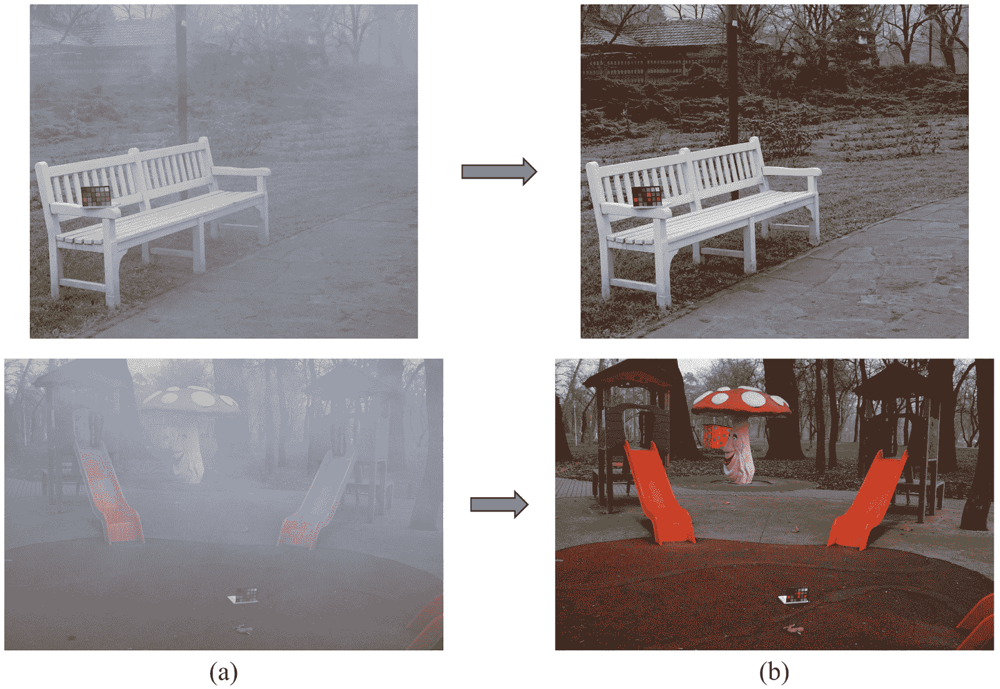

Examples of images with haze and their corresponding dehazed images. Source: [O-HAZE Dataset](https://data.vision.ee.ethz.ch/cvl/ntire18//o-haze/)

因此，许多研究者试图从模糊图像中恢复出高质量的清晰场景。在深度学习被广泛用于计算机视觉任务之前，图像去雾算法主要依赖于各种先验假设和大气散射模型。这些基于统计规则的方法的处理流程具有良好的可解释性，但是当面对复杂的真实世界场景时，它们可能会表现出缺点。因此，最近在图像去雾方面的努力采用了深度学习模型。

在这篇文章中，我们将涵盖图像去雾的数学基础，并讨论不同类别的去雾。我们将看看深度学习文献中提出的最流行的图像去雾架构，并详细讨论图像去雾的应用。

# 图像去雾的数学建模

大气散射模型是模糊图像生成过程的经典描述，其数学定义如下:

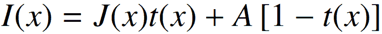

这里， *I(x)* 是观察到的模糊图像， *J(x)* 是要恢复的场景亮度(“干净图像”)。有两个关键参数: *A* 表示全局大气光， *t(x)* 是传输矩阵，定义如下，散射系数“ *β* ”，物体与相机的距离 *d(x)* :

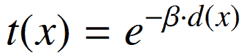

这个数学模型背后的想法是，光线在到达相机镜头之前会被空气中的悬浮颗粒(薄雾)散射。实际捕获的光量取决于存在多少薄雾，反映在 *β* 中，也取决于物体离相机有多远，反映在 *d(x)* 中。

深度学习模型试图学习传输矩阵。大气光单独计算，基于大气散射模型恢复干净图像。

# 图像去雾的评价指标

视觉线索不足以评估和比较不同去雾方法的性能，因为它们本质上是非常主观的。需要一种通用的去雾性能定量方法来公平地比较模型。

峰值信噪比(PSNR)和结构相似性(SSIM)指数是用于评估去雾性能的两个最常用的评估度量。一般来说，与现有技术相比，PSNR 和 SSIM 度量都用于去雾方法的公平评估

接下来让我们讨论这些指标。

## PSNR

峰值信噪比或 PSNR 是一种客观度量，其测量通过去雾算法获得的无雾图像和地面真实图像之间的信号失真程度。在数学上，它定义如下，其中“DH”表示从模型获得的去雾图像，而“GT”表示地面真实干净图像:


这里，“MSE”代表图像之间的像素级均方误差，“M”是图像中一个像素的最大可能值(对于 8 位 RGB 图像，我们习惯 M=255)。PSNR 值(以分贝/dB 为单位)越高，重建质量越好。在`Python3`中，PSNR 可以编码如下:

```py
import numpy as np
from math import log10

def PSNR(img1, img2):
    mse = np.mean((img1 - img2) ** 2)
    if(mse == 0):  # MSE is zero means no noise is present in the signal .
                  # Therefore PSNR have no importance.
        return 100
    max_pixel = 255.0
    psnr = 10 * log10(max_pixel**2 / mse)
    return psnr
```

## SSIM

由于 PSNR 在人类视觉判断方面无效，因此，许多研究人员利用了结构相似性指数度量(SSIM)，这是一种主观测量，根据地面真实图像和去雾图像之间的对比度、亮度和结构一致性来评估去雾性能。

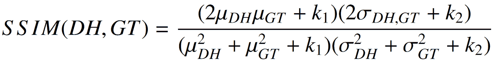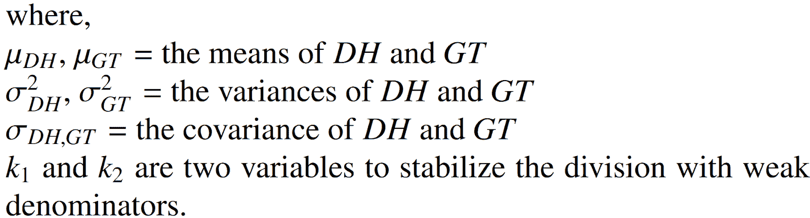

SSIM 的范围在 0 和 1 之间，其中较高的值表示较大的结构一致性，因此去雾效果较好。在`Python3`中，`skimage`包中包含了 SSIM 函数，可以很方便地使用:

```py
from skimage.metrics import structural_similarity as ssim

similarity = ssim(img1, img2)
```

# 单幅与多幅图像去雾

根据可用的输入信息量，存在两种类型的图像去雾方法。在单幅图像去雾中，只有一幅模糊图像可用，它需要映射到它的去雾对应物。然而，在多图像去雾中，同一场景或物体的多个模糊图像是可用的，它们都被用于映射到单个去雾图像。

在单幅图像去雾方法中，由于可用的输入信息量较少，因此在重构的去雾图像中可能出现伪图案，该伪图案与原始图像的上下文没有可辨别的联系。这可能会产生歧义，进而导致最终(人类)决策者的误导。

在完全监督的多图像去雾方法中，典型地，对干净图像(地面实况)使用不同的退化函数，以获得相同场景的略微不同类型的模糊图像。由于可用信息的多样性，这有助于模型做出更好的概括。

直观上，我们可以理解多图像去雾性能更好，因为它有更多的输入信息要处理。然而，在这种情况下，计算成本也增加了几倍，使得它在许多具有大量资源约束的应用场景中不可行。此外，获得同一物体的多个模糊图像通常是乏味且不实际的。因此，在诸如监视、水下探测等应用中，单幅图像去雾与真实世界更密切相关。，虽然是更有挑战性的问题陈述。

然而，在一些应用领域，如遥感领域，同一场景的多幅模糊图像通常很容易获得，因为多颗卫星和多台相机(通常在不同的曝光设置下)同时拍摄同一地点的图像。

一种使用多图像去雾的方法是基于 CNN 的 [RSDehazeNet](https://ieeexplore.ieee.org/abstract/document/9134800) 模型，以从多光谱遥感数据中去除薄雾。RSDehazeNet 由三种类型的模块组成:

1.  通道细化块或 CRB，用于对通道特征之间的相互依赖性进行建模，因为多光谱图像的通道高度相关
2.  残差信道细化块或 RCRB，因为具有残差块的 CNN 模型能够捕捉弱信息，从而驱动网络以更快的速度收敛并具有更高的性能。
3.  特征融合块(FFB ),用于特征地图的全局融合和多光谱遥感图像的去雾。

RSDehazeNet 模型的架构如下所示。

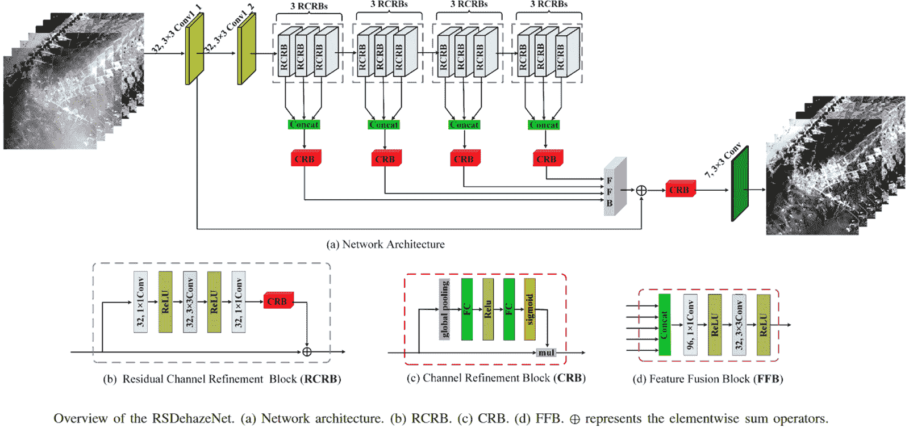

Source: [Paper](https://ieeexplore.ieee.org/abstract/document/9134800)

通过 RSDehazeNet 模型获得的一些结果如下所示。

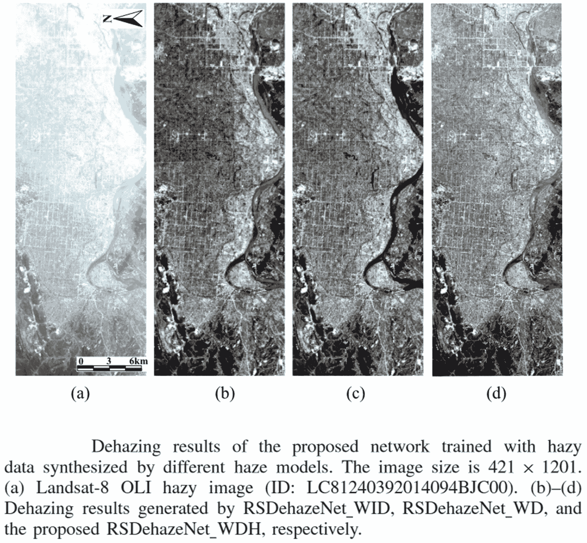

Source: [Paper](https://ieeexplore.ieee.org/abstract/document/9134800)

# 去雾方法的分类

基于模糊输入图像的地面真实图像的可用性，图像去雾方法可以分为以下几类:

1.  监督方法
2.  半监督方法
3.  无监督方法

接下来让我们讨论这些方法。

## 监督方法

在完全监督的方法中，对应于模糊图像的去雾图像都可以用于训练网络。有监督去雾模型通常需要不同类型的监督信息来指导训练过程，如透射图、大气光、无霾图像标签等。

快速准确的多尺度去雾网络就是这样一种解决单幅图像去雾问题的监督方法，其目的是提高网络的推理速度。fame ed-Net 由一个完全卷积的端到端多尺度网络(带有三个不同尺度的编码器)组成，可以有效地处理任意大小的模糊图像。著名的网络模型的架构如下所示。

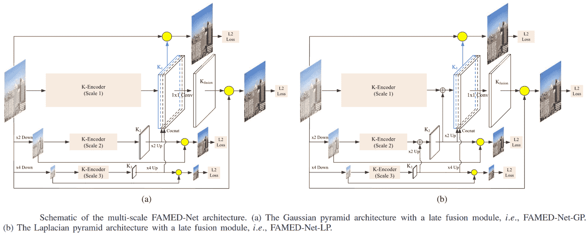

Source: [Paper](https://doi.org/10.1109/TIP.2019.2922837)

## 半监督方法

半监督学习是一种机器学习范式，其中大数据集的小子集(比如说 5-10%的数据)包含基础事实标签。因此，一个模型会受到大量未标记数据以及少量用于网络训练的标记样本的影响。与全监督方法相比，半监督方法在图像去雾方面受到的关注较少。

PSD 或 Principled Synthetic-to-Real 去雾是一种半监督去雾模型，包括两个阶段:监督预训练和非监督微调。对于预训练，作者使用合成数据并使用真实模糊的未标记数据进行无监督微调，采用无监督的[域适应](https://www.v7labs.com/blog/domain-adaptation-guide)进行合成到真实图像的转换。模型框架如下所示。

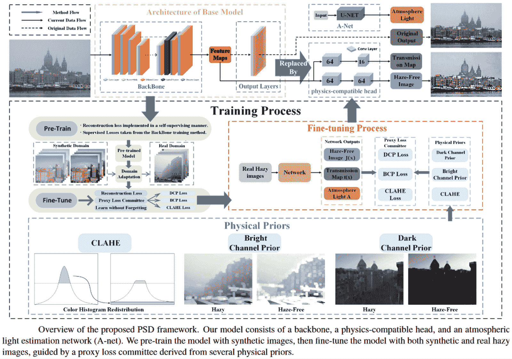

Source: [Paper](https://openaccess.thecvf.com/content/CVPR2021/papers/Chen_PSD_Principled_Synthetic-to-Real_Dehazing_Guided_by_Physical_Priors_CVPR_2021_paper.pdf)

与现有技术相比，通过 PSD 方法获得的一些视觉结果如下所示。

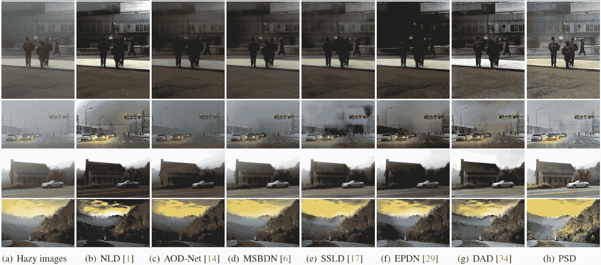

Source: [Paper](https://openaccess.thecvf.com/content/CVPR2021/papers/Chen_PSD_Principled_Synthetic-to-Real_Dehazing_Guided_by_Physical_Priors_CVPR_2021_paper.pdf)

## 监督方法

在无监督学习中，数据标签是完全缺失的。深度网络将需要完全使用非结构化数据进行训练。这使得图像去雾问题更加具有挑战性。

例如， [SkyGAN](https://openaccess.thecvf.com/content/WACV2021/papers/Mehta_Domain-Aware_Unsupervised_Hyperspectral_Reconstruction_for_Aerial_Image_Dehazing_WACV_2021_paper.pdf) 是一种无监督去雾模型，其利用生成式对抗网络(GAN)架构来对高光谱图像去雾。SkyGAN 使用具有循环一致性的条件 GAN (cGAN)框架，即，添加正则化参数，假设去模糊图像在降级时应该再次返回模糊输入图像。SkyGAN 模型的架构如下所示。

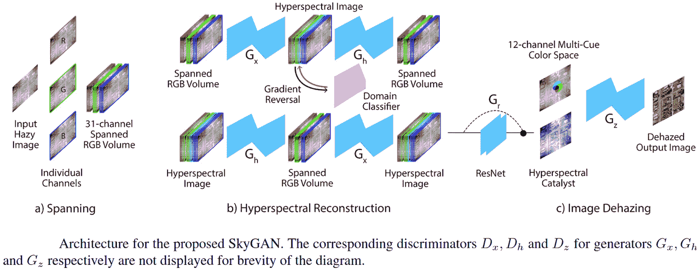

Source: [Paper](http://paper)

SkyGAN 模型获得的结果令人印象深刻，因为它们甚至超过了完全监督的方法。获得的一些视觉结果如下所示。

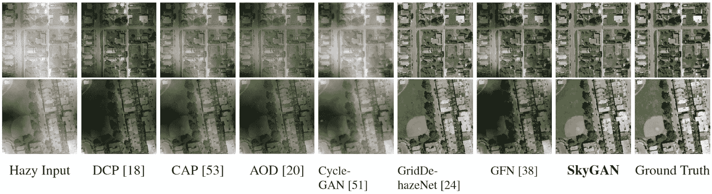

Source: [Paper](http://paper)

受监督的单一去雾问题的代码中最重要的部分是管理自定义数据集，以获得模糊和干净的图像。同样的 PyTorch 代码如下所示:

```py
import torch
import torch.utils.data as data
import torchvision.transforms as transforms
import numpy as np
from PIL import Image
import os

class DehazingDataset(data.Dataset):
    def __init__(self, hazy_images_path, clean_images_path, transform=None):
        #Get the images
        self.hazy_images = [hazy_images_path + f for f in os.listdir(hazy_images_path) if  f.endswith('.jpg') or f.endswith('.png') or f.endswith('.jpeg')]
        self.clean_images = [clean_images_path + f for f in os.listdir(clean_images_path) if f.endswith('.jpg') or f.endswith('.png') or f.endswith('.jpeg')]

        #Filter the images to ensure they are counterparts of the same scene
        self.filter_files()
        self.size = len(self.hazy_images)
        self.transform=transform

    def filter_files(self):
        assert len(self.hazy_images) == len(self.clean_images)
        hazy_ims = []
        clean_ims = []
        for hazy_img_path, clean_img_path in zip(self.hazy_images, self.clean_images):
            hazy = Image.open(hazy_img_path)
            clean = Image.open(clean_img_path)
            if hazy.size == clean.size:
                hazy_ims.append(hazy_img_path)
                clean_ims.append(clean_img_path)
        self.hazy_images = hazy_ims
        self.clean_images = clean_ims

    def __getitem__(self, index):
        hazy_img = self.rgb_loader(self.hazy_images[index])
        clean_img = self.rgb_loader(self.clean_images[index])
        hazy_img = self.transform(hazy_img)
        clean_img = self.transform(clean_img)
        return hazy_img, clean_img

    def rgb_loader(self, path):
        with open(path, 'rb') as f:
            img = Image.open(f)
            return img.convert('RGB')

    def __len__(self):
        return self.size

#Main code for dataloader

hazy_path = "/path/to/train/haimg/"
clean_path = "/path/to/train/cleimg/"
transforms = transforms.Compose([
                                 transforms.Resize((224, 224)),
                                 transforms.ToTensor(),
                                 transforms.Normalize([0.485, 0.456, 0.406],[0.229, 0.224, 0.225])
                                 ])
dataset = DehazingDataset(hazy_path, clean_path, transform = transforms)
data_loader = data.DataLoader(dataset=dataset,
                              batch_size=32,
                              shuffle=True,
                              num_workers=2)
```

一旦数据集准备就绪，任何图像到图像的转换模型代码都可以应用于它。

# 流行的模型

多年来，已经提出了几种不同的基于深度学习的模型架构来解决图像去雾问题。让我们讨论一些主要的模型，它们已经成为未来研究方向的垫脚石。这些模型中的大多数在各自的 GitHub 存储库中都有 Python 实现。

如果你想在渐变中使用下面的代码，只需打开下面的链接，将库克隆到笔记本中。这个笔记本预先设置了上面使用的代码。

## MSCNN

MSCNN ，或称多尺度卷积神经网络，是针对单幅图像去雾问题的早期尝试之一。顾名思义，MSCNN 本质上是多尺度的，有助于从朦胧图像中学习有效特征，用于场景透射图的估计。场景透射图首先由粗尺度网络估计，然后由细尺度网络细化。

从粗尺度网络获得每个图像的场景透射图的粗略结构，然后由细尺度网络进行细化。粗尺度和细尺度网络都应用于原始输入模糊图像。此外，粗网络的输出作为附加信息传递给细网络。因此，精细尺度网络可以用细节来细化粗略预测。MSCNN 模型的架构如下所示。

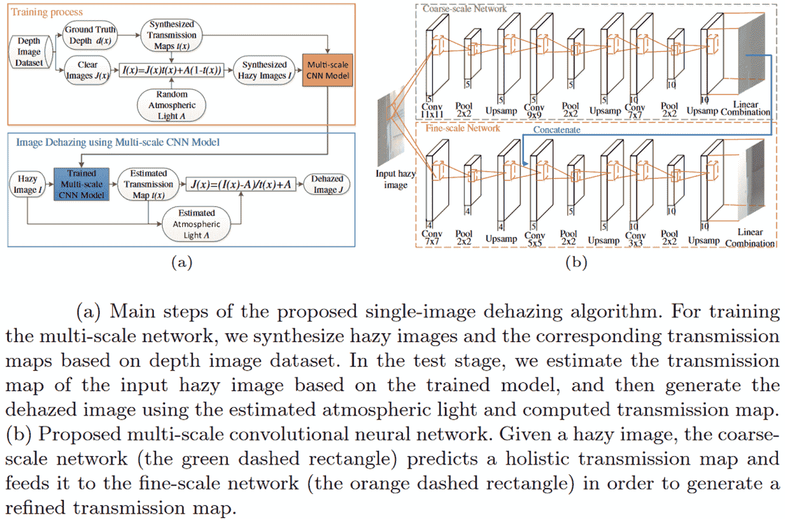

Source: [Paper](https://link.springer.com/chapter/10.1007/978-3-319-46475-6_10)

与当时的一些基线方法相比，MSCNN 结果获得的结果的一些例子如下所示。

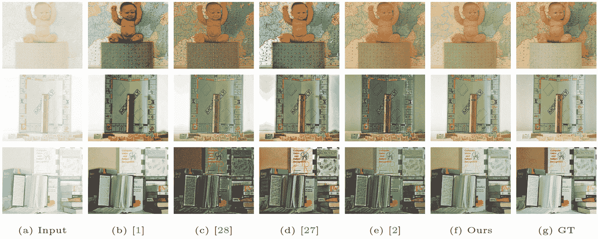

Source: [Paper](https://link.springer.com/chapter/10.1007/978-3-319-46475-6_10)

## 去雾网

[去雾网](https://doi.org/10.1109/TIP.2016.2598681)是另一种解决单幅图像去雾问题的早期方法。去雾网的代码可以在[这里](https://github.com/caibolun/DehazeNet)找到。DehazeNet 是一个系统，它学习和估计输入图像中的模糊斑块与其介质传输之间的映射。简单的 CNN 模型用于特征提取，多尺度映射用于实现尺度不变性。

DehazeNet 是一种完全监督的方法，其中干净的自然场景图像被手动降级，以通过使用深度元数据来模拟模糊的输入图像。DehazeNet 的模型架构如下所示。

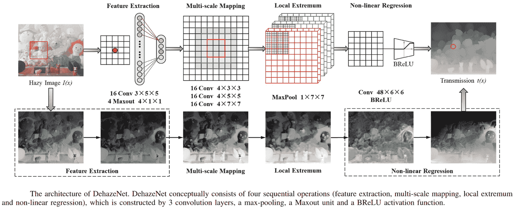

Source: [Paper](https://doi.org/10.1109/TIP.2016.2598681)

下面显示了与当时最先进的方法相比，由去雾网模型获得的一些结果。

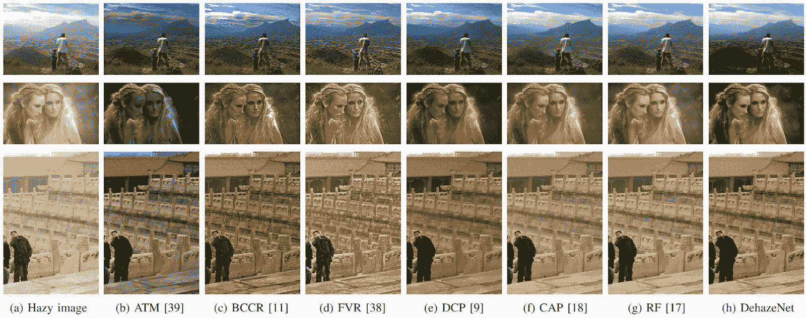

Source: [Paper](https://doi.org/10.1109/TIP.2016.2598681)

## AOD-Net

[AOD 网](https://openaccess.thecvf.com/content_ICCV_2017/papers/Li_AOD-Net_All-In-One_Dehazing_ICCV_2017_paper.pdf)或一体化去雾网络是一种流行的端到端(全监督)基于 CNN 的图像去雾模型。这个代码的实现可以在[这里找到。](https://github.com/walsvid/AOD-Net-PyTorch)AOD 网络的主要新颖之处在于，它是第一个优化从模糊图像到清晰图像的端到端管道的模型，而不是一个中间参数估计步骤。AOD 网络是基于一个重新制定的大气散射模型设计的。使用以下等式从大气散射模型获得清晰图像:

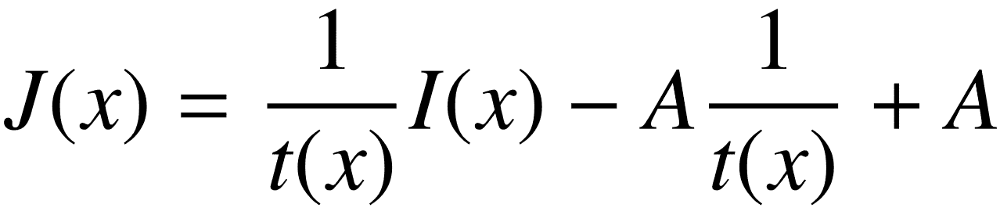

与使用从模糊图像到传输矩阵的端到端学习的去雾网络不同，AOD 网络使用深度端到端模型进行图像去雾操作。AOD 网络模型的架构图如下所示。

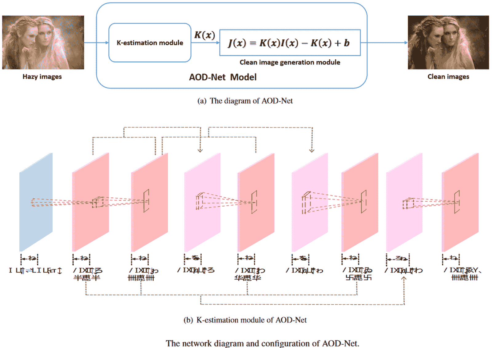

Source: [Paper](https://doi.org/10.1109/TIP.2016.2598681)

通过 AOD 网络模型获得的一些结果如下所示。

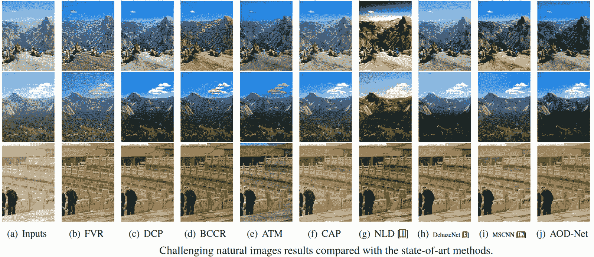

Source: [Paper](https://doi.org/10.1109/TIP.2016.2598681)

## DCPDN

[DCPDN](https://openaccess.thecvf.com/content_cvpr_2018/papers/Zhang_Densely_Connected_Pyramid_CVPR_2018_paper.pdf) 或密集连接的金字塔去雾网络是一种图像去雾模型，其利用了用于去雾的[生成对抗网络](https://blog.paperspace.com/complete-guide-to-gans/)架构。这个模型的代码可以在[这里找到。](https://github.com/hezhangsprinter/DCPDN)DCP dn 模型从图像中学习结构关系，并由编码器-解码器结构组成，该结构可被联合优化以同时估计透射图、大气光线以及图像去雾。与此同时，大气模型也包含在架构中，以便更好地优化整个学习过程。

然而，训练如此复杂的网络(具有三个不同的任务)在计算上是非常昂贵的。因此，为了简化训练过程并加速网络收敛，DCPDN 利用了分阶段学习技术。首先对网络的每个部分进行渐进优化，然后对整个网络进行联合优化。GAN 架构的主要目的是利用透射图和去雾图像之间的结构关系。DCPDN 模型的架构如下所示。

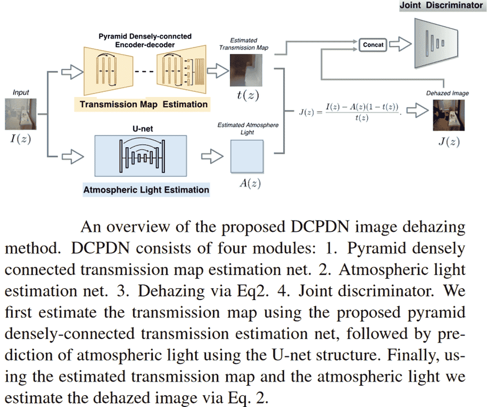

Source: [Paper](https://openaccess.thecvf.com/content_cvpr_2018/papers/Zhang_Densely_Connected_Pyramid_CVPR_2018_paper.pdf)

上图中的联合鉴别器区分一对估计的透射图和去雾图像是真的还是假的。此外，为了保证大气光也能在整个结构中得到优化，采用了 U-net 来估计均匀的大气光图。此外，采用多级金字塔池块来确保来自不同尺度的特征被有效地嵌入到最终结果中。

与最先进的模型相比，DCPDN 模型获得的一些结果如下所示。

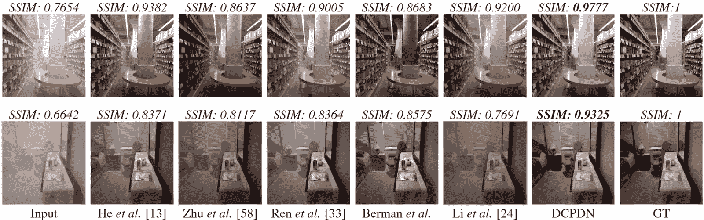

Source: [Paper](https://openaccess.thecvf.com/content_cvpr_2018/papers/Zhang_Densely_Connected_Pyramid_CVPR_2018_paper.pdf)

## FFA-Net

[FFA-Net](https://ojs.aaai.org/index.php/AAAI/article/download/6865/6719) 或特征融合注意力网络是一种相对较新的单幅图像去雾网络，它使用端到端的架构来直接恢复无雾图像。这个模型的代码可以在[这里找到。](https://github.com/zhilin007/FFA-Net)大多数早期模型同等对待通道特征和像素特征。然而，雾度在图像上分布不均匀；非常薄的霾的权重应该明显不同于厚霾区域像素的权重。

FFA-Net 的新颖之处在于它区别对待薄霾和厚霾区域，从而通过避免对不太重要的信息进行不必要的计算来节省资源。这样，网络能够覆盖所有像素和通道，并且网络的表现不受阻碍。

FFA-Net 试图保留浅层的特性，并将它们传递到架构的深层。在将所有特征馈送到融合模块之前，该模型还给予不同级别的特征不同的权重。通过特征注意模块(由通道注意和像素注意模块的级联组成)的自适应学习来获得权重。FFA-Net 模型的架构图如下所示。

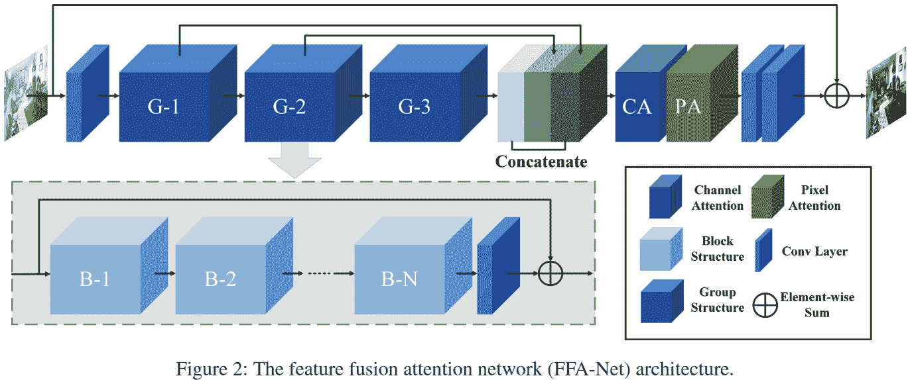

Source: [Paper](https://ojs.aaai.org/index.php/AAAI/article/download/6865/6719)

下面显示了由 FFA-Net 模型获得的一些去雾结果。FFA-Net 模型的 python 实现可以在[这里](https://github.com/zhilin007/FFA-Net)找到。

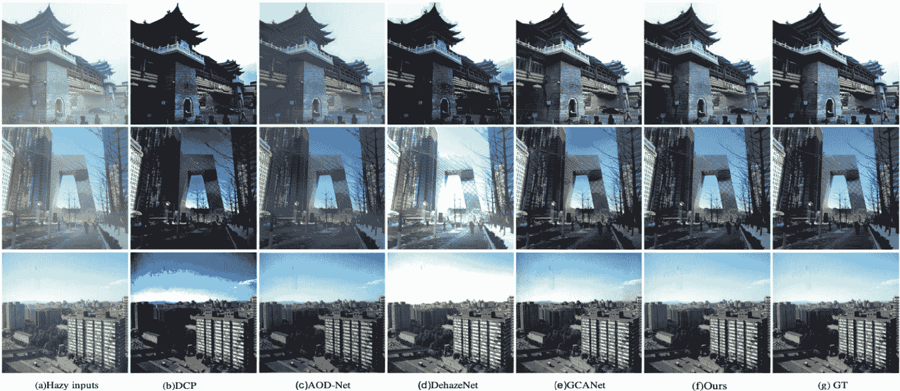

Source: [Paper](https://ojs.aaai.org/index.php/AAAI/article/download/6865/6719)

## **脱模工**

[去雾器](https://arxiv.org/pdf/2204.03883.pdf)是文献中提出的最新单幅图像去雾深度模型之一。实现这个的代码可以在[这里](https://github.com/IDKiro/DehazeFormer)找到。它在其内核中使用了[视觉变压器](https://openreview.net/pdf?id=YicbFdNTTy) (ViT)，具体来说就是 [Swin 变压器](https://openaccess.thecvf.com/content/ICCV2021/papers/Liu_Swin_Transformer_Hierarchical_Vision_Transformer_Using_Shifted_Windows_ICCV_2021_paper.pdf)。CNN 多年来一直主导着大多数计算机视觉任务，而最近，ViT 架构显示出取代 CNN 的能力。ViT 开创了 Transformer 架构的直接应用，通过逐块线性嵌入将图像投影到令牌序列中。

去混叠器使用 U-Net 型编码器-解码器架构，但是卷积块被去混叠器块代替。去雾器使用 Swin Transformer 模型，并对其进行了一些改进，例如用同一篇论文中提出的新“RescaleNorm”层替换了 [LayerNorm](https://arxiv.org/pdf/1607.06450.pdf) 归一化层。RescaleNorm 对整个特征图执行归一化，并重新引入归一化后丢失的特征图的均值和方差。

此外，作者提出了优于全局残差学习的基于先验的软重建模块和基于 [SKNet](https://openaccess.thecvf.com/content_CVPR_2019/papers/Li_Selective_Kernel_Networks_CVPR_2019_paper.pdf) 的多尺度特征图融合模块(如在 MSCNN 和 FFA-Net 架构中使用的)来代替级联融合。

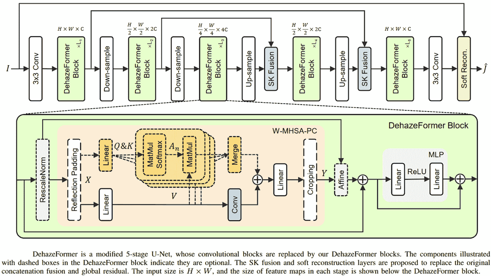

Source: [Paper](https://arxiv.org/pdf/2204.03883.pdf)

去雾器模型大大优于当代方法，当代方法大多使用具有较低开销的卷积网络，这从下面所示的定量结果中显而易见。通过去雾模型获得的一些定性结果也如下所示。

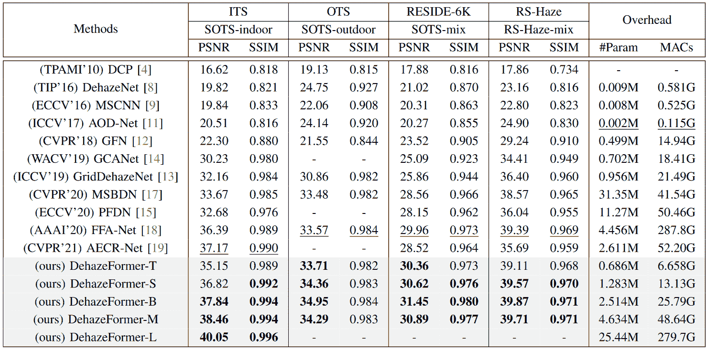

Source: [Paper](https://arxiv.org/pdf/2204.03883.pdf)

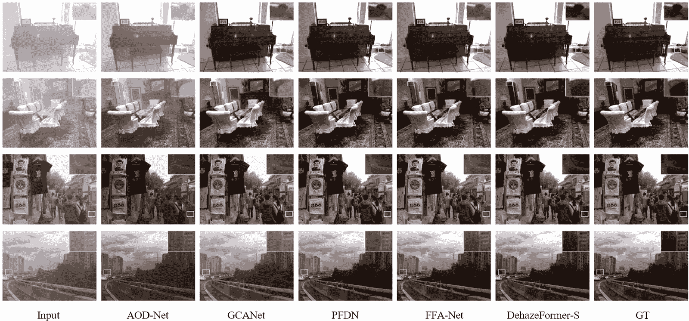

Source: [Paper](https://arxiv.org/pdf/2204.03883.pdf)

## 天气变化

[TransWeather](https://openaccess.thecvf.com/content/CVPR2022/papers/Valanarasu_TransWeather_Transformer-Based_Restoration_of_Images_Degraded_by_Adverse_Weather_Conditions_CVPR_2022_paper.pdf) 是图像去雾文献中最新的深度学习架构。你可以在这里访问这个[模型的代码。它是一种通用模型，使用单编码器-单解码器变压器网络来解决所有不利天气消除问题(雨、雾、雪等)。)立刻。作者没有使用多个编码器，而是在 transformer 解码器中引入了天气类型查询来学习任务。](https://github.com/jeya-maria-jose/TransWeather)


Source: [Paper](https://openaccess.thecvf.com/content/CVPR2022/papers/Valanarasu_TransWeather_Transformer-Based_Restoration_of_Images_Degraded_by_Adverse_Weather_Conditions_CVPR_2022_paper.pdf)

TransWeather 模型由一个新颖的变压器编码器和片内变压器(Intra-PT)模块组成。Intra-PT 处理从原始补片创建的子补片，并挖掘更小补片的特征和细节。因此，Intra-PT 将注意力集中在主补丁内部，以有效地消除天气退化。作者还使用有效的自我注意机制来计算子补丁之间的注意，以保持较低的计算复杂度。TransWeather 模型的架构如下所示。

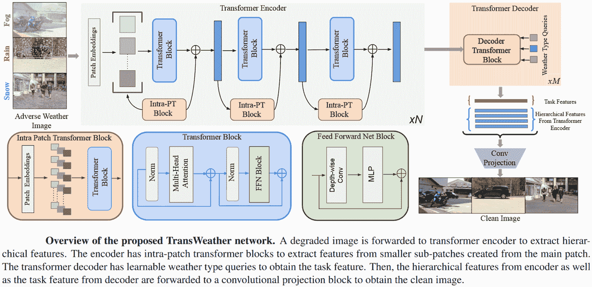

Source: [Paper](https://openaccess.thecvf.com/content/CVPR2022/papers/Valanarasu_TransWeather_Transformer-Based_Restoration_of_Images_Degraded_by_Adverse_Weather_Conditions_CVPR_2022_paper.pdf)

通过 TransWeather 模型获得的一些定性结果如下所示。

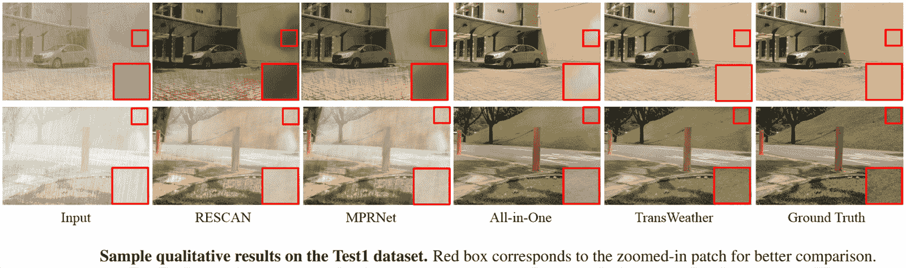

Source: [Paper](https://openaccess.thecvf.com/content/CVPR2022/papers/Valanarasu_TransWeather_Transformer-Based_Restoration_of_Images_Degraded_by_Adverse_Weather_Conditions_CVPR_2022_paper.pdf)

## 图像去雾的应用

图像去雾是计算机视觉中的一项重要任务，因为它在现实世界中有着广泛的应用。接下来让我们看看图像去雾的一些最重要的应用。

1.  ***监控:*** 使用图像或视频(本质上是一系列图像)的监控对于安全至关重要。视觉监控系统的有效性和准确性取决于视觉输入的质量。不利的天气条件会使监视系统变得无用，从而使图像去雾成为该区域的一项重要操作。
2.  *******智能交通系统:******* 大雾天气条件会影响驾驶员的能力，并因能见度有限而显著增加事故风险和出行时间。一般来说，飞机的起飞和降落在雾蒙蒙的环境中也是一项非常具有挑战性的任务。随着自动驾驶技术的出现，图像去雾是自动驾驶汽车或飞机正常运行不可或缺的操作。
3.  *******水下图像增强:******* 水下成像经常会出现能见度差和颜色失真的情况。能见度低是由雾霾效应造成的，雾霾效应是由水粒子多次散射光线造成的。颜色失真是由于光的衰减，使图像带蓝色。因此，在海洋生物学研究中流行的水下视觉系统需要图像去雾算法作为预处理，以便人类可以看到水下物体。比如这篇[论文](https://openaccess.thecvf.com/content_cvpr_2017_workshops/w27/papers/Skinner_Underwater_Image_Dehazing_CVPR_2017_paper.pdf)专门处理水下图像去雾的问题，结果如下图所示。
4.  *******遥感:*********在遥感中，通过拍摄图像来获取物体或区域的信息。这些图像通常来自卫星或飞机。由于相机和场景之间的距离差异很大，所以在捕获的场景中会引入薄雾效果。因此，这种应用还需要图像去雾作为预处理工具，以在分析之前提高图像的视觉质量。**

**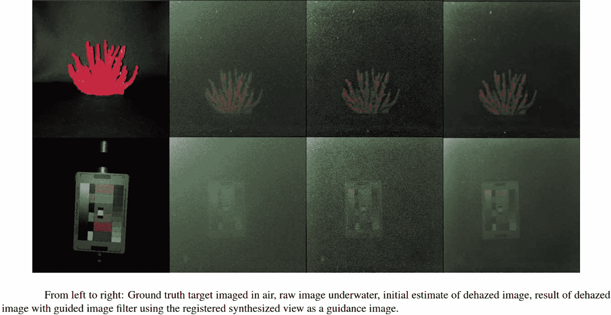

Underwater Image Dehazing. Source: [Paper](https://openaccess.thecvf.com/content_cvpr_2017_workshops/w27/papers/Skinner_Underwater_Image_Dehazing_CVPR_2017_paper.pdf)** **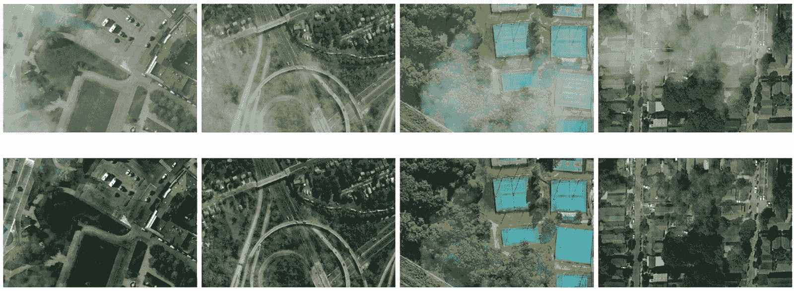

Image Dehazing in Remote Sensing Images. Source: [Paper](https://www.mdpi.com/2072-4292/13/21/4443)** 

# **结论**

**图像去雾是计算机视觉中的一项重要任务，因为它在安全和自动驾驶等领域有着广泛的应用，在这些领域，清晰的去雾图像对于进一步的信息处理是必要的。多年来，已经提出了几种深度学习模型来解决这个问题，其中大多数都使用了完全监督学习。基于 CNN 的架构是首选方法，直到最近变压器模型获得了更好的性能。**

**该领域的最新研究集中在减少图像去雾中对监督(标记数据)的要求。尽管使用数学函数来模拟模糊图像会降低自然图像的质量，但它仍然不是准确的表示。因此，为了可靠地从图像中去除模糊，需要原始模糊图像以及它们的去模糊对应物用于监督学习。像自我监督学习和零触发学习这样的方法完全缓解了这种需求，因此已经成为最近研究的主题。**