# 图像超分辨率:综述

> 原文：<https://blog.paperspace.com/image-super-resolution/>

图像超分辨率是指将图像的分辨率从低分辨率(LR)提高到高分辨率(HR)的任务。它广泛用于以下应用:

1.  **监视:**对从安全摄像头获得的低分辨率图像进行检测、识别和执行面部识别。
2.  **医学:**在扫描时间、空间覆盖范围和信噪比(SNR)方面，捕捉高分辨率 MRI 图像可能很棘手。超分辨率通过从低分辨率 MRI 图像生成高分辨率 MRI 来帮助解决这一问题。
3.  **媒体:**超分辨率可以用来降低服务器成本，因为媒体可以以较低的分辨率发送，并可以动态升级。

深度学习技术在解决图像和视频超分辨率问题方面已经相当成功。在本文中，我们将讨论所涉及的理论、所使用的各种技术、损失函数、度量和相关数据集。您还可以在 [ML Showcase](https://ml-showcase.paperspace.com/projects/image-super-resolution) 上免费运行我们将介绍的模型之一 ESPCN 的代码。

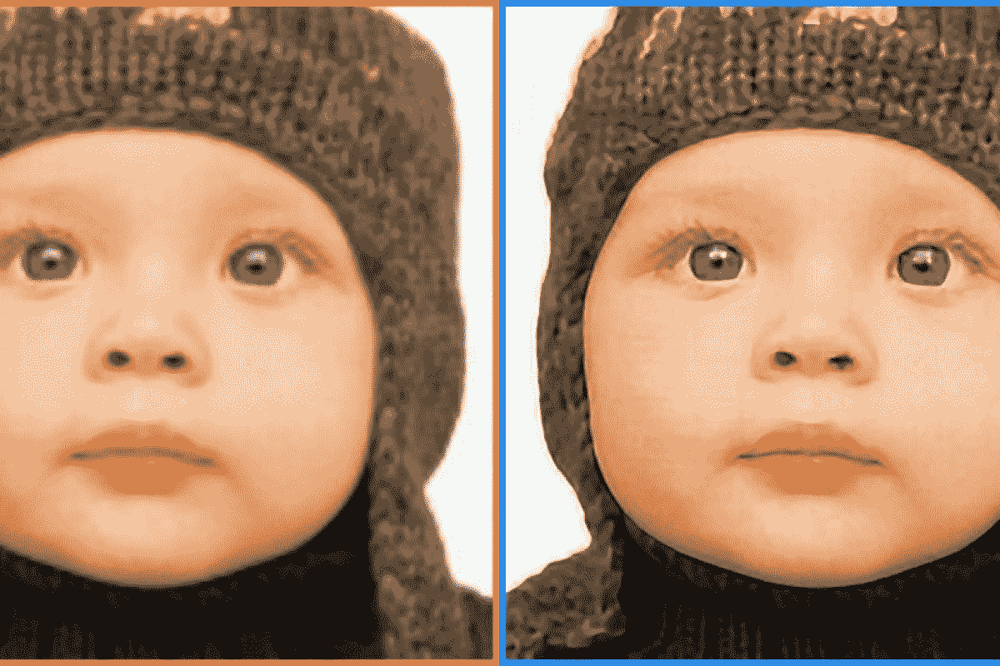

([source](https://newatlas.com/super-resolution-weizmann-institute/23486/))

# 图像超分辨率

低分辨率图像可以使用下面的公式从高分辨率图像建模，其中 *D* 是退化函数，*I[y]是高分辨率图像，*I[x]是低分辨率图像，并且$\sigma$是噪声。**

$ $ I _ { x } = D(I _ y；\sigma) $$

退化参数 *D* 和$\sigma$未知；仅提供高分辨率图像和相应的低分辨率图像。神经网络的任务是仅使用 HR 和 LR 图像数据找到退化的反函数。

## 超分辨率方法和技术

有许多方法可以解决这个问题。我们将涵盖以下内容:

*   预上采样超分辨率
*   后上采样超分辨率
*   剩余网络
*   多级残差网络
*   递归网络
*   渐进重建网络
*   多分支网络
*   基于注意力的网络
*   生成模型

我们将看一下每种算法的几个例子。

### 预上采样超分辨率

这种方法使用传统技术，如双三次插值和深度学习，来改进上采样图像。

最流行的方法 SRCNN 也是第一个使用深度学习的，并取得了令人印象深刻的效果。

#### SRCNN

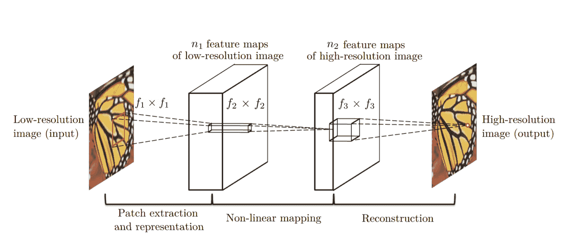

[Source](https://arxiv.org/abs/1501.00092)

SRCNN 是一个简单的 CNN 架构，由三层组成:一层用于面片提取、非线性映射和重建。面片提取层用于从输入中提取密集面片，并使用卷积滤波器来表示它们。非线性映射层由 1×1 卷积滤波器组成，用于改变通道数量和增加非线性。正如你可能已经猜到的，最终重建层重建高分辨率图像。

MSE 损失函数用于训练网络，PSNR(下面在*度量*部分讨论)用于评估结果。稍后我们将更详细地讨论这两个问题。

#### VDSR

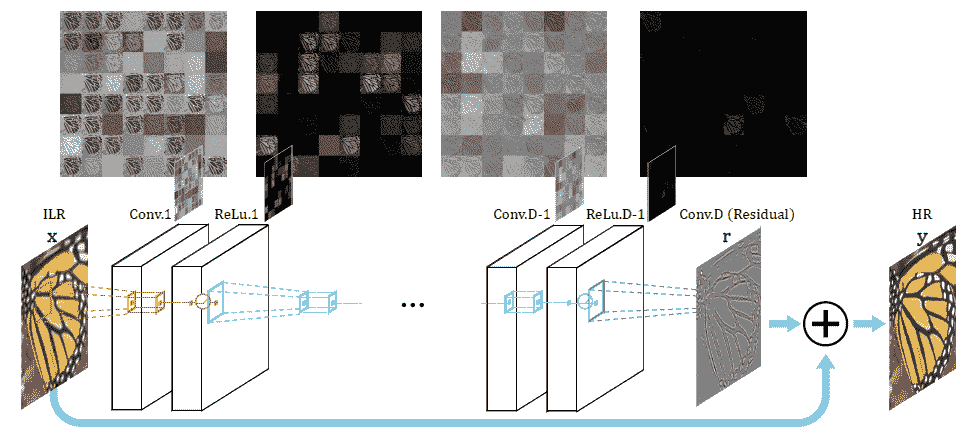

[Source](https://arxiv.org/pdf/1511.04587.pdf)

甚深超分辨率(VDSR)是对 SRCNN 的改进，增加了以下功能:

*   顾名思义，使用带有小型 3×3 卷积滤波器的深度网络，而不是带有大型卷积滤波器的小型网络。这是基于 [VGG 架构](https://blog.paperspace.com/popular-deep-learning-architectures-alexnet-vgg-googlenet/)的。
*   网络试图学习输出图像和插值输入的残差，而不是学习直接映射(像 SRCNN)，如上图所示。这简化了任务。将初始低分辨率图像添加到网络输出中，以获得最终的 HR 输出。
*   梯度裁剪用于以更高的学习速率训练深度网络。

### 后上采样超分辨率

由于预上采样 SR 中的特征提取过程发生在高分辨率空间中，因此所需的计算能力也在高端。后上采样 SR 试图通过在较低分辨率空间中进行特征提取来解决这一问题，然后仅在最后进行上采样，因此显著减少了计算。此外，不是使用简单的双三次插值来进行上采样，而是使用反卷积/子像素卷积形式的学习上采样，从而使得网络是端到端可训练的。

让我们按照这个结构讨论一些流行的技术。

#### FSRCNN(密西西比州)

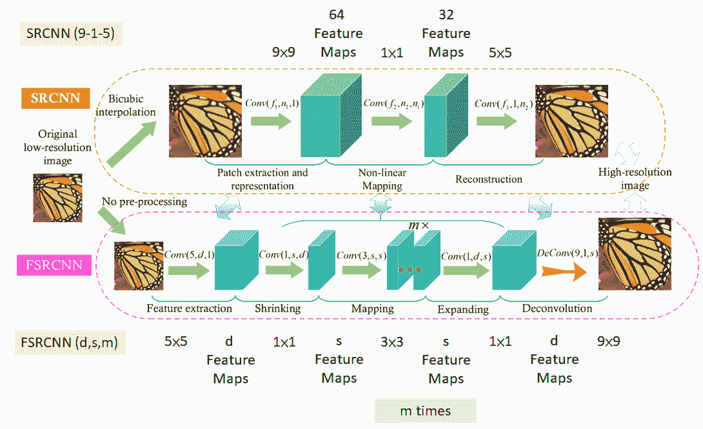

[Source](https://arxiv.org/abs/1608.00367)

从上图可以看出，SRCNN 和 FSRCNN 之间的主要变化是:

1.  开始时没有预处理或上采样。特征提取发生在低分辨率空间。
2.  在最初的 5×5 卷积后使用 1×1 卷积，以减少通道数量，从而减少计算和内存，类似于[初始网络](https://blog.paperspace.com/popular-deep-learning-architectures-resnet-inceptionv3-squeezenet/)的开发方式。
3.  使用多个 3×3 卷积，而不是大型卷积滤波器，类似于 [VGG](https://blog.paperspace.com/popular-deep-learning-architectures-alexnet-vgg-googlenet/) 网络通过简化架构来减少参数数量的工作方式。​
4.  通过使用学习的去卷积滤波器来完成上采样，从而改进模型。

FSRCNN 最终获得了比 SRCNN 更好的结果，同时也更快。

#### espn

ESPCN 引入了子像素卷积的概念，以取代用于上采样的去卷积层。这解决了与之相关的两个问题:

1.  去卷积发生在高分辨率空间，因此计算量更大。
2.  它解决了反卷积中的棋盘问题，该问题是由于卷积的重叠操作而出现的(如下所示)。

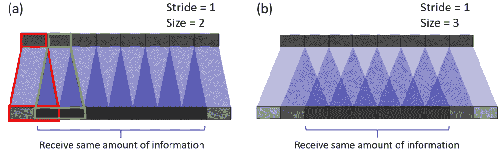

[Source](https://arxiv.org/pdf/1609.05158.pdf)

亚像素卷积通过将深度转换为空间来工作，如下图所示。来自低分辨率图像中多个通道的像素被重新排列成高分辨率图像中的单个通道。举例来说，大小为 5×5×4 的输入图像可以将最后四个通道中的像素重新排列为一个通道，从而产生 10×10 小时的图像。

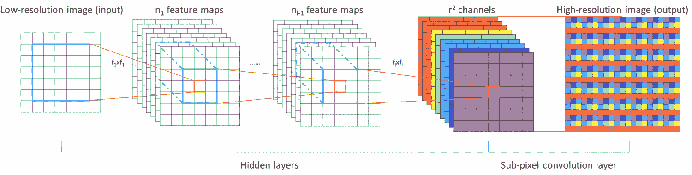

[Source](https://arxiv.org/pdf/1609.05158.pdf)

现在让我们讨论几个基于下图技术的架构。

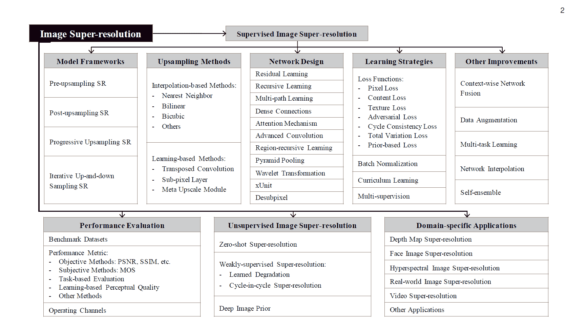

[Source](https://arxiv.org/pdf/1902.06068.pdf)

### 剩余网络

#### EDSR

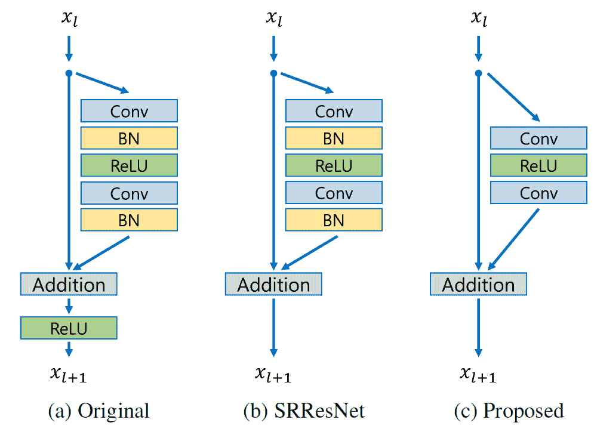

[Source](https://arxiv.org/abs/1707.02921)

EDSR 架构基于 SRResNet 架构，由多个残差块组成。EDSR 的剩余区块如上图所示。与 SRResNet 的主要区别在于移除了批处理规范化层。作者陈述了 BN 将输入归一化，从而限制了网络的范围；BN 的去除导致精度的提高。BN 层也会消耗内存，删除它们可以减少多达 40%的内存，从而提高网络训练的效率。

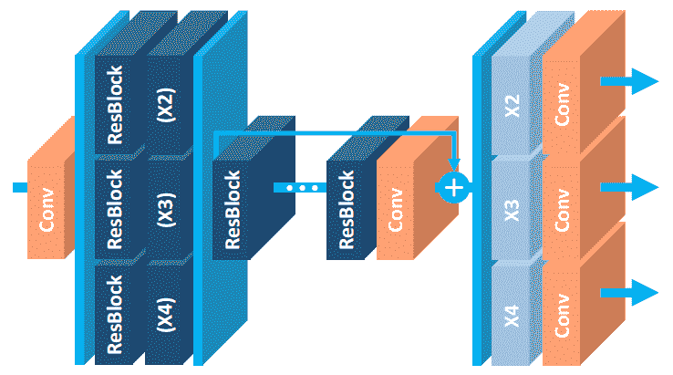

[Source](https://arxiv.org/abs/1707.02921)

#### MDSR

MDSR 是 EDSR 的扩展，具有多个输入和输出模块，可提供 2 倍、3 倍和 4 倍的相应分辨率输出。首先，针对特定尺度输入的预处理模块由两个具有 5×5 核的残差块组成。大的核用于预处理层，以保持网络浅，同时仍然实现高感受野。特定于尺度的预处理模块的末尾是共享残差块，它是所有分辨率的数据的公共块。最后，在共享残差块之后是特定尺度的上采样模块。虽然 MDSR 的总深度是单尺度 EDSR 的 5 倍，但由于参数共享，参数数量只有 2.5 倍，而不是 5 倍。MDSR 取得了与特定尺度的 EDSR 相当的结果，尽管该网络的参数比特定尺度的 EDSR 模型的总和还要少。

#### 堆石标记

在论文[快速、精确、轻量级的级联残差网络超分辨率](https://arxiv.org/abs/1803.08664)中，作者在传统残差网络的基础上提出了以下改进:

1.  在本地和全球级别的级联机制，以结合来自多个层的特征，并给予网络接收更多信息的能力。
2.  除了 CARN 之外，在递归网络架构的帮助下，提出了更小的 CARN-M 以具有更轻的架构，而结果没有太大的恶化。

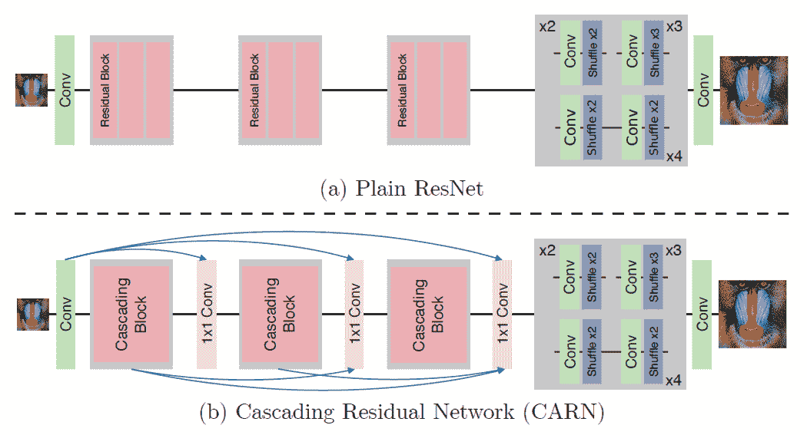

[Source](https://arxiv.org/abs/1803.08664)

CARN 中的全球连接如上图所示。具有 1×1 卷积的每个级联块的顶点接收来自所有先前级联块的输入和初始输入，从而导致信息的有效传输。

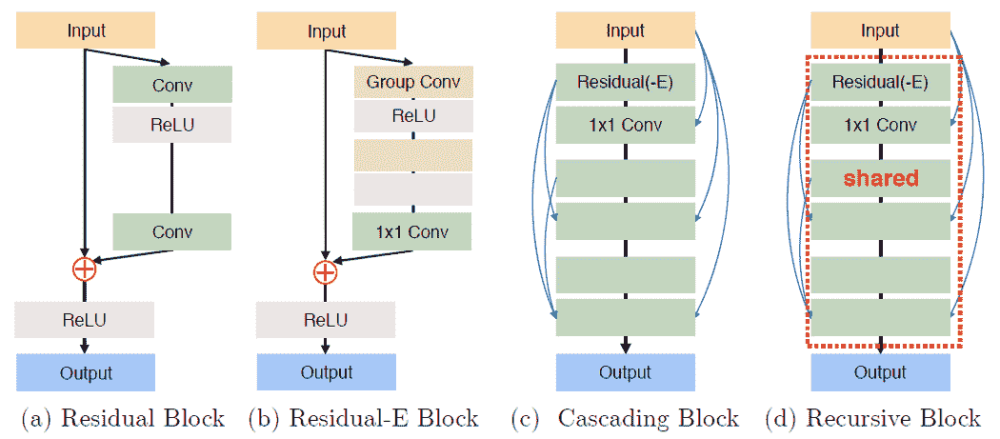

[Source](https://arxiv.org/abs/1803.08664)

级联块中的每个残差块都以 1x1 卷积结束，该卷积具有来自所有先前残差块以及主输入的连接，类似于全局级联的工作方式。

ResNet 中的 residual 块被一种新设计的 Residual-E 块所取代，这种 Residual-E 块是受 MobileNet 中深度方向卷积的启发而设计的。使用组卷积而不是深度卷积，结果显示所使用的计算量减少了 1.8-14 倍，这取决于组的大小。

为了进一步减少参数的数量，使用了共享的残差块(递归块)，从而使参数的数量减少到原始数量的三倍。从上面的 *(d)* 中可以看出，递归共享块有助于减少参数的总数。

### 多级残差网络

为了分别处理低分辨率空间和高分辨率空间中的特征提取任务，在一些架构中考虑了多级设计以提高它们的性能。第一阶段预测粗糙特征，而后期对其进行改进。让我们讨论一个包含这些多级网络之一的架构。

#### BTSRN

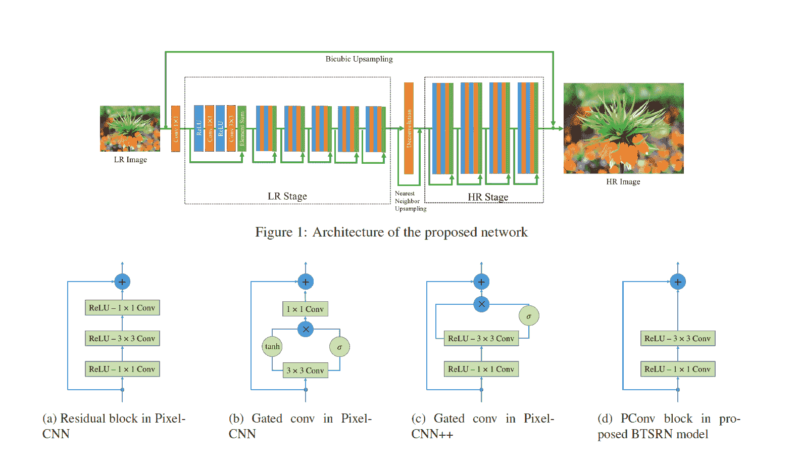

[Source](https://openaccess.thecvf.com/content_cvpr_2017_workshops/w12/papers/Fan_Balanced_Two-Stage_Residual_CVPR_2017_paper.pdf)

从上图可以看出，BTSRN 由两个阶段组成:低分辨率(LR)阶段和高分辨率(HR)阶段。LR 级由 6 个残余块组成，而 HR 级包含 4 个残余块。HR 阶段的卷积比 LR 阶段需要更多的计算，因为输入尺寸更大。两个阶段中的块的数量以这样一种方式确定，即实现精度和性能之间的折衷。

LR 级的输出在被发送到 HR 级之前被上采样。这是通过添加去卷积层和最近邻 USP 采样的输出来完成的。

作者提出了一种新的残差块，命名为 *PConv* ，如上图 *(d)* 所示。基于该结果，所提出的块实现了精度和性能之间的良好平衡。

与 EDSR 类似，避免批量标准化以防止重新居中和重新缩放，因为发现这是有害的。这是因为超分辨率是一项回归任务，因此目标输出与输入的一阶统计量高度相关。

### 递归网络

递归网络在卷积层中使用共享网络参数来减少内存占用，如上文 CARN-M 所示。让我们再讨论几个涉及递归单元的架构。

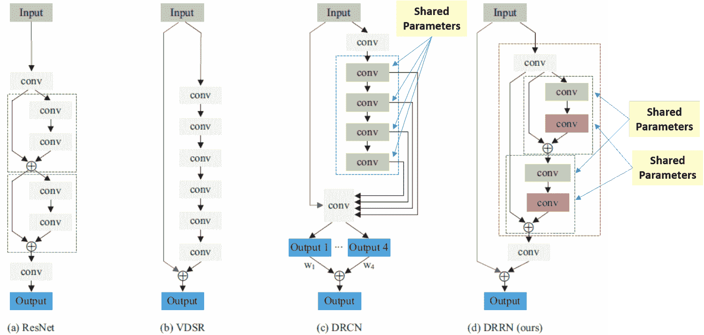

[Source](https://arxiv.org/pdf/1808.03344.pdf)

#### DRCN

深度递归卷积网络(DRCN)涉及多次应用相同的卷积层。从上图可以看出，残差块中的卷积层是共享的。

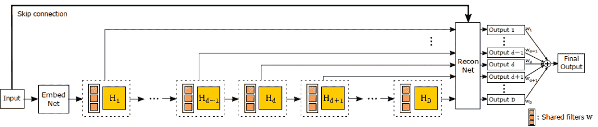

[Source](https://arxiv.org/pdf/1511.04491.pdf)

所有中间共享卷积块的输出与输入一起被发送到重建层，该层使用所有输入生成高分辨率图像。因为有多个输入用于产生输出，所以这种架构可以被认为是网络的集合。

#### DRRN

深度递归残差网络(DRRN)是对 DRCN 的改进，通过在简单卷积层上的网络中具有残差块。每个残差块中的参数都与其他残差块共享，如上图所示。

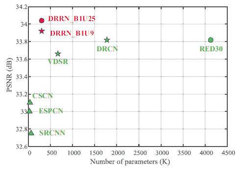

[Source](https://arxiv.org/pdf/1808.03344.pdf)

如图所示，在参数数量相当的情况下，DRRN 的性能优于 SRCNN、ESPCN、VDSR 和 DRCN。

### 渐进重建网络

CNN 通常在单个镜头中给出输出，但是对于神经网络来说，获得具有大比例因子(比如 8 倍)的高分辨率图像是一项艰巨的任务。为了解决这个问题，一些网络架构逐步提高图像的分辨率。现在让我们讨论几个遵循这种风格的网络。

#### 拉普森

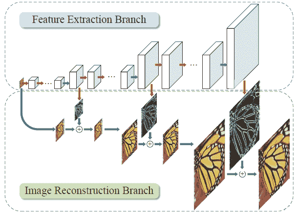

[Source](https://arxiv.org/abs/1710.01992)

LAPSRN 或 MS-LAPSRN 由拉普拉斯金字塔结构组成，它可以使用逐步方法将图像放大到 2x、4x 和 8x。

从上图可以看出，LAPSRN 由多个阶段组成。该网络包括两个分支:特征提取分支和图像重建分支。每个迭代阶段由特征嵌入块和特征上采样块组成，如下图所示。输入图像通过特征嵌入层以提取低分辨率空间中的特征，然后使用转置卷积对其进行上采样。学习的输出是残差图像，其被添加到插值输入以获得高分辨率图像。特征上采样块的输出也被传递到下一级，该下一级用于细化该级的高分辨率输出并将其缩放到下一级。由于较低分辨率的输出用于细化进一步的阶段，因此存在共享学习，这有助于网络更好地执行。

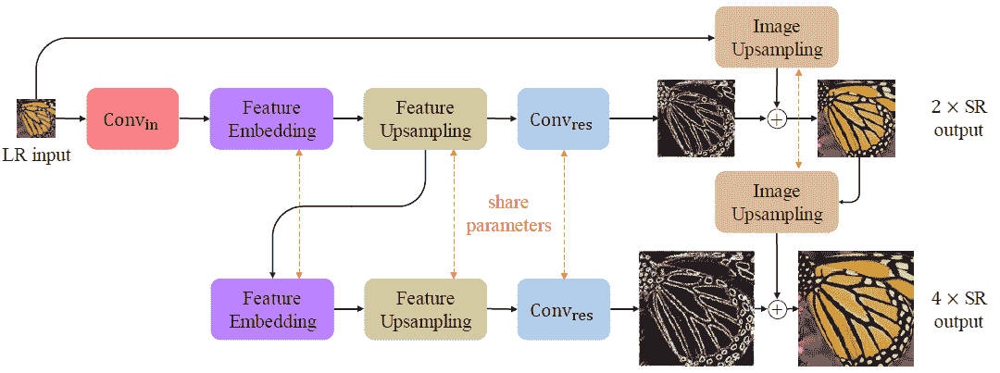

[Source](https://arxiv.org/abs/1710.01992)

为了减少网络的内存占用，特征嵌入、特征上采样等中的参数。被递归地跨阶段共享。

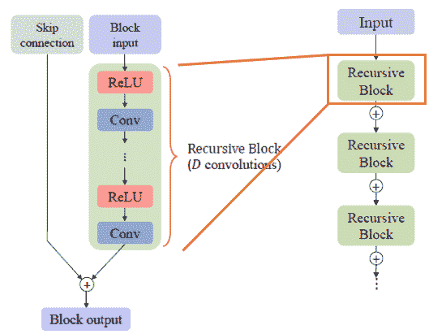

[Source](https://arxiv.org/abs/1710.01992)

在特征嵌入块中，单独的残差块由共享的卷积参数组成(如上图所示),以进一步减少参数的数量。

作者认为，由于每个 LR 输入可以有多个 HR 表示，L2 损失函数在所有表示上产生平滑的输出，从而使图像看起来不清晰。为了处理这个问题，使用了 Charbonnier 损失函数，它可以更好地处理异常值。

### 多分支网络

到目前为止，我们已经看到了一个趋势:更深的网络会带来更好的结果。但是由于信息流的问题，训练更深层次的网络是困难的。残余网络通过使用快捷连接在一定程度上解决了这个问题。多分支网络通过具有多个信息可以通过的分支来改善信息流，从而导致来自多个感受野的信息的融合，并因此得到更好的训练。让我们讨论几个采用这种技术的网络。

#### CMSC

与其他超分辨率框架一样，级联多尺度交叉网络(CMSC)有一个特征提取层、级联子网和一个重建层，如下所示。

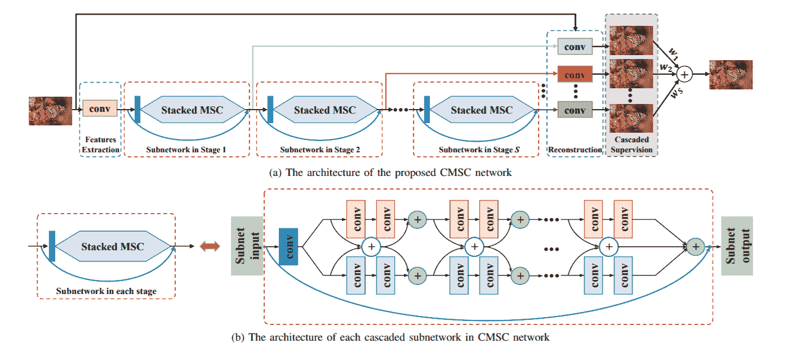

[Source](https://arxiv.org/pdf/1802.08808.pdf)

级联子网络由两个分支组成，如 *(b)* 所示。每个分支有不同大小的过滤器，因此导致不同的感受野。来自模块中不同感受野的信息融合导致更好的信息流。MSC 的多个块被一个接一个地堆叠，以迭代地逐渐减小输出和 HR 图像之间的差异。所有模块的输出一起传递到重构模块，以获得最终的 HR 输出。

#### IDN

信息蒸馏网络(IDN)被提出用于实现超分辨率任务的快速和准确的结果。像其他多分支网络一样，IDN 利用多个分支的能力来改善深层网络中的信息流。

IDN 架构由执行特征提取的 FBlock、多个数据块和执行转置卷积以实现学习放大的 RBlock 组成。本文的贡献在于数据块，它由两个单元组成:增强单元和压缩单元。

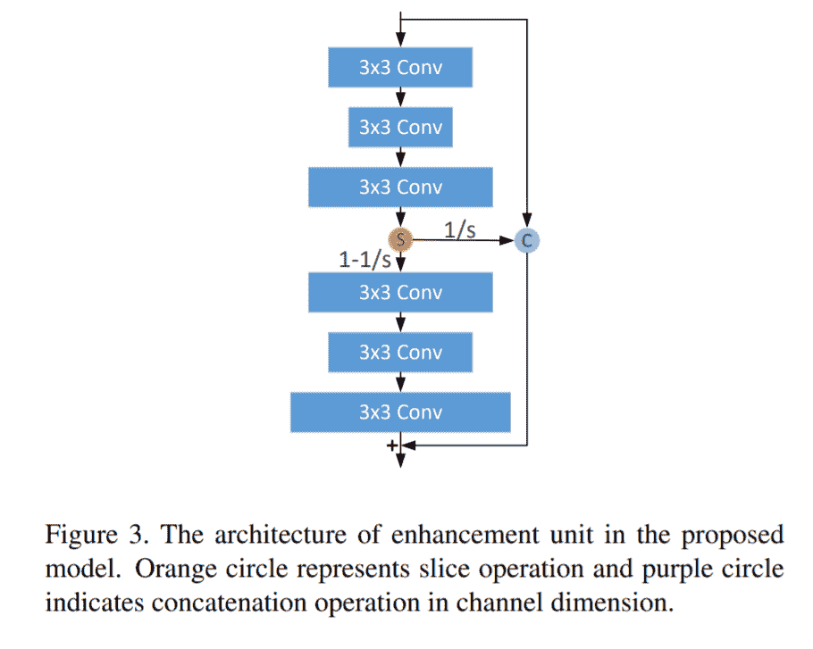

Source

增强单元的结构如上图所示。输入通过三个大小为 3×3 的卷积滤波器，然后进行限幅。切片的一部分与初始输入连接，通过快捷连接传递到最终层。剩余的切片通过另一组大小为 3×3 的卷积滤波器。通过将输入和最终层相加产生最终输出。具有这种结构有助于同时捕获短程信息和远程信息。

压缩单元获取增强单元的输出，并将其通过 1×1 卷积滤波器，以压缩(或减少)通道数量。

### 基于注意力的网络

到目前为止讨论的网络给予所有空间位置和渠道同等的重要性。一般来说，有选择地关注图像中的不同区域可以得到更好的结果。我们现在将讨论几个有助于实现这一目标的体系结构。

#### 挑选

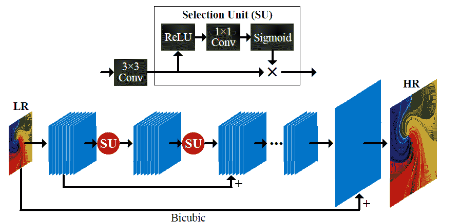

[Source](https://arxiv.org/ftp/arxiv/papers/1904/1904.02358.pdf)

SelNet 提出了一种在卷积块末端的新型选择单元，它有助于决定有选择地传递哪些信息。选择模块由 ReLu 激活、1×1 卷积和 sigmoid 门控组成。选择单元是选择模块和身份连接的乘积。

子像素层(类似于 ESPCN)被保持在网络的末端，以实现学习的放大。网络学习残差 HR 图像，然后将其添加到插值输入中，以获得最终的 HR 图像。

#### RCAN

通过这篇文章，我们观察到拥有更深的网络可以提高性能。为了训练更深的网络，剩余渠道注意力网络(RCAN)建议使用渠道注意力的 RIR 模块。让我们更详细地讨论这些。

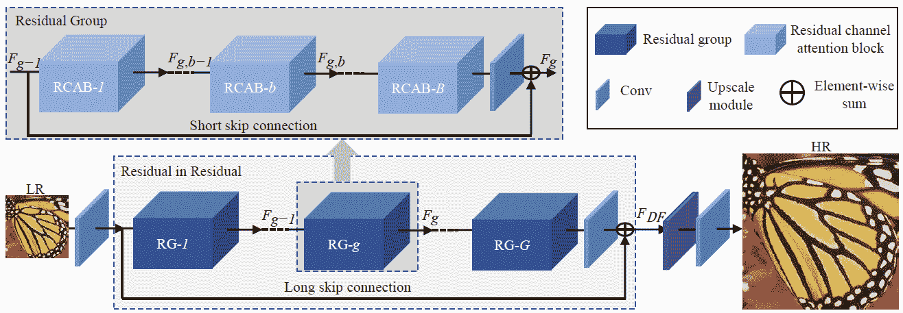

[Source](https://arxiv.org/abs/1807.02758)

RCAN 中的输入通过单个卷积滤波器进行特征提取，然后通过长跳跃连接绕过最终层。添加长跳跃连接以承载来自 LR 图像的低频信号，而主网络(即 RIR)专注于捕捉高频信息。

RIR 由多个 RG 嵌段组成，每个嵌段都具有上图所示的结构。每个 RG 模块都有多个 RCAB 模块以及一个跳接连接，称为短跳接连接，以帮助传输低频信号。


[Source](https://arxiv.org/abs/1807.02758)

RCAB 有一个由 GAP 模块组成的结构(如上图)来实现通道注意力，类似于 [SqueezeNet](https://blog.paperspace.com/popular-deep-learning-architectures-resnet-inceptionv3-squeezenet/) 中的 Squeeze 和 Excite 块。信道方式的注意力与来自卷积块的 sigmoid 门控功能的输出相乘。然后将该输出添加到快捷输入连接中，以获得 RCAB 模块的最终输出值。

### 生成模型

到目前为止讨论的网络优化了预测和输出 HR 图像之间的像素差异。尽管这种度量很好，但并不理想；人类不是通过像素差异来区分图像，而是通过感知质量。生成模型(或 gan)试图优化感知质量，以产生人眼愉悦的图像。最后，我们来看几个与 GAN 相关的架构。

#### 斯尔甘

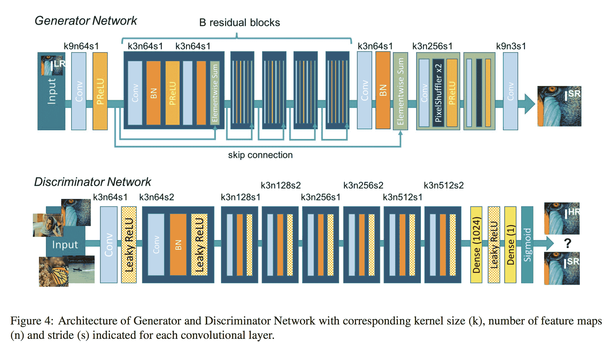

[Source](https://arxiv.org/abs/1609.04802)

SRGAN 使用基于 GAN 的架构来生成视觉上令人愉悦的图像。它使用 SRResnet 网络架构作为后端，并使用多任务丢失来优化结果。损失由三项组成:

1.  MSE 损失捕捉像素相似性
2.  感知相似性损失，其用于通过使用深层网络来捕获高级信息
3.  歧视者的对抗性损失

尽管所获得的结果具有相对较低的 PSNR 值，但是该模型实现了更多的 MOS，即结果中更好的感知质量。

#### 增强型网络

EnhanceNet 使用带有残差学习的完全卷积网络，该网络在损失函数中使用了一个额外的项来捕捉更精细的纹理信息。除了上述 SRGAN 中的损失，类似于[风格转换](https://blog.paperspace.com/creating-your-own-style-transfer-mirror/)中的纹理损失被用于捕捉更精细的纹理信息。

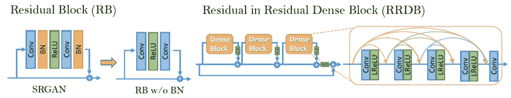

[Source](https://arxiv.org/abs/1809.00219)

#### extran

ESRGAN 在 SRGAN 的基础上增加了一个相对论鉴别器。其优势在于，网络经过训练，不仅可以分辨出哪个图像是真的还是假的，还可以让真实的图像看起来比生成的图像更不真实，从而有助于欺骗鉴别者。SRGAN 中的批处理规范化也被删除，密集块(灵感来自 [DenseNet](https://blog.paperspace.com/popular-deep-learning-architectures-densenet-mnasnet-shufflenet/) )被用于更好的信息流。这些致密的块体被称为 RRDB。

## 资料组

以下是一些用于训练超分辨率网络的常用数据集。

1.  **[DIV2K](https://data.vision.ee.ethz.ch/cvl/DIV2K/) :** 800 次训练，100 次验证，100 次测试。提供 2K 分辨率图像，包括具有 2 倍、3 倍和 4 倍缩减系数的高分辨率和低分辨率图像。在 NTIRE17 挑战赛中提出。
2.  **[Flickr2K](https://github.com/LimBee/NTIRE2017) :** 来自 Flickr 的 2650 张 2K 图片。
3.  **[滑铁卢](https://ece.uwaterloo.ca/~k29ma/exploration/) :** 滑铁卢探索数据库包含了 4744 张原始的自然图像和 94880 张由它们创建的扭曲图像。

## 损失函数

在这一节中，我们将讨论可以用来训练网络的各种损失函数。

1.  **像素损失:**这是在训练超分辨率网络中使用的最简单和最常见的损失函数类型。L2、L1 或一些差异度量被用来评估模型。像素丢失的训练优化了 PSNR，但没有直接优化感知质量，因此生成的图像可能不符合人眼的要求。
2.  **感知损失:**感知损失试图将生成图像中的高级特征与给定的 HR 输出图像进行匹配。这是通过采用预先训练的网络，如 VGG，并使用预测和输出图像之间的特征输出的差异作为损失来实现的。SRGAN 中引入了这个损失函数。
3.  夏邦尼尔损失:该损失函数用于 LapSRN，而不是通用的 L2 损失。结果表明，与通常更平滑的 L2 损失相比，夏邦尼尔损失更好地处理异常值并产生更清晰的图像。
4.  **纹理损失:**在 EnhanceNet 中引入，这个损失函数试图优化特征输出的 Gram 矩阵，其灵感来自于风格转移损失函数。该损失函数训练网络来捕捉 HR 图像中的纹理信息。
5.  **对抗损失:**在所有 GAN 相关架构中使用，对抗损失有助于欺骗鉴别器，并且通常产生具有更好感知质量的图像。ESRGAN 通过使用相对论鉴别器增加了一个额外的变体，从而指示网络不仅使假图像更真实，而且使真实图像看起来更假。

## 韵律学

在本节中，我们将讨论用于比较各种模型性能的各种指标。

1.  **PSNR:** 峰值信噪比是确定结果质量最常用的技术。可以使用下面的公式从 MSE 直接计算，其中 *L* 是可能的最大像素值(8 位图像为 255)。

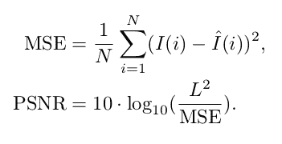

2. **SSIM:** 该指标用于使用以下公式比较两幅图像的感知质量，两幅图像的平均值($\mu$)、方差($\sigma$)和相关性( *c* )。


[Source](https://en.wikipedia.org/wiki/Structural_similarity)

3. **MOS:** 平均意见得分是一种手动确定模型结果的方法，要求人们在 0 到 5 之间对图像进行评分。将结果汇总，并将平均结果用作衡量标准。

* * *

此时你可能会想:


[Source](https://memegenerator.net/img/instances/62993083/show-me-the-code.jpg)

让我们编写一个到目前为止我们已经讨论过的流行架构，ESPCN。

```py
inputs = keras.Input(shape=(None, None, 1))
conv1 = layers.Conv2D(64, 5, activation="tanh", padding="same")(inputs)
conv2 = layers.Conv2D(32, 3, activation="tanh", padding="same")(conv1)
conv3 = layers.Conv2D((upscale_factor*upscale_factor), 3, activation="sigmoid", padding="same")(conv2)
outputs = tf.nn.depth_to_space(conv3, upscale_factor, data_format='NHWC')
model = Model(inputs=inputs, outputs=outputs) 
```

众所周知，ESPCN 由用于特征提取的卷积层和用于上采样的亚像素卷积组成。我们使用 TensorFlow `depth_to_space`函数来执行亚像素卷积。

```py
def gen_dataset(filenames, scale):
    # The model trains on 17x17 patches
    crop_size_lr = 17
    crop_size_hr = 17 * scale

    for p in filenames:
        image_decoded = cv2.imread("Training/DIV2K_train_HR/"+p.decode(), 3).astype(np.float32) / 255.0
        imgYCC = cv2.cvtColor(image_decoded, cv2.COLOR_BGR2YCrCb)
        cropped = imgYCC[0:(imgYCC.shape[0] - (imgYCC.shape[0] % scale)),
                  0:(imgYCC.shape[1] - (imgYCC.shape[1] % scale)), :]
        lr = cv2.resize(cropped, (int(cropped.shape[1] / scale), int(cropped.shape[0] / scale)),
                        interpolation=cv2.INTER_CUBIC)

        hr_y = imgYCC[:, :, 0]
        lr_y = lr[:, :, 0]

        numx = int(lr.shape[0] / crop_size_lr)
        numy = int(lr.shape[1] / crop_size_lr)
        for i in range(0, numx):
            startx = i * crop_size_lr
            endx = (i * crop_size_lr) + crop_size_lr
            startx_hr = i * crop_size_hr
            endx_hr = (i * crop_size_hr) + crop_size_hr
            for j in range(0, numy):
                starty = j * crop_size_lr
                endy = (j * crop_size_lr) + crop_size_lr
                starty_hr = j * crop_size_hr
                endy_hr = (j * crop_size_hr) + crop_size_hr

                crop_lr = lr_y[startx:endx, starty:endy]
                crop_hr = hr_y[startx_hr:endx_hr, starty_hr:endy_hr]

                hr = crop_hr.reshape((crop_size_hr, crop_size_hr, 1))
                lr = crop_lr.reshape((crop_size_lr, crop_size_lr, 1))
                yield lr, hr 
```

我们将使用 DIV2K 数据集来训练模型。我们将 2k 分辨率的图像分割成 17×17 的小块，作为训练的模型输入。作者将 RGB 图像转换为 YCrCb 格式，然后使用 ESPCN 放大 Y 通道输入。使用双三次插值对 Cr 和 Cb 通道进行放大，并将所有放大的通道拼接在一起，以获得最终的 HR 图像。因此，在训练时，我们只需要向模型提供低分辨率数据和高分辨率图像的 Y 通道。

完整的代码可以在 [Gradient Community (Jupyter)笔记本](https://ml-showcase.paperspace.com/projects/image-super-resolution)上免费运行。

## 摘要

在本文中，我们讨论了什么是超分辨率，它的应用，超分辨率算法的分类，以及它们的优点和局限性。然后，我们查看了一些公开可用的数据集，以及可以使用的不同类型的损失函数和指标。最后，我们浏览了 ESPCN 架构的代码。

如果你想继续学习超分辨率，我推荐[这个 repo](https://github.com/ChaofWang/Awesome-Super-Resolution) ，它包括一个研究论文的集合和它们相应代码的链接。