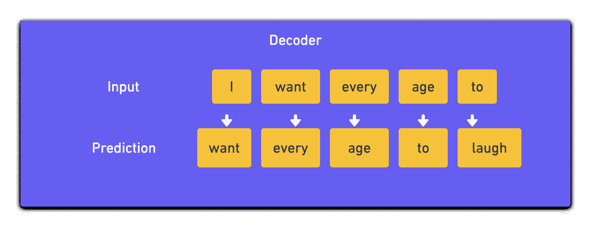
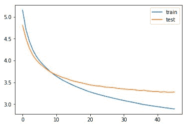

# 基于 Keras 的‍Implementing Seq2Seq 文本摘要模型

> 原文：<https://blog.paperspace.com/implement-seq2seq-for-text-summarization-keras/>

到目前为止，我们已经在这个两部分系列的第 1 部分中介绍了以下内容:

*   Seq2Seq 型号介绍
*   Seq2Seq 架构和应用
*   使用编码器-解码器序列到序列模型的文本摘要
    *   步骤 1 -导入数据集
    *   步骤 2 -清理数据
    *   步骤 3 -确定最大允许序列长度
    *   步骤 4 -选择合理的文本和摘要
    *   步骤 5 -标记文本
    *   步骤 6 -删除空文本和摘要

在本教程中，我们将涵盖这个系列的第二部分编码器-解码器序列到序列的 RNNs:如何建立，训练和测试我们的 seq2seq 模型使用 Keras 的文本摘要。

不要忘记，你可以跟随本系列的所有代码，并从[Gradient Community Notebook](https://ml-showcase.paperspace.com/projects/text-summarization-with-seq2seq-models)在一个免费的 GPU 上运行它。

我们继续吧！

## 步骤 7:创建模型

首先，导入所有必需的库。

```py
from tensorflow.keras.preprocessing.text import Tokenizer
from tensorflow.keras.preprocessing.sequence import pad_sequences
from tensorflow.keras.layers import Input, LSTM, Embedding, Dense, \
    Concatenate, TimeDistributed
from tensorflow.keras.models import Model
from tensorflow.keras.callbacks import EarlyStopping
```

接下来，定义编码器和解码器网络。

#### 编码器

编码器接受的输入长度等于您已经在[步骤 3](https://blog.paperspace.com/introduction-to-seq2seq-models/) 中估算的最大文本长度。然后，这被给予尺寸为`(total number of words captured in the text vocabulary) x (number of nodes in an embedding layer)`(在[步骤 5](https://blog.paperspace.com/introduction-to-seq2seq-models/) 中计算)的嵌入层；`x_voc`变量)。接下来是三个 LSTM 网络，其中每一层返回 LSTM 输出，以及在先前时间步骤观察到的隐藏和单元状态。

#### 解码器

在解码器中，定义了嵌入层，随后是 LSTM 网络。LSTM 网络的初始状态是从编码器获取的最后的隐藏和单元状态。LSTM 的输出被提供给被时间分布层包裹的密集层，该时间分布层具有附加的 softmax 激活功能。

总之，模型接受编码器(文本)和解码器(摘要)作为输入，并输出摘要。预测是通过从摘要的前一个单词预测摘要的下一个单词来进行的(见下图)。



Consider the summary line to be “I want every age to laugh”. The model has to accept two inputs - the actual text and the summary. During the training phase, the decoder accepts the input summary given to the model, and learns every word that has to follow a certain given word. It then generates the predictions using an inference model during the test phase.

添加以下代码来定义您的网络体系结构。

```py
latent_dim = 300
embedding_dim = 200

# Encoder
encoder_inputs = Input(shape=(max_text_len, ))

# Embedding layer
enc_emb = Embedding(x_voc, embedding_dim,
                    trainable=True)(encoder_inputs)

# Encoder LSTM 1
encoder_lstm1 = LSTM(latent_dim, return_sequences=True,
                     return_state=True, dropout=0.4,
                     recurrent_dropout=0.4)
(encoder_output1, state_h1, state_c1) = encoder_lstm1(enc_emb)

# Encoder LSTM 2
encoder_lstm2 = LSTM(latent_dim, return_sequences=True,
                     return_state=True, dropout=0.4,
                     recurrent_dropout=0.4)
(encoder_output2, state_h2, state_c2) = encoder_lstm2(encoder_output1)

# Encoder LSTM 3
encoder_lstm3 = LSTM(latent_dim, return_state=True,
                     return_sequences=True, dropout=0.4,
                     recurrent_dropout=0.4)
(encoder_outputs, state_h, state_c) = encoder_lstm3(encoder_output2)

# Set up the decoder, using encoder_states as the initial state
decoder_inputs = Input(shape=(None, ))

# Embedding layer
dec_emb_layer = Embedding(y_voc, embedding_dim, trainable=True)
dec_emb = dec_emb_layer(decoder_inputs)

# Decoder LSTM
decoder_lstm = LSTM(latent_dim, return_sequences=True,
                    return_state=True, dropout=0.4,
                    recurrent_dropout=0.2)
(decoder_outputs, decoder_fwd_state, decoder_back_state) = \
    decoder_lstm(dec_emb, initial_state=[state_h, state_c])

# Dense layer
decoder_dense = TimeDistributed(Dense(y_voc, activation='softmax'))
decoder_outputs = decoder_dense(decoder_outputs)

# Define the model
model = Model([encoder_inputs, decoder_inputs], decoder_outputs)

model.summary() 
```

```py
# Output
Model: "model"
__________________________________________________________________________________________________
Layer (type)                    Output Shape         Param #     Connected to                     
==================================================================================================
input_1 (InputLayer)            [(None, 100)]        0                                            
__________________________________________________________________________________________________
embedding (Embedding)           (None, 100, 200)     5927600     input_1[0][0]                    
__________________________________________________________________________________________________
lstm (LSTM)                     [(None, 100, 300), ( 601200      embedding[0][0]                  
__________________________________________________________________________________________________
input_2 (InputLayer)            [(None, None)]       0                                            
__________________________________________________________________________________________________
lstm_1 (LSTM)                   [(None, 100, 300), ( 721200      lstm[0][0]                       
__________________________________________________________________________________________________
embedding_1 (Embedding)         (None, None, 200)    2576600     input_2[0][0]                    
__________________________________________________________________________________________________
lstm_2 (LSTM)                   [(None, 100, 300), ( 721200      lstm_1[0][0]                     
__________________________________________________________________________________________________
lstm_3 (LSTM)                   [(None, None, 300),  601200      embedding_1[0][0]                
                                                                 lstm_2[0][1]                     
                                                                 lstm_2[0][2]                     
__________________________________________________________________________________________________
time_distributed (TimeDistribut (None, None, 12883)  3877783     lstm_3[0][0]                     
==================================================================================================
Total params: 15,026,783
Trainable params: 15,026,783
Non-trainable params: 0
__________________________________________________________________________________________________ 
```

### 步骤 8:训练模型

在此步骤中，编译模型并定义`EarlyStopping`以在验证损失度量停止下降时停止训练模型。

```py
model.compile(optimizer='rmsprop', loss='sparse_categorical_crossentropy')

es = EarlyStopping(monitor='val_loss', mode='min', verbose=1, patience=2)
```

接下来，使用`model.fit()`方法拟合训练数据，您可以将批量定义为 128。发送文本和摘要(不包括摘要中的最后一个单词)作为输入，以及包含每个单词(从第二个单词开始)的重新整形的摘要张量作为输出(这解释了在给定前一个单词的情况下，将智能注入模型以预测单词)。此外，为了在训练阶段启用验证，也要发送验证数据。

```py
history = model.fit(
    [x_tr, y_tr[:, :-1]],
    y_tr.reshape(y_tr.shape[0], y_tr.shape[1], 1)[:, 1:],
    epochs=50,
    callbacks=[es],
    batch_size=128,
    validation_data=([x_val, y_val[:, :-1]],
                     y_val.reshape(y_val.shape[0], y_val.shape[1], 1)[:
                     , 1:]),
    )
```

```py
# Output
Train on 88513 samples, validate on 9835 samples
Epoch 1/50
88513/88513 [==============================] - 426s 5ms/sample - loss: 5.1520 - val_loss: 4.8026
Epoch 2/50
88513/88513 [==============================] - 412s 5ms/sample - loss: 4.7110 - val_loss: 4.5082
Epoch 3/50
88513/88513 [==============================] - 412s 5ms/sample - loss: 4.4448 - val_loss: 4.2815
Epoch 4/50
88513/88513 [==============================] - 411s 5ms/sample - loss: 4.2487 - val_loss: 4.1264
Epoch 5/50
88513/88513 [==============================] - 410s 5ms/sample - loss: 4.1049 - val_loss: 4.0170
Epoch 6/50
88513/88513 [==============================] - 411s 5ms/sample - loss: 3.9968 - val_loss: 3.9353
Epoch 7/50
88513/88513 [==============================] - 412s 5ms/sample - loss: 3.9086 - val_loss: 3.8695
Epoch 8/50
88513/88513 [==============================] - 411s 5ms/sample - loss: 3.8321 - val_loss: 3.8059
Epoch 9/50
88513/88513 [==============================] - 411s 5ms/sample - loss: 3.7598 - val_loss: 3.7517
Epoch 10/50
88513/88513 [==============================] - 410s 5ms/sample - loss: 3.6948 - val_loss: 3.7054
Epoch 11/50
88513/88513 [==============================] - 411s 5ms/sample - loss: 3.6408 - val_loss: 3.6701
Epoch 12/50
88513/88513 [==============================] - 410s 5ms/sample - loss: 3.5909 - val_loss: 3.6376
Epoch 13/50
88513/88513 [==============================] - 411s 5ms/sample - loss: 3.5451 - val_loss: 3.6075
Epoch 14/50
88513/88513 [==============================] - 412s 5ms/sample - loss: 3.5065 - val_loss: 3.5879
Epoch 15/50
88513/88513 [==============================] - 411s 5ms/sample - loss: 3.4690 - val_loss: 3.5552
Epoch 16/50
88513/88513 [==============================] - 409s 5ms/sample - loss: 3.4322 - val_loss: 3.5308
Epoch 17/50
88513/88513 [==============================] - 410s 5ms/sample - loss: 3.3981 - val_loss: 3.5123
Epoch 18/50
88513/88513 [==============================] - 409s 5ms/sample - loss: 3.3683 - val_loss: 3.4956
Epoch 19/50
88513/88513 [==============================] - 409s 5ms/sample - loss: 3.3379 - val_loss: 3.4787
Epoch 20/50
88513/88513 [==============================] - 409s 5ms/sample - loss: 3.3061 - val_loss: 3.4594
Epoch 21/50
88513/88513 [==============================] - 410s 5ms/sample - loss: 3.2803 - val_loss: 3.4412
Epoch 22/50
88513/88513 [==============================] - 409s 5ms/sample - loss: 3.2552 - val_loss: 3.4284
Epoch 23/50
88513/88513 [==============================] - 410s 5ms/sample - loss: 3.2337 - val_loss: 3.4168
Epoch 24/50
88513/88513 [==============================] - 410s 5ms/sample - loss: 3.2123 - val_loss: 3.4148
Epoch 25/50
88513/88513 [==============================] - 409s 5ms/sample - loss: 3.1924 - val_loss: 3.3974
Epoch 26/50
88513/88513 [==============================] - 410s 5ms/sample - loss: 3.1727 - val_loss: 3.3869
Epoch 27/50
88513/88513 [==============================] - 409s 5ms/sample - loss: 3.1546 - val_loss: 3.3853
Epoch 28/50
88513/88513 [==============================] - 408s 5ms/sample - loss: 3.1349 - val_loss: 3.3778
Epoch 29/50
88513/88513 [==============================] - 410s 5ms/sample - loss: 3.1188 - val_loss: 3.3637
Epoch 30/50
88513/88513 [==============================] - 410s 5ms/sample - loss: 3.1000 - val_loss: 3.3544
Epoch 31/50
88513/88513 [==============================] - 413s 5ms/sample - loss: 3.0844 - val_loss: 3.3481
Epoch 32/50
88513/88513 [==============================] - 411s 5ms/sample - loss: 3.0680 - val_loss: 3.3407
Epoch 33/50
88513/88513 [==============================] - 410s 5ms/sample - loss: 3.0531 - val_loss: 3.3374
Epoch 34/50
88513/88513 [==============================] - 410s 5ms/sample - loss: 3.0377 - val_loss: 3.3314
Epoch 35/50
88513/88513 [==============================] - 408s 5ms/sample - loss: 3.0214 - val_loss: 3.3186
Epoch 36/50
88513/88513 [==============================] - 409s 5ms/sample - loss: 3.0041 - val_loss: 3.3128
Epoch 37/50
88513/88513 [==============================] - 410s 5ms/sample - loss: 2.9900 - val_loss: 3.3195
Epoch 38/50
88513/88513 [==============================] - 407s 5ms/sample - loss: 2.9784 - val_loss: 3.3007
Epoch 39/50
88513/88513 [==============================] - 408s 5ms/sample - loss: 2.9655 - val_loss: 3.2975
Epoch 40/50
88513/88513 [==============================] - 410s 5ms/sample - loss: 2.9547 - val_loss: 3.2889
Epoch 41/50
88513/88513 [==============================] - 408s 5ms/sample - loss: 2.9424 - val_loss: 3.2923
Epoch 42/50
88513/88513 [==============================] - 409s 5ms/sample - loss: 2.9331 - val_loss: 3.2753
Epoch 43/50
88513/88513 [==============================] - 411s 5ms/sample - loss: 2.9196 - val_loss: 3.2847
Epoch 44/50
88513/88513 [==============================] - 409s 5ms/sample - loss: 2.9111 - val_loss: 3.2718
Epoch 45/50
50688/88513 [================>.............] - ETA: 2:48 - loss: 2.8809
```

接下来，绘制在培训阶段观察到的培训和验证损失指标。

```py
from matplotlib import pyplot

pyplot.plot(history.history['loss'], label='train')
pyplot.plot(history.history['val_loss'], label='test')
pyplot.legend()
pyplot.show()
```



Train and Validation Loss (Loss v/s Epoch)

### 步骤 9:生成预测

既然我们已经训练了模型，要从给定的文本片段生成摘要，首先将索引反向映射到单词(之前已经在*步骤 5* 中使用`texts_to_sequences`生成)。此外，将单词映射到 summaries 标记器中的索引，该标记器用于检测序列的开始和结束。

```py
reverse_target_word_index = y_tokenizer.index_word
reverse_source_word_index = x_tokenizer.index_word
target_word_index = y_tokenizer.word_index 
```

现在定义编码器和解码器推理模型，开始进行预测。使用`tensorflow.keras.Model()`对象创建您的推理模型。

编码器推理模型接受文本并返回从三个 LSTMs、隐藏和单元状态生成的输出。解码器推理模型接受序列标识符(sostok)的开始，并预测即将到来的单词，最终导致预测整个摘要。

添加以下代码来定义推理模型的架构。

```py
# Inference Models

# Encode the input sequence to get the feature vector
encoder_model = Model(inputs=encoder_inputs, outputs=[encoder_outputs,
                      state_h, state_c])

# Decoder setup

# Below tensors will hold the states of the previous time step
decoder_state_input_h = Input(shape=(latent_dim, ))
decoder_state_input_c = Input(shape=(latent_dim, ))
decoder_hidden_state_input = Input(shape=(max_text_len, latent_dim))

# Get the embeddings of the decoder sequence
dec_emb2 = dec_emb_layer(decoder_inputs)

# To predict the next word in the sequence, set the initial states to the states from the previous time step
(decoder_outputs2, state_h2, state_c2) = decoder_lstm(dec_emb2,
        initial_state=[decoder_state_input_h, decoder_state_input_c])

# A dense softmax layer to generate prob dist. over the target vocabulary
decoder_outputs2 = decoder_dense(decoder_outputs2)

# Final decoder model
decoder_model = Model([decoder_inputs] + [decoder_hidden_state_input,
                      decoder_state_input_h, decoder_state_input_c],
                      [decoder_outputs2] + [state_h2, state_c2])
```

现在定义一个函数`decode_sequence()`，它接受输入文本并输出预测的摘要。从`sostok`开始，继续生成单词，直到遇到`eostok`或者达到摘要的最大长度。通过选择具有最大附加概率的单词，从给定单词中预测即将到来的单词，并相应地更新解码器的内部状态。

```py
def decode_sequence(input_seq):

    # Encode the input as state vectors.
    (e_out, e_h, e_c) = encoder_model.predict(input_seq)

    # Generate empty target sequence of length 1
    target_seq = np.zeros((1, 1))

    # Populate the first word of target sequence with the start word.
    target_seq[0, 0] = target_word_index['sostok']

    stop_condition = False
    decoded_sentence = ''

    while not stop_condition:
        (output_tokens, h, c) = decoder_model.predict([target_seq]
                + [e_out, e_h, e_c])

        # Sample a token
        sampled_token_index = np.argmax(output_tokens[0, -1, :])
        sampled_token = reverse_target_word_index[sampled_token_index]

        if sampled_token != 'eostok':
            decoded_sentence += ' ' + sampled_token

        # Exit condition: either hit max length or find the stop word.
        if sampled_token == 'eostok' or len(decoded_sentence.split()) \
            >= max_summary_len - 1:
            stop_condition = True

        # Update the target sequence (of length 1)
        target_seq = np.zeros((1, 1))
        target_seq[0, 0] = sampled_token_index

        # Update internal states
        (e_h, e_c) = (h, c)

    return decoded_sentence
```

定义两个函数- `seq2summary()`和`seq2text()`，分别将数字表示转换为摘要和文本的字符串表示。

```py
# To convert sequence to summary
def seq2summary(input_seq):
    newString = ''
    for i in input_seq:
        if i != 0 and i != target_word_index['sostok'] and i \
            != target_word_index['eostok']:
            newString = newString + reverse_target_word_index[i] + ' '

    return newString

# To convert sequence to text
def seq2text(input_seq):
    newString = ''
    for i in input_seq:
        if i != 0:
            newString = newString + reverse_source_word_index[i] + ' '

    return newString
```

最后，通过发送文本来生成预测。

```py
for i in range(0, 19):
    print ('Review:', seq2text(x_tr[i]))
    print ('Original summary:', seq2summary(y_tr[i]))
    print ('Predicted summary:', decode_sequence(x_tr[i].reshape(1,
           max_text_len)))
    print '\n'
```

以下是 RNN 模型得出的一些值得注意的总结。

```py
# Output
Review: us president donald trump on wednesday said that north korea has returned the remains of 200 us troops missing from the korean war although there was no official confirmation from military authorities north korean leader kim jong un had agreed to return the remains during his summit with trump about 700 us troops remain unaccounted from the 1950 1953 korean war 
Original summary: start n korea has returned remains of 200 us war dead trump end 
Predicted summary:  start n korea has lost an war against us trump end

Review: pope francis has said that history will judge those who refuse to accept the science of climate change if someone is doubtful that climate change is true they should ask scientists the pope added notably us president donald trump who believes global warming is chinese conspiracy withdrew the country from the paris climate agreement 
Original summary: start history will judge those denying climate change pope end 
Predicted summary:  start pope francis will be in paris climate deal prez end

Review: the enforcement directorate ed has attached assets worth over ã¢â‚â¹33 500 crore in the over three year tenure of its chief karnal singh who retires sunday officials said the agency filed around 390 in connection with its money laundering probes during the period the government on saturday appointed indian revenue service irs officer sanjay kumar mishra as interim ed chief 
Original summary: start enforcement attached assets worth ã¢â‚â¹33 500 cr in yrs end 
Predicted summary:  start ed attaches assets worth 100 crore in india in days end

Review: lok janshakti party president ram vilas paswan daughter asha has said she will contest elections against him from constituency if given ticket from lalu prasad yadav rjd she accused him of neglecting her and promoting his son chirag asha is paswan daughter from his first wife while chirag is his son from his second wife 
Original summary: start will contest against father ram vilas from daughter end 
Predicted summary:  start lalu son tej pratap to contest his daughter in 2019 end

Review: irish deputy prime minister frances fitzgerald announced her resignation on tuesday in bid to avoid the collapse of the government and potential snap election she quit hours before no confidence motion was to be proposed against her by the main opposition party the political crisis began over fitzgerald role in police whistleblower scandal 
Original summary: start irish deputy prime minister resigns to avoid govt collapse end 
Predicted summary:  start pmo resigns from punjab to join nda end

Review: rr wicketkeeper batsman jos buttler slammed his fifth straight fifty in ipl 2018 on sunday to equal former indian cricketer virender sehwag record of most straight 50 scores in the ipl sehwag had achieved the feat while representing dd in the ipl 2012 buttler is also only the second batsman after shane watson to hit two successive 90 scores in ipl 
Original summary: start buttler equals sehwag record of most straight 50s in ipl end 
Predicted summary:  start sehwag slams sixes in an ipl over 100 times in ipl end

Review: maruti suzuki india on wednesday said it is recalling 640 units of its super carry mini trucks sold in the domestic market over possible defect in fuel pump supply the recall covers super carry units manufactured between january 20 and july 14 2018 the faulty parts in the affected vehicles will be replaced free of cost the automaker said n 
Original summary: start maruti recalls its mini trucks over fuel pump issue in india end 
Predicted summary:  start maruti suzuki recalls india over ã¢â‚â¹3 crore end

Review: the arrested lashkar e taiba let terrorist aamir ben has confessed to the national investigation agency that pakistani army provided him cover firing to infiltrate into india he further revealed that hafiz organisation ud dawah arranged for his training and that he was sent across india to carry out subversive activities in and outside kashmir 
Original summary: start pak helped me enter india arrested let terrorist to nia end 
Predicted summary:  start pak man who killed indian soldiers to enter kashmir end

Review: the 23 richest indians in the 500 member bloomberg billionaires index saw wealth erosion of 21 billion this year lakshmi mittal who controls the world largest steelmaker arcelormittal lost 5 6 billion or 29 of his net worth followed by sun pharma founder dilip shanghvi whose wealth declined 4 6 billion asia richest person mukesh ambani added 4 billion to his fortune 
Original summary: start lakshmi mittal lost 10 bn in 2018 ambani added 4 bn end 
Predicted summary:  start india richest man lost billion in wealth in 2017 end
```

## 结论

我们构建的编码器-解码器序列到序列模型(LSTM)根据它在训练文本中学习的内容生成了可接受的摘要。尽管在 50 个时代之后，预测的摘要与预期的摘要并不完全一致(我们的模型还没有达到人类水平的智能！)，我们的模型所获得的智能肯定是有价值的。

要从该模型中获得更准确的结果，您可以增加数据集的大小，调整网络的超参数，尝试使其更大，并增加历元的数量。

在本教程中，您已经训练了一个编码器-解码器序列到序列模型来执行文本摘要。在我的下一篇文章中，你可以学到所有关于注意力机制的知识。直到那时，快乐学习！

参考: [Sandeep Bhogaraju](https://www.kaggle.com/sandeepbhogaraju/text-summarization-with-seq2seq-model)