# 深度学习中的优化介绍:梯度下降

> 原文：<https://blog.paperspace.com/intro-to-optimization-in-deep-learning-gradient-descent/>

图片来源:奥赖利媒体

深度学习在很大程度上实际上是解决大量讨厌的优化问题。神经网络仅仅是一个非常复杂的函数，由数百万个参数组成，代表一个问题的数学解决方案。考虑图像分类的任务。AlexNet 是一个数学函数，它采用一个表示图像 RGB 值的数组，并以一组类分数的形式产生输出。

通过训练神经网络，我们基本上意味着我们正在最小化损失函数。这个损失函数的值为我们提供了在给定数据集上我们的网络性能离完美有多远的度量。

## 损失函数

为了简单起见，让我们假设我们的网络只有两个参数。实际上，这个数字大约是 10 亿，但是我们仍然会在整篇文章中坚持使用两个参数的例子，这样我们就不会在试图可视化事物的时候把自己逼疯。现在，一个非常好的损失函数的计数可能是这样的。

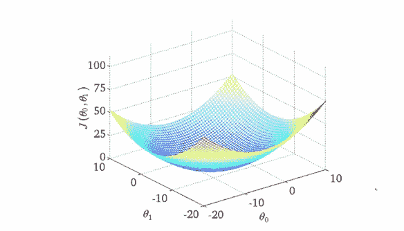

**损失函数的轮廓**

为什么我说一个*很好听的*损失函数？因为具有如上轮廓的损失函数就像圣诞老人一样，它不存在。然而，它仍然是一个不错的教学工具，可以让你全面了解梯度下降的一些最重要的观点。所以，让我们开始吧！

*x* 和 *y* 轴代表两个权重的值。 *z* 轴代表两个权重的特定值的损失函数值。我们的目标是找到损失最小的特定重量值。这种点被称为损失函数的最小值**。**

 **你在开始时已经随机初始化了权重，所以你的神经网络很可能表现得像喝醉了的你，把猫的图像归类为人类。这种情况对应于轮廓上的点 A，在该点处网络性能差，因此损耗高。

我们需要找到一种方法，以某种方式导航到“谷底”的 B 点，在那里损失函数有一个最小值？那么我们该怎么做呢？

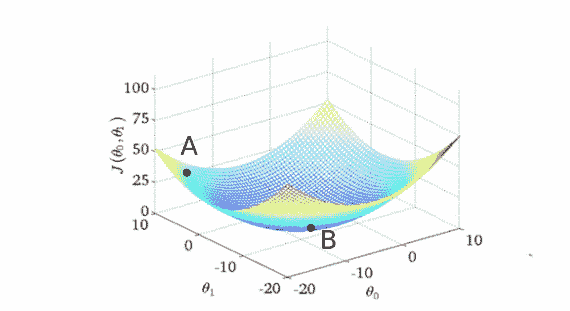

**梯度下降**

## 梯度下降

当我们初始化我们的权重时，我们在损失图中的 A 点。我们做的第一件事是在 x-y 平面的所有可能的方向中，检查**沿着哪个方向移动带来损失函数值**的最大下降。这是我们必须前进的方向。该方向由与梯度方向完全相反的方向给出。梯度，导数的更高维度的表亲，给了我们上升最快的方向。

要理解这一点，请考虑下图。在曲线的任意一点，我们可以定义一个与该点相切的平面。在更高的维度中，我们总是可以定义一个超平面，但现在让我们坚持 3-D。那么，我们可以在这个平面上有无限个方向。在这些方向中，恰好有一个方向会给我们函数上升最快的方向。这个方向是由梯度给出的。与之相反的方向是最陡下降的方向。这就是算法如何得到它的名字。我们沿着梯度的方向下降，因此，它被称为梯度下降。

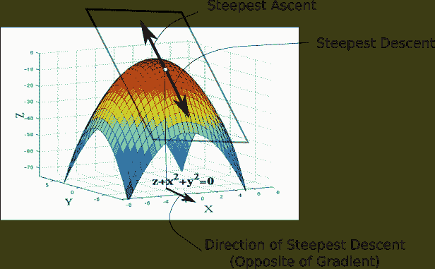

现在，一旦我们有了我们想要前进的方向，我们必须决定我们必须采取的步骤的大小。这一步的大小称为**学习速率**。我们必须仔细选择它，以确保我们能达到最低限度。

如果我们走得太快，我们可能会超过最小值，并继续沿着“谷”的脊反弹，永远不会达到最小值。走得太慢，训练可能会变得太长，根本不可行。即使事实并非如此，非常慢的学习速度会使算法更容易陷入极小值，这一点我们将在本文后面讨论。

一旦我们有了梯度和学习率，我们走一步，在我们结束的任何位置重新计算梯度，并重复这个过程。

虽然梯度的方向告诉我们哪个方向的上升最陡，但它的大小告诉我们最陡的上升/下降有多陡。所以，在最小值，轮廓几乎是平的，你会期望梯度几乎为零。事实上，对于极小点来说，它正好是零。

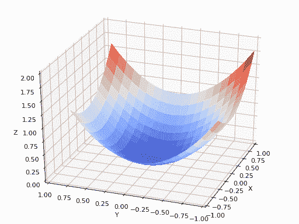

**动作中的梯度下降**

****

**使用过大的学习率**

实际上，我们可能永远不会*精确地*达到最小值，但是我们在极小值附近的平坦区域保持振荡。当我们在这个区域振荡时，损耗几乎是我们可以达到的最小值，并且不会改变太多，因为我们只是在实际最小值附近不断反弹。通常，当损失值在预先确定的次数内没有改善时，比如说 10 次或 20 次迭代，我们就停止迭代。当这样的事情发生时，我们说我们的训练已经收敛，或者说已经发生了收敛。

## 常见的错误

让我离题一下。如果你在谷歌上搜索梯度下降的可视化效果，你可能会看到一条从一个点开始并向一个极小点前进的轨迹，就像上面展示的动画一样。然而，这给了你一个非常不准确的梯度下降图。我们取的轨迹完全局限于 x-y 平面，这个平面包含了重量。

如上面的动画所示，梯度下降根本不涉及在 *z* 方向移动。这是因为只有权重是自由参数，由 *x* 和 *y* 方向描述。我们采用的实际轨迹在 x-y 平面中定义如下。

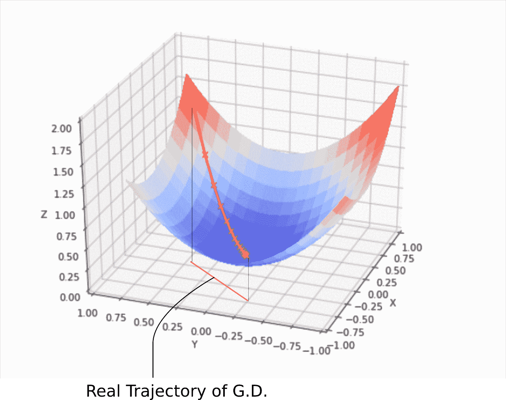

**真实梯度下降轨迹**

x-y 平面上的每个点代表一个唯一的权重组合，我们希望有一组由最小值描述的权重。

## 基本方程

描述梯度下降更新规则的基本方程是。

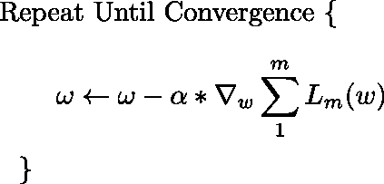

这种更新在每次迭代期间执行。这里， *w* 是位于 x-y 平面的权重向量。从这个向量中，我们减去损失函数相对于乘以*α*、**学习速率**的权重的梯度。梯度是一个矢量，它给出了损失函数上升最快的方向。最陡下降的方向是与梯度完全相反的方向，这就是为什么我们要从权重向量中减去梯度向量。

如果想象向量对你来说有点困难，那么几乎相同的更新规则同时应用于网络的每个权重。唯一的变化是，因为我们现在对每个权重单独执行更新，所以上面等式中的梯度被替换为梯度向量沿特定权重表示的方向的投影。

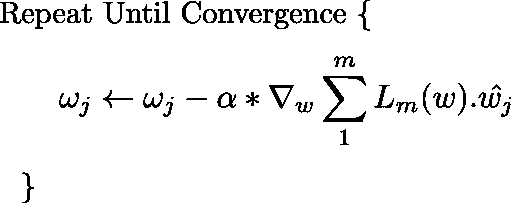

对所有权重同时进行这种更新。

在减法之前，我们用学习率乘以梯度向量。这代表了我们之前谈到的步骤。要意识到，即使我们保持学习速率不变，步长也会因梯度的大小而变化，而不是损失轮廓的陡度。当我们接近最小值时，梯度接近零，我们向最小值迈越来越小的步。

理论上，这是好的，因为我们希望算法在接近最小值时采取更小的步骤。步长太大可能导致它超过最小值并在最小值的脊之间反弹。

梯度下降中广泛使用的技术是具有可变的学习率，而不是固定的学习率。最初，我们可以负担较大的学习率。但是后来，当我们接近最小值时，我们想放慢速度。一种实现这种策略的方法被称为**模拟退火**，或衰减学习率。在这种情况下，学习率在每固定数量的迭代中衰减。

## 梯度下降的挑战#1:局部最小值

好吧，到目前为止，梯度下降的故事似乎是一个真正快乐的故事。好吧。让我来给你捣乱吧。还记得我说过我们的损失函数*很好看*吗，这样的损失函数并不真的存在？他们没有。

首先，神经网络是复杂的函数，在我们的假设函数中有许多非线性变换。最终的损失函数看起来不像一个漂亮的碗，只有一个我们可以收敛的最小值。事实上，这种漂亮的圣诞老人般的损失函数被称为**凸**函数(总是向上弯曲的函数)，深网的损失函数几乎不是凸的。事实上，它们可能是这样的。

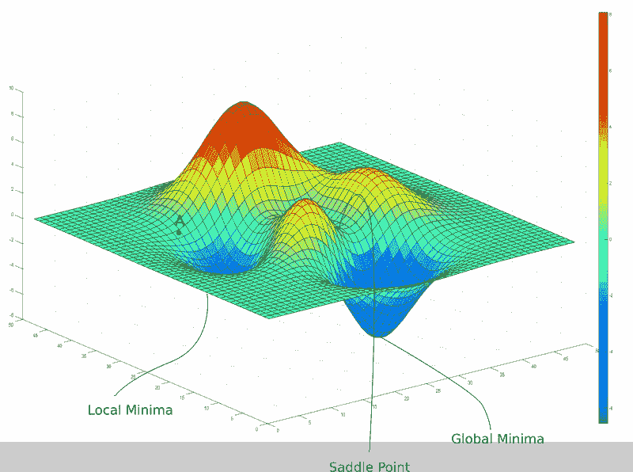

在上面的图像中，存在一个梯度为零的局部最小值。但是，我们知道它们并不是我们能达到的最低损失，这是全局极小值对应的点。现在，如果你在 A 点初始化你的权重，那么你将会收敛到局部极小值，一旦你收敛到局部极小值，梯度下降就不可能让你离开那里。

梯度下降是由梯度驱动的，梯度在任何最小值的底部为零。因为损失函数的值在局部区域中的该点是最小的，所以称为局部最小值。然而，全局最小值之所以被称为全局最小值，是因为损失函数的值在此处最小，在整个域上损失函数是全局的。

更糟糕的是，考虑到我们正在考虑的三维等高线实际上从未出现过，损失等高线甚至可能更加复杂。在实践中，我们的神经网络可能有大约 10 亿个权重，给我们一个大致(10 亿+ 1)维的函数。我甚至不知道那个数字中零的个数。

事实上，很难想象如此高维的函数。然而，鉴于目前深度学习领域的纯粹天赋，人们已经想出了在 3d 中可视化损失函数轮廓的方法。最近的一篇论文开创了一种称为**过滤归一化**的技术，解释了这超出了本文的范围。然而，它确实给了我们一个关于我们处理的损失函数的潜在复杂性的观点。例如，以下等值线是在 CIFAR-10 数据集上构建的 VGG-56 深度网络损失函数的损失等值线的三维表示。

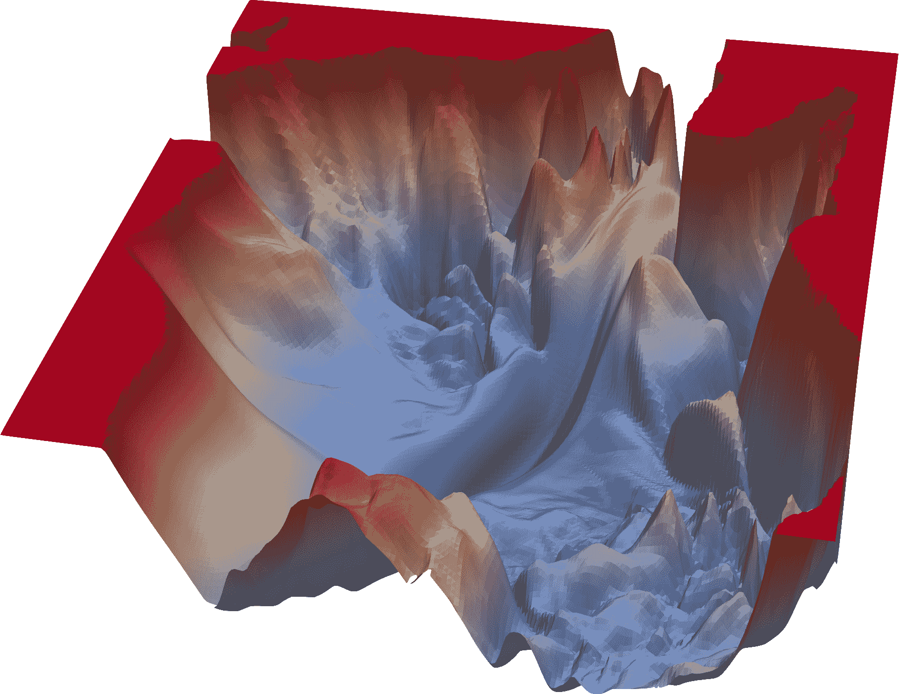

**一个复杂的失落景观** *图片来源:https://www.cs.umd.edu/~tomg/projects/landscapes/*

正如你所看到的，损失景观充满了当地的最小值。

## 梯度下降的挑战#2:鞍点

关于梯度下降的限制，我们得到的基本教训是，一旦它到达梯度为零的区域，不管最小值的质量如何，它几乎不可能逃脱。我们面临的另一个问题是鞍点，看起来像这样。

**一个鞍点**

你还可以在之前的图片中看到两座“山”交汇处的鞍点。

鞍点的名字来源于一匹马的马鞍，因为它很像它。虽然它在一个方向上是最小值( *x* )，但它在另一个方向上是局部最大值，如果轮廓在 x 方向上更平坦，GD 将在 y 方向上不断来回振荡，给我们一种已经收敛到最小值的错觉。

## 随机救援！

那么，我们如何摆脱局部最小值和鞍点，同时试图收敛到一个全局最小值。答案是随机性。

到目前为止，我们一直在使用损失函数进行梯度下降，该损失函数是通过对训练集的所有可能示例的损失求和而创建的。如果我们陷入局部极小值或鞍点，我们就被困住了。帮助 GD 避开这些的一个方法是使用所谓的随机梯度下降。

在随机梯度下降中，我们不是通过计算所有损失函数相加产生的损失函数的梯度来采取步骤，而是通过计算仅一个随机采样(无替换)实例的损失梯度来采取步骤。与随机选择每个样本的**随机梯度下降**相反，我们早期的方法在一个批次中处理所有样本，因此被称为**批次梯度下降。**

相应地修改更新规则。

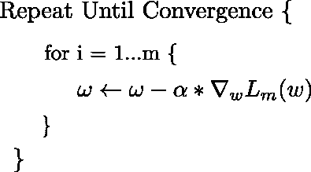

**更新随机梯度下降规则**

这意味着，在每一步，我们都要对一个损失函数求梯度，这个损失函数不同于我们实际的损失函数(它是每个例子损失的总和)。这种“单一实例损失”在某一特定点上的梯度实际上可能指向与“全部实例损失”的梯度略有不同的方向。

这也意味着，虽然“所有示例损失”的梯度可能会将我们推下局部最小值，或让我们卡在鞍点，但“一个示例损失”的梯度可能会指向不同的方向，并可能帮助我们避开这些。

人们也可以考虑一个点，它是“所有示例损失”的局部最小值。如果我们做批量梯度下降，我们会在这里卡住，因为梯度总是指向局部最小值。然而，如果我们使用随机梯度下降，这个点可能不在“一个例子损失”的损失轮廓中的局部最小值附近，允许我们远离它。

即使我们陷入了“一个示例损失”的最小值，下一个随机采样数据点的“一个示例损失”的损失前景可能会不同，这允许我们继续前进。

当它收敛时，它收敛到一个点，该点是几乎所有“单例损失”的最小值。它也显示了鞍点是非常不稳定的，轻轻一推就足以逃脱。

那么，这是否意味着在实践中，应该总是执行这种单示例随机梯度下降？

## 批量

答案是否定的。虽然从理论的角度来看，随机梯度下降可能会给我们最好的结果，但从计算的角度来看，这不是一个非常可行的选择。当我们使用通过对所有单个损失求和创建的损失函数执行梯度下降时，单个损失的梯度可以并行计算，而在随机梯度下降的情况下，必须一步一步地顺序计算。

所以，我们所做的是一个平衡的行为。我们使用固定数量的样本，比如 16 个、32 个或 128 个，形成所谓的小批量，而不是使用整个数据集，或者只是单个样本来构建我们的损失函数。该词与一次处理所有示例形成对比，通常称为批量梯度下降。选择小批量的大小，以确保我们获得足够的随机性来避免局部最小值，同时利用并行处理的足够计算能力。

## 局部极小再探:它们没有你想象的那么糟糕

在你反对局部最小值之前，最近的研究表明局部最小值并不必然是坏的。在神经网络的损失图中，有太多的最小值，一个“好的”局部最小值可能表现得和全局最小值一样好。

为什么我说“好”？因为你仍然可能陷入“坏的”局部极小值，这些极小值是由不稳定的训练样本产生的。在给定神经网络的高维损失函数的情况下,“好的”局部最小值，或者在文献中经常被称为最优局部最小值，可以以相当大的数量存在。

也可以注意到，许多神经网络执行分类。如果局部最小值对应于为正确的标签产生 0.7-0.8 之间的分数，而对于相同的例子，全局最小值为正确的标签产生 0.95-0.98 之间的分数，则两者的输出类别预测将是相同的。

最小值的一个理想属性应该是它应该在较平坦的一侧。为什么？因为平坦的最小值很容易收敛，所以很少有机会超过最小值，并在最小值的脊之间跳动。

更重要的是，我们希望测试集的损失面与我们进行训练的训练集略有不同。对于平坦和宽的最小值，损耗不会由于这种移动而改变太多，但是对于窄的最小值就不是这样了。我们试图说明的一点是，更平坦的极小值概括得更好，因此也更可取。

## 重新审视学习率

最近，关于学习率调度的研究激增，以解决损失景观中的次优最小值。即使学习率下降，也可能陷入局部极小值。传统上，要么在固定的迭代次数内完成训练，要么在损失没有改善的情况下，在比如说 10 次迭代之后停止训练。这在文学上被称为**提前停止**。

快速的学习速度也有助于我们在训练中更早地跳过局部最小值。

人们还将早期停止与学习速率衰减相结合，其中学习速率在每次损失在 10 次迭代后未能改善后衰减，最终在速率低于某个确定的阈值后停止。

近年来，循环学习率已经变得流行，其中学习率缓慢增加，然后降低，并且以循环方式继续。

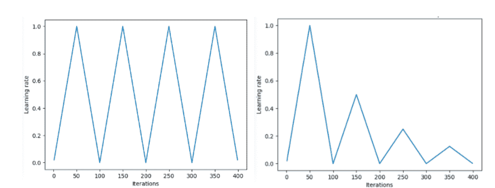

莱斯利·n·史密斯提出的循环学习率的“三角形”和“三角形 2”方法。在左图中，最小和最大 lr 保持不变。右边的差异在每个周期后减半。图片来源:Hafidz Zulkifli

一种叫做热重启随机梯度下降的方法基本上将学习速率退火到一个下限，然后将学习速率恢复到初始值。

对于学习率如何下降，我们也有不同的时间表，从指数衰减到余弦衰减。

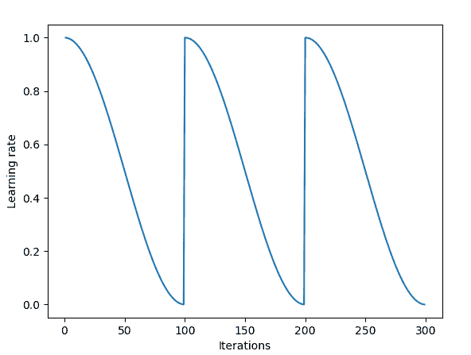

余弦退火结合重启

最近的一篇论文介绍了一种叫做**随机加权平均**的技术。作者开发了一种方法，其中他们首先收敛到最小值，缓存权重，然后将学习速率恢复到更高的值。这种更高的学习速率然后将算法从最小值推进到损失表面中的随机点。然后使算法再次收敛到另一个极小值。这样反复几次。最后，它们对所有缓存权重集做出的预测进行平均，以产生最终预测。

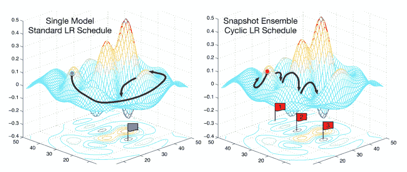

一种叫做随机加权平均的技术

## 结论

所以，这是关于梯度下降的介绍性帖子，自从关于反向传播的开创性论文表明你可以通过计算梯度来训练神经网络以来，梯度下降一直是深度学习优化的工作马。然而，还有一个关于梯度下降的缺失，我们在这篇文章中没有谈到，那就是解决病理弯曲的问题。传统随机梯度下降的扩展，如 Momentum、RMSProp 和 Adam 被用来克服这个重要问题。

然而，我认为我们所做的对于一个帖子来说已经足够了，其余的将在另一个帖子中涉及。

## 进一步阅读

[1。神经网络的视觉损失景观(论文)](https://arxiv.org/abs/1712.09913)

[2。Hafidz Zulkifli 的一篇关于学习进度的精彩文章。](https://towardsdatascience.com/understanding-learning-rates-and-how-it-improves-performance-in-deep-learning-d0d4059c1c10)

[3。随机加权平均(纸)](https://arxiv.org/abs/1704.00109)**