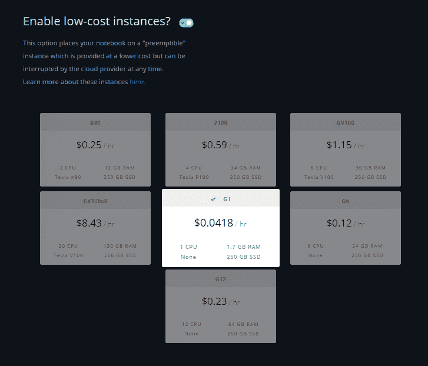

# 引入渐变低成本实例

> 原文：<https://blog.paperspace.com/introducing-gradient-low-cost-instances/>

构建公共云的首要目的是让公司能够大规模交付 web 应用。一晃十年过去了，如今云的用途远不止于此。已经出现的最令人兴奋的用例之一是利用云的巨大计算能力来运行高端工作负载，例如进行科学实验或训练深度神经网络。

这些应用程序的使用模式与传统的 web 服务有很大不同:它们的寿命很短，并且倾向于成批运行。为了应对这种新的行为，低优先级实例(通常称为“点实例”)的概念应运而生。低优先级实例本质上是云中的备用容量，以显著的折扣提供(与常规的按需价格相比)，但有一个警告，如果其他任务需要该容量，它们可能会被中断。

我们很高兴地宣布，Gradient 现在支持这类实例类型，我们称之为“低成本”实例。低成本实例的**折扣高达 65%** ，具体取决于实例类型。

要在低成本模式下运行**笔记本**或**作业**，只需在使用 CLI 时添加`--preemptible`或切换界面中的选项:

低成本实例的功能类似于普通实例，但在以下方面有所不同:

*   他们可以在任何时候被打断，甚至在开始的几分钟内。
*   它们总是在 24 小时后关闭，因此不适合长时间运行的作业。
*   它们不能迁移到常规虚拟机实例。

如果您的工作负载具有容错能力，能够承受可能的中断，那么梯度低成本实例非常适合，可以显著降低计算成本。例如，使用带有 [TensorFlow](https://www.tensorflow.org/guide/checkpoints) 和 [PyTorch](https://pytorch.org/tutorials/beginner/saving_loading_models.html) 的检查点，将使您能够在梯度低成本实例上训练深度学习模型，而没有丢失实例被中断之前所取得的进展的风险。

Create an account or sign in[Try Paperspace](https://www.paperspace.com/account/signup) [Sign in](https://www.paperspace.com/account/login)

关于渐变低成本实例的更多细节，请查看[帮助中心](https://support.paperspace.com/hc/en-us/articles/360015388374)。欲了解更多定价信息，请查看我们的[梯度定价页面](https://support.paperspace.com/hc/en-us/articles/360007742114-Gradient-Instance-Types)。

💗PS 工程团队