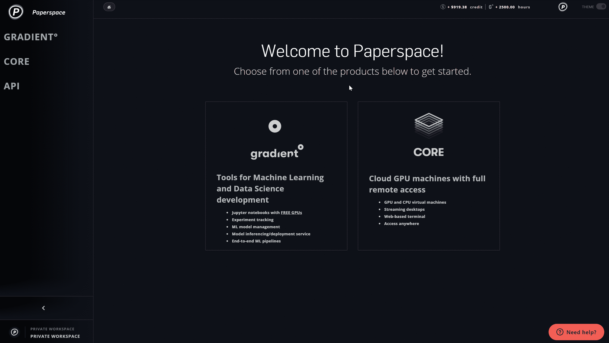
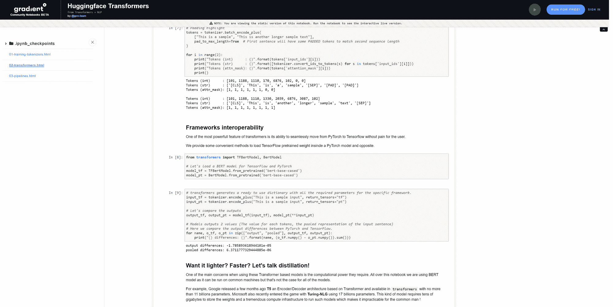
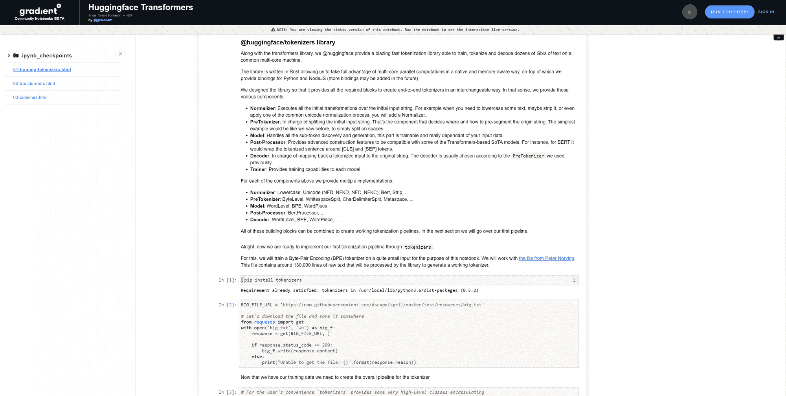
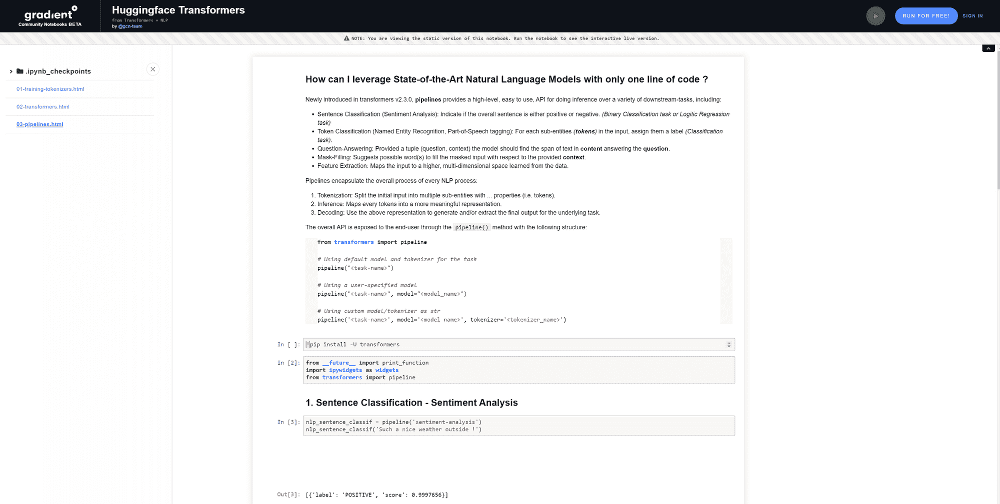

# 介绍 Paperspace +拥抱脸🤗

> 原文：<https://blog.paperspace.com/introducing-paperspace-hugging-face/>

我们很高兴地宣布与拥抱脸的新合作，为社区提供最先进的 NLP 工具。

查看[网络研讨会](https://www.youtube.com/watch?v=SUqi_E_Lyjs)，在免费的 GPU 上运行[新笔记本](https://ml-showcase.paperspace.com/projects/hugging-face)。

## 渐变+拥抱脸

新的 Transformers 容器使得在研究和生产中部署先进的 NLP 技术变得简单。所有依赖项都是预安装的，这意味着单个开发人员和团队可以立即投入运行，而没有工具或兼容性问题的压力。

ML Showcase 中提供的演示笔记本概述了如何使用这些库。

## 变形金刚图书馆

[Transformers](https://github.com/huggingface/transformers) 库为 TensorFlow 2.0 和 PyTorch 提供了最先进的 NLP。这是一个开源的、基于社区的库，用于培训、使用和共享基于 [Transformer 架构](https://arxiv.org/abs/1706.03762)的模型，包括 [BERT](https://arxiv.org/abs/1810.04805) 、 [RoBERTa](https://arxiv.org/abs/1907.11692) 、 [GPT2](https://cdn.openai.com/better-language-models/language_models_are_unsupervised_multitask_learners.pdf) 、 [XLNet](https://arxiv.org/abs/1906.08237) 等等。

除了模型本身，该库还包含许多下游任务的多个变体，如****【NER】******情感分析********语言建模********问答**** 等等。**

Transformers 库允许您从预先训练的大型语言模型中受益，而不需要昂贵的计算基础设施。在几行代码中加载和使用预先训练的模型，并在 PyTorch 或 Tensorflow 之间无缝移动模型。

## Tokenizers 库

Tokenizers 库提供了针对研究和生产优化的快速、先进的标记化。

在进入任何机器学习或深度学习自然语言处理模型之前，每个从业者都应该找到一种方法，将原始输入字符串映射到可训练模型可以理解的表示。有了 tokenizers 库，您可以以一种可互换的方式创建端到端的 Tokenizers。令人难以置信的快，这提供了在普通多核机器上训练、标记和解码每秒几十千兆字节的文本的能力。

## NLP 管道

transformers v2.3.0 中新引入的管道封装了每个 NLP 过程的整个过程。这些提供了一个高级的、易于使用的 API，用于对各种下游任务进行推理。

将来自每个库的工具放入上下文中，通过管道进行推理，包括**句子分类**(情感分析)**标记分类**、**问答**、**遮罩填充**和**特征提取**。

[https://www.youtube.com/embed/l3-X12JM8V4?feature=oembed](https://www.youtube.com/embed/l3-X12JM8V4?feature=oembed)

## 还会有更多

我们很自豪能为社区提供先进的 NLP 工具(毫不费力)。随着时间的推移，我们将通过为 Hugging Face 和 Gradient 上的其他行业标准库提供更多资源来扩展产品。

请在接下来的几个月中再次查看！