# 时间序列分析导论

> 原文：<https://blog.paperspace.com/introduction-time-series-analysis/>

时间序列分析和预测有许多应用:分析你的零售连锁店的销售，发现你的服务器流量的异常，预测股票市场，等等。

挖掘时间序列分析的方法多种多样。我们将通过以下主题进行介绍。

## 目录

*   时间序列的性质是什么？
    *   绘制滚动统计数据
    *   自相关
    *   偏自相关
    *   季节性
*   时间序列的平稳性
    *   平稳性测试
        *   ACF-PACF 图
        *   迪基富勒试验
        *   KPSS 试验
    *   平稳性的变换
        *   去趋势
        *   区别
*   结论

你可以从 [Gradient 社区笔记本](https://ml-showcase.paperspace.com/projects/time-series-analysis-and-forecasting)上免费运行这篇文章的完整代码。

在我们深入时间序列的细节之前，让我们准备数据集。

我们将使用德国耶拿的天气数据进行实验。您可以从 CLI 使用以下命令下载它。

```py
wget https://storage.googleapis.com/tensorflow/tf-keras-datasets/jena_climate_2009_2016.csv.zip
```

解压缩文件，你会发现 CSV 数据，你可以使用熊猫阅读。数据集记录了几个不同的天气参数。出于本教程的目的，我们将使用温度数据(摄氏度)。数据定期记录；超过 24 小时，间隔 10 分钟。

```py
import pandas as pd
import matplotlib.pyplot as plt

df = pd.read_csv('jena_climate_2009_2016.csv')

time = pd.to_datetime(df.pop('Date Time'), format='%d.%m.%Y %H:%M:%S')
series = df['T (degC)']
series.index = time

print(df)
```

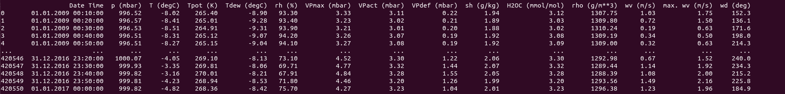

```py
series.plot()
plt.show()
```

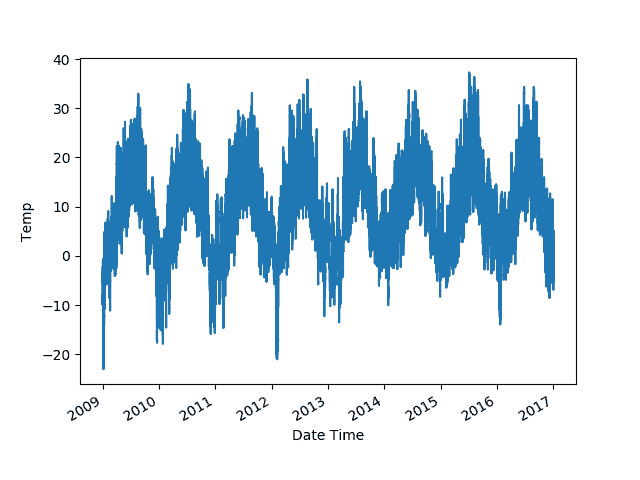

## 时间序列的性质是什么？

时间序列是按时间顺序进行的一系列观察。某个变量随时间变化，我们分析其中的模式，并尝试根据该序列在过去显示的变化进行预测。

需要注意时间序列的某些属性:

1.  **趋势:**一段时间内变量的总体上升或下降趋势。
2.  **季节性:**时间序列的周期性成分，其中某一模式每隔几个时间单位重复一次。
3.  **残差:**时间序列的噪声成分。

将一个时间序列分解成这些组成部分可以给我们提供大量的信息和对时间序列行为的洞察。

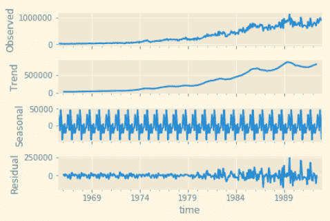

[Source](https://towardsdatascience.com/time-series-in-python-exponential-smoothing-and-arima-processes-2c67f2a52788)

### 滚动统计

开始理解一个时间序列的最好方法是可视化它的滚动统计。让我们以 2600(月度数据，即 30 天)为窗口绘制滚动统计数据。您还可以将滚动统计数据与数据集的平均值以及所有数据的最佳拟合线进行比较。

```py
import numpy as np

plt.plot(series.index, np.array([series.mean()] * len(series)))

x = np.arange(len(series))
y = series.values
m, c = np.polyfit(x, y, 1)

plt.plot(series.index, m*x + c)

series.rolling(3600).mean().plot()

plt.legend(['mean', 'regression line', 'rolling mean'])
plt.ylabel('Temp')
plt.show()

roll_std = series.rolling(3600).std()
roll_std.dropna(inplace=True)
plt.plot(roll_std.index, np.array([roll_std.mean()] * len(roll_std)))

x = np.arange(len(roll_std))
y = roll_std.values
m, c = np.polyfit(x, y, 1)

plt.plot(roll_std.index, m*x + c)

roll_std.plot()
plt.legend(['rolling std mean', 'rolling std regression', 'rolling std'])
plt.ylabel('Temp')
plt.show() 
```

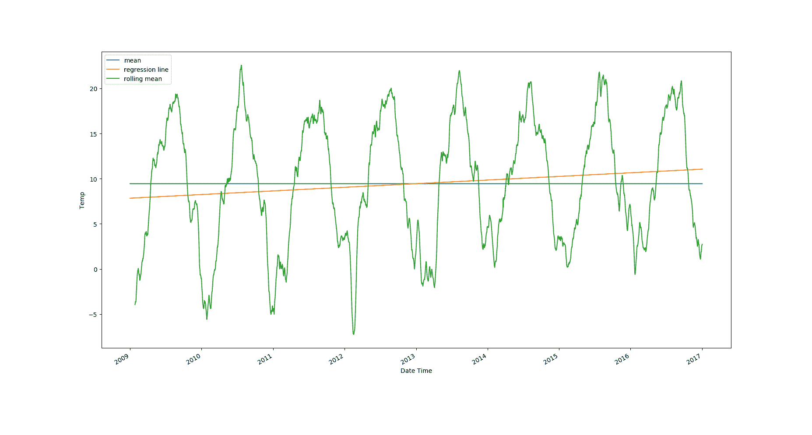

Mean, best fit line and rolling mean. 


Rolling standard deviation calculated over every month

从图上可以明显看出，气温值有上升趋势，数据中有很强的季节性。滚动标准差下降趋势很弱，但滚动标准差数值本身变化很大。

### 自相关

我们知道相关性让我们通过假设高斯分布来比较两个变量之间的关系，并使用[皮尔逊系数](https://en.wikipedia.org/wiki/Pearson_correlation_coefficient)来找出所述变量之间的关系强度。

皮尔逊系数可以计算如下。

```py
def correlation(x, y):
	x_norm = x - x.mean()
	y_norm = y - y.mean()
	return np.sum(x_norm * y_norm) / np.sqrt(np.sum(x_norm ** 2) * np.sum(y_norm ** 2))
```

[自相关](https://en.wikipedia.org/wiki/Autocorrelation)是信号与其自身延迟副本的相关性，作为延迟的函数。我们试图找到一个时间序列和它本身的滞后版本之间的相关性。我们观察这些值，发现它们是如何随着时间延迟的增加而变化的。可以这样计算。

```py
def autocorrelation(x, k):
	val_0 = np.sum((x - x.mean()) ** 2) / len(x)
	val_k = np.sum((x[:-k] - x.mean()) * (x[k:] - x.mean())) / len(x)
	return val_k / val_0
```

### 偏自相关

[偏自相关函数](https://online.stat.psu.edu/stat510/lesson/2/2.2)让我们计算一个时间序列和具有时滞的相同序列之间的偏相关。相关和部分相关的区别在于，部分相关让我们可以控制其他滞后值的影响。

目的是计算具有不同延迟的相同时间序列的相关性。

为了找出所有滞后值彼此之间的相关性，我们可以用公式表示以下性质的线性方程。设$X(t - k)$是滞后$k$的时间序列的列向量。上面生成的矩阵将创建一个形状为$(N \ x k)$的数组。姑且称之为$A$吧。现在定义另一个系数未知的矩阵$B$，大小与$X$相同。

然后我们有一个线性方程组:

$ X(t)= A \乘以 B$

我们需要解决$B$。

对于 1 或 2 的滞后值，这在分析上很容易解决。也就是说，它会很快变得很麻烦。

尤尔·沃克方程提供了解决这个问题的另一种方法。时间序列中的一个元素被表示为一个线性方程，依赖于它之前的每个元素，直到最大滞后值。

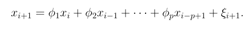

该方程乘以最大滞后时间步长的元素，并计算期望值。等式除以序列的长度，然后除以零阶自协方差。

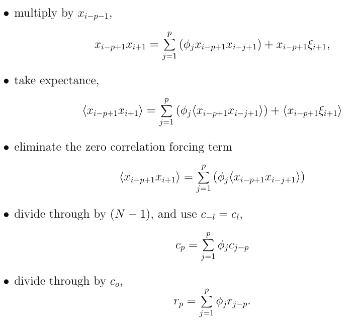

这里，$c(i)$是自协方差值(它除以第零个值以获得自相关参数$r(p)$)。

所有滞后值的方程式可以简洁地表示如下。

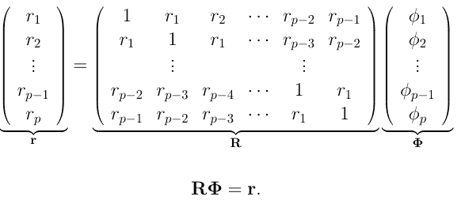

现在我们需要求解$\phi$。我们知道如何从我们定义的自相关函数中计算矩阵$r$的值。为了找到部分自相关，我们可以使用 Python 中`statsmodels`包的现成函数，如下所示。

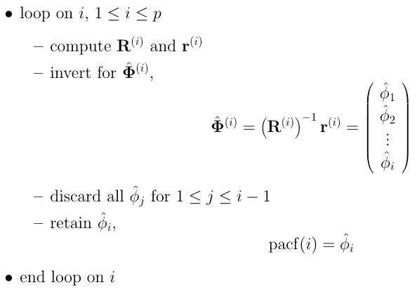

```py
from statsmodels.graphics.tsaplots import plot_acf, plot_pacf

def get_acf_pacf_plots(df):
    fig, ax = plt.subplots(2, figsize=(12,6))
    ax[0] = plot_acf(df, ax=ax[0])
    ax[1] = plot_pacf(df, ax=ax[1])

get_acf_pacf_plots(series[5::6])
plt.show()
```

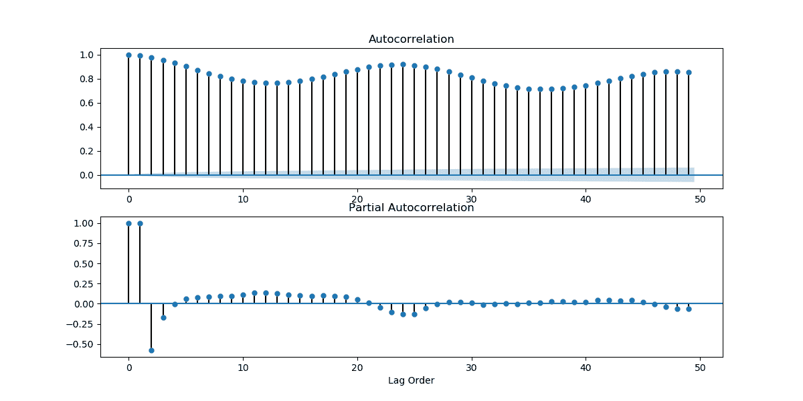

### 季节性

从我们的几个图中，我们看到数据有季节性因素。我们凭直觉知道，温度数据也应该有季节因素。温度应该每天都在波动，晚上比白天低。除此之外，它们还应该在一年的时间里振荡。

为了验证这些怀疑，我们可以看看我们的级数的傅立叶变换。

傅立叶变换允许我们将基于振幅的序列转换成基于频率的序列。它们是复值函数，将每个级数表示为复平面中正弦波的叠加。

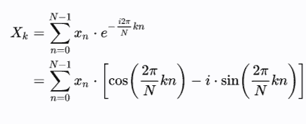

这里 *N* 是序列的长度， *X* 是在 *t=k.* 的变换值

3Blue1Brown 制作了非常有趣的视频，这些视频将让您非常直观地了解数学公式，为什么要在复平面中表示值，以及如何捕捉函数中的主频率。你可以在这里找到傅立叶级数[和傅立叶变换](https://www.youtube.com/watch?v=r6sGWTCMz2k)[的视频。](https://www.youtube.com/watch?v=spUNpyF58BY)

我们可以将傅里叶变换的幅度绘制如下。

```py
from scipy.fft import fft

fft_vals = fft(series[5::6].values)
f_per_dataset = np.arange(0, len(fft_vals))

n_samples_h = len(series[5::6])

hours_per_year = 24*365.2524
years_per_dataset = n_samples_h/(hours_per_year)

f_per_year = f_per_dataset/years_per_dataset
plt.step(f_per_year, np.abs(fft_vals))
plt.xscale('log')
plt.xticks([1, 365.2524], labels=['1/Year', '1/day'])
_ = plt.xlabel('Frequency (log scale)')
plt.show() 
```

这个片段是从[这里借用的](https://www.tensorflow.org/tutorials/structured_data/time_series)。

我们得到如下的情节:

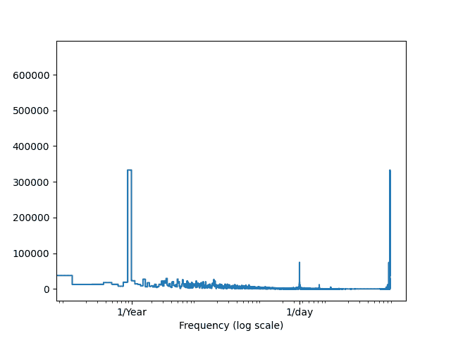

正如我们所看到的，1/年和 1/天附近的值显示了一个不寻常的峰值，验证了我们之前的直觉。

上述方法是光谱分析的一种基本形式。出现了许多复杂的谱密度估计方法，这些方法利用了傅立叶变换的基本思想:将时域信息转换到频域。其中有[周期图](https://en.wikipedia.org/wiki/Periodogram)、[巴列特法](https://en.wikipedia.org/wiki/Bartlett%27s_method)、[韦尔奇法](https://en.wikipedia.org/wiki/Welch%27s_method)等。通常，为了获得更好的结果，像[汉明](https://en.wikipedia.org/wiki/Window_function#Hann_and_Hamming_windows)和[布莱克曼-哈里斯](https://en.wikipedia.org/wiki/Window_function#Blackman%E2%80%93Harris_window)这样的[窗口函数](https://download.ni.com/evaluation/pxi/Understanding%20FFTs%20and%20Windowing.pdf)被用来平滑时间序列。你可以把它们想象成一维卷积滤波器，其中的参数根据我们所研究的窗函数的类型而变化。你可以通过阅读[数字信号处理](https://www.google.com/url?sa=t&rct=j&q=&esrc=s&source=web&cd=&ved=2ahUKEwjqq5n73eDtAhVEeysKHWpdBdsQFjACegQIAxAC&url=http%3A%2F%2Fcnx.org%2Fexports%2F0064a063-1735-4a49-a114-46391e362992%404.10.pdf%2Ffundamentals-of-signal-processing-4.10.pdf&usg=AOvVaw3F2TSGJSP0MtW_z6oyiVU0)来了解更多关于频谱分析和傅立叶变换的知识。

## 时间序列的平稳性

当时间序列的统计属性(如均值、方差和自相关)不随时间变化时，时间序列是稳定的。

像 ARIMA 和它的变体这样的方法都是在假设他们建模的时间序列是平稳的情况下工作的。如果时间序列不是平稳的，这些方法就不能很好地工作。

幸运的是，我们可以做几个测试来确定时间序列是否是平稳的。对我们来说更幸运的是，有几个转换可以将非平稳时间序列转换为平稳时间序列，或者反过来。

我们将首先看一下测试，然后是转换。

### ACF 和 PACF 图

观察时间序列的均值和方差如何随时间变化，可以让我们初步了解时间序列的非平稳性，以及我们可以应用哪种平稳化机制。看着我们上面找到的图，我们可以猜测天气时间序列远不是平稳的。我们也可以看看 ACF 和 PACF 图。如果图上的值下降很快，时间序列很可能接近平稳。但是我们上面得到的 ACF 和 PACF 图在时间上过于接近。天气几乎每 10 分钟就变一次。让我们来看看当你按天获取数据时的曲线图。

```py
series2 = series[119::120]
get_acf_pacf_plots(series2)
plt.show() 
```

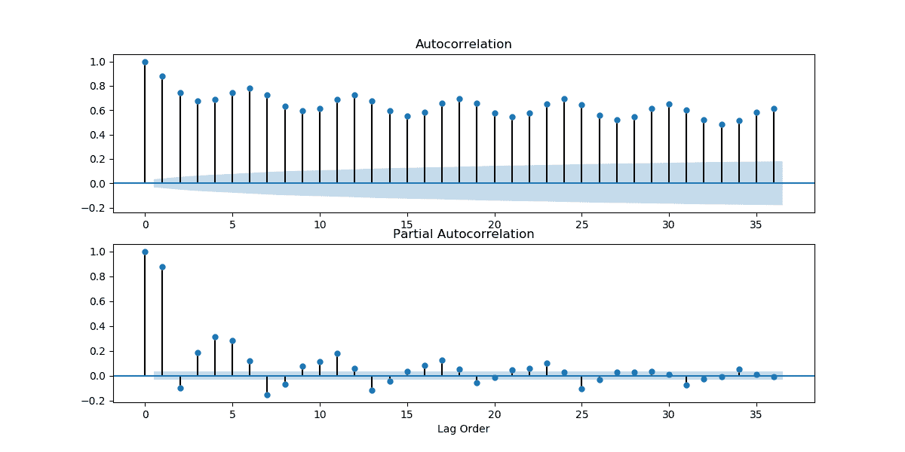

如果我们每 31 天收集一次数据呢？

```py
series2 = series2[30::31]
get_acf_pacf_plots(series2)
plt.show() 
```

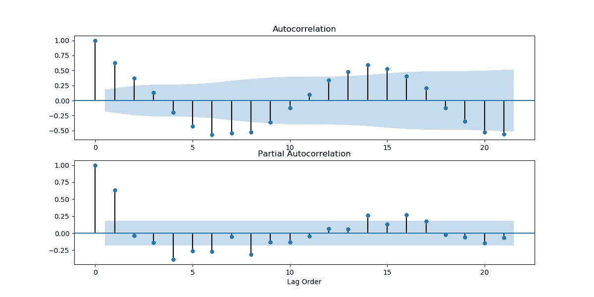

正如我们所看到的，有几个点落在蓝色区域之外，这表明时间序列不是平稳的。

### 迪基-富勒试验

单位根检验测试自回归模型中存在单位根的零假设。原检验将一个时间序列视为 lag-1 自回归模型，单位根证明一个时间序列不是平稳的。

测试有三个主要版本:

1.测试单位根:

$ $ \ Delta y _ { t } = \ Delta _ { y _ { t-1 } }+u _ { t } $ $

2.带漂移的单位根测试:

$ $ \ Delta y _ { t } = a _ { 0 }+\ Delta _ { y _ { t-1 } }+u _ { t } $ $

3.测试具有漂移和确定性时间趋势的单位根:

$ $ \ Delta y _ { t } = a _ { 0 }+a _ { 1 } t+\ Delta _ { y _ { t-1 } }+u _ { t } $ $

[增强的 Dickey-Fuller 测试](https://en.wikipedia.org/wiki/Augmented_Dickey%E2%80%93Fuller_test)是一种[单尾测试](https://www.investopedia.com/terms/o/one-tailed-test.asp)，使用相同的测试程序，但应用于如下所示的 lag-p 系列。

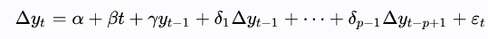

使用像[阿凯克](https://en.wikipedia.org/wiki/Akaike_information_criterion)、[贝叶斯](https://en.wikipedia.org/wiki/Bayesian_information_criterion)或[汉南-奎因](https://en.wikipedia.org/wiki/Hannan%E2%80%93Quinn_information_criterion)这样的信息标准来找到滞后值。

```py
from statsmodels.tsa.stattools import adfuller

def test_dickey_fuller_stationarity(df):
    dftest = adfuller(df, autolag='AIC')
    dfoutput = pd.Series(dftest[0:4], index=['Test Statistic',
                                             'p-value',
                                             'Number of Lags Used',
                                             'Number of Observations Used'])
    for key,value in dftest[4].items():
        dfoutput['Critical Value (%s)'%key] = value
    if dfoutput['Critical Value (1%)'] <  dfoutput['Test Statistic']:
        print('Series is not stationary with 99% confidence. ')
    elif dfoutput['Critical Value (5%)'] < dfoutput['Test Statistic']:
        print('Series is not stationary with 95% confidence. ')
    elif dfoutput['Critical Value (10%)'] < dfoutput['Test Statistic']:
        print('Series is not stationary with 90% confidence. ')
    else:
        print('Series is possibly stationary. ')
    return dfoutput

out = test_dickey_fuller_stationarity(series)
print(out)
```

我们得到的输出如下。

```py
Series is possibly stationary. 

Test Statistic                -8.563581e+00
p-value                        8.564827e-14
Number of Lags Used            6.200000e+01
Number of Observations Used    7.002800e+04
Critical Value (1%)           -3.430443e+00
Critical Value (5%)           -2.861581e+00
Critical Value (10%)          -2.566792e+00 
```

你可以在这里了解更多关于增强的迪基-富勒测试[。](https://www.machinelearningplus.com/time-series/augmented-dickey-fuller-test/)

### KPSS 试验

另一个单位根检验是 [KPSS 检验](https://www.machinelearningplus.com/time-series/kpss-test-for-stationarity/)。KPSS 检验没有假设一个单位根存在的零假设，而是认为这是另一个假设。使用下面的回归方程。

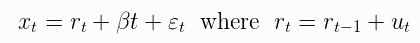

其中$r_t$为随机游走，$\beta t$为确定性趋势，$\epsilon_t$ 为平稳误差。

因此，零假设被表述为 *H₀: σ = 0* ，而备选项为 *Hₐ: σ > 0。*

在实现中，我们应该记住 KPSS 是一个双尾检验。

```py
from statsmodels.tsa.stattools import kpss

def test_kpss(df):
    dftest = kpss(df)
    dfoutput = pd.Series(dftest[0:3], index=['Test Statistic',
                                             'p-value',
                                             'Number of Lags Used'])
    for key,value in dftest[3].items():
        dfoutput['Critical Value (%s)'%key] = value
    if abs(dfoutput['Critical Value (1%)']) < abs(dfoutput['Test Statistic']):
        print('Series is not stationary with 99% confidence. ')
    elif abs(dfoutput['Critical Value (5%)']) < abs(dfoutput['Test Statistic']):
        print('Series is not stationary with 95% confidence. ')
    elif abs(dfoutput['Critical Value (10%)']) < abs(dfoutput['Test Statistic']):
        print('Series is not stationary with 90% confidence. ')
    else:
        print('Series is possibly stationary. ')
    return dfoutput

out = test_kpss(series)
print(out)
```

输出如下所示。

```py
Series is not stationary with 99% confidence. 

Test Statistic            1.975914
p-value                   0.010000
Number of Lags Used      62.000000
Critical Value (10%)      0.347000
Critical Value (5%)       0.463000
Critical Value (2.5%)     0.574000
Critical Value (1%)       0.739000
```

你还可以做几个其他的测试来测试平稳性，像[菲利普·赫伦](https://en.wikipedia.org/wiki/Phillips%E2%80%93Perron_test)、[齐沃特·安德鲁斯](https://www.jstor.org/stable/1391541?seq=1)、[傅立叶 ADF](http://wenders.people.ua.edu/uploads/2/6/3/8/26382715/enders_lee_df_fourier_tests_final_version_march_5_2012.pdf) 等等。，取决于他们如何对待结构突变、内生变量和外生变量等。你可以在这里了解他们[，在这里](https://towardsdatascience.com/detecting-stationarity-in-time-series-data-d29e0a21e638)了解[。](https://www.aptech.com/blog/unit-root-tests-with-structural-breaks/)

虽然单位根检验意味着平稳性，但是像迪基-富勒这样的单位根检验和像 KPSS 这样的平稳性检验是有区别的。你可以在这里和[这里](https://stats.stackexchange.com/questions/317133/how-to-interpret-kpss-test)了解更多。

我们的时间序列给了我们相互矛盾的结果。但是如果一个序列不是平稳的，平稳化一个时间序列是很重要的，因为自回归模型是在平稳性的基本假设下设计的。

## 平稳性的变换

有几种不同的方法可以使时间序列平稳。

### 1.去趋势

通过从时间序列中减去滚动平均值，然后对其进行归一化，可以消除时间序列中的趋势。

```py
def eliminate_trends(series):
    roll = series.rolling(4).mean()
    avg_diff = (series - roll)/roll
    avg_diff.dropna(inplace=True)
    return avg_diff

diff = eliminate_trends(series[5::6])
test_dickey_fuller(diff)
test_kpss(diff)
```

迪基-富勒结果:

```py
Series is possibly stationary. 

Test Statistic                  -264.739131
p-value                            0.000000
Number of Lags Used                0.000000
Number of Observations Used    70087.000000
Critical Value (1%)               -3.430443
Critical Value (5%)               -2.861581
Critical Value (10%)              -2.566792 
```

KPSS 结果:

```py
Series is possibly stationary. 

Test Statistic            0.302973
p-value                   0.100000
Number of Lags Used      62.000000
Critical Value (10%)      0.347000
Critical Value (5%)       0.463000
Critical Value (2.5%)     0.574000
Critical Value (1%)       0.739000 
```

如果您在序列中找到线性趋势，您可以改为找到回归线，然后相应地删除线性趋势。

```py
def eliminate_linear_trend(series):
    x = np.arange(len(series))
    m, c = np.polyfit(x, series, 1)
    return (series - c) / m

diff = eliminate_linear_trend(series[5::6])
test_dickey_fuller(diff)
test_kpss(diff) 
```

迪基-富勒:

```py
Series is possibly stationary. 
Test Statistic                   -42.626441
p-value                            0.000000
Number of Lags Used               62.000000
Number of Observations Used    84045.000000
Critical Value (1%)               -3.430428
Critical Value (5%)               -2.861574
Critical Value (10%)              -2.566788
```

KPSS:好的：

```py
Series is possibly stationary. 

Test Statistic            0.006481
p-value                   0.100000
Number of Lags Used      65.000000
Critical Value (10%)      0.347000
Critical Value (5%)       0.463000
Critical Value (2.5%)     0.574000
Critical Value (1%)       0.739000 
```

### 2.区别

您可以选择一个滞后值，并将时间$t$ 处的值与时间$t - p$处的值进行比较，其中$p$是滞后值。

```py
def difference(series, lag=1):
	differenced = []
    for x in range(lag, len(series)):
    	differenced.append(series[x] - series[x - lag])
    return pd.Series(differenced) 
```

区别之后，我们可以再次尝试迪基-富勒和 KPSS 测试。

```py
diff = difference(series[6::5])
test_dickey_fuller(diff)
test_kpss(diff)
```

Dickey-Fuller 的输出:

```py
Series is possibly stationary. 

Test Statistic                   -42.626441
p-value                            0.000000
Number of Lags Used               62.000000
Number of Observations Used    84045.000000
Critical Value (1%)               -3.430428
Critical Value (5%)               -2.861574
Critical Value (10%)              -2.566788
```

和 KPSS:

```py
Series is possibly stationary. 

Test Statistic            0.006481
p-value                   0.100000
Number of Lags Used      65.000000
Critical Value (10%)      0.347000
Critical Value (5%)       0.463000
Critical Value (2.5%)     0.574000
Critical Value (1%)       0.739000
```

## 结论

我们涵盖了在时间序列中寻找什么来分析线性和非线性趋势的所有基础知识。我们研究了平稳性的概念，不同的测试来确定一个序列是否平稳，以及如何使一个非平稳序列平稳。在本系列的下一部分，我们将讨论时间序列预测。

不要忘记从[Gradient Community Notebook](https://ml-showcase.paperspace.com/projects/time-series-analysis-and-forecasting)免费运行这篇文章的完整代码，或者查看第 2 部分和第 3 部分，分别涉及回归和 LSTMs，以及自回归模型和平滑方法。