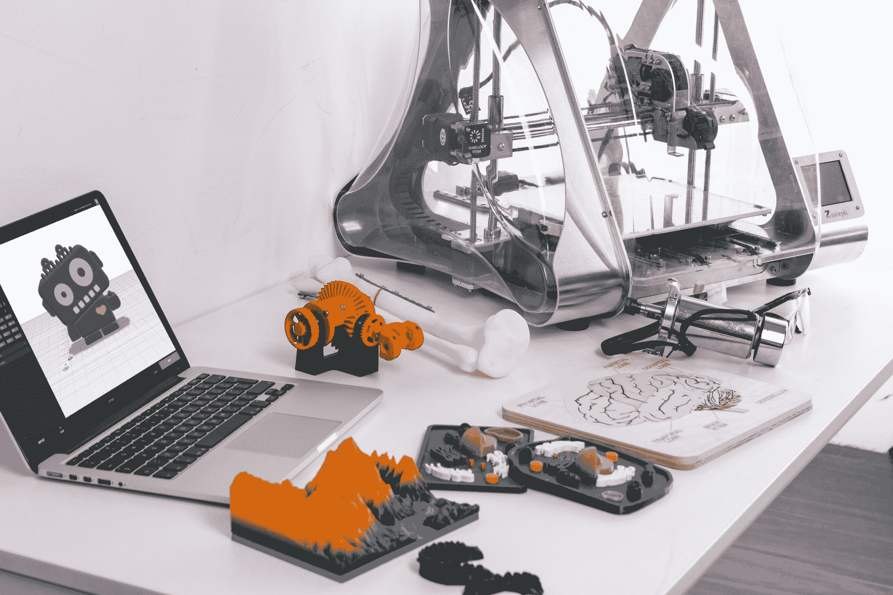
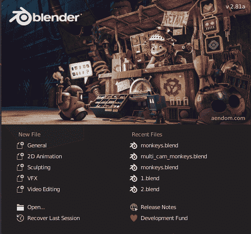
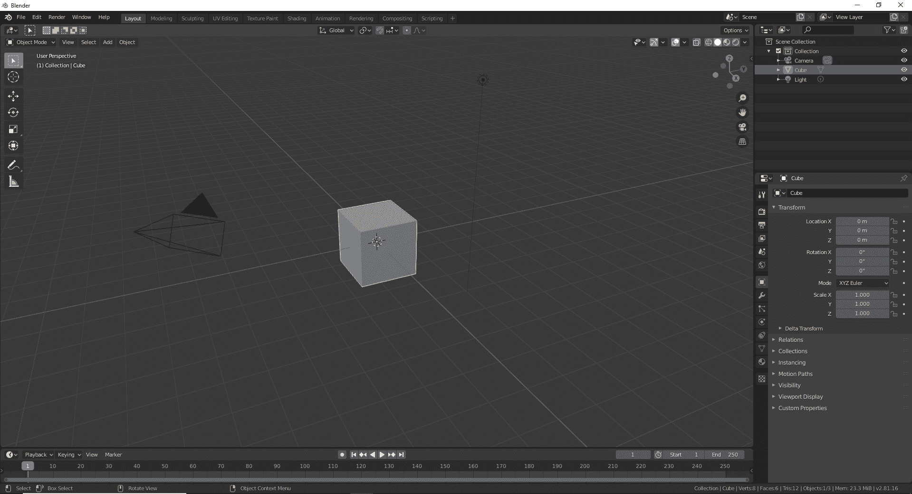
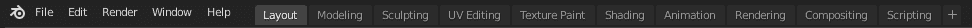
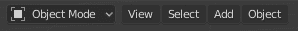
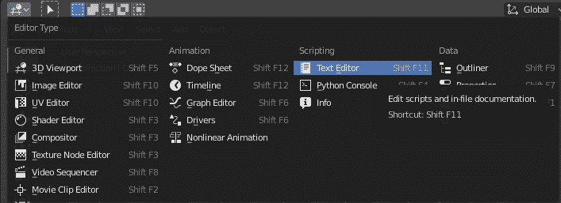
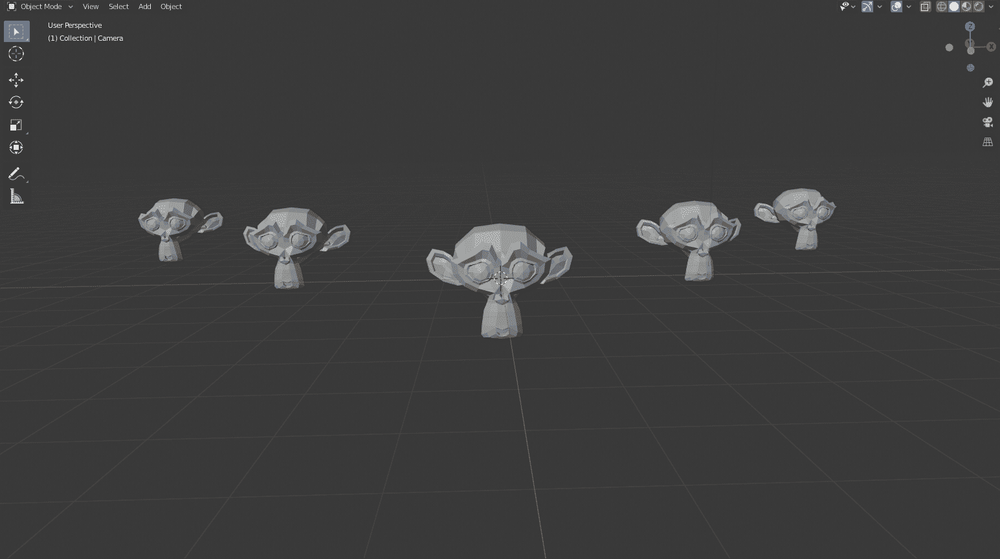
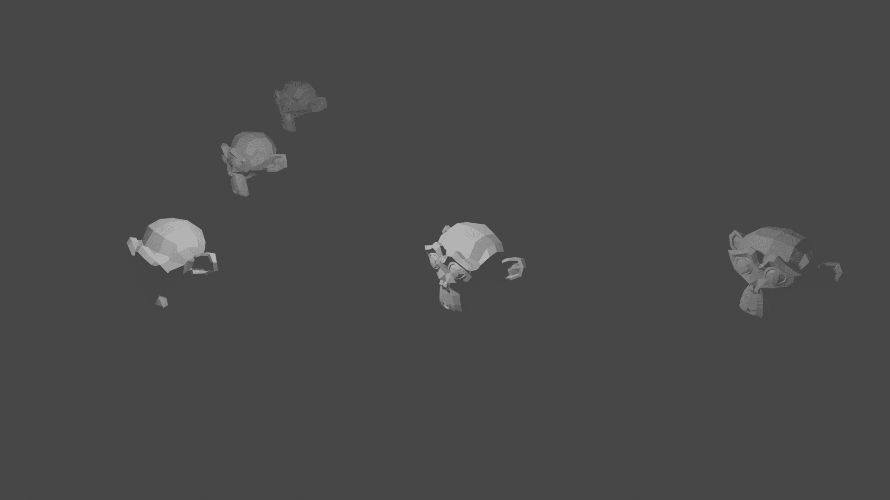
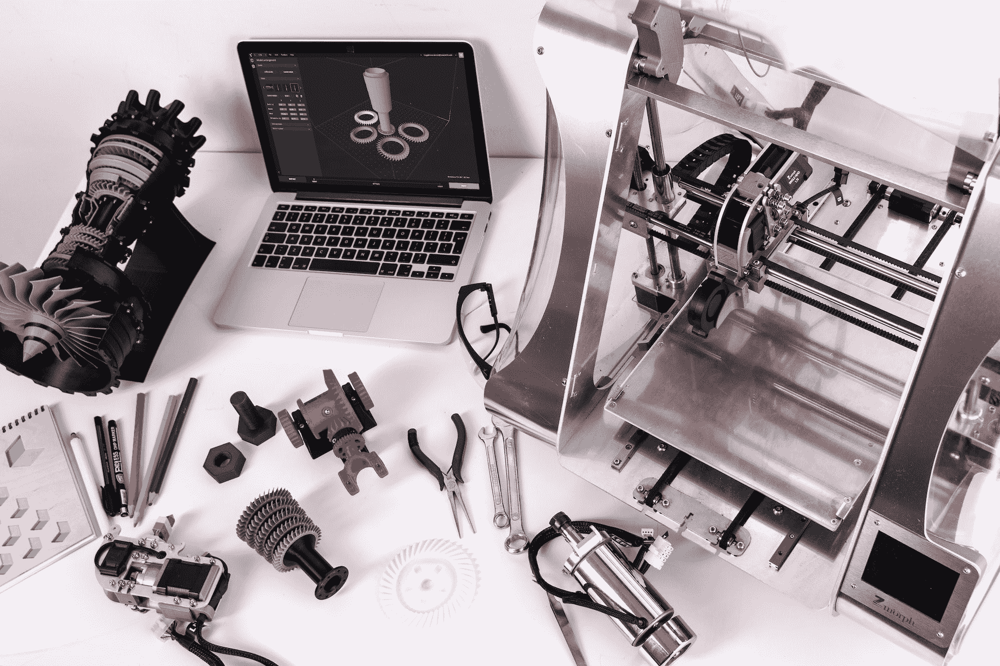

# Blender 中使用 Python 脚本进行三维建模的介绍

> 原文：<https://blog.paperspace.com/introduction-to-3-d-modeling-with-python-scripting/>



Photo by [Xiaole Tao](https://unsplash.com/@xiaole?utm_source=ghost&utm_medium=referral&utm_campaign=api-credit) / [Unsplash](https://unsplash.com/?utm_source=ghost&utm_medium=referral&utm_campaign=api-credit)

我们在世界各地的日常生活中感知的自然环境和周围环境是一种三维视觉。从几何学的角度来解释三维是很简单的。我们考虑水平 x 轴、垂直 y 轴和旋转 z 轴，它们决定了物体在三维空间中的位置。我们生活在一个本质上是纯三维的世界，由长度、宽度和高度这三个决定性的重要因素组成。大多数固体物质，如球体、圆柱体、立方体、长方体和许多其他类似的形状，在本质上都是三维的。因此，能够用简单的工具重建 3d 视图和透视图在现代具有重要意义。

3d 模型是在 20 世纪 60 年代创建的，从那时起，3d 建模的流行程度就在不断上升。简而言之，三维建模是在三维空间中创建一个对象，以捕捉其所有继承的属性，如真实或虚构对象的大小、形状和纹理。在这篇文章中，我们的主要目标是对 Blender 中最好的 3d 模型渲染软件之一有一个基本的了解，并尝试学习与这个主题相关的所有基础知识。

我们不仅会看到使用 Blender 操作对象的物理方面，还会深入 Python 脚本来协调任务和完成特定的动作。让我们看一下目录，了解一下我们将在本文剩余部分探索和试验的概念。请随意跳到您最想了解的主题。但是，如果您是 3d 建模的新手，建议您阅读整篇文章。

### 目录:

*   介绍
*   Blender 入门
*   使用 Blender 理解 Python 脚本
*   用 Blender 开发一个简单的三维项目
*   使用 Python 脚本执行相同的任务
    1。导入库
    2。删除默认对象和相机
    3。添加多猴子网格
    4。创造相机
    5。保存渲染图像
    6。2 个额外的多摄像头和节省
*   结论

## 简介:

本文的重点是开始使用 Blender，在对 Blender 有了基本的了解之后，我们将深入了解如何开始使用 Blender 中的 Python 脚本。Blender 是创建三维模型的最佳工具之一。它是完全免费和开源的，发布了许多版本。撰写本文时最稳定的版本是 2.92，而目前正在测试的 Blender 最新版本是 2.93.0 Alpha。然而，出于本文的目的，我将使用 Blender 的 2.81a 版本。我会推荐那些希望使用相同版本的用户，因为每个新的类别可能会有细微的变化。因此，最好是相应地跟上等效的版本，以避免任何进一步的混淆。

Blender 平台是计算机图形设计和三维建模的一个极好的工具。它支持整个 3D 管道——建模、装配、动画、模拟、渲染、合成和运动跟踪、视频编辑和 2D 动画管道。Blender 的受欢迎程度正不断达到顶峰，这是因为在 Blender 的帮助下，您可以构建大量漂亮的项目。它为您提供了大量的工具和各种帮助工具，适用于您正在尝试完成的任何类型的计算机设计。除了这些神奇的工具之外，它还为用户提供了像 Python 这样的编程语言，从中你可以从头开始编写你的脚本并构建许多项目。让我们开始学习如何在 Blender 中使用 Blender 和 Python 脚本。

* * *

## Blender 入门:

对于整个文章系列，我们将使用 Blender 的 2.81 版本。撰写本文时 Blender 的最新版本是 2.93。用户也可以自由地探索最新的版本，并在这个环境中构建他们的项目。然而，这两个版本之间可能会有一些微妙的变化。Blender 2.81 版本可以从以下[链接](https://www.blender.org/download/releases/2-81/)下载。

这个新版本比前几代有几个改进，特别是在更新的画笔和光标设置，遮罩的改进，附加工具，RTX 显卡支持，等等。确保您按照下载和安装程序进行操作，直到您成功地将其安装到您的系统上。一旦完成，用户可以继续点击 Blender 应用程序并打开该应用程序。



打开 Blender 后，您会在 Blender 屏幕中央找到上图所示的弹出菜单。在这里，您将找到关于您想要创建的文件类型的多个选项，包括像 General 这样的选项，它基本上是一个用于执行大多数操作的 3d 建模空间，以及我们将在本教程系列中使用的选项。我们也有其他类型的文件要处理，包括二维动画、雕刻、VFX 和视频编辑。您还可以访问您之前处理过的最近五个文件，或者选择使用打开图标浏览任何其他文件。选择常规选项，我们可以继续了解 Blender 的一些基本功能。

当您进入 Blender 的一般结构时，您可以通过单击鼠标 3(鼠标中键)按钮并四处移动鼠标来探索整个 3d 视口环境，以便更好地查看我们将构建 3d 建模项目的空间。您也可以使用三维空间右上角的“X”、“Y”和“Z”符号来执行以下操作。单击立方体以选择立方体，并试验您可以在此对象上执行的许多操作。键盘上的“G”按钮是将对象移动到所需位置的快捷方式。“R”按钮是旋转特定选定对象的快捷方式。在后面的章节中，我们将会对 Blender 有一个更好的理解。现在，让我们探索一些在 Blender 中可用的基本工具。



在右侧，我们可以注意到还有另外两个编辑器窗口，即大纲视图和属性编辑器类型。“大纲视图编辑器”( outliner editor)类型用于跟踪混合器空间中存在的大量对象，以便可以相应地处理每个对象。“属性”窗口是最有用的实体之一，因为它有助于查看、设置和更改对象的不同类型的属性。这种编辑器类型会被频繁使用。因此，强烈建议您探索以下内容。

下图所示的第一个菜单或主菜单栏包含一些最基本的功能，这些功能对于开发三维模型非常有用。*文件*选项将具有与大多数用户相似的显著特征，这些用户具有任何其他类型的开发环境的经验，具有打开、保存和其他类似操作的基本选项。*编辑*窗口允许用户执行撤销、重做等操作。*渲染*窗口将频繁用于渲染图像，将物体从三维图形转换成图像。*窗口*中的重要功能是切换系统控制台，它允许你调试你的 Python 程序。*帮助*选项为用户提供了对一些精彩文档的访问。其他选项将在本系列文章中探讨。



下面是另一个菜单栏的图像表示，它由一些重要元素组成，您可能会发现这些元素在构建三维模型时很有用。对象模式是您可以与 Blender 空间中的对象进行交互的许多方法之一。对象模式帮助您管理固态项目，而编辑模式将帮助您管理更基本的内容。其他选项如*查看*、*选择*、*对象*用于执行特定的动作。*添加*功能是我们在文章中用来添加一些不同类型的网格来学习 3d 建模的。



虽然 Blender 中有大量的信息和众多的实体、工具和技术需要学习，但我们将在这个 3d 建模系列的后续文章中重新访问其他必需品。目前，对 Blender 的基本介绍对于初级项目来说已经足够了。我们可以转到 Python 脚本部分来评估 Blender 中编程的一些基本概念。

* * *

## 使用 Blender 理解 Python 脚本:

要在 Blender 中使用 Python 脚本处理所有操作，请将光标移动到菜单栏正下方 Blender 屏幕左上角的编辑器类型图标上。如果将光标放在指定位置，您会注意到图标显示特定区域的当前编辑器类型是三维视口综合，您可以在其中操纵三维空间中对象的性能、动作和操作。点击图标，你会看到许多选项。选择允许您编辑 Python 脚本或任何其他类型的文件内文档的文本编辑器选项。查看下图以获得进一步的指导。



执行此操作的另一种方法是借助 Blender 提供的快捷选项。您可以使用 Shift + F11 组合进入文本编辑器模式，并使用 Shift + F5 组合重新进入三维视口状态。在 Python 脚本中，我更喜欢将屏幕分为视窗和文本编辑器环境。一旦您在屏幕上启用了文本编辑器，请单击可用的新选项。单击 New 图标后，您会发现创建了一个新的文本文件。为了执行 Python 脚本，我们将这个新创建的文件重命名为类似“test.py”的名称，并导入 bpy 模块。请注意，您可以将 Python 文件标记为您喜欢的任何名称。然而，“的延伸。py”极其重要。

```py
import bpy
```

一旦导入了 bpy 模块，现在就可以借助 Python 脚本执行多个 Blender 操作。当我们在用 Python 编程开发我们的 3d 模型项目的后面部分详细讨论时，我们将会更好地理解这个概念。现在，让我们了解一些需要牢记的基本要点。

*   **访问数据块-** 模块 *bpy.data* 允许用户访问文件中的库数据。(如果您滚动某个特定的属性，您会注意到指令中嵌入了一些默认的 Python 代码。)

```py
bpy.data.scenes
<bpy_collection[1], BlendDataScenes>
```

*   **收藏-** 用户可以查看搅拌机空间中的众多对象。

```py
list(bpy.data.objects)
[bpy.data.objects["Cube"], bpy.data.objects["Plane"]]
```

*   **访问属性-** 有了特定数据块的知识，我们就可以访问它们各自的特性。

```py
bpy.data.materials.new("MyMaterial")
bpy.data.materials['MyMaterial']
```

*   **Context -** 为了让特定的动作按照用户的意愿发生，我们使用了 *bpy.context* 操作。

```py
bpy.context.scene.objects
```

*   **数据创建和删除-** 我们可以相应地创建和删除数据。大多数项目的第一步都会涉及到这个概念，包括下一节中的内容。

通过讨论 Blender 中 Python 脚本的一些基础知识，我们可以继续开发一些简单的 3d 建模项目。如果您想了解有关该主题的更多信息，请访问以下[文档](https://docs.blender.org/api/2.81a/)。让我们继续用 Blender 构建我们的第一个项目。

* * *

## 用 Blender 开发一个简单的三维项目:

> 任务:我们将在本文中开发的简单 3d 项目是导入多个猴子网格，并在多摄像机视图的帮助下从不同的角度查看它们。

为了执行以下任务，我们将首先删除 Blender 屏幕上显示的默认立方体。要执行此操作，您可以用鼠标选择对象，然后单击键盘上的删除按钮。另一个选项是选择对象并点击键盘上的“X”按钮。向用户呈现删除对象的选项，用户可以继续这样做。一旦你删除了默认的立方体，我们的下一步是加载猴子网格。为了执行导入猴子网格的这一步，点击 Blender 中的 add 按钮，然后选择网格图标，并沿着直到最后一行，在这里你可以选择一只猴子。

现在我们已经成功地添加了猴子网格，你可以继续点击对象并点击 *ctrl-c* 和 *ctrl-v* 。选择对象后，也可以借助鼠标右键执行以下复制-粘贴操作。猴子网格一旦被复制粘贴，就可以被拖动到用户想要的位置。选择新创建的对象网格，并按键盘上的“G”将其拖动到合适的位置。按下鼠标左键将其放在一个合适的位置。您可以创建五个这样的副本，并将它们拖放到您想要的位置。下面显示的图像是我如何复制粘贴(使用代码)将猴子放置在它们各自的位置。



一旦猴子网格被放置在搅拌机屏幕上，我们的下一步是相应地调整相机或对象。因为我们在屏幕上有多个网格，所以最好的选择是调整相机视图，以便从不同的视角和相机角度查看猴子网格的位置。点击 Blender 中的相机模块，并按下键盘上的“G”将其拖动到合适的位置。一旦你把它拖到需要的位置，你也可以点击键盘上的“R ”,选择相应的轴来旋转相机。您可以选择“X”、“Y”或“Z”轴来旋转和放置摄像机到所需的位置。

一旦摄影机放置在所需的位置，您可以通过复制和粘贴它们来创建多个摄影机，类似于猴子网格。借助“G”按钮将它们拖动到选定的位置，然后单击鼠标左键放置它们。单击 ctrl + Numpad 0 命令来选择您正在使用的特定摄像机。选择所需的相机后，您可以单击 f12 按钮，或者迁移到菜单栏上的渲染图标，然后选择渲染图像选项。将图像保存在所需的位置。建议查看者尝试不同的角度和位置，以查看从哪个角度可以获得多个猴子网格的最佳视图。下面是 Blender 中生成的渲染图像的一个例子。



我还有两张分别来自中心和左角的渲染图。这些将在使用 Python 脚本执行相同任务的下一节中进一步讨论。在进入下一个主题之前，请随意尝试并了解更多信息。

* * *

## 使用 Python 脚本执行相同的任务:

我们已经了解了如何使用 Blender 创建多个猴子网格和一个多相机视图的基本工作流程。让我们了解如何用 Python 编程实现同一个项目。在 Blender 中打开文本编辑器，让我们开始编码。这个过程的主要步骤包括导入所有需要的库，删除默认的立方体对象和相机，编写几个“for”循环来导入多个猴子网格，创建相机，最后保存渲染图像。

我们将重复创建相机和保存渲染文件两次以上。完成该步骤是为了从不同的摄像机位置生成多个渲染图像，以便观众可以从多个位置看到这些图像。让我们开始编码过程。

### 导入库:

为了实现我们的项目，我们将进口三种主要必需品。首先，我们将导入 bpy 库，这将允许用户在 Blender 文本编辑器中访问 Python 环境。我们将从这个库中导入一些功能，以便于访问。然而，用户可能会注意到，在一些代码块中，我没有怎么使用它们。最后，我们还将导入数学库来执行不同类型的计算。在这个特定的场景中，数学库主要用于计算欧拉角以测量旋转角度。必要的进口如下:

```py
import bpy
from bpy import context, data, ops
import math
```

### 移除默认对象和摄像机:

我们的下一个目标是从 Blender 环境中移除所有不必要的元素。可以通过两种方式执行此操作。一种方法是使用 delete 函数并将 use global 参数设置为 False。另一种方法是创建一个 for 循环并检查默认屏幕中的所有对象，选择您正在寻找的特定类型的对象，并删除您认为对特定项目不必要的适当元素。下面是执行以下操作的代码块。

```py
#  Remove The Default Cude Object
# bpy.ops.object.delete(use_global=False)

bpy.ops.object.delete(use_global=False, confirm=False)

for o in bpy.context.scene.objects:
    if o.name == "Cube":
        bpy.ops.object.delete(use_global=False)
```

### 添加多猴子网格:

在下一步中，我们将相应地在它们各自的位置添加猴子网格。为了执行这一步，我们将把三个变量初始设置为零。这三个变量分别代表 x 轴、y 轴和 z 轴。我们将相应地修改这些变量，以获得猴子网格的最佳定位。计数变量用于根据需要改变这些轴的位置。

第一次迭代循环将在各自的位置添加三个猴子网格，第二次迭代循环将在另一侧再添加两个猴子。请随意尝试各种替代方案和位置变化，看看什么最适合您的模型。您获得的最终模型应该类似于上一节中显示的第一幅图像。然而，我们可以注意到，使用代码的方法比随机复制粘贴代码更有效。

```py
# Create multiple monkey meshes
x = 0
y = 0 
z = 0

count1 = 0
count2 = -5

for i in range(3):
    # Import the monkey mesh
    bpy.ops.mesh.primitive_monkey_add(location = (x + count1, y + count1, z))
    count1 += 5

for i in range(2):
    # Import the monkey mesh
    bpy.ops.mesh.primitive_monkey_add(location = (x + count2, y - count2, z))
    count2 += -5
```

### 正在创建摄像机:

一旦我们完成创建多个猴子网格，我们可以添加一个相机来查看我们的对象和它们的整体视图。我们将设置场景并创建我们的相机，并将相机镜头设置为 30 毫米。默认的相机尺寸通常是 50 毫米。但是，我们将使用这个特定的大小，以便在指定的范围内所有的对象都清晰可见。然后，我们将创建我们的相机对象，并为我们的相机设置位置和旋转角度。

这个位置将决定摄像机的位置，在这个位置上，我们可以看到屏幕可视区域上所有物体的最佳视角。在我们前面的编码部分中导入的数学库的帮助下，旋转角度从角度转换为弧度。我们将指定沿所有三个轴的旋转角度(弧度),以便正确放置位置和旋转角度。我们将场景集合链接到当前摄像机，并确保当前选定的摄像机设置为活动的。

```py
### Creating A New Camera Angle
scn = bpy.context.scene

# create the second camera
cam = bpy.data.cameras.new("Camera")
cam.lens = 30

# create the second camera object
cam_obj = bpy.data.objects.new("Camera", cam)

# Locations
cam_obj.location.x = 16
cam_obj.location.y = -6
cam_obj.location.z = 8

# Rotations
cam_obj.rotation_euler[0] = math.radians(64)
cam_obj.rotation_euler[1] = math.radians(0)
cam_obj.rotation_euler[2] = math.radians(47)

scn.collection.objects.link(cam_obj)

# Set the Camera to active camera
bpy.context.scene.camera = bpy.data.objects["Camera"]
```

### 保存渲染图像:

创建多个猴子网格并将我们的相机放置在所需位置后的最后一步是保存图像。在我们保存图像之前，我们将渲染我们的图像并将其存储在一个。png”格式。渲染基本上是将 Blender 空间中的 3-D 场景转换成 2-D 视图，以便它们在打印形式中更容易可视化。为了执行这一步，我们将设置路径，并从摄像机的角度将 3d 模型场景渲染为 2d 图像，该图像将保存在指定的目录中。一旦我们的图像被渲染和保存，我们可以恢复以前的路径来执行进一步的计算和操作。

```py
# Setting the path for the first image captured in the first camera
FILE_NAME = "1.png"
FILE_PATH = "D:\\Cool Projects\\Paperspace\\3-D Models\\1.png"

# Save Previous Path
previous_path = bpy.context.scene.render.filepath

# Render Image
bpy.context.scene.render.filepath = FILE_PATH
bpy.ops.render.render(write_still=True)

# Restore Previous Path
bpy.context.scene.render.filepath = previous_path
```

### 2 个额外的多摄像头和节省:

虽然您可以选择在本节前面的渲染步骤中结束您的编程，但我将更进一步，添加一些额外的相机，并从几个不同的角度和视图保存图像。我们将再创建两个摄像机，并设置镜头、位置(在 x 轴、y 轴和 z 轴上)和旋转欧拉角(围绕 x 轴、y 轴和 z 轴)。该代码中执行的步骤类似于前两个代码块，在这两个代码块中，我们执行了添加摄像机和保存渲染图像的操作。我们将缩放每个摄像机视图的所有分辨率，并将它们保存在指定的目录位置。在这一步中，您可以随意尝试，通过激活更多的相机并从其他几个角度查看您的模型来探索众多选项。

```py
### Creating A New Camera Angle
scn = bpy.context.scene

# create the second camera
cam2 = bpy.data.cameras.new("Camera 2")
cam2.lens = 40

# create the second camera object
cam_obj2 = bpy.data.objects.new("Camera 2", cam2)

# Set Location 
cam_obj2.location.x = -0.1
cam_obj2.location.y = -19
cam_obj2.location.z = 10

# Set Angles
cam_obj2.rotation_euler[0] = math.radians(64)
cam_obj2.rotation_euler[1] = math.radians(-0)
cam_obj2.rotation_euler[2] = math.radians(-0.1)

scn.collection.objects.link(cam_obj2)

# Set the Camera 2 to active camera
bpy.context.scene.camera = bpy.data.objects["Camera 2"]

### Rendering Procedure
render = bpy.context.scene.render
scale = render.resolution_percentage / 100

FILE_NAME = "2.png"
FILE_PATH = "D:\\Cool Projects\\Paperspace\\3-D Models\\2.png"

# Save Previous Path
previous_path = bpy.context.scene.render.filepath

# Render Image
bpy.context.scene.render.filepath = FILE_PATH
bpy.ops.render.render(write_still=True)

# Restore Previous Path
bpy.context.scene.render.filepath = previous_path

### Creating A New Camera Angle
scn = bpy.context.scene

# create the second camera
cam3 = bpy.data.cameras.new("Camera 3")
cam3.lens = 40

# create the second camera object
cam_obj3 = bpy.data.objects.new("Camera 3", cam3)

# Set Location 
cam_obj3.location.x = -20
cam_obj3.location.y = -12
cam_obj3.location.z = 12

# Set Angles
cam_obj3.rotation_euler[0] = math.radians(64)
cam_obj3.rotation_euler[1] = math.radians(-0)
cam_obj3.rotation_euler[2] = math.radians(-46.1)

scn.collection.objects.link(cam_obj3)

# Set the Camera 3 to active camera
bpy.context.scene.camera = bpy.data.objects["Camera 3"]

### Rendering Procedure
render = bpy.context.scene.render
scale = render.resolution_percentage / 100

FILE_NAME = "3.png"
FILE_PATH = "D:\\Cool Projects\\Paperspace\\3-D Models\\3.png"

# Save Previous Path
previous_path = bpy.context.scene.render.filepath

# Render Image
bpy.context.scene.render.filepath = FILE_PATH
bpy.ops.render.render(write_still=True)

# Restore Previous Path
bpy.context.scene.render.filepath = previous_path
```

一旦运行完所有这些代码块，请确保在。png”格式，并验证是否所有这些渲染图像都是从不同的位置和角度捕获的，因为它们是从三个不同的摄像机角度获得的视图。一旦通过验证，我们就成功地完成了这篇文章的所有任务。在即将到来的三维建模系列中，我们将探索更多的概念！

* * *

## 结论:



Photo by [ZMorph All-in-One 3D Printers](https://unsplash.com/@zmorph3d?utm_source=ghost&utm_medium=referral&utm_campaign=api-credit) / [Unsplash](https://unsplash.com/?utm_source=ghost&utm_medium=referral&utm_campaign=api-credit)

在本文中，我们了解了如何开始使用 Blender，以及学习使用 Blender 进行三维建模所需的所有初始概念。在探索了 Blender 提供的工具和技术之后，我们还研究了 Blender 环境中可用的 Python 脚本选项。Python 脚本帮助开发人员在 Blender 建模空间中更有效地计算和执行特定的操作。在 Blender 中学习了 Python 编程的一些基本方面之后，我们开始了一个简单的 3d 项目，引入了多重网格和多重相机创建的概念。我们首先明白了如何在提供给我们的 Blender 工具的帮助下构建这个项目。

一旦我们理解了使用 Blender 的 3d 建模项目的许多方面，我们就可以在 Python 脚本的帮助下继续执行类似的操作并完成相同的任务。在 Blender 中可用的文本编辑器选项的帮助下，我们用多摄像机视图构建了多个猴子网格，并将所有渲染的图像保存在所需的目录位置。在本系列文章的下一部分，我们将更深入地讨论如何使我们的模型看起来更具视觉吸引力和美感。我们将学习使用 Blender 工具和 Python 编程为我们的结构设计添加背景和纹理。在那之前，享受学习和探索的乐趣吧！