# 音频分析和处理简介

> 原文：<https://blog.paperspace.com/introduction-to-audio-analysis-and-synthesis/>

音频分析和信号处理已经从机器学习和深度学习技术中受益匪浅，但在数据科学家培训和词汇中的代表性不足，而 NLP 和计算机视觉等领域占主导地位。

在这一系列文章中，我们将尝试稍微重新平衡等式，并探索与音频相关的机器学习和深度学习应用。

## 介绍

让我们了解一些基本情况。声音以波的形式传播，这种传播通过波传播的介质中的振动来实现。没有媒介，没有声音。因此，声音不会在真空中传播。

这些振动通常用简单的二维图来表示，其中$x$维是时间，$y$维是所述压力波的幅度。

通过理解压缩和稀薄的概念，声波可以被想象成压力波。拿一个音叉。它来回振动，推动周围的粒子靠近或远离。空气被推得更近的部分叫做压缩，被推得更远的部分叫做稀薄。这种利用压缩和稀疏穿越空间的波被称为纵波。


([source](https://www.physicsclassroom.com/class/sound/u11l1c.cfm))

波长是两次连续压缩或两次连续稀疏之间的距离。频率或音高是声波每秒钟重复自身的次数。那么波的速度就是波长和波的频率的乘积。

$$ v = \lambda * f $$

其中$ v $是波的速度，$ \lambda $是波长，$ f $是频率。

事实是，在自然环境中，我们听到或观察到的声音很少出现在一个清晰的频率中(以可辨别的正弦幅度模式)。波相互叠加，使得仅通过震级读数很难理解哪些频率在起作用。理解频率非常重要。它的应用范围从创作优美的音乐到确保引擎不会在彼此共振的声压波下爆炸。

## 傅立叶变换

从前，约瑟夫·傅立叶对地球上的每一条曲线都下了决心。他提出了一个疯狂的想法，即每条曲线都可以表示为不同幅度、频率和相位差的正弦波的总和。一条直线，一个圆，傅立叶本人的一些奇怪的徒手画。看看下面链接的视频，了解这个简单的想法有多复杂。视频描述了傅立叶级数，它是以满足初始分布的方式构建的几个正弦波的叠加。

[https://www.youtube.com/embed/r6sGWTCMz2k?feature=oembed](https://www.youtube.com/embed/r6sGWTCMz2k?feature=oembed)

所有这些都是不同正弦波的简单集合。很疯狂，对吧？

在给定初始条件的情况下，傅立叶变换是获得不同频率的所有系数及其相互作用的一种方式。在我们的例子中，来自声压波的幅度数据将是我们的初始条件，傅立叶变换将帮助我们转换为一个表达式，该表达式可以随时描述不同频率在创建您最终听到的声音中的作用。我们称这种从时域表示到频域表示的转换。

对于离散序列$ \{x_{n}\}:= x_{0}，x_{1}，...x_{n-1} $，由于计算机不理解连续信号，频域中的变换表示$ \{X_{n}\}:= X_{0}，X_{1}，...X_{n-1} $可以用下面的公式求出:

$ $ x _ { k } = \ sum _ { n = 0}^{n-1 } x _ { n } e^{\frac{-2 \ pi I } { n } k n } $ $

这相当于:

$ $ x _ { k } = \ sum _ { n = 0}^{n-1 } x _ { n }[cos(\ frac { 2 \ pi } { n } k n)-I . sin(\ frac { 2 \ pi } { n } k n)]$ $

傅立叶变换是可逆函数，傅立叶逆变换可由下式得到:

$ $ x _ { n } = \ frac { 1 } { n } \ sum _ { n = 0}^{n-1 } x _ { k } e^{\frac{2 \ pi I } { n } k n } $ $

现在，离散傅立叶变换的计算量相当大，时间复杂度为$ O(n^{2}量级。但是有一种称为快速傅立叶变换(或 FFT)的更快的算法，其执行复杂度为$ O(n.log(n)) $。这是速度上的显著提升。即使对于$ n = 50 $的输入，性能也有显著提高。

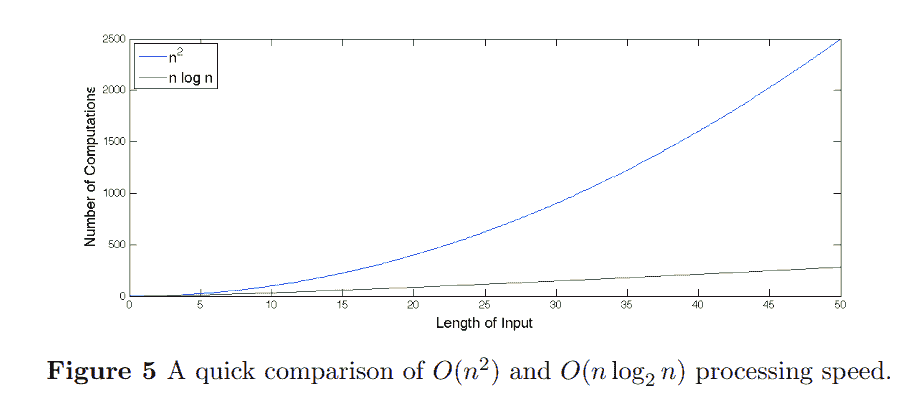

([source](https://scholarship.claremont.edu/cgi/viewcontent.cgi?referer=https://www.google.com/&httpsredir=1&article=1142&context=jhm))

如果我们使用采样频率为 11025 Hz 的音频，在一首三分钟的歌曲中，大约有 2，000，000 个输入点。在这种情况下，$ O(n.log(n)) $ FFT 算法提供了数据的频率表示:

$ $ \frac{n^{2}}{n.log_{2}(n)} = \ frac {(2 10^{6})^{2}}{(2 10^{6}).log_{2}(2 10^{6})} $$

快 10 万倍！

尽管今天有很多算法的变体，但最常用的是库利-塔克 FFT 算法。最简单的形式是基 2 时间抽取(DIT) FFT，它首先计算偶数索引输入和奇数索引输入的 DFT，然后将这两个结果合并，产生整个序列的 DFT。然后可以递归地执行这个想法，将总运行时间减少到 O( *N* log *N* )。他们利用 DFT 算法中的对称性来提高运算速度。还有更通用的实现，但是当输入大小是 2 的幂时，更常用的实现效果更好。

## 短时傅立叶变换

利用傅立叶变换，我们将信号从时域转换到频域。在这样做的时候，我们看到每个时间点是如何在每个频率上相互作用的。短时傅立叶变换是针对相邻的时间点而不是整个信号进行的。这是通过利用以特定跳跃长度跳跃的窗口函数来实现的，以给出频域值。

设$ x $是长度为$ L $的信号，而$ w $是长度为$ N $的窗口函数。那么最大帧索引$ M $将是$ \frac{L - N}{N}$。$ X(m，k) $将表示在$m^{th}$时间帧的$ k^{th} $傅立叶系数。定义的另一个参数是$ H $，称为跳数。它决定了窗函数的步长。

那么 STFT $ X(m，k) $由下式给出:

$$ X(m，k) = \sum_{n = 0}^{N - 1} x[n + m.H]。w[n]。e^{\frac{-2 \pi i}{N}k n} $$有各种各样的窗口函数可供选择；汉恩、海明、布莱克曼、布莱克曼-哈里斯、高斯等。

STFT 可以为我们分析提供丰富的视觉表示，称为声谱图。声谱图是 STFT $ X(m，k) $的平方的二维表示，可以给我们重要的[视觉洞察](https://www.izotope.com/en/learn/understanding-spectrograms.html)一段音频的哪些部分听起来像嗡嗡声、嗡嗡声、嘶嘶声、滴答声或爆裂声，或者是否有任何间隙。

## 熔融标度

到目前为止，我们已经掌握了分析声音的不同方法，假设它是线性的。然而，我们对声音的感知不是线性的。事实证明，我们可以更好地区分低频和高频。为了捕捉这一点， [Mel 标度](https://archive.is/20130414065947/http://asadl.org/jasa/resource/1/jasman/v8/i3/p185_s1)被提出作为一种变换，来表示我们对声音的感知认为是频率的线性发展。

将频率从赫兹转换到梅尔的一个常用公式是:

$$ m = 2595。log_{10}(1 + \frac{f}{700}) $$

还有其他不太受欢迎的尝试来定义心理声学感知的尺度，如[吠声尺度](https://en.wikipedia.org/wiki/Bark_scale)。心理声学比我们在这里讨论的要多得多，比如人耳如何工作，我们如何感知响度、音色、速度和节拍，听觉掩蔽，双耳节拍，HRTFs 等。如果你感兴趣，[这个](https://umotion.univ-lemans.fr/media/filer_public/3f/d9/3fd9a4ba-7369-4f13-b720-3b49a64991e2/denorms_ts3_jambrosic.pdf)、[这个](https://plato.stanford.edu/entries/perception-auditory/)和[这个](https://asa.scitation.org/doi/pdf/10.1121/1.4800482)可能是很好的入门资源。

当然，有一些与 Mel 量表相关的批评，关于如何控制实验来创建量表，以及结果是否有偏差。在音乐人和非音乐人身上的测试是平等的吗？每个人对他们所感知的线性事物的主观看法真的是决定人类感知行为的好方法吗？

不幸的是，我们不会再深入讨论偏见了。取而代之，我们将采用 Mel 标度，并以某种方式应用它，这样我们就可以获得类似于声谱图的表示，这是先前由 STFTs 促成的。

## 滤波器组和 MFCCs

MFCCs 或 Mel 频率倒谱系数已经成为表示声音的流行方式。简而言之，MFCCs 的计算方法是:对音频信号应用预加重滤波器，获取该信号的 STFT，应用基于 mel 比例的滤波器组，进行 DCT(离散余弦变换)，然后归一化输出。有很多大词，所以让我们打开它。

预加重滤波器是一种使用信号的加权单阶时间差来稳定音频信号的方法。

$$ y(t) = x(t) - \alpha x(t - 1) $$

滤波器组是一组三角波形。这些三角形滤波器被应用于 STFT 以提取功率谱。滤波器组中的每个滤波器都是三角形，在中心的幅度为 1，在下一个滤波器组的中心频率的中心，频率线性降低到 0。

这是 20Hz 至 4kHz 之间的一组 20-40 个三角滤波器，我们将其应用于从预加重滤波信号的 STFT 获得的周期图功率谱估计。我们的滤波器组以与滤波器数量一样多的向量的形式出现，每个向量的大小与傅立叶变换中的频率数量相同。每个矢量大部分是零，但对于光谱的某一部分是非零的。为了计算滤波器组能量，我们将每个滤波器组乘以功率谱，然后将系数相加。

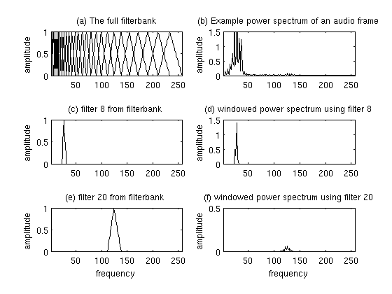

([source](http://practicalcryptography.com/miscellaneous/machine-learning/guide-mel-frequency-cepstral-coefficients-mfccs/))

你可以在这里和这里了解他们[和](https://haythamfayek.com/2016/04/21/speech-processing-for-machine-learning.html)[。](http://practicalcryptography.com/miscellaneous/machine-learning/guide-mel-frequency-cepstral-coefficients-mfccs/)

最后，经过处理的滤波器组经过离散余弦变换。信号的离散余弦可以表示如下:

$ $ x _ { k } = \ sum _ { n = 0}^{n-1 } x _ { n } cos[\ frac { \ pi } { n }(n+\ frac { 1 } { n })k]$ $

其中$ k = 0，....，N - 1 美元。

## libros 简介

让我们把手弄脏吧。Librosa 是一个 Python 库，我们将使用它来浏览我们在过去几节中学习的理论。

```py
sudo apt-get update
sudo apt-get install ffmpeg
pip install librosa
```

让我们打开一个 mp3 文件。因为它看起来很合适，所以我想试试 Datarock 的歌曲 Fa Fa...来自专辑《数据摇滚》。

```py
import librosa
from matplotlib import pyplot as plt

x, sampling_rate = librosa.load('./Datarock-FaFaFa.mp3')
print('Sampling Rate: ', sampling_rate)
plt.figure(figsize=(14, 5))
plt.plot(x[:sampling_rate * 5])
plt.title('Plot for the first 5 seconds')
plt.xlabel('Frame number')
plt.ylabel('Magnitude')
plt.show()
```

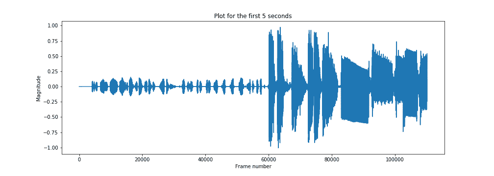

这就是我们的时域信号。`librosa`使用的默认采样率是 22050，但是你可以通过任何你喜欢的。

```py
x, sampling_rate = librosa.load('./Datarock-FaFaFa.mp3', sr=44100)
print('Sampling Rate: ', sampling_rate)
plt.figure(figsize=(14, 5))
plt.plot(x[:sampling_rate * 5])
plt.title('Plot for the first 5 seconds')
plt.xlabel('Frame number')
plt.ylabel('Magnitude')
plt.show()
```

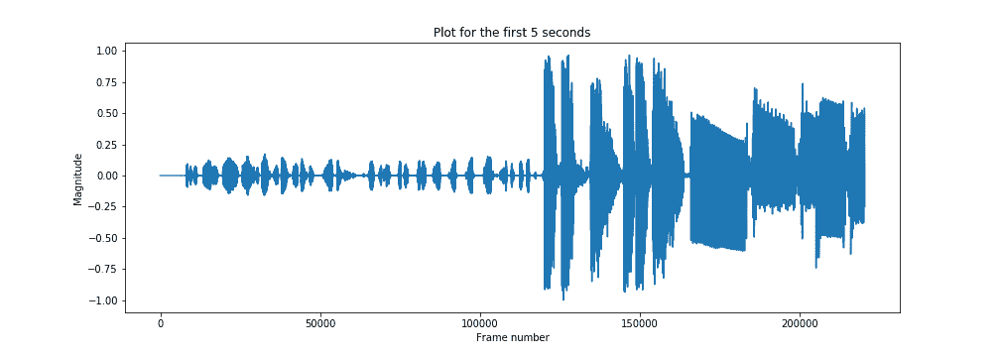

在采样比率参数中传递空值会返回以本机采样比率加载的文件。

```py
x, sampling_rate = librosa.load('./Datarock-FaFaFa.mp3', sr=None)
print('Sampling Rate: ', sampling_rate)
```

这给了我:

```py
Sampling Rate: 44100
```

`librosa`模块中提供了一个绘图功能`librosa.display` 也是。

```py
import librosa.display

plt.figure(figsize=(14, 5))
librosa.display.waveplot(x[:5*sampling_rate], sr=sampling_rate)
plt.show()
```

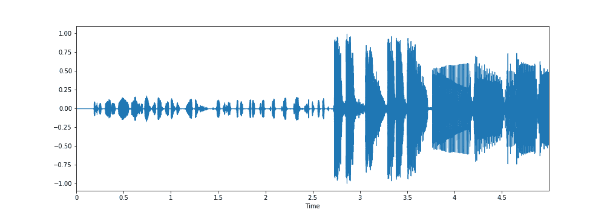

我不知道为什么`librosa.display`能够捕捉到某些超过 3.5 秒的轻微波动，而`matplotlib`图却没有捕捉到。

`librosa`也有一堆例子音频文件，可以用于实验。您可以使用以下命令查看该列表。

```py
librosa.util.list_examples()
```

输出:

```py
AVAILABLE EXAMPLES
--------------------------------------------------------------------
brahms    	Brahms - Hungarian Dance #5
choice    	Admiral Bob - Choice (drum+bass)
fishin    	Karissa Hobbs - Let's Go Fishin'
nutcracker	Tchaikovsky - Dance of the Sugar Plum Fairy
trumpet   	Mihai Sorohan - Trumpet loop
vibeace   	Kevin MacLeod - Vibe Ace
```

您可以使用 iPython 显示器在 Jupyter 笔记本上播放音频文件，如下所示:

```py
import IPython.display as ipd

example_name = 'nutcracker' 
audio_path = librosa.ex(example_name)
ipd.Audio(audio_path, rate=sampling_rate)
```

您可以提取音频样本的采样速率和持续时间，如下所示。

```py
x, sampling_rate = librosa.load(audio_path, sr=None)
sampling_rate = librosa.get_samplerate(audio_path)
print('sampling rate: ', sampling_rate)
duration = librosa.get_duration(x)
print('duration: ', duration)
```

输出是:

```py
sampling rate:  22050
duration:  119.87591836734694
```

绘制基于 STFT 的谱图可以如下进行:

```py
from matplotlib import pyplot as plt

S = librosa.stft(x)
fig = plt.figure(figsize=(12,9))
plt.title('STFT Spectrogram (Linear scale)')
plt.xlabel('Frame number')
plt.ylabel('Frequency (Hz)')
plt.pcolormesh(np.abs(S))
plt.savefig('stft-plt.png')
```

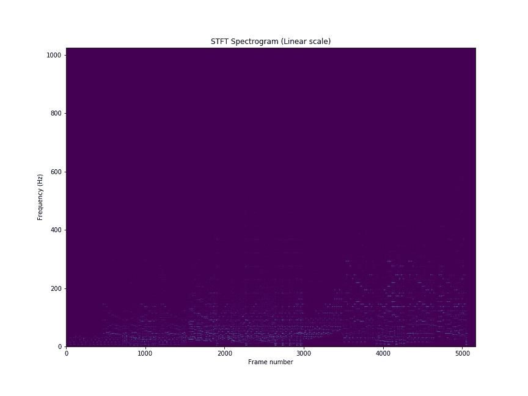

您也可以使用`librosa`功能绘制光谱图。

```py
fig, ax = plt.subplots(figsize=(15,9))
img = librosa.display.specshow(S, x_axis='time',
                         y_axis='linear', sr=sampling_rate,
                         fmax=8000, ax=ax)
fig.colorbar(img, ax=ax, format='%+2.0f dB')
ax.set(title='STFT linear scale spectrogram')
plt.savefig('stft-librosa-linear.png')
```

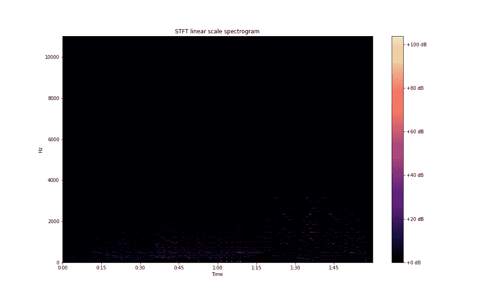

## 光谱特征

为了开始理解声音信号中的频率是如何变化的，我们可以从查看音频剪辑的**频谱质心**开始。这些表示光谱的质量中心的位置。感觉上，它与声音的[亮度](https://en.wikipedia.org/wiki/Brightness_(sound))的印象有着紧密的联系。

```py
plt.plot(librosa.feature.spectral_centroid(x, sr=sampling_rate)[0])
plt.xlabel('Frame number')
plt.ylabel('frequency (Hz)')
plt.title('Spectral centroids')
plt.show()
```

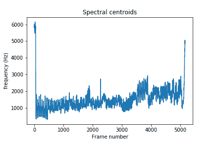

你也可以将质心与声音随时间变化的频谱带宽进行比较。**光谱带宽**计算如下:

$$ (\sum_k S[k，t] * (freq[k，t]-centroid[t])^{p})^{\frac{1}{p}} $ $

其中$ k $是频率仓索引，$ t $是时间索引，$ S [k，t] $是频率仓$ k $和时间$ t $处的 STFT 幅度，$ freq[k，t] $是频率仓$ k $和时间$ t $处的频率，$ centroid $是时间$ t $处的频谱质心，最后$ p $是提高频谱质心偏差的功率。`librosa`的$ p $的默认值是$ 2 $。

```py
spec_bw = librosa.feature.spectral_bandwidth(x, sr=sampling_rate)
plt.xlabel('Frame number')
plt.ylabel('frequency (Hz)')
plt.title('Spectral bandwidth')
plt.show()
```

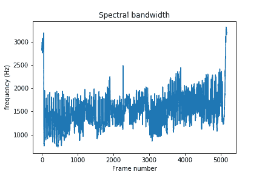

您也可以通过运行以下代码来可视化质心的偏差:

```py
times = librosa.times_like(spec_bw)
centroid = librosa.feature.spectral_centroid(S=np.abs(S))

fig, ax = plt.subplots(figsize=(15,9))
img = librosa.display.specshow(S_dB, x_axis='time',
                         y_axis='log', sr=sampling_rate,
                         fmax=8000, ax=ax)
fig.colorbar(img, ax=ax, format='%+2.0f dB')
ax.set(title='Spectral centroid plus/minus spectral bandwidth')
ax.fill_between(times, centroid[0] - spec_bw[0], centroid[0] + spec_bw[0],
                alpha=0.5, label='Centroid +- bandwidth')
ax.plot(times, centroid[0], label='Spectral centroid', color='w')
ax.legend(loc='lower right')
plt.savefig('centroid-vs-bw-librosa.png')
```

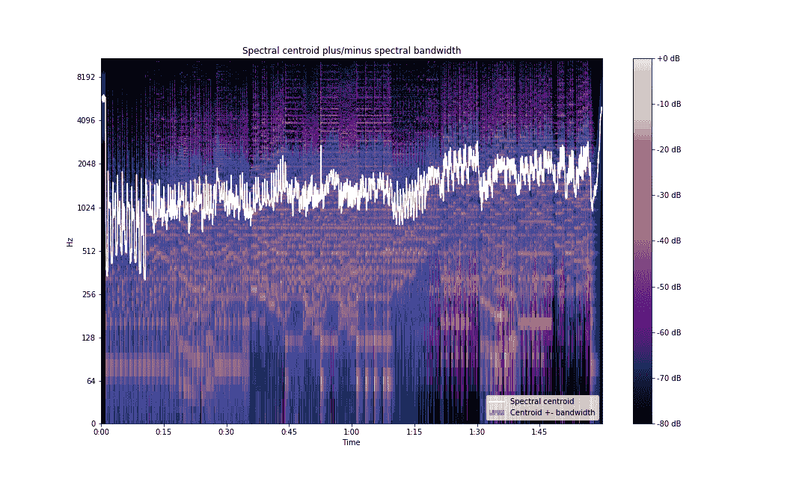

我们也可以看看光谱对比。**光谱对比度**定义为光谱中波峰和波谷之间的水平差。谱图$S$的每一帧都被分成子带。对于每个子带，通过比较顶部四分位数的平均能量(峰值能量)和底部四分位数的平均能量(谷值能量)来估计能量对比。能量取决于功率谱图和窗口函数及大小。

```py
contrast = librosa.feature.spectral_contrast(S=np.abs(S), sr=sampling_rate)
```

绘制对比度图以显示频带:

```py
fig, ax = plt.subplots(figsize=(15,9))
img2 = librosa.display.specshow(contrast, x_axis='time', ax=ax)
fig.colorbar(img, ax=ax, format='%+2.0f dB')
ax.set(ylabel='Frequency bands', title='Spectral contrast')
plt.savefig('spectral-contrast-librosa.png')
```

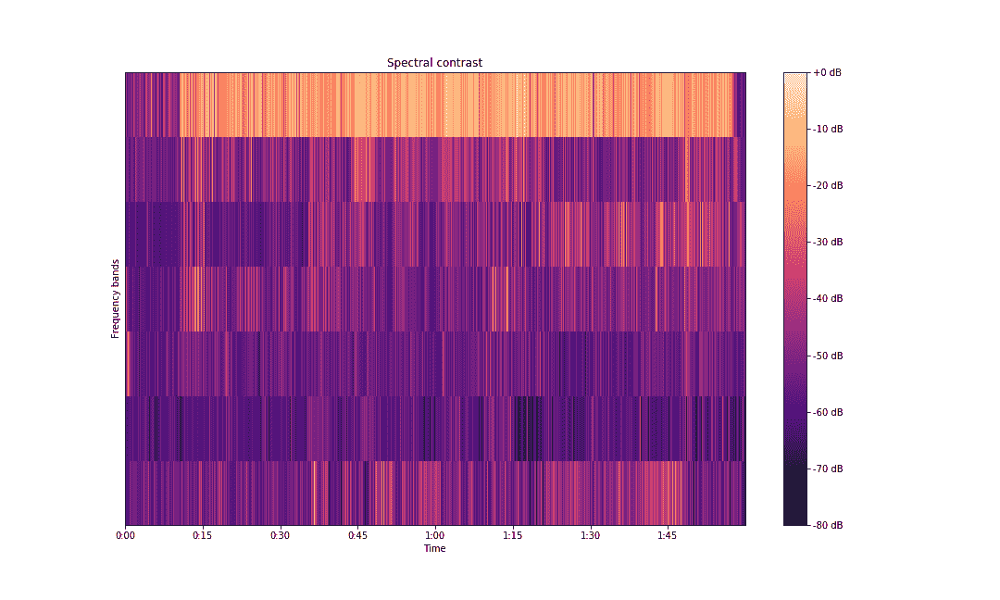

还有更多光谱特征。你可以在这里阅读更多关于他们的信息。

## 理解光谱图

线性标度谱图不能非常清晰地捕捉信息。有更好的方式来表达这些信息。`librosa`允许我们在对数标度上绘制光谱图。为此，请将上面的代码更改为:

```py
S = librosa.stft(x)
fig, ax = plt.subplots(figsize=(15,9))
img = librosa.display.specshow(S, x_axis='time',
                         y_axis='log', sr=sampling_rate,
                         fmax=8000, ax=ax)
fig.colorbar(img, ax=ax, format='%+2.0f dB')
ax.set(title='STFT log scale spectrogram')
plt.savefig('stft-librosa-log.png')
```


直接利用 STFT 矩阵来绘图并不能给我们明确的信息。通常的做法是通过对矩阵求平方来将幅度谱图转换成功率谱图。接下来，将频谱图中的功率转换为相对于参考功率的分贝数，可以提高数据的可视性。

分贝的计算公式如下:

$ $ A = 10 * log _ { 10 }(\ frac { P _ { 2 } } { P _ { 1 } })$ $

其中$ P_{1} $是参考功率，$ P_{2} $是测量值。

API 中有两个函数允许我们进行这些计算。`librosa.core.power_to_db`进行上面提到的计算。函数`librosa.core.amplitude_to_db`也处理声谱图从振幅到功率的转换，在转换成分贝之前对所述声谱图求平方。在此转换后绘制 STFTs，我们可以得到以下图形。

```py
S_dB = librosa.amplitude_to_db(S, ref=np.max)
fig, ax = plt.subplots(figsize=(15,9))
img = librosa.display.specshow(S_dB, x_axis='time',
                         y_axis='linear', sr=sampling_rate,
                         fmax=8000, ax=ax)
fig.colorbar(img, ax=ax, format='%+2.0f dB')
ax.set(title='STFT (amplitude to DB scaled) linear scale spectrogram')
plt.savefig('stft-librosa-linear-db.png')
```

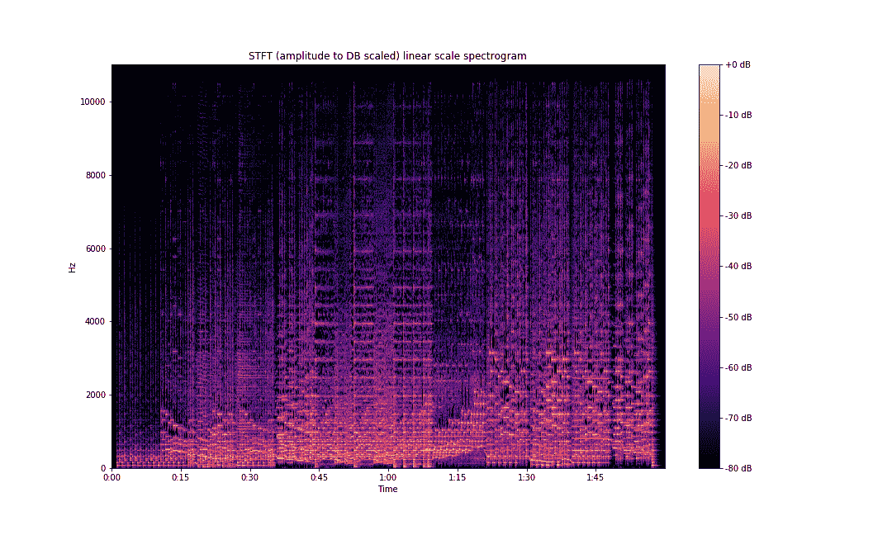

在对数标度中:

```py
S_dB = librosa.amplitude_to_db(S, ref=np.max)
fig, ax = plt.subplots(figsize=(15,9))
img = librosa.display.specshow(S_dB, x_axis='time',
                         y_axis='log', sr=sampling_rate,
                         fmax=8000, ax=ax)
fig.colorbar(img, ax=ax, format='%+2.0f dB')
ax.set(title='STFT (amplitude to DB scaled) log scale spectrogram')
plt.savefig('stft-librosa-log-db.png')
```

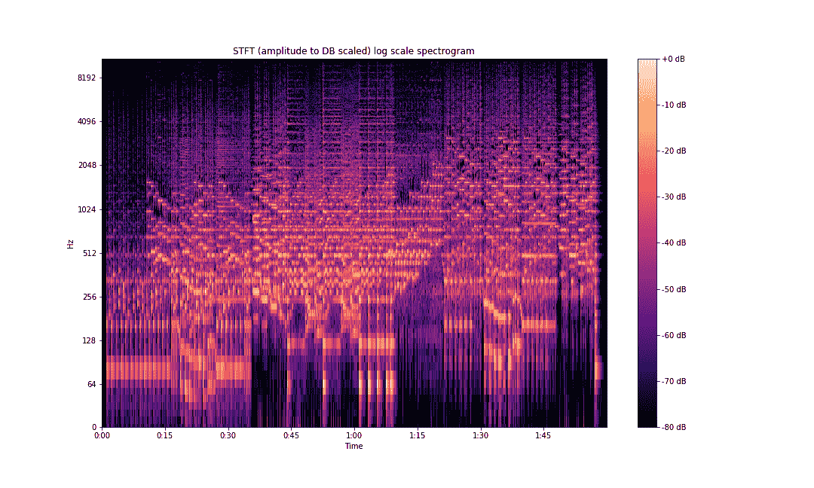

从上面可以看出，与我们的初始图相比，频率信息要清晰得多。

正如我们之前讨论的，人类的声音感知不是线性的，我们能够区分低频比高频好得多。这是由 mel 标尺捕捉的。`librosa.display.specshow`还提供了 mel 比例绘制功能。

```py
fig, ax = plt.subplots(figsize=(15,9))
img = librosa.display.specshow(S_dB, x_axis='time',
                         y_axis='mel', sr=sampling_rate,
                         fmax=8000, ax=ax)
fig.colorbar(img, ax=ax, format='%+2.0f dB')
ax.set(title='Mel scaled STFT spectrogram')
plt.savefig('stft-librosa-mel.png')
```

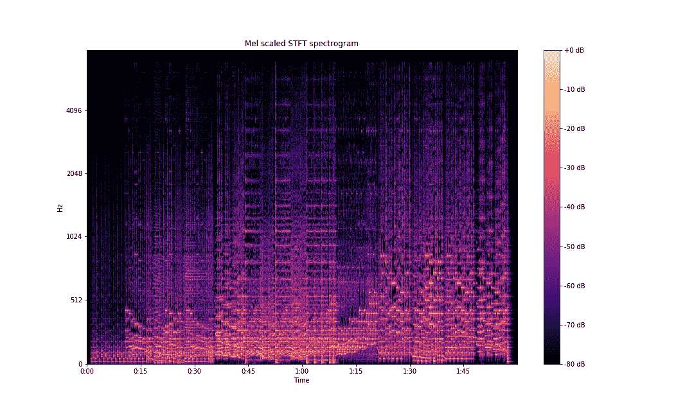

这与梅尔光谱图不同。正如我们之前所了解的，mel 谱图是通过将功率谱图乘以 mel 滤波器计算出来的。

也可以使用 librosa 来生成 mel 过滤器。

```py
n_fft = 2048 # number of FFT components
mel_basis = librosa.filters.mel(sampling_rate, n_fft) 
```

使用以下过滤器计算 mel 光谱图:

```py
mel_spectrogram = librosa.core.power_to_db(mel_basis.dot(S**2)) 
```

在它的 API 中有一个可以直接使用的 mel spectrograms 的包装器。它将时域波形作为输入，并给出 mel 频谱图。它可以按如下方式实现:

```py
mel_spectrogram = librosa.power_to_db(librosa.feature.melspectrogram(x, sr=sampling_rate))
```

对于绘制 mel 光谱图:

```py
fig, ax = plt.subplots(figsize=(15,9))
img = librosa.display.specshow(mel_spectrogram, x_axis='time',
                         y_axis='mel', sr=sampling_rate,
                         fmax=8000, ax=ax)
fig.colorbar(img, ax=ax, format='%+2.0f dB')
ax.set(title='Mel-frequency (power to DB scaled) spectrogram')
plt.savefig('mel-spec-librosa-db.png')
```

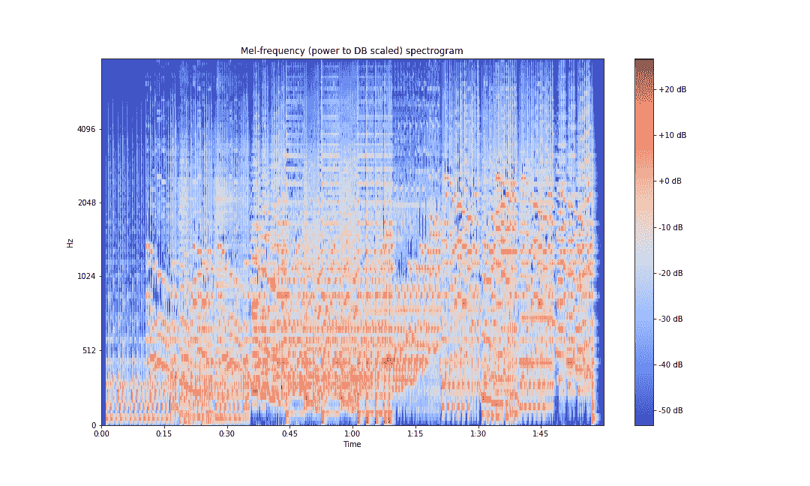

为了计算 MFCCs，我们采用离散余弦变换。

```py
import scipy
mfcc = scipy.fftpack.dct(mel_spectrogram, axis=0)
```

再次为 MFCC 实现了一个包装器，它可以用来获得 MFCC 数组和绘图。

```py
mfcc = librosa.core.power_to_db(librosa.feature.mfcc(x, sr=sampling_rate))
fig, ax = plt.subplots(figsize=(15,9))
img = librosa.display.specshow(mfcc, x_axis='time',
                         y_axis='mel', sr=sampling_rate,
                         fmax=8000, ax=ax)
fig.colorbar(img, ax=ax, format='%+2.0f dB')
ax.set(title='MFCCs')
plt.savefig('mfcc-librosa-db.png')
```

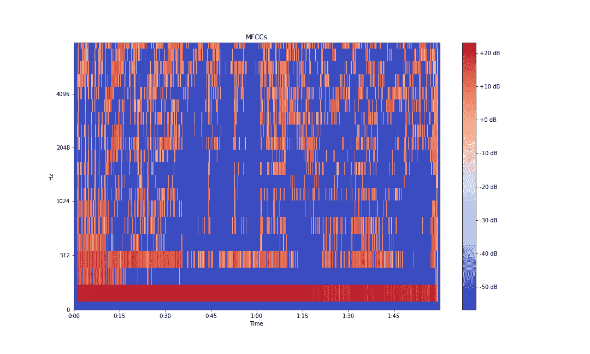

[通常为](https://opensource.com/article/19/9/audio-processing-machine-learning-python)，从梅尔倒谱中提取的前 13 个系数称为 MFCCs。这些包含关于音频的非常有用的信息，通常用于训练机器学习模型。

## 结论

在本文中，我们学习了音频信号、时域和频域、傅立叶变换和 STFTs。我们学习了梅尔标度和倒谱，或梅尔光谱图。我们还了解了几个光谱特征，如光谱质心、带宽和对比度。

在这个两部分系列的下一部分，我们将研究音高、八度音阶、和弦、色度表示、节拍和速度特征、开始检测、时间分段和声谱图分解。

我希望这篇文章对你有用。