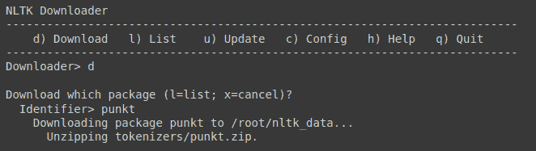
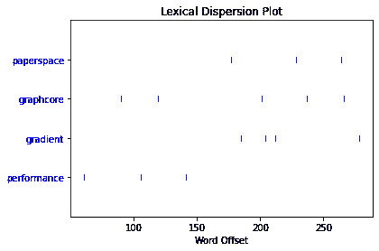
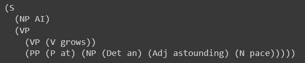
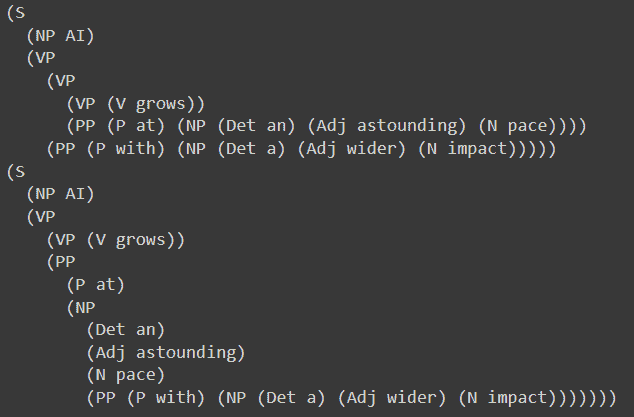
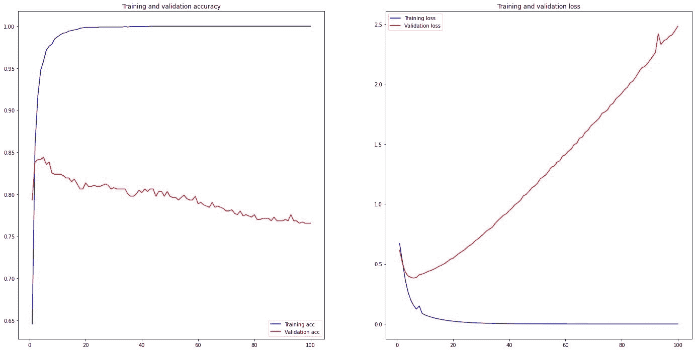
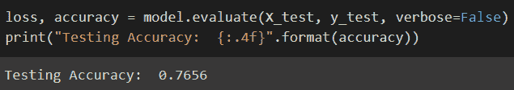

# 使用 NLTK 的自然语言处理简介

> 原文：<https://blog.paperspace.com/introduction-to-natural-language-processing-using-nltk/>

自然语言处理(NLP)学科的目标是使计算机程序能够理解和利用自然人类语言。为了用 Python 实现 NLP 过程，有一个叫做 NLTK 的工具包。它为我们提供了各种文本处理包和大量的测试数据集。使用 NLTK，可以完成一系列操作，包括标记化和可视化解析树。在本文中，我们将介绍如何在图纸空间渐变中设置 NLTK，并利用它在文本处理阶段执行各种 NLP 操作。然后，我们将借助一些用于情感分析文本分类的 NLTK 工具创建一个 Keras 模型。

## 什么是自然语言处理？

自然语言处理(NLP)是软件对自然语言的自主操作，包括语音和文本。

语言学、计算机科学和人工智能的这一分支管理计算机和人类语言之间的交互，特别是如何训练计算机处理和解释大量自然语言数据。

在过去的几十年里，自然语言处理领域取得了重大进展。从**符号 NLP** 开始，20 世纪 50 年代到 90 年代初，计算机用它来模拟自然语言理解。然后是**统计 NLP** 时代，从 20 世纪 90 年代持续到 2010 年代，见证了新的统计 NLP 方法的引入，最近强调了机器学习算法。**深度神经网络**技术已经发展到现在广泛应用于自然语言处理的地步。在本教程中，我们将介绍该领域的统计和神经阶段的前沿技术。

虽然人工智能和自然语言处理这两个术语可能会让人联想到尖端机器人的概念，但在我们的日常生活中，已经有简单而基本的自然语言处理实例在工作。这里有几个众所周知的例子:

*   垃圾邮件过滤和分类
*   智能助手和家庭自动化中心，如 Alexa、Siri 和 Ok Google
*   搜索引擎(谷歌，必应，...)
*   文本预测，如自动更正和自动完成

## 设置 NLTK

创建使用人类语言数据的 Python 程序的最流行的平台是 NLTK。除了用于分类、标记化、词干化、标记、解析和语义推理的文本处理库，它还为 50 多种大型结构化文本(语料库)和词汇资源提供了简单的接口，包括 WordNet，这是一个包含 200 多种语言中单词之间语义关系的词汇数据库。

让我们从设置 NLKT 库以及 Numpy 和 Matplotlib 开始，我们可能还需要这些库来进行额外的处理。

```py
!pip install nltk
!pip install numpy
!pip install matplotlib
```

然后，让我们下载一个稍后将在处理示例中使用的语料库:

```py
import nltk
nltk.download()
```

使用命令 **d** 我们可以选择下载命令，然后输入数据集的标识符，在我们的例子中，我们输入了 **punkt。**



Live NLTK dataset download process

我们也可以直接下载数据集，不需要浏览语料库列表。

```py
import nltk
nltk.download("punkt")
nltk.download("averaged_perceptron_tagger")
nltk.download("stopwords")
```

对于本教程，我们将使用三个主要数据集:

*   **punkt** :英语预训练分词器
*   **averaged _ perceptron _ tagger**:预先训练好的英语词性标注器
*   **停用词**:179 个英文停用词的预定义列表，这些停用词对文本的意义没有什么影响，例如“I”、“a”和“the”

然后，让我们定义我们将在本教程中操作的文本。我们将在我们的[主页](https://www.paperspace.com)中使用 Paperspace 介绍性文本。

```py
text = "Paperspace is built for the future where hardware and software are 
inextricably linked. Our tools provide a seamless abstraction layer that 
radically simplifies access to accelerated computing. The Paperspace 
stack removes costly distractions, enabling individuals & organizations 
to focus on what matters. "
```

一旦你完成了这个阶段，让我们深入到各种 NLTK 过程。

## 标记化

标记化是将字符串转换为词汇标记列表的过程，词汇标记是具有指定和识别的含义的字符串。词法分析器、标记器和扫描器是进行词法分析的软件工具的名称；然而，术语“扫描器”也可以指记号赋予器的初始阶段。典型地，记号赋予器和解析器一起使用来研究编程语言、网页和其他类型文档的语法。

因此，在标记化中，我们使用词法分析将大量材料分解成段落、短语和单词。它需要识别和检查单词的结构。

使用 NLTK，我们可以执行两种类型的文本标记化:

*   单词标记化:将文本的所有句子分解成单词。
*   句子标记化:如果句子不止一个，我们可以把句子分解成一个句子列表。

**单词标记化**

在对文本进行标记之前，始终将文本转换为小写是一个好习惯。

```py
text = text.lower()
word_tokens = nltk.word_tokenize(text)
print (word_tokens)
```

这会产生以下输出:

```py
['paperspace', 'is', 'built', 'for', 'the', 'future', 'where', 'hardware',
'and', 'software', 'are', 'inextricably', 'linked', '.', 'our', 'tools', 
'provide', 'a', 'seamless', 'abstraction', 'layer', 'that', 'radically', 
'simplifies', 'access', 'to', 'accelerated', 'computing', '.', 'the', 
'paperspace', 'stack', 'removes', 'costly', 'distractions', ',', 
'enabling', 'individuals', '&', 'organizations', 'to', 'focus', 'on', 
'what', 'matters', '.']
```

**句子标记化**

```py
text = text.lower()
sentence_tokens = nltk.sent_tokenize(text)
print (sentence_tokens)
```

这会产生以下输出:

```py
['paperspace is built for the future where hardware and software are 
inextricably linked.', 'our tools provide a seamless abstraction layer 
that radically simplifies access to accelerated computing.', 'the 
paperspace stack removes costly distractions, enabling individuals & 
organizations to focus on what matters.']
```

## 停止单词删除

停用词是添加到句子中以增加语言流畅性的词，一般不会添加任何附加信息。因此，在标记化过程之后删除它们是一个很好的做法。

使用下载的停用词集和 NLTK，我们可以清理单词标记化列表:

```py
from nltk.corpus import stopwords
stopword = stopwords.words('english')
word_tokens_cleaned = [word for word in word_tokens if word not in stopword]
print (word_tokens_cleaned)
```

这会产生以下输出:

```py
['paperspace', 'built', 'future', 'hardware', 'software', 'inextricably', 
'linked', '.', 'tools', 'provide', 'seamless', 'abstraction', 'layer', 
'radically', 'simplifies', 'access', 'accelerated', 'computing', '.', 
'paperspace', 'stack', 'removes', 'costly', 'distractions', ',', 
'enabling', 'individuals', '&', 'organizations', 'focus', 'matters', '.']
```

## 词汇化

词汇化考虑了单词的形态评估。要做到这一点，有一个全面的字典是必不可少的，算法可以使用它来连接单词和它的引理。例如，词汇化是在聊天机器人环境中理解消费者问题的最佳技术之一。聊天机器人能够理解每个单词的上下文形式，因为这种方法的形态分析允许它更好地理解整个短语的整体意思。

语言学是这种方法论的关键。为了获得正确的词条，需要查看每个单词的词法分析。为了提供这种分析，每种语言的词典都是必要的。

下面是 word 的两个例子及其提取的词条。

| 单词 | 引理 |
| --- | --- |
| 隐藏所 | 隐藏物 |
| 研究 | 研究 |

要使用 NTLK 提供的词汇化方法，我们首先需要下载开放多语言 Wordnet (omw)集。这个过程在 linux 环境中应该是明确的，这是像 Paperspace 的 gradient 这样的云机器学习服务的情况。

```py
nltk.download("omw-1.4")
nltk.download("wordnet")
```

然后我们可以对整个文本进行词条解释:

```py
from nltk.stem.wordnet import WordNetLemmatizer

wordnet_lemmatizer = WordNetLemmatizer()
lemmatized_tokens = [wordnet_lemmatizer.lemmatize(token) for token in word_tokens_cleaned]
print(lemmatized_tokens)
```

结果输出如下

```py
['paperspace', 'built', 'future', 'hardware', 'software', 'inextricably', 
'linked', '.', 'tool', 'provide', 'seamless', 'abstraction', 'layer', 
'radically', 'simplifies', 'access', 'accelerated', 'computing', '.', 
'paperspace', 'stack', 'remove', 'costly', 'distraction', ',', 
'enabling', 'individual', '&', 'organization', 'focus', 'matter', '.']
```

我们可以注意到主要的变化是像`'tools'`和`'individuals'`这样的复数单词变成了单数`'tool'`和`'individual'`。

但是基本上大多数单词的词条化版本看起来和它的词条没有太大的不同。这是因为这篇文章是以信息的语气写的，没有使用任何奇怪的含义。

## 堵塞物

词干算法通过从单词的开头或结尾移除单词的部分，同时考虑可以在屈折单词中找到的频繁出现的前缀和后缀的列表来操作。这种策略有很大的局限性，因为尽管这种不加选择的切割在某些情况下是有效的，但并不总是如此。

虽然还有其他词干算法，但在英语中使用最多的是 **Porter stemmer** 。该算法的[规则](https://vijinimallawaarachchi.com/2017/05/09/porter-stemming-algorithm/)分为五个阶段，编号从 1 到 5。这些指南旨在将单词分解成基本成分。

这里有几个词干例子:

| 单词 | 阻止 |
| --- | --- |
| 隐藏所 | 察赫 |
| 研究 | 工作室 |

NLTK 还提供波特斯特梅尔模块

```py
from nltk.stem.porter import PorterStemmer
stemmed_tokens = [PorterStemmer().stem(token) for token in word_tokens_cleaned]
print(stemmed_tokens)
```

当应用于我们的标记化文本时，会产生以下结果:

```py
['paperspac', 'built', 'futur', 'hardwar', 'softwar', 'inextric', 'link', 
'.', 'tool', 'provid', 'seamless', 'abstract', 'layer', 'radic', 
'simplifi', 'access', 'acceler', 'comput', '.', 'paperspac', 'stack', 
'remov', 'costli', 'distract', ',', 'enabl', 'individu', '&', 'organ', 
'focu', 'matter', '.']
```

创建词干分析器比创建词汇分析器容易得多。在后一种情况下，深入的语言学知识对于开发允许算法搜索单词的正确形式的字典是必要的。

## 词性标注

词性(POS)标签使我们能够识别每个单词的标签，例如它的名词、形容词或其他分类。

```py
pos_tag = nltk.pos_tag(word_tokens_cleaned)
print(pos_tag)
```

使用这种方法，我们可以评估一个词类在所分析的文本中的存在。

```py
[('paperspace', 'NN'), ('built', 'VBN'), ('future', 'JJ'), ('hardware', 
'NN'), ('software', 'NN'), ('inextricably', 'RB'), ('linked', 'VBN'), 
('.', '.'), ('tools', 'NNS'), ('provide', 'VBP'), ('seamless', 'JJ'), 
('abstraction', 'NN'), ('layer', 'NN'), ('radically', 'RB'), 
('simplifies', 'VBZ'), ('access', 'NN'), ('accelerated', 'VBD'), 
('computing', 'VBG'), ('.', '.'), ('paperspace', 'NN'), ('stack', 'NN'), 
('removes', 'VBZ'), ('costly', 'JJ'), ('distractions', 'NNS'), (',', 
','), ('enabling', 'VBG'), ('individuals', 'NNS'), ('&', 'CC'), 
('organizations', 'NNS'), ('focus', 'VBP'), ('matters', 'NNS'), ('.', 
'.')]
```

例如，这种分析对于分析流畅性的编辑工具是有用的。例如，使用词性标注，我们可以检查我们是否在文本中使用了正确数量的副词..

## 词频分布

词频是自然语言处理中使用的另一种方法。它可以用作诸如情感分析或文本分类等任务的附加特征。你可以通过建立频率分布来确定哪些术语在你的文本中出现得最频繁。

下面是如何使用 NLTK 的 **FreqDist** 模块创建频率分布:

```py
from nltk import FreqDist
frequency_distribution = FreqDist(lemmatized_tokens)
frequency_distribution.most_common(10)
```

使用这个库，我们提取了测试文本中 10 个最常见的词条:

```py
[('.', 3),
 ('paperspace', 2),
 ('built', 1),
 ('future', 1),
 ('hardware', 1),
 ('software', 1),
 ('inextricably', 1),
 ('linked', 1),
 ('tool', 1),
 ('provide', 1)]
```

## 离差图

DispersionPlot 可视化文本样本中单词的词汇分散。该图使用垂直线描绘了一个或多个搜索短语在整个内容中的出现，记录了与文本开头相比出现了多少个单词。

为了能够使用 NLTK 的 **dispersion_plot** 方法，我们必须确保安装了 *Matplotlib* 。

为了进行测试，我们使用了最新的 Graphcore 和 Paperspace 合作声明[中的文本来发布 IPU 云服务](https://blog.paperspace.com/paperspace-graphcore-partnership/)

```py
from nltk.text import Text
from nltk.draw import dispersion_plot

tokens = nltk.word_tokenize(text.lower())
nltk_text = Text(tokens)
words = ["paperspace","graphcore","gradient","performance"]
dispersion_plot(nltk_text,words,ignore_case=True)
```

这导致了下面的色散图



Dispersion plot of common keywords in graphcore announcement article

我们可以看到我们的联合创始人丹尼尔·科布兰如何使用关键字 **paperspace** 、**、graphcore** 和 **gradient** ，并确保在文本中均匀分布，以保持读者参与主题。我们还可以看到，最后的 50 个单词包含了三个主要的关键词，这是一个很好的写作锚定技巧。

从这个例子中，我们可以看到这种分析的重要性，尤其是对像一本书或一篇论文这样的长文本。使用频率分布和离差图，我们可以对作者在写作中推动的主要思想有一个基本的概念。

## 语法树生成

我们还可以定义一组语法规则，然后使用 NLTK **ChartParser** 从句子中提取所有词性。这些语法规则只是以 NLTK 可以理解的方式组织的英语的程序性表述。然后我们可以为给定的句子和规则集生成一个语法树。

```py
sentence = "AI grows at an astounding pace"
sentence_tokens = nltk.word_tokenize(sentence)
groucho_grammar = nltk.CFG.fromstring("""
  S -> NP VP
  PP -> P NP
  NP -> Det N | Det Adj N | Det N PP | Det Adj N PP | 'AI'
  VP -> V NP | VP PP | V
  Det -> 'an'
  Adj -> 'astounding'
  N -> 'pace'
  V -> 'grows'
  P -> 'at'
  """)
parser = nltk.ChartParser(groucho_grammar)
for tree in parser.parse(sentence_tokens):
  print(tree)
```

提取的树如下:



Generated Syntax Tree

对于更复杂的句子，解析器会返回不止一棵树:
***【AI 发展速度惊人影响更广】***



Generated Syntax Tree

语法树生成工具，如离差图和频率分布，对于构建验证给定文本的流畅性和语言水平的程序非常有用。面向初级阅读水平的读者的文本可能具有较少的语法缩进，但是语言知识更丰富的读者可能会接触到更复杂的结构。因此，语法树的生成对于区分两种类型的文本非常有用。

## 使用 Keras & NLTK 的情感分析

情感分析是一种自然语言处理(NLP)方法，用于评估数据是否具有积极、消极或中性的情感。情感分析经常在文本数据上进行，以帮助组织在消费者反馈中跟踪品牌和产品的情感，并理解客户需求。最近，它也被用于政治领域，以评估选民对政党宣言的反应。使用情感分析的其他分类任务是 twitter 帖子和电影及产品评论情感分类。

在本教程中，我们将使用 Keras 模型以及 **[UCI 情感标签句子数据集](https://archive.ics.uci.edu/ml/datasets/Sentiment+Labelled+Sentences)** ，来评估一些句子的情感。该数据集代表 3000 个句子及其相应的情感标签(1 代表积极情感，0 代表消极情感)。

让我们从下载数据集开始

```py
!curl https://raw.githubusercontent.com/adilmrk/Sentiment-Analysis-using-NLTK-Keras/main/sentiment_labelled_sentences.txt -o sentiment_labelled_sentences.txt
```

然后，我们将使用 **pandas** 读取数据，使用 NLTK 对所有句子进行标记化，然后进行词条化。之后，我们将数据集分为训练集和测试集，测试集占数据集大小的 25%。

对于每个句子，我们将把它转换成小写，然后对每个句子进行记号化，并使用 **WordNetLemmatizer** 对句子的每个记号进行记号化。在处理分类任务时，已经证明词汇化过程比词干化过程执行得好得多。

最后，修改过的句子集将被矢量化。Python 中的 scikit-learn 模块提供了一个名为**计数矢量器**的优秀工具。它用于根据每个单词在文本中出现的次数，将给定的文本转换为向量。

```py
import pandas as pd
from sklearn.model_selection import train_test_split
from sklearn.feature_extraction.text import CountVectorizer
from nltk.stem.wordnet import WordNetLemmatizer

data = pd.read_csv("sentiment_labelled_sentences.txt", names=['sentence', 'label'], sep='\t')
sentences = data['sentence'].values
y = data['label'].values

sentences = [ nltk.word_tokenize(sentence.lower()) for sentence in sentences]
wordnet_lemmatizer = WordNetLemmatizer()
sentences = [ " ".join([wordnet_lemmatizer.lemmatize(token) for token in sentence_tokens]) for sentence_tokens in sentences]

sentences_train, sentences_test, y_train, y_test = train_test_split(sentences, y, test_size=0.25, random_state=1000)
vectorizer = CountVectorizer()
vectorizer.fit(sentences_train)
X_train = vectorizer.transform(sentences_train)
X_test  = vectorizer.transform(sentences_test)
```

使用矢量器，我们可以为不同形状的短语创建相同大小的输入。

接下来，我们将使用等于矢量化句子大小的输入维度创建一个 Keras 序列模型。

```py
from keras.models import Sequential
from keras import layers

input_dim = X_train.shape[1]
model = Sequential()
model.add(layers.Dense(10, input_dim=input_dim, activation='relu'))
model.add(layers.Dense(1, activation='sigmoid'))
model.compile(loss='binary_crossentropy', 
  optimizer='adam', 
  metrics=['accuracy'])
model.summary()
```

然后，我们将在之前创建的数据集上训练模型

```py
history = model.fit(X_train, y_train,
  epochs=100,
  verbose=False,
  validation_data=(X_test, y_test),
  batch_size=10)
```

对于精度和损耗图:

```py
import matplotlib.pyplot as plt

acc = history.history['accuracy']
val_acc = history.history['val_accuracy']
loss = history.history['loss']
val_loss = history.history['val_loss']

plt.figure(figsize=(24, 12))
plt.subplot(1, 2, 1)
plt.plot(range(1, len(acc) + 1), acc, 'b', label='Training acc')
plt.plot(range(1, len(acc) + 1), val_acc, 'r', label='Validation acc')
plt.title('Training and validation accuracy')
plt.legend()
plt.subplot(1, 2, 2)
plt.plot(range(1, len(acc) + 1), loss, 'b', label='Training loss')
plt.plot(range(1, len(acc) + 1), val_loss, 'r', label='Validation loss')
plt.title('Training and validation loss')
plt.legend()
```



Accuracy and loss through 100 training epochs

使用该模型，我们实现了 76%的情感分析准确率

```py
loss, accuracy = model.evaluate(X_test, y_test, verbose=False)
print("Testing Accuracy:  {:.4f}".format(accuracy))
```



Testing accuracy result

然后使用这个训练好的模型，我们对一组 3 个新句子进行测试，其中两个明显被认为具有积极的情绪，而第三个具有消极的情绪。

```py
sentences = ["AI is growing at an amazing pace","paperspace is one of the best cloud computing service providers",
             "Using local GPU AI machines is a bad idea"]
sentences = [ nltk.word_tokenize(sentence.lower()) for sentence in sentences]
wordnet_lemmatizer = WordNetLemmatizer()
sentences = [ " ".join([wordnet_lemmatizer.lemmatize(token) for token in sentence_tokens]) for sentence_tokens in sentences]
X_predict = vectorizer.transform(sentences)
predictions = model.predict(X_predict)
predictions = [ (y[0] > 0.5) for y in predictions]
for i in range(0,len(sentences)):
  if predictions[i]:
    print("Positive sentiment : " + sentences[i])
  else:
    print("Negative sentiment : " + sentences[i])
```

3 个测试句子的情感分析结果如下

| 句子 | 感情 |
| --- | --- |
| 人工智能正以惊人的速度发展 | 积极的 |
| paperspace 是最好的云计算服务提供商之一 | 积极的 |
| 用本地 gpu ai 机器是个馊主意 | 否定的；消极的；负面的；负的 |

## 结论

自然语言处理(NLP)的目标是使计算机程序能够理解和使用自然的人类对话。在本文中，我们查看了 NLTK 工具箱，它允许在 Python 中执行 NLP 操作。它为我们提供了各种文本处理包以及各种测试数据集。这些过程包括标记化、词汇化、词干化和可视化解析树。我们演示了如何在图纸空间渐变中配置 NLTK，并使用它在文本处理过程中执行各种 NLP 操作。然后，使用 NLTK 和 Keras，我们建立了一个情感分析模型来评估给定句子的情感。

## 资源

[https://www . researchgate . net/publication/291179558 _ Natural _ Language _ Processing](https://www.researchgate.net/publication/291179558_Natural_Language_Processing)

[https://archive . ics . UCI . edu/ml/datasets/情操+标签+句子](https://archive.ics.uci.edu/ml/datasets/Sentiment+Labelled+Sentences)

[https://sci kit-learn . org/stable/modules/generated/sk learn . feature _ extraction . text . count vectorizer . html](https://scikit-learn.org/stable/modules/generated/sklearn.feature_extraction.text.CountVectorizer.html)

[https://karczmarczuk.users.greyc.fr/TEACH/TAL/Doc/Handbook《自然语言处理》第二版查普曼&霍尔 Crc 机器学习&模式识别 2010.pdf](https://karczmarczuk.users.greyc.fr/TEACH/TAL/Doc/Handbook%20Of%20Natural%20Language%20Processing,%20Second%20Edition%20Chapman%20&%20Hall%20Crc%20Machine%20Learning%20&%20Pattern%20Recognition%202010.pdf)