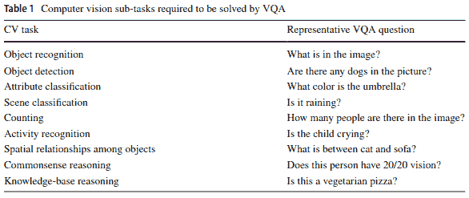
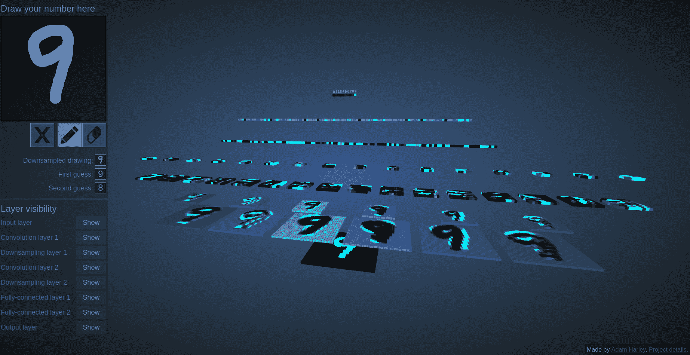
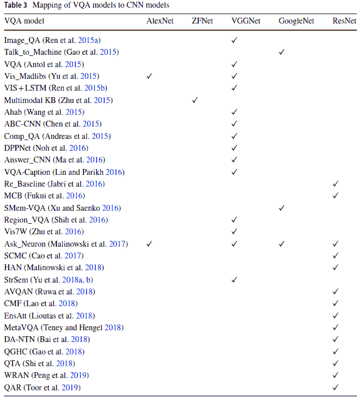
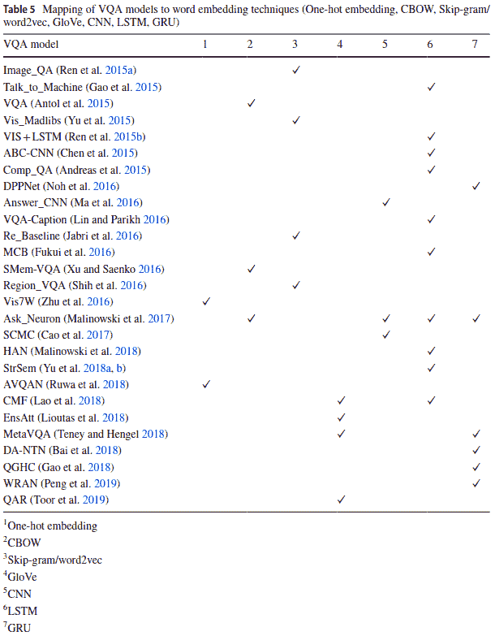
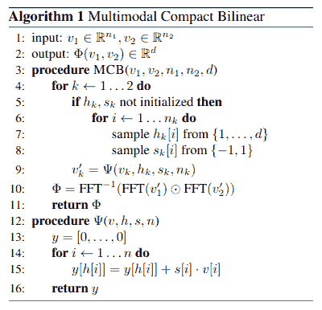
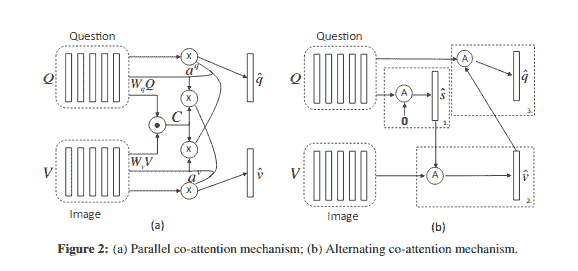
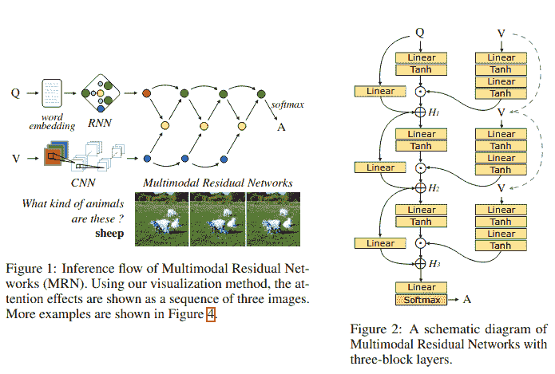
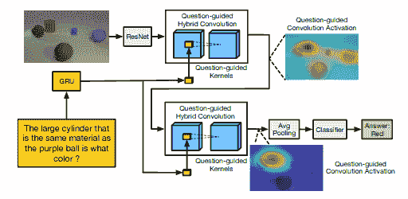
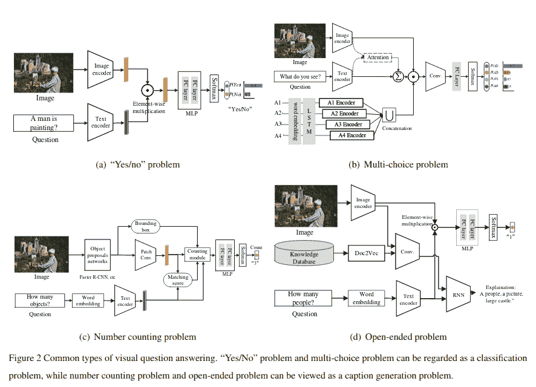
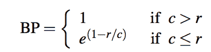

# 视觉问答研究综述

> 原文：<https://blog.paperspace.com/introduction-to-visual-question-answering/>

在过去的几年里，我们已经在机器学习的许多子领域看到了很多进步。像对象检测和图像分割这样的计算机视觉任务，以及像实体识别、语言生成和问题回答这样的 NLP 任务，现在正由神经网络来解决，并且以更快的速度和更高的精度来处理。

最近引起人工智能界关注的一个任务是视觉问答。本文将探讨视觉问答的问题，解决它的不同方法，相关的挑战，数据集和评估方法。

## 介绍

视觉问题回答系统试图用自然语言正确回答关于图像输入的问题。这个问题的更广泛的想法是设计一种系统，它可以像人类一样理解图像的内容，并以自然语言有效地交流图像。这是一项具有挑战性的任务，因为它需要基于图像的模型和自然语言模型进行交互并相互补充。

这个问题已经被广泛接受为 [AI-complete](https://en.wikipedia.org/wiki/AI-complete) ，即一个面对人工一般智能问题的问题，即让计算机像人一样智能。事实上，该问题也被[格曼等人【2015】](https://www.pnas.org/content/112/12/3618)建议用作[视觉图灵测试](https://en.wikipedia.org/wiki/Visual_Turing_Test)。

为了给你一个子问题的概念，视觉问答任务需要:

[Source](https://link.springer.com/article/10.1007/s10462-020-09832-7)

这些问题的解决方案包括四个主要步骤:

*   **图像特征化** -将图像转换成其特征表示，以便进一步处理。
*   **问题特征化** -将自然语言问题转换成它们的嵌入，以便进一步处理。
*   **联合特征表示** -结合图像特征和问题特征以增强算法理解的方法。
*   **答案生成**——利用关节特征理解输入图像和所提问题，最终生成正确答案。

这一管道中的每个阶段都采用了几种方法。我们将在这篇文章中浏览主要的。

## 图像特征化

[卷积神经网络](https://en.wikipedia.org/wiki/Convolutional_neural_network)已经成为图像模式识别的黄金标准。在输入图像通过卷积网络之后，它被转换成抽象的特征表示。CNN 图层中的每个滤镜捕捉不同种类的图案，如边、顶点、轮廓、曲线和对称性。这个概念在[这篇文章](https://distill.pub/2020/circuits/equivariance/)中有很好的解释，文章讨论了神经网络中的等方差以及激活图如何寻找不同种类的检测器。

查看基于 CNN 的网络的三维可视化工具，该网络基于 MNIST 数据进行手写数字识别训练[点击这里](https://www.cs.ryerson.ca/~aharley/vis/conv/)。

[Source](https://www.cs.ryerson.ca/~aharley/vis/conv/)

CNN 已经发展成更深和更复杂的架构，广泛用于下游任务，如分类、对象检测和图像分割。一些这样的网络包括 [AlexNet](https://proceedings.neurips.cc/paper/2012/hash/c399862d3b9d6b76c8436e924a68c45b-Abstract.html) 、 [ResNet](https://arxiv.org/abs/1512.03385) 、 [LeNet](https://sh-tsang.medium.com/paper-brief-review-of-lenet-1-lenet-4-lenet-5-boosted-lenet-4-image-classification-1f5f809dbf17) 、 [SqueezeNet](https://arxiv.org/abs/1602.07360) 、 [VGGNet](https://arxiv.org/pdf/1409.1556.pdf) 、 [ZFNet](https://arxiv.org/pdf/1311.2901.pdf) 等。

大多数 VQA 文学利用 CNN 进行形象特征化。网络的最后一层被移除，网络的其余部分用于生成影像特征。有时，倒数第二层被归一化([卡弗尔等人(2016)](https://www.chriskanan.com/wp-content/uploads/Kafle2016.pdf) 和[斋藤等人(2017)](https://arxiv.org/pdf/1606.06108.pdf) ，或者通过一个降维层([卡弗尔等人(2016)](https://www.chriskanan.com/wp-content/uploads/Kafle2016.pdf) ，[伊利耶夫斯基等人(2016)](https://arxiv.org/pdf/1604.01485v1.pdf) )。

[Source](https://link.springer.com/article/10.1007/s10462-020-09832-7) 

从上面的调查来看，很明显，在 ResNets 出现之前，VGGNet 是首选网络。2017 年后出的 VQA 论文大多使用 ResNets。

ResNets 的核心思想包括跳过连接，如下所示。

身份快捷连接允许网络跳过中间层。这个想法是通过允许网络在需要时跳过层来避免非常深的神经网络经常面临的爆炸和消失梯度。这也有助于提高精度，因为损害精度的图层可以被跳过和正则化。

[Ilievski et al. (2016)](https://arxiv.org/pdf/1604.01485v1.pdf) 利用问题词嵌入(我们将很快讨论)来提取标签与问题本身相似的对象，并使用 ResNet 提取这些对象的特征表示。他们称这种方法为“集中动态注意力”

[卢等(2019)](https://research.fb.com/wp-content/uploads/2019/12/ViLBERT-Pretraining-Task-Agnostic-Visiolinguistic-Representations-for-Vision-and-Language-Tasks.pdf) 利用 ViLBERT(视觉与语言 BERT 的简称)进行视觉问答。ViLBERT 由两个并行的 BERT 风格的模型组成，在图像区域和文本片段上运行。每一个流都是一系列的转换器和协同注意转换器层，使得能够在模态之间进行信息交换。

## 问题特征化

有几种方法可以创建嵌入。旧的方法包括基于计数、基于频率的方法，如计数矢量化和 TF-IDF。还有基于预测的方法，如连续单词包和跳过单词。Word2Vec 算法的预训练模型也可以在 Gensim 等开源工具中获得。你可以在这里了解这些方法[。像 RNNs、LSTMs、GRUs 和 1-D CNN 这样的深度学习架构也可以用来创建单词嵌入。在 VQA 文学中，LSTMs 使用频率最高。](https://www.analyticsvidhya.com/blog/2017/06/word-embeddings-count-word2veec/)

阅读本文的大多数人可能已经知道什么是 rnn，但是为了完整起见，我们仍然会触及一些基本概念。递归神经网络接受顺序输入，并根据训练数据预测序列中的下一个元素。普通的递归网络将基于所提供的输入，处理它们先前的隐藏状态，并输出下一个隐藏状态和顺序预测。将该预测与地面真实值进行比较，以使用反向传播来更新权重。

我们也知道 rnn 容易受到消失和爆炸梯度的影响。为了解决这个问题，LSTMs 应运而生。LSTMs 使用不同的门来管理序列中每个先前元素的重要性。还有 LSTMs 的双向变体，其从左到右以及从右到左学习不同元素的顺序依赖性。

[Source](https://link.springer.com/article/10.1007/s10462-020-09832-7)

[陆等(2016)](https://arxiv.org/pdf/1606.00061.pdf) 构建一个层次架构，在三个层次上共同关注图像和问题:(a)单词层，(b)短语层，以及(c)问题层。在单词层，他们通过嵌入矩阵将单词嵌入到向量空间中。在短语级别，一维卷积神经网络用于捕获包含在单字、双字和三元字中的信息。在问题层面，他们使用递归神经网络对整个问题进行编码。

[本调查](https://link.springer.com/article/10.1007/s10462-020-09832-7)列出了问题特征化的独特方式，下面也会提到。

[Antol 等人(2015)](https://arxiv.org/pdf/1505.00468.pdf) 使用 BoW 方法，但只使用他们数据集中问题的前 1000 个单词。他们利用问题开头的单词之间的强相关性，通过从问题的前 10 个第一、第二和第三个单词中创建另一个 BoW 来回答，然后将其与第一个表示连接起来。

[张等(2016)](https://arxiv.org/pdf/1511.05099.pdf) 尝试解决二元视觉问答问题。他们试图通过引入 PRS 结构来组织问题中的信息，其中 P 代表主要对象，R 代表关系，S 代表次要对象。理想情况下，p 和 S 值应该是名词，而 R 应该是动词或介词。

为了解决多项选择问题的回答， [Shih et al. (2016)](https://arxiv.org/pdf/1511.07394.pdf) 将变长问题转化为固定大小的向量，由将单词分为以下几类:

*   使用前两个单词的问题类型
*   名词性主语
*   所有名词
*   所有剩余单词

[于等(2018)](https://ieeexplore.ieee.org/document/8451516) 利用 Tree-LSTMs 捕获问题中的语义及其与图像的关系。树-lstm 是树结构的对象，其中每个节点是一个 LSTM 单元。向前传球可以有多种方式:

*   子求和树单元:这里添加子节点的隐藏状态以获得输出
*   子节点最大池单元:这里的输出是所有子节点的最大值
*   子卷积+最大池单元:这里的输出是不同子节点之间卷积的最大值。两个函数$f$和$g$之间的离散卷积可以表示如下:

$ $(f * g)[n]= \sum_{m=-m}^{m} f[n-m]g[m]$ $

数据集中的每个问题都被解析并映射到一个树结构，其中根节点被设置为问题序列。树形结构提供了有助于逻辑推理的语义结构。

[Toor et al. (2019)](https://www.researchgate.net/publication/325068591_Question_action_relevance_and_editing_for_visual_question_answering) 设计了一种方法来理解问题的相关性，并对不相关的问题进行编辑，实践证明这种方法是有效的。他们称这种方法为问题行为相关性和编辑。

## 联合特征表示

处理来自图像和文本的不同特征向量的最常见方法之一是将两者连接起来，并让后面的层为每一个找到正确的权重。如果特征向量长度相同，还可以尝试元素加法和乘法。[马林诺夫斯基等人(2017)](https://arxiv.org/abs/1605.02697) 尝试了上面提到的所有方法，发现逐元素乘法给出了最好的精度。 [Shih 等人(2016)](https://arxiv.org/pdf/1511.07394.pdf) 使用点积，而 [Saito 等人(2017)](https://arxiv.org/abs/1606.06108) 使用混合方法。它们将逐元素乘法和逐元素加法的结果连接起来。

几篇论文已经使用[典型相关分析](https://online.stat.psu.edu/stat505/lesson/13/13.1)来寻找联合特征表示。典型相关分析是一种寻找两组独立向量之间相关性的方法。您可以评估两个向量的不同线性组合，类似于 PCA 中所做的。

设$X$是长度为$p$的向量。然后，

$ $ U _ { 1 } = a _ { 11 } X _ { 1 }+a _ { 12 } X _ { 2 }+...+ a_{1p}X_{p} $$

$ $ U _ { 2 } = a _ { 21 } X _ { 1 }+a _ { 22 } X _ { 2 }+...+ a_{2p}X_{p} $$

......

$ $ U _ { p } = a _ { P1 } X _ { 1 }+a _ { p2 } X _ { 2 }+...+ a_{pp}X_{p} $$

设$Y$是长度为$q$ *的向量。*然后，

$ $ V _ { 1 } = b _ { 11 } Y _ { 1 }+b _ { 12 } Y _ { 2 }+...+ b_{1q}Y_{q} $$

$ $ V _ { 2 } = b _ { 21 } Y _ { 1 }+b _ { 22 } Y _ { 2 }+...+ b_{2q}Y_{q} $$

......

$ $ V _ { q } = b _ { Q1 } Y _ { 1 }+b _ { Q2 } Y _ { 2 }+...+ b_{qq}Y_{q} $$

那么$ (U_{i}，V_{i}) $就是$ i^{th} $标准变量对。在这两个向量中，为了计算方便，您选择了$X$使得$p \leq q $。然后是$p$ 规范协变量对。

协方差可以定义如下:

$$ cov(x，y)= \ frac { \ sum(x _ { I }-\ bar { x })(y _ { I }-\ bar { y })} { N-1 } $ $

我们可以计算$ U_{i} $和$ V{i} $的方差:

$ $ var(u _ { I })=∞a _ { ik } a _ { il } cov(x _ { k }、X_{l}) $。

$ $ var(v _ { I })= \sum_{k=1}^{q} \sum_{l=1}^{q} b _ { ik } b _ { il } cov(y _ { k }，Y_{l}) $$

那么$ U_{i} $和$ V_{i} $之间的典型相关可以使用下面的公式来计算:

$ $ $ { rho } = { frac }有一个$ } { sqrt } $ }存在于$ { fn 方正准圆简体 fs 121 chc 9e cc 4 }和{ fn 方正准圆简体 fs 121 chc 9e cc 4 }之间的{ fn 方正准圆简体 fs 121 chc 9e cc 4 }之间的{ fn 方正准圆简体 fs 121 chc 9e cc 4 }之间的{ fn 方正准圆简体 fs 121 chc 9e cc 4 }中

为了找到联合特征表示，我们需要最大化 *U* 和 *V，*之间的相关性，或者$ \rho $的值。在 scikit-learn 实现中，这是在偏最小二乘算法中完成的。内核 CCA 是另一种变体，它利用了基于[拉格朗日](https://www.cmi.ac.in/~madhavan/courses/dmml2018/literature/Lagrangian_Methods_for_Constrained_Optimization.pdf)的解决方案。[龚等(2014)](https://arxiv.org/abs/1212.4522) ，[余等(2015)](https://www.cs.unc.edu/~licheng/papers/iccv15_madlibs.pdf) ，[托马西等(2019)](https://arxiv.org/pdf/1611.00393.pdf) 都在联合特征表示中使用了 CCA 的某种变体。

[Noh 等人(2015)](https://arxiv.org/pdf/1511.05756.pdf) 为此任务设计了动态参数预测网络(DPPNets)。在与图像特征融合之前，他们在使用 GRU 对问题进行矢量化后添加一个全连接图层，以动态分配每个问题的权重。他们发现，当特征向量有大量参数时，这是一个挑战。为了避免这一点，他们利用哈希机制来创建一个联合特征表示。他们应用了由[陈等人(2015)](https://arxiv.org/pdf/1504.04788.pdf) 提出的散列技巧来压缩神经网络。哈希算法用于对不同的参数进行分组，每组参数共享相同的值。哈希技巧通过利用神经网络中的冗余大大减小了模型的大小，而不会以任何显著的方式损害模型的性能。

[Fukui 等人(2016)](https://arxiv.org/pdf/1606.01847.pdf) 利用多模态双线性池进行联合特征创建。双线性模型采用两个向量的外积来生成一个更高维的矩阵，其中一个向量的每个参数都以乘法方式与另一个向量的参数交互。对于较大的向量大小，这会创建具有太多可训练参数的巨大模型。

[Source](https://arxiv.org/pdf/1606.01847.pdf)

为了避免这种情况，他们使用了一种叫做计数草图投影函数的东西(由 [Charikar 等人(2002)](https://www.cs.rutgers.edu/~farach/pubs/FrequentStream.pdf) 提出)，一种旨在找到数据流中最频繁值的算法，以及傅立叶变换。在计数草图投影中，初始化两个向量，一个具有-1 和 1 值，另一个将索引$i$处的输入映射到索引$j$处的输出。对于输入中的每个元素，使用我们之前初始化的第二个向量查找其目标索引，并将第一个向量与输入向量的点积添加到输出中。[卷积定理](https://en.wikipedia.org/wiki/Convolution_theorem)指出，时域中两个向量之间的卷积与频域中的元素乘积相同，可以通过傅立叶变换获得。他们利用卷积的这一特性最终得到他们的联合表示。 [Hedi 等人(2017)](https://arxiv.org/pdf/1705.06676.pdf) 在为 VQA 实施 MUTAN 时也使用了多模态紧凑双线性池。

[陆等(2016)](https://arxiv.org/pdf/1606.00061.pdf) 在融合嵌入之前使用了共同注意机制，使得视觉注意和文本注意都被计算。他们提出了两种注意机制:平行共同注意和交替共同注意。

在并行共同注意中，他们通过计算所有图像位置和问题位置对的图像和问题特征之间的相似性来连接图像和问题。他们称随后的表示为亲和矩阵。他们使用这个亲和矩阵来预测注意力地图。

$$ C = tanh(Q^{T}W_{b}V) $$

这里$C$是亲和度矩阵，$Q$是问题特征向量，$V$是视觉特征向量。$W$代表重量。

$ $ H _ { V } = tanh(W _ { V } V+(W _ { Q } Q)C)$ $

$ $ h _ { q } = tanh(w _ { q } q+(w_{v}v)c^{t})$ $

$ $ a _ { v } = softmax(w^{t}_{hv} h^{v})$ $

$ $ a _ { q } = softmax(w^{t}_{hq} h^{q})$ $

其中$W_{v}$ 、$W_{q}$ 、$w_{hv}$和$ w_{hq}$是权重参数。$ a_{v} $和$ a_{q} $分别是每个图像区域$ v_{n} $和单词$ q_{t} $的注意概率。

$ $ v = \sum_{n=1}^{n} a^{v}_{n} v _ { n }，q = \sum_{t=1}^{t} a^{q}_{t} q _ { t } $ $

其中$v$和$q$分别是图像和问题的平行共同注意向量。

他们还提出了交替共同注意，其中他们依次交替产生图像和问题的注意。图像特征影响问题注意，反之亦然。

$ $ h = tanh(w _ { x } x+(w_{g}g)1^{t})$ $

$$ a_{x} = softmax(w^{T}_{hx} H) $$

$ $ x = \总和 a^{x}_{i} x_{i} $$

其中$1$是所有元素都为$1$的向量。$ W_{x} $和$ W_{g} $是参数。$ a_{x} $是特征$X$的注意力权重。

以一种非常聪明的方式， [Kim 等人(2016)](https://arxiv.org/pdf/1606.01455.pdf) 使用残差连接作为从基于 CNN 的架构中提取的联合特征表示，用于图像特征化，并使用 LSTM 架构用于问题特征化。多模态剩余网络架构看起来像这样。

剩余连接增加了网络的注意能力，作者也对其进行了可视化。

[高等(2018)](https://arxiv.org/pdf/1808.02632.pdf) 认识到在一些卷积网络中，像 ResNet，从第 2 层到最后一层只取一维向量表示，会丢失很多空间信息。为了解决这个问题，他们使用他们所谓的“问题导向混合卷积”，其中他们创建卷积核，该卷积核采用使用 GRU 创建的问题表示以及 ResNet 特征向量来创建联合特征表示。

作者指出，为了从 2000-D 问题特征向量预测常用的$(3×3×256×256)$核，用于学习映射的全连接层生成 1.17 亿个参数，这很难学习，并导致在现有 VQA 数据集上的过拟合。为了解决这个问题，他们尝试预测分组卷积核参数。QGHC 模块看起来像这样。

[彭等(2019)](https://dl.acm.org/doi/10.1007/s11042-018-6389-3) 提出不需要 LSTM 生成完整的特征向量。只需要从问题中提取关键词。他们利用这一思想，提出了一个词-区域注意网络(WRAN)，它可以定位相关的对象区域，并识别参考问题中相应的词。

## 答案生成

对 VQA 的研究包括([来源](https://arxiv.org/pdf/2010.08189.pdf)):

*   自由形式的开放式问题，答案可以是单词、短语，甚至是完整的句子
*   物体计数问题，答案包括计算一幅图像中物体的数量
*   多项选择问题
*   二元问题(是/否)

二元问题和多项选择问题通常在末尾使用一个 s 形层。关节表示通过一个或两个完全连接的层。输出通过作为分类层的单个神经元层。

对于多项选择题，答案选项使用某种嵌入生成机制进行编码，就像我们前面讨论的那样。这被输入到联合特征生成的机制中。然后，连接要素通过一个完全连接的图层，最后通过一个具有 softmax 激活功能的多类分类图层。

对于自由形式的开放式问题，通常使用类似 LSTMs 的递归网络将联合特征表示转换为答案。[吴等(2016)](https://arxiv.org/pdf/1511.06973.pdf) 提取关于图像的数据，为语言模型提供更多的上下文。他们使用 Doc2Vec 算法来获得嵌入，嵌入与 LSTM 一起使用来生成答案。[马林诺夫斯基等人(2017)](https://arxiv.org/abs/1605.02697) 设计了一种方法，其中图像特征与 LSTM 编码的每个单词的表示一起输入。

[Ruwa et al. (2018)](https://ieeexplore.ieee.org/abstract/document/8396994) 不仅使用图像和问题特征，还考虑了情绪嵌入。基于 CNN 的情绪检测器与 LSTM 注意力模型一起被训练，与图像的局部区域相关。情绪与图像中人的外表和行为有关。

## 资料组

在视觉问答领域，有许多数据集可以处理不同类型的任务。这里讨论一些主要的问题。

*   [DAQUAR](https://www.mpi-inf.mpg.de/departments/computer-vision-and-machine-learning/research/vision-and-language/visual-turing-challenge) (真实世界图像问答数据集)是一个关于图像的人类问答对数据集。
*   [COCO-QA](http://www.cs.toronto.edu/~mren/research/imageqa/data/cocoqa/) 是 COCO(上下文中的公共对象)数据集的扩展。这些问题有 4 种不同的类型:物体、数字、颜色和位置。所有答案都是单字类型。
*   [VQA 数据集](http://www.visualqa.org/download.html)，比其他数据集大。除了来自 COCO 数据集的 204，721 幅图像，它还包括 50，000 幅抽象卡通图像。每张图片有三个问题，每个问题有十个答案。该数据集包括多项选择答案，以及开放式答案。
*   [Visual Madlibs](http://tamaraberg.com/visualmadlibs/) 拥有超过 10，000 张图片，在数据集中有 12 种填空类型。它提供了两种评价方式:选择题和填空题。
*   [Visual7W](http://ai.stanford.edu/~yukez/visual7w/) 数据集包含七种类型的问题:什么、哪里、什么时候、谁、为什么、怎样、哪个。该数据集是在 47，300 幅可可图像上收集的。总的来说，它有 327，939 个问答对，以及 1，311，756 个人类生成的多项选择，以及来自 36，579 个类别的 561，459 个对象基础。此外，它们提供了完整的基础注释，将问答句子中提到的对象链接到图像中的边界框，因此引入了一种新的问答类型，其中图像区域作为视觉基础答案。他们也为开发者和人工智能研究者提供了一个[工具包](https://github.com/yukezhu/visual7w-toolkit)。
*   [CLEVR](https://cs.stanford.edu/people/jcjohns/clevr/) 数据集包括 70，000 幅图像和 699，989 个问题的训练集，15，000 幅图像和 149，991 个问题的验证集，15，000 幅图像和 14，988 个问题的测试集，以及所有训练和验证问题的答案。除此之外，它们还为 train 和 val 图像提供了场景图注释，给出了对象的真实位置、属性和关系。
*   [视觉基因组](http://visualgenome.org/)在他们的数据集中有 170 万个视觉问题答案。除了 VQA，它们还提供了许多其他类型的数据——区域描述、对象实例和所有映射到 WordNet synsets 的注释。

## 评估指标

在多项选择任务中，简单的准确性足以评估给定的 VQA 模型。但对于开放式 VQA 任务，精确字符串匹配的框架将是评估 VQA 模型性能的一种非常严格的方式。

### 吴与帕相似

[吴和帕尔默相似度](https://arxiv.org/ftp/arxiv/papers/1211/1211.4709.pdf)利用模糊逻辑计算两个短语之间的相似度。这是一个考虑了概念$ c_{1} $和$ c_{2} $在分类法中的位置的分数，相对于最不常见的包含项($ c_{1} $和$ c_{2} $的位置。它假设两个概念之间的相似性是基于路径的度量中路径长度和深度的函数。

树或有向无环图(DAG)中两个节点$v$和$w$的最不常见的包含者是最深的节点，其具有$v$和$w$作为后代，其中我们将每个节点定义为其自身的后代。所以如果$v$和$w$有直接联系，$w$就是最低的共同祖先。

$$ Sim_{wup}(c_{1}，c_{2}) = 2* \frac{Depth(LCS(c_{1}，c _ { 2 })} {(Depth(c _ { 1 })+Depth(c _ { 2 })} $ $

$ LCS(c_{1}，c_{2}) $ =层次结构中的最低节点，是$ c_{1} $，$ c_{2} $的上位词。

NLTK 有一个函数[实现 WUP 相似度](https://www.geeksforgeeks.org/nlp-wupalmer-wordnet-similarity/)。

WUP 相似度适用于单个单词的答案，但不适用于短语或句子。

### 双语评估替补演员

这种方法通过计算候选翻译中与参考文本中的 n 元语法匹配的 n 元语法来工作。这种比较不考虑词序。

＄＄P _ { n } = \ frac { \ sum _ { n-grams } count _ { clip }(n-gram)} { \ sum _ { n-grams } count(n-gram)}＄

他们也有一个简短的惩罚附加到分数上，定义如下。

其中$r$是参考答案的长度，$c$是预测的长度。

$ $ blue = BP * exp(∞美元)

BLEU 指标的综合指南可在本文中找到。

BLEU 也有一些缺点。在很大程度上，BLEU 分数是基于非常简单的文本字符串匹配。非常粗略地说，你能精确匹配的单词簇越大，BLEU 分数越高。如果答案很长，并且可以超出小短语的范围，那么这就不是最佳的衡量标准。NLTK 实现教程可以在[这里](https://machinelearningmastery.com/calculate-bleu-score-for-text-python/)找到。

### METEOR(使用显式排序评估翻译的度量标准)

流星度量的计算有两个部分。首先，它计算所有单字的精度和召回率。然后取精度的调和平均值和召回的 9 倍。

$$ F_{mean} = \frac{10PR}{P + 9R} $$

精确度和召回率是根据单字匹配计算的。

为了考虑更长的匹配， [METEOR](https://www.cs.cmu.edu/~alavie/METEOR/pdf/Banerjee-Lavie-2005-METEOR.pdf) 对给定的对齐计算罚分如下。首先，系统翻译中被映射到参考翻译中的词元的所有词元被分组到尽可能少的组块中，使得每个组块中的词元在系统翻译中处于相邻位置，并且还被映射到参考翻译中处于相邻位置的词元。

第二部分是罚函数，表述如下:

$$ penalty = 0.5 *(\ frac { \ text {组块数} } { \ text { unigrams}})^{3}数$ $

最后，比分是:

$$ score = F_{mean} * (1 -罚分)$$

## 结论

这里，我们介绍了视觉问答领域的进展。我们知道这个问题分为四个主要的研究领域:图像特征化、问题特征化、联合特征表示和答案生成。在回顾了每一个之后，我们看到了近年来许多研究人员用来解决这些问题的几种不同方法的概述。我们还研究了视觉问答任务的主要数据集和评估指标。我希望这篇文章对你有用。