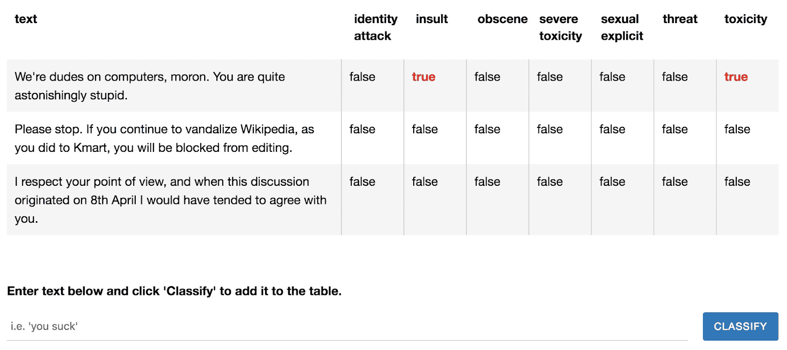
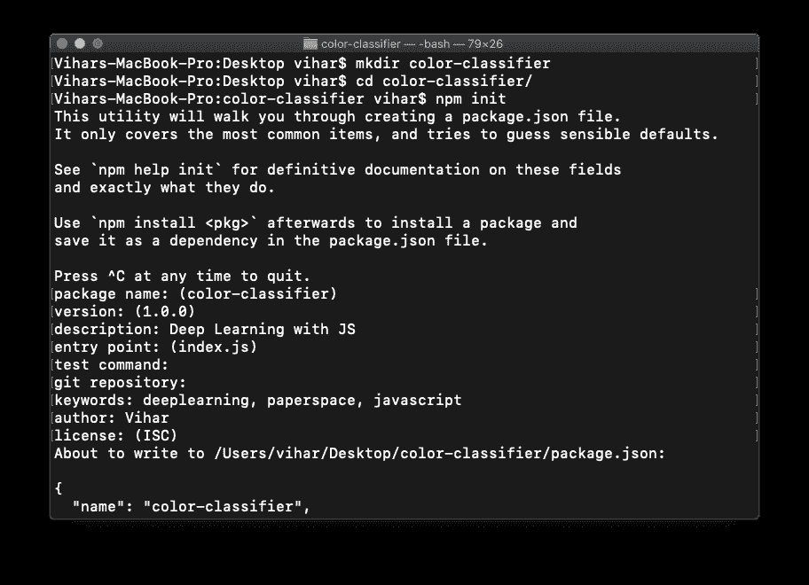
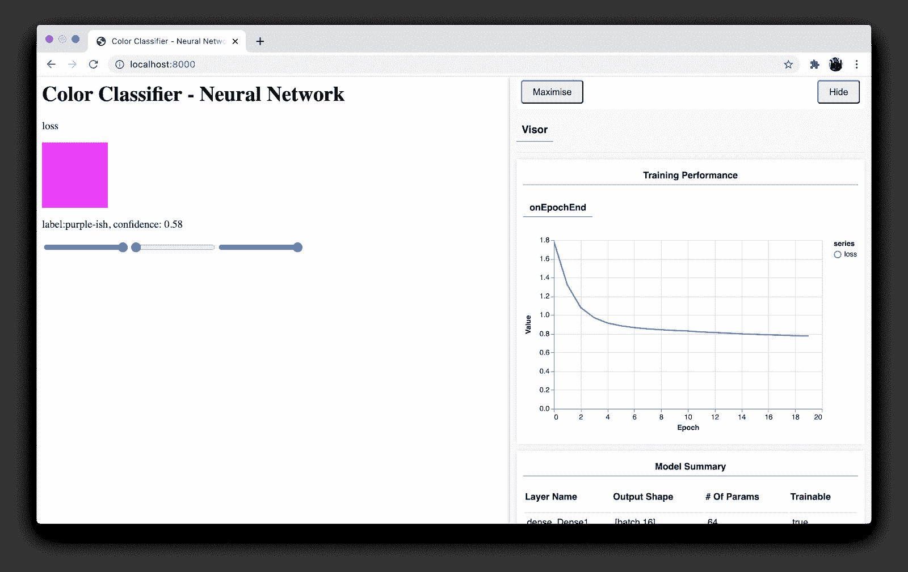

# JavaScript 库如何在网络浏览器上训练神经网络

> 原文：<https://blog.paperspace.com/javascript-deep-learning-on-web-browsers/>

多年来，JavaScript 一直是开发人员最喜爱的编程语言之一。它主要用于创建 web 浏览器 UI 和后端业务逻辑(使用 Node.js)。看看 Stack Overflow 和 GitHub 所做的调查，就其拥有的存储库数量和触发的拉请求活动而言，它一直排名第一。另一方面，深度学习被广泛用于训练机器识别模式和自动化任务。举几个例子，包括用手机提供的数据在尽可能短的距离内导航空间，检测和识别相机上的人脸，以及识别医学领域的复杂异常，等等。

也许你可能想知道 JavaScript——一种主要用于构建网络的编程语言——与人工智能有什么关系。为了回答你的问题，在本文中，我们将看看 JavaScript 如何与深度学习相结合；一个支持 Python 和 C++等语言的独占领域。下面是我们将要学习的内容。

*   深度学习的传统工作方式
*   构建深度学习模型的管道
*   深度学习和流行库/框架的 JavaScript
*   网络浏览器上的深度学习
*   用 ml5.js 构建用于颜色分类的神经网络
*   结论

## 深度学习的传统工作方式

深度学习是人工智能的一个子集，诞生于 20 世纪 50 年代模仿大脑的想法。深度学习算法是使用传统上用 Python 和 C++等语言编程的神经网络实现的。如果你不熟悉什么是神经网络，不要担心！模糊地说，神经网络是由层组成的人工大脑，通过层发送数据并学习模式。学习阶段被称为“培训”它涉及(通常)大量的数据，以及(通常)具有大量参数的模型。因此，GPU 用于加速计算。这些网络经过训练后，必须部署在某个地方，对真实数据进行预测(例如对图像和文本进行分类，检测音频或视频流中的事件，等等)。没有部署，训练一个神经网络只是浪费计算能力。

下面是一些流行的编程语言和框架，它们被广泛用于构建或使用深度学习模型。

*   **Python** 一直是构建 AI 的顶级选择。谷歌的 TensorFlow 和脸书的 PyTorch 是使用 Python 的最常用的深度学习框架。
*   C++ 也被用于开发最先进的神经网络，以在最少的时间内完成计算。
*   **R 和 Julia** 在少数情况下也用于开发定制模型；然而，这些语言仅限于少数几个功能，而且由于编程社区相对有限，可能很难构建各种神经网络。

## 构建深度学习模型的管道

在我们讨论 web 上的深度学习之前，让我们首先检查一下我们构建神经网络所遵循的标准管道。这让我们对网络浏览器上的神经网络实现策略有了清晰的理解，包括一些小的调整。流程是这样的:

1.  **数据来源与加载**:众所周知，深度学习的核心是数据；我们拥有的数据越多，神经网络的表现就越好。所有这些数据都以张量的形式提供，这是一种 n 维数据类型。我们可以将任何数据转换成张量格式，从基本数字到文本、图像和视频。使用张量的一些其他优势包括多进程数据加载和批处理，这意味着您可以同时使用多个张量训练您的神经网络。
2.  **定义模型:**加载数据后的第一步是定义神经网络。这是整个管道的大脑，将不断从提供的数据中学习。然而，这一步涉及许多超参数和实验，以实现最先进的性能。几种常用的超参数有`batch_size`、`number_of_epochs`、`loss_function`、`optmization_function`和`learning_rate`。接下来，我们定义神经网络，其中我们决定模型所需的总层数和参数。同样，根据数据、其结构和所需的输出，我们可以选择不同类型的层和架构。
3.  **训练模型**:在上一步中，我们已经了解了设计模型需要什么。然而，这一进程仍未完成。只有在通过模型对数据进行训练时，才能使用该模型。通过迭代地传递数据，并使用损失函数更新损失，针对一定数量的时期训练具有定义的参数的模型。然后,`backpropagation`算法会在每次迭代中改进神经网络的指标和准确性。训练过程完成后，使用框架支持的任何特定格式保存模型的权重。我们可以称之为训练模型。
4.  **模型到云和生产:**被训练的模型通常是大规模的，通常依赖于所使用的神经网络；它们从千字节到千兆字节不等。为了在生产中使用它们，我们将它们存储在云上，并再次加载它们进行部署。

在下一节中，我们将讨论使用 JavaScript 将模型嵌入 web 浏览器的机制。

## 深度学习的 JavaScript

如前所述，JavaScript 是自 1995 年诞生以来最受欢迎的编程语言之一。然而，直到 2015 年，深度学习和人工智能相关的学科都没有考虑这一点，原因有三:

1.  大多数人有一种直觉，JS 是一种慢语言。
2.  像矩阵乘法和归一化这样的操作很难实现。
3.  大多数用于实现深度学习的库(如 Scikit-learn、TensorFlow 等。)与 Python 一起使用。

然而，现在有一些基于 JavaScript 的深度学习库。让我们看一看。

### 流行的 JavaScript 库和深度学习框架

*   tensor flow . js:tensor flow . js 是一个 JavaScript 库，用于构建神经网络并在 web 浏览器上直接使用它们。这个库的一个很酷的特性是，它允许转换现有的基于 Python 的 TensorFlow 模型，以便在 web 浏览器上工作。它还允许直接在浏览器中实现面部识别、移动检测等高级网络。
*   ******大脑**** 。js****:******brain . js 是目前流行的构建神经网络的 JavaScript 库之一；它还支持直接从 web 浏览器和 Node.js 访问 GPU。许多典型的神经网络如 CNN 和 RNNs 也可以使用该库实现。
*   **ml**T2**5**。js: 这是一个构建在 TensorFlow.js 之上的友好框架；它为直接使用 JavaScript 开始深度学习的人提供了良好的社区支持和文档。
*   **ConvNetJS:** ConvNetJS 是最早用于深度学习的 JavaScript 库之一。它最初是由 Andrej Karpathy 开发的，用于实现简单的分类和卷积模型。ConvNetJS 仍然由其社区维护，并支持一些很酷的网络。

现在我们已经了解了深度学习管道以及可用的 JavaScript 库，是时候看看如何将 JavaScript 与深度学习相结合了。

## 网络浏览器上的深度学习

在台式机和笔记本电脑上，Chrome、Firefox 和 Safari 等网络浏览器是用户访问互联网内容和服务的主要方式。由于这种广泛的覆盖范围，web 浏览器是部署深度学习模型的逻辑选择，只要模型所需的数据类型可以从浏览器中获得。但是从浏览器中可以获得哪些类型的数据呢？答案是很多！现在让我们来讨论一些真实的用例。考虑 YouTube，那里有几十亿的视频；Instagram，里面都是图片；还有推特，里面全是文字。

问你一个问题:当你在 YouTube 或 Spotify 上搜索歌曲或视频时，你会在它们旁边看到你可能感兴趣的其他歌曲的推荐。想知道这是怎么发生的吗？这种逻辑背后的魔力由大量运行在浏览器和后端服务器上的机器学习和深度学习算法组成。这就是 JavaScript 发挥关键作用的地方，用浏览器获取和绑定数据，并设计智能算法。下面是几个例子，深度学习算法在带有 JavaScript 的 web 浏览器上运行。


Real-Time Face Detection on Web browser with TensorFlow.js



Real-time text toxicity detection web browsers

好吧！现在让我们深入到代码中，我们将学习预测我们在 web 浏览器上看到的颜色。

## 建立用于颜色分类的神经网络

在本节中，我们将使用 [ml5.js](https://ml5js.org/) 库在 web 浏览器上创建和训练一个神经网络。我们的目标是用我们训练好的神经网络来预测网络浏览器中给定颜色的名称。另外，确保你的电脑上已经安装了`node`，否则你可以通过下面的[链接](https://nodejs.org/en/)来安装。Node 允许您运行和安装所有必需的包，以便用 ml5.js 创建我们的 NNs。

### 步骤 1:创建 NPM 和必要的文件

要开始我们的项目，首先，您必须创建一个 npm 项目。这可以通过在终端或命令提示符下使用命令`npm init`来完成。另外，确保你的电脑上安装了`node`和`npm`。如果没有，请按照该网站[这里](https://docs.npmjs.com/downloading-and-installing-node-js-and-npm)的指示进行操作。下面是我创建项目后的终端截图。您可以在此添加项目的必要描述。如下图所示，该命令创建一个 package.json 文件，该文件类似于项目的入口文件。它包含项目中安装的所有依赖项和库版本的列表。



### 步骤 2:向 index.html 添加脚本

在这一步，我们将编写一些 HTML。我们将包括 P5。JS-一个用于创造性编码的 JavaScript 库。这有助于我们形象化我们的训练，并在我们的项目中制作一些动画。下面是代码片段，

```py
<html>
   <head>
      <meta charset="UTF-8" />
      <title>Color Classifier - Neural Network</title>
      <script src="https://cdnjs.cloudflare.com/ajax/libs/p5.js/0.9.0/p5.min.js"></script>
      <script src="https://cdnjs.cloudflare.com/ajax/libs/p5.js/0.9.0/addons/p5.dom.min.js"></script>
      <script
         src="https://unpkg.com/ml5@0.5.0/dist/ml5.min.js"
         type="text/javascript"
         ></script>
   </head>
   <body>
      <h1>Color Classifier - Neural Network</h1>
      <script src="sketch.js"></script>
   </body>
</html> 
```

这里，如您所见，P5JS 和 ml5.js 已经添加到 HTML 脚本标记中。你可以认为这是将你的 p5JS(可视化库)和 ml5(深度学习库)导入到你的网络浏览器中。

在`<body>`标签中，添加了一个`H1`标签，其中包含项目的名称和一个附加的脚本标签 **sketch.js** ，其中包含所有深度学习逻辑。在深入研究这个概念之前，下载培训数据并将其放到本地机器上。

### 步骤 3:下载数据集

你可以从链接[这里](https://raw.githubusercontent.com/vihar/colors-classifier/master/data/colorData.json)下载数据集。确保在项目中创建一个名为**数据**的文件夹，并将下载的数据移动到那里。

```py
{
 "entries": [
   {
     "b": 155,
     "g": 183,
     "label": "green-ish",
     "r": 81,
     "uid": "EjbbUhVExBSZxtpKfcQ5qzT7jDW2"
   },
   {
     "b": 71,
     "g": 22,
     "label": "pink-ish",
     "r": 249,
     "uid": "fpqsSD6CvNNFQmRp9sJDdI1QJm32"
   },
 ]
} 
```

JSON 文件将由上述条目组成，这里 r、g 和 b 代表红色、绿色和蓝色，它们是给我们神经网络的输入。键“标签”是单个字典中给定的特定 RGB 值的相应输出。下一步是建立一个神经网络。

### 步骤 4:构建神经网络

应该定义一些 JavaScript 变量来使它们与我们的浏览器交互。下面是代码片段。

```py
 let neuralNetwork;
 let submitButton;

 let rSlider, gSlider, bSlider;
 let labelP;
 let lossP; 
```

在`neuralNetwork`变量中，神经网络将在即将到来的函数中定义， **`submitButton`** 将输入发送给训练好的模型。滑块按钮将有助于选择不同的颜色作为输入并进行预测。最后，`labelP`变量将用于呈现输出文本，lossP 用于打印精度。

接下来，让我们定义`setup()`函数来加载所有的变量；下面是代码片段。

```py
function setup() {
 lossP = createP("loss");

 createCanvas(100, 100);

 labelP = createP("label");

 rSlider = createSlider(0, 255, 255);
 gSlider = createSlider(0, 255, 0);
 bSlider = createSlider(0, 255, 255);

 let nnOptions = {
   dataUrl: "data/colorData.json",
   inputs: ["r", "g", "b"],
   outputs: ["label"],
   task: "classification",
   debug: true,
 };
 neuralNetwork = ml5.neuralNetwork(nnOptions, modelReady);
} 
```

在这个函数中，使用 P5 JS 中的`createP()`函数将 loss 和 label 变量设置为`loss`和`label`字符串。这些是简单的字符串。接下来的三个变量`(rSlider, gSlider, bSlider)`用于使用`createSlider()`功能创建滑块，并分别对应于`red`、`green`和`blue`的颜色代码。

接下来，将神经网络的整个配置添加到之前创建的列表变量中(neural network)。一个`dataUrl`标签指向数据集。输入 r、g 和 b(数据集键)被附加到一个列表中，输出对应于标签键。定义了一个称为**分类**的额外变量，以向神经网络传达分类是期望的操作。

最后，使用 ml5 库中的`neuralNetwork`函数创建一个神经网络，其中使用`nnOptions`变量作为参数发送所有选项。

### 步骤 5:设置超参数并保存模型

在这一步中，将通过对`neuralNetwork`变量使用`train()`方法来训练声明的神经网络。

```py
function modelReady() {
 neuralNetwork.normalizeData();
 const trainingOptions = {
   epochs: 20,
   batchSize: 64,
 };
 neuralNetwork.train(trainingOptions, whileTraining, finishedTraining);
 // Start guessing while training!
 classify();
}

function whileTraining(epoch, logs) {
 lossP.html(`Epoch: ${epoch} - loss: ${logs.loss.toFixed(2)}`);
}

function finishedTraining(anything) {
 console.log("done!");
} 
```

现在要运行这个项目，您可以通过运行任何 web 服务器来打开 index.html 文件，或者您可以将这些文件部署到 netlify。我目前使用“python3 -m http.server”在本地 web 浏览器上为项目提供服务。现在，它运行在端口 8000 上，您可以导航到 localhost:8000 并查看下面的屏幕截图。



Training and Predictions on Web Browser using ml5.js

这段代码是在 ml5.js 示例的基础上修改的，要查看更多类似的内容，请浏览下面的[链接](https://github.com/ml5js/ml5-examples)。

## 结论

在本文中，我们已经了解了如何使用 Javascript 库在 Web 浏览器上训练神经网络，以及它们与传统管道有何不同。此外，我们还研究了一个示例，其中我们使用 ml5.js(一个用于使用 js 构建神经网络的库)来创建颜色分类器。如果你还想探索更多的例子，并想建立自己的网络 checkout [TensorFlow.js](https://www.tensorflow.org/js) 和 Brain.js 库，在那里你可以处理巨大的图像、文本和音频数据集。