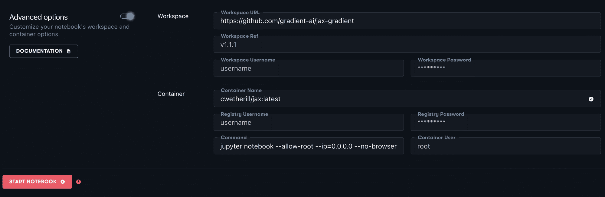

# 现已推出:在渐变笔记本上运行 JAX

> 原文：<https://blog.paperspace.com/jax-on-paperspace/>

我们的大多数读者都熟悉深度学习领域的两大巨头，即 PyTorch 和 TensorFlow。这些库对于任何深度学习专业人士或爱好者来说都是必不可少的，Gradient 通过依赖 Docker 映像来运行笔记本，消除了设置和安装这些包的麻烦。

我们的用户使用的许多容器都预先打包为 Gradient Notebooks 运行时，这允许我们的用户快速访问支持 GPU 的笔记本，同时完成文件和安装。你也可以通过高级选项直接将保存在 Docker Hub 或 Nvidia NGC 等服务上的任何工作空间 URL 或容器输入到笔记本中。

我们已经创建了一个新的支持 JAX 的容器，可以用于渐变笔记本，这篇文章旨在帮助指导用户开始使用渐变笔记本 JAX。

### 什么是 JAX？

JAX 是深度学习社区的后起之秀之一。谷歌为高性能数值计算设计的机器学习库，自发布以来就迅速走红。

根据他们的文件，“JAX 在 CPU，GPU 和 TPU 上是 NumPy，在高性能机器学习研究方面有很大的自动差异。”【 [1](https://jax.readthedocs.io/en/latest/notebooks/quickstart.html) 】。在实践中，JAX 的行为类似于流行的库 NumPy，但增加了自动签名和 XLA(加速线性代数)，这允许数组操作利用 GPU 支持的机器。它可以通过与它的前身的许多巧妙的不同来处理这个动作。

主要的变化有四个方面:增加了自动区分、JAX 向量化、JIT(实时)编译和 XLA。

*   JAX 的自动签名的更新版本允许 JAX 自动区分 NumPy 和 Python 代码。这包括使用许多 Python 特性，如循环、ifs、递归、闭包等等。它也可以取导数或导数的导数。这允许通过 [`grad`](https://github.com/google/jax#automatic-differentiation-with-grad) 的反向模式微分(也称为反向传播)以及正向模式微分，并且两者可以任意组合成任意顺序。[【2】](https://github.com/google/jax)
*   通过`vmap`函数的 JAX 矢量化，即矢量化地图，允许跨阵列轴进行熟悉的函数映射。为了提高性能，循环被保留在函数的原始操作中。[【3】](https://jax.readthedocs.io/en/latest/notebooks/quickstart.html?highlight=auto-vectorization#auto-vectorization-with-vmap)
*   JAX 包含一个函数转换，JIT，用于现有函数的即时编译。
*   JAX 还利用 XLA 以一种针对 GPU 或 TPU 等加速器硬件优化的方式运行 NumPy 代码。默认情况下，XLA 会在幕后编译，库调用会被及时编译和执行。JAX 甚至可以使用它的单函数 API 将你自己的 Python 函数实时编译成 XLA 优化的内核。编译也是任意组合的，所以复杂的算法可以优化实现，而不必编写非 Python 代码。[【1】](https://jax.readthedocs.io/en/latest/notebooks/quickstart.html)

关于 JAX 的更多信息，请查看文档中的[快速入门页面。](https://jax.readthedocs.io/en/latest/notebooks/quickstart.html)

### 为什么用 JAX？

JAX 的效用可以简洁地归结为取代和超越 NumPy，用于 GPU。鉴于它本质上是亲笔签名的 2.0，所有级别的用户都可以从 JAX 获得效用。

此外，JAX 能够取代深度学习库(如 Keras、TensorFlow 和 PyTorch)提供的许多功能。基于 JAX 的 DL 库，如 [Elegy](https://github.com/poets-ai/elegy) 、 [Flax](https://github.com/google/flax) 和 [ObJAX](https://github.com/google/objax) 都可以执行与主线 DL 库相同的任务，但与 Keras 或 Torch 套件相比，它们还处于相对早期的开发阶段。

按照以下说明试用 JAX 渐变，立即开始使用 JAX 渐变。

### 如何制作支持 JAX 的渐变笔记本:

要创建支持 JAX 的渐变笔记本，只需遵循几个简单的步骤。在创建笔记本页面中，首先滚动运行时部分，为您的笔记本选择一个 GPU，导航到并单击切换到“高级选项”在此部分中，将以下内容粘贴到各自的文本框中:

*   工作区网址:[https://github.com/gradient-ai/jax-gradient](https://github.com/gradient-ai/jax-gradient)
*   容器名: [cwetherill/jax:最新](https://hub.docker.com/repository/docker/cwetherill/jax)
*   命令:`jupyter lab --allow-root --ip=0.0.0.0 --no-browser --ServerApp.trust_xheaders=True --ServerApp.disable_check_xsrf=False --ServerApp.allow_remote_access=True --ServerApp.allow_origin=''*'' --ServerApp.allow_credentials=True`

然后你需要做的就是点击开始笔记本！

### 后续步骤

一旦你的笔记本开始运转，查看`/notebooks`文件夹中的示例笔记本，开始使用 JAX。尤其是 TensorFlow 笔记本，它有趣地展示了 JAX 如何帮助您完成 DL 任务。

[点击此处](https://github.com/gradient-ai/jax-gradient)访问该回购的 Github。

来源:

1.  [https://jax . readthe docs . io/en/latest/notebooks/quick start . html](https://jax.readthedocs.io/en/latest/notebooks/quickstart.html)
2.  [https://py torch . org/docs/stable/notes/autograded . html #:~:text = autograded 是逆向自动微分，根是输出张量](https://pytorch.org/docs/stable/notes/autograd.html#:~:text=Autograd%20is%20reverse%20automatic%20differentiation,roots%20are%20the%20output%20tensors)。
3.  [https://jax . readthe docs . io/en/latest/notebooks/quick start . html？highlight =自动矢量化#使用 vmap 自动矢量化](https://jax.readthedocs.io/en/latest/notebooks/quickstart.html?highlight=auto-vectorization#auto-vectorization-with-vmap)