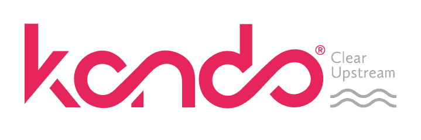

# Kando 和 Paperspace 合作将先进的机器学习引入市政系统监控

> 原文：<https://blog.paperspace.com/kando-and-paperspace-partner-to-bring-advanced-machine-learning-to-municipal-systems-monitoring/>

[Kando](https://blog.paperspace.com/p/ccc3ab5e-c6c4-4f8e-b28a-60987e73a608/www.kando.eco) 是一家为市政公用事业提供智能废水管理解决方案的技术公司，已经集成了 Paperspace 的梯度机器学习平台，以支持其领先的 Clear 上游废水事件监控系统。

Kando’s end-to-end solution ****Clear Upstream**** provides continuous awareness of events in wastewater networks.

通过合作，Kando 为其技术堆栈带来了最先进的机器学习工具集和 MLOps 平台。

机器学习正在帮助物联网公司利用自动化和分析来实现大数据解决方案。Kando 正在利用这一趋势，通过部署 ML 解决方案来识别污染风险，查明污染源，并评估需要快速应急响应的影响，以确保城市和居民的安全。

因此，像波特兰的[埃尔帕索水务](https://www.epwater.org)和[净水服务](https://www.cleanwaterservices.org)这样的客户能够获得实时、持续的监控。

Paperspace 的销售副总裁 Todd Feinroth 表示:“我们很高兴与 Kando 合作，为关键的市政基础设施监控带来一流的机器学习工具。我们期待帮助 Kando 建立其机器学习能力，并为世界各地的废水处理设施提供领先的解决方案。”

“我们与 Paperspace 的合作将提升我们系统的高级分析能力，使我们能够更好地支持城市远程持续控制污水质量。因此，我们将开始看到更多的废水再利用、更清洁的环境和更健康的社区。”

Kando 首席执行官 Ari Goldfarb

Kando 和 Paperspace 将携手合作，为环境风险和公共健康管理带来先进的机器学习能力。

 

要了解更多关于 Kando 及其令人兴奋的项目和客户的信息，请访问: [www.kando.eco](https://www.kando.eco)