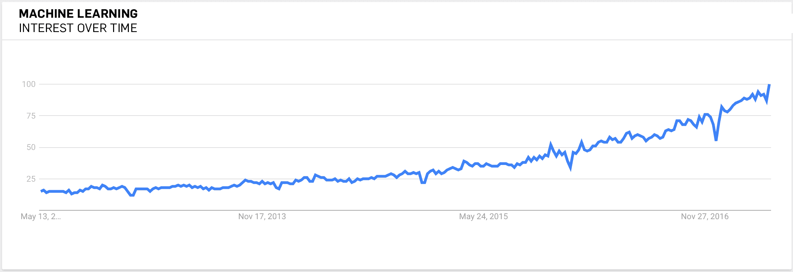
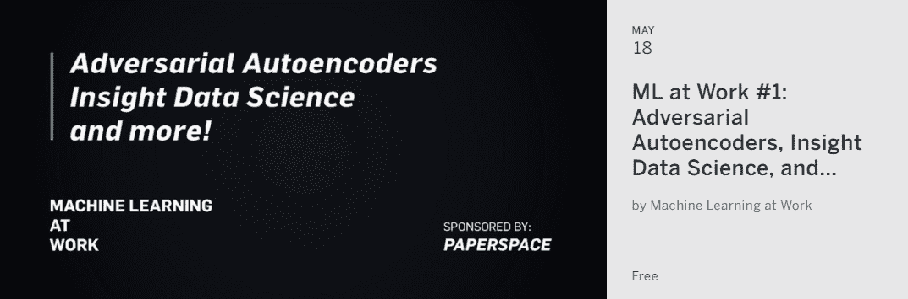

# 宣布官方 Paperspace Meetup:“工作中的机器学习”

> 原文：<https://blog.paperspace.com/machine-learning-at-work/>

你好，朋友。你是:

> *   A software developer tries to get a general idea of available products and services.

> *   A business analyst, product manager, marketing manager or consultant has heard that machine learning can help improve the products he or she is responsible for, but has no time to browse all the options.

> *   A data scientist wants to broaden their toolkit, from basic statistical techniques to the latest and best artificial intelligence toolkit.

> *   The leader of a business line tries to find the right way for their organization to put intelligence into their team's software, process and culture.

或者可能是世界上最重要的风险投资公司之一的有限合伙人，希望通过建立一个包含奇妙工具和其他资源的[剧本](http://aiplaybook.a16z.com/docs/intro/getting-started)来在一个新生领域建立思想领导力？:)那么你来对地方了——这个地方是我们新的聚会，“工作中的机器学习”

随着机器学习扩展到企业战略，我们认为培养一个学者、学生和专业人士可以一起实验和相互学习的社区非常重要。我们新成立的 meetup 小组“工作中的机器学习”(Machine Learning in Work)旨在通过一个新颖的程序来实现这一目标，该程序允许成员从研究和实践中学习，同时为他们提供空间，让他们用真实代码来破解和解决问题。

每个 meetup 都是一个小型的黑客马拉松，通过结构化的竞赛来强化所讨论的内容，希望社区能够学习和分享实用的技术和技能。

我们在 5 月 18 日的第一次 [meetup](https://www.meetup.com/Machine-Learning-at-Work/events/239568811/) 将举办非常特别的演讲，内容是关于对抗性自动编码器、我们的合作伙伴 Insight 的惊人工作、他们最近的 AI 研究员班以及 OpenAI 的最新工作。

我们将定期在纽约举办这些聚会，所以请随意[注册](https://www.meetup.com/Machine-Learning-at-Work/)以获取更多更新。如果你想为一项活动做贡献，我们总是在寻找有趣的话题——请联系 george@paperspace.com。