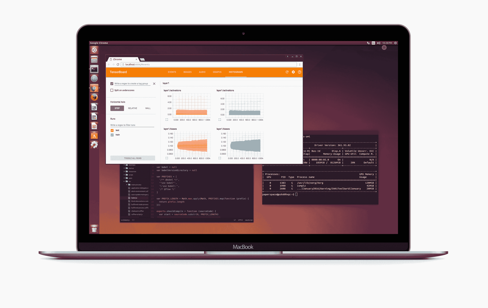
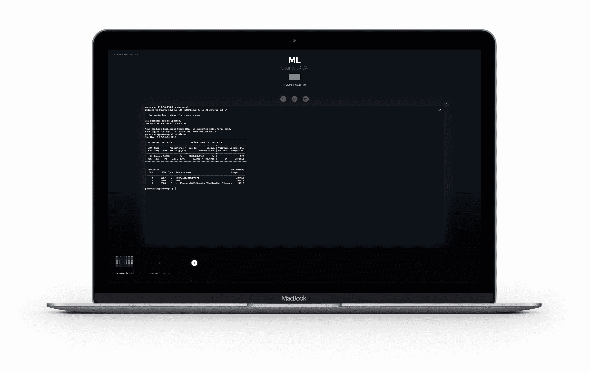
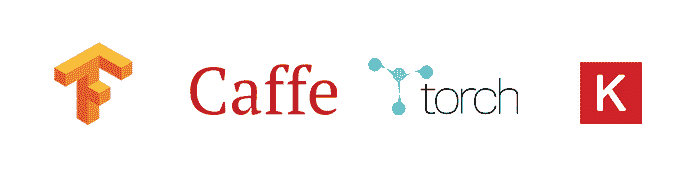

# 纸空间上的机器学习

> 原文：<https://blog.paperspace.com/machine-learning-on-paperspace/>

我们在 Paperspace 的大部分时间都在制作运行在 GPU 上的软件。鉴于我们对硬件的熟悉，我们认为用最新最棒的机器学习和深度学习软件入门会很容易。我们很快意识到，启动并运行一台新机器是一个令人惊讶的复杂过程，包括驱动程序版本、过时的教程、CUDA 版本、OpenBLAS 编译、Lua 配置等等。

运行在云端的 Ubuntu 桌面

> 更新:该产品最近出现在 [TechCrunch](https://techcrunch.com/2017/05/03/paperspace-launches-gpu-powered-virtual-machines-loaded-with-tools-for-data-scientists/) 上

我们在 Paperspace 的大部分时间都在制作运行在 GPU 上的软件。鉴于我们对硬件的熟悉，我们认为用最新最棒的机器学习和深度学习软件入门会很容易。我们很快意识到，启动并运行一台新机器是一个令人惊讶的复杂过程，包括驱动程序版本、过时的教程、CUDA 版本、OpenBLAS 编译、Lua 配置等等。

与此同时，在云中运行 GPU 的几个选项非常昂贵，[过时](http://www.infoworld.com/article/3126076/artificial-intelligence/aws-machine-learning-vms-go-faster-but-not-forward.html)并且没有针对这种类型的应用进行优化。

很明显，云中需要一个轻松的虚拟机，由强大的 GPU 支持，并预装所有最新的 ML 框架。

我们开始思考人们将如何与他们的纸空间机器交互，以寻找一个简单但仍然强大和熟悉的解决方案。

## 重新思考界面

在测试期间，我们很快了解到，虽然许多人精通终端，但他们倾向于在桌面环境中工作。为此，我们构建了一个直接在 web 浏览器中运行的完整桌面体验。

因为浏览器非常强大，我们也尝试直接在 Chrome 内部构建自己的终端。

基于网络的终端

当然，你总是可以用 SSH 连接，但是我们希望你可以用这两种新颖的方式与你的机器学习实例进行交互。

## 预配置模板:ML-in-a-box

从提供 web 服务器到运行 CAD 设计平台，我们在 Paperspace 内部使用模板，因此使用黄金标准的机器学习模板是有意义的。模板是运行虚拟机的最强大的特性之一——你只需要把所有的东西安装一次，然后你就可以克隆它，并根据你的需要共享它。

为了获得一个真正伟大的机器学习设置，我们遵循了很多指南，其中包括:
[https://github.com/saiprashanths/dl-setup](https://github.com/saiprashanths/dl-setup)

[http://Guanghan . info/blog/en/my-works/building-our-personal-deep-learning-rig-gtx-1080-Ubuntu-16-04-cuda-8-0rc-cud nn-7-tensorflowmxnetcaffedarknet/](http://guanghan.info/blog/en/my-works/building-our-personal-deep-learning-rig-gtx-1080-ubuntu-16-04-cuda-8-0rc-cudnn-7-tensorflowmxnetcaffedarknet/)

我们今天发布的版本包括(除其他外):

*   库达
*   cuDNN
*   TensorFlow
*   Python (numpy、ipython、matplotlib 等)
*   OpenBLAS
*   咖啡
*   提亚诺
*   火炬
*   Keras
*   最新的 GPU 驱动程序

当你今天启动一台 Paperspace Linux 机器时，你得到的是一台*刚刚工作*的机器。我们一直在改善基础形象，所以如果我们忘记了什么，请告诉我们！

## 更多 GPU 选项

我们的大部分基础设施都是围绕“虚拟”GPU 的 NVIDIA 网格架构构建的。对于更密集的任务，如模型训练、视觉效果和数据处理，我们需要找到一个更强大的 GPU。

与网格卡不同，我们开始寻找一种能够以“直通”模式运行的卡。在这种情况下，虚拟机可以完全访问卡，而不会产生任何虚拟化开销。

今天，我们有几个不同的 GPU 选项:NVIDIA M4000 是一个经济高效但功能强大的卡，而 NVIDIA P5000 是基于新的 Pascal 架构构建的，并针对机器学习和超高端模拟工作进行了大量优化。我们将在未来几个月增加几个选项。我们希望也包括一些 AMD 最新的 ML 优化卡，甚至可能包括专门为智能应用设计的硬件。

## 下一步是什么

我们对这将开启的可能性感到非常兴奋。现在还为时过早，我们肯定还有很多工作要做，但是早期的反馈非常积极，我们迫不及待地想让你尝试一下。

我们将为这一产品推出越来越多的功能，并建立一个由数据科学家和应用人工智能专业人员贡献技术内容和教程的社区。例如，Felipe Ducau(深度学习先驱 [Yann LeCun](https://en.wikipedia.org/wiki/Yann_LeCun) 的学生)最近写了被广泛阅读和转发的[“py torch 中的自动变分自动编码器”](https://blog.paperspace.com/adversarial-autoencoders-with-pytorch/)。Lily Hu 在 Insight AI Fellowship 期间创造了[一种分离医学图像中重叠染色体的算法](https://blog.insightdatascience.com/separating-overlapping-chromosomes-with-deep-learning-based-image-segmentation-22f97afd3283)，解决了人工智能开放网络(AI-ON)的一个突出问题。

要开始使用您自己的 ML-in-a-box 设置，[在此注册。](https://www.paperspace.com/account/signup?utm-campaign=mlblog)

订阅我们的博客，获取所有最新公告。

< 3 来自 Paperspace