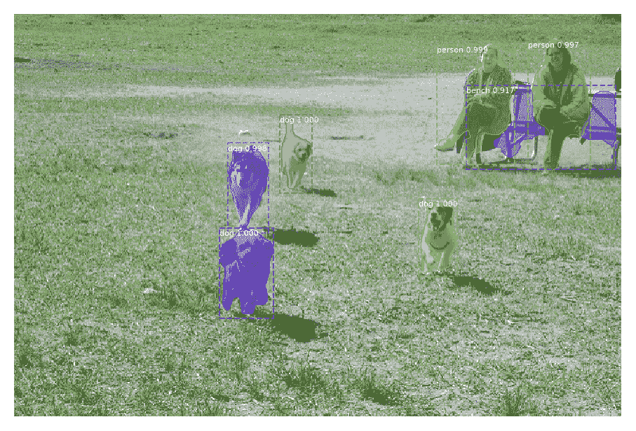
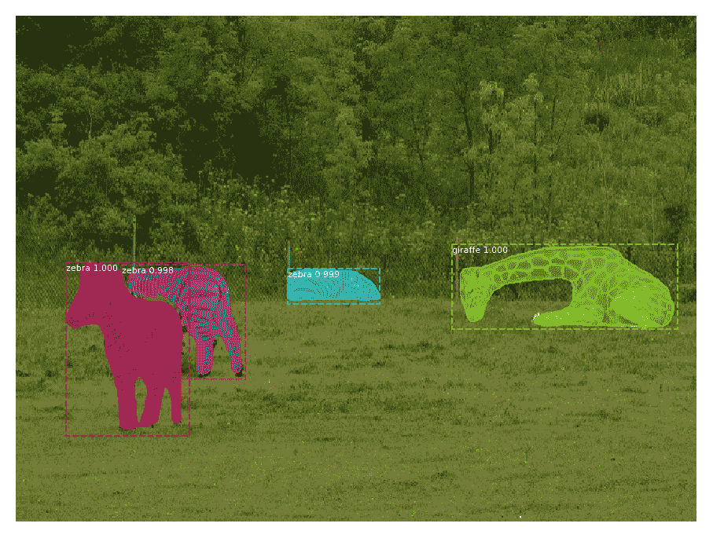
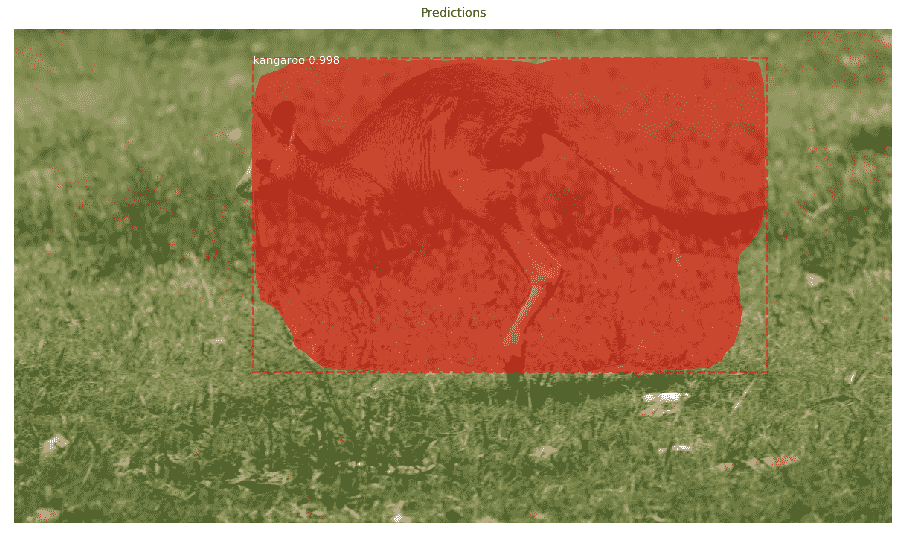

# 使用具有 TensorFlow 1.14 和 Keras 的掩模 R-CNN 的对象检测

> 原文：<https://blog.paperspace.com/mask-r-cnn-in-tensorflow-2-0/>

[Mask R-CNN](https://openaccess.thecvf.com/content_iccv_2017/html/He_Mask_R-CNN_ICCV_2017_paper.html) 是一组脸书 AI 研究人员在 2017 年开发的基于深度卷积神经网络(CNN)的物体检测模型。该模型可以为图像中每个检测到的对象返回边界框和遮罩。

该模型最初是使用 [Caffe2](https://github.com/facebookarchive/caffe2) 深度学习库在 Python 中开发的。原始源代码可以在 [GitHub](https://github.com/facebookresearch/Detectron) 上找到。为了用更流行的库(如 TensorFlow)支持 Mask R-CNN 模型，有一个流行的开源项目叫做 [Mask_RCNN](https://github.com/matterport/Mask_RCNN) ，它提供了一个基于 Keras 和 TensorFlow 1.14 的实现。

谷歌于 2020 年 9 月正式发布 TensorFlow 2.0。与 TensorFlow $\geq$ 1.0 相比，TensorFlow 2.0 组织得更好，也更容易学习。可惜的是， [Mask_RCNN](https://github.com/matterport/Mask_RCNN) 项目还不支持 TensorFlow 2.0。

本教程使用 TensorFlow 1.14 版本的 [Mask_RCNN](https://github.com/matterport/Mask_RCNN) 项目来使用自定义数据集进行预测和训练 Mask R-CNN 模型。在另一个教程中，该项目将被修改，使[面具 R-CNN 兼容 TensorFlow 2.0](https://blog.paperspace.com/mask-r-cnn-tensorflow-2-0-keras) 。

本教程涵盖以下内容:

*   [Mask_RCNN](https://github.com/matterport/Mask_RCNN) 项目概述
*   使用 TensorFlow 1.14 进行对象检测
*   准备模型配置参数
*   构建掩模 R-CNN 模型架构
*   加载模型权重
*   读取输入图像
*   检测物体
*   可视化结果
*   预测的完整代码
*   下载训练数据集
*   准备训练数据集
*   准备模型配置
*   TensorFlow 1.14 中的训练掩码 R-CNN
*   结论

## **Mask _ RCNN 项目概述**

这个 [Mask_RCNN](https://github.com/matterport/Mask_RCNN) 项目是开源的，可以在 GitHub 上的[获得](https://github.com/matterport/Mask_RCNN)[麻省理工学院的许可](https://github.com/matterport/Mask_RCNN/blob/master/LICENSE)，允许任何人免费使用、修改或分发代码。

这个项目的贡献是通过构建 Mask R-CNN 模型中的所有层，并提供一个简单的 API 来训练和测试它，从而支持 TensorFlow $\geq$ 1.0 中的 [Mask R-CNN](https://openaccess.thecvf.com/content_iccv_2017/html/He_Mask_R-CNN_ICCV_2017_paper.html) 对象检测模型。

掩模 R-CNN 模型预测图像中对象的类别标签、边界框和掩模。这是一个模型可以检测到什么的例子。



项目第一次发布( [Mask_RCNN 1.0](https://github.com/matterport/Mask_RCNN/releases/tag/v1.0) )发布于 2017 年 11 月 3 日。最新发布( [Mask_RCNN 2.1](https://github.com/matterport/Mask_RCNN/releases/tag/v2.1) )发布于 2019 年 3 月 20 日。此后，没有发布新的版本。

要在您的 PC 上获得该项目，只需根据下一个命令克隆它:

```py
$ git clone https://github.com/matterport/Mask_RCNN.git
```

也可以从[这个链接](https://blog.paperspace.com/mask-r-cnn-in-tensorflow-2-0/github.com/matterport/Mask_RCNN/archive/master.zip)下载 ZIP 文件形式的项目。让我们快速浏览一下本地可用的项目内容。

在撰写本教程时，该项目有 4 个目录:

1.  mrcnn :这是保存项目 Python 代码的核心目录。
2.  [samples](https://github.com/matterport/Mask_RCNN/tree/master/samples) : Jupyter 笔记本提供了一些使用项目的例子。
3.  [图像](https://github.com/matterport/Mask_RCNN/tree/master/images):测试图像的集合。
4.  [资产](https://github.com/matterport/Mask_RCNN/tree/master/assets):一些带注释的图片。

最重要的目录是 [mrcnn](https://github.com/matterport/Mask_RCNN/tree/master/mrcnn) ，因为它保存了项目的源代码。它包含以下 Python 文件:

*   `__init__.py`:将 [mrcnn](https://github.com/matterport/Mask_RCNN/tree/master/mrcnn) 文件夹标记为 Python 库。
*   `model.py`:具有用于构建层和模型的函数和类。
*   `config.py`:保存一个名为`Config`的类，该类保存一些关于模型的配置参数。
*   `utils.py`:包括一些帮助函数和类。
*   `visualize.py`:可视化模型的结果。
*   `parallel_model.py`:支持多个 GPU。

项目根目录下的一些文件是:

*   [setup.py](https://github.com/matterport/Mask_RCNN/blob/master/setup.py) :用于使用 **pip** 安装项目。
*   [README.md](https://github.com/matterport/Mask_RCNN/blob/master/README.md) :记录项目的 Markdown 文件。
*   [执照](https://github.com/matterport/Mask_RCNN/blob/master/LICENSE):麻省理工学院执照。
*   [requirements.txt](https://github.com/matterport/Mask_RCNN/blob/master/requirements.txt) :使用项目所需的库。

基于 [requirements.txt](https://github.com/matterport/Mask_RCNN/blob/master/requirements.txt) 文件，TensorFlow 版本必须至少为 1.3.0。对于 Keras，必须是 2.0.8 或更高版本。

有两种方法可以使用该项目:

1.  使用 **pip** 安装。
2.  将 [mrcnn](https://github.com/matterport/Mask_RCNN/tree/master/mrcnn) 文件夹复制到您将使用该项目的位置。在这种情况下，确保安装了 [requirements.txt](https://github.com/matterport/Mask_RCNN/blob/master/requirements.txt) 文件中所有需要的库。

要安装该项目，只需从命令提示符或终端发出以下命令。对于 Windows 以外的平台，将“python”替换为“python3”。

```py
python setup.py install
```

使用项目的另一种方法是将 mrcnn 文件夹复制到项目将被使用的地方。假设有一个名为“Object Detection”的目录，其中有一个名为`object_detection.py`的 Python 文件，它使用了 [mrcnn](https://github.com/matterport/Mask_RCNN/tree/master/mrcnn) 文件夹中的代码。然后，简单地复制“对象检测”目录中的 [mrcnn](https://github.com/matterport/Mask_RCNN/tree/master/mrcnn) 文件夹。

下面是目录结构:

```py
Object Detection
	mrcnn
	object_detection.py
```

现在我们准备使用 Mask_RCNN 项目。下一节讨论如何在 TensorFlow $\geq$ 1.0 中使用该项目。

## **tensor flow 1 中的对象检测**

在开始本节之前，请确保安装了 TensorFlow 1 ($\geq$1.3.0)。您可以使用以下代码检查版本:

```py
import tensorflow

print(tensorflow.__version__)
```

使用 Mask_RCNN 项目检测图像中的对象的步骤如下:

1.  准备模型配置参数。
2.  构建掩膜 R-CNN 模型架构。
3.  加载模型重量。
4.  读取输入图像。
5.  检测图像中的对象。
6.  将结果可视化。

本节构建了一个示例，该示例使用预训练的掩码 R-CNN 来检测 COCO 数据集中的对象。接下来的小节将讨论上面列出的每个步骤。

### **1。准备模型配置参数**

为了建立屏蔽 R-CNN 模型，必须指定几个参数。这些参数控制非最大抑制(NMS)、联合交集(IoU)、图像大小、每幅图像的 ROI 数量、ROI 合并层等。

`mrcnn`文件夹有一个名为`config.py`的脚本，其中有一个名为`Config`的类。这个类有一些参数的默认值。您可以扩展该类并覆盖一些默认参数。下面的代码创建了一个名为`SimpleConfig`的新类，它扩展了`mrcnn.config.Config`类。

```py
import mrcnn.config

class SimpleConfig(mrcnn.config.Config):
	...
```

必须覆盖的一个关键参数是类的数量，默认为 1。

```py
NUM_CLASSES = 1
```

在这个例子中，模型检测来自 COCO 数据集的图像中的对象。这个数据集有 80 个类。记住，背景必须被视为一个附加类。因此，班级总数为 81。

```py
NUM_CLASSES = 81
```

另外两个参数需要仔细赋值，分别是`GPU_COUNT`和`IMAGES_PER_GPU`。它们分别默认为 1 和 2。

这两个变量用于计算批量大小:

```py
BATCH_SIZE = IMAGES_PER_GPU * GPU_COUNT
```

假设使用默认值，那么批量大小为`2*1=2`。这意味着两个图像被一次输入到模型中。因此，用户必须一次输入 2 幅图像。

在某些情况下，用户只对检测单个图像中的对象感兴趣。因此，`IMAGES_PER_GPU`属性应该设置为 1。

```py
GPU_COUNT = 1
IMAGES_PER_GPU = 1
```

下面是配置类的完整代码。`NAME`属性是配置的唯一名称。

```py
import mrcnn.config

class SimpleConfig(mrcnn.config.Config):
	NAME = "coco_inference"

	GPU_COUNT = 1
	IMAGES_PER_GPU = 1

	NUM_CLASSES = 81
```

### **2。构建掩膜 R-CNN 模型架构**

为了构建 Mask R-CNN 模型架构，`mrcnn.model`脚本有一个名为`MaskRCNN`的类。该类的构造函数接受 3 个参数:

1.  `mode`:不是`"training"`就是`"inference"`。
2.  `config`:配置类的一个实例。
3.  `model_dir`:保存训练日志和训练重量的目录。

下一个例子创建了一个`mrcnn.model.MaskRCNN`类的实例。创建的实例保存在`model`变量中。

```py
import mrcnn.model

model = mrcnn.model.MaskRCNN(mode="inference", 
                             config=SimpleConfig(),
                             model_dir=os.getcwd())
```

Keras 模型保存在实例的`keras_model`属性中。使用该属性，可以打印模型的概要。

```py
model.keras_model.summary()
```

模式架构大；下面只列出了上下 4 层。名为`mrcnn_mask`的最后一层仅返回前 100 个 ROI 的掩膜。

```py
___________________________________________________________________________
Layer (type)                    Output Shape         Param #     Connected to
===========================================================================
input_image (InputLayer)        (None, None, None, 3 0         
___________________________________________________________________________
zero_padding2d_1 (ZeroPadding2D (None, None, None, 3 0           input_image[0][0]
___________________________________________________________________________
conv1 (Conv2D)                  (None, None, None, 6 9472        zero_padding2d_1[0][0]
___________________________________________________________________________
bn_conv1 (BatchNorm)            (None, None, None, 6 256         conv1[0][0]
___________________________________________________________________________
...
___________________________________________________________________________
mrcnn_mask_bn4 (TimeDistributed (None, 100, 14, 14,  1024        mrcnn_mask_conv4[0][0]
___________________________________________________________________________
activation_74 (Activation)      (None, 100, 14, 14,  0           mrcnn_mask_bn4[0][0]
___________________________________________________________________________
mrcnn_mask_deconv (TimeDistribu (None, 100, 28, 28,  262400      activation_74[0][0]
___________________________________________________________________________
mrcnn_mask (TimeDistributed)    (None, 100, 28, 28,  20817       mrcnn_mask_deconv[0][0]
===========================================================================
Total params: 64,158,584
Trainable params: 64,047,096
Non-trainable params: 111,488
```

### **3。加载模型重量**

最后一小节创建了模型架构。该子部分使用`load_weights()`方法在创建的模型中加载权重。它是 Keras `load_weights()`方法的修改版本，除了能够排除一些层之外，还支持多 GPU 使用。

使用的两个参数是:

1.  `filepath`:接受权重文件的路径。
2.  `by_name`:如果为真，那么每个层根据其名称分配权重。

下一段代码调用`load_weights()`方法，同时传递权重文件`mask_rcnn_coco.h5`的路径。这个文件可以从[这个链接](https://github.com/matterport/Mask_RCNN/releases/download/v2.0/mask_rcnn_coco.h5)下载。

```py
model.load_weights(filepath="mask_rcnn_coco.h5", 
                   by_name=True)
```

### **4。读取输入图像**

一旦创建了模型并加载了它的权重，接下来我们需要读取一个图像并将其提供给模型。

下一段代码使用 OpenCV 读取图像，并将其颜色通道重新排序为 RGB，而不是 BGR。

```py
import cv2

image = cv2.imread("3627527276_6fe8cd9bfe_z.jpg")
image = cv2.cvtColor(image, cv2.COLOR_BGR2RGB)
```

下图显示了我们刚刚阅读的图像。图片可在[链接](https://github.com/matterport/Mask_RCNN/blob/mastimg/3627527276_6fe8cd9bfe_z.jpg)获得。


### **5。检测物体**

给定模型和输入图像，可以使用`detect()`方法检测图像中的物体。它接受两个参数:

1.  `images`:图像列表。
2.  `verbose`:设置为 1，则打印一些日志信息。

下面的代码调用了`detect()`方法。请注意，分配给`images`参数的列表长度必须等于批处理大小。基于我们设置的`GPU_COUNT`和`IMAGES_PER_GPU`配置属性，批量大小为 1。因此，列表必须只有一个图像。检测的结果在`r`变量中返回。

```py
r = model.detect(images=[image], 
                 verbose=0)
```

如果传递了一个以上的图像(如`images=[image, image, image]`)，则会引发以下异常，指示`images`参数的长度必须等于`BATCH_SIZE`配置属性。

```py
...
File "D:\Object Detection\Pure Keras\mrcnn\model.py", in detect
	assert len(images) == self.config.BATCH_SIZE, "len(images) must be equal to BATCH_SIZE"

AssertionError: len(images) must be equal to BATCH_SIZE
```

对于每个输入图像，`detect()`方法返回一个字典，该字典保存关于检测到的对象的信息。为了返回关于输入到模型中的第一幅图像的信息，索引`0`与变量`r`一起使用。

```py
r = r[0]
```

下面的代码打印字典中的键。字典中有 4 个元素，具有以下键:

1.  `rois`:每个被检测物体周围的方框。
2.  `class_ids`:对象的类别 id。
3.  `scores`:每个对象的类分数。
4.  `masks`:面具。

```py
print(r.keys())
```

```py
dict_keys(['rois', 'class_ids', 'scores', 'masks'])
```

### **6。将结果可视化**

一旦`detect()`方法完成，就该可视化检测到的对象了。`mrcnn.visualize`脚本用于此目的。`mrcnn.visualize.display_instances()`功能用于显示检测框、掩码、类名和分数。

在该函数接受的参数中，使用了以下参数:

*   `image`:绘制检测框和遮罩的图像。
*   `boxes`:检测盒。
*   `masks`:检测到的屏蔽。
*   `class_ids`:检测到的类别 id。
*   `class_names`:数据集中的类名列表。
*   `scores`:每个对象的预测分数。

在下面的代码中，类名准备在`CLASS_NAMES`列表中。注意第一个类的类标签是`BG`用于背景。调用`mrcnn.visualize.display_instances()`函数来显示带注释的图像。

```py
import mrcnn.visualize

CLASS_NAMES = ['BG', 'person', 'bicycle', 'car', 'motorcycle', 'airplane', 'bus', 'train', 'truck', 'boat', 'traffic light', 'fire hydrant', 'stop sign', 'parking meter', 'bench', 'bird', 'cat', 'dog', 'horse', 'sheep', 'cow', 'elephant', 'bear', 'zebra', 'giraffe', 'backpack', 'umbrella', 'handbag', 'tie', 'suitcase', 'frisbee', 'skis', 'snowboard', 'sports ball', 'kite', 'baseball bat', 'baseball glove', 'skateboard', 'surfboard', 'tennis racket', 'bottle', 'wine glass', 'cup', 'fork', 'knife', 'spoon', 'bowl', 'banana', 'apple', 'sandwich', 'orange', 'broccoli', 'carrot', 'hot dog', 'pizza', 'donut', 'cake', 'chair', 'couch', 'potted plant', 'bed', 'dining table', 'toilet', 'tv', 'laptop', 'mouse', 'remote', 'keyboard', 'cell phone', 'microwave', 'oven', 'toaster', 'sink', 'refrigerator', 'book', 'clock', 'vase', 'scissors', 'teddy bear', 'hair drier', 'toothbrush']

r = r[0]

mrcnn.visualize.display_instances(image=image, 
                                  boxes=r['rois'], 
                                  masks=r['masks'], 
                                  class_ids=r['class_ids'], 
                                  class_names=CLASS_NAMES, 
                                  scores=r['scores'])
```

执行该函数后，会显示一个图形(如下所示),在该图形上绘制了方框、掩码、班级分数和标签。



至此，讨论了使用 Mask_RCNN 项目检测对象所需的所有步骤。

## **预测的完整代码**

下面列出了使用 Mask_RCNN 项目检测图像中的对象的完整代码。

```py
import mrcnn
import mrcnn.config
import mrcnn.model
import mrcnn.visualize
import cv2
import os

CLASS_NAMES = ['BG', 'person', 'bicycle', 'car', 'motorcycle', 'airplane', 'bus', 'train', 'truck', 'boat', 'traffic light', 'fire hydrant', 'stop sign', 'parking meter', 'bench', 'bird', 'cat', 'dog', 'horse', 'sheep', 'cow', 'elephant', 'bear', 'zebra', 'giraffe', 'backpack', 'umbrella', 'handbag', 'tie', 'suitcase', 'frisbee', 'skis', 'snowboard', 'sports ball', 'kite', 'baseball bat', 'baseball glove', 'skateboard', 'surfboard', 'tennis racket', 'bottle', 'wine glass', 'cup', 'fork', 'knife', 'spoon', 'bowl', 'banana', 'apple', 'sandwich', 'orange', 'broccoli', 'carrot', 'hot dog', 'pizza', 'donut', 'cake', 'chair', 'couch', 'potted plant', 'bed', 'dining table', 'toilet', 'tv', 'laptop', 'mouse', 'remote', 'keyboard', 'cell phone', 'microwave', 'oven', 'toaster', 'sink', 'refrigerator', 'book', 'clock', 'vase', 'scissors', 'teddy bear', 'hair drier', 'toothbrush']

class SimpleConfig(mrcnn.config.Config):
    NAME = "coco_inference"

    GPU_COUNT = 1
    IMAGES_PER_GPU = 1

    NUM_CLASSES = len(CLASS_NAMES)

model = mrcnn.model.MaskRCNN(mode="inference", 
                             config=SimpleConfig(),
                             model_dir=os.getcwd())

model.load_weights(filepath="mask_rcnn_coco.h5", 
                   by_name=True)

image = cv2.imread("sample2.jpg")
image = cv2.cvtColor(image, cv2.COLOR_BGR2RGB)

r = model.detect([image], verbose=0)

r = r[0]

mrcnn.visualize.display_instances(image=image, 
                                  boxes=r['rois'], 
                                  masks=r['masks'], 
                                  class_ids=r['class_ids'], 
                                  class_names=CLASS_NAMES, 
                                  scores=r['scores'])
```

至此，进行预测的代码已经完成。本教程的剩余部分将讨论如何使用自定义训练数据集来训练 Mask R-CNN 模型。下一节下载数据集。

## **下载训练数据集**

你必须有一个数据集来训练机器学习或深度学习模型。对于训练数据中的每个样本，可能都有基本事实数据。这些数据可能是简单的，如类标签，也可能是复杂的，如用于对象检测模型的数据。

通常，对象检测模型的地面实况数据包括图像内每个对象的**边界框**和**类别标签**。具体到 Mask R-CNN 模型，有一个额外的 **mask** 标记属于物体的像素。

每个图像可能有一个以上的对象，因此为整个数据集准备地面实况数据是令人厌倦的。

在本节中，现有的袋鼠图像数据集用于使用 [Mask_RCNN](https://github.com/matterport/Mask_RCNN) 项目训练 Mask R-CNN。袋鼠数据集可以在[这里](https://github.com/experiencor/kangaroo)下载。它带有注释数据(即地面实况数据)，因此随时可以使用。

下图显示了数据集中绘制了预测边界框、遮罩和分数的图像。请注意，该掩码并不准确，因为该模型仅针对单个时期进行了训练。



数据集有两个文件夹:

1.  **图像**:数据集中的图像。
2.  **注释**:每个图像的注释作为一个单独的 XML 文件。

下一部分准备数据集，以供以后用于训练和验证 Mask R-CNN 模型。

## **准备训练数据集**

Mask_RCNN 项目在`mrcnn.utils`模块中有一个名为`Dataset`的类。这个类只是在列表中存储所有训练图像的信息。当所有图像的细节都存储在单个数据结构中时，管理数据集将更加容易。

例如，有一个名为`class_info`的列表，其中保存了关于数据集中每个类的信息。类似地，一个名为`image_info`的列表保存了每个图像的信息。为了训练掩模 R-CNN 模型，使用`image_info`列表来检索训练图像及其注释。注释包括每个图像中所有对象的边界框和类别标签。

`mrcnn.utils.Dataset`类有许多有用的方法，包括:

*   `add_class()`:添加一个新类。
*   `add_image()`:向数据集添加新图像。
*   `image_reference()`:检索图像的参考(如路径或链接)。
*   `prepare()`:在将所有的类和图像添加到数据集之后，该方法准备数据集以供使用。
*   `source_image_link()`:返回图像的路径或链接。
*   `load_image()`:读取并返回图像。
*   `load_mask()`:加载图像中物体的蒙版。

下一个代码块创建一个名为`KangaroDataset`的`mrcnn.utils.Dataset`的空实例。

```py
import mrcnn.utils

class KangarooDataset(mrcnn.utils.Dataset):
    pass
```

在新类中，如果需要定制，可以随意覆盖前面提到的任何方法。此外，添加任何可能有帮助的新方法。

在前面列出的所有方法中，`load_mask()`方法必须被覆盖。原因是检索对象的掩码因注释文件格式而异，因此没有加载掩码的单一方法。因此，加载掩码是开发人员必须完成的任务。

在下面的下一个代码块中，我们将构建 3 个方法:

1.  `load_dataset()`:它接受`images`和`annots`文件夹所在的目录，此外还有一个布尔参数，表示该目录是引用训练数据还是验证数据。
2.  `load_mask()`:这个方法加载袋鼠数据集的遮罩。它接受`image_id`参数中的图像 ID。图像 ID 只是每个图像的唯一值。请随意分配您选择的 id。该方法返回每个对象的掩码和类 id。注意，这个数据集只有一个表示袋鼠的类。
3.  `extract_boxes`:`load_mask()`方法调用`extract_boxes()`方法，该方法负责返回每个边界框的坐标，以及每个图像的宽度和高度。

这三种方法的实现在下一个代码块中列出。

`load_dataset()`方法中的第一行调用`add_class()`方法来创建一个名为`kangaroo`的类，ID 为`1`。还有一个 ID 为`0`的类，是标签为`BG`的背景。我们不需要显式地添加它，因为它是默认存在的。最后一行调用`add_image()`方法将图像添加到数据集。图像 ID、路径和注释文件的路径被传递给该方法。

`load_dataset()`方法分割数据集，这样 150 幅图像用于训练，而其余的用于测试。

```py
import mrcnn.utils

class KangarooDataset(mrcnn.utils.Dataset):

    def load_dataset(self, dataset_dir, is_train=True):
		self.add_class("dataset", 1, "kangaroo")

		images_dir = dataset_dir +img/'
		annotations_dir = dataset_dir + '/annots/'

		for filename in os.listdir(images_dir):
			image_id = filename[:-4]

			if image_id in ['00090']:
				continue

			if is_train and int(image_id) >= 150:
				continue

			if not is_train and int(image_id) < 150:
				continue

			img_path = images_dir + filename
			ann_path = annotations_dir + image_id + '.xml'

			self.add_image('dataset', image_id=image_id, path=img_path, annotation=ann_path)

    def extract_boxes(self, filename):
		tree = xml.etree.ElementTree.parse(filename)

		root = tree.getroot()

		boxes = list()
		for box in root.findall('.//bndbox'):
			xmin = int(box.find('xmin').text)
			ymin = int(box.find('ymin').text)
			xmax = int(box.find('xmax').text)
			ymax = int(box.find('ymax').text)
			coors = [xmin, ymin, xmax, ymax]
			boxes.append(coors)

		width = int(root.find('.//size/width').text)
		height = int(root.find('.//size/height').text)
		return boxes, width, height

    def load_mask(self, image_id):
		info = self.image_info[image_id]
		path = info['annotation']
		boxes, w, h = self.extract_boxes(path)
		masks = zeros([h, w, len(boxes)], dtype='uint8')

		class_ids = list()
		for i in range(len(boxes)):
			box = boxes[i]
			row_s, row_e = box[1], box[3]
			col_s, col_e = box[0], box[2]
			masks[row_s:row_e, col_s:col_e, i] = 1
			class_ids.append(self.class_names.index('kangaroo'))
		return masks, asarray(class_ids, dtype='int32')
```

基于`KangarooDataset`类，下面的代码准备了训练数据集。简单地创建了该类的一个新实例。为了加载图像，调用了`load_dataset()`方法，该方法接受数据集图像的路径及其在`dataset_dir`参数中的注释。这都是除了`is_train`旗。如果这个 fag 是`True`，那么这个数据就是训练数据。否则，数据将用于验证或测试。

调用`prepare()`方法来准备数据集以供使用。它只是创建了更多关于数据的属性，比如类的数量、图像的数量等等。

```py
train_set = KangarooDataset()
train_set.load_dataset(dataset_dir='D:\kangaroo', is_train=True)
train_set.prepare()
```

类似地，验证数据集是根据下面的代码准备的。唯一的区别是`is_train`标志被设置为`False`。

```py
valid_dataset = KangarooDataset()
valid_dataset.load_dataset(dataset_dir='D:\kangaroo', is_train=False)
valid_dataset.prepare()
```

下一节将为模型准备一些配置参数。

## **准备模型配置**

必须创建一个`mrcnn.config.Config`类的子类来保存模型配置参数。下一段代码创建了一个名为`KangarooConfig`的新类，它扩展了`mrcnn.config.Config`类。

注意，类的数量(`NUM_CLASSES`)被设置为 2，因为数据集只有 2 个类，它们是`BG`(用于背景)和`kangaroo`。

```py
import mrcnn.config

class KangarooConfig(mrcnn.config.Config):
    NAME = "kangaroo_cfg"

    GPU_COUNT = 1
    IMAGES_PER_GPU = 1

    NUM_CLASSES = 2

    STEPS_PER_EPOCH = 131
```

准备好数据集和模型配置后，下一节讨论使用 TensorFlow 1.0 训练 Mask R-CNN 模型。

## **在 TensorFlow 1.0 中训练屏蔽 R-CNN**

本节假设安装了 TensorFlow 1.0 版本，并用于运行上述代码。还可以创建一个安装了 TensorFlow 1.0 的虚拟环境。

接下来的代码创建了一个`mrcnn.model.MaskRCNN`类的实例，它构建了 Mask R-CNN 模型的架构。`mode`参数被设置为`'training'`以指示模型将被训练。当加载模型用于训练时，与仅加载模型用于推断(即预测)相比，存在额外的输入层。额外的层保存输入图像及其注释(例如边界框)。

```py
import mrcnn.model
model = mrcnn.model.MaskRCNN(mode='training', 
                             model_dir='./', 
                             config=KangarooConfig())
```

一旦创建了模型架构，就使用`load_weights()`方法根据下一个代码加载权重。该方法接受以下 3 个参数:

1.  `filepath`:权重文件的路径。`mask_rcnn_coco.h5`文件可以从[这个链接](https://github.com/matterport/Mask_RCNN/releases/download/v2.0/mask_rcnn_coco.h5)下载。
2.  `by_name`:是否根据层的名称分配层的权重。
3.  `exclude`:我们不为其加载权重的层的名称。这些是体系结构顶部的层，根据问题类型(例如，类的数量)而变化。

被排除的图层是那些负责生成类别概率、边界框和遮罩的图层。

```py
model.load_weights(filepath='mask_rcnn_coco.h5', 
                   by_name=True, 
                   exclude=["mrcnn_class_logits", "mrcnn_bbox_fc",  "mrcnn_bbox", "mrcnn_mask"])
```

将权重加载到模型层后，使用`train()`方法训练模型。请注意，`layers`参数被设置为`heads`,表示只训练体系结构顶部的层。您也可以指定要训练的层名称。

请注意，`load_weights()`方法中的`exclude`参数接受不会加载其权重的层名称，但是`train()`方法中的`layers`参数接受要训练的层名称。

```py
model.train(train_dataset=train_set, 
            val_dataset=valid_dataset, 
            learning_rate=KangarooConfig().LEARNING_RATE, 
            epochs=10, 
            layers='heads')
```

训练时间根据机器的计算能力而不同。如果你用一个功能强大的低成本 GPU 在 Gradient 上运行训练，应该会相对快一些。一旦模型被训练，可以使用 Keras `save_weights()`方法保存训练的权重。

```py
model_path = 'Kangaroo_mask_rcnn.h5'
model.keras_model.save_weights(model_path)
```

这是训练模型的完整代码。

```py
import os
import xml.etree
from numpy import zeros, asarray

import mrcnn.utils
import mrcnn.config
import mrcnn.model

class KangarooDataset(mrcnn.utils.Dataset):

	def load_dataset(self, dataset_dir, is_train=True):
		self.add_class("dataset", 1, "kangaroo")

		images_dir = dataset_dir +img/'
		annotations_dir = dataset_dir + '/annots/'

		for filename in os.listdir(images_dir):
			image_id = filename[:-4]

			if image_id in ['00090']:
				continue

			if is_train and int(image_id) >= 150:
				continue

			if not is_train and int(image_id) < 150:
				continue

			img_path = images_dir + filename
			ann_path = annotations_dir + image_id + '.xml'

			self.add_image('dataset', image_id=image_id, path=img_path, annotation=ann_path)

	def extract_boxes(self, filename):
		tree = xml.etree.ElementTree.parse(filename)

		root = tree.getroot()

		boxes = list()
		for box in root.findall('.//bndbox'):
			xmin = int(box.find('xmin').text)
			ymin = int(box.find('ymin').text)
			xmax = int(box.find('xmax').text)
			ymax = int(box.find('ymax').text)
			coors = [xmin, ymin, xmax, ymax]
			boxes.append(coors)

		width = int(root.find('.//size/width').text)
		height = int(root.find('.//size/height').text)
		return boxes, width, height

	def load_mask(self, image_id):
		info = self.image_info[image_id]
		path = info['annotation']
		boxes, w, h = self.extract_boxes(path)
		masks = zeros([h, w, len(boxes)], dtype='uint8')

		class_ids = list()
		for i in range(len(boxes)):
			box = boxes[i]
			row_s, row_e = box[1], box[3]
			col_s, col_e = box[0], box[2]
			masks[row_s:row_e, col_s:col_e, i] = 1
			class_ids.append(self.class_names.index('kangaroo'))
		return masks, asarray(class_ids, dtype='int32')

class KangarooConfig(mrcnn.config.Config):
    NAME = "kangaroo_cfg"

    GPU_COUNT = 1
    IMAGES_PER_GPU = 1

    NUM_CLASSES = 2

    STEPS_PER_EPOCH = 131

train_set = KangarooDataset()
train_set.load_dataset(dataset_dir='kangaroo', is_train=True)
train_set.prepare()

valid_dataset = KangarooDataset()
valid_dataset.load_dataset(dataset_dir='kangaroo', is_train=False)
valid_dataset.prepare()

kangaroo_config = KangarooConfig()

model = mrcnn.model.MaskRCNN(mode='training', 
                             model_dir='./', 
                             config=kangaroo_config)

model.load_weights(filepath='mask_rcnn_coco.h5', 
                   by_name=True, 
                   exclude=["mrcnn_class_logits", "mrcnn_bbox_fc",  "mrcnn_bbox", "mrcnn_mask"])

model.train(train_dataset=train_set, 
            val_dataset=valid_dataset, 
            learning_rate=kangaroo_config.LEARNING_RATE, 
            epochs=1, 
            layers='heads')

model_path = 'Kangaro_mask_rcnn.h5'
model.keras_model.save_weights(model_path)
```

## **结论**

本教程介绍了开源 Python 项目 [Mask_RCNN](https://github.com/matterport/Mask_RCNN) ，它为对象实例分割构建了 Mask R-CNN 模型。该项目仅支持 TensorFlow $\geq$ 1.0 版本。本教程讲述了进行预测以及在自定义数据集上训练模型的步骤。

在训练模型之前，使用`mrcnn.utils.Dataset`类的子类准备训练和验证数据集。准备好模型配置参数后，就可以对模型进行训练了。

在下一个教程中，我们将看到如何编辑项目，以支持在 TensorFlow 2.0 中使用 [Mask R-CNN 进行训练和预测。](https://blog.paperspace.com/mask-r-cnn-tensorflow-2-0-keras/)