# 使用平均精度(mAP)评估目标检测模型

> 原文：<https://blog.paperspace.com/mean-average-precision/>

为了评估像 R-CNN 和 [YOLO](https://blog.paperspace.com/how-to-implement-a-yolo-object-detector-in-pytorch/) 这样的对象检测模型，使用了**平均精度(mAP)** 。地图将地面实况边界框与检测到的框进行比较，并返回一个分数。分数越高，模型的检测就越准确。

在我的上一篇文章中，我们详细研究了[混淆矩阵、模型准确度、精确度和召回率](https://blog.paperspace.com/deep-learning-metrics-precision-recall-accuracy)。我们还使用 Scikit-learn 库来计算这些指标。现在我们将扩展我们的讨论，看看如何使用精度和召回来计算地图。

以下是本教程涵盖的部分:

*   从预测分数到类别标签
*   精确回忆曲线
*   平均精度
*   并集上的交集
*   目标检测的平均精度

让我们开始吧。

## **从预测分数到类别标签**

在本节中，我们将快速回顾一个类别标签是如何从预测分数中获得的。

假设有两类，*阳性*和*阴性*，这里是 10 个样本的地面实况标签。

```py
y_true = ["positive", "negative", "negative", "positive", "positive", "positive", "negative", "positive", "negative", "positive"]
```

当这些样本输入模型时，它会返回以下预测得分。根据这些分数，我们如何对样本进行分类(即给每个样本分配一个类别标签)？

```py
pred_scores = [0.7, 0.3, 0.5, 0.6, 0.55, 0.9, 0.4, 0.2, 0.4, 0.3]
```

为了将分数转换成类别标签，**使用阈值**。当分数等于或高于阈值时，样本被分类为一类。否则，它被归类为其他类。假设一个样本的分数高于或等于阈值，则该样本为*阳性*。否则，就是*负*。下一个代码块将分数转换成阈值为 **0.5** 的类标签。

```py
import numpy

pred_scores = [0.7, 0.3, 0.5, 0.6, 0.55, 0.9, 0.4, 0.2, 0.4, 0.3]
y_true = ["positive", "negative", "negative", "positive", "positive", "positive", "negative", "positive", "negative", "positive"]

threshold = 0.5
y_pred = ["positive" if score >= threshold else "negative" for score in pred_scores]
print(y_pred)
```

```py
['positive', 'negative', 'positive', 'positive', 'positive', 'positive', 'negative', 'negative', 'negative', 'negative']
```

现在，`y_true`和`y_pred`变量中既有实际标签也有预测标签。基于这些标签，可以计算出[混淆矩阵、精确度和召回率](https://blog.paperspace.com/deep-learning-metrics-precision-recall-accuracy/)。

```py
r = numpy.flip(sklearn.metrics.confusion_matrix(y_true, y_pred))
print(r)

precision = sklearn.metrics.precision_score(y_true=y_true, y_pred=y_pred, pos_label="positive")
print(precision)

recall = sklearn.metrics.recall_score(y_true=y_true, y_pred=y_pred, pos_label="positive")
print(recall)
```

```py
# Confusion Matrix (From Left to Right & Top to Bottom: True Positive, False Negative, False Positive, True Negative)
[[4 2]
 [1 3]]

# Precision = 4/(4+1)
0.8

# Recall = 4/(4+2)
0.6666666666666666
```

在快速回顾了计算精度和召回率之后，下一节我们将讨论创建精度-召回率曲线。

## **精确召回曲线**

根据[第 1 部分](https://blog.paperspace.com/deep-learning-metrics-precision-recall-accuracy/)中给出的精确度和召回率的定义，记住精确度越高，模型在将样本分类为*阳性*时就越有信心。召回率越高，模型正确归类为*阳性*的阳性样本就越多。

> 当一个模型具有高召回率但低精确度时，那么该模型正确地分类了大多数阳性样本，但是它具有许多假阳性(即，将许多*阴性*样本分类为*阳性*)。当模型具有高精度但低召回率时，那么当它将样本分类为*阳性*时，该模型是准确的，但是它可能仅分类一些阳性样本。

由于精确度和召回率的重要性，有一条**精确度-召回率曲线**显示了不同阈值的精确度和召回率值之间的权衡。该曲线有助于选择最佳阈值来最大化这两个指标。

创建精确召回曲线需要一些输入:

1.  真相标签。
2.  样本的预测分数。
3.  将预测分数转换成类别标签的一些阈值。

下一个代码块创建用于保存基本事实标签的`y_true`列表，用于预测分数的`pred_scores`列表，以及用于不同阈值的`thresholds`列表。

```py
import numpy

y_true = ["positive", "negative", "negative", "positive", "positive", "positive", "negative", "positive", "negative", "positive", "positive", "positive", "positive", "negative", "negative", "negative"]

pred_scores = [0.7, 0.3, 0.5, 0.6, 0.55, 0.9, 0.4, 0.2, 0.4, 0.3, 0.7, 0.5, 0.8, 0.2, 0.3, 0.35]

thresholds = numpy.arange(start=0.2, stop=0.7, step=0.05)
```

以下是保存在`thresholds`列表中的阈值。因为有 10 个阈值，所以将创建 10 个精度和召回值。

```py
[0.2, 
 0.25, 
 0.3, 
 0.35, 
 0.4, 
 0.45, 
 0.5, 
 0.55, 
 0.6, 
 0.65]
```

下一个名为`precision_recall_curve()`的函数接受基本事实标签、预测分数和阈值。它返回两个表示精度和召回值的等长列表。

```py
import sklearn.metrics

def precision_recall_curve(y_true, pred_scores, thresholds):
    precisions = []
    recalls = []

    for threshold in thresholds:
        y_pred = ["positive" if score >= threshold else "negative" for score in pred_scores]

        precision = sklearn.metrics.precision_score(y_true=y_true, y_pred=y_pred, pos_label="positive")
        recall = sklearn.metrics.recall_score(y_true=y_true, y_pred=y_pred, pos_label="positive")

        precisions.append(precision)
        recalls.append(recall)

    return precisions, recalls
```

下一段代码在传递了三个预先准备好的列表后调用`precision_recall_curve()`函数。它返回分别保存精度和召回的所有值的`precisions`和`recalls`列表。

```py
precisions, recalls = precision_recall_curve(y_true=y_true, 
                                             pred_scores=pred_scores,
                                             thresholds=thresholds)
```

以下是`precisions`列表中的返回值。

```py
[0.5625,
 0.5714285714285714,
 0.5714285714285714,
 0.6363636363636364,
 0.7,
 0.875,
 0.875,
 1.0,
 1.0,
 1.0]
```

以下是`recalls`列表中的值列表。

```py
[1.0,
 0.8888888888888888,
 0.8888888888888888,
 0.7777777777777778,
 0.7777777777777778,
 0.7777777777777778,
 0.7777777777777778,
 0.6666666666666666,
 0.5555555555555556,
 0.4444444444444444]
```

给定两个长度相等的列表，可以将它们的值绘制成 2D 图，如下所示。

```py
matplotlib.pyplot.plot(recalls, precisions, linewidth=4, color="red")
matplotlib.pyplot.xlabel("Recall", fontsize=12, fontweight='bold')
matplotlib.pyplot.ylabel("Precision", fontsize=12, fontweight='bold')
matplotlib.pyplot.title("Precision-Recall Curve", fontsize=15, fontweight="bold")
matplotlib.pyplot.show()
```

精确召回曲线如下图所示。注意，随着召回率的增加，精确度降低。原因是当阳性样本数量增加时(高召回率)，正确分类每个样本的准确率下降(低精度)。这是意料之中的，因为当有许多样本时，模型更有可能失败。

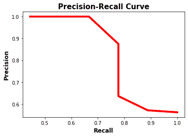

精确-召回曲线使得确定精确和召回都高的点变得容易。根据上图，最佳点是`(recall, precision)=(0.778, 0.875)`。

因为曲线并不复杂，所以使用前面的图来图形化地确定精确度和召回率的最佳值可能是有效的。更好的方法是使用一个叫做`f1`分数的指标，它是根据下一个等式计算出来的。

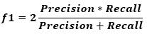

`f1`指标衡量精确度和召回率之间的平衡。当`f1`的值高时，这意味着精确度和召回率都高。较低的`f1`分数意味着精确度和召回率之间更大的不平衡。

根据前面的例子，`f1`是根据下面的代码计算的。根据`f1`列表中的值，最高分是`0.82352941`。它是列表中的第 6 个元素(即索引 5)。`recalls`和`precisions`列表中的第 6 个元素分别是`0.778`和`0.875`。对应的阈值是`0.45`。

```py
f1 = 2 * ((numpy.array(precisions) * numpy.array(recalls)) / (numpy.array(precisions) + numpy.array(recalls)))
```

```py
[0.72, 
 0.69565217, 
 0.69565217, 
 0.7,
 0.73684211,
 0.82352941, 
 0.82352941, 
 0.8, 
 0.71428571, 0
 .61538462]
```

下图用蓝色显示了在召回率和精确度之间达到最佳平衡的点的位置。总之，平衡精确度和召回率的最佳阈值是`0.45`，此时精确度是`0.875`，召回率是`0.778`。

```py
matplotlib.pyplot.plot(recalls, precisions, linewidth=4, color="red", zorder=0)
matplotlib.pyplot.scatter(recalls[5], precisions[5], zorder=1, linewidth=6)

matplotlib.pyplot.xlabel("Recall", fontsize=12, fontweight='bold')
matplotlib.pyplot.ylabel("Precision", fontsize=12, fontweight='bold')
matplotlib.pyplot.title("Precision-Recall Curve", fontsize=15, fontweight="bold")
matplotlib.pyplot.show()
```

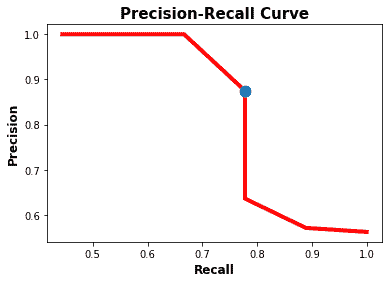

在讨论了精度-召回曲线之后，下一节将讨论如何计算平均精度。

## **平均精度(AP)**

**平均精度(AP)** 是一种将精度-召回曲线总结为代表所有精度平均值的单一值的方法。AP 根据下式计算。使用遍历所有精度/召回的循环，计算当前和下一次召回之间的差异，然后乘以当前精度。换句话说，AP 是每个阈值的精度的加权和，其中权重是召回的增加。

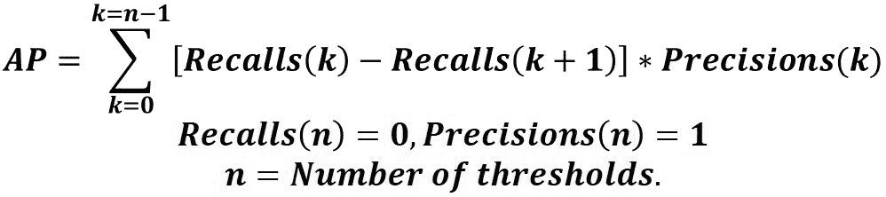

重要的是要在召回列表和精度列表后分别添加 0 和 1。例如，如果`recalls`列表是[0.8，0.6]，那么它应该将 0 追加到[0.8，0.6，0.0]。同样的情况也发生在`precisions`列表中，但是添加了 1 而不是 0(例如[0.8，0.2，1.0])。

假设`recalls`和`precisions`都是 NumPy 数组，前面的等式是根据下一个 Python 行建模的。

```py
AP = numpy.sum((recalls[:-1] - recalls[1:]) * precisions[:-1])
```

下面是计算 AP 的完整代码。

```py
import numpy
import sklearn.metrics

def precision_recall_curve(y_true, pred_scores, thresholds):
    precisions = []
    recalls = []

    for threshold in thresholds:
        y_pred = ["positive" if score >= threshold else "negative" for score in pred_scores]

        precision = sklearn.metrics.precision_score(y_true=y_true, y_pred=y_pred, pos_label="positive")
        recall = sklearn.metrics.recall_score(y_true=y_true, y_pred=y_pred, pos_label="positive")

        precisions.append(precision)
        recalls.append(recall)

    return precisions, recalls

y_true = ["positive", "negative", "negative", "positive", "positive", "positive", "negative", "positive", "negative", "positive", "positive", "positive", "positive", "negative", "negative", "negative"]
pred_scores = [0.7, 0.3, 0.5, 0.6, 0.55, 0.9, 0.4, 0.2, 0.4, 0.3, 0.7, 0.5, 0.8, 0.2, 0.3, 0.35]
thresholds=numpy.arange(start=0.2, stop=0.7, step=0.05)

precisions, recalls = precision_recall_curve(y_true=y_true, 
                                             pred_scores=pred_scores, 
                                             thresholds=thresholds)

precisions.append(1)
recalls.append(0)

precisions = numpy.array(precisions)
recalls = numpy.array(recalls)

AP = numpy.sum((recalls[:-1] - recalls[1:]) * precisions[:-1])
print(AP)
```

这都是关于平均精度的。下面是计算 AP 的步骤总结:

1.  使用模型生成**预测分数**。
2.  将**预测分数**转换为**类别标签**。
3.  计算**混淆矩阵**。
4.  计算**精度**和**召回**指标。
5.  创建**精确召回曲线**。
6.  测量**的平均精度**。

下一节将讨论 union (IoU) 上的**交集，这是对象检测如何生成预测分数。**

## **并集上的交集(IoU)**

为了训练对象检测模型，通常有 2 个输入:

1.  一个图像。
2.  图像中每个对象的真实边界框。

该模型预测检测到的对象的边界框。预计预测框不会与实际框完全匹配。下图显示了一只猫的形象。物体的地面实况框是红色的，而预测的是黄色的。基于 2 个框的可视化，该模型是否做出了具有高匹配分数的良好预测？

很难主观评价模型预测。例如，有人可能断定有 50%的匹配，而其他人注意到有 60%的匹配。

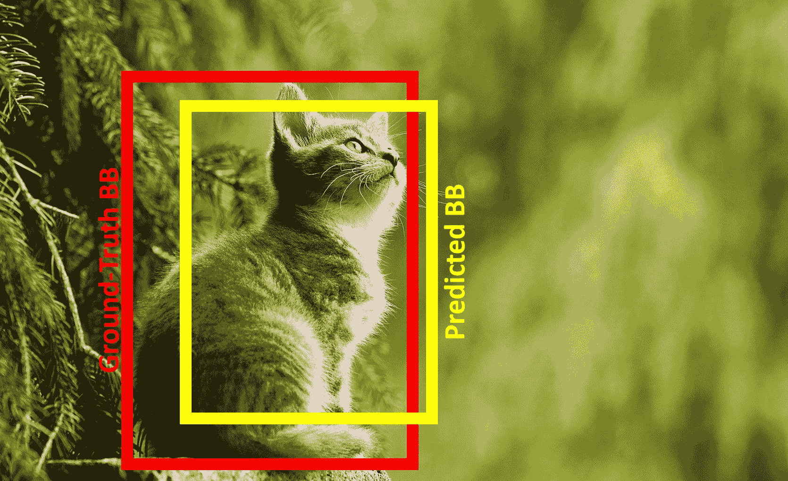

[Image](https://pixabay.com/photos/cat-young-animal-curious-wildcat-2083492) without labels from [Pixabay](https://pixabay.com/photos/cat-young-animal-curious-wildcat-2083492) by [susannp4](https://pixabay.com/users/susannp4-1777190)

一个更好的替代方法是使用一个定量的方法来衡量实际情况和预测情况的匹配程度。这个度量是 union (IoU) 上的**交集。IoU 有助于了解一个区域是否有对象。**

IoU 的计算公式如下:将两个方框的相交面积除以它们的并集面积。IoU 越高，预测越好。

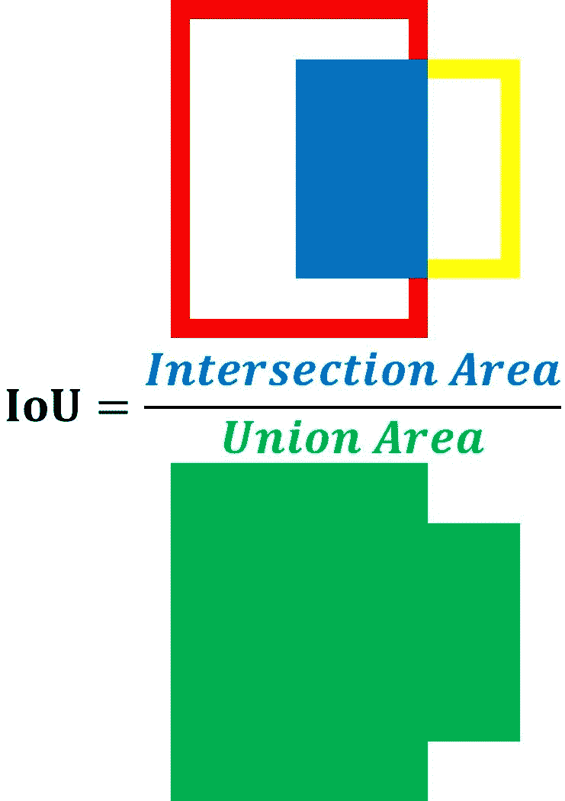

下图显示了三种不同借据的情况。请注意，每个案例顶部的借条都是经过客观测量的，可能与实际情况有所不同，但这是有意义的。

对于案例 A，黄色的预测框与红色的基本事实框相距甚远，因此 IoU 得分为 **0.2** (即两个框之间只有 20%的重叠)。

对于案例 B，两个方框之间的交叉面积较大，但两个方框仍未对齐，因此 IoU 得分为 **0.5** 。

对于情况 C，两个框的坐标非常接近，因此它们的 IoU 为 **0.9** (即两个框之间有 90%的重叠)。

请注意，当预测框和实际框之间有 0%的重叠时，IoU 为 0.0。当两个盒子 100%吻合时，IoU 为 **1.0** 。

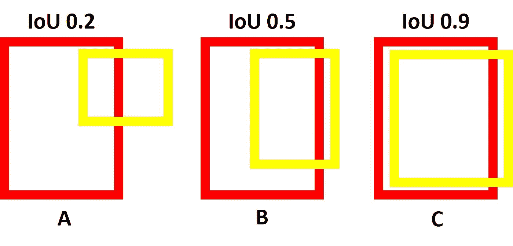

为了计算图像的 IoU，这里有一个名为`intersection_over_union()`的函数。它接受以下两个参数:

1.  `gt_box`:地面真实包围盒。
2.  `pred_box`:预测包围盒。

它分别计算`intersection`和`union`变量中两个框之间的交集和并集。此外，欠条是在`iou`变量中计算的。它返回所有这三个变量。

```py
def intersection_over_union(gt_box, pred_box):
    inter_box_top_left = [max(gt_box[0], pred_box[0]), max(gt_box[1], pred_box[1])]
    inter_box_bottom_right = [min(gt_box[0]+gt_box[2], pred_box[0]+pred_box[2]), min(gt_box[1]+gt_box[3], pred_box[1]+pred_box[3])]

    inter_box_w = inter_box_bottom_right[0] - inter_box_top_left[0]
    inter_box_h = inter_box_bottom_right[1] - inter_box_top_left[1]

    intersection = inter_box_w * inter_box_h
    union = gt_box[2] * gt_box[3] + pred_box[2] * pred_box[3] - intersection

    iou = intersection / union

    return iou, intersection, union
```

传递给该函数的边界框是 4 个元素的列表，它们是:

1.  左上角的 x 轴。
2.  左上角的 y 轴。
3.  宽度。
4.  身高。

以下是汽车图像的地面实况和预测边界框。

```py
gt_box = [320, 220, 680, 900]
pred_box = [500, 320, 550, 700]
```

假设图像被命名为`cat.jpg`，下面是在图像上绘制边界框的完整代码。

```py
import imageio
import matplotlib.pyplot
import matplotlib.patches

def intersection_over_union(gt_box, pred_box):
    inter_box_top_left = [max(gt_box[0], pred_box[0]), max(gt_box[1], pred_box[1])]
    inter_box_bottom_right = [min(gt_box[0]+gt_box[2], pred_box[0]+pred_box[2]), min(gt_box[1]+gt_box[3], pred_box[1]+pred_box[3])]

    inter_box_w = inter_box_bottom_right[0] - inter_box_top_left[0]
    inter_box_h = inter_box_bottom_right[1] - inter_box_top_left[1]

    intersection = inter_box_w * inter_box_h
    union = gt_box[2] * gt_box[3] + pred_box[2] * pred_box[3] - intersection

    iou = intersection / union

    return iou, intersection, union

im = imageio.imread("cat.jpg")

gt_box = [320, 220, 680, 900]
pred_box = [500, 320, 550, 700]

fig, ax = matplotlib.pyplot.subplots(1)
ax.imshow(im)

gt_rect = matplotlib.patches.Rectangle((gt_box[0], gt_box[1]),
                                       gt_box[2],
                                       gt_box[3],
                                       linewidth=5,
                                       edgecolor='r',
                                       facecolor='none')

pred_rect = matplotlib.patches.Rectangle((pred_box[0], pred_box[1]),
                                         pred_box[2],
                                         pred_box[3],
                                         linewidth=5,
                                         edgecolor=(1, 1, 0),
                                         facecolor='none')
ax.add_patch(gt_rect)
ax.add_patch(pred_rect)

ax.axes.get_xaxis().set_ticks([])
ax.axes.get_yaxis().set_ticks([])
```

下图显示了带有边界框的图像。

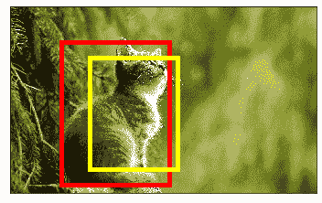

要计算借据，只需调用`intersection_over_union()`函数。基于边界框，IoU 分数为`0.54`。

```py
iou, intersect, union = intersection_over_union(gt_box, pred_box)
print(iou, intersect, union)
```

```py
0.5409582689335394 350000 647000
```

IoU 分数 **0.54** 意味着实际边界框和预测边界框之间有 54%的重叠。看着这些方框，有人可能会在视觉上觉得这足以断定模型检测到了猫对象。其他人可能会觉得这个模型还不准确，因为预测框不太符合实际情况。

为了客观地判断模型是否正确地预测了盒子位置，使用了一个**阈值**。如果模型预测到一个 IoU 分数大于或等于**阈值**的盒子，那么在预测的盒子和一个基本事实盒子之间有很高的重叠。这意味着模型能够成功地检测到对象。检测到的区域被分类为**阳性**(即包含物体)。

另一方面，当 IoU 分数小于阈值时，则模型做出了糟糕的预测，因为预测框不与基本事实框重叠。这意味着检测到的区域被归类为**阴性**(即不包含物体)。


让我们用一个例子来说明 IoU 分数如何帮助将一个区域分类为一个对象。假设对象检测模型由下一个图像提供，其中有 2 个目标对象，它们的地面实况框为红色，预测框为黄色。

接下来的代码读取图像(假定它被命名为`pets.jpg`)，绘制方框，并计算每个对象的 IoU。左边对象的 IoU 是 **0.76** ，而另一个对象的 IoU 分数是 **0.26** 。

```py
import matplotlib.pyplot
import matplotlib.patches
import imageio

def intersection_over_union(gt_box, pred_box):
    inter_box_top_left = [max(gt_box[0], pred_box[0]), max(gt_box[1], pred_box[1])]
    inter_box_bottom_right = [min(gt_box[0]+gt_box[2], pred_box[0]+pred_box[2]), min(gt_box[1]+gt_box[3], pred_box[1]+pred_box[3])]

    inter_box_w = inter_box_bottom_right[0] - inter_box_top_left[0]
    inter_box_h = inter_box_bottom_right[1] - inter_box_top_left[1]

    intersection = inter_box_w * inter_box_h
    union = gt_box[2] * gt_box[3] + pred_box[2] * pred_box[3] - intersection

    iou = intersection / union

    return iou, intersection, union, 

im = imageio.imread("pets.jpg")

gt_box = [10, 130, 370, 350]
pred_box = [30, 100, 370, 350]

iou, intersect, union = intersection_over_union(gt_box, pred_box)
print(iou, intersect, union)

fig, ax = matplotlib.pyplot.subplots(1)
ax.imshow(im)

gt_rect = matplotlib.patches.Rectangle((gt_box[0], gt_box[1]),
                                       gt_box[2],
                                       gt_box[3],
                                       linewidth=5,
                                       edgecolor='r',
                                       facecolor='none')

pred_rect = matplotlib.patches.Rectangle((pred_box[0], pred_box[1]),
                                         pred_box[2],
                                         pred_box[3],
                                         linewidth=5,
                                         edgecolor=(1, 1, 0),
                                         facecolor='none')
ax.add_patch(gt_rect)
ax.add_patch(pred_rect)

gt_box = [645, 130, 310, 320]
pred_box = [500, 60, 310, 320]

iou, intersect, union = intersection_over_union(gt_box, pred_box)
print(iou, intersect, union)

gt_rect = matplotlib.patches.Rectangle((gt_box[0], gt_box[1]),
                                       gt_box[2],
                                       gt_box[3],
                                       linewidth=5,
                                       edgecolor='r',
                                       facecolor='none')

pred_rect = matplotlib.patches.Rectangle((pred_box[0], pred_box[1]),
                                         pred_box[2],
                                         pred_box[3],
                                         linewidth=5,
                                         edgecolor=(1, 1, 0),
                                         facecolor='none')
ax.add_patch(gt_rect)
ax.add_patch(pred_rect)

ax.axes.get_xaxis().set_ticks([])
ax.axes.get_yaxis().set_ticks([])
```

给定 IoU 阈值为 0.6，那么只有 IoU 得分大于等于 0.6 的区域被归类为**正**(即有物体)。因此，IoU 分数为 0.76 的方框为正，而 IoU 分数为 0.26 的另一个方框为**负**。

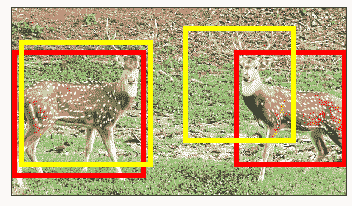

Image without Labels from [hindustantimes.com](https://www.hindustantimes.com/rf/image_size_960x540/HT/p2/2019/05/25/Pictures/_b336a8c4-7e7b-11e9-8a88-8b84fe2ad6da.png)

如果阈值变为 0.2 而不是 0.6，那么两个预测都是正的 T2。如果阈值是 **0.8** ，那么两个预测都是**负**。

总之，IoU 分数衡量的是预测框与现实框的接近程度。范围从 0.0 到 1.0，其中 1.0 是最佳结果。当 IoU 大于阈值时，则该盒子被分类为**正**，因为它围绕着一个物体。否则，被归类为**阴性**。

下一节将展示如何利用 IoUs 来计算对象检测模型的平均精度(mAP)。

## **物体检测的平均精度(mAP)**

通常，用不同的 IoU 阈值来评估对象检测模型，其中每个阈值可以给出与其他阈值不同的预测。假设模型由一个图像提供，该图像有 10 个对象分布在两个类中。地图怎么算？

要计算 mAP，首先要计算每个类的 AP。所有类别的 AP 的平均值就是地图。

假设使用的数据集只有 2 个类。对于第一个类，这里分别是`y_true`和`pred_scores`变量中的基本事实标签和预测分数。

```py
y_true = ["positive", "negative", "positive", "negative", "positive", "positive", "positive", "negative", "positive", "negative"]

pred_scores = [0.7, 0.3, 0.5, 0.6, 0.55, 0.9, 0.75, 0.2, 0.8, 0.3]
```

下面是第二类的`y_true`和`pred_scores`变量。

```py
y_true = ["negative", "positive", "positive", "negative", "negative", "positive", "positive", "positive", "negative", "positive"]

pred_scores = [0.32, 0.9, 0.5, 0.1, 0.25, 0.9, 0.55, 0.3, 0.35, 0.85]
```

IoU 阈值列表从 0.2 到 0.9，步长为 0.25。

```py
thresholds = numpy.arange(start=0.2, stop=0.9, step=0.05)
```

要计算一个类的 AP，只需将它的`y_true`和`pred_scores`变量输入到下一个代码中。

```py
precisions, recalls = precision_recall_curve(y_true=y_true, 
                                             pred_scores=pred_scores, 
                                             thresholds=thresholds)

matplotlib.pyplot.plot(recalls, precisions, linewidth=4, color="red", zorder=0)

matplotlib.pyplot.xlabel("Recall", fontsize=12, fontweight='bold')
matplotlib.pyplot.ylabel("Precision", fontsize=12, fontweight='bold')
matplotlib.pyplot.title("Precision-Recall Curve", fontsize=15, fontweight="bold")
matplotlib.pyplot.show()

precisions.append(1)
recalls.append(0)

precisions = numpy.array(precisions)
recalls = numpy.array(recalls)

AP = numpy.sum((recalls[:-1] - recalls[1:]) * precisions[:-1])
print(AP)
```

对于第一类，这是它的精确-回忆曲线。基于这条曲线，AP 为`0.949`。

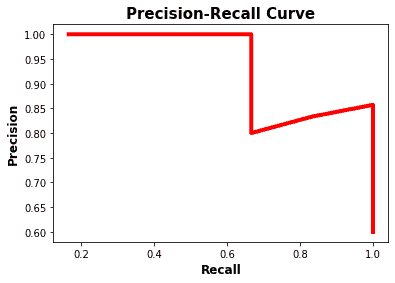

第二类的精度-召回曲线如下所示。它的 AP 是`0.958`。


基于 2 个类别(0.949 和 0.958)的 AP，根据下式计算对象检测模型的 mAP。

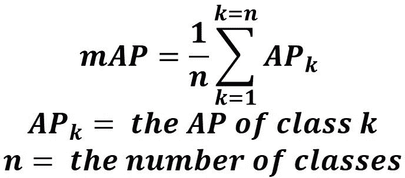

基于这个等式，映射为`0.9535`。

```py
mAP = (0.949 + 0.958)/2 = 0.9535
```

## **结论**

本教程讨论了如何计算对象检测模型的平均精度(mAP)。我们从讨论如何将预测分数转换为类别标签开始。使用不同的阈值，创建精确召回曲线。根据该曲线，测量平均精度(AP)。

对于对象检测模型，阈值是对检测到的对象进行评分的交集(IoU)。一旦为数据集中的每个类测量了 AP，就可以计算地图。