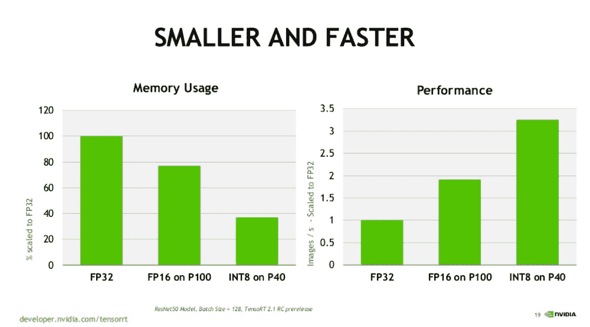
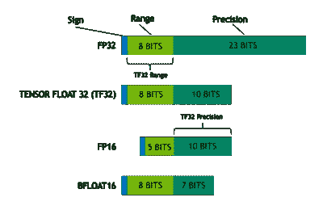
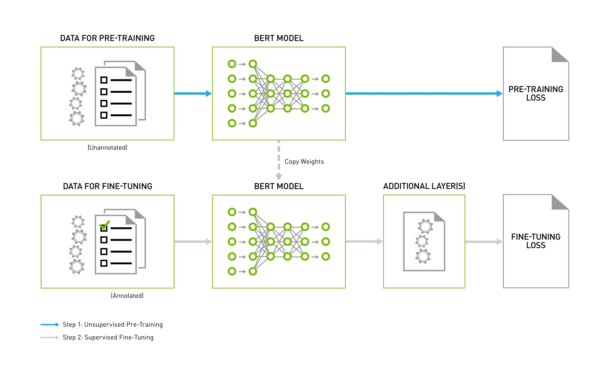

# 深度学习混合精度训练的基准 GPU

> 原文：<https://blog.paperspace.com/mixed-precision-training-benchmark/>

在本指南中，我们将探索混合精度训练，以了解我们如何在代码中利用它，它如何适应传统的深度学习算法框架，哪些框架支持混合精度训练，以及 GPU 使用混合精度的性能提示，以便查看一些真实世界的性能基准。

随着深度学习方法的发展，很明显*增加*神经网络的规模可以提高性能。然而，为了训练模型，这是以较高的内存和计算需求为代价的。稍后，我们将了解混合精度训练在 GPU 内存上的优势。

这可以通过评估 BERT， [Google 的](https://blog.google/products/search/search-language-understanding-bert/)预训练语言模型在不同架构规模下的性能来观察。

> 去年，谷歌[发布并开源了来自 Transformers(简称 BERT)的双向编码器表示，这是一种基于神经网络的自然语言处理(NLP)方法。任何人都可以使用这种技术来训练自己的前沿问题回答系统，使其在保持模型准确性的同时运行更快，消耗更少的内存。](https://ai.googleblog.com/2018/11/open-sourcing-bert-state-of-art-pre.html)

2017 年，一组英伟达研究人员[发表了](https://arxiv.org/pdf/1710.03740.pdf)一篇论文，描述了如何通过采用一种被称为**混合精确训练**的技术来最小化训练神经网络的内存需求

框架开发者、希望优化混合精度训练优势的用户以及致力于训练数字的研究人员会对这篇博文感兴趣。

首先，在我们探索如何在代码中利用它之前，我们将尝试理解混合精度训练及其与深度学习的联系。之后，我们将探讨哪些框架支持混合精确训练。

## 你对混合精确训练了解多少？

**混合精度训练**涉及在训练期间在模型中使用低精度运算(float16 和 bfloat16 ),以帮助训练快速运行并消耗更少的内存。

使用混合精度可以将新型 GPU 的性能提高三倍以上，将 TPU 的性能提高 60%。例如，每一代连续的 Nvidia GPUs 都增强了张量内核和其他技术，从而实现越来越好的性能。

### 记号

*   FP16 —半精度、16 位浮点—占用 2 个字节的内存。
*   FP32 —单精度、32 位浮点—占用 4 个字节的内存。

混合精度训练的基本概念很简单:一半的精度(FP32 - FP16)，一半的训练时间。

Pascal 架构实现了训练精度降低的深度学习网络的能力，最初是在 NVIDIA 深度学习 SDK 的 CUDA 8 中支持的。

下图(来源:Nvidia)显示了 FP16 和其他数据传输类型的比较——FP16 比 FP32 更快。



大多数框架开发人员在训练深度学习模型时，对所有计算内核使用单精度浮点数。詹姆斯·斯凯尔顿的这个 [Paperspace](https://blog.paperspace.com/mixed-precision-training/) 博客展示了降低精度训练对在有限数据集上训练的几个模型有效。此外，16 位半精度浮点数足以在更大的数据集上有效地训练大型深度学习模型。这使得硬件销售商可以利用现有的计算能力。

上面讨论的参数需要整个模型最大存储量的一半。算术运算所需的最小精度分别设置为 16 位和 32 位。当使用 16 位精度并在 float32 中维护模型的一些重要部分时，模型在训练期间的运行速度会比使用 32 位精度时更快。

NVIDIA GPUs 的最新版本包括特别独特的张量核心，专为快速 FP16 矩阵计算而开发。但是，直到最近，这些张量核的使用一直具有挑战性，因为它们需要在模型中进行手写的精度降低的计算。

## 具有深度学习的自动混合精确训练

深度神经网络(DNNs)通过在图像和语音识别等智能测试中取得非凡成就，改变了人工智能。然而，训练大 dnn 在计算上是昂贵的，这推动了针对该功能的创新硬件平台的探索。

因此，通常使用混合精度训练架构，该架构将执行加权汇总和不精确电导更新的计算存储单元与收集高精度权重更新的数字处理单元相结合。

使用相变存储器(PCM)阵列对所提出的体系结构进行递归神经网络评估的混合软件训练实验在对手写数字进行分类的任务上(基于 MNIST 数据集)实现了 97.73%的测试准确度，在软件参考点的 0.6%之内。

然后在各种网络上测试该设计，包括卷积神经网络、长短期记忆网络和生成-对抗网络，利用 PCM 的正确适当模型。

获得了等同于浮点实现的精度，而不受 PCM 器件的非理想性的限制。根据一项系统级研究，当用于训练多层感知器时，与完全专用的数字 32 位实现相比，该架构的能效提高了 172。

由于计算和数据传输吞吐量的增加，混合精度已经成为加速深度学习模型的标准算法。经常使用 IEEE 单精度格式训练的深度学习模型被发现在使用混合精度时对表示长度的减少具有弹性，因为它们可以匹配最先进的性能。为了避免梯度下溢，用户可以固定他们的损耗缩放值，或者利用自动损耗缩放策略，该策略将通过算法决定要应用的适当缩放值。

## 使用 PyTorch 进行代码演练

有了这些重要的知识，我们就可以安全地进入新的 PyTorch AMP API 了。

本节包含如何使用 PyTorch 库为混合精度训练编码卷积神经网络(CNN)的简单演练。

为了演示，我们将在非常常见的手写数字 MNIST 数据集上训练它。

通过这段代码，我们可以了解如何创建网络以及初始化损失函数、优化器、检查准确性等等。

在开始之前，确保您的机器上安装了 Python3。

##### 让我们为这个项目创建一个工作空间，并使用终端安装您需要的依赖项。

您可以跳过步骤 1-5，直接点击下面链接的“梯度运行”按钮进入演示！

1.  将您的工作区命名为 **py-torch** :

```py
$ mkdir ~/pytorch
```

2.创建一个文件夹来保存您的资产:

```py
$ mkdir ~/pytorch/assets
```

3.导航到 pytorch 目录

```py
$ cd ~/pytorch
```

4.为项目创建一个新的虚拟环境

```py
$ python3 -m venv pytorch
```

5.激活您的环境

```py
$ source pytorch/bin/activate
```

6.安装 PyTorch

```py
pip install torch==1.7.1+cpu torchvision==0.8.2+cpu -f https://download.pytorch.org/whl/torch_stable.html
```

7.为了使这一部分更快，编辑 py-torch.py 文件中的导入，使其看起来完全像这样:

```py
#Imports
import torch
import torchvision # torch package for vision related things
import torch.nn.functional as F  # Parameterless functions, like (some) activation functions
import torchvision.datasets as datasets  # Standard datasets
import torchvision.transforms as transforms  # Transformations we can perform on our dataset for augmentation
from torch import optim  # For optimizers like SGD, Adam, etc.
from torch import nn  # All neural network modules
from torch.utils.data import DataLoader  # Gives easier dataset managment by creating mini batches etc.
from tqdm import tqdm  # For nice progress bar!
```

接下来:在这个库[这里](https://github.com/daveclinton/mixed-precision-training/blob/main/py-torch.py)检查我的代码，并复制到你的 **py-torch.py** 工作区:

8.编辑简单的 CNN 部分，将代码第 18 行的 out-chaNNels 增加到 420，in_channels = 420，out_channels = 1000，nn。线性到 1000。逐行使用下面的代码片段。

```py
# Simple CNN
class CNN(nn.Module):
    def __init__(self, in_channels=1, num_classes=10):
        super(CNN, self).__init__()
        self.conv1 = nn.Conv2d(
            in_channels=in_channels,
            out_channels=420,
            kernel_size=(3, 3),
            stride=(1, 1),
            padding=(1, 1),
        )
        self.pool = nn.MaxPool2d(kernel_size=(2, 2), stride=(2, 2))
        self.conv2 = nn.Conv2d(
            in_channels=420,
            out_channels=1000,
            kernel_size=(3, 3),
            stride=(1, 1),
            padding=(1, 1),
        )
        self.fc1 = nn.Linear(1000 * 7 * 7, num_classes)
```

9.这里，让我们在 CNN 类下定义另一个函数，它有两个参数，返回我们计算的值:

你可以遵循我的代码，以确保你不会错过。

```py
def forward(self, x):
        x = F.relu(self.conv1(x))
        x = self.pool(x)
        x = F.relu(self.conv2(x))
        x = self.pool(x)
        x = x.reshape(x.shape[0], -1)
        x = self.fc1(x)
        return x
```

10.设置设备

```py
device = torch.device("cuda" if torch.cuda.is_available() else "cpu")
```

11.配置超参数

确保 float32 的限制为 batch _ size 590，float16 的限制为 batch _ size 1000。但是，在训练网络时，我们应该始终使用 float16 作为默认设置。

```py
in_channels = 1
num_classes = 10
learning_rate = 0.001
batch_size = 590
num_epochs = 3
```

12.接下来，我们加载数据:

```py
train_dataset = datasets.MNIST(root="dataset/", train=True, transform=transforms.ToTensor(), download=True)
test_dataset = datasets.MNIST(root="dataset/", train=False, transform=transforms.ToTensor(), download=True)
train_loader = DataLoader(dataset=train_dataset, batch_size=batch_size, shuffle=True)
test_loader = DataLoader(dataset=test_dataset, batch_size=batch_size, shuffle=True)
```

13.初始化神经网络

```py
model = CNN(in_channels=in_channels, num_classes=num_classes).to(device)
```

14.损失和优化器:这里我们设置 float16 训练，看看在我们的训练循环之前，我们现在可以使用多大的批量。

```py
criterion = nn.CrossEntropyLoss()
optimizer = optim.Adam(model.parameters(), lr=learning_rate)
scaler = torch.cuda.amp.GradScaler()
```

15.执行混合精度的自定义训练循环需要两处修改，而不是在 float32 中遍历它；

```py
# Train Network
for epoch in range(num_epochs):
    for batch_idx, (data, targets) in enumerate(tqdm(train_loader)):
        # Get data to cuda if possible
        data = data.to(device=device)
        targets = targets.to(device=device)

        # forward
        with torch.cuda.amp.autocast():
        	scores = model(data)
        	loss = criterion(scores, targets)

        # backward
        optimizer.zero_grad()
        scaler.scale(loss).backward()
        scaler.step(optimizer)
        scaler.update() 
```

16.定义一个函数来检查培训的准确性；

```py
def check_accuracy(loader, model):
    num_correct = 0
    num_samples = 0
    model.eval()

    with torch.no_grad():
        for x, y in loader:
            x = x.to(device=device)
            y = y.to(device=device)

            scores = model(x)
            _, predictions = scores.max(1)
            num_correct += (predictions == y).sum()
            num_samples += predictions.size(0)

    model.train()
    return num_correct/num_samples
```

最后一步:测试我们的代码，看看我们的模型有多好:

```py
print(f"Accuracy on training set: {check_accuracy(train_loader, model)*100:.2f}")
print(f"Accuracy on test set: {check_accuracy(test_loader, model)*100:.2f}")
```

你也可以在 NVIDIA 官方文档中查看更多关于混合精度训练的信息。

## 混合精确训练深度学习框架

TensorFlow、PyTorch 和 MXNet 是目前提供自动混合精度的框架。

对于所有的框架，使用混合精度需要三个主要步骤；

1.  尽可能将模型转换为使用 float16 数据类型。
2.  保持浮动 32 个主权重，以累积每次迭代的权重更新。
3.  使用损失缩放来保留小的梯度值。

在本文的其余部分，我们将重点关注 TensorFlow，因为它通常用于 Maxwell、Pascal、Volta、Turing 和 Ampere 微体系结构的 Paperspace GPUs。

### 在 Tensorflow 中启用混合精度训练

在 TensorFlow 中，可以使用自动混合精度扩展(TF-AMP)启用混合精度，该扩展在重新捕获时将变量建模为半精度，同时保持变量为单精度格式。

此外，当使用梯度时，必须结合损耗放大[步骤](https://docs.nvidia.com/deeplearning/sdk/mixed-precision-training/index.html#lossscaling)以保护随机梯度下降中的微小梯度幅度。TensorFlow 中的损耗缩放可通过将损耗乘以固定量来静态完成，或通过 TF-AMP 自动完成。自动混合精度完成 TensorFlow 中的所有更改，与手动处理相比有两个优势。

首先，开发人员不需要调整网络模型代码，减少了开发和维护时间。此外，利用 AMP 可以确保与所有 TensorFlow APIs 向前和向后兼容，以定义和执行模型。

纯粹将值添加到训练脚本中的环境变量，以允许混合精度:

*   启用 TF-AMP 图形重写:

```py
os.environ["TF_ENABLE_AUTO_MIXED_PRECISION_GRAPH_REWRITE"] = "1"
```

*   启用自动混合精度:

```py
os.environ['TF_ENABLE_AUTO_MIXED_PRECISION'] = '1' 
```

#### 启用张量浮点-32

张量运算是 Nvidia A100 GPUs 中的新数学模式，用于使用 TF32 计算矩阵数学。与 Volta GPUs 上的单精度浮点数学(FP32)相比，它们可以提供高达 10 倍的加速。

TF32 张量核可以使用 FP32 加速网络，通常不会损失精度。对于需要高动态范围的权重或激活的模型，它比 FP16 更健壮。

NVIDIA Ampere GPU 架构支持 TF32，默认启用。

更多细节可以在 TensorFloat-32 部分的 A100 GPU 加速人工智能训练，HPC 高达 20 倍博客文章中找到。您还可以通过前往 [GPU 云比较](https://www.paperspace.com/gpu-cloud-comparison)查看 A100 如何与 Paperspace 的多样化 GPU 选择相匹配。

### 理解 TensorFloat-32 数学

数学格式类似于标尺。格式模数中的位数会影响它的范围，或者它可以评估的项的大小。精度取决于尾数所用的位数，尾数是浮点数中跟在基数或小数点后面的部分。

一个伟大的数学格式符合完美的平衡。为了提供精度，它应该利用足够的位来避免缓慢的性能或内存膨胀。

Nvidia 的下图描绘了 TF32 是如何实现张量计算平衡的混合物。



TF32 finds a balance between performance, range, and accuracy.

TF32 采用与半精度(FP16)数学相同的 10 位尾数，这已经被证明为 AI 任务的精度标准提供了足够多的公差。TF32 也使用与 FP32 相同的 8 位乘法器，允许它处理相同的数学限制。

正因为如此，TF32 是 FP32 的一个惊人补充，用于进行单精度数学运算，特别是深度学习和几个 HPC 应用程序核心的巨大乘-累加运算。

使用 NVIDIA 库的应用程序允许用户在不改变代码的情况下获得 TF32 的好处。TF32 张量核处理 FP32 输入并输出 FP32 结果。FP32 仍然用于非矩阵计算。A100 还具有增强的 16 位数学能力，以实现最佳性能。它支持 FP16 和 Bfloat16 (BF16)，速度是 TF32 的两倍。只需几行代码，用户就可以通过使用自动混合精度获得 2 倍的速度提升。

### 成功的 TensorFlow 项目

本节讨论用于为 TensorFlow 训练 BERT 模型的脚本和配方，该模型用于实现由 NVIDIA 测试和维护的最先进的精确度。点击查看这个模型的公共库[。](https://github.com/NVIDIA/DeepLearningExamples/tree/master/TensorFlow/LanguageModeling/BERT#model-overview)

该存储库包含脚本，用于在 Docker 容器中以交互方式启动数据下载、培训、基准测试和推理例程，以便对问题回答进行预培训和微调。

#### BERT 模型概述

NVIDIA 使用的 BERT(来自变压器的双向编码器表示)是谷歌官方实施的定制副本，在 A100、V100 和 T4 GPU 上使用混合精度算术和张量核心，在保持精度的同时提高训练速度。

你可以查看这个由 NVIDIA 提供 BERT 模型的公共库。它使用 NVIDIA Volta、Ampere 和 Turing GPUs 上的张量核心以混合精度进行训练。这意味着，程序员可以获得比没有张量核心的训练快 4 倍的响应，同时体验混合精度训练的优势。

### 伯特模型的体系结构

BERT 模型的架构是一个复杂的双向变压器编码器。根据模型大小，BERT 训练包括两个步骤，这两个步骤在大量未标注的数据集上以无监督的方式预训练语言模型，并且还使用这个预训练的模型在许多 NLP 活动中进行微调。该模型为精确任务提供了一个附加层，并进一步训练该模型使用特定于任务的带注释的数据集，从预训练的权重开始。该过程的初始和最终阶段如下图所示；



Image Source; [NVIDIA](https://github.com/NVIDIA/DeepLearningExamples/raw/master/TensorFlow/LanguageModeling/BERT/daimg/bert_pipeline.png?raw=true)

## 在 GPU 上使用混合精度时的性能提示。

### 增加批量

如果这对模型质量没有影响，请尝试在使用混合精度时以两倍的批量运行。因为 float16 tensors 使用了一半的容量，所以您可以经常在不耗尽内存的情况下将批处理大小加倍。增加批量大小通常会增加训练吞吐量，或者模型在每个会话中可以运行的训练组件的数量。

### 确保 GPU 张量核心的利用率

现代 NVIDIA GPUs 包括一个称为张量核心的特定硬件单元，它可以快速乘以浮点矩阵。另一方面，张量核要求某些张量维数是 8 的倍数。

如果你想进一步学习， [NVIDIA 深度学习性能指南](https://docs.nvidia.com/deeplearning/performance/index.html)提供了使用张量核的具体要求以及与张量核相关的增强性能统计。

## 真实世界性能基准

[拼写 API](https://spell.ml/docs/run_overview/) 用于自动精确训练神经网络，也使用 V100s(旧张量核)和 T4s(当前张量核)。当在混合精度和普通网络之间使用时，上述每个模型都同等收敛。以下是用上述模型训练的网络列表:

*   **前馈-** 根据从[罗斯曼商店样本](https://www.kaggle.com/c/rossmann-store-sales)ka ggle 上的竞争中获得的数据训练的神经网络。在这里浏览[代码。](https://github.com/spellml/feedforward-rossman)
*   **UNet -** 一个普通的 [UNet 图片分割网](https://arxiv.org/abs/1505.04597)中等大小，在分割后的 Bob [Ros](https://www.kaggle.com/datasets/residentmario/segmented-bob-ross-images) s 图片语料库上训练。[点击此处获取代码。](https://github.com/spellml/unet-bob-ross)
*   **BERT -** 一个巨大的 NLP [transformer](https://jalammar.github.io/illustrated-transformer/) 模型，用 huggingface 的 bert-base-uncased 模型主干和来自 Kaggle 的 Twitter 情感提取比赛的数据构建。[点击此处获取代码。](https://github.com/spellml/tweet-sentiment-extraction)

样本结果:


BERT 是一个巨大的模型，正是在这里，采用混合精确训练节省的时间成为“必备”对于在 Volta 或 Turing GPUs 上训练的大模型，自动混合精度将节省 50%至 60%的训练时间。

因此，您应该对模型训练脚本应用的第一个性能改进是混合精度。

如果你想自己复制任何基准，可以在 GitHub 的[spell run/前馈-罗斯曼](https://github.com/spellrun/feedforward-rossman)、 [spellrun/unet-bob-ross、](https://github.com/spellrun/unet-bob-ross)和[spell run/tweet-情操-提取](https://github.com/spellrun/tweet-sentiment-extraction)库中找到示例模型源代码。

要使用 Paperspace Gradient 运行这些功能，只需使用以前的 URL 作为笔记本创建页面的高级选项部分中的工作区 URL。

## GPU 内存带宽使用

现在，我们已经从前面的章节中了解了混合精度的工作原理。混合精度训练的一个优点是内存使用。与 GPU 内存相比，GPU 计算更复杂，但优化很重要。请记住，GPU 上的批处理量越大，内存消耗就越有效。

PyTorch 在模型训练过程开始时分配固定数量的 GPU 内存，并在训练操作的整个过程中保持该内存。这可以防止其他任务在训练期间提交过多的 GPU RAM，否则会导致 PyTorch 训练脚本因 OOM 错误而崩溃。

以下是激活混合精度训练对 PyTorch 记忆保留行为的影响:


令人惊讶的是，虽然两个较大的模型都从转换到混合精度中受益，但 UNet 比 BERT 受益更多。

## 外卖食品

自动混合精度训练是 PyTorch 1.6 中一个简单而强大的新功能，它有望将现代 NVIDIA GPUs 上运行的更大规模的模型训练操作加速高达 60%。

正如本文所详述的，一代又一代 GPU 的技术进步可以部分地以混合精度训练为特征，因此应该尽可能地实施。如果您有需要，Paperspace 可以帮助您优化 GPU 云支出和效率。

此外，当使用 RTX、特斯拉或安培 GPU 时，梯度用户应采用自动化混合精度训练。这些 GPU 包括张量内核，可以加速 FP16 运算。