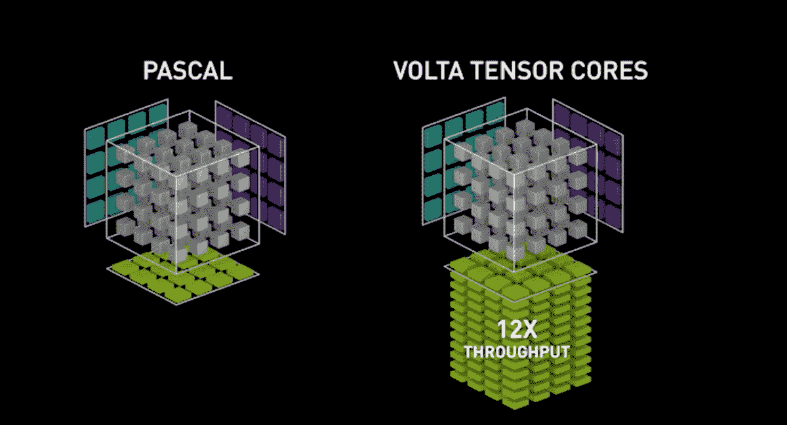

# NVIDIA Volta 的混合精确训练

> 原文：<https://blog.paperspace.com/mixed-precision/>

[Volta](https://en.wikipedia.org/wiki/Volta_(microarchitecture)) 是 NVIDIA 最新开发的 GPU 架构之一。Volta 是专门为训练深度神经网络和机器学习研究而设计和优化的。这种新架构的一个主要特点是它包括[张量核](https://www.nvidia.com/en-us/data-center/tensorcore/)，一个*可编程矩阵乘法和累加单元，可以为训练和推理应用提供多达 125 个张量浮点运算* [1]。基本上，一个新的和更有效的方法来增加矩阵操作的计算时间。这种优化可以在训练深度神经网络时获得更好的性能，并提高训练速度。(如果你想深入了解张量核如何工作的技术定义，请查看关于该主题的 NVIDIA 博客文章。)



Tensor Core visualization. Source https://www.nvidia.com/en-us/data-center/tensorcore/

这种新架构设计的一大优势是，它还使用并受益于较低精度的算法来提高计算速度。这是通过使用半精度浮点数而不是单精度浮点数来实现的。

## 半精度与单精度

训练和开发深度神经网络模型的很大一部分(如果不是大部分)必须计算网络的权重、激活函数、输入和输出。当使用 GPU 加速计算时，这由 CUDA 在较低的级别进行管理和计算。CUDA 通常使用 32 位(FP32)内存存储和跟踪单精度浮点数训练中涉及的所有变量。使用 FP32 意味着执行算术计算的精度更高，但也意味着需要更多的内存来存储所有这些变量。相比之下，半精度浮点数仅使用 16 位(FP16)存储，因此比 FP32 使用更少内存。缺点是精度和 FP32 不一样。这意味着在训练网络时，您可能会得到不精确的权重更新、梯度下溢、缩减上溢。

那么，我们如何利用 Volta 的架构优势和使用 16 位浮点数的能力，加快训练速度，但又不损失精度呢？答案与 [**混合精密训练**](https://devblogs.nvidia.com/mixed-precision-training-deep-neural-networks/) **有关。**混合精度训练是使用 FP16 和 FP32 的组合来执行一些计算和操作的一种方式。例如，张量核可以将多个半精度矩阵累加成一个单精度矩阵。使用混合 precision 和 Volta，网络可以:

*   比使用单精度快 2-4 倍
*   将网络规模减半
*   并不意味着模型的架构改变。

## 在 Pytorch 中使用混合精度训练

正如[NVIDIA 官方文档](https://docs.nvidia.com/deeplearning/sdk/mixed-precision-training/index.html)中所述，在 Pytorch 中使用混合精度仅涉及将必要的变量和模型转换成一半:

```py
model = model.cuda().half()
input = input.cuda().half() 
```

请记住，这种选角只在训练循环的某些部分进行。在最好的情况下，您将有一个 FP16 模型和最终重量，但是训练和计算将使用 FP32 和 FP16 的混合来完成。为了深入解释如何在 Pytorch 中使用 FP16， [Sylvain Gugger](https://sgugger.github.io/) 写了一篇精彩的介绍，你可以在这里找到[。](http://forums.fast.ai/t/mixed-precision-training/20720)

## 参考

*   [1]CUDA 9 中的编程张量核-[https://dev blogs . NVIDIA . com/Programming-Tensor-Cores-CUDA-9/](https://devblogs.nvidia.com/programming-tensor-cores-cuda-9/)
*   [2]英伟达 GPU 技术大会-[http://on-demand.gputechconf.com/gtc/2018/video/S81012/](http://on-demand.gputechconf.com/gtc/2018/video/S81012/)
*   [3] Fast.ai:混合精度训练岗位-[http://forums.fast.ai/t/mixed-precision-training/20720](http://forums.fast.ai/t/mixed-precision-training/20720)