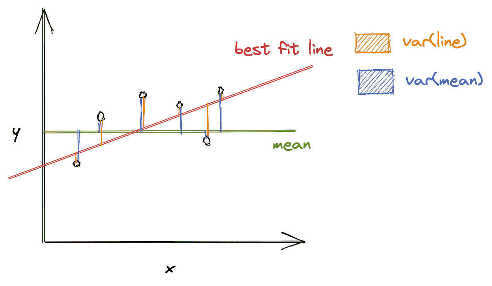
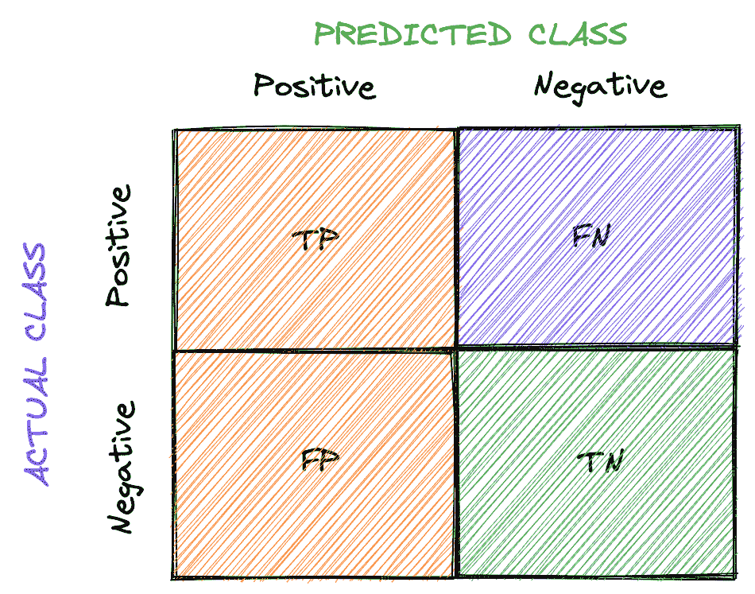
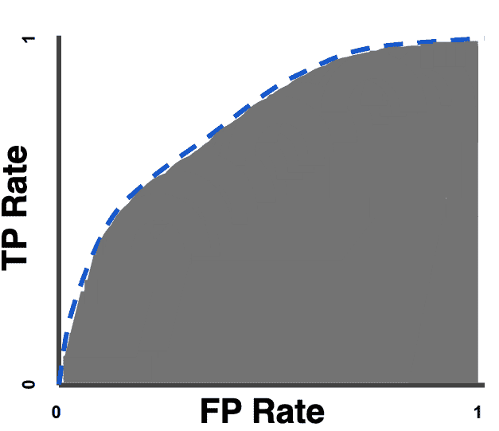

# 机器学习模型的评估标准:第 1 部分

> 原文：<https://blog.paperspace.com/ml-evaluation-metrics-part-1/>

如果训练模型是机器学习的一个重要方面，那么评估它们就是另一个方面。**评估**衡量模型在看不见数据的情况下表现如何。这是决定一个模型是否令人满意的关键指标之一。

通过评估，我们可以确定模型是否会在所学知识的基础上构建知识，并将其应用于以前从未处理过的数据。

以一个使用决策树算法构建 ML 模型的场景为例。你获取数据，初始化超参数，训练模型，最后，评估它。根据评估结果，您得出结论，决策树算法没有您想象的那么好。所以你向前迈一步，应用随机森林算法。*结果*:评估结果看起来令人满意。

对于复杂的模型，不像在前面的例子中执行一次评估，评估可能需要多次进行，无论是使用不同的数据集还是算法，以决定哪个模型最适合您的需求。

在本系列的第一部分中，让我们了解可以用来评估 ML 模型的各种回归和分类评估指标。

如果您想了解这些指标如何在实际中使用，[请查看我们的笔记本，在 Gradient](https://console.paperspace.com/ml-showcase/notebook/rrtvxnh5j1vfj4e?file=guide.ipynb) 中以代码形式演示了这些指标！

## 回归的评估指标

回归是一种输出连续值的 ML 技术。例如，您可能希望预测下一年的燃料价格。您建立一个模型，并用过去几年观察到的燃料价格数据集对其进行训练。要评估您的模型，您可以使用以下一些技巧:

### 均方根误差

**均方根偏差** ( **RMSD** )或**均方根误差** ( **RMSE** )用于测量模型预测值与观察值(实际值)之间的差异。它有助于确定观察到的与实际结果的偏差。计算方法如下:

\[RMSE =-\]

其中，\( \hat{y_1}，\hat{y_2}，...，\hat{y_n} \)是预测值，\( y_1，y_2，...，y_n \)为观测值，\( n \)为预测数。

\( (\hat{y_i} - y_i)^2 \)类似于我们用来计算两点间距离的欧几里德距离公式；在我们的例子中，预测和观察的数据点。

除以\( n \)允许我们估计单个预测的误差的标准偏差\( \sigma \)(与观察值的偏差)，而不是某种“总误差” [1](https://towardsdatascience.com/what-does-rmse-really-mean-806b65f2e48e) 。

#### RMSE vs. MSE

*   均方误差(MSE)是没有平方根的 RMSE
*   因为 MSE 是预测误差的平方，所以它对异常值很敏感，如果出现异常值，它会输出一个非常高的值
*   RMSE 优于 MSE，因为 MSE 给出了一个平方误差，不像 RMSE，它与输出的单位相同

#### 什么是理想的 RMSE？

首先，该值应该很小，这表明模型更适合数据集。有多小？

对 RMSE 来说没有理想的价值。这取决于您正在处理的数据集值的范围。如果值的范围是从 0 到 10，000，那么 RMSE(比如 5.9)就很小，模型可以被认为是令人满意的，而如果范围是从 0 到 10，RMSE 5.9 就很差，模型可能需要调整。

### 绝对平均误差

**平均绝对误差** ( **MAE** )是预测误差绝对值的平均值。我们使用绝对，因为不这样做，正负误差就会抵消；相反，我们使用 MAE 来找出误差的总体大小。预测误差是观察值和预测值之间的差异。

\[ MAE = \frac{1}{n} \sum_{i=1}^{n} |\hat{y_i} - y_i| \]

其中\( \hat{y_i} \)是预测值，\( y_i \)是观测值。

#### RMSE 对梅

*   MAE 是一种线性得分，其中所有预测误差的权重相等，这与 RMSE 不同，后者对预测误差进行平方，然后对平均值应用平方根
*   一般来说，RMSE 的分数总是高于或等于梅
*   如果离群值不意味着被严重惩罚，MAE 是一个好的选择
*   如果不希望出现较大的误差，RMSE 就很有用，因为它对较大的误差给予相对较高的权重

### 均方根对数误差

当平方根应用于预测值和观察值之间的对数差的平方的平均值时，我们得到**均方根对数误差** ( **RMSLE** )。

\[rmsle = \ sqrt { \ frac { 1 } { n } \sum_{i=1}^{n}(log(\ hat { y _ I }+1)-log(y _ I+1))^2} \]

其中\( \hat{y_i} \)是预测值，\( y_i \)是观测值。

#### 选择 RMSLE vs. RMSE

*   如果不惩罚异常值，RMSLE 是一个很好的选择，因为 RMSE 可以将异常值分解为一个高值
*   RMSLE 计算相对误差，误差的大小并不重要
*   RMLSE 因低估实际值 [2](https://medium.com/analytics-vidhya/root-mean-square-log-error-rmse-vs-rmlse-935c6cc1802a) 而招致重罚

## **R 的平方**

r 平方(也称为**决定系数**)代表回归模型的拟合优度。它给出了自变量共同解释的目标变量(因变量)中方差的比例。

R-squared 评估最佳拟合线周围的数据点散布。它可以表述为:

\[r^2 = \ frac { var(mean)-var(line)} { var(mean)} \]

其中\( var(mean) \)是相对于平均值的方差，var(line)是关于最佳拟合线的方差。\( R^2 \)值有助于将\( var(mean) \)与\( var(line) \)相关联。如果\( R^2 \)是，比如说，0.83，这意味着线周围的变化比均值少 83%，即自变量和目标变量之间的关系占变化 [3](https://towardsdatascience.com/statistics-for-machine-learning-r-squared-explained-425ddfebf667) 的 83%。

What are var(mean) and var(line)? ([reference](https://towardsdatascience.com/statistics-for-machine-learning-r-squared-explained-425ddfebf667))

R 平方值越高，模型越好。0%意味着模型不解释目标变量在其均值附近的任何变化，而 100%意味着模型解释目标变量在其均值附近的所有变化。

#### RMSE 与 R 的平方

最好同时计算这两种度量，因为 RMSE 计算预测值和观测值之间的距离，而 R 平方则说明预测变量(数据属性)能够在多大程度上解释目标变量的变化。

#### 限制

R-squared 并不总是提供准确的值来判断模型是否良好。例如，如果模型有偏差，R 平方可能相当高，这并不反映有偏差的数据。因此，对于上下文 [4](https://www.mygreatlearning.com/blog/r-square/) ，建议使用 R 平方与其他统计数据和残差图。

## 分类的评估标准

分类是一种识别给定数据集的类别标签的技术。考虑这样一个场景，您想要将一辆汽车分类为优秀/良好/糟糕。然后，您可以在包含感兴趣的汽车和其他类别车辆的信息的数据集上训练模型，并使用分类度量来评估模型的性能，从而验证模型的有效性。要在测试/验证数据集上分析分类模型的可信度，可以使用以下技术:

## **精度**

**准确度**是测试数据正确预测的百分比。其计算方法如下:

\[准确性= \ frac {正确\，预测} {全部\，预测} \]

在分类中，我们通常用来计算指标的元指标有:

*   真阳性(TP):预测属于一个类，观察也属于一个类
*   真否定(TN):预测不属于一个类别，观察不属于那个类别
*   假阳性(FP):预测属于一个类，但是观察不属于那个类
*   假阴性(FN):预测不属于一类，但观察属于一类

所有元指标都可以排列成矩阵，如下所示:

Confusion matrix for binary classification

这被称为**混淆矩阵**。它给出了算法性能的可视化表示。

对于多类分类，我们会有更多的行和列，表示数据集的类。

现在，让我们使用元指标来修改我们的准确度公式。

\[accuracy = \ frac { TP+TN } { TP+TN+FP+FN } \]

使用\( TP + TN \)是因为\( TP + TN \)一起表示正确的预测。

#### 限制

准确性可能并不总是一个好的性能指标。例如，在癌症检测的情况下，未能诊断出癌症的成本远远高于在一个没有癌症的人身上诊断出癌症的成本。如果这里说准确率是 90%，我们就漏掉了另外 10%可能患有癌症的人。

总的来说，准确性取决于所考虑的问题。除了准确性，您可能还想考虑其他分类指标来评估您的模型。

### 精确

**精度**定义为预测属于某一类的所有数据点中正确分类样本的比例。一般来说，它翻译成“*我们对某一类的预测有多少是正确的*”。

\[ precision = \frac{TP}{TP + FP} \]

为了理解精度，让我们再次考虑癌症检测问题。如果“患有癌症”是一个积极的类别，元指标如下:

\( TP \) = *预测*:患癌，*实际(观察)*:患癌

\( FP \) = *预测*:患癌，*实际*:未患癌

因此，\( \frac{TP}{TP + FP} \)给出了我们的预测进展如何的度量，即，它度量了有多少被诊断患有癌症的人患有癌症，并有助于确保我们不会将没有患癌症的人误分类为患有癌症。

### 回忆

**召回**(也称为**敏感度**)定义为预测属于某一类的样本在实际属于某一类的所有数据点中所占的比例。一般来说，它翻译成“*有多少属于一个类的数据点被正确分类*”。

\[ recall = \frac{TP}{TP + FN} \]

考虑到癌症检测问题，如果“患有癌症”是阳性类别，则元度量如下:

\( TP \): *预测*:患癌，*实际(观察)*:患癌

\( FN \): *预测*:没有癌症，*实际*:有癌症

因此，\( \frac{TP}{TP + FN} \)衡量一个类别的分类工作做得如何，也就是说，它衡量有多少癌症患者被诊断为癌症，并有助于确保癌症不会被检测出来。

### f-测度

由于精确度和召回率捕获模型的不同属性，所以有时一起计算这两个指标是有益的。在两个指标都需要考虑的情况下，我们用一个指标来衡量精度和召回率怎么样？

**F-Measure** (也叫 **F1-Measure** )前来救援。这是精确和回忆的调和平均值。

\[F-Measure = \ frac { 2 } { 1 } { recall }+\ frac { 1 } { precision } } = 2 * \ frac { precision * recall } { precision+recall } \]

广义 F-测度是\( F_\beta \)，它被给出为:

\[f _ \ beta =(1+\ beta ^2)* \ frac { precision * recall}{(\beta^2 * precision)+recall } \]

其中\( \beta \)的选择使得召回被认为是精度 [5](https://en.wikipedia.org/wiki/F-score) 的\( \beta \)倍重要。

### 特征

**特异性**定义为预测不属于某一类别的样本在实际不属于某一类别的所有数据点中所占的比例。一般来说，翻译成“*有多少不属于某一类的数据点被正确分类*”。

\[specification = \ frac { TN } { TN+FP } \]

考虑到癌症检测问题，如果“患有癌症”是阳性类别，则元度量如下:

\( TN \): *预测*:没有癌症，*实际(观察)*:没有癌症

\( FP \): *预测*:患癌，*实际*:未患癌

因此，\( \frac{TN}{TN + FP} \)衡量分类对于一个类别的完成程度，即，它衡量有多少未患癌症的人被预测为未患癌症。

### 皇家对空观察队

**受试者工作特性** ( **ROC** )曲线绘制召回率(真阳性率)和假阳性率。

\[ TPR = \frac{TP}{TP + FN} \]

\[ FPR = \frac{FP}{FP + TN} \]

ROC 下面积( **AUC** )测量曲线下的整个面积。AUC 越高，分类模型越好。

AUC ([Source](https://developers.google.com/machine-learning/crash-course/classification/roc-and-auc))

例如，如果 AUC 为 0.8，这意味着模型有 80%的机会能够区分阳性和阴性类别。

### 一对

**精度-召回** ( **PR** )曲线描绘了精度和召回。当涉及到不平衡分类时，PR 曲线可能是有帮助的。生成的曲线可能属于以下任何一层:

*   高精度和高召回率:PR 曲线下较高的区域表示高精度和高召回率，这意味着模型通过生成准确的预测表现良好(*精度:模型检测到癌症；确实患有癌症*)并正确分类属于某一类别的样本(*回忆:患有癌症，准确诊断癌症*)。
*   高精度和低召回率:模型检测到癌症，并且该人确实患有癌症；然而，它遗漏了许多实际的“患癌”样本。
*   低精度高召回:模型给出了很多“得了癌症”和“没得癌症”的预测。它把很多“患癌”类样本认为是“没患癌”；然而，当“没有患癌症”是合适的类别时，它也将许多“患有癌症”错误分类。
*   低精度和低召回率:既不能正确分类，也不能正确预测属于特定类别的样本。

#### ROC 与 PR

*   当数据集不平衡时，可以使用 ROC 曲线，因为尽管数据集不平衡，但 ROC 对模型性能的描述过于乐观
*   当数据集不平衡时，应使用 PR 曲线

* * *

在本文中，您了解了几个可以评估回归和分类模型的评估指标。

这里需要注意的是，并不是每个评估指标都可以独立依赖；为了判断一个模型是否表现良好，我们可以考虑一组指标。

除了评估指标之外，检查 ML 模型是否可接受的其他方法还包括:

*   将您的模型与其他类似模型的分数进行比较，并验证您的模型的性能是否与它们相当
*   留意*偏差*和*方差*，以验证一个模型是否概括得很好
*   交叉验证

在下一部分中，让我们深入研究聚类和排序模型的评估指标。

详细介绍上述内容的笔记本可以在 Github 上找到。