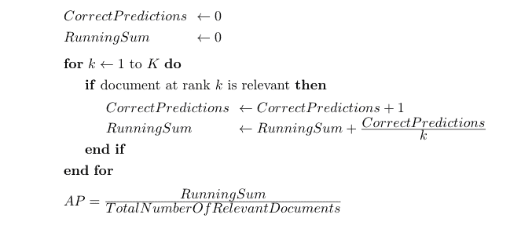

# 机器学习模型的评估标准

> 原文：<https://blog.paperspace.com/ml-evaluation-metrics-part-2/>

本系列的第一部分介绍了回归和分类评估指标。在第二部分中，让我们试着理解聚类和排名评估指标。

## 聚类的评估指标

为了找到没有相关类标签的数据点之间的相似性，可以使用聚类。它将数据点分成多个聚类，使得同一聚类内的数据点比其他聚类内的数据点彼此更相似。

聚类作为一种无监督的学习技术，本身并没有提供一种合理的方法来确定模型的准确性。为了改善这个问题，已经开发了几种方法。这些技术包括 [1](https://en.wikipedia.org/wiki/Cluster_analysis#Evaluation_and_assessment) :

*   ******内部评估:****** 内部评估基于被聚类的数据，包括计算类间和类内距离。如果聚类间点之间具有高相似性，而聚类内点之间具有低相似性，则将最佳得分分配给模型。
*   ******外部评估:****** 外部评估基于未用于聚类的数据，可包括外部基准。
*   ******人工评估:****** 人工评估是由人类专家完成的。

现在让我们来看看一些内部和外部评估指标。对于下面不同评估指标的工作示例，您可以通过分叉在这个[梯度笔记本](https://console.paperspace.com/ml-showcase/notebook/rgn15he0c4ycx71?file=Untitled.ipynb)中跟随它，或者直接在 Github 上查看它。

### 轮廓系数

使用**平均类内距离**和**平均类间距离**为每个数据点计算**轮廓系数** ( *内部评估技术*)。

\[ silhouette\，coefficient = \frac{b-a}{max(a，b)} \]

\( a \) =当前数据点与同一聚类中所有其他数据点之间的平均距离。

\( b \) =当前数据点与下一个最近聚类中所有其他数据点之间的平均距离。

轮廓系数在-1 到 1 之间变化，其中-1 表示数据点未分配给正确的聚类，0 表示聚类重叠，1 表示聚类密集且分离良好(因此这是理想值)。

*值越接近 1，聚类方法越好。*

### 邓恩指数

**邓恩指数** ( *内部评估技术*)有助于识别紧密且集群成员之间差异较小的集群集合。

\[ Dunn\，Index = \ frac { \ under set { 1 \ leq I \ lt j \ leq c } { min } \ Delta(x _ I，y _ j)} { \ under set { 1 \ leq k \ leq c } { max } \ Delta(x _ k)} \]

*   \( \delta(x_i，y_j) \)是簇间距离，即\( x_i \)和\( x_j \)之间的距离。在内部，它涉及计算两个集群中每个数据点之间的距离。我们将不得不使用这些距离中的最小值作为簇间间隔。
*   \( \Delta_k \)是 cluster \( x_k \)的簇内距离，即簇\( x_k \)内的距离，这涉及计算每个数据点到同一簇中每个其他数据点之间的距离。我们将不得不考虑这些距离的最大值作为组内间隔。

*邓恩指数越高，聚类模型越好。*

### 戴维斯-波尔丁指数

**戴维斯-波尔丁指数** ( *内部评估技术* ) 可计算如下:

\[戴维斯-波尔丁\，index = \ frac { 1 } { c } \sum_{i=1}^{c} \ underset { j \ neq I } { max } \ frac { \ sigma _ I+\ sigma _ j } { d(c _ I，c_j)} \]

其中\( c \)是簇的数目，\( c_i \)是簇\( i \)的质心，\( d(c_i，c_j) \)是两个簇的质心之间的距离，\( \sigma_i \)是簇\( i \)中所有数据点到\( c_i \)的平均距离。

提供低集群内距离和高集群间距离的模型(理想指标！)输出低的戴维斯-波尔丁指数。

因此，戴维斯-波尔丁指数越低，模型越好。

### 卡林斯基-哈拉巴斯指数

**卡林斯基-哈拉巴斯指数**(也称**方差比标准** ) ( *内部评估技术*)是所有聚类的类间离差与类内离差之比。

\[CHI = \ frac { trace(B _ c)} { trace(W _ c)} * \ frac { n _ E-c } { c-1 } \]

在哪里，

\( c \)是簇的数量，

\( n_E \)是数据集\( E \)的大小，

\( trace(B_c) \)是簇间(簇间)色散矩阵的迹，

而\( trace(W_c) \)是群内(intra-cluster)色散矩阵的迹。

\( W_c \)和\( B_c \)的定义如下:

\[w _ c = \sum_{i=1}^{c} \sum_{j=1}^{c_i}(x _ j-c _ I)(x _ j-c_i)^t \]

\[b _ c = \sum_{i=1}^{c}·尼(c_i - c_E)(c_i - c_E)^T\]

其中\( c \)是聚类数，\( C_i \)是聚类\( i\)中的数据点集，\( x_j \)是数据点，\( c_i \)是聚类\( i \)的质心，\( n_i \)是聚类\( i \)中的点数，\( c_E \)是数据\( E \)的全局质心。

因此，CHI 是基于聚类内的数据点到聚类质心的距离以及所有聚类质心到全局质心的距离来估计的。

*CHI 值越高，聚类模型越好。*

### 纯洁

**纯度** ( *外部评估技术*)评估一个聚类属于一个类的程度。它包括将一个聚类分配到该聚类中最频繁的类别，然后计算每个聚类中正确分配的数据点的数量，对所有聚类求和，然后将该值除以数据点的总数。

\[Purity = \ frac { 1 } { N } \ sum _ { C \ in C } \ under set { D \ in D } { max } | C \ cap D | \]

其中\( C \)表示聚类，\( D \)表示类，\( N \)表示数据点的总数。

纯度为 1 表示好的聚类，纯度为 0 表示差的聚类。簇的数量越多，越容易具有高纯度值(考虑每个数据点都在自己的簇中的情况；它给出的纯度为 1！).

#### 限制

对于不平衡的数据，Purity 真的不太好用。此外，纯度不能用于在聚类质量与聚类数量之间进行权衡，因为存在更多聚类[2](https://nlp.stanford.edu/IR-book/html/htmledition/evaluation-of-clustering-1.html)时纯度较高。

### 归一化互信息

**归一化互信息** ( **NMI** ) ( *外部评估技术*)是互信息(MI)分数的归一化，以在 0(无互信息)和 1(完全相关)之间缩放结果 [⁷](https://scikit-learn.org/stable/modules/generated/sklearn.metrics.normalized_mutual_info_score.html) 。其给出如下:

\[ NMI(\Omega，C)= \ frac { I(\ Omega；C)} { \ frac { H(\ Omega)+H(C)} { 2 } } \]

\(I(\ Omega；C) \)代表互信息。它测量当我们被告知集群 [3](https://nlp.stanford.edu/IR-book/html/htmledition/evaluation-of-clustering-1.html) 时，我们对该类的知识增加的信息量。

\(I(\ Omega；C)=0 \)表示我们不知道 a 类簇映射到哪个类。

\(I(\ Omega；C)=1 \)表示每个聚类都映射到一个类。

属于其自己聚类的每个数据点具有更高的\(I(\ω；C) \)(比如在纯度上)。为了达到前面在*纯度*中提到的折衷，\( \frac{H(\Omega) + H(C)}{2} \)是有帮助的。\( H \)(熵)随着簇数的增加而增加，从而保持\(I(\ω；C) \)在检查中。

### 兰德指数

**Rand 指数** ( **RI** ) ( *外部评估技术*)衡量所有预测中正确预测的百分比。

\[RI = \ frac { TP+TN } { TP+TN+FP+FN } \]

根据基准分类计算度量，即\( TP \)是在预测分区和真实分区 [4](https://en.wikipedia.org/wiki/Cluster_analysis#Evaluation_and_assessment) 中聚类在一起的点对的数量，等等。

Rand 指数的范围从 0 到 1，其中 *1 表示一个好的聚类模型*。

#### 限制

rand 指数同等地衡量假阳性(FP)和假阴性(FN ),这对于一些聚类过程可能是不期望的特性。为了解决这个问题，可以使用 **F-Measure** 。

### 调整后的兰德指数

**调整后的 Rand 指数** ( **ARI** ) ( *外评技术*)是 RI [5](https://en.wikipedia.org/wiki/Rand_index#Adjusted_Rand_index) 的机会修正版。使用以下公式给出:

\[ ARI = \frac{RI - Expected\，RI}{Max(RI) - Expected\，RI} \]

ARI 通过使用聚类之间的预期相似性来建立基线。与 RI 不同，如果\( RI \)小于\( Expected\，RI \)，它会产生负值。

### Jaccard 索引

**Jaccard 指数** ( *外部评估技术*)衡量真阳性(TP)相对于 TP、FP 和 FN 的数量。

\[ JI = \frac{TP}{TP + FP + FN} \]

假设这种过分简单的方法是查看正确预测与正确预测+所有错误预测的比率，则比率越高，表明两个分类中的值之间的相似性越大。Jaccard 指数越高，聚类模型越好。

### 限制

Jaccard 指数能够测量两个组之间的相似性，但是容易误解两个组之间的关系。例如，一个集群可以存在于另一个集群中，但仍然可以清晰地划分为两个截然不同的集群。

## 排名的评估标准

当预测的顺序很重要时，可以使用排名。考虑一个场景，在 Google 搜索期间，需要根据用户给定的查询以特定的顺序检索网页。训练数据通常由一列网页或文档组成，根据这些网页或文档给出相关性；相关性越大，其排名就越高。

如果构建这样的模型，可以使用的一些评估指标如下:

### 精确

**精度**定义为预测属于某一类的所有数据点中正确分类样本的比例。 **Precision@n** 是在进行第 n 次预测之前计算的精度。

\[Precision @ n = \ frac { TP @ n } { TP @ n+FP @ n } \]

Precision@n 有助于识别前\( n \)个预测中的相关预测。

#### 限制

Precision@n 不考虑有序预测的位置。

### 平均精度

**平均精度** ( **AP** )告诉我们有多少相关预测出现在排名最高的预测中。可以使用以下算法计算:

Average Precision Algorithm ([Source](https://queirozf.com/entries/evaluation-metrics-for-ranking-problems-introduction-and-examples))

就精度而言，其给出为:

\[AP = \frac{\sum_{i=1}^{k} p(k)* rel(k)} {第个，共个，相关文档} \]

其中\( P(k) \)是直到\( k)的精度，而\( rel(k) \)是\( k^{th}\)预测的相关性。

### 平均精度

**Mean Average Precision**(**mAP**)是所有例子(网络搜索中的查询)的平均精度的平均值。

\[map = \ frac { 1 } { n } \sum_{i=1}^{n} AP _ I \]

\( N \)是查询的次数。

mAP 不仅有助于评估单个示例的得分，也有助于评估一组示例的得分。

### 贴现累积收益

**贴现累积收益** ( **DCG** )根据预测在结果列表中的位置来衡量预测的有用性。DCG 的前提是，在搜索结果列表中出现在较低位置的高度相关的文档应该受到惩罚，因为分级的相关性值与结果的位置成对数比例地减小[6]。

\[DCG _ k = \ frac { rel _ I } { log _ 2(I+1 } } \]

\(k \)是 DCG 累积到的数字，而\( rel_i \)是预测的相关性(网络搜索中的网页/文档)。

### 标准化贴现累积收益

为了归一化 DCG 值，该值可以根据每次查询的结果数量而变化，可以使用**归一化的折扣累积收益** ( **nDCG** )。nDCG 使用**理想 DCG** ( **IDCG** )来归一化 DCG。IDCG 是最好的 DCG。

\[ndcg _ k = \ frac { DCG _ k } { idcg _ k }]

\(k \)是累积 nDCG 之前的数字。

如果排名算法是完美的，nDCG 将是 1，DCG 等于 IDCG。

#### DCG 和 NDCG 限制

DCG 和 NDCG 是最常用的排名评估指标。然而，它们不考虑当前预测之上的预测(高排序的)；因此，特定位置的增益始终保持不变。

### 平均倒数等级

**平均倒数排名** ( **MRR** )计算一组查询中出现第一个相关预测的排名倒数的平均值，即，如果对于给定的查询，相关预测位于第一个位置，则相对排名为\( \frac{1}{1} \)，对于第二个位置，相对排名为\( \frac{1}{2} \)，依此类推。当针对一组查询计算相对排名时，会产生 MRR。

\[mrr = \ frac { 1 } { | n | } \sum_{i=1}^{|n|} \ frac { 1 } { rank _ I } \]

其中\( rank_i \)是相关预测的位置，而\( N \)是查询的数量。

#### 限制

MRR 只考虑第一个相关预测的等级。如果多个相关预测出现在预测的较高位置，这不是一个好的选择。

### 肯德尔的τ和斯皮尔曼的ρ

**肯德尔的 tau** (\( \tau \))和**斯皮尔曼的 rho** (\( \rho \))是确定排序数据之间关系的统计度量(比如，当排序的预测需要与排序的观察进行比较时)。

肯德尔τ由以下公式给出:

\[ \tau = \frac{number\，of\，concordant\，pairs - number\，of\，discordant\，pairs}{\binom{n}{2}} \]

其中\( \binom{n}{2} \)等于\(\ frac { n(n-1)} { 2 } \)—从\( n \)个项目中选择两个项目的方法数。

一致对:具有相同顺序的预测对，也就是说，这些预测对具有相同的高低顺序。

不一致的预测对:不在同一顺序的预测对，或者排列在相反方向的预测对。

Spearman 的 Rho 由以下公式给出:

\[ r_s = \rho_{R(x)，R(y)} = \frac{cov(R(X)，R(Y))} { \ sigma _ { R(X)} \ sigma _ { R(Y)} } \]

在哪里，

\( \rho \)是皮尔逊相关系数，

\( cov(R(X)，R(Y)) \)是秩变量(或秩)的协方差，

\( \sigma_{R(X)} \)和\( \sigma_{R(Y)} \)是秩变量的标准差。

如果等级是不同的整数，Spearman 的 Rho 可以计算为:

\[r _ s = 1-\ frac { 6 \ sum d_i^2}{n(n^2-1)} \]

其中\( d \)是等级之间的差值，而\( n \)与等级数有关。

## 结论

通过评估，我们可以得出如下结论:

*   模型能够从数据中学习，而不是记忆它吗？
*   该模型在实际用例的实时场景中表现如何？
*   模型做得有多好？
*   培训策略是否需要改进？我们是否需要更多的数据、更多的功能、完全不同的算法等等。？

在本系列文章中，我们了解了一些可以评估聚类和排序模型的评估指标。

评估最大似然模型是决定模型性能是否良好的重要参数。如上所述，ML 和 DL 模型存在无数的评估标准。我们必须选择正确的技术，同时积极考虑模型、数据集和用例的类型。通常，单个指标是不够的。在这种情况下，可以使用度量的组合。

我希望你喜欢阅读*评估* *指标*系列！