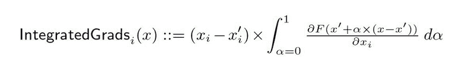
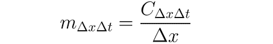
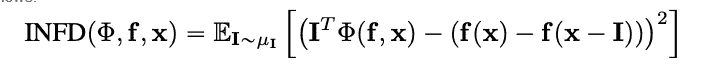
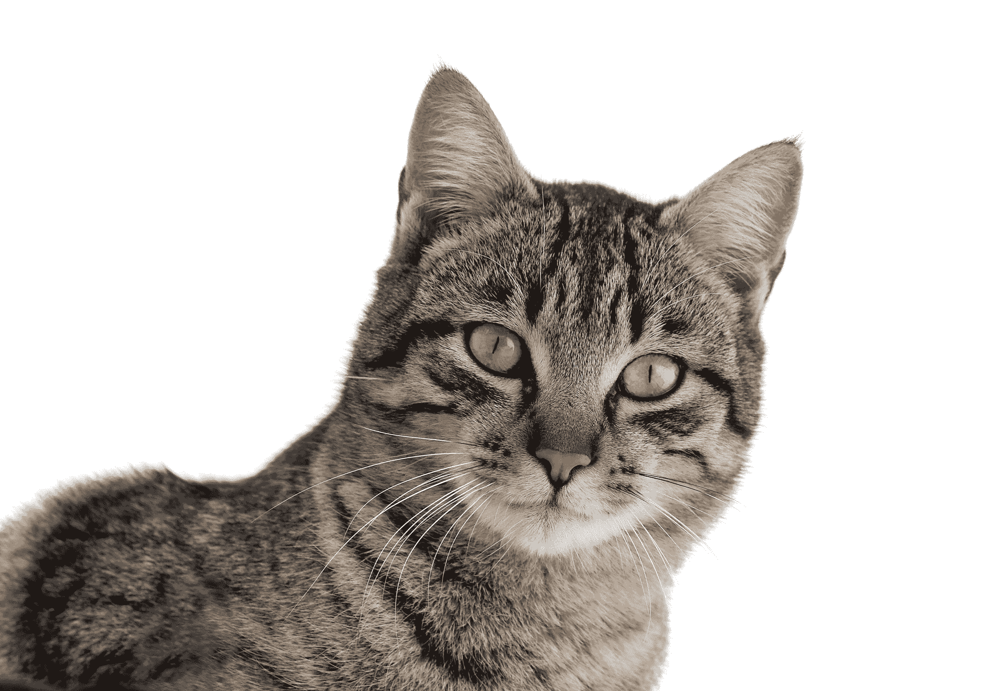
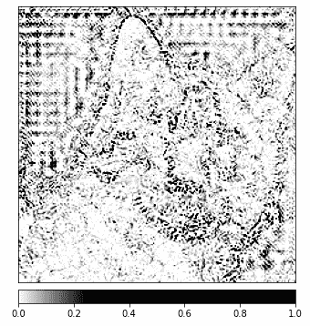
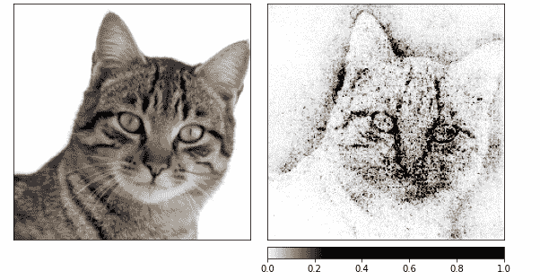
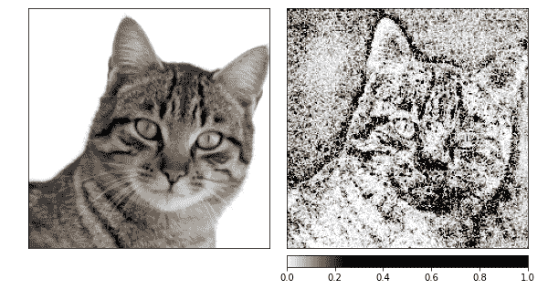
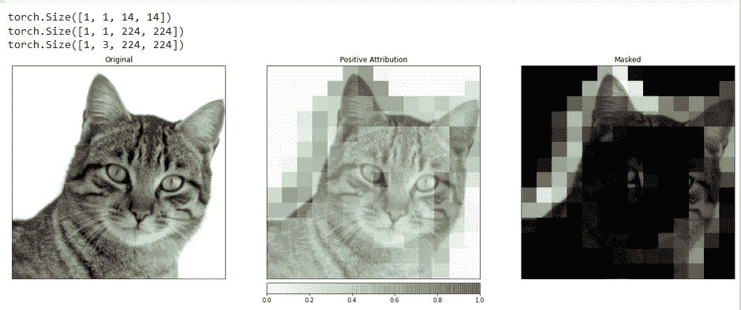
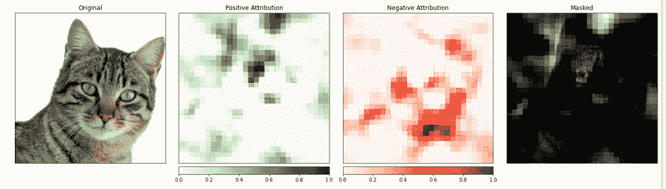

# 基于 Captum 的 PyTorch 模型可解释性和可理解性

> 原文：<https://blog.paperspace.com/model-interpretability-and-understanding-for-pytorch-using-captum/>

### 介绍

模型可解释性的方法近年来变得越来越重要，这是模型复杂性增加和缺乏透明度的直接结果。模型理解是一个热门的研究课题，也是机器学习在各个领域实际应用的焦点。

Captum 为学者和开发人员提供尖端技术，如集成渐变，使识别有助于模型输出的元素变得简单。Captum 使 ML 研究人员更容易使用 PyTorch 模型来构建可解释性方法。

通过更容易地识别对模型输出有贡献的许多元素，Captum 可以帮助模型开发人员创建更好的模型，并修复提供意外结果的模型。

### 算法描述

Captum 是一个允许实现各种可解释性方法的库。可以将 Captum 的属性算法分为三大类:

*   **主要属性**:决定每个输入特征对模型输出的贡献。
*   **层属性:**评估特定层中的每个神经元对模型输出的贡献。
*   **神经元归属:**通过评估每个输入特征的贡献来确定隐藏神经元的激活。

以下是当前在 Captum 中实现的用于初级、层和神经元属性的各种方法的简要概述。还包括噪声隧道的描述，它可用于平滑任何归因方法的结果。除了属性算法之外，Captum 还提供了评估模型解释可靠性的指标。此时，他们提供不忠和敏感性指标，帮助评估解释的准确性。

## 主要归因技巧

### 集成渐变

假设我们有一个深度网络的形式表示，F : Rn → [0，1]。设 x ∈ Rn 为当前输入，x′∈Rn 为基线输入。
图像网络中的基线可能是黑色图像，而它可能是文本模型中的零嵌入向量。
从基线 x’到输入 x，我们计算沿直线路径所有点的梯度(单位为 Rn)。通过累积这些梯度，可以生成综合梯度。积分梯度被定义为沿着从基线 x’到输入 x 的直接路径的梯度的路径积分



敏感性和实现不变性这两个基本假设构成了该方法的基础。请参考[原文](https://arxiv.org/pdf/1703.01365.pdf)了解更多关于这些公理的内容。

### 梯度 SHAP

[合作博弈理论](https://en.wikipedia.org/wiki/Cooperative_game_theory)中的沙普利值用于计算梯度 SHAP 值，这些值是使用梯度方法计算的。[梯度 SHAP](https://github.com/slundberg/shap/#deep-learning-example-with-gradientexplainer-tensorflowkeraspytorch-models) 将高斯噪声多次添加到每个输入样本，然后在基线和输入之间的路径上选取一个随机点，以确定输出的梯度。因此，最终的 SHAP 值代表梯度的预期值。*(投入-基线)。假设输入要素是独立的，并且解释模型在输入和提供的基线之间是线性的，则 SHAP 值是近似的。

### 深层提升

可以使用 [DeepLIFT](https://captum.ai/api/deep_lift.html) (一种反向传播技术)根据输入与其匹配参考(或基线)之间的差异来确定输入变化。DeepLIFT 试图使用来自参考的输入之间的差异来解释来自参考的输出之间的差异。DeepLIFT 采用乘数的概念来“责备”单个神经元的输出差异。对于给定的输入神经元 x 和目标神经元 t，输入神经元 x 与参考值之差为 x，目标神经元 t 与参考值之差为 t，我们希望计算其贡献，我们将乘数 m x t 定义为:



### 深层提升 SHAP

[DeepLIFT SHAP](https://captum.ai/api/deep_lift_shap.html) 是基于合作博弈论中建立的 Shapley 值的 DeepLIFT 扩展。DeepLIFT SHAP 计算每个输入基线对的 DeepLIFT 属性，并使用基线分布对每个输入示例的结果属性进行平均。DeepLIFT 的非线性规则有助于线性化网络的非线性函数，该方法对 SHAP 值的近似也适用于线性化网络。在这种方法中，输入特征同样被认为是独立的。

### 显著

通过[显著性](https://captum.ai/api/saliency.html)计算输入属性是一个简单的过程，它产生输出相对于输入的梯度。[在输入端使用一阶泰勒网络](https://en.wikipedia.org/wiki/Taylor_series)展开，梯度是模型线性表示中每个特征的系数。这些系数的绝对值可以用来指示特征的相关性。你可以在[的原始论文](https://arxiv.org/pdf/1312.6034.pdf )中找到关于显著性方法的更多信息。

### 输入 X 渐变

> [输入 X 梯度](https://captum.ai/api/input_x_gradient.html)是显著性方法的扩展，采用输出相对于输入的梯度并乘以输入特征值。这种方法的一个直觉是考虑线性模型；梯度只是每个输入的系数，输入与系数的乘积对应于要素对线性模型输出的总贡献。

### 导向反向传播和反卷积

梯度计算通过[导向反向传播](https://captum.ai/api/guided_backprop.html)和[反卷积](https://captum.ai/api/deconvolution.html)进行，尽管 ReLU 函数的反向传播被覆盖，因此只有非负梯度被反向传播。当 ReLU 函数应用于引导反向传播中的输入梯度时，它直接应用于反卷积中的输出梯度。通常将这些方法与卷积网络结合使用，但它们也可以用于其他类型的神经网络结构。

### 制导 GradCAM

导向反向传播属性计算导向 GradCAM 属性([导向 GradCAM](https://arxiv.org/pdf/1610.02391.pdfhttps://captum.ai/api/guided_grad_cam.html) )与上采样(层)GradCAM 属性的元素级乘积。对给定图层进行属性计算，并对其进行上采样以适应输入大小。卷积神经网络是这种技术的焦点。然而，可以提供能够与输入空间对齐的任何层。通常，提供最后一个卷积层。

### 特征消融

为了计算属性，一种被称为“[特征消融](https://captum.ai/api/feature_ablation.html)的技术采用了一种基于扰动的方法，在计算输出差异之前，用一个已知的“基线”或“参考值”(如 0)替代每个输入特征。对输入特征进行分组和切除是单独进行的更好的替代方法，许多不同的应用程序都可以从中受益。通过分组和切除图像的片段，我们可以确定该片段的相对重要性。

### 特征置换

[特征置换](https://captum.ai/api/feature_permutation.html)是一种基于扰动的方法，在该方法中，每个特征在一个批次内被随机置换，并且输出(或损失)的变化被计算为这种修改的结果。特征也可以组合在一起，而不是像特征切除一样单独进行。请注意，与 Captum 中其他可用的算法相比，该算法是唯一一个在提供一批多输入示例时可以提供正确属性的算法。其他算法只需要一个例子作为输入。

### 闭塞

> [遮挡](https://arxiv.org/pdf/1311.2901.pdf)是一种基于扰动的方法来计算属性，用给定的基线/参考替换每个相邻的矩形区域，并计算输出的差异。对于位于多个区域(超矩形)中的要素，相应的输出差异被平均以计算该要素的属性。遮挡在诸如图像的情况下是最有用的，其中连续矩形区域中的像素可能是高度相关的。

### Shapley 值采样

归因技术 [Shapley 值](https://captum.ai/api/shapley_value_sampling.html)基于合作博弈理论。该技术采用输入要素的每种排列，并将它们逐个添加到指定的基线。添加每个特征后的输出差异对应于其贡献，并且这些差异在所有排列中被求和以确定属性。

### 石灰

最广泛使用的可解释性方法之一是 [Lime](https://captum.ai/api/lime.html) ，它通过对输入示例周围的数据点进行采样来训练可解释的替代模型，并在这些点上使用模型评估来训练更简单的可解释“替代”模型，如线性模型。

### KernelSHAP

[核 SHAP](https://captum.ai/api/kernel_shap.html) 是一种使用 LIME 框架计算 Shapley 值的技术。Shapley 值可以在 LIME 框架中通过设置损失函数、加权核以及适当地正则化项来更有效地获得。

## 层归属技术

### 层电导

层电导是一种通过将神经元的激活与神经元相对于神经元的输入和输出的偏导数相结合来构建神经元重要性的更全面图像的方法。通过隐藏的神经元，电导建立在综合梯度(IG)属性流的基础上。在[原文](https://arxiv.org/pdf/1805.12233.pdf)中，隐藏神经元 y 的总电导定义如下:


### 内部影响

使用[内部影响](https://arxiv.org/pdf/1802.03788.pdf)，可以估计从基线输入到提供的输入之间的梯度积分。此技术类似于应用集成渐变，它涉及到对图层(而不是输入)的渐变进行集成。

### 层梯度 X 激活

图层渐变 X 激活相当于网络中隐藏图层的输入 X 渐变技术..
将层元素的激活与指定层的目标输出梯度相乘。

### grabcad

[GradCAM](https://arxiv.org/pdf/1610.02391.pdf) 是一种卷积神经网络层归属技术，通常应用于最后一个卷积层。GradCAM 计算目标输出相对于指定层的渐变，对每个输出通道(输出维度 2)进行平均，并将每个通道的平均渐变乘以层激活。将 ReLU 应用于输出，以确保从所有通道的结果总和中仅返回非负属性。

## 神经元归因技术

### 神经元电导

[电导](https://arxiv.org/pdf/1805.12233.pdf)将神经元激活与神经元相对于输入和相对于神经元的输出的偏导数相结合，以提供神经元相关性的更全面的图像。为了确定特定神经元的电导，人们检查来自通过该神经元的每个输入的 IG 属性流。以下是原论文对给定输入属性 I 的神经元 y 的电导的正式定义:


根据该定义，应该注意的是，对神经元的电导(跨所有输入特征)求和总是等于该特定神经元所在层的电导。

### 神经元梯度

[神经元梯度](https://captum.ai/api/neuron.html)方法是网络中单个神经元的显著性方法的等价方法。
它只是计算神经元输出相对于模型输入的梯度。
与显著性一样，这种方法可以被认为是在给定输入下对神经元输出进行一阶泰勒展开，梯度对应于模型线性表示中每个特征的系数。

### 神经元积分梯度

使用一种称为“[神经元积分梯度](https://captum.ai/api/neuron.html)的技术，可以估计从基线输入到感兴趣的输入的整个路径中特定神经元的输入梯度积分积分梯度等效于这种方法，假设输出只是被识别神经元的输出。你可以在原文[中找到关于综合梯度方法的更多信息](https://arxiv.org/abs/1703.01365)。

### 神经元梯度形状

神经元 GradientSHAP 相当于特定神经元的 GradientSHAP。神经元梯度将高斯噪声多次添加到每个输入样本中，沿着基线和输入之间的路径选择一个随机点，并计算目标神经元相对于每个随机选取的点的梯度。得到的 SHAP 值接近预测的梯度值*。(投入-基线)。

### 神经元深度提升 SHAP

神经元深度提升 SHAP 相当于特定神经元的深度提升。使用基线分布，深度提升 SHAP 算法计算每个输入-基线对的神经元深度提升属性，并对每个输入示例的结果属性进行平均。

### 噪音隧道

[噪声隧道](https://captum.ai/api/noise_tunnel.html)是一种可与其他方法结合使用的归因技术。噪声隧道会多次计算属性，每次都会将高斯噪声添加到输入中，然后根据所选的类型合并结果属性。支持以下噪声隧道类型:

*   **Smoothgrad:** 返回采样属性的均值。使用高斯核平滑指定的属性技术是这一过程的近似。
*   **Smoothgrad Squared** :返回样本属性平方的平均值。
*   **Vargrad:** 返回样本属性的方差。

## 韵律学

### 无信仰

[不忠](https://captum.ai/api/metrics.html)测量输入扰动幅度的模型解释和预测函数对这些输入扰动的变化之间的均方误差。不忠的定义如下:



从众所周知的属性技术(如积分梯度)来看，这是一个计算效率更高且扩展的 sensitivity vy-n 概念。后者分析属性之和与其输入和预定义基线的预测函数之差之间的相关性。

### 灵敏度

[灵敏度](https://captum.ai/api/metrics.html#sensitivity)，定义为使用基于蒙特卡罗采样的近似法对微小输入扰动的解释变化程度，测量如下:


默认情况下，我们从具有默认半径的 L-Infinity 球的子空间进行采样，以近似灵敏度。用户可以改变球的半径和样本函数。

请参考[算法文档](https://captum.ai/docs/algorithms)获取所有可用算法的完整列表。

## 预训练 ResNet 模型的模型解释

本教程展示了如何在预训练的 ResNet 模型上使用模型可解释性方法和选择的图像，并通过将它们叠加在图像上来可视化每个像素的属性。在本教程中，我们将使用解释算法集成梯度，梯度形状，属性与层梯度和闭塞。

在开始之前，您必须有一个 Python 环境，其中包括:

*   Python 版本 3.6 或更高版本
*   PyTorch 版本 1.2 或更高版本(建议使用最新版本)
*   TorchVision 版本 0
*   . 6 或更高版本(建议使用最新版本)
*   Captum(推荐最新版本)

根据您使用的是 Anaconda 还是 pip 虚拟环境，以下命令将帮助您设置 Captum:

用`conda`:

```py
conda install pytorch torchvision captum -c pytorch
```

用`pip`:

```py
pip install torch torchvision captum
```

让我们导入库。

```py
import torch
import torch.nn.functional as F

from PIL import Image

import os
import json
import numpy as np
from matplotlib.colors import LinearSegmentedColormap
import os, sys
import json

import numpy as np
from PIL import Image
import matplotlib.pyplot as plt
from matplotlib.colors import LinearSegmentedColormap

import torchvision
from torchvision import models
from torchvision import transforms

from captum.attr import IntegratedGradients
from captum.attr import GradientShap
from captum.attr import Occlusion
from captum.attr import LayerGradCam
from captum.attr import NoiseTunnel
from captum.attr import visualization as viz
from captum.attr import LayerAttribution 
```

加载预训练的 Resnet 模型，并将其设置为评估模式

```py
model = models.resnet18(pretrained=True)
model = model.eval()
```

ResNet 是在 ImageNet 数据集上训练的。下载并读取内存中的 ImageNet 数据集类/标签列表。

```py
wget -P $HOME/.torch/models https://s3.amazonaws.com/deep-learning-models/image-models/imagenet_class_index.json
labels_path = os.getenv("HOME") + '/.torch/models/imagenet_class_index.json'
with open(labels_path) as json_data:
    idx_to_labels = json.load(json_data)
```

现在我们已经完成了模型，我们可以下载图片进行分析。在我的例子中，我选择了一个猫的形象。



[source](https://fr.m.wikipedia.org/wiki/Fichier:Cat_March_2010-1.jpg)

您的图像文件夹必须包含文件 cat.jpg。如下图所示， [Image.open()](https://pillow.readthedocs.io/en/stable/reference/Image.html) 打开并识别给定的图像文件，[NP . asary()](https://numpy.org/doc/stable/reference/generated/numpy.asarray.html)将其转换为数组。

```py
test_img = Image.open('path/cat.jpg')
test_img_data = np.asarray(test_img)
plt.imshow(test_img_data)
plt.show()
```

在下面的代码中，我们将为图像定义变形器和归一化函数。为了训练我们的 ResNet 模型，我们使用了 ImageNet 数据集，它要求图像具有特定的大小，通道数据被标准化为指定的值范围。[变换。Compose()](https://pytorch.org/vision/stable/generated/torchvision.transforms.Compose.html) 将几个变换组合在一起，[变换。Normalize()](https://pytorch.org/vision/main/generated/torchvision.transforms.Normalize.html) 使用平均值和标准偏差对张量图像进行归一化。

```py
# model expectation is 224x224 3-color image
transform = transforms.Compose([
 transforms.Resize(256),
 transforms.CenterCrop(224), #crop the given tensor image at the center
 transforms.ToTensor()
])
# ImageNet normalization
transform_normalize = transforms.Normalize(
     mean=[0.485, 0.456, 0.406],
     std=[0.229, 0.224, 0.225]
 )

img = Image.open('path/cat.jpg')

transformed_img = transform(img)

input = transform_normalize(transformed_img)
#unsqueeze returns a new tensor with a dimension of size one inserted at the #specified position.
input = input.unsqueeze(0)
```

现在，我们将预测输入图像的类别。可以问的问题是，“我们的模型觉得这个图像代表了什么？”

```py
#call our model
output = model(input)
## applied softmax() function
output = F.softmax(output, dim=1)
#torch.topk returns the k largest elements of the given input tensor along a given #dimension.K here is 1
prediction_score, pred_label_idx = torch.topk(output, 1)
pred_label_idx.squeeze_()
#convert into a dictionnary of keyvalues pair the predict label, convert it #into a string to get the predicted label
predicted_label = idx_to_labels[str(pred_label_idx.item())][1]
print('Predicted:', predicted_label, '(', prediction_score.squeeze().item(), ')')
```

输出:

```py
Predicted: tabby ( 0.5530276298522949 )
```

ResNet 认为我们的猫的形象描绘了一只真实的猫，这一事实得到了证实。但是是什么给模特的印象是这是一只猫的形象呢？为了找到这个问题的答案，我们将咨询 Captum。

### 具有集成梯度的特征属性

Captum 中的各种特征归属技术之一是[集成梯度](https://captum.ai/api/integrated_gradients.html)。集成梯度通过估计模型输出相对于输入的梯度积分，为每个输入要素授予一个相关性分数。

在我们的例子中，我们将采用输出向量的一个特定分量——表示模型在其所选类别中的置信度的分量——并使用综合梯度来计算输入图像的哪些方面对该输出有贡献。这将允许我们确定图像的哪些部分在产生这个结果时是最重要的。
在我们从综合梯度中获得重要性地图后，我们将使用 Captum 捕获的可视化工具来提供对重要性地图的清晰易懂的描述。

积分梯度将确定预测类 **pred_label_idx** 相对于沿着从黑色图像到我们的输入图像的路径的输入图像像素的模型输出的梯度积分。

```py
print('Predicted:', predicted_label, '(', prediction_score.squeeze().item(), ')')
#Create IntegratedGradients object and get attributes
integrated_gradients = IntegratedGradients(model)
#Request the algorithm to assign our output target to
attributions_ig = integrated_gradients.attribute(input, target=pred_label_idx, n_steps=200)
```

输出:

```py
Predicted: tabby ( 0.5530276298522949 )
```

让我们通过将图片叠加在图片上来看看图片和它的属性。Captum 提供的 [visualize_image_attr()](https://captum.ai/api/utilities.html) 方法提供了一组根据您的偏好定制属性数据显示的可能性。这里，我们传入一个自定义的 Matplotlib 颜色图(参见[LinearSegmentedColormap()](https://matplotlib.org/stable/api/_as_gen/matplotlib.colors.LinearSegmentedColormap.html))。

```py
#result visualization with custom colormap
default_cmap = LinearSegmentedColormap.from_list('custom blue', 
                                                 [(0, '#ffffff'),
                                                  (0.25, '#000000'),
                                                  (1, '#000000')], N=256)
# use visualize_image_attr helper method for visualization to show the #original image for comparison
_ = viz.visualize_image_attr(np.transpose(attributions_ig.squeeze().cpu().detach().numpy(), (1,2,0)),
                             np.transpose(transformed_img.squeeze().cpu().detach().numpy(), (1,2,0)),
                             method='heat_map',
                             cmap=default_cmap,
                             show_colorbar=True,
                             sign='positive',
                             outlier_perc=1)
```

输出:



您应该能够注意到，在上面显示的图像中，图像中猫周围的区域是综合梯度算法给我们提供最强信号的地方。

让我们通过使用综合梯度来计算属性，然后在由[噪声隧道](https://captum.ai/api/noise_tunnel.html)产生的几幅图像上平滑它们。
后者通过添加标准偏差为 1、10 倍的高斯噪声来修改输入( **nt_samples=10** )。噪声隧道使用 **smoothgrad_sq** 方法使噪声样本的所有 nt_samples 的属性一致。
**smooth grad _ sq**的值是跨越 **nt_samples** 样本的平方属性的平均值。[visualize _ image _ attr _ multiple()](https://captum.ai/api/utilities.html)通过归一化指定符号的属性值(正、负、绝对值或全部)，然后使用所选模式将它们显示在 matplotlib 图形中，从而可视化给定图像的属性。

```py
noise_tunnel = NoiseTunnel(integrated_gradients)

attributions_ig_nt = noise_tunnel.attribute(input, nt_samples=10, nt_type='smoothgrad_sq', target=pred_label_idx)
_ = viz.visualize_image_attr_multiple(np.transpose(attributions_ig_nt.squeeze().cpu().detach().numpy(), (1,2,0)),
                                      np.transpose(transformed_img.squeeze().cpu().detach().numpy(), (1,2,0)),
                                      ["original_image", "heat_map"],
                                      ["all", "positive"],
                                      cmap=default_cmap,
                                      show_colorbar=True) 
```

输出:



我可以在上面的图片中看到，模型集中在猫的头部。

让我们用 GradientShap 来结束。 [GradientShap](https://captum.ai/api/gradient_shap.html) 是一种可用于计算 Shap 值的梯度方法，也是一种了解全局行为的绝佳工具。它是一种线性解释模型，通过使用参考样本的分布来解释模型的预测。它确定在输入和基线之间随机选取的输入的预期梯度。
基线是从提供的基线分布中随机选取的。

```py
torch.manual_seed(0)
np.random.seed(0)

gradient_shap = GradientShap(model)

# Definition of baseline distribution of images
rand_img_dist = torch.cat([input * 0, input * 1])

attributions_gs = gradient_shap.attribute(input,
                                          n_samples=50,
                                          stdevs=0.0001,
                                          baselines=rand_img_dist,
                                          target=pred_label_idx)
_ = viz.visualize_image_attr_multiple(np.transpose(attributions_gs.squeeze().cpu().detach().numpy(), (1,2,0)),
                                      np.transpose(transformed_img.squeeze().cpu().detach().numpy(), (1,2,0)),
                                      ["original_image", "heat_map"],
                                      ["all", "absolute_value"],
                                      cmap=default_cmap,
                                      show_colorbar=True)
```

输出:



### 使用图层梯度图的图层属性

借助图层属性，您可以将模型中隐藏图层的活动与输入要素相关联。
我们将应用一种层属性算法来调查模型中包含的一个卷积层的活动。
GradCAM 负责计算目标输出相对于指定层的梯度。然后，对每个输出通道(输出的维度 2)的这些梯度进行平均，并将层激活乘以每个通道的平均梯度。
对所有频道的结果进行汇总。由于卷积层的活动通常在空间上映射到输入，GradCAM 属性经常被上采样并用于屏蔽输入。值得注意的是，GradCAM 是明确为卷积神经网络(convnets)开发的。图层属性的设置方式与输入属性相同，只是除了模型之外，还必须在要分析的模型中提供一个隐藏图层。与之前讨论的类似，当我们调用 **attribute()，**时，我们指出了感兴趣的目标类。

```py
layer_gradcam = LayerGradCam(model, model.layer3[1].conv2)
attributions_lgc = layer_gradcam.attribute(input, target=pred_label_idx)

_ = viz.visualize_image_attr(attributions_lgc[0].cpu().permute(1,2,0).detach().numpy(),
                             sign="all",
                             title="Layer 3 Block 1 Conv 2")
```

为了在输入图像和属性数据之间进行更精确的比较，我们将借助位于[layer attribute](https://captum.ai/api/base_classes.html?highlight=layerattribution#captum.attr.LayerAttribution)基类中的函数 **interpolate()** 对其进行增采样。

```py
upsamp_attr_lgc = LayerAttribution.interpolate(attributions_lgc, input.shape[2:])

print(attributions_lgc.shape)
print(upsamp_attr_lgc.shape)
print(input.shape)

_ = viz.visualize_image_attr_multiple(upsamp_attr_lgc[0].cpu().permute(1,2,0).detach().numpy(),
                                      transformed_img.permute(1,2,0).numpy(),
                                      ["original_image","blended_heat_map","masked_image"],
                                      ["all","positive","positive"],
                                      show_colorbar=True,
                                      titles=["Original", "Positive Attribution", "Masked"],
                                      fig_size=(18, 6))
```

输出:



像这样的可视化有可能为您提供独特的见解，了解隐藏层如何响应您提供的输入。

### 具有遮挡的特征属性

基于梯度的方法有助于在直接计算输出相对于输入的变化方面理解模型。被称为基于扰动的归因的技术对这个问题采取了一种更直接的方法，即通过修改输入来量化这种变化对输出的影响。一种这样的策略叫做[闭塞](https://captum.ai/api/occlusion.html)。
它需要交换输入图像的片段，并分析这种变化如何影响输出端产生的信号。

在下面，我们将配置遮挡属性。像卷积神经网络的配置一样，您可以选择目标区域的大小和步长，这决定了各个测量的间距。
我们将使用**visualize _ image _ attr _ multiple()**函数来查看我们的遮挡属性的结果。该功能将显示每个区域的正面和负面属性的热图，并用正面属性区域遮盖原始图像。
遮罩为我们的猫照片中被模型识别为最“像猫”的区域提供了非常有启发性的外观

```py
occlusion = Occlusion(model)

attributions_occ = occlusion.attribute(input,
                                       target=pred_label_idx,
                                       strides=(3, 8, 8),
                                       sliding_window_shapes=(3,15, 15),
                                       baselines=0)

_ = viz.visualize_image_attr_multiple(np.transpose(attributions_occ.squeeze().cpu().detach().numpy(), (1,2,0)),
                                      np.transpose(transformed_img.squeeze().cpu().detach().numpy(), (1,2,0)),
                                      ["original_image", "heat_map", "heat_map", "masked_image"],
                                      ["all", "positive", "negative", "positive"],
                                      show_colorbar=True,
                                      titles=["Original", "Positive Attribution", "Negative Attribution", "Masked"],
                                      fig_size=(18, 6)
                                     )
```

输出:



图像中包含猫的部分似乎被赋予更高的重要性。

### 结论

Captum 是 PyTorch 的一个模型可解释性库，它是通用和简单的。它为理解特定神经元和层如何影响预测提供了最先进的技术。
主要有三类归因技术:[初级归因技术](https://captum.ai/docs/algorithms#general-attribution)、[分层归因技术](https://captum.ai/docs/algorithms#layer-attribution)、[神经元归因技术](https://captum.ai/docs/algorithms#neuron-attribution)。

## 参考

[https://py torch . org/tutorials/初学者/intro yt/captumyt . html](https://pytorch.org/tutorials/beginner/introyt/captumyt.html)
https://captum.ai/docs/algorithms
[https://captum.ai/docs/introduction.html](https://captum.ai/docs/introduction.html)
[https://Gilbert tanner . com/blog/interpreting-py torch-models-with-captum/](https://gilberttanner.com/blog/interpreting-pytorch-models-with-captum/)
[https://arxiv.org/pdf/1805.12233.pdf](https://arxiv.org/pdf/1805.12233.pdf)
[https://arxiv.org/pdf/1704.02685.pdf](https://arxiv.org/pdf/1704.02685.pdf)