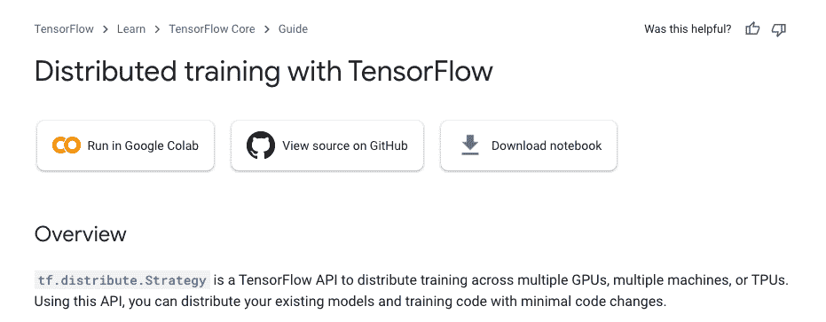
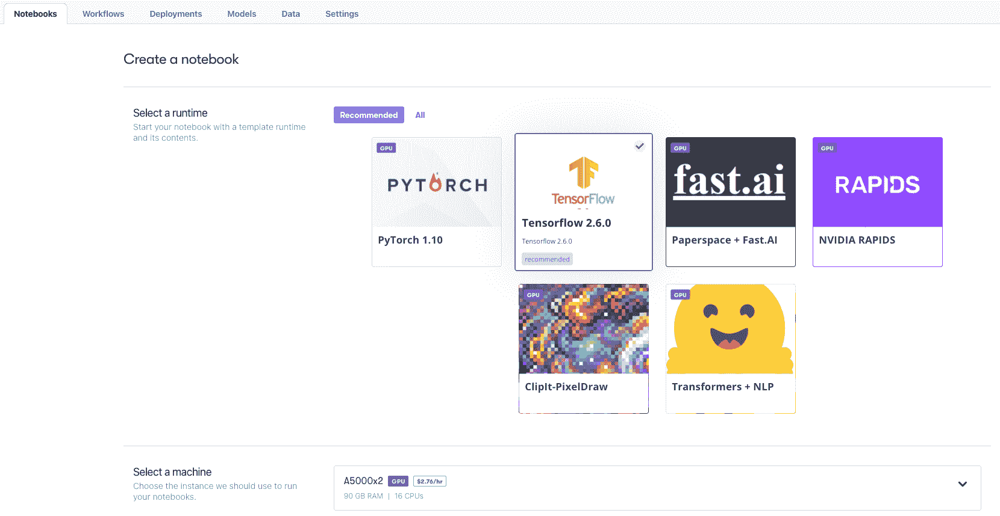
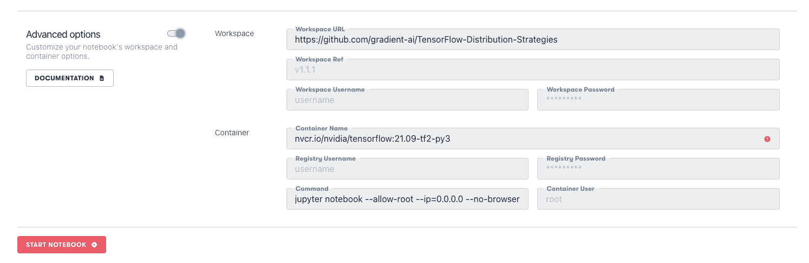

# 基于梯度的多 GPU:张量流分布策略

> 原文：<https://blog.paperspace.com/multi-gpu-tensorflow-distribution-strategies/>

正如这里的许多读者所知，Paperspace 使直接通过 Paperspace Core 上的虚拟机或通过 Paperspace Gradient 上的笔记本电脑、工作流和部署来访问 GPU 计算能力变得非常容易。

支持访问单个 GPU 的一个显而易见的扩展是在一台机器上扩展到多个 GPU，以及扩展到多台机器。

在这里，我们展示了其中的第一个，一台机器上的多 GPU，如何通过使用 [TensorFlow 分布策略](https://www.tensorflow.org/guide/distributed_training)在 TensorFlow 上运行分布式训练来处理梯度。我们还展示了简单的和定制的训练循环都可以实现。

这里要注意的一个关键点是*做这个*不需要特殊的设置:一个常规的渐变容器和一个用户可用的多 GPU 笔记本实例就足够了。

## 张量流分布策略



tensor flow Distribution Strategies 是他们的 API，通过将现有代码放在以`with strategy.scope():`开头的块中，允许现有模型分布在多个 GPU(多 GPU)和多个机器(多工作器)上。

`strategy`表示我们正在使用 TensorFlow 的当前策略之一来分发我们的模型:

*   镜像策略
*   贸易策略
*   多重工作镜像策略
*   参数服务器策略
*   中央仓库战略

其中每一种都代表了分配硬件和计算的不同方式，根据要解决的问题，它们有不同的优点和缺点。

我们在这里主要关注的是最常用和最简单的一个。这允许在一台机器上的多个 GPU 上进行模型训练，训练是*同步*，这意味着所有部分，如渐变，都在每一步后更新。

简要地看了看其他人:

`TPUStrategy`非常相似，但只适用于谷歌的张量处理单元(TPU)硬件。

`MultiWorkerMirroredStrategy`将`MirroredStrategy`推广到多台机器，即工人。

`ParameterServerStrategy`代表除了镜像之外的另一种分布方法，其中在它自己的机器上的模型的每个部分可以有它自己的变量。这就是*异步*训练。变量值在一台中央机器，即参数服务器上进行协调。

最后，`CentralStorageStrategy`类似，但是将变量放在 CPU 上，而不是镜像它们。

这些策略通过一套以多种形式提供的[教程](https://www.tensorflow.org/tutorials/distribute)展示在 TensorFlow 的网站上。这些包括`.ipynb` Jupyter 笔记本，我们将在下面运行。

### 简单和复杂模型

张量流模型有不同的复杂程度，这些复杂程度可以用几种方法进行分类。特别是，除了发行策略之外，他们网站上的教程可以分为

*   简单的训练循环
*   自定义训练循环

其中训练循环是训练模型的过程。自定义训练循环提供了更通用、更细粒度的功能，但是比简单的训练循环需要更多的代码来实现。真正的问题通常有一些要求，这意味着需要一个自定义的循环。

然而，对于多 GPU，使用自定义循环意味着实现比仅仅将现有的单 GPU 代码封装在`with strategy.scope():`块中更复杂。例如，当模型损失函数的分量来自几个并行运行的作业时，必须对其进行不同的定义。不是监督学习的简单情况的模型形式，例如 GAN、强化学习等。，也是自定义循环。

虽然我们不试图在这里重现所有的细节，但我们表明简单和定制的训练循环都可以在 Gradient 中工作，无论是在单 GPU 上还是在多 GPU 上。

## 在梯度上运行张量流分布策略

顺着这个帖子的标题，这里重点说一下在一台机器上运行多 GPU，对应的是`MirroredStrategy`，如上所述。我们展示了简单的和定制的训练循环。

### 运行镜像策略

我们展示了来自 TensorFlow 的分布式教程的 2 款`.ipynb` Jupyter 笔记本，经过略微修改，可以在渐变上运行得更好:

*   `keras.ipynb`，来自[分布式训练与 Keras](https://www.tensorflow.org/tutorials/distribute/keras) 教程
*   `custom_training.ipynb`，来自[定制培训](https://www.tensorflow.org/tutorials/distribute/custom_training)教程

**设置**

要在 Gradient 上运行，我们创建一个项目，然后启动一个新的笔记本实例，选择 TensorFlow 容器和一台具有多 GPU 的机器。



TensorFlow container with multi-GPU Notebook instance

这里，我们使用两个安培的 A5000s。在高级选项中，我们选择工作区作为包含三个笔记本的 repo。



Using the GitHub repository for this project

然后，我们的多 GPU 笔记本电脑就可以运行了。

**keras.ipynb**

这展示了一个使用 TensorFlow 的高级 Keras 接口的简单模型。

使用`nvidia-smi`和 TensorFlow 自己的功能，我们看到两个 GPU 都存在

```py
print('Number of devices: {}'.format(strategy.num_replicas_in_sync))

# Output:
# Number of devices: 2
```

Both GPUs are present

使用的数据是来自 TensorFlow 数据集的 MNIST 数据。

使用`strategy = tf.distribute.MirroredStrategy()`定义分配策略。

该模型以通常的格式构建，但是在块`with strategy.scope():`内

```py
with strategy.scope():
  model = tf.keras.Sequential([
      tf.keras.layers.Conv2D(32, 3, activation='relu', input_shape=(28, 28, 1)),
      tf.keras.layers.MaxPooling2D(),
      tf.keras.layers.Flatten(),
      tf.keras.layers.Dense(64, activation='relu'),
      tf.keras.layers.Dense(10)
  ])

  model.compile(loss=tf.keras.losses.SparseCategoricalCrossentropy(from_logits=True),
                optimizer=tf.keras.optimizers.Adam(),
                metrics=['accuracy'])
```

Model code is moved inside strategy scope block

本教程随后展示了回调、模型训练和评估，以及保存为 SavedModel 格式。

**custom_training.ipynb**

在本教程中，整体结构是相似的，但现在我们使用自定义循环，而不是`keras.ipynb`中的简单循环。它也使用时尚 MNIST 数据集，而不是原来的那个。

现在必须定义损失函数，因为它合并了从多个 GPU 的副本中计算的损失。

```py
with strategy.scope():
  # Set reduction to `none` so we can do the reduction afterwards and divide by
  # global batch size.
  loss_object = tf.keras.losses.SparseCategoricalCrossentropy(
      from_logits=True,
      reduction=tf.keras.losses.Reduction.NONE)
  def compute_loss(labels, predictions):
    per_example_loss = loss_object(labels, predictions)
    return tf.nn.compute_average_loss(per_example_loss, global_batch_size=GLOBAL_BATCH_SIZE)
```

For a custom training loop, the loss function must be defined

类似地，必须计算诸如损失和准确性之类的性能指标。

本教程随后展示了训练循环、检查点和一些迭代数据集的替代方法。您可以在这里跟随其余的教程笔记本[，或者使用之前的链接作为笔记本创建页面的工作区 URL 来创建渐变笔记本。](https://github.com/gradient-ai/TensorFlow-Distribution-Strategies)

## 渐变消除了设置开销

正如我们现在所看到的，在分布式设置中训练模型并使用它们执行其他操作可能比使用单个 CPU 或 GPU 更复杂。因此对我们有利的是，Gradient 消除了设置 GPU 和安装 ML 软件的负担，允许我们直接进行编码。

这开辟了进一步的用途，例如，没有编写代码但仍然想要使用模型的用户，可以通过他们在生产、应用程序或一些其他用例中这样做。底层分布式硬件和 GPU 可以继续在 Gradient 上运行。

## 结论

我们已经证明张量流分布策略适用于梯度，包括:

*   `MirroredStrategy`在单个 GPU 上
*   `MirroredStrategy`在多 GPU 上
*   这两方面的简单模型训练
*   这两者上的定制训练循环

将来，当多节点支持被添加到 Gradient 中时，它将能够支持`MultiWorkerMirroredStrategy`、`ParameterServerStrategy`和`CentralStorageStrategy`，除了这篇博文中所涉及的那些。

## 后续步骤

您可以通过跟随 GitHub 知识库(位于[https://GitHub . com/gradient-ai/tensor flow-Distribution-Strategies](https://github.com/gradient-ai/TensorFlow-Distribution-Strategies))来尝试这些方法。

这包含了他们的两个笔记本的副本，从 TensorFlow 原件稍微修改，以便他们在梯度上工作，并如上运行。

有关分销策略的更多详细信息，请参阅这些笔记本，或 [TensorFlow 的分销策略指南](https://www.tensorflow.org/guide/distributed_training)。该指南包含一个笔记本，`distributed_training.ipynb`，它也将在渐变上运行，尽管它与上面的一些重叠。

之后，TensorFlow 分布式策略和梯度的使用非常普遍，因此有广泛的潜在项目可以完成。

## 附录:关于`MultiWorkerMirroredStrategy`和`ParameterServerStrategy`的注释

TensorFlow 的教程展示了这两种策略通过`localhost`在一台机器上工作，而不是要求用户拥有实际的多台机器。这意味着，事实上，它们也在梯度上运行。然而，镜像多工作器和参数服务器的正常使用会涉及到使用多个机器或节点。因为目前还不支持，所以我们没有尝试在这篇博客中展示它。