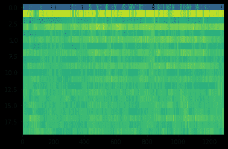
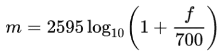
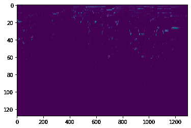
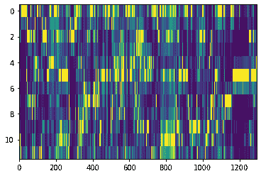
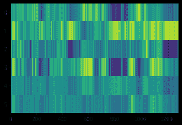

# 基于 Librosa 和 Tensorflow/Keras 的音乐流派分类

> 原文：<https://blog.paperspace.com/music-genre-classification-using-librosa-and-pytorch/>

在本教程中，我们展示了如何使用 Librosa 库计算的特征在 TensorFlow/Keras 中从头实现音乐流派分类器。

我们将使用最流行的公开可用的音乐流派分类数据集:GTZAN。该数据集包含一系列反映不同情况的录音，这些文件是在 2000 年至 2001 年间从许多来源收集的，包括个人 CD、收音机和麦克风录音。尽管它已经有 20 多年的历史，但它仍然被认为是关于音乐流派分类的机器学习应用的首选数据集。

该数据集包含 10 个类，每个类包含 100 个不同的 30 秒音频文件。这些类别是:布鲁斯、古典、乡村、迪斯科、嘻哈、爵士、金属、流行、雷鬼和摇滚。

在本教程中，出于简化的目的，我们将只使用 3 个流派(雷鬼，摇滚和古典)。但是，同样的原则仍然适用于更多的类型。

让我们从下载和提取数据集文件开始。

## 准备数据集

我们首先将使用 gdrive 包从 Google Drive 下载文件。然后，我们将从终端使用 unrar 对每个文件进行解压缩。您可以通过命令行或使用 line magic 来实现这一点。

```py
gdown --fuzzy 'https://drive.google.com/file/d/1nZz6EHYl7M6ReCd7BUHzhuDN52mA36_q/view?usp=drivesdk'
7z e gtzan.rar -odataset_rar
unrar e dataset_rar/reggae.rar dataset/reggae/
unrar e dataset_rar/rock.rar dataset/rock/
unrar e dataset_rar/classical.rar dataset/classical/
```

downloading & packing the Dataset

## 导入 python 库

现在我们将导入所需的库。TensorFlow 将用于模型训练、评估和预测，Librosa 用于所有音频相关操作，包括特征生成，Numpy 用于数值处理，Matplotlib 用于将特征打印为图像。

```py
import os
import numpy
from tensorflow import keras
import librosa
from matplotlib import pyplot
```

Importing needed librairies

## 音频功能

每种音乐类型都有自己的特点:音高、旋律、和弦进行和乐器类型。为了有一个可靠的分类，我们将使用一组捕捉这些元素的本质的特征，使模型有更好的机会被适当地训练以区分流派。

在本教程中，我们将构建四个特征，用于创建与我们的模型将被训练的每个文件相关的单个特征向量。

这些功能是:

*   梅尔频率倒谱系数
*   梅尔光谱图
*   色度矢量
*   音调质心特征

### 梅尔频率倒谱系数(MFCC)

MFCCs 或 Mel 频率倒谱系数是通过应用于信号功率谱的离散余弦变换计算的倒谱系数。根据 Mel 标度，该频谱的频带以对数间隔。

```py
def get_mfcc(wav_file_path):
  y, sr = librosa.load(wav_file_path, offset=0, duration=30)
  mfcc = numpy.array(librosa.feature.mfcc(y=y, sr=sr))
  return mfcc
```

function returning MFCC feature

接下来，我们将使用 Matplotlib 绘制一个示例文件的 MFCC 图像:

```py
example_file = "dataset/classical/classical.00015.wav"
mfcc = get_mfcc(example_file)
pyplot.imshow(mfcc, interpolation='nearest', aspect='auto')
pyplot.show()
```

Code to display image of MFCC feature



MFCC of the file classical.00015.wav

### 梅尔光谱图

Mel 声谱图相当于 Mel 标度中的标准声谱图，Mel 标度是一种音调的感知标度，听者感觉彼此之间的间距相等。从以赫兹为单位的频域到 Mel 标度的转换使用以下公式:



Mel scale conversion from frequency in hertz

```py
def get_melspectrogram(wav_file_path):
  y, sr = librosa.load(wav_file_path, offset=0, duration=30)
  melspectrogram = numpy.array(librosa.feature.melspectrogram(y=y, sr=sr))
  return melspectrogram
```

function returning MelSpectrogram feature

接下来，我们绘制同一音频文件的 Mel 频谱图:

```py
melspectrogram = get_melspectrogram(example_file)
pyplot.imshow(melspectrogram, interpolation='nearest', aspect='auto')
pyplot.show()
```

Code to display image of MelSpectrogram feature



Mel Spectrogram of the audio file classical.00015.wav

### 色度矢量

色度特征向量通过将全部频谱投影到 12 个面元上来构建，这 12 个面元反映了音乐八度音程的 12 个唯一半音(或色度): ***C，C#，D，D#，E，F，F#，G，G#，A，A#，B**T3。这种投影给出了一种有趣而有力的音乐音频表现，并且特别依赖于音乐类型。*

由于相距一个八度音程的音符被认为在音乐中特别相似，所以即使不知道绝对频率(即，原始八度音程)，理解色度的分布也可以提供关于音频的有用的音乐信息，并且甚至可以揭示在原始频谱中不可见的相同音乐流派中的感知的音乐相似性。

```py
def get_chroma_vector(wav_file_path):
  y, sr = librosa.load(wav_file_path)
  chroma = numpy.array(librosa.feature.chroma_stft(y=y, sr=sr))
  return chroma
```

function returning Chroma Vector

接下来绘制同一音频样本的色度向量:

```py
chroma = get_chroma_vector(example_file)
pyplot.imshow(chroma, interpolation='nearest', aspect='auto')
pyplot.show()
```

Code to display image of Chroma vector



Chroma Vector of the audio file classical.00015.wav

### 音调质心特征(Tonnetz)

这种表示是通过将色度特征投影到 6 维基础上来计算的，将完全五度、小三度和大三度分别表示为二维坐标。

```py
def get_tonnetz(wav_file_path):
  y, sr = librosa.load(wav_file_path)
  tonnetz = numpy.array(librosa.feature.tonnetz(y=y, sr=sr))
  return tonnetz
```

function returning Tonnetz feature

对于相同的色度矢量，我们具有以下 Tonnetz 特征:

```py
tntz = get_tonnetz(example_file)
pyplot.imshow(tntz , interpolation='nearest', aspect='auto')
pyplot.show()
```

Code to display image of Tonnetz feature



Tonnetz feature of the audio file classical.00015.wav

### 将功能整合在一起

在创建了用于生成特征的四个函数之后。我们实现了函数 ***get_feature*** ，该函数将提取包络(最小值和最大值)以及沿时间轴的每个特征的平均值。这样，无论音频的长度是多少，我们都将拥有一个大小不变的特征。接下来，我们使用 Numpy 将这四个特性连接成一个 498 浮点数组。

```py
def get_feature(file_path):
  # Extracting MFCC feature
  mfcc = get_mfcc(file_path)
  mfcc_mean = mfcc.mean(axis=1)
  mfcc_min = mfcc.min(axis=1)
  mfcc_max = mfcc.max(axis=1)
  mfcc_feature = numpy.concatenate( (mfcc_mean, mfcc_min, mfcc_max) )

  # Extracting Mel Spectrogram feature
  melspectrogram = get_melspectrogram(file_path)
  melspectrogram_mean = melspectrogram.mean(axis=1)
  melspectrogram_min = melspectrogram.min(axis=1)
  melspectrogram_max = melspectrogram.max(axis=1)
  melspectrogram_feature = numpy.concatenate( (melspectrogram_mean, melspectrogram_min, melspectrogram_max) )

  # Extracting chroma vector feature
  chroma = get_chroma_vector(file_path)
  chroma_mean = chroma.mean(axis=1)
  chroma_min = chroma.min(axis=1)
  chroma_max = chroma.max(axis=1)
  chroma_feature = numpy.concatenate( (chroma_mean, chroma_min, chroma_max) )

  # Extracting tonnetz feature
  tntz = get_tonnetz(file_path)
  tntz_mean = tntz.mean(axis=1)
  tntz_min = tntz.min(axis=1)
  tntz_max = tntz.max(axis=1)
  tntz_feature = numpy.concatenate( (tntz_mean, tntz_min, tntz_max) ) 

  feature = numpy.concatenate( (chroma_feature, melspectrogram_feature, mfcc_feature, tntz_feature) )
  return feature
```

function returning a concatenated version of all four features

### 计算整个数据集的要素

现在，我们将使用三种流派来训练我们的模型:雷鬼，古典和摇滚。对于更多的细微差别，如区分有很多相似之处的流派，例如摇滚和金属，应该包括更多的功能。

我们将遍历这三种类型的每个文件。并且，对于每一个，我们将构造特征数组，并将其与各自的标签一起存储。

```py
directory = 'dataset'
genres = ['reggae','classical','rock']
features = []
labels = []
for genre in genres:
    print("Calculating features for genre : " + genre)
    for file in os.listdir(directory+"/"+genre):
        file_path = directory+"/"+genre+"/"+file

        features.append(get_feature(file_path))
        label = genres.index(genre)
        labels.append(label)
```

Code constructing features for all files of the Dataset

### 将数据集分成训练、验证和测试部分

在创建了特征和标签数组之后，我们使用 Numpy 来打乱记录。然后，将数据集分成训练、验证和测试部分:分别为 60%、20%和 20%。

```py
permutations = numpy.random.permutation(300)
features = numpy.array(features)[permutations]
labels = numpy.array(labels)[permutations]

features_train = features[0:180]
labels_train = labels[0:180]

features_val = features[180:240]
labels_val = labels[180:240]

features_test = features[240:300]
labels_test = labels[240:300]
```

Code shuffling and splitting Dataset into training,validation and testing subsets

## 训练模型

对于该模型，我们将使用 Keras 实现两个规则的密集连接的神经网络层，具有整流线性单元激活函数“***【relu】***”，第一层 300 个隐藏单元，第二层 200 个隐藏单元。然后，对于输出层，我们还将使用概率分布激活函数“ ***softmax*** ”来实现密集连接的层。然后，我们将使用 64 个历元来训练模型:

```py
inputs = keras.Input(shape=(498), name="feature")
x = keras.layers.Dense(300, activation="relu", name="dense_1")(inputs)
x = keras.layers.Dense(200, activation="relu", name="dense_2")(x)
outputs = keras.layers.Dense(3, activation="softmax", name="predictions")(x)

model = keras.Model(inputs=inputs, outputs=outputs)

model.compile(
    # Optimizer
    optimizer=keras.optimizers.RMSprop(),
    # Loss function to minimize
    loss=keras.losses.SparseCategoricalCrossentropy(),
    # List of metrics to monitor
    metrics=[keras.metrics.SparseCategoricalAccuracy()],
)
model.fit(x=features_train.tolist(),y=labels_train.tolist(),verbose=1,validation_data=(features_val.tolist() , labels_val.tolist()), epochs=64)
```

Code to construct and train the model

## 模型评估

然后，我们评估该模型:

```py
score = model.evaluate(x=features_test.tolist(),y=labels_test.tolist(), verbose=0)
print('Accuracy : ' + str(score[1]*100) + '%')
```

使用这个简单的模型和这组特征，我们可以达到大约 86% 的精确度**。**

```py
`Accuracy : 86.33333134651184%`
```

## **Youtube 视频的分类**

**然后，我们将使用库 ***youtube-dl*** 从 youtube 导出一个视频，我们稍后将对其进行分类。**

```py
`pip install youtube-dl`
```

**我们下载视频并保存为 wave 文件。在这个例子中，我们使用鲍勃·马利的“[这是爱吗](https://www.youtube.com/watch?v=69RdQFDuYPI)”视频剪辑。**

```py
`youtube-dl -x --audio-format wav --output "audio_sample_full.wav" https://www.youtube.com/watch?v=69RdQFDuYPI`
```

**之后，我们安装 ***pydub*** 库，我们将使用它来裁剪 wav 文件的大小**

```py
`pip install pydub`
```

**我们将 wav 文件裁剪成一个 30 秒的部分，从 01:00:00 到 01:30:00。然后，保存结果文件。**

```py
`from pydub import AudioSegment
t1 = 60000 #Works in milliseconds
t2 = 90000
waveFile = AudioSegment.from_file("audio_sample_full.wav")
waveFile = waveFile[t1:t2]
waveFile.export('audio_sample_30s.wav', format="wav")`
```

**然后，我们使用我们先前训练的模型来分类音频的音频音乐流派。**

```py
`file_path = "audio_sample_30s.wav"
feature = get_feature(file_path)
y = model.predict(feature.reshape(1,498))
ind = numpy.argmax(y)
genres[ind]`
```

**最后，我们得到了预期的结果:**

```py
`Predicted genre : reggae`
```

## **结论**

**音频处理机器学习项目是人工智能文献中最少出现的项目之一。在本文中，我们简要介绍了音乐流派分类建模技术，这些技术可能在现代应用程序(例如流媒体网站)中有用。我们介绍了一些由 Librosa 生成的音频特征，然后使用 TensorFlow/Keras 创建和训练一个模型。最后，我们导出了一个 YouTube 视频，并使用训练好的模型对其音频进行了分类。**