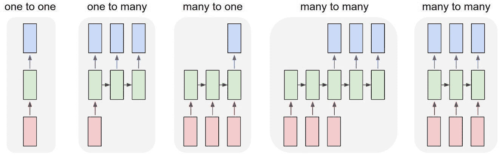
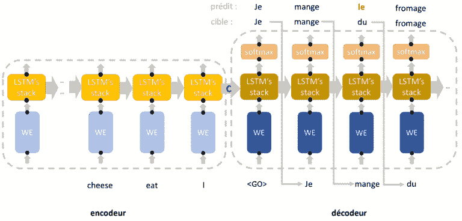
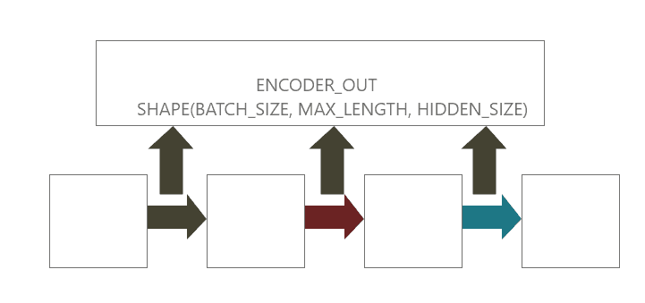
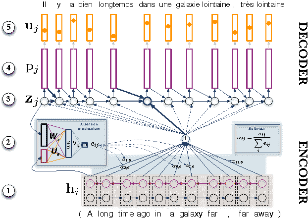
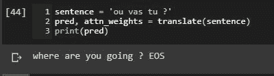
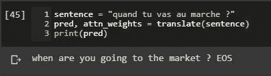
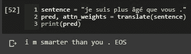
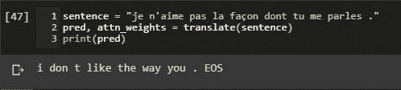

# 基于张量流的神经机器翻译

> 原文：<https://blog.paperspace.com/neural-machine-translation-with-tensorflow/>

如果你是谷歌翻译或其他翻译服务的粉丝，你是否想过这些程序如何能够像人类一样准确地将一种语言翻译成另一种语言。嗯，驱动这些超人翻译者的底层技术是**神经网络**，我们将建立一种特殊的类型，称为递归神经网络，使用谷歌的开源机器学习库 **TensorFlow 进行**法语到英语的**翻译。**

**注意:**本教程假设初级到中级水平的人对 python、神经网络、自然语言处理、TensorFlow 和 Jupyter notebook 有所了解。

本教程的大部分代码来自 TensorFlow 文档页面。

在开始构建我们的网络之前，让我们先来看看这篇文章的概述。

*   我们将从描述如何为任务加载和预处理数据集开始。
*   然后我们将继续解释什么是序列对序列模型，以及它在解决翻译问题中的重要性。
*   然后我们将描述什么是注意力机制以及它帮助解决的问题。
*   在这篇文章的结尾，我们将把我们讨论过的所有内容整合在一起，构建我们的翻译模型

让我们首先加载数据并为训练做好准备。

### 
数据加载和预处理阶段

就个人而言，为自然语言处理任务构建高效的数据输入管道是整个 NLP 任务中最繁琐的阶段之一。因为我们的任务是将一段文本从一种语言翻译成另一种语言，所以我们需要一个平行语料库结构的语料库。幸运的是，我们将要使用的数据集是以这种结构排列的。让我们下载数据集并检查它。(来源:manythings.org)。

```py
!wget https://www.manythings.org/anki/fra-eng.zip
!unzip  fra-eng.zip
```

上面的代码片段将下载我们的压缩数据集并解压缩。我们应该在工作区目录中获得两个文件:fra.txt，这是我们将要使用的主要文件，以及 _about.txt(不重要)。让我们看看我们的 fra.txt 文件是如何构造的。我们可以通过使用下面的代码片段来实现。

```py
with open("fra.txt",'r') as f:
        lines = f.readlines()
print(lines[0]) 
```

这段代码输出:

```py
output[]: 'Go.\tVa !\n'
```

我们只看了语料库的第一行。如图所示，它由一个英语单词、短语或句子和一个法语单词、短语或句子组成，用制表符分隔。\n '表示下一对英语和法语句子在新的一行。下一步，我们将为每种语言构建一个类，将语言中的每个单词映射到一个唯一的整数。这很重要，因为计算机只能理解数字，而不能理解字符串和字符。这个类将有三个字典数据结构，一个将每个单词映射到一个唯一的整数，一个将一个整数映射到一个单词，第三个将一个单词映射到它在语料库中的总数。这个类将有两个重要的功能，将语料库中的单词添加到他们的类词典中。让我们来看看如何做到这一点。

```py
class Lang(object):
    def __init__(self, name):
        self.name = name
        self.word2int = {} #maps words to integers
        self.word2count = {} #maps words to their total number in the corpus
        self.int2word = {0 : "SOS", 1 : "EOS"} #maps integers to tokens (just the opposite of word2int but has some initial values. EOS means End of Sentence and it's a token used to indicate the end of a sentence. Every sentence is going to have an EOS token. SOS means Start of Sentence and is used to indicate the start of a sentence.)
        self.n_words = 2 #Intial number of tokens (EOS and SOS)

    def addWord(self, word):
        if word not in self.word2int:
            self.word2int[word] = self.n_words
            self.word2count[word] = 1
            self.int2word[self.n_words] = word
            self.n_words += 1

        else:
            self.word2count[word] += 1

    def addSentence(self, sentence):
        for word in sentence.split(" "):
            self.addWord(word) 
```

在我们的类中，addWord 函数只是将一个单词作为键添加到 word2int 字典中，其值是相应的整数。int2word 字典的情况正好相反。请注意，当解析我们的语料库以填充类词典时，我们会跟踪我们遇到一个单词的次数，如果我们已经遇到了一个特定的单词，我们会停止将它添加到 word2int 和 int2word 词典中，而是使用 word2count 词典来跟踪它在我们的语料库中出现的次数。addSentence 所做的只是简单地遍历每个句子，对于每个句子，它将句子拆分成单词，并对每个句子中的每个单词实现 addWord 函数。

我们的语料库由法语单词组成，这些单词可能包含一些类似‘的字符。为了简单起见，我们将它们转换成正常的对应 ASCII 字符(C→C)。此外，我们还在单词和这些单词所附的标点符号之间创建空白。(hello's → hello s)。这是为了确保标点符号的出现不会为一个特定的单词创建两个单词(差整数将被分配给“它们是”并且它们是)。我们可以通过下面的代码片段实现这两个目标。

```py
def unicodeToAscii(s):
    return "".join(c for c in unicodedata.normalize("NFD", s) \
                   if unicodedata.category(c) != "Mn")
def normalizeString(s):
    s = unicodeToAscii(s.lower().strip())
    s = re.sub(r"([!.?])", r" \1", s)
    s = re.sub(r"[^a-zA-Z?.!]+", " ", s)
    return s
```

让我们结合这两个辅助函数来加载数据集，作为包含句子对的列表。

```py
def load_dataset():
    with open("/content/gdrive/My Drive/fra.txt",'r') as f:
        lines = f.readlines()

    pairs = [[normalizeString(pair) for pair in 
              line.strip().split('\t')] for line in lines]
    return pairs

pairs = load_dataset()
```

配对列表的一部分应该如下所示

```py
pairs[856:858]
out[]: [['of course !', 'pour sur .'], ['of course !', 'mais ouais !']]
```

为了减少我们演示的训练时间，我们将过滤掉数据集，删除超过十个单词的句子。我们可以使用下面的函数来实现这一点，该函数遍历我们的词对，并删除句子包含十个以上单词的词对。

```py
MAX_LENGTH = 10
def filterPair(p):
    return len(p[0].split()) < MAX_LENGTH and \
len(p[1].split()) < MAX_LENGTH

def filterPairs(pairs):
    return [pair for pair in pairs if filterPair(pair)]
```

我们的神经网络将在计算机上运行，而计算机只能理解数字，但我们的数据集是由字符串组成的。我们需要找到一种方法，将我们的字符串数据集转换成数字，如果你还记得的话，之前我们构建了一个语言类，它使用字典数据结构将单词映射成数字。让我们创建一个助手函数，它将把一个句子和对应于该句子的语言实例作为参数(例如，对于一个英语句子，我们使用英语语言实例)，并将该句子编码成计算机可以理解的数值。

```py
def sentencetoIndexes(sentence, lang):
    indexes = [lang.word2int[word] for word in sentence.split()]
    indexes.append(EOS_token)
"""
Iterates through a sentence, breaks it into words and maps the word to its corresponding integer value using the word2int dictionary which we implemented in the language class
"""
    return indexes 
```

下一步，我们将使用单词填充每个语言类中的 word2int 字典，并为新函数中的每个单词分配一个相应的整数。此外，由于我们将对数据集进行批处理，因此我们将对单词长度小于我们建议的最大长度的句子应用填充。让我们看看如何做到这一点。

```py
def build_lang(lang1, lang2, max_length=10):
    input_lang = Lang(lang1)
    output_lang = Lang(lang2)
    input_seq = []
    output_seq = []

    for pair in pairs:
"""Iterates through the list of pairs and for each pair, we implement the addSentence function on the English sentence using the English Languuage class. The same is done to the corresponding French sentence"""
        input_lang.addSentence(pair[1])
        output_lang.addSentence(pair[0])
    for pair in pairs:
"""
We convert each sentence in each pair into numerical values using the sentencetoIndexes function we implemented earlier.
"""
        input_seq.append(sentencetoIndexes(pair[1], input_lang))
        output_seq.append(sentencetoIndexes(pair[0], output_lang))
    return keras.preprocessing.sequence.pad_sequences(input_seq, maxlen=max_length, padding='post', truncating='post'), \
keras.preprocessing.sequence.pad_sequences(output_seq, padding='post', truncating='post'), input_lang, output_lang

input_tensor, output_tensor, input_lang, output_lang = build_lang('fr', 'eng')
```

让我们看看我们的构建函数返回了什么。

```py
print("input_tensor at index 10: {}".format(input_tensor[10]))
print("output_tensor at index 10: {}".format(output_tensor[10]))
print("corresponding integer value for 'nous' {}".format(input_lang.word2int['nous']))
print("corresponding integer value for 'she' {}".format(output_lang.word2int['she']))
```

```py
output: [] input_tensor at index 10: [10 18  3  1  0  0  0  0  0  0]
        output_tensor at index 10: [13  6  1  0  0  0  0  0  0  0]
        corresponding integer value for 'nous' 97
        corresponding integer value for 'she' 190
```

我们的数据现在已经准备好输入神经网络，但是为了加快我们的训练过程，我们必须将我们的数据集分批排序。TensorFlow 数据 API 为我们提供了执行这项任务的工具。

```py
BUFFER_SIZE = len(input_tensor)
dataset = tf.data.Dataset.from_tensor_slices((input_tensor, output_tensor)).shuffle(BUFFER_SIZE)
dataset = dataset.batch(16)
```

我们现在已经准备好构建我们的模型了。

### 序列到序列模型

递归神经网络有几种结构，每一种都适用于一组特定的任务。一些例子是用于情感分析等任务的多对一架构和用于音乐生成的一对多架构，但我们将采用多对多架构，该架构适用于聊天机器人等任务，当然还有神经机器翻译。



different rnn architectures

从上图可以看出，多对多架构有两种类型，但我们将使用第一种，它由两个网络组成:一个接收输入句子，另一个在机器翻译的情况下翻译成另一种语言。这种架构适合我们的任务，因为我们有不同长度的输入和输出。这种特殊的架构被称为**序列到序列模型**。对输入进行编码的网络称为编码器。另一个网络被称为解码器，因为它从编码器接收固定大小的向量来解码输出。这种架构背后的思想是伊利亚·苏茨基弗，奥里奥尔·维尼亚尔斯和阔克·v·勒。论文链接:【https://arxiv.org/pdf/1409.3215.pdfT2



您可能已经注意到了这种架构的一个缺点。如果你没有，这很酷。让我们继续讨论这个缺点。从上图中，我们可以观察到解码器从编码器接收到的唯一信息是图中所示的隐藏状态。这个隐藏状态是一个固定大小的向量，编码器将输入句子的每一位信息都压缩到这个向量中，并将其传递给解码器以生成输出句子。这对于较短的句子可能相当有效，但是对于较长的句子，这种固定大小的向量往往会成为瓶颈。这就是注意力机制成为我们翻译网络的关键部分的原因。

# 注意机制

同年晚些时候，当 Sutskever 和他的团队提出他们的序列到序列架构时，进行了一些努力来克服 Sutskever 模型中的瓶颈。一个引起许多人注意的重大突破是 Yoshua Bengio 和其他一些人在题为**神经机器翻译的论文中通过联合学习对齐和翻译所做的工作。**这种架构背后的基本思想是，每当解码器生成特定的输出字时，它都会考虑输入句子中所有字的信息，并确定输入句子中的哪些字与生成正确的输出字相关。在序列模型中，将特定时间步的数据信息传递到下一个时间步的常见方式是通过隐藏状态。这意味着在我们的模型中，特定时间步的每个隐藏状态都有关于该时间步的单词的一些信息。并非输入句子中的每个单词都需要在输出句子中生成特定的单词，这是有意义的。例如，当我们人类想要将法语句子“Je suis garcon”翻译成“我是一个男孩”时，显然当我们翻译单词“男孩”时，直觉上我们会比我们输入的法语句子中的任何其他单词更注意单词“garcon”。这正是序列对序列模型中注意机制的工作方式——我们的解码器在生成特定单词时会注意特定的单词或一组单词。你可能想知道我们的解码器网络是如何注意单词的。它使用连接或重量。与输入句子中某个特定单词的关联度或权重越大，我们的解码器就越关注这个单词。我们还应该知道，我们的权重应该是我们正在解码的时间步长之前的隐藏状态(这给解码器关于已经解码的字的信息)和编码器输出的函数，但是我们不知道该函数是什么，所以我们让反向传播接管学习适当的权重。我们还确保将输入句子中的所有单词映射到输出句子中的特定单词的所有权重加起来为 1。这通过 softmax 函数来置位。现在我们已经对注意力机制有了一些基本的概念，让我们继续实现我们的模型。我们从编码器开始。(不使用注意机制)。

### 编码器

编码器通常很容易实现。它由两层组成:嵌入层，将每个令牌(单词)转换为密集表示；递归网络层(为简单起见，我们将使用 Gate 递归单元网络)。

```py
class Encoder(keras.models.Model):
    def __init__(self, vocab_size, num_hidden=256, num_embedding=256, batch_size=16):
        super(Encoder, self).__init__()
        self.batch_size = batch_size
        self.num_hidden = num_hidden
        self.num_embedding = num_embedding
        self.embedding = keras.layers.Embedding(vocab_size, num_embedding)
        self.gru = keras.layers.GRU(num_hidden, return_sequences=True,
                                    recurrent_initializer='glorot_uniform',
                                   return_state=True)

    def call(self, x, hidden):
        embedded = self.embedding(x) #converts integer tokens into a dense representation
        rnn_out, hidden = self.gru(embedded, initial_state=hidden)
        return rnn_out, hidden
    def init_hidden(self):
        return tf.zeros(shape=(self.batch_size, self.num_hidden))
```

读者应该注意 GRU 实现中的两个非常重要的参数:return_sequences 和 return_state。return_sequences 确保 GRU 输出每个时间步的隐藏状态。请记住，我们需要这些信息来访问输入序列中每个单词的信息。返回状态返回最后一个时间步长的隐藏状态。我们需要这个张量作为解码器的初始隐藏状态。



在实现我们的网络的前向传播的呼叫功能中。我们首先将输入张量通过嵌入层，然后通过 GRU 层。这将返回形状(批量大小、最大序列长度、隐藏大小)的 RNN 输出(rnn_out)和形状的隐藏状态(批量大小、隐藏大小)。

**解码器**

与编码器不同，解码器有点复杂。除了嵌入和门控循环网络层之外，它还具有关注层和全连接层。我们先来看看如何实现关注层。

```py
class BahdanauAttention(keras.models.Model):
    def __init__(self, units):
        super(BahdanauAttention, self).__init__()

        self.W1 = keras.layers.Dense(units)
        self.W2 = keras.layers.Dense(units)
        self.V = keras.layers.Dense(1)

    def call(self, encoder_out, hidden):
        #shape of encoder_out : batch_size, seq_length, hidden_dim (16, 10, 1024)
        #shape of encoder_hidden : batch_size, hidden_dim (16, 1024)

        hidden = tf.expand_dims(hidden, axis=1) #out: (16, 1, 1024)

        score = self.V(tf.nn.tanh(self.W1(encoder_out) + \
                                  self.W2(hidden))) #out: (16, 10, 1)

        attn_weights = tf.nn.softmax(score, axis=1)

        context =  attn_weights * encoder_out #out: ((16,10,1) * (16,10,1024))=16, 10, 1024
        context = tf.reduce_sum(context, axis=1) #out: 16, 1024
        return context, attn_weights
```

实现起来似乎很简单，但是当数据在管道中移动时，您真的需要注意维度。发生前向传播的调用函数有两个参数；encoder_out 表示编码器中每个时间步的所有隐藏状态，hidden 表示当前时间步之前的隐藏状态，在当前时间步之前，我们生成正确的字。

由于 hidden 是解码器中时间步长的隐藏状态，我们添加了大小为 1 的维度来表示时间步长，因此 hidden 的形状变为(batch_size，time_step，hidden_size)。前面我提到过，确定特定单词注意力的权重是解码器中紧接该时间步长之前的 hidden_state 和编码器的所有 hidden _ state(encoder _ out)的函数。这正是我们在上面的代码中实现并分配给**分数**的内容。然后，我们应用 softmax 在轴=1 的 max_length 维度上进行评分。我们来看一个直观的解释。



从上图可以看出，hi 和 zj 分别代表编码器的所有隐藏状态和解码器中紧接时间步长之前的隐藏状态。softmax 函数的最终乘积给出了权重，我们将该权重与来自编码器的所有隐藏状态相乘。在特定时间步长上具有较大权重值的隐藏状态意味着在该时间步长上对单词给予了更多关注。您可能已经注意到，我们执行了一个 reduce_sum 来生成上下文向量。在将每个 hidden_state 乘以其相应的权重之后，我们通过求和来组合所有的结果值。注意力层到此为止。它返回上下文向量和注意力权重。

```py
class Decoder(keras.models.Model):
    def __init__(self, vocab_size, dec_dim=256, embedding_dim=256):
        super(Decoder, self).__init__()

        self.attn = BahdanauAttention(dec_dim)
        self.embedding = keras.layers.Embedding(vocab_size, embedding_dim)
        self.gru = keras.layers.GRU(dec_dim, recurrent_initializer='glorot_uniform',
                                   return_sequences=True, return_state=True)
        self.fc = keras.layers.Dense(vocab_size)

    def call(self, x, hidden, enc_out):
        #x.shape = (16, 1)
        #enc_out.shape = (16, 10, 256)
        #enc_hidden.shape = (16, 256)
        x = self.embedding(x)
        #x.shape = (16, 1, 256)
        context, attn_weights = self.attn(enc_out, hidden)
        #context.shape = (16, 256)
        x = tf.concat((tf.expand_dims(context, 1), x), -1)
        #x.shape = (16, 1, e_c_hidden_size + d_c_embedding_size)
        r_out, hidden = self.gru(x, initial_state=hidden)
        out = tf.reshape(r_out,shape=(-1, r_out.shape[2]))
        # out.shape = (16, 256)
        return self.fc(out), hidden, attn_weights
```

在调用函数中，我们传入三个参数，x 表示单个单词的张量，hidden 表示前一时间步的隐藏状态，enc_out 表示编码器的所有隐藏状态，我们将 x 通过嵌入层，该嵌入层将单个整数标记映射为密集的 256 维向量，并将其与关注层生成的上下文向量连接起来。对于单个时间步长，结果张量成为门控递归网络的输入。最后，我们将 GRU 的输出通过一个完全连接的层，该层输出一个大小为(batch_size，英语单词数)的向量。我们还返回隐藏状态，以供下一个时间步使用，并为以后的可视化返回注意力权重。我们的完整模型现在可以开始训练了。下一个议程是培训渠道。我们从损失函数开始。

```py
 def loss_fn(real, pred):
        criterion = keras.losses.SparseCategoricalCrossentropy(from_logits=True,
                                                               reduction='none')
        mask = tf.math.logical_not(tf.math.equal(real, 0))
        _loss = criterion(real, pred)
        mask = tf.cast(mask, dtype=_loss.dtype)
        _loss *= mask
        return tf.reduce_mean(_loss) 
```

我们使用 keras 的稀疏分类交叉熵模块，因为我们有大量的类别(英语单词的数量)。我们创建一个掩码，声明填充标记不包括在损失计算中。现在，让我们开始我们的培训课程。

```py
def train_step(input_tensor, target_tensor, enc_hidden):
    optimizer = tf.keras.optimizer.Adam()
    loss = 0.0
    with tf.GradientTape() as tape:

        batch_size = input_tensor.shape[0]
        enc_output, enc_hidden = encoder(input_tensor, enc_hidden)

        SOS_tensor = np.array([SOS_token])
        dec_input = tf.squeeze(tf.expand_dims([SOS_tensor]*batch_size, 1), -1)
        dec_hidden = enc_hidden

        for tx in range(target_tensor.shape[1]-1):
            dec_out, dec_hidden, _ = decoder(dec_input, dec_hidden,
                                            enc_output)
            loss += loss_fn(target_tensor[:, tx], dec_out)
            dec_input = tf.expand_dims(target_tensor[:, tx], 1)

    batch_loss = loss / target_tensor.shape[1]
    t_variables = encoder.trainable_variables + decoder.trainable_variables
    gradients = tape.gradient(loss, t_variables)
    optimizer.apply_gradients(zip(gradients, t_variables))
    return batch_loss
```

上面的代码片段实现了一个单独的训练步骤。在我们的单个训练步骤中，我们通过编码器的前向传播管道传递表示输入句子的输入张量。这将返回 enc_output(所有时间步长的隐藏状态)和 enc_hidden(最后一个隐藏状态)。注意，编码器的最后隐藏状态被用作解码器的初始隐藏状态。在解码部分，我们使用一种称为教师强制的技术，其中我们使用实际的单词，而不是使用预测的单词作为下一时间步的输入。在解码开始时，我们输入句子开始标记作为输入，并最大化解码器在输出时预测输出序列中第一个单词的概率。然后，我们将实际的第一个字送入第二个时间步长，并最大化解码器在输出序列中预测第二个字的概率。这连续地继续，直到我们到达句子结束标记`<eos>`。我们累积所有的损耗，导出梯度，并用梯度对两个网络进行端到端的训练。这就是完成一个训练步骤所需的全部内容。让我们实现一个助手函数，在训练过程中的某些时候保存我们的模型。

```py
def checkpoint(model, name=None):
    if name is not None:
        model.save_weights('/content/gdrive/My Drive/{}.h5'.format(name))
    else:
        raise NotImplementedError
```

我们培训管道的最后一部分是培训循环。这很容易理解。我们所做的就是运行一些历元，在每个历元，我们迭代我们的数据集，并在每批数据集上调用 train_step 函数。有一些 if-else 语句只是为了在屏幕上记录我们的训练统计数据。让我们看看怎么做。

```py
EPOCHS = 10
log_every = 50
steps_per_epoch = len(pairs) // BATCH_SIZE

for e in range(1, EPOCHS):

    total_loss = 0.0
    enc_hidden = encoder.init_hidden()

    for idx, (input_tensor, target_tensor) in enumerate(dataset.take(steps_per_epoch)):
        batch_loss = train_step(input_tensor, target_tensor, hidden)
        total_loss += batch_loss

        if idx % log_every == 0:
            print("Epochs: {} batch_loss: {:.4f}".format(e, batch_loss))
            checkpoint(encoder, 'encoder')
            checkpoint(decoder, 'decoder')

    if e % 2 == 0:
        print("Epochs: {}/{} total_loss: {:.4f}".format(
        e, EPOCHS, total_loss / steps_per_epoch))
```

运行这个片段训练我们的模型。如果您打算在本地计算机的 CPU 上训练模型，这可能需要一些时间。我建议你使用 Google Colab 或 Kaggle 内核，或者更好的 Paperspace Gradient 笔记本，它们具有支持 GPU 的环境，可以加快训练速度。我已经完成了训练，所以我将加载我的模型的重量，并向您展示我们建立的模型有多好。

```py
encoder.load_weights('/content/gdrive/My Drive/encoder.h5')
decoder.load_weights('/content/gdrive/My Drive/decoder.h5')
```

为了执行翻译，我们需要编写一个函数，就像我们在 train_step 函数中所做的那样，但是我们不是在特定的时间步长将实际的单词输入到下一个时间步长，而是输入由我们的网络预测的单词。这种算法被称为**贪婪搜索**。


让我们深入代码，看看发生了什么。

```py
def translate(sentence, max_length=10):
    result = ''
    attention_plot = np.zeros((10,10))
    sentence = normalizeString(sentence)
    sentence = sentencetoIndexes(sentence, input_lang)
    sentence = keras.preprocessing.sequence.pad_sequences([sentence],padding='post',
                                                      maxlen=max_length, truncating='post')

    encoder_hidden = hidden = [tf.zeros((1, 256))]

    enc_out, enc_hidden = encoder(sentence, encoder_hidden)

    dec_hidden = enc_hidden
    SOS_tensor = np.array([SOS_token])
    dec_input = tf.squeeze(tf.expand_dims([SOS_tensor], 1), -1)

    for tx in range(max_length):
        dec_out, dec_hidden, attn_weights = decoder(dec_input,
                                                   dec_hidden, enc_out)
        attn_weights = tf.reshape(attn_weights, (-1, ))
        attention_plot[tx] = attn_weights.numpy()
        pred = tf.argmax(dec_out, axis=1).numpy()
        result += output_lang.int2word[pred[0]] + " "
        if output_lang.int2word[pred[0]] == "EOS":
            break
        dec_input = tf.expand_dims(pred, axis=1)
    return result, attention_plot
```

我们的 translate 函数接受两个参数，句子和输入句子的最大长度。句子经过一个预处理阶段，在那里它被规范化，转换成整数值并被填充。预处理后的张量通过编码器生成 encoder_output 和 encoder_hidden，并传送给解码器。注意，在解码阶段，解码器首先接收句子开始的<sos>标记作为第一个输入单词或标记。在通过第一时间步连同编码器最后隐藏状态和用于注意机制的编码器的所有隐藏状态一起向前传播句子开始标记之后，输出概率分布，其中想要预测的单词在该分布中具有最高值。取这个分布的 argmax 只是返回预期单词(分布中的最大值)在分布中的整数位置。这个整数位置实际上是我们的语言类中 int2word 映射中单词的整数对应。我们使用 int2word 字典检索字符串单词，将它附加到一个字符串中，并将对应的整数反馈到下一个时间步，并重复该过程，直到我们遇到句子结束标记。我们还用每个时间步产生的注意力权重填充 attention_plot 数据容器。返回的最终字符串应该有我们输入的输入句子的翻译。让我们看一个演示！</sos> 



它很有魅力。我们也来看看网络做出的一些错误预测。诚然，我真的好不容易才搜索到网络做出错误预测的句子。



根据谷歌翻译的正确预测是:我比你大。



我不喜欢你跟我说话的方式。

让我们通过验证我们的注意力机制工作正常来结束这篇文章。我们将想象当在输出句子中生成一个单词时，网络对输入句子中的每个单词投入了多少注意力。

```py
 def plot_attention(attention, sentence, predicted_sentence):
        fig = plt.figure(figsize=(10,10))
        ax = fig.add_subplot(1, 1, 1)
        ax.matshow(attention, cmap='viridis')

        fontdict = {'fontsize': 14}

        ax.set_xticklabels([''] + sentence, fontdict=fontdict, rotation=90)
        ax.set_yticklabels([''] + predicted_sentence, fontdict=fontdict)

        ax.xaxis.set_major_locator(ticker.MultipleLocator(1))
        ax.yaxis.set_major_locator(ticker.MultipleLocator(1))

        plt.show() 
```


与注意力机制论文中展示的情节相比，这并不完美，但我们可以看到，它在一些词如“il”和“he”以及“eglise”和“church”方面做得相当不错。

### 后续步骤

这就是本教程的内容。下一步，我建议你使用更大的数据集，比如 WMT-17。这可以很容易地从 TensorFlow-datasets 框架中获得。另外，你在这里学到的知识可以扩展到其他领域，比如聊天机器人和图像字幕。不要停在这里。继续挖。

机器翻译和序列到序列模型的领域是研究团体非常关注的领域，因此不断开发新的模型。最近开发的最先进的模型之一是变压器网络，它也可以执行翻译任务，当然比我们刚刚构建的架构要好。我想你也应该去看看。

### Jupyter 笔记型电脑

[下载](https://s3.amazonaws.com/ps.public.resources/blog/machine_translation_tensorflow_orig.ipynb)

**确认**

非常感谢 TensorFlow 团队提供了一个关于所讨论主题的详细记录的网页。我真的受到了工作的启发。

**关于我**

我是一名本科生，目前在读电气电子工程。我也是一个深度学习爱好者和作家。我的工作主要集中在计算机视觉和自然语言处理上。我希望有一天能打入自动驾驶汽车领域。你可以在推特(@henryansah083)上关注:[https://twitter.com/henryansah083?s=09](https://twitter.com/henryansah083?s=09)LinkedIn:[https://www.linkedin.com/in/henry-ansah-6a8b84167/](https://www.linkedin.com/in/henry-ansah-6a8b84167/)。