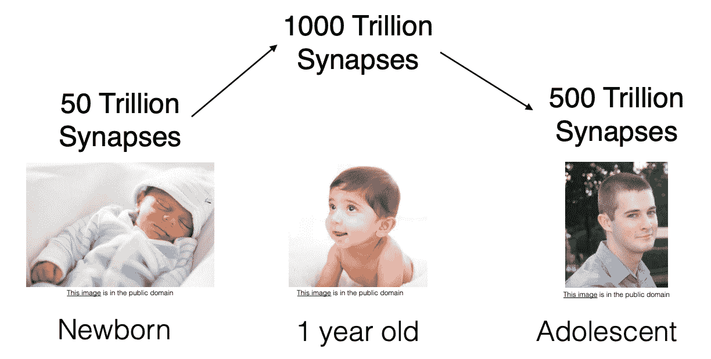
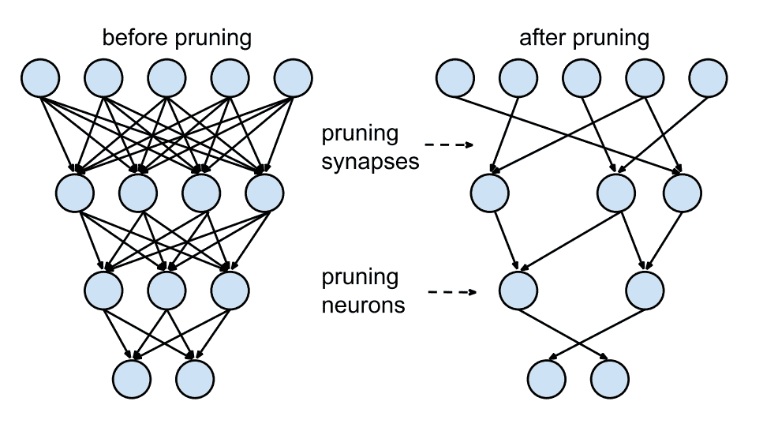
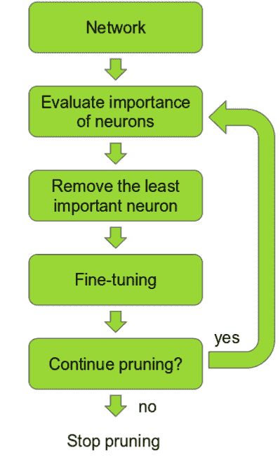
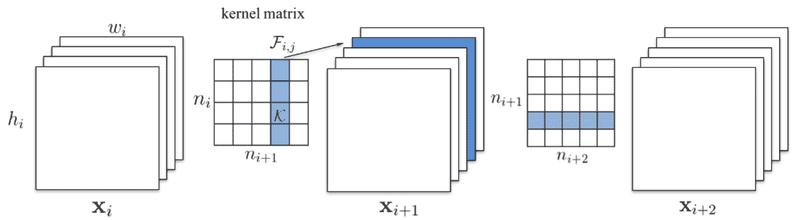
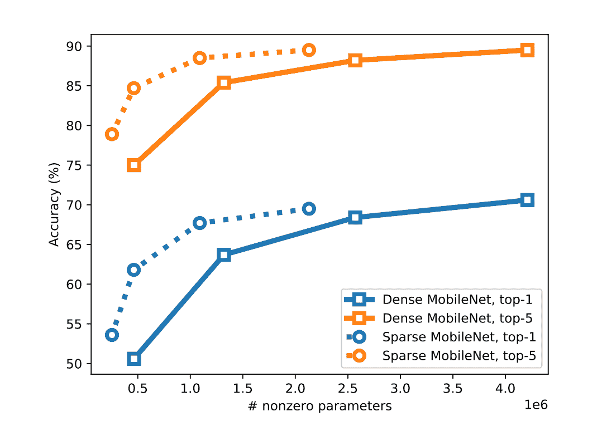
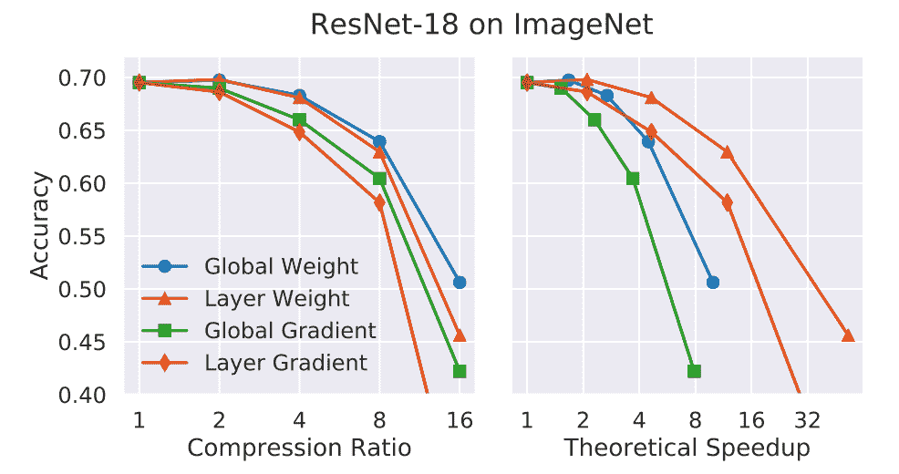

# 加速推理:神经网络剪枝解释

> 原文：<https://blog.paperspace.com/neural-network-pruning-explained/>

在过去的几年里，DNNs(深度神经网络)已经在计算机视觉和自然语言处理领域的几个具有挑战性的任务上取得了最先进的性能。在越来越多的数据和计算能力的驱动下，深度学习模型变得更加广泛和深入，以更好地从大量数据中学习。但是，将大型、精确的深度学习模型部署到资源受限或成本有限的计算环境中总是会带来几个关键挑战。

在本系列中，您将了解深度 CNN(卷积神经网络)模型对内存和处理优化的需求。然后，我们将详细介绍运行加速和内存优化深度学习模型推理的各种技术。我们还将讨论降低深度学习模型的推理成本所需的各种深度学习推理框架/库。我们将讨论 C++推理加速器框架和库的作用，以及它们的 Python APIs。

> 作为先决条件，本系列要求您具备 Python 和 CNN 的基础知识。

具体来说，我们将涵盖以下 topics:‌‌

1.  推论的需要 optimization‌
2.  推理优化技术:修剪
3.  修剪方法
4.  修剪训练好的神经网络

## 推理优化的需要

深度学习模型推理与模型训练一样重要，并且最终控制所实施的解决方案的性能指标。对于给定的应用程序，一旦深度学习模型训练有素，下一步将是确保它可以部署/生产，这需要应用程序和模型都高效可靠。

> 高效模型是在内存利用率和处理速度方面都进行了优化的模型。

在模型性能/准确性和推理时间/处理速度之间保持健康的平衡是非常重要的。推理时间决定了实现的解决方案的运行成本。有时，部署解决方案的环境/基础设施/系统也可能有内存限制，因此拥有内存优化和实时(或更短处理时间)模型非常重要。

随着需要实时处理的增强现实、面部识别、面部认证和语音助手的使用越来越多，开发人员正在寻找更新、更有效的方法来降低神经网络的计算成本。最流行的方法之一叫做修剪。

## prunning 解释说

虽然现代深度 CNN 由各种层类型组成，但是预测期间的运行时间由卷积层的评估所支配。为了加快推理速度，我们可以“修剪”特征地图，使生成的网络运行更有效。

修剪是一种流行的方法，用于通过删除冗余来将繁重的网络缩减为轻量级网络。简单地说，修剪是一种减小神经网络大小的方法。

### 修剪的生物灵感

神经网络中的修剪是从人类大脑中的[突触修剪](https://en.wikipedia.org/wiki/Synaptic_pruning) 中得到的想法，其中[轴突](https://en.wikipedia.org/wiki/Axon)和[树突](https://en.wikipedia.org/wiki/Dendrite)在许多[哺乳动物](https://en.wikipedia.org/wiki/Mammal)的幼儿期和青春期开始之间衰退和死亡，导致突触消除。修剪从出生时开始，一直持续到 25 岁左右。

Christopher A Walsh. Peter Huttenlocher (1931–2013). Nature, 502(7470):172–172, 2013.‌

### 神经网络中的修剪

修剪神经网络是一个古老的想法，可以追溯到 1990 年，Yann LeCun 的[“最佳脑损伤”](http://yann.lecun.com/exdb/publis/pdf/lecun-90b.pdf)论文。这个想法是，在网络的许多参数中，有些是多余的，对输出没有显著贡献。

LeCun et al. NIPS’89; Han et al. NIPS’15‌

神经网络一般看起来像左边的那个:下面一层中的每个神经元都与上面一层有连接，但这意味着我们必须将许多浮点相乘。理想情况下，我们只需将每个神经元连接到少数几个其他神经元上，省下一些乘法运算；这就是所谓的稀疏网络。

如果你可以根据神经元对输出的贡献大小对网络中的神经元进行排序，那么你就可以从网络中移除排序较低的神经元，从而形成一个更小的和更快的网络。

例如，可以根据神经元权重的 L1/L2 范数来进行排序。修剪后，准确率会下降(如果排名巧妙，希望不会下降太多)，所以通常会再次训练网络，以恢复一些准确率。如果我们一次修剪太多，网络可能会损坏太多，并且无法恢复。因此，在实践中，这是一个迭代过程——通常称为“迭代修剪”:修剪/训练/重复。

[Pruning Convolutional Neural Networks for Resource Efficient Inference](https://arxiv.org/abs/1611.06440)‌

第一步是确定哪些神经元重要，哪些(相对)不重要。在此之后，最不重要的神经元将被删除，然后对算法进行微调。此时，可以决定是继续修剪过程还是停止修剪过程。

> 最好从一个较大的网络开始，在训练后进行修剪，而不是一开始就训练一个较小的网络。

## 不同的修剪方法

修剪可以有多种形式，方法的选择取决于开发人员期望的输出类型。在某些情况下，速度是优先考虑的；在其他情况下，必须减少存储/内存。修剪方法的主要区别在于它们如何处理稀疏结构、评分、调度和微调。

例如，在 VGG16 中，90%的权重在全连接层中，但这些权重仅占全部浮点运算的 1%。直到最近，大多数工作都集中在针对全连接层的修剪上。通过修剪这些层，模型大小可以显著减小，但处理速度却不会。

**非结构化修剪**方法修剪单个参数。这样做产生了稀疏的神经网络，尽管在参数计数方面更小，但可能不会以有助于使用现代库和硬件来提高速度的方式来布置。这也被称为**权重修剪**，因为我们将权重矩阵中的各个权重设置为零。这相当于删除连接，如上图所示(Lecun 等人，NIPS'89，Han 等人，NIPS'15)。

这里，为了实现$k%$的稀疏性，我们根据权重矩阵$W$的大小对各个权重进行排序，然后将最小的$k%$设置为$0$。

**结构化修剪**方法按组考虑参数，移除整个神经元、过滤器或通道，以利用针对密集计算优化的硬件和软件。这也被称为**单元/神经元修剪**，因为我们将权重矩阵中的所有列设置为零，实际上删除了相应的输出神经元。

在[为高效卷积网](https://arxiv.org/abs/1608.08710)方法修剪滤波器中，他们提倡修剪整个卷积滤波器。修剪索引为$k$的过滤器会影响其所在的层和下一层(通过移除其输入)。

[Pruning Filters for Efficient ConvNets](https://arxiv.org/abs/1608.08710)‌

如果下一层是全连接的，并且该通道的特征图的大小将是$ M \乘以 N$,则从全连接层中移除$ M \乘以 N$个神经元。这项工作中的神经元排序相当简单。这是每个过滤器的权重的$L1$范数。在每次修剪迭代中，它们对所有过滤器进行排序，在所有层中全局地修剪$n$个排序最低的过滤器，重新训练，并重复。

> 修剪卷积层中的整个滤波器具有减少存储器的积极副作用。正如在[为资源高效推断修剪卷积神经网络](https://arxiv.org/abs/1611.06440)一文中所观察到的，层越深，修剪的就越多。这意味着最后一个卷积层将被修剪很多，并且它后面的全连接层的许多神经元也将被丢弃。

通过在广泛的神经网络架构(深度 CNN、堆叠 LSTM 和 seq2seq LSTM 模型)中比较具有相同内存占用的大型但经过修剪的模型(大型稀疏模型)和较小但密集的模型(小型密集模型)的准确性，我们发现大型稀疏模型始终优于小型密集模型，并实现了非零参数数量高达 10 倍的减少，而准确性损失最小。

[Sparse vs dense results for MobileNet](https://arxiv.org/abs/1710.01878)

### 得分

通常的做法是根据参数的绝对值、训练的重要性系数或对网络激活或梯度的贡献来对参数进行评分。一些修剪方法局部比较分数，在网络的每个结构子组件(例如层)内修剪分数最低的一部分参数。其他人从全局考虑分数，相互比较分数，而不考虑参数所在的网络部分。

在深度卷积神经网络的[结构化修剪工作中，排序要复杂得多。他们保留了一组$N$粒子过滤器，代表$N$卷积过滤器被修剪。当由粒子表示的过滤器没有被屏蔽时，基于验证集上的网络准确度为每个粒子分配分数。然后，基于新的分数，对新的剪枝掩码进行采样。由于运行这个过程的计算量很大，他们使用了一个小的验证集来测量粒子分数。](https://arxiv.org/abs/1512.08571)

在[中描述的用于资源有效推断的修剪卷积神经网络的方法](https://arxiv.org/abs/1611.06440)包括修剪每个滤波器，并观察当层改变时成本函数如何改变。这是一种强力方法，如果没有大量计算，它不是很有效。然而，排名方法是高效和直观的。它利用激活和梯度变量作为排名方法，提供了一个更清晰的模型视图。

### 行程安排

修剪方法在每一步要修剪的网络数量上有所不同。一些方法在单个步骤中一次修剪所有期望的权重。其他方法是在几个步骤中反复修剪网络的固定部分，或者根据更复杂的函数改变修剪的速率。

### 微调

对于涉及微调的方法，最常见的是使用修剪前训练的权重继续训练网络。备选方案包括将网络倒回至较早状态，并完全重新初始化网络。

在撰写本文时，最近的修剪方法之一是 SynFlow ( [通过迭代保存突触流](https://arxiv.org/abs/2006.05467)来修剪没有任何数据的神经网络)。 **SynFlow** 不需要任何数据来修剪网络，它使用*突触显著性分数*来确定参数的显著性。

## 评估修剪

修剪可以实现许多不同的目标，包括减少神经网络的存储足迹和推理的计算成本。这些目标中的每一个都倾向于不同的设计选择，并需要不同的评估指标。

例如，在减少网络的存储空间时，所有参数都可以同等对待，这意味着应该评估通过修剪实现的总体压缩率。然而，在降低推理的计算成本时，不同的参数可能会产生不同的影响。例如，在卷积层中，应用于空间较大输入的滤波器比应用于较小输入的滤波器与更多的计算相关联。

不管目标是什么，修剪都会在模型效率和质量之间进行权衡，修剪会增加前者，而(通常)会降低后者。这意味着修剪方法的最佳特征不在于它已经修剪的单个模型，而在于对应于**效率-质量**曲线上不同点的一系列模型。

Source: [What Is the State of Neural Network Pruning?](https://arxiv.org/pdf/2003.03033.pdf)

## 结论

随着越来越多的应用程序利用神经网络，轻量级算法是当务之急。剪枝是一种基本的方法，在 DL 中工作的人应该知道，并在他们的工具包中。在本文中，我们介绍了什么是修剪，它是如何工作的，不同的修剪方法，以及如何评估它们。

敬请关注涵盖如何优化神经网络性能的未来文章！