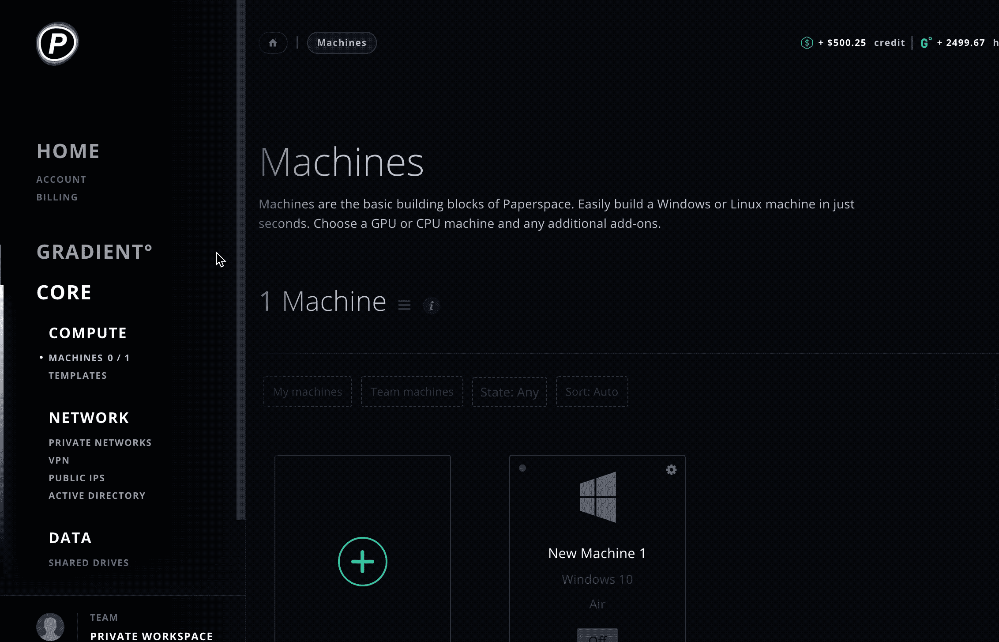
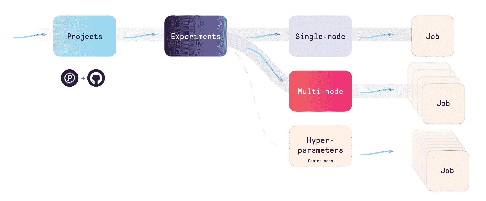

# 多节点/分布式培训，新的 GitHub 应用程序，等等！

> 原文：<https://blog.paperspace.com/new-projects-experiments-git-integration/>

[2021 年 12 月 2 日更新:本文包含关于梯度实验的信息。实验现已被弃用。有关当前梯度资源的更多信息，请参见[梯度文档](https://docs.paperspace.com/gradient/explore-train-deploy/workflows)

今天，我们很高兴地宣布整个梯度产品线的许多强大的新功能和改进。

首先，我们引入了对多节点/分布式机器学习模型训练的支持。

我们还对 GradientCI 进行了重大升级，这是我们为连接到 GitHub 的 Gradient 提供的突破性持续集成服务。

我们彻底改变了用户与 Gradient 的交互方式，引入项目和实验来轻松组织您的工作和协作。

## 梯度指数 2.0

<video autoplay="" loop="" class="" style="max-width: 100%; min-height: 410px;"><source type="video/mp4" src="//i.imgur.com/o6jNjcC.mp4">

我们非常兴奋能够发布我们最新的 GitHub 应用程序 GradientCI。几个月前，我们试运行了 GradientCI 的第一个版本，反响令人难以置信。

在这个版本中，您可以在 Gradient 中创建一个 GradientCI 项目，每当您将代码推送到 GitHub 上的机器学习存储库时，该项目将自动触发一个实验*。只需[安装最新的 GradientCI GitHub App](https://github.com/apps/gradientci) 并配置即可。直接在 web 控制台中轻松查看模型/主机性能指标。*

*这套强大的新工具旨在使机器学习管道过程更快、更确定，并且更容易集成到您现有的基于 Git 的工作流中。*

*下一步是什么？GradientCI 将很快直接向 GitHub 发送状态检查，您可以在您的 pull 请求中查看它们，其中包含有关您培训表现的丰富信息。*

*[https://github.com/apps/gradientci](https://github.com/apps/gradientci)*

## *项目和实验*

### *向项目问好*

*当您登录到您的控制台时，您将看到一个新的“项目”选项卡。*

**

*项目是在 Gradient 中组织所有机器学习开发的新方法。项目可以是独立的——通过我们的 GUI 或 CLI 手动运行——也可以通过 GradientCI 启用 GitHub。*

### *和...实验*

*项目是一个创造性的工作空间，允许您轻松地组织和管理渐变系列的最新成员:实验。*

*你可以在每个项目中运行任意数量的实验。实验可以采取多种形式，包括运行多个不同容器协同工作以产生结果的新可能性。**首先是对多节点训练的本地支持。***

*一开始，我们就支持单节点和多节点实验。单节点实验对应一个作业。多节点实验包括多个作业——分布式训练运行的每个节点一个作业。*

*正如你可能看到的，实验打开了超参数扫描的大门。在不久的将来，这些将会成为梯度。*

*

Projects and Experiments hierarchy* 

## *分布式模型训练*

*有了新的项目和实验模型，现在运行带有梯度的多节点训练任务变得非常容易。下面是一个示例项目:*

*[https://github.com/Paperspace/multinode-mnist](https://github.com/Paperspace/multinode-mnist)*

*Gradient 的原生分布式训练支持依赖于参数服务器模型，每个多节点实验将有一个或多个参数服务器和工作节点。多节点训练使得在比以往更大的数据上训练模型成为可能。*

## *一个现代化的统一人工智能平台*

*我们迫不及待地想让你开始体验所有这些强大的新功能和对 [Gradient](https://www.paperspace.com/gradient) 的改进。*

*我们产品的这一发展包括对我们广受欢迎的 GradientCI GitHub 应用程序的重大升级，一个新的项目和实验概念模型，以及多节点/分布式培训。我们比以往任何时候都更接近于为现代人工智能工作流提供一个统一的平台。*

*请告诉我们您的体验——我们喜欢听客户的意见！同时，[查看文档](https://docs.paperspace.com/gradient)了解更多信息，开始了解所有这些新功能和改进。并期待更多令人惊叹的新功能，即将推出！*