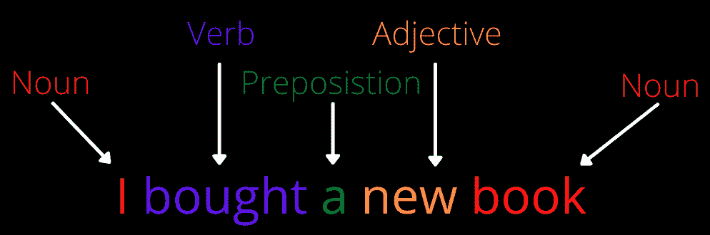
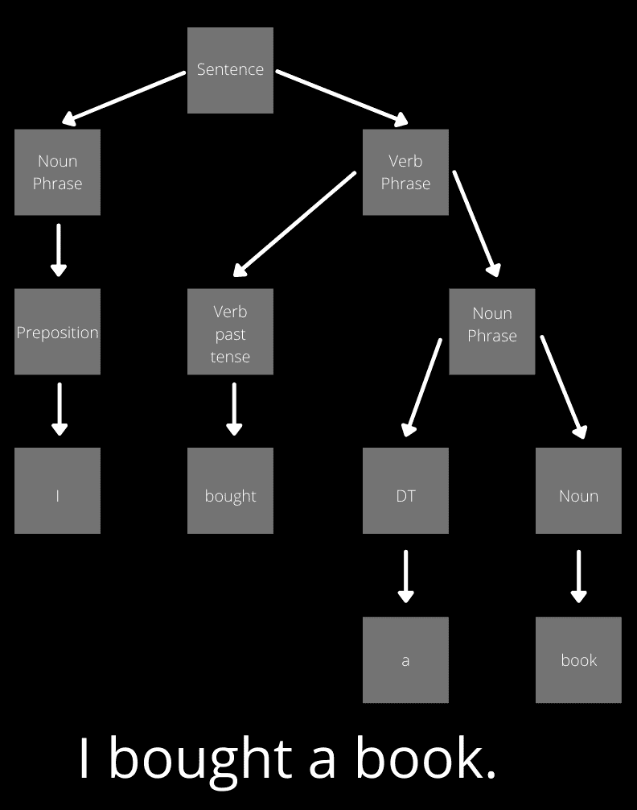
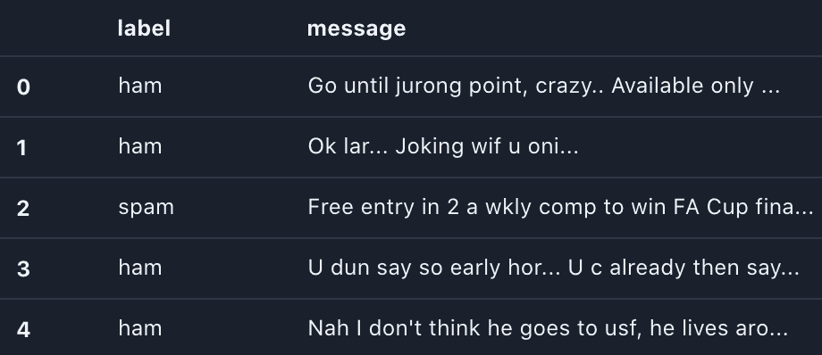
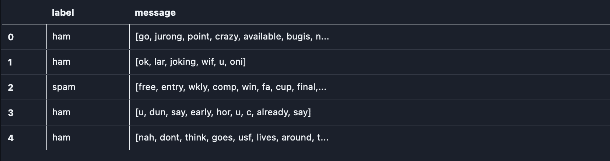
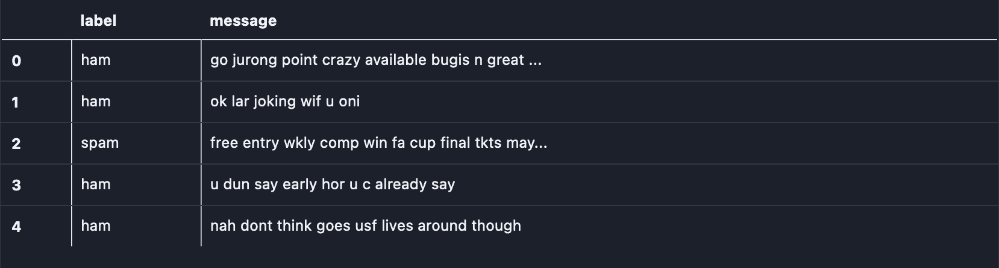
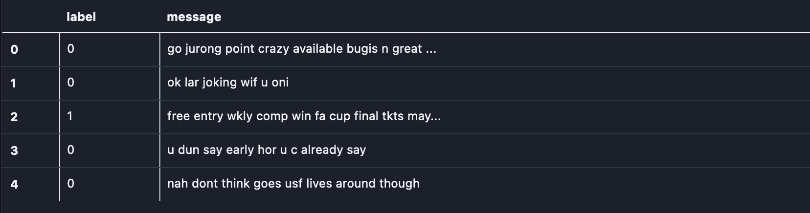

# 构建第一个检测垃圾邮件的 NLP 应用程序

> 原文：<https://blog.paperspace.com/nlp-spam-detection-application-with-scikitlearn-xgboost/>

> **“第一步”总是最难的。有两个可能的方面——不应该太复杂而阻碍进一步的探索，也不应该太容易不能理解抽象的复杂性。**

*自然语言处理(NLP)是一个广泛概念的集合。虽然选择一个起点很有挑战性，但在本教程中，我们将介绍构建一个简单的 NLP 应用程序所需的先决条件，稍后再继续构建一个。*

*以下是我们将要讨论的内容:*

*   *什么是自然语言处理？*
*   *两个基本分支——语法和语义*
*   *自然语言处理的应用*
*   *自然语言处理词汇*
*   *编写简单的 NLP 应用程序*

*事不宜迟，让我们开始吧！*

 *## 什么是自然语言处理？

人类理解宇宙的一种方式是通过语言。语言主要是口头的或书面的，尽管像手势这样的东西也被认为是语言。语言也可以通过一些次要的因素来表达，比如用词、语气、正式程度以及数以百万计的其他变量。

想象一下，作为一个人来分析多种语言的大量句子是多么具有挑战性。任务可行吗？你的理解会受到限制。很难在单词和概念之间建立联系——然而你仍然会对自己理解的程度感到惊讶。

如果我们有一台机器来执行处理自然语言的任务，会怎么样？未经训练，机器不具备运行此类任务的智能，但如果我们插入问题、所需信息和算法，我们可以让机器进行认知思考。

NLP，或者说自然语言处理，来了。NLP 的目标是让机器能够理解人类语言。NLP 包含像语音识别和自然语言理解这样的子领域，并且通常利用各种算法将人类语言转换成一系列句法或语义表示。

## 两个原始分支

NLP 主要依赖于两个基本的子任务:语法和语义。

### 句法

句法属于支配句子中词的排列的规则。在自然语言处理中，一组语法规则被用来控制文本的语法。

我们来考虑下面两句话:

1.  我正在读一本书。
2.  我在看书。

两个句子都有相同的单词，但任何说英语的人都清楚，第一个句子在语法上是正确的，而第二个却不是。我们知道这一点，因为我们已经明确或隐含地了解到第二种选择是糟糕的语法。

电脑没有这种语法知识。我们必须训练它学会区分。

这些是 NLP 用来区分句子的概念:



PoS tagging of a short phrase

**1。给每个单词标上适当的发音。**这个过程叫做**词性标注**。例如，在句子“我正在读一本书”中，“我”是代词，“am”和“阅读”是动词，“a”是限定词，“书”是名词。可能有这样的情况，一个单词在一个句子中有一个词性，而在另一个句子中有不同的词性；“我的手表停了”这句话中的“手表”是名词，而“露西看着他走了”这句话中的“手表”是动词。NLP 必须有智能将正确的位置与每个单词联系起来。



An example visualization of constituency parsing for the sentence "I bought a book." 

**2。把句子分成适当的语法成分。**这个过程被称为**选区解析**。例如，在句子“她喜欢打网球”中，“她”是名词短语(NP)，“喜欢打网球”是动词短语(VP)。选区分析有助于建立句子中短语之间的关系。


Dependency parsing of the sentence: “Anna likes to play soccer”

**3。在句子中的任意两个词之间建立依存关系。**这个过程叫做**依存解析**。与选区分析不同，依存分析建立单词之间的关系。例如，考虑句子“安娜喜欢踢足球。”上图显示了使用[分解的依赖解析器](https://explosion.ai/demos/displacy?text=Anna%20likes%20to%20play%20soccer&model=en_core_web_sm&cpu=1&cph=1)生成的依赖图。

相关术语:

*   `nsubj`是一个*名词性主语*，它是一个名词短语，是一个从句的句法主语。
*   `xcomp`是动词或形容词的*开放从句补语*，是没有自己主语的表语或从句补语。
*   `aux`是从句的*助词*，是从句的非主要动词。
*   `dobj`是动词短语的直接宾语。名词短语是动词的(宾格)宾语。

为了学习更多关于依赖关系的知识，我推荐你去看看斯坦福的 [*依赖手册*](http://downloads.cs.stanford.edu/nlp/software/dependencies_manual.pdf) *。*

根据手头的语言和文本，使用适当的语法解析技术。

### 语义学

语义是文本的意义。在自然语言处理中，语义分析是指从文本中提取和解释意义。


Two different semantic interpretations of the same sentence.

词汇语义学是语义分析中的一个重要概念。以下是词汇语义学研究中需要理解的一些关键要素:

1.  下位词:一个比一般意义更具体的词，例如黑色是颜色的下位词
2.  同音异义词:两个拼写或发音相同但意思不同的词，例如 right 是 left 的反义词，right 是 correct
3.  当事物的一部分用来指代整体时，例如，水上的船指的是水上的船
4.  一词多义:一个词有多种可能的含义，例如声音就是一词多义，有多种含义
5.  同义词:与另一个词意思相同的词，例如 bold 和 audacious 是同义词
6.  反义词:与另一个词意思相反的词，例如真和假是反义词

模糊地，这些被 NLP 用来检查文本的意义。此外，NLP 检查符号和搭配。语法和语义一起帮助 NLP 理解文本的复杂性。

## 自然语言处理的应用

NLP 的应用比比皆是。一些最受欢迎的包括:

*   语音识别
*   自动摘要
*   聊天机器人
*   问答模型
*   文本分类
*   情感分析
*   语言翻译员
*   搜索自动完成
*   文本自动更正

## 自然语言处理词汇

语言本身是复杂的，自然语言处理也是如此。它有一系列概念来处理语言的复杂性。

#### 文集

语料库是文本文档的集合。

#### 词典

词汇是一种语言的词汇。例如，在足球比赛中，“越位”、“凌空抽射”和“点球”都是这项运动词汇的一部分。

#### 标记化

标记化是将文本拆分成单词(或)标记的过程。例如，考虑句子“华盛顿特区是美国的首都”代币将会是*华盛顿*、*特区*、*是*、*是*、*首都*、*城市*、的*、*美国*、*美国*和*州*。*

如果我们不想分裂华盛顿和华盛顿特区呢？我们首先必须识别命名实体，然后对文本进行标记。(*参考*下面的 n-grams 部分)

因此，标记化不仅仅是使用空白分割文本。

### 从语法上分析

解析封装了语法和语义分析阶段。一般来说，解析是根据特定的议程将文本分解成各自的成分。例如，语法分析将文本分解成其语法成分，这可以基于词性、成分或依存性分析。语义解析是将自然语言话语转换成正式意义表示的任务。

解析通常会生成一个解析树，它提供了解析输出的可视化表示。

### 正常化

文本规范化是将文本转换为其标准形式。以下是它的两种变体:

##### 堵塞物

词干化是将单词缩减为词干，通常是通过去掉后缀。例如，考虑单词“填鸭式”。去掉后缀“med”，我们得到单词“cram”，就是**词干**。

> 词干分析是一种数据预处理技术，有助于简化理解文本的过程，有了它我们就不会有一个庞大的数据库！

词干提取过程中可能会出现两种错误:

*   **过词干:**两个词词干化为同一个词干(或词根)，实际上属于两个不同的词干。例如，考虑一下*环球、大学和宇宙* [ [ref](https://www.geeksforgeeks.org/introduction-to-stemming/) 。尽管这些词在自然语言中属于不同的领域，但它们都源于" *univers"* 。
*   **词干化不足:**当两个单词被词干化为不属于不同词干的不同词干(或词根)时。例如，考虑单词，*、数据和数据。*这些词分别源于*【数据】*和*【数据】*，虽然它们属于同一个领域。

词干提取算法的例子包括波特算法、洛文斯·斯特梅尔、道森·斯特梅尔等。

#### 词汇化

规范化的另一个变体叫做“词条化”，它指的是将一个单词映射到它的根词典形式，这被称为“词条”这看起来类似于词干法，然而，它使用不同的技术来推导引理。例如，单词“are，am，is”的引理是“be”(假定词性为动词)。

词汇化比词干化需要更多的资源，因为它需要更多关于文本结构的知识。

### 停止单词删除

停用词是常见的词，如冠词、代词和介词。去除过程排除了没有什么价值的不必要的单词，帮助我们更专注于需要我们注意的文本。

> 最棒的是，它减少了对大型数据库的依赖，减少了分析文本的时间，并有助于提高性能。

然而，这并不是每个算法都必须应用的强制 NLP 技术。在文本摘要、情感分析和语言翻译等应用中，删除停用词是不可取的，因为这会丢失必要的信息。

考虑一个去掉“like”这个词的场景。在情感分析这样的应用中，这种删除可能会抹去文本所散发出的积极性。

### 单词袋(蝴蝶结)

顾名思义，单词包统计单词在文本中的出现次数，不考虑单词的顺序和文档的结构。

例如，考虑以下两行文本:

```py
Your problems are similar to mine
Your idea seems to be similar to mine
```

首先，让我们列出所有出现的单词:

1.  你的
2.  问题
3.  是
4.  类似的
5.  到
6.  我的
7.  想法
8.  似乎
9.  是

BoW 创建向量(在我们的例子中，让我们考虑一个二进制向量)如下:

1.  你的问题和我的相似-`[1, 1, 1, 1, 1, 1, 0, 0, 0]`
2.  你的想法似乎和我的相似—`[1, 0, 0, 1, 1, 1, 1, 1, 1]`

可以推断，单词的排序被丢弃。此外，它不能扩展到更大的词汇表。这可以通过使用 *n-grams* 和*单词嵌入(参考以下章节)*来解决。

单词包方法可能会产生一个问题，其中停用单词比信息单词被分配更高的频率。术语频率-逆文档频率(TF-IDF)有助于根据单词在文本中出现的频率来重新调整单词的频率，以便停用词可以受到惩罚。TF-IDF 技术奖励频繁出现的单词，但是惩罚在几个文本中过于频繁出现的单词。

单词包方法(有或没有 TF-IDF)可能不是理解文本含义的最佳方法，但是它在文本分类这样的应用中是有帮助的。

### N-Grams

一个 n-gram 是由 *n* 个单词组成的序列。考虑句子“n-gram 是 n 个项目的连续序列。”如果 *n* 被设置为 2(所谓的二元模型)，则 n 元模型将是:

*   n-gram 是
*   是一个
*   连续的
*   连续序列
*   序列
*   n 的
*   n 个项目

n 元语法用于自动完成句子、文本摘要、自动拼写检查等。

> N-grams 可能比 BoW 更能提供信息，因为它们捕获了每个单词周围的上下文(这取决于 n 的值)。

### 单词嵌入

单词嵌入有助于将单个单词表示为低维空间中的实值向量。简而言之，将文本转换成数字数据(向量)有助于 NLP 模型的分析。

***低头 vs .单词嵌入***

与 BoW 不同，单词嵌入使用预定义的向量空间来映射单词，而不考虑语料库的大小。单词嵌入可以确定文本中单词之间的语义关系，而 BoW 不能。

一般来说，在以下情况下，鞠躬很有用:

*   您的数据集很小
*   语言是特定于领域的

现成的单词嵌入模型的例子包括 Word2Vec、GloVe 和 fastText。

### 命名实体识别(NER)

NER 将信息词(所谓的“命名实体”)分为不同的类别:地点、时间、人物等。NER 的一些著名应用包括搜索和推荐引擎、用户投诉和请求分类、文本分类等。

您可以使用 **spaCy** 或 **NLTK** 在您的语料库上执行 NER。

## 编写简单的 NLP 应用程序

在这个例子中，我们将通过首先使用单词袋(BoW)方法预处理包括垃圾和非垃圾消息的文本语料库来检测垃圾消息。稍后，我们将使用 XGBoost 模型对已处理的消息训练一个模型。

这是一个逐步的过程，引导您完成数据预处理和建模过程。

### 步骤 1:导入库

首先，让我们安装并导入必要的库。

```py
# You may need to install libraries
! pip install pandas
! pip install nltk
! pip install scikit-learn

# Import libraries
import string
import nltk
import pandas as pd
from nltk.corpus import stopwords
from sklearn import metrics
from sklearn.feature_extraction.text import CountVectorizer
from sklearn.model_selection import train_test_split
```

(自然语言工具包)是帮助我们处理数据的主要软件包。

`scikit-learn`有助于建立、训练和测试模型的功效。

### 步骤 2:预处理数据集

预处理是清理数据的过程。首先，我们获取数据并理解其结构。正如您在下面看到的，我们每条消息的文本保存在 v2 列中，分类目标保存在 v1 列中。如果一个文本是垃圾邮件，它在 v1 中被标记为“垃圾邮件”，如果不是，它被标记为“火腿”。

```py
# Read the dataset
messages = pd.read_csv(
    "spam.csv", encoding="latin-1",
    index_col=[0]
)
messages.head()
```



The first five rows of our dataset

接下来，我们定义一个`text_preprocess`方法来删除标点符号、停用词和非字母。

```py
def text_preprocess(message):
    # Remove punctuations
    nopunc = [char for char in message if char not in string.punctuation]

    # Join the characters again
    nopunc = "".join(nopunc)
    nopunc = nopunc.lower()

    # Remove any stopwords and non-alphabetic characters
    nostop = [
        word
        for word in nopunc.split()
        if word.lower() not in stopwords.words("english") and word.isalpha()
    ]

    return nostop
```

让我们看看有多少垃圾邮件和非垃圾邮件构成了我们的数据集。

```py
spam_messages = messages[messages["label"] == "spam"]["message"]
ham_messages = messages[messages["label"] == "ham"]["message"]
print(f"Number of spam messages: {len(spam_messages)}")
print(f"Number of ham messages: {len(ham_messages)}")
```

```py
# Output
Number of spam messages: 747
Number of ham messages: 4825 
```

接下来，我们检查在垃圾邮件和垃圾邮件中重复次数最多的前十个单词。

```py
# Download stopwords
nltk.download('stopwords')

# Words in spam messages
spam_words = []
for each_message in spam_messages:
    spam_words += text_preprocess(each_message)

print(f"Top 10 spam words are:\n {pd.Series(spam_words).value_counts().head(10)}")
```

```py
# Output
Top 10 spam words are:
call      347
free      216
txt       150
u         147
ur        144
mobile    123
text      120
claim     113
stop      113
reply     101
dtype: int64
```

```py
# Words in ham messages
ham_words = []
for each_message in ham_messages:
    ham_words += text_preprocess(each_message)

print(f"Top 10 ham words are:\n {pd.Series(ham_words).value_counts().head(10)}")
```

```py
# Output
Top 10 ham words are:
u       972
im      449
get     303
ltgt    276
ok      272
dont    257
go      247
ur      240
ill     236
know    232
dtype: int64
```

我们的建模不需要这些信息；然而，执行探索性数据分析来帮助我们的模型是至关重要的。

关键的一步来了:我们传递信息。

```py
# Remove punctuations/stopwords from all messages
messages["message"] = messages["message"].apply(text_preprocess)
messages.head()
```



产生的输出将是一个令牌列表。模型可以理解一个字符串，而不是一列标记。因此，我们将令牌列表转换为一个字符串。

```py
# Convert messages (as lists of string tokens) to strings
messages["message"] = messages["message"].agg(lambda x: " ".join(map(str, x)))
messages.head()
```



### 第三步:单词袋方法

`scikit-learn`库中的`CountVectorizer()`类在定义 BoW 方法时非常有用。我们首先通过消息的矢量器`fit`来获取整个词汇表。

```py
# Initialize count vectorizer
vectorizer = CountVectorizer()
bow_transformer = vectorizer.fit(messages["message"])

# Fetch the vocabulary set
print(f"20 BOW Features: {vectorizer.get_feature_names()[20:40]}")
print(f"Total number of vocab words: {len(vectorizer.vocabulary_)}")
```

```py
# Output
20 BOW Features: ['absence', 'absolutely', 'abstract', 'abt', 'abta', 'aburo', 'abuse', 'abusers', 'ac', 'academic', 'acc', 'accent', 'accenture', 'accept', 'access', 'accessible', 'accidant', 'accident', 'accidentally', 'accommodation']
Total number of vocab words: 8084 
```

可以推断，我们获取的文本语料库中大约有`8084`个单词。

我们将`string`消息转换成数字`vectors`以简化模型建立和训练过程。

```py
# Convert strings to vectors using BoW
messages_bow = bow_transformer.transform(messages["message"])

# Print the shape of the sparse matrix and count the number of non-zero occurrences
print(f"Shape of sparse matrix: {messages_bow.shape}")
print(f"Amount of non-zero occurrences: {messages_bow.nnz}")
```

```py
# Output
Shape of sparse matrix: (5572, 8084)
Amount of non-zero occurrences: 44211 
```

BoW 构建了一个稀疏矩阵，将每个单词的出现映射到语料库词汇表。因此，这种方法导致构建稀疏矩阵，或主要由零组成的矩阵。这种格式允许将文本转换成模型可以利用的可解释的语言信息编码。

### 步骤 4:TF-IDF 方法

在*单词包(BoW)* 部分，我们学习了 BoW 的技术如何在与 TF-IDF 结合时得到增强。这里，我们通过 TF-IDF 运行我们的弓形向量。

```py
# TF-IDF
from sklearn.feature_extraction.text import TfidfTransformer

tfidf_transformer = TfidfTransformer().fit(messages_bow)

# Transform entire BoW into tf-idf corpus
messages_tfidf = tfidf_transformer.transform(messages_bow)
print(messages_tfidf.shape)
```

```py
# Output
(5572, 8084) 
```

### 步骤 5:构建 XGBoost 模型

XGBoost 是一种梯度推进技术，可以进行回归和分类。在这种情况下，我们将使用一个`XGBClassifier`来将我们的文本分类为“火腿”或“垃圾邮件”。

首先，我们将“spam”和“ham”标签转换为 0 和 1(反之亦然)，因为 XGBoost 只接受数字。

```py
# Convert spam and ham labels to 0 and 1 (or, vice-versa)
FactorResult = pd.factorize(messages["label"])
messages["label"] = FactorResult[0]
messages.head()
```



接下来，我们将数据拆分为训练和测试数据集。

```py
# Split the dataset to train and test sets
msg_train, msg_test, label_train, label_test = train_test_split(
    messages_tfidf, messages["label"], test_size=0.2
)

print(f"train dataset features size: {msg_train.shape}")
print(f"train dataset label size: {label_train.shape}")

print(f"test dataset features size: {msg_test.shape}")
print(f"test dataset label size: {label_test.shape}")
```

```py
# Output
train dataset features size: (4457, 8084)
train dataset label size: (4457,)
test dataset features size: (1115, 8084)
test dataset label size: (1115,)
```

为了训练模型，我们首先安装 XGBoost 库。

```py
# Install xgboost library
! pip install xgboost 
```

我们训练分类器。

```py
# Train an xgboost classifier
from xgboost import XGBClassifier

# Instantiate our model
clf = XGBClassifier()

# Fit the model to the training data
clf.fit(msg_train, label_train)
```

接下来，我们对训练数据集进行预测。

```py
# Make predictions
predict_train = clf.predict(msg_train)

print(
    f"Accuracy of Train dataset: {metrics.accuracy_score(label_train, predict_train):0.3f}"
)
```

```py
# Output
Accuracy of Train dataset: 0.989 
```

为了了解我们的模型进展的本质，让我们做一个预测的例子。

```py
# an example prediction
print(
    "predicted:",
    clf.predict(
        tfidf_transformer.transform(bow_transformer.transform([messages["message"][9]]))
    )[0],
)
print("expected:", messages["label"][9]) 
```

```py
# Output
predicted: 1
expected: 1 
```

是的，成功了！

最后，我们在测试数据上发现了模型的整体准确性。

```py
# print the overall accuracy of the model
label_predictions = clf.predict(msg_test)
print(f"Accuracy of the model: {metrics.accuracy_score(label_test, label_predictions):0.3f}")
```

```py
# Output
Accuracy of the model: 0.975 
```

## 结论

你已经向更大的世界迈出了第一步！由于处理大量自然语言数据的便利性，NLP 是一个突出的主题，多年来变得越来越重要。你现在已经准备好处理更深奥的 NLP 概念了。

我希望你喜欢阅读这篇文章！

### 参考

1.  [https://www . ka ggle . com/dkta laicha/SMS-spam-detection-with-NLP](https://www.kaggle.com/dktalaicha/sms-spam-detection-with-nlp)
2.  [https://towards data science . com/your-guide-to-natural language-processing-NLP-48ea 2511 F6 e 1](https://towardsdatascience.com/your-guide-to-natural-language-processing-nlp-48ea2511f6e1)
3.  [https://monkeylearn.com/blog/semantic-analysis/](https://monkeylearn.com/blog/semantic-analysis/)*