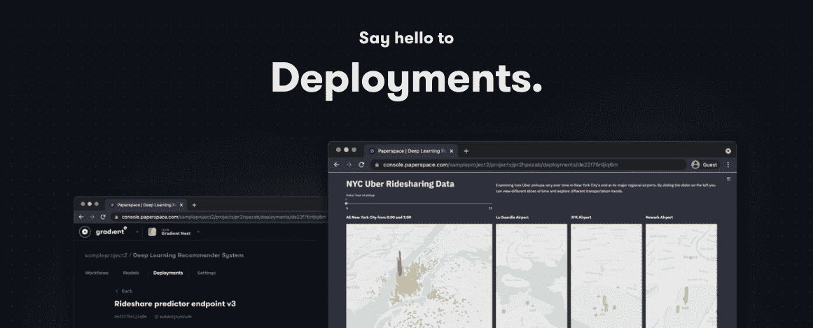
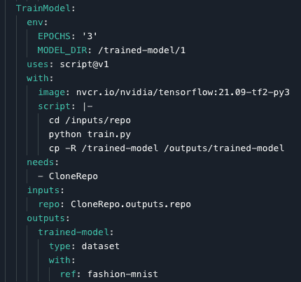
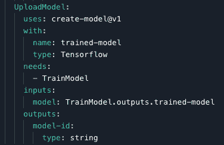
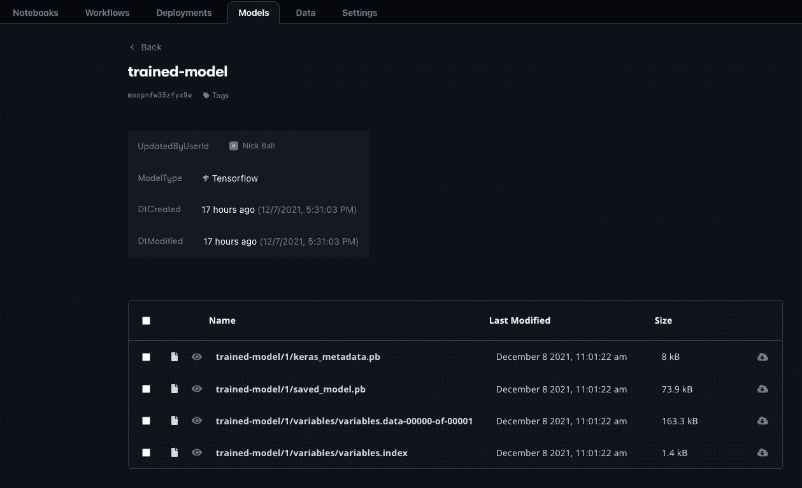
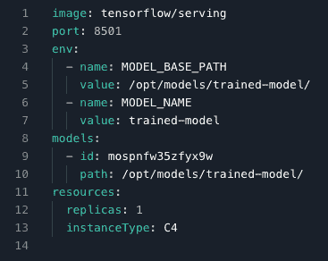
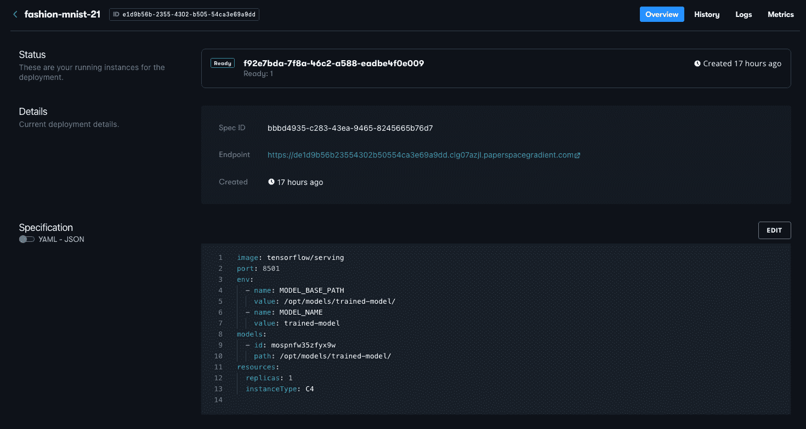

# 使用渐变创建模型并将其部署到生产环境中

> 原文：<https://blog.paperspace.com/notebooks-workflows-and-now-deployments/>

[https://www.youtube.com/embed/2eibSE7R6Vs?feature=oembed](https://www.youtube.com/embed/2eibSE7R6Vs?feature=oembed)

Video Guide to accompany this article. 

机器学习模型可以在数据上产生很好的结果，但要在研究环境之外显示它们的全部价值，它们需要部署到生产中。

在 Gradient 中，使用内置于[部署](https://gradient.run/deployments)资源中的功能，很容易将我们的模型作为 API 端点投入生产。在本文中，我们将介绍在 Gradient 上部署的基础知识，并展示在 Gradient 中创建的*模型可以通过以下方式在 Gradient 中部署:*

*   使用工作流创建和训练 TensorFlow 深度学习模型
*   使用部署来部署模型
*   向模型发送推理数据并接收正确的输出

这为我们提供了一个完全指定的设置，可重复并可用于生产，结合了 Gradient 的其他功能，如 GitHub 集成和对 GPU 的轻松访问。

我们还可以从 Gradient 外部引入我们自己的模型，并在部署中使用它们。

## 部署资源



模型部署是经过训练的模型的实例，它可以接收新数据(称为推断数据)，并发回适当的响应(如预测)。例如，向模型发送一幅图像，模型返回该图像的正确分类。

在现代生产环境中，模型通常被部署为一个微服务，运行在 Docker 等容器中，运行在一个编排了容器的系统上，比如 Kubernetes。模型的位置在一个端点上，与它通信的方法是通过一个 API，通常是 REST 或 gRPC。

设置整个堆栈以正确工作来提供价值通常是大量的工作，需要大量的工具和概念知识，包括软件工程和数据科学。通过提供现有的硬件和软件基础设施，Gradient 大大减轻了生产负担。

我们实现了上面描述的现代微服务/Docker/Kubernetes 结构，并提供了与我们的工作流的集成，以便作为用户，我们可以将部署简化为简单地说明我们想要部署什么模型。如果模型来自我们的工作流之外，我们也可以指定我们自己的容器。

模型可以来自 TensorFlow 等著名的机器学习(ML)框架，也可以来自 ONNX 等通用框架。

## 工作流部署推理示例

对于我们的示例，我们将执行这 3 个步骤:

1.  使用 TensorFlow 2.6 在时尚-MNIST 数据集上训练一个小型深度学习模型。
2.  使用 TensorFlow TFServing Docker 容器部署这个模型
3.  向模型发送推理数据并检查模型的预测

### 步骤 1:使用工作流训练模型

我们在这里的目的是演示工作流和部署在广泛使用的 ML 库的渐变上端到端地工作，因此我们在一个众所周知的数据集上构建一个简单的模型，而不是任何大型或复杂的模型。代码与 TensorFlow 的[基本分类](https://www.tensorflow.org/tutorials/keras/classification)教程非常相似，但是我们分别使用工作流和部署来训练和部署模型。

步骤 1 的工作流从我们的`gradient-ai`空间克隆 GitHub 存储库，用指定的简单超参数训练模型，并将其输出为版本化梯度数据集。培训在我们的 TensorFlow Docker 容器上运行。

工作流的培训部分如下所示:



Model training using Gradient Workflow

我们可以看到，使用我们存储库中的`train.py`脚本，模型被训练了 3 个时期(其他超参数是默认的)，然后在我们的 TensorFlow 容器上运行，并输出到数据集`trained-model`。

工作流的模型上传部分如下所示:



Model upload using Gradient Workflow

我们生成一个唯一的模型 ID，并使用[渐变动作](https://docs.paperspace.com/gradient/explore-train-deploy/workflows/gradient-actions) `create-model@v1`，这是我们将模型与工作流集成的一部分。结果是模型被放置在我们的模型注册表中，我们可以在渐变中看到它:



Trained model in Gradient

我们可以看到它里面的文件，它的版本(`1`)，它唯一的 ID，那个渐变把它识别为一个张量流模型。我们也可以将自己的模型上传到模型注册中心。

要查看完整的工作流程，以及它调用来进行模型训练的`train.py`脚本，请参见这个项目的 [GitHub 库](https://github.com/gradient-ai/Deployments-Create-Deploy-Infer)。

### 步骤 2:使用部署来部署模型

在 Gradient GUI 中，部署位于同名的选项卡下，这可以在上面的训练模型截图中看到。现在，为这个模型创建部署的最好方法是在[命令行界面](https://docs.paperspace.com/gradient/get-started/quick-start/install-the-cli)中使用`gradient`:

```py
gradient deployments create \
  --name fashion-mnist \
  --projectId pqrstuvwx \
  --spec fashion-mnist-deployment-spec.yaml 
```

为了创建我们的 API 端点，我们使用带有子命令`create`的`deployments`命令，给模型一个名字`fashion-mnist`，指定项目 ID `pqrstuvwx`(你的会不同)，以及模型规范`fashion-mnist-deployment-spec.yaml`的 [YAML](https://en.wikipedia.org/wiki/YAML) 文件。

YAML 文件的工作方式与工作流非常相似，实际上工作流是自动生成的，并用于启动部署。YAML 看起来是这样的:



Model deployment specification

模型规范的使用反映了这样一个事实，我们可以有许多不同的模型(规范)，并且反过来可能有许多这些部署(运行)的实例。

我们使用最新的 tensor flow TF serving Docker image`tensorflow/serving`，端口 8501 上的 REST API(gRPC 也可用，通常在端口 8500 上)，模型的唯一 ID，它在容器中的位置，单个副本，以及我们的 C4 CPU 实例类型作为硬件。

对于环境变量和路径，我们有

*   前一部分的模型训练工作流输出到`data/$MODEL_DIR` = `data/my-trained-model/1/`
*   在 Paperspace 部署中，我们将注册的模型放在`path` = `/opt/models/trained-model/`中
*   TFServing 通过它的`MODEL_BASE_PATH` = `/opt/models/trained-model/`知道这是哪里
*   这个特定模型的位置是`MODEL_NAME` = `trained-model/`，它会自动寻找子目录`1/, 2/`等。所以它在这里寻找`$MODEL_BASE_PATH/$MODEL_NAME/1/saved_model.pb`下的`saved_model.pb`。

这看起来有点复杂，但它允许更大和更强大的生产设置有许多模型，以及其他必要的，如预处理和后处理。

在 GUI 中，部署如下所示:



Model deployment detail

在这里，我们可以看到部署指标等其他信息也是可用的。目前，这些是系统指标；即将推出针对性能和漂移的全模型监控。

### 步骤 3:向模型发送推理数据

一旦将模型部署到端点，就可以向它发送推理数据。这可以通过几种不同的方式来实现，包括使用命令行、笔记本 SDK 或工作流。

这里我们使用一个工作流，以便很容易以正确的形式发送数据，时尚-MNIST 图像，并查看模型的正确响应。推理数据被加载，随后是将它们发送到 5 个图像的模型的行:

```py
data = json.dumps({"signature_name": "serving_default", "instances": test_images[0:5].tolist()})
headers = {"content-type": "application/json"}
json_response = requests.post(SERVE_URL, data=data, headers=headers)
predictions = json.loads(json_response.text)['predictions'] 
```

我们通过 POST 使用 REST API，但是 gRPC 也可以以同样的方式使用，只需根据需要修改代码行。

对于此处的数据，存在已知的基本事实标签，因此我们可以将模型的预测与真实类进行比较，以查看它们是否正确:

```py
# Script
for i in range(0,5):
  print('\nThe model predicted this as a {}, and it was actually a {}'.format(class_names[np.argmax(predictions[i])], class_names[test_labels[i]]))

# Output
The model predicted this as a Ankle boot, and it was actually a Ankle boot
The model predicted this as a Pullover, and it was actually a Pullover
The model predicted this as a Trouser, and it was actually a Trouser
The model predicted this as a Trouser, and it was actually a Trouser
The model predicted this as a Shirt, and it was actually a Shirt 
```

时尚 MNIST 很容易获得高精度，所以即使我们的小模型预测也是正确的，正如预期的那样。

除了在我们的日志中查看之外，以这种方式部署在端点上的模型的输出通常是可访问的，因此它既可以在更大的规模上使用，也可以根据需要定向到我们生产设置的下一个阶段。这可能是后处理、模型监控、对输出采取行动、应用程序或其他东西。

## 结论

我们已经证明在梯度中我们可以

*   使用 TensorFlow 2.6 在时尚-MNIST 数据集上训练一个小型深度学习模型。
*   使用 TensorFlow TFServing Docker 容器部署这个模型
*   向模型发送推理数据并接收正确的结果

**注** : 我们*在这篇博文中没有*做的事情，就是搭建任何基础设施！运行我们的工作流、将我们的部署放在一个端点上、发送推断数据以及编排一切所必需的设置都已经就绪。

## 后续步骤

我们计划在未来的帖子中展示更多的梯度部署功能，比如 canary 部署、模型度量，以及通过梯度项目和 GitHub 库之间的集成来触发模型重新部署。

现在您已经阅读了这篇博客，您可以:

*   通过该项目的 [GitHub 库](https://github.com/gradient-ai/Deployments-Create-Deploy-Infer)亲自尝试部署
*   参见我们的[文档](https://docs.paperspace.com/gradient/)
*   创建并运行您自己的部署

下次见！