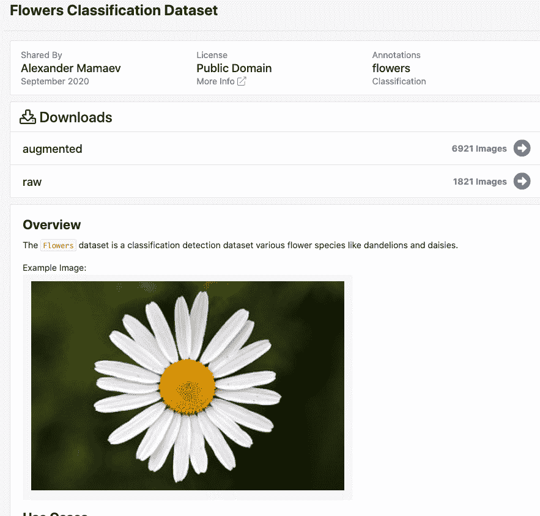
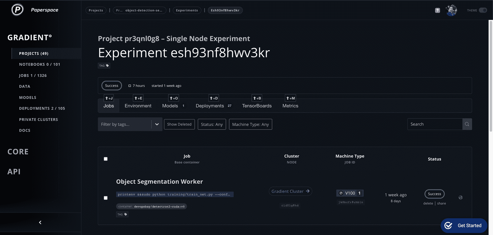
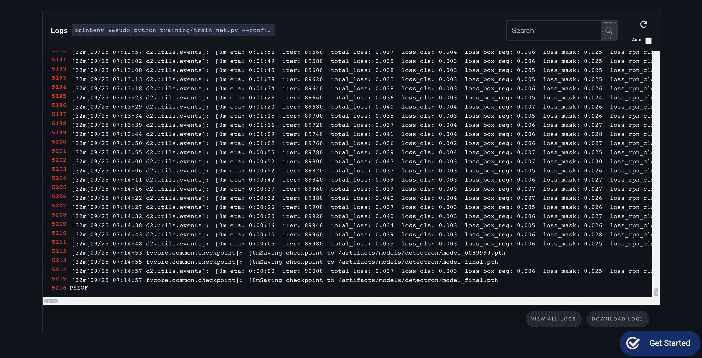
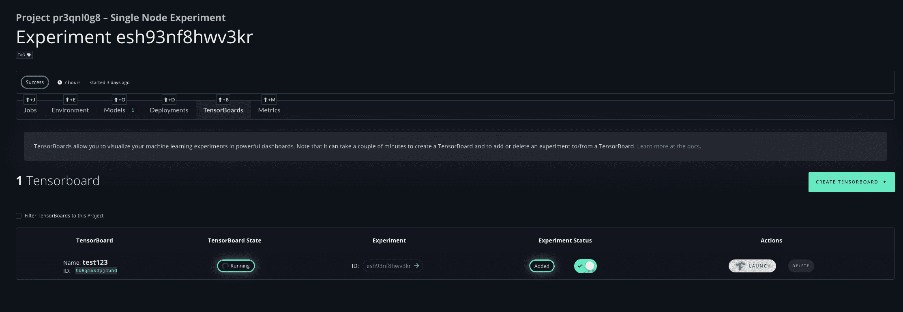
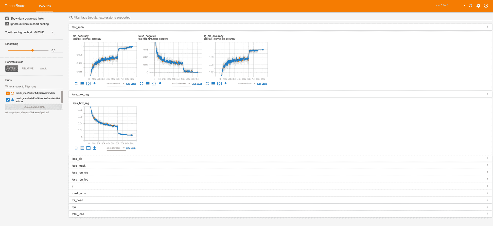
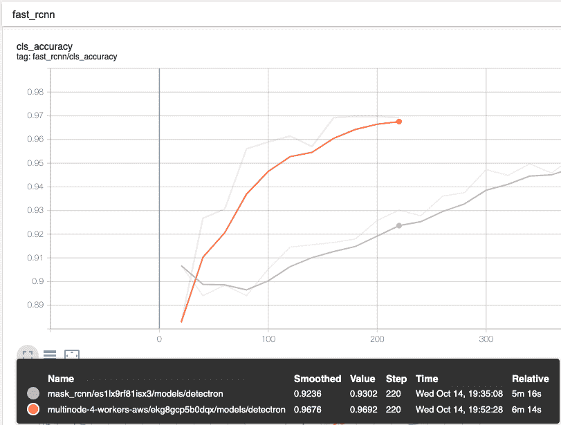
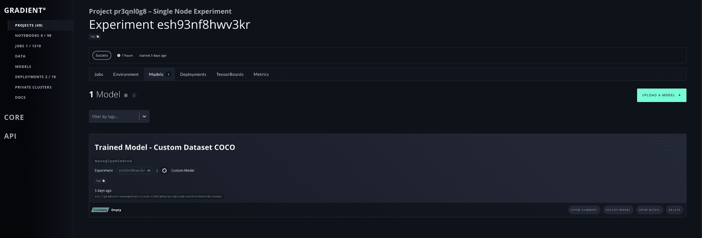
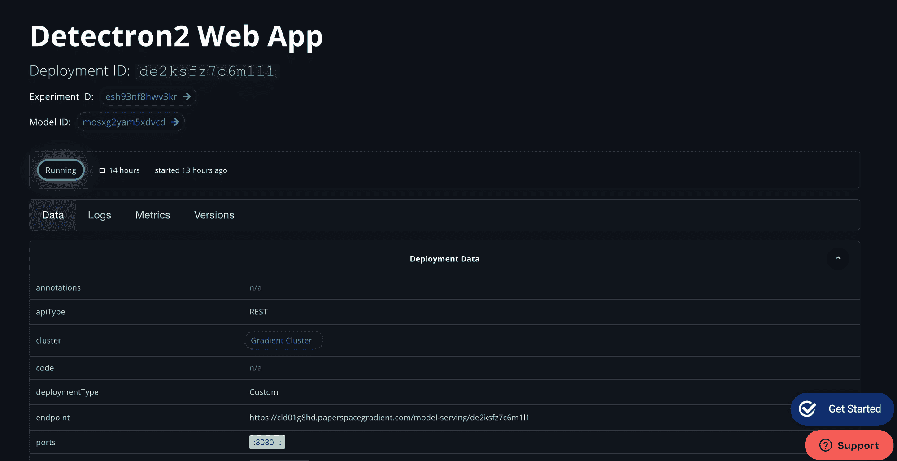
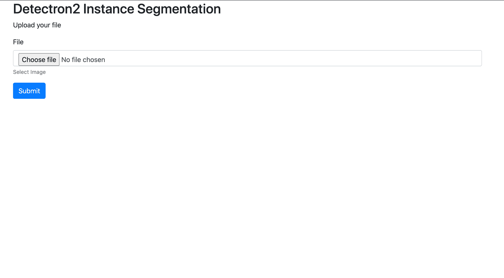

# 使用 PyTorch 和 Detectron2 进行对象检测

> 原文：<https://blog.paperspace.com/object-detection-segmentation-with-detectron2-on-paperspace-gradient/>

[2021 年 12 月 2 日更新:本文包含关于梯度实验的信息。实验现已被弃用，渐变工作流已经取代了它的功能。[请参见工作流程文档了解更多信息](https://docs.paperspace.com/gradient/explore-train-deploy/workflows)。]

在这篇文章中，我们将向你展示如何在渐变上训练 Detectron2 来检测自定义对象，例如渐变上的花朵。我们将向您展示如何标记自定义数据集以及如何重新训练您的模型。在我们训练它之后，我们将尝试在 Gradient 上推出一个带有 API 的推理服务器。

参考回购[https://github.com/Paperspace/object-detection-segmentation](https://github.com/Paperspace/object-detection-segmentation)


## 
文章大纲

*   检测器 2 概述
*   构建自定义数据集概述
*   如何标注自定义数据集
*   注册自定义检测器 2 对象检测数据
*   在坡度上运行探测器 2 训练
*   对梯度运行检测器 2 推理

## 检测器 2 概述

[Detectron2](https://detectron2.readthedocs.io/) 是一个流行的基于 PyTorch 的模块化计算机视觉模型库。这是 Detectron 的第二个版本，最初是用 Caffe2 编写的。Detectron2 系统允许您将最先进的计算机视觉技术插入到您的工作流程中。引用 Detectron2 发布博客:

Detectron2 包括原始 Detectron 中可用的所有型号，如更快的 R-CNN、Mask R-CNN、RetinaNet 和 DensePose。它还具有几个新的模型，包括级联 R-CNN，全景 FPN 和张量掩模，我们将继续添加更多的算法。我们还增加了一些功能，如同步批处理规范和对 LVIS 等新数据集的支持

## 构建自定义数据集概述

### 下载数据集

[https://public . robo flow . com/classification/flowers _ classification](https://public.roboflow.com/classification/flowers_classification)



[Roboflow](https://roboflow.com): Computer Vision dataset management tool

我们将在 [Roboflow](https://roboflow.com ) 免费托管的公共花卉检测数据上培训我们的 custom Detectron2 检测器。

花卉数据集是各种花卉种类(如蒲公英和雏菊)的分类检测数据集。值得注意的是，血细胞检测不是 Detectron2 中可用的功能——我们需要训练底层网络来适应我们的定制任务。

## 使用标注对数据集进行标注

[https://github.com/tzutalin/labelImg](https://github.com/tzutalin/labelImg)

准确标记的数据对于成功的机器学习至关重要，计算机视觉也不例外。

在这一节中，我们将演示如何使用 LabelImg 开始为对象检测模型标记您自己的数据。

### 关于标签制作

LabelImg 是一个免费的开源工具，用于图形化标记图像。它是用 Python 编写的，图形界面使用 QT。这是一个简单、免费的方法，可以标记几百张图片来尝试你的下一个项目。

### 安装标签

```py
sudo apt-get install pyqt5-dev-tools
sudo pip3 install -r requirements/requirements-linux-python3.txt
make qt5py3
python3 labelImg.py
python3 labelImg.py [IMAGE_PATH] [PRE-DEFINED CLASS FILE] 
```

用标签标记图像

LabelImg 支持 VOC XML 或 YOLO 文本文件格式的标签。在 Paperspace，我们强烈建议您使用默认的 VOC XML 格式来创建标签。多亏了 ImageNet，VOC XML 成为了一个更通用的标准，因为它与对象检测相关，而各种 YOLO 实现具有稍微不同的文本文件格式。

通过选择 LabelImg 左侧的“打开目录”打开您想要的图像集

要启动标签，请键入 w，并绘制所需的标签。然后，键入 ctrl(或 command) S 保存标签。键入 d 转到下一幅图像(键入 a 返回一幅图像)。

## 将 VOX XML 保存到 coco 数据集 JSON 中

在我们的[https://github.com/Paperspace/object-detection-segmentation](https://github.com/Paperspace/object-detection-segmentation)中的 [**数据集**](https://github.com/Paperspace/object-detection-segmentation/tree/master/datasets) 中，你会发现一个 coco_labelme.py 脚本，它将从我们之前生成的 xml 文件中创建一个 coco 数据集 json。

为了运行它:

> *python3* [*数据集*](https://github.com/Paperspace/object-detection-segmentation/tree/master/datasets)*/coco _ label me . py/path _ to _ your _ images/"-output = " trainval . JSON "*

## 上传您的自定义数据集

现在，我们必须将自定义数据集上传到 s3 bucket。

[在这里](https://docs.aws.amazon.com/AmazonS3/latest/user-guide/upload-objects.html)您可以找到如何使用 AWS-CLI 或 web 控制台将您的数据上传到 S3 的说明

## 注册数据集

为了让 detectron2 知道如何获得名为“my_dataset”的数据集，用户需要实现一个函数来返回数据集中的项目，然后告诉 detectron2 这个函数:

```py
def my_dataset_function():
...
return list[dict] in the following format
from detectron2.data import DatasetCatalog
DatasetCatalog.register("my_dataset", my_dataset_function)
# later, to access the data:
data: List[Dict] = DatasetCatalog.get("my_dataset") 
```

这里，代码片段将名为“my_dataset”的数据集与返回数据的函数相关联。如果多次调用，该函数必须返回相同的数据。注册将一直有效，直到进程退出。

如何将 my_dataset 数据集注册到 detectron2，遵循 detectron2 自定义数据集[教程](https://github.com/facebookresearch/detectron2/blob/master/docs/tutorials/datasets.md)。

```py
from detectron2.data.datasets import register_coco_instances
register_coco_instances("my_dataset", {}, "./data/trainval.json", "./data/images") 
```

每个数据集都与一些元数据相关联。在我们的例子中，可以通过调用*my _ dataset _ metadata = metadata catalog . get(" my _ dataset ")来访问它，您将得到*

```py
Metadata(evaluator_type='coco', image_root='./data/images', json_file='./data/trainval.json', name=my_dataset,
thing_classes=[‘type1’, ‘type2’, ‘type3’], thing_dataset_id_to_contiguous_id={1: 0, 2: 1, 3: 2}) 
```

要获得关于数据集的目录存储信息的实际内部表示以及如何获得它们，可以调用 dataset _ dicts = dataset catalog . get("*my _ dataset*")。内部格式使用一个 dict 来表示一个图像的注释。

为了验证数据加载是否正确，让我们可视化数据集中随机选择的样本的注释:

```py
import random
from detectron2.utils.visualizer import Visualizer
for d in random.sample(dataset_dicts, 3):
img = cv2.imread(d["file_name"])
visualizer = Visualizer(img[:, :, ::-1], metadata=my_dataset_metadata, scale=0.5)
vis = visualizer.draw_dataset_dict(d)
cv2_imshow(vis.get_image()[:, :, ::-1]) 
```

# 训练模型

现在，让我们在 *my_dataset* 数据集上微调 coco 预训练的 R50-FPN 掩模 R-CNN 模型。根据数据集的复杂程度和大小，可能需要 5 分钟到几小时。

预训练模型可从以下网址下载:

```py
detectron2://COCO-InstanceSegmentation/mask_rcnn_R_50_FPN_3x/137849600/model_final_f10217.pkl 
```

```py
from detectron2.engine import DefaultTrainer
from detectron2.config import get_cfg
import os
cfg = get_cfg()
cfg.merge_from_file(
"./detectron2_repo/configs/COCO-InstanceSegmentation/mask_rcnn_R_50_FPN_3x.yaml"
)
cfg.DATASETS.TRAIN = ("my_dataset",)
cfg.DATASETS.TEST = ()
cfg.DATALOADER.NUM_WORKERS = 2
cfg.MODEL.WEIGHTS = "detectron2://COCO-InstanceSegmentation/mask_rcnn_R_50_FPN_3x/137849600/model_final_f10217.pkl"  # initialize from model zoo
cfg.SOLVER.IMS_PER_BATCH = 2
cfg.SOLVER.BASE_LR = 0.02
cfg.SOLVER.MAX_ITER = (
300
)  # 300 iterations seems good enough, but you can certainly train longer
cfg.MODEL.ROI_HEADS.BATCH_SIZE_PER_IMAGE = (
128
)  # faster, and good enough for this toy dataset
cfg.MODEL.ROI_HEADS.NUM_CLASSES = 3  # 3 classes (data, fig, hazelnut)
os.makedirs(cfg.OUTPUT_DIR, exist_ok=True)
trainer = DefaultTrainer(cfg)
trainer.resume_or_load(resume=False)
trainer.train() 
```

## ***在坡度上跑训练***



### ***渐变 CLI 安装***

*如何安装渐变 CLI -* [*docs*](https://docs.paperspace.com/gradient/get-started/install-the-cli)

```py
pip install gradient
Then make sure to obtain an API Key, and then:
gradient apiKey XXXXXXXXXXXXXXXXXXX 
```

### ***在单个 GPU 上训练***

*注意:单人训练需要很长时间，所以做好等待的准备！*

```py
gradient experiments run singlenode \
--name mask_rcnn \
--projectId <some project> \
--container devopsbay/detectron2-cuda:v0 \
--machineType P4000 \
--command "sudo python training/train_net.py --config-file training/configs/mask_rcnn_R_50_FPN_1x.yaml --num-gpus 1 SOLVER.IMS_PER_BATCH 2 SOLVER.BASE_LR 0.0025 MODEL.WEIGHTS https://dl.fbaipublicfiles.com/detectron2/COCO-Detection/faster_rcnn_R_50_FPN_1x/137257794/model_final_b275ba.pkl  OUTPUT_DIR /artifacts/models/detectron" \
--workspace https://github.com/Paperspace/object-detection-segmentation.git \
--datasetName my_dataset \
--datasetUri <Link_to_your_dataset> \
--clusterId <cluster id> 
```

*数据集被下载到。/data/ <你的数据集>目录。模型结果存储在。/models 目录。*

如果一切设置正确，您应该会看到如下内容:



### ***张量板支持***

梯度支持 Tensorboard 开箱即用

[OverviewVisualize and compare experiments with TensorBoardsGradient Docs](https://docs.paperspace.com/gradient/tensorboards/about)

在实验页面上，您可以创建新的 Tensorboard，只需点击“添加到 Tensorboard”即可实时查看数据，即使在训练仍在进行中。



在 Tensorboard 中，您可以查看精度:



Live metrics during training 

你也可以在他们训练的时候现场对比多个模特！

### 多 GPU 训练

> *规模至关重要*

为了加快这个过程，我们必须在多 GPU 设置中运行训练。

为此，让我们在[梯度专用集群](https://docs.paperspace.com/gradient/gradient-private-cloud/about)上运行一个实验，为此我们需要添加几个额外的参数:

```py
gradient experiments run multinode \
  --name mask_rcnn_multinode \
  --projectId <some project> \
  --workerContainer devopsbay/detectron2:v1 \
  --workerMachineType P4000 \
  --workerCount 7 \
  --parameterServerContainer devopsbay/detectron2:v1 \
  --parameterServerMachineType P4000 \
  --parameterServerCount 1 \
  --experimentType GRPC \
  --workerCommand "python training/train_net.py --config-file training/configs/mask_rcnn_R_50_FPN_3x.yaml MODEL.WEIGHTS https://dl.fbaipublicfiles.com/detectron2/COCO-Detection/faster_rcnn_R_50_FPN_1x/137257794/model_final_b275ba.pkl  OUTPUT_DIR /artifacts/models/detectron" \
  --parameterServerCommand "python training/train_net.py --config-file training/configs/mask_rcnn_R_50_FPN_3x.yaml MODEL.WEIGHTS https://dl.fbaipublicfiles.com/detectron2/COCO-Detection/faster_rcnn_R_50_FPN_1x/137257794/model_final_b275ba.pkl  OUTPUT_DIR /artifacts/models/detectron" \
  --workspace https://github.com/Paperspace/object-detection-segmentation.git \
  --datasetName small_coco \
  --datasetUri s3://paperspace-tiny-coco/small_coco.zip \
  --clusterId <cluster id> 
```

这将在 8x P4000 上启动多 GPU 分布式培训。

```py
python training/train_net.py --config-file training/configs/mask_rcnn_R_50_FPN_3x.yaml --num-gpus 1 MODEL.WEIGHTS https://dl.fbaipublicfiles.com/detectron2/COCO-Detection/faster_rcnn_R_50_FPN_1x/137257794/model_final_b275ba.pkl  OUTPUT_DIR /artifacts/models/detectron 
```

必须在培训中涉及的所有机器上调用该函数。它将在每台机器上产生子进程(由**num-GPU**定义)。

**参数**

*   **num-GPU**([*int*](https://docs.python.org/3.6/library/functions.html#int))–每台机器的 GPU 数量
*   ****args****([*tuple*](https://docs.python.org/3.6/library/stdtypes.html#tuple))–传递给 main_func 的参数

### 如何扩展您的配置以获得最佳加速？

当配置是为不同于当前使用的工作线程数的特定工作线程数(根据`**cfg.SOLVER.REFERENCE_WORLD_SIZE**`)定义时，返回一个新的 cfg，其中总批处理大小被缩放，以便每个 GPU 的批处理大小与原始的`**IMS_PER_BATCH // REFERENCE_WORLD_SIZE**`保持相同。

其他配置选项也相应调整:*训练步数和热身步数成反比。*学习率按比例缩放。

例如，原始配置如下所示:

```py
IMS_PER_BATCH: 16
BASE_LR: 0.1
REFERENCE_WORLD_SIZE: 8
MAX_ITER: 5000
STEPS: (4000,)
CHECKPOINT_PERIOD: 1000 
```

当在 16 个 GPU 上使用此配置而不是参考数字 8 时，调用此方法将返回一个新的配置，其中包含:

```py
IMS_PER_BATCH: 32
BASE_LR: 0.2
REFERENCE_WORLD_SIZE: 16
MAX_ITER: 2500
STEPS: (2000,)
CHECKPOINT_PERIOD: 500 
```

请注意，原始配置和这个新配置都可以在 16 个 GPU 上进行训练。由用户决定是否启用该功能(通过设置`**REFERENCE_WORLD_SIZE**`)。

### 比较起来怎么样？

在本例中，我们比较了单个 P4000 和 4 个 p 4000。



你可以看到在重新训练模型时的速度差异——由于模型已经在更早的时候被训练过，开始时的准确率非常高，约为 90%。

### 部署训练模型

如果在训练部分结束时一切运行正常，我们应该在梯度仪表板中看到一个训练好的模型



Successfully trained model 

## 
如何在梯度上部署模型

此示例将加载之前训练的模型，并启动一个具有简单界面的 web app 应用程序。在我们解释它如何工作之前，让我们在平台上启动它！

```py
deployments create /
--name paperspace-detectron-demo-app /
--instanceCount 1 /
--imageUrl devopsbay/detectron2-cuda:v0 /
--machineType V100 /
--command "pip3 install -r demo/requirements.txt && python demo/app.py" /
--workspace https://github.com/Paperspace/object-detection-segmentation.git 
--deploymentType Custom 
--clusterId <cluster id> 
--modelId <model id> 
--ports 8080
```



Successfully deployed App

因此，在这篇文章中，我们将为 detectron2 的实例分段创建一个 web 应用程序。

### 后端

首先，我们将创建机器学习后端。这将使用基本的[烧瓶](https://flask.palletsprojects.com/en/1.1.x/)。我们将从一些相当标准的[样板代码](https://github.com/realpython/flask-boilerplate/blob/master/app.py)开始。

```py
import io
from flask import Flask, render_template, request, send_from_directory, send_file
from PIL import Image
import requests
import os
import urllib.request

app = Flask(__name__)

@app.route("/")
def index():

	# render the index.html template
	return render_template('index.html')

if __name__ == "__main__":

	# get port. Default to 8080
	port = int(os.environ.get('PORT', 8080))

	# set debug level
	logging.basicConfig(level=logging.DEBUG)

	# run app
	app.run(host='0.0.0.0', port=port) 
```

这个应用程序将简单地呈现模板`index.html`。我已经手动指定了端口。

接下来，我们将添加函数来获取图像。我们希望能够上传图像到网站。我们也希望能够提供一个网址和图像将自动下载的网站。我已经创建了如下代码。

```py
@app.route("/detect", methods=['POST', 'GET'])
def upload():
    if request.method == 'POST':

        try:

            # open image
            file = Image.open(request.files['file'].stream)

            # remove alpha channel
            rgb_im = file.convert('RGB')
            rgb_im.save('file.jpg')

        # failure
        except:

            return render_template("failure.html")

    elif request.method == 'GET':

        # get url
        url = request.args.get("url")

        # save
        try:
            # save image as jpg
            # urllib.request.urlretrieve(url, 'file.jpg')
            rgb_im = load_image_url(url)
            rgb_im = rgb_im.convert('RGB')
            rgb_im.save('file.jpg')

        # failure
        except:
            return render_template("failure.html")

    # run inference
    # result_img = run_inference_transform()
    try:
        result_img = run_inference('file.jpg')

        # create file-object in memory
        file_object = io.BytesIO()

        # write PNG in file-object
        result_img.save(file_object, 'PNG')

        # move to beginning of file so `send_file()` it will read from start
        file_object.seek(0)
    except Exception as e:
        app.logger.critical(str(e))
        return render_template("failure.html")

    return send_file(file_object, mimetype='image/jpeg') 
```

这段代码允许我们将图像上传到后端(POST 请求)。或者我们可以提供一个 url 的后端，它会自动下载图像(获取请求)。该代码还将图像转换成一个`jpg`。我无法使用 detectron2 对一张`png`图像进行推断。所以我们必须转换成一个`jpg`。

如果代码因为某种原因不能下载图像，它将返回`failure.html`模板。这基本上只是一个简单的`html`页面，说明在检索图像时出现了错误。

另外，我指定了一个不同的`@app.route`。这将需要反映在`index.html`文件中。

### 
前端

现在我将创建前端`html`代码。该界面允许用户上传图像或指定图像的 URL。

```py
<h2>Detectron2 Instance Segmentation</h2>
<p>Upload your file</p>
<form action="/model-serving/{{ model_id}}/detect" method="POST" enctype="multipart/form-data">

<div class="form-group">
<label for="file1">File</label>

Select Image
</div>
Submit
</form> 
```

### 模型

在这一部分中，我们将得到一个之前训练的 detectron2 模型来对图像进行推理。然后我们将它链接到我们现有的后端。

这部分稍微复杂一点。我们将创建一个名为`Detector`的新类。我们将创建探测器 2 所需的`cfg`。然后，我们将创建另一个函数来对图像进行推理。

首先，我们必须从 repo 加载模型配置:

```py
# obtain detectron2's default config
self.cfg = get_cfg() 

# Load Model Config
self.model = os.getenv('MODEL_CONFIG', 'mask_rcnn_R_50_FPN_3x.yaml')
# load values from a file
self.cfg.merge_from_file(model_zoo.get_config_file("COCO-InstanceSegmentation/"+self.model)) 
```

然后我们要设置是要在 CPU 还是 GPU 上运行推理。请注意，在 GPU 上训练的模型在 CPU 上无法正常工作。

```py
# Additional Info when using cuda
if torch.cuda.is_available():
    self.cfg.MODEL.DEVICE = "cuda"
else:
# set device to cpu
    self.cfg.MODEL.DEVICE = "cpu" 
```

下一阶段是加载我们之前训练过的训练模型文件:

```py
# get Model from paperspace trained model directory
model_path = os.path.abspath('/models/model/detectron/model_final.pth')
if os.path.isfile(model_path):
    print('Using Trained Model {}'.format(model_path), flush=True)
else:
    # Load default pretrained model from Model Zoo
    print('No Model Found at {}'.format(model_path), flush=True)
    model_path = model_zoo.get_checkpoint_url("COCO-InstanceSegmentation/"+self.model)

self.cfg.MODEL.WEIGHTS = model_path
```

就是这样！

现在让我们创建推理函数

```py
# detectron model
def inference(self, file):

    predictor = DefaultPredictor(self.cfg)
	im = cv.imread(file)
	rgb_image = im[:, :, ::-1]
	outputs = predictor(rgb_image)

	# get metadata
	metadata = MetadataCatalog.get(self.cfg.DATASETS.TRAIN[0])
	# visualise
	v = Visualizer(rgb_image[:, :, ::-1], metadata=metadata, scale=1.2)
	v = v.draw_instance_predictions(outputs["instances"].to("cpu"))

	# get image 
	img = Image.fromarray(np.uint8(v.get_image()[:, :, ::-1]))

	return img 
```

我们还想跟踪我们的服务收到了多少请求——我们使用了 Paperspace Utils 的内置度量系统

```py
if logger:
    # Push Metrics
    logger["inference_count"].inc()
    logger.push_metrics()
    print('Logged Inference Count', flush=True)
```



Service ready for action

最终结果:

