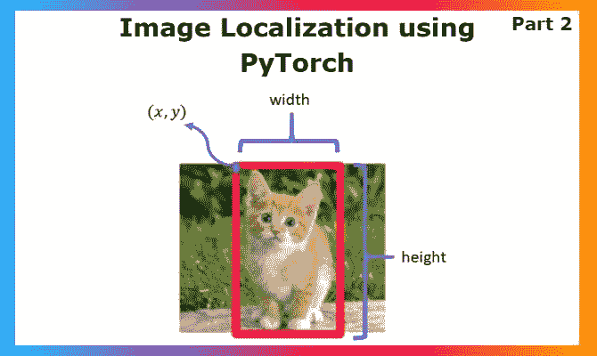
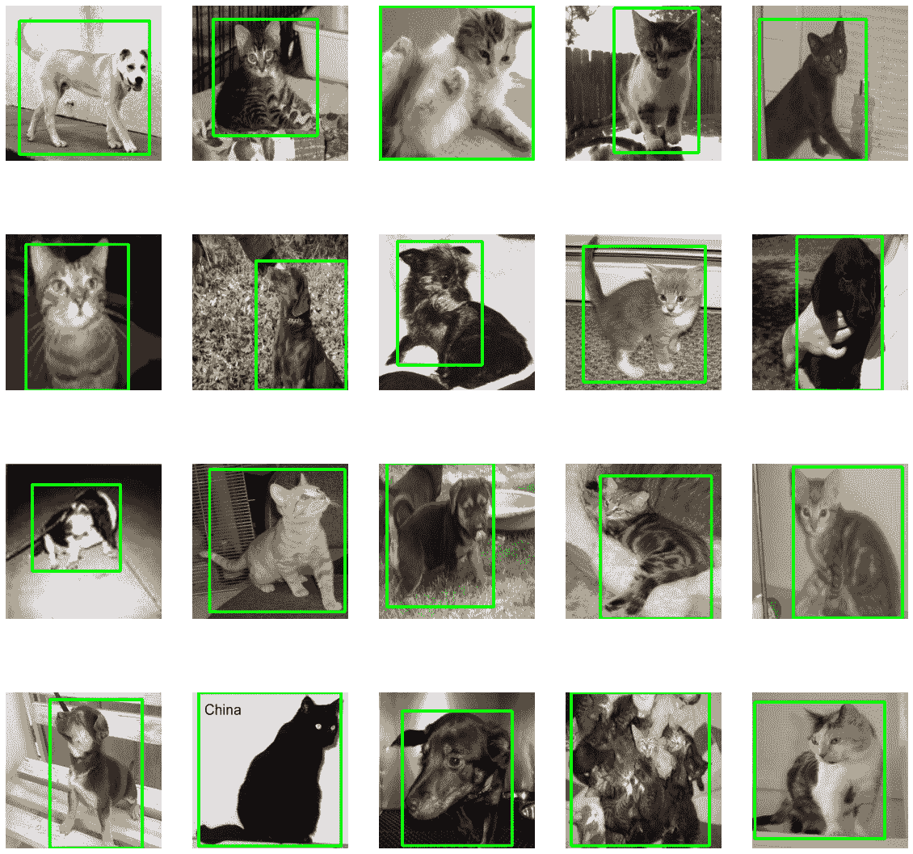
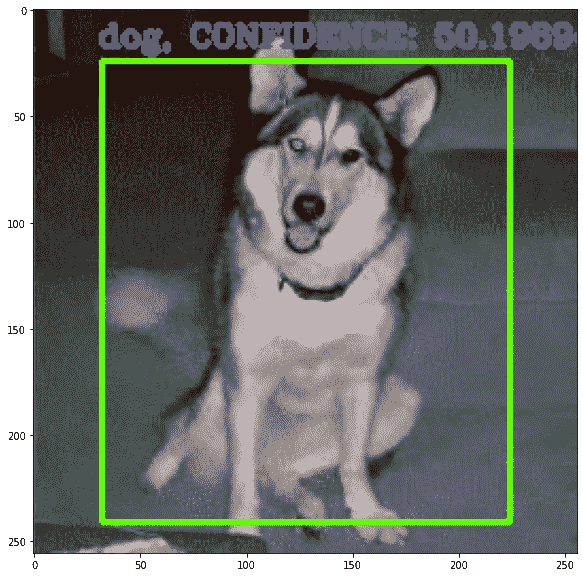

# 使用 PyTorch 进行对象定位，第 2 部分

> 原文：<https://blog.paperspace.com/object-localization-pytorch-2/>



图像定位对我来说是一个有趣的应用，因为它正好介于图像分类和对象检测之间。这是使用 PyTorch 的对象定位系列的第二部分，所以如果您还没有阅读过前一部分，请务必阅读。

[一定要跟着 Gradient 上的 IPython 笔记本走，叉出自己的版本试试看！](https://console.paperspace.com/te72i7f1w/notebook/rxod0p06z2t352m?file=PyTorch_Localization_Notebook.ipynb)

### 数据集可视化

在进入本教程的机器学习部分之前，让我们用边界框来可视化数据集。这里我们可以看到如何通过与图像大小相乘来检索坐标。我们使用 OpenCV 来显示图像。这将打印出 20 个图像及其边界框的样本。

```py
# Create a Matplotlib figure
plt.figure(figsize=(20,20));

# Generate a random sample of images each time the cell is run 
random_range = random.sample(range(1, len(img_list)), 20)

for itr, i in enumerate(random_range, 1):

    # Bounding box of each image
    a1, b1, a2, b2 = boxes[i];
    img_size = 256

    # Rescaling the boundig box values to match the image size
    x1 = a1 * img_size
    x2 = a2 * img_size
    y1 = b1 * img_size
    y2 = b2 * img_size

    # The image to visualize
    image = img_list[i]

    # Draw bounding boxes on the image
    cv2.rectangle(image, (int(x1),int(y1)),
          (int(x2),int(y2)),
                  (0,255,0),
                  3);

    # Clip the values to 0-1 and draw the sample of images
    img = np.clip(img_list[i], 0, 1)
    plt.subplot(4, 5, itr);
    plt.imshow(img);
    plt.axis('off');
```



Visualization of the dataset

### 数据集分割

我们已经在 img_list、labels 和 box 中获得了数据集，现在我们必须在进入数据加载器之前分割数据集。像往常一样，我们将使用 sklearn 库中的 [train_test_split](https://scikit-learn.org/stable/modules/generated/sklearn.model_selection.train_test_split.html) 方法来完成这个任务。

```py
# Split the data of images, labels and their annotations
train_images, val_images, train_labels, \
val_labels, train_boxes, val_boxes = train_test_split( np.array(img_list), 
                np.array(labels), np.array(boxes), test_size = 0.2, 
                random_state = 43)

print('Training Images Count: {}, Validation Images Count: {}'.format(
    len(train_images), len(val_images) ))
```

现在，我们已经通过可视化快速浏览了数据集，并完成了数据集拆分。让我们继续为数据集构建自定义 PyTorch 数据加载器，目前数据集分散在变量中。

### Pytorch 中的自定义数据加载器

顾名思义，DataLoaders 返回一个对象，该对象将在我们训练模型时处理整个数据提供系统。它在创建对象时提供了像 shuffle 这样的功能，它有一个“getitem”方法，可以处理每次迭代中应该输入的数据，所有这些东西都可以让你按照你希望的方式设计一切，而不会在训练部分使代码变得混乱。这使您可以更专注于其他优化。让我们从进口开始 PyTorch 部分。

```py
from PIL import Image
import torch
import torchvision
from torchvision.transforms import ToTensor
import torchvision.transforms as transforms
import numpy as np
import matplotlib.pyplot as plt

import torch.nn as nn
import torch.optim as optim
import torch.nn.functional as F
import os
import pickle
import random
import time
```

如果可以的话，重要的事情之一是使用 GPU 来训练 ML 模型，尤其是当目标很大的时候。如果在 Paperspace Gradient 中运行，请选择带有 GPU 的机器。

```py
device = torch.device('cuda' if torch.cuda.is_available() else 'cpu')
device 
```

> > >设备(type='cuda ')

上面的输出表明你有一个 GPU，而**设备**可以用来将数据和模型转换成 GPU 以便利用。继续讨论数据加载器。

```py
class Dataset():
    def __init__(self, train_images, train_labels, train_boxes):
        self.images = torch.permute(torch.from_numpy(train_images),(0,3,1,2)).float()
        self.labels = torch.from_numpy(train_labels).type(torch.LongTensor)
        self.boxes = torch.from_numpy(train_boxes).float()

    def __len__(self):
        return len(self.labels)

    # To return x,y values in each iteration over dataloader as batches.

    def __getitem__(self, idx):
        return (self.images[idx],
              self.labels[idx],
              self.boxes[idx])

# Inheriting from Dataset class

class ValDataset(Dataset):

    def __init__(self, val_images, val_labels, val_boxes):

        self.images = torch.permute(torch.from_numpy(val_images),(0,3,1,2)).float()
        self.labels = torch.from_numpy(val_labels).type(torch.LongTensor)
        self.boxes = torch.from_numpy(val_boxes).float() 
```

这里我们将创建 Dataset 类，首先加载图像、标签和盒子坐标，缩放到类变量的范围[0-1]。然后，我们使用“getitem”来设计每次迭代中的加载器输出。类似地，我们将构建 ValDataset(验证数据集)数据加载器类。由于数据的结构和性质是相同的，我们将从上面的类继承。

现在我们有了数据加载器的类，让我们马上从各自的类创建数据加载器对象。

```py
dataset = Dataset(train_images, train_labels, train_boxes)
valdataset = ValDataset(val_images, val_labels, val_boxes)
```

现在我们已经完成了准备数据的旅程，让我们转到教程的机器学习模型部分。我们将使用一组相当简单的卷积神经网络来实现目标定位，这将有助于我们根据自己的理解来调整概念。我们可以尝试这种架构的各个方面，包括使用像 [Alexnet](https://towardsdatascience.com/alexnet-the-architecture-that-challenged-cnns-e406d5297951) 这样的预训练模型。我鼓励你学习更多关于优化器、损失函数和超调模型的知识，以掌握未来项目的架构设计技巧。

## 模型架构

因此，为了理解我们必须如何设计架构，我们必须首先理解输入和输出。这里输入的是一批图片，所以会像`(BS, C, H, W)`一样风格化。`BS`批量大小，然后是通道、高度和重量。顺序很重要，因为在 PyTorch 中，图像就是这样存储的。在 TensorFlow 中，对于每幅图像是(H，W，C)。

说到输出，我们有两个输出，正如我们在上一篇博客开始时所讨论的。首先是你的分类输出，大小为`(1, N)`，`N`是类的数量。第二个输出的大小为`(1, 4)`，为 xmin、ymin、xmax 和 ymax，但在`(0,1)`的范围内。这有助于您以后根据图像大小缩放坐标。因此输出将是`(CLF, BOX)`，第一个是上面讨论的分类，另一个是坐标。

现在，从机器学习部分解释，`CLF`将用于通过在输出上使用 argmax 来获得类索引，并且我们可以在末尾添加 softmax 激活函数用于概率输出。`BOX`输出将在通过 sigmoid 激活函数后产生，该函数使范围`(0,1)`。也就是说，其他一切都类似于传统的图像分类模型。让我们看看代码。

```py
class Network(nn.Module):
    def __init__(self):
        super(Network, self).__init__()

        # CNNs for rgb images
        self.conv1 = nn.Conv2d(in_channels=3, out_channels=6, kernel_size=5)
        self.conv2 = nn.Conv2d(in_channels=6, out_channels=12, kernel_size=5)
        self.conv3 = nn.Conv2d(in_channels=12, out_channels=24, kernel_size=5)
        self.conv4 = nn.Conv2d(in_channels=24, out_channels=48, kernel_size=5)
        self.conv5 = nn.Conv2d(in_channels=48, out_channels=192, kernel_size=5)

        # Connecting CNN outputs with Fully Connected layers for classification
        self.class_fc1 = nn.Linear(in_features=1728, out_features=240)
        self.class_fc2 = nn.Linear(in_features=240, out_features=120)
        self.class_out = nn.Linear(in_features=120, out_features=2)

        # Connecting CNN outputs with Fully Connected layers for bounding box
        self.box_fc1 = nn.Linear(in_features=1728, out_features=240)
        self.box_fc2 = nn.Linear(in_features=240, out_features=120)
        self.box_out = nn.Linear(in_features=120, out_features=4)

    def forward(self, t):
        t = self.conv1(t)
        t = F.relu(t)
        t = F.max_pool2d(t, kernel_size=2, stride=2)

        t = self.conv2(t)
        t = F.relu(t)
        t = F.max_pool2d(t, kernel_size=2, stride=2)

        t = self.conv3(t)
        t = F.relu(t)
        t = F.max_pool2d(t, kernel_size=2, stride=2)

        t = self.conv4(t)
        t = F.relu(t)
        t = F.max_pool2d(t, kernel_size=2, stride=2)

        t = self.conv5(t)
        t = F.relu(t)
        t = F.avg_pool2d(t, kernel_size=4, stride=2)

        t = torch.flatten(t,start_dim=1)

        class_t = self.class_fc1(t)
        class_t = F.relu(class_t)

        class_t = self.class_fc2(class_t)
        class_t = F.relu(class_t)

        class_t = F.softmax(self.class_out(class_t),dim=1)

        box_t = self.box_fc1(t)
        box_t = F.relu(box_t)

        box_t = self.box_fc2(box_t)
        box_t = F.relu(box_t)

        box_t = self.box_out(box_t)
        box_t = F.sigmoid(box_t)

        return [class_t,box_t]
```

接下来让我们实例化这个模型，并让它使用 GPU(如果可用的话)。这确实可以加速训练过程，特别是对于像图像定位这样的大目标。之后我们还将看到模型摘要。

```py
model = Network()
model = model.to(device)
model
```

我们可以在训练后使用 ONNX 格式和 [netron](https://netron.app/) 网站可视化模型，以评估复杂的细节，如重量等。现在，我们可以编写一个小函数来计算每批训练的正确预测数。

```py
def get_num_correct(preds, labels):
    return torch.round(preds).argmax(dim=1).eq(labels).sum().item()
```

现在，我们将为训练和验证数据集创建数据加载器，以便在训练时输入成批的图像。

```py
dataloader = torch.utils.data.DataLoader(
       dataset, batch_size=32, shuffle=True)
valdataloader = torch.utils.data.DataLoader(
       valdataset, batch_size=32, shuffle=True)
```

在这里，我们可以在 Dataloader 方法中有更多的参数，如 **num_workers** ，这可以帮助我们改善加载时间，其中 2 通常是使数据加载过程流水线化的最佳值。现在我们要创建训练函数，这是每个 ML 项目中最重要的部分。我们将保持流程简单，便于所有人理解培训的每个部分。我们将在整个过程中专注于提高验证的准确性。

## 模型训练和验证

```py
def train(model):
    # Defining the optimizer
    optimizer = optim.SGD(model.parameters(),lr = 0.1)
    num_of_epochs = 30
    epochs = []
    losses = []
    # Creating a directory for storing models
    os.mkdir('models')
    for epoch in range(num_of_epochs):
        tot_loss = 0
        tot_correct = 0
        train_start = time.time()
        model.train()
        for batch, (x, y, z) in enumerate(dataloader):
        	# Converting data from cpu to GPU if available to improve speed
            x,y,z = x.to(device),y.to(device),z.to(device)
            # Sets the gradients of all optimized tensors to zero
            optimizer.zero_grad()
            [y_pred,z_pred]= model(x)
            # Compute loss (here CrossEntropyLoss)
            class_loss = F.cross_entropy(y_pred, y)
            box_loss = F.mse_loss(z_pred, z)
            (box_loss + class_loss).backward()
            # class_loss.backward()
            optimizer.step()
            print("Train batch:", batch+1, " epoch: ", epoch, " ",
                  (time.time()-train_start)/60, end='\r')

        model.eval()
        for batch, (x, y,z) in enumerate(valdataloader):
        	# Converting data from cpu to GPU if available to improve speed	
            x,y,z = x.to(device),y.to(device),z.to(device)
            # Sets the gradients of all optimized tensors to zero
            optimizer.zero_grad()
            with torch.no_grad():
                [y_pred,z_pred]= model(x)

                # Compute loss (here CrossEntropyLoss)
                class_loss = F.cross_entropy(y_pred, y)
                box_loss = F.mse_loss(z_pred, z)
                # Compute loss (here CrossEntropyLoss)

            tot_loss += (class_loss.item() + box_loss.item())
            tot_correct += get_num_correct(y_pred, y)
            print("Test batch:", batch+1, " epoch: ", epoch, " ",
                  (time.time()-train_start)/60, end='\r')
        epochs.append(epoch)
        losses.append(tot_loss)
        print("Epoch", epoch, "Accuracy", (tot_correct)/2.4, "loss:",
              tot_loss, " time: ", (time.time()-train_start)/60, " mins")
        torch.save(model.state_dict(), "model_ep"+str(epoch+1)+".pth")
```

让我们详细讨论一下这个问题。我们将使用的优化器是随机梯度下降，但是如果您愿意，您可以尝试其他优化技术，如 Adam。

我们将分别处理培训和验证。为了在训练期间跟踪时间，我们可以使用 **train_start** 变量。这在计算训练时间的付费 GPU 实例上非常有用，这将帮助您在多次再训练之前提前计划。

默认情况下，PyTorch 模型设置为 train (self.training = True)。当我们到达代码的验证部分时，我们将讨论为什么切换状态及其影响。

从我们创建的数据加载器中，我们访问由 x、y 和 z 组成的每批数据，它们分别是图像、标签和边界框。然后，我们将它们转换成我们喜欢的设备，例如，如果 GPU 可用的话。优化器处理深度学习中的反向传播，因此在训练之前，我们通过 *optimizer.zero_grad()将每批的梯度设置为零。*

将输入(x)输入到模型后，我们进入损耗计算。这是一个重要的部分，因为这里涉及两种类型的损失:分类问题的交叉熵损失，以及寻找边界框坐标的回归部分的均方误差。如果我们在这里观察，我们可以看到我们如何将损失的总和发送给反向传播，而不是个体治疗。

之后，代码的评估部分类似于训练部分，除了我们不做反向传播。一旦我们转移到验证部分，我们使用 *model.eval()* 将模型状态切换到 eval。正如我们前面所讨论的，默认情况下，模型处于训练状态，切换非常重要。一些层在训练/和评估期间具有不同的行为(如 BatchNorm、Dropout ),从而影响整体性能。这是一个有趣的点，因为当模型处于训练状态时，BatchNorm 使用每批统计数据，并且删除层被激活。但是当模型处于评估(推断)模式时，BatchNorm 层使用运行统计，而 Dropout 层被停用。这里需要注意的是，这两个函数调用都不运行向前/向后传递。它们告诉模型在运行时如何行动。这一点很重要，因为一些模块(层)被设计为在训练和推理期间表现不同，如果在错误的模式下运行，模型将产生意想不到的结果。在这里，我们使用之前编写的函数来计算准确性，以找到正确预测的数量。

在这个例子中，我们将训练 30 个历元，但是这是任意的，我们可以自由地试验更长或更短的历元值。

关于培训过程，我们必须选择的最后一件事是如何保存模型。在 PyTorch 中，我们可以用两种方式保存模型。一个是我们保存整个模型，包括重量、结构等等；如果我们确定 PyTorch 的生产版本与开发版本匹配，这是完美的。在某些情况下，当大小限制在 500MB 左右时，以这种方式保存的 PyTorch 模型对于部署来说可能太重了。我们保存模型的另一种方法是通过创建一个 *state_dict()，*，它只将模型的可学习参数的状态保存为 python 字典。这使得它在形式上更加模块化，就像在生产中一样，为了复活模型，您必须提供模型的 state_dict()和模型架构(在我们的例子中是*网络*)。这几乎就像提供肌肉和骨骼来复活一个生命，这是方便和灵活的，因为我们可以决定 PyTorch 版本，如果需要，可以使用 PyTorch cpu 专用版本，这将减少整个包的大小，这种方法非常有用。我鼓励你多读一些关于[的文章来拓宽你的理解。也就是说，如果没有内存存储限制，保存所有模型数据是最安全的方法。否则选择像提前停止这样的技术会帮助你得到最好的模型而不会错过它。](https://pytorch.org/tutorials/recipes/recipes/what_is_state_dict.html)

一旦您理解了培训功能，我们就开始培训吧。

```py
train(model)
```

这里需要理解的一件重要事情是，如果您希望重新训练，您必须重新初始化模型。没有该步骤的重新训练只会增加现有的模型参数。因此，处理这个潜在问题的一个好方法是在训练之前初始化模型，以便再次重复相同的过程。

验证的准确性取决于很多因素，第一次尝试可能得不到好的结果。我提供的用于测试实现的数据集是最小的数据集，您必须有一个更加精细和通用的数据集来对您的模型进行真正的测试。其他一些改进模型的方法是通过数据扩充技术等。我已经写了一篇关于提高精确度的详细文章，所以如果你的模型仍然需要改进的话，可以读一读。

## 模型测试/推理

当谈到图像定位时，预测不仅仅是从模型中获得输出。我们还必须处理边界框坐标，以生成一个实际的边界框来可视化结果，这甚至可能有助于生产。本节将有 3 个主要组件，预测脚本、预处理和后处理脚本，所以让我们开始吧。

### 预处理

在处理机器学习产品时，输入模型的数据必须与训练时输入的数据进行完全相同的预处理，这一点很重要。在推理阶段，调整大小是任何图像相关模型最常见的预处理之一。这里我们的图像尺寸是 256。

```py
def preprocess(img, image_size = 256):

    image = cv2.resize(img, (image_size, image_size))
    image = cv2.cvtColor(image, cv2.COLOR_BGR2RGB)
    image = image.astype("float") / 255.0 

    # Expand dimensions as predict expect image in batches
    image = np.expand_dims(image, axis=0) 
    return image
```

### 后加工

一旦我们得到输出，用更简单的术语来说，它们将是`[CLF, BOX]`的形式，我们将不得不使用边界框值来创建可视化的结果。边界框输入被缩放到范围`[0,1]`，并且，当我们在最后使用 sigmoid 激活函数时，我们的预测也在范围`[0,1]`内。我们将不得不重新调整它们以得到 xmin，ymin 等。为此，我们只需将这些值乘以图像大小(此处为 256)。

```py
def postprocess(image, results):

    # Split the results into class probabilities and box coordinates
    [class_probs, bounding_box] = results

    # First let's get the class label

    # The index of class with the highest confidence is our target class
    class_index = torch.argmax(class_probs)

    # Use this index to get the class name.
    class_label = num_to_labels[class_index]

    # Now you can extract the bounding box too.

    # Get the height and width of the actual image
    h, w = 256,256

    # Extract the Coordinates
    x1, y1, x2, y2 = bounding_box[0]

    # # Convert the coordinates from relative (i.e. 0-1) to actual values
    x1 = int(w * x1)
    x2 = int(w * x2)
    y1 = int(h * y1)
    y2 = int(h * y2)

    # return the lable and coordinates
    return class_label, (x1,y1,x2,y2),torch.max(class_probs)*100
```

现在我们已经有了预处理和后处理，让我们进入预测脚本。

### 预测脚本

在预测脚本中，我们首先从早期的网络中获得模型架构，然后将模型移动到我们首选的设备:Gradient 笔记本中的 GPU。一旦完成，我们加载模型的 **state_dict()** ，就像我们之前在验证中讨论的那样。我们将模型设置为 eval 状态，并使用预处理功能将图像准备好输入模型。然后我们可以使用 PyTorch 中的 permute 函数将图像数组从`[N,H,W,C]`重新制作成`[N,C,H,W]`。结果被提供给后处理函数，后者返回实际的坐标和标签。最后，我们使用 matplotlib 绘制带有边界框的结果图像。

```py
# We will use this function to make prediction on images.
def predict(image,  scale = 0.5):
  model = Network()
  model = model.to(device)
  model.load_state_dict(torch.load("models/model_ep29.pth"))
  model.eval()

  # Reading Image
  img  = cv2.imread(image)

  # # Before we can make a prediction we need to preprocess the image.
  processed_image = preprocess(img)

  result = model(torch.permute(torch.from_numpy(processed_image).float(),(0,3,1,2)).to(device))

  # After postprocessing, we can easily use our results
  label, (x1, y1, x2, y2), confidence = postprocess(image, result)

  # Now annotate the image
  cv2.rectangle(img, (x1, y1), (x2, y2), (0, 255, 100), 2)
  cv2.putText(
      img, 
      '{}, CONFIDENCE: {}'.format(label, confidence), 
      (30, int(35 * scale)), 
      cv2.FONT_HERSHEY_COMPLEX, scale,
      (200, 55, 100),
      2
      )

  # Show the Image with matplotlib
  plt.figure(figsize=(10,10))
  plt.imshow(img[:,:,::-1])
```

让我们继续在一幅图像上做推论。

```py
image = '< IMAGE PATH >'
predict(image)
```

下面给出了输出，你可以看到我们是如何在图像上得到一个边界框的。



Resulting Image with Bounding Box

## ONNX 和模型架构可视化

正如我们之前提到的，我们可以使用 [netron](https://netron.app/) 来可视化我们的模型及其重量等等。为此，我们可以将模型转换为 ONNX 格式。ONNX 格式是 Snap Lens Studio 等平台接受的通用机器学习模型存储格式，也是 Gradient 上可部署的框架之一。基于 TensorFlow 和 PyTorch 构建的模型可以转换为 ONNX，两者实现相同的形式和功能。以下是我们将如何做。获得'后。ONNX '文件，你可以访问 [netron](https://netron.app/) 进行更深入的模型可视化。

```py
model = Network()
model = model.to(device)
model.load_state_dict(torch.load('models/model_ep29.pth'))
model.eval()
random_input = torch.randn(1, 3, 256, 256, dtype=torch.float32).to(device)
# you can add however many inputs your model or task requires

input_names = ["input"]
output_names = ["cls","loc"]

torch.onnx.export(model, random_input, 'localization_model.onnx', verbose=False, 
                  input_names=input_names, output_names=output_names, 
                  opset_version=11)
print("DONE")
```

## 结论

正如我们一直在讨论的，图像定位是一个有趣的研究领域，与图像分类问题相比，在这方面获得准确性要困难一些。在这里，我们不仅要得到正确的分类，还要得到一个紧密而正确的包围盒。处理这两个问题会使模型变得复杂，因此改进数据集和体系结构会有所帮助。我希望这篇由两部分组成的关于实现图像本地化的详细文章对您有所帮助，并且我鼓励您阅读更多相关内容。