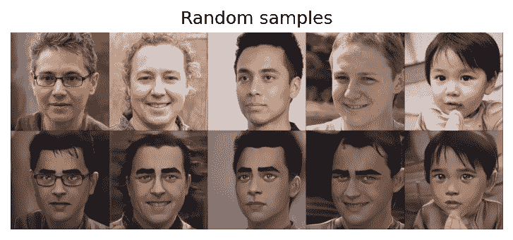
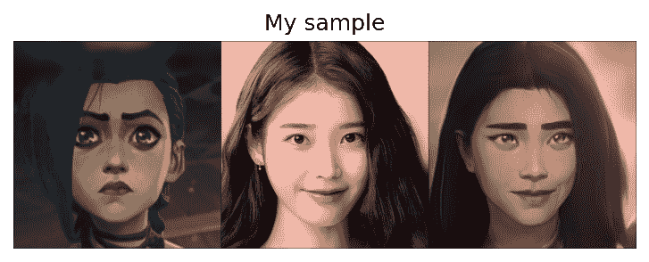
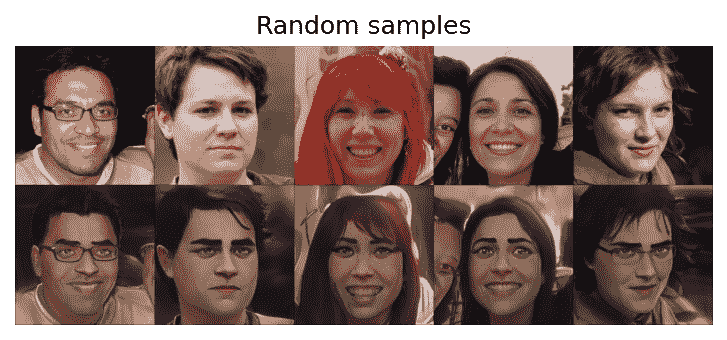
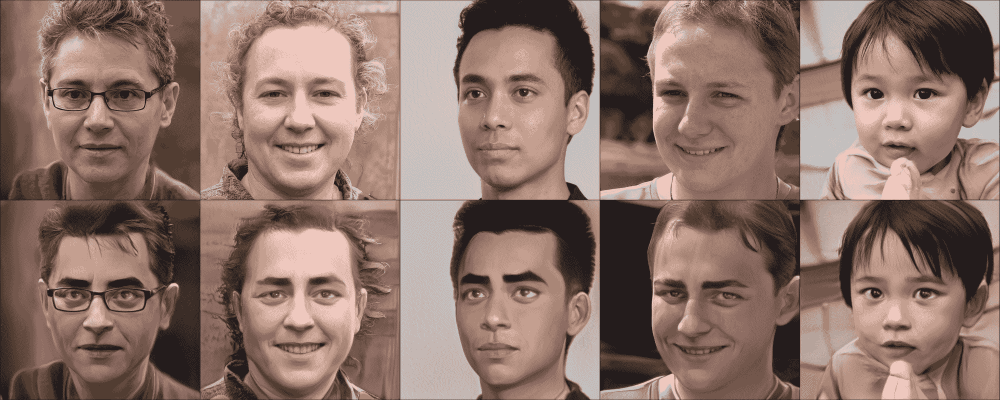

# 如何在渐变笔记本上用 JoJoGAN 进行一次脸部风格化

> 原文：<https://blog.paperspace.com/one-shot-face-stylization-with-jojogan/>

风格转移是最近围绕深度学习媒体最热门的话题之一。这有许多原因，包括该方法易于出版的可论证性，以及对照片进行快速风格编辑的潜在效用。这种实用性和易于演示的结合使 style transfer 成为许多数据科学家、ML 工程师和人工智能爱好者从事的最受欢迎的第一个计算机视觉项目之一，例如将文森特·梵高的“星空”的风格赋予以前平凡的风景照片。

也就是说，这是一门粗糙的科学。像许多计算机视觉任务一样，将风格转移到图像的粗糙和较大区域的挑战远比将相同的风格转移到面部的精细特征容易。特别是像眼睛和嘴巴这样的区域很难让人工智能正确地近似生成。



An example of JoJoGAN (trained on faces from the tv show Arcane) applying its stylization to randomly sampled faces. 

在本教程中，我们将看看 JoJoGAN -一种新颖的方法进行一次性风格的面部图像转移。这个 PyTorch 编写的架构旨在捕捉历史上难以解释的风格细节，例如传递保留眼睛形状或嘴巴细节等面部细节的风格效果。JoJoGAN 旨在解决这个问题，首先近似成对的训练数据集，然后微调 StyleGAN 以执行一次性人脸风格化。

JoJoGAN 能够摄取任何一张人脸图像(理想情况下是某种高质量的头像)，使用 GAN 反演来近似成对的真实数据，并使用这些数据来精确调整预先训练的 StyleGAN2 模型。然后使 StyleGAN2 模型可推广，以便赋予的样式可以随后应用于新图像。以前的一次和几次拍摄尝试已经接近成功的水平，但 JoJoGAN 已经成功地实现了其生成的图像的极高质量水平。

按照下面的步骤，看看如何在渐变笔记本上运行 JoJoGAN！

# 要求和设置

JoJoGAN 是一个基于 PyTorch 的包，它利用许多库来实现它的功能。当您为 JoJoGAN 创建笔记本时，请确保选择 PyTorch 图块以及 GPU 实例。完成后，滚动到页面底部，选择高级选项切换。对于你的工作区网址，一定要输入 [`https://github.com/gradient-ai/JoJoGAN`](https://github.com/gradient-ai/JoJoGAN) 。一旦完成，您的实例已经启动，继续打开`stylize.ipynb`文件。这是我们将做大部分工作的地方。

```py
!pip install gdown scikit-learn==0.22 scipy lpips dlib opencv-python-headless tensorflow
!wget https://github.com/ninja-build/ninja/releases/download/v1.8.2/ninja-linux.zip
!unzip ninja-linux.zip -d /usr/local/bin/
!update-alternatives --install /usr/bin/ninja ninja /usr/local/bin/ninja 1 --force 
```

第一个代码单元包含我们用来创建实例的官方 PyTorch 映像上需要但没有安装的库。请务必先运行此单元，以确保一切正常运行。

```py
#imports
import torch
torch.backends.cudnn.benchmark = True
from torchvision import transforms, utils
from util import *
from PIL import Image
import math
import random
import os

import numpy as np
from torch import nn, autograd, optim
from torch.nn import functional as F
from tqdm import tqdm
import lpips
import wandb
from model import *
from e4e_projection import projection as e4e_projection
from copy import deepcopy

os.makedirs('inversion_codes', exist_ok=True)
os.makedirs('style_images', exist_ok=True)
os.makedirs('style_images_aligned', exist_ok=True)
os.makedirs('models', exist_ok=True)
```

下一个单元将包导入到笔记本中，因为它们已经安装在机器上了。值得注意的是，我们同时使用本地和 python 安装包。确保不要更改`.ipynb`文件的位置，以确保其正常工作。然后，下面的`os.makedirs()`语句创建并检查我们将用于 JoJoGAN 的目录是否包含在内。

```py
!gdown https://drive.google.com/uc?id=1s-AS7WRUbL3MzEALxM8y4_XO3n3panxH
!tar -xf pretrained_models.tar.gz
!mv pretrained_models/stylegan2-ffhq-config-f.pt ~/../notebooks
!gdown https://drive.google.com/uc?id=1O8OLrVNOItOJoNGMyQ8G8YRTeTYEfs0P
!mv e4e_ffhq_encode.pt models/
```

运行这些导入之后的单元也很重要，因为这是我们将获得 StyleGAN2 和 e4e 模型的检查点的地方，我们将使用它们作为生成器的基础。

```py
#Finish setup
device = 'cuda' #@param ['cuda', 'cpu']

latent_dim = 512

# Load original generator
original_generator = Generator(1024, latent_dim, 8, 2).to(device)
ckpt = torch.load('stylegan2-ffhq-config-f.pt')
original_generator.load_state_dict(ckpt["g_ema"], strict=False)
mean_latent = original_generator.mean_latent(10000)

# to be finetuned generator
generator = deepcopy(original_generator)

transform = transforms.Compose(
    [
        transforms.Resize((1024, 1024)),
        transforms.ToTensor(),
        transforms.Normalize((0.5, 0.5, 0.5), (0.5, 0.5, 0.5)),
    ]
)
```

为了结束设置，我们需要实例化我们的生成器。我们将设备指定为 cuda，因为我们使用的是 GPU。我们还将两个生成器的潜在维度设置为 512。

对于设置，我们首先实例化一个未经训练的生成器，以便在整个过程中进行微调。它与来自 ffhq StyleGAN2 模型检查点的状态字典相匹配，因此我们可以更新它的副本，以反映我们希望通过训练传递的风格。然后，副本可用于将输出与原始版本进行比较。最后，我们定义了一个在图像上使用的转换，以帮助简化样式转换本身。

## 对齐面

```py
%matplotlib inline

filename = 'iu.jpeg' #@param {type:"string"}
filepath = f'test_input/{filename}'

# uploaded = files.upload()
# filepath = list(uploaded.keys())[0]
name = strip_path_extension(filepath)+'.pt'

# aligns and crops face
aligned_face = align_face(filepath)

# my_w = restyle_projection(aligned_face, name, device, n_iters=1).unsqueeze(0)
my_w = e4e_projection(aligned_face, name, device).unsqueeze(0)

display_image(aligned_face, title='Aligned face')
```

在我们继续训练模型或生成图像之前，让我们检查一下这里提供的辅助函数。最重要的是`align_face`功能。它将拍摄任何合适大小的照片，检查图像中是否有清晰的人脸，然后旋转它，使眼线与图像的底部平面平行。这确保了用于训练或风格转换的每个提交的照片都是合适的类型。

## 使用预训练的样式模型检查点生成图像

### 加载更多模型

```py
!gdown https://drive.google.com/uc?id=15V9s09sgaw-zhKp116VHigf5FowAy43f

# To download more pretrained style models, use the gdown script above with the corresponding id's (the values)
# drive_ids = {
#     "stylegan2-ffhq-config-f.pt": "1Yr7KuD959btpmcKGAUsbAk5rPjX2MytK",
#     "e4e_ffhq_encode.pt": "1o6ijA3PkcewZvwJJ73dJ0fxhndn0nnh7",
#     "restyle_psp_ffhq_encode.pt": "1nbxCIVw9H3YnQsoIPykNEFwWJnHVHlVd",
#     "arcane_caitlyn.pt": "1gOsDTiTPcENiFOrhmkkxJcTURykW1dRc",
#     "arcane_caitlyn_preserve_color.pt": "1cUTyjU-q98P75a8THCaO545RTwpVV-aH",
#     "arcane_jinx_preserve_color.pt": "1jElwHxaYPod5Itdy18izJk49K1nl4ney",
#     "arcane_jinx.pt": "1quQ8vPjYpUiXM4k1_KIwP4EccOefPpG_",
#     "arcane_multi_preserve_color.pt": "1enJgrC08NpWpx2XGBmLt1laimjpGCyfl",
#     "arcane_multi.pt": "15V9s09sgaw-zhKp116VHigf5FowAy43f",
#     "disney.pt": "1zbE2upakFUAx8ximYnLofFwfT8MilqJA",
#     "disney_preserve_color.pt": "1Bnh02DjfvN_Wm8c4JdOiNV4q9J7Z_tsi",
#     "jojo.pt": "13cR2xjIBj8Ga5jMO7gtxzIJj2PDsBYK4",
#     "jojo_preserve_color.pt": "1ZRwYLRytCEKi__eT2Zxv1IlV6BGVQ_K2",
#     "jojo_yasuho.pt": "1grZT3Gz1DLzFoJchAmoj3LoM9ew9ROX_",
#     "jojo_yasuho_preserve_color.pt": "1SKBu1h0iRNyeKBnya_3BBmLr4pkPeg_L",
#     "supergirl.pt": "1L0y9IYgzLNzB-33xTpXpecsKU-t9DpVC",
#     "supergirl_preserve_color.pt": "1VmKGuvThWHym7YuayXxjv0fSn32lfDpE",
#     "art.pt": "1a0QDEHwXQ6hE_FcYEyNMuv5r5UnRQLKT",
# }
```

这个部分的第一个单元包含一个 gdown 命令和一个对应的预训练 StyleGAN2 模型的字典，以及它们的 Google drive ids。使用上面的脚本下载任何不同的可用样式，方法是在命令``gdown [https://drive.google.com/uc?id=](https://drive.google.com/uc?id=)` {id}` 后替换粘贴 id。在下面的部分中，使用这些其他模型将它们的各种风格转换为您选择的图像。

### 将“神秘 _ 多重”风格转移到提供的样本图像中

```py
plt.rcParams['figure.dpi'] = 150
pretrained = 'arcane_multi' #@param ['art', 'arcane_multi', 'supergirl', 'arcane_jinx', 'arcane_caitlyn', 'jojo_yasuho', 'jojo', 'disney']
#@markdown Preserve color tries to preserve color of original image by limiting family of allowable transformations. Otherwise, the stylized image will inherit the colors of the reference images, leading to heavier stylizations.
preserve_color = False #@param{type:"boolean"}

ckpt = torch.load('arcane_multi.pt')
generator.load_state_dict(ckpt["g"], strict=False) 
```

为了便于理解，下一个单元格已被拆分。在第一小节中，我们从检查点实例化新模型，并将状态字典加载到生成器中。这将设置我们的生成器使用该样式创建图像。

```py
#@title Generate results
n_sample =  5#@param {type:"number"}
seed = 3000 #@param {type:"number"}

torch.manual_seed(seed)
with torch.no_grad():
    generator.eval()
    z = torch.randn(n_sample, latent_dim, device=device)

    original_sample = original_generator([z], truncation=0.7, truncation_latent=mean_latent)
    sample = generator([z], truncation=0.7, truncation_latent=mean_latent)

    original_my_sample = original_generator(my_w, input_is_latent=True)
    my_sample = generator(my_w, input_is_latent=True)

# display reference images
if pretrained == 'arcane_multi':
    style_path = f'style_images_aligned/arcane_jinx.png'
else:   
    style_path = f'style_images_aligned/{pretrained}.png'
style_image = transform(Image.open(style_path)).unsqueeze(0).to(device)
face = transform(aligned_face).unsqueeze(0).to(device)

my_output = torch.cat([style_image, face, my_sample], 0)
display_image(utils.make_grid(my_output, normalize=True, range=(-1, 1)), title='My sample')
plt.show()

output = torch.cat([original_sample, sample], 0)
display_image(utils.make_grid(output, normalize=True, range=(-1, 1), nrow=n_sample), title='Random samples')
plt.show()
```

在下一小节中，我们使用我们的原始生成器和新训练的奥术多重生成器，从原始面部输入和样式对图像生成的影响的组合中创建图像。我们对所提供的人脸图像`iu.jpeg`以及在 seed 3000 中生成的 StyleGAN2 人脸的随机采样都这样做。



The original style template, the original photo, and the style transferred photo

正如你所看到的，JoJoGAN 能够在照片中表现出很多训练对象的特征。值得注意的是，蓝色的眼睛，浓眉，人中的轻微隆起，脸颊变色，较暗的调色板，和较重的阴影都被传递到新的图像上。让我们看看随机生成的面孔，看看是否存在相同的特征:



The style image of the type the model was trained on, the original photo, and the input photo after the style transfer is applied. 

从上面的照片中我们可以看到，风格转移的效果非常一致。这表明 JoJoGAN 可以有效地将风格转移到单张照片上，并且它高度通用化，能够在各种各样的面部、肤色和面部结构上工作。现在我们已经确认了 JoJoGAN 的功效，让我们看看下一节，看看我们如何在自己的图像上训练 JoJoGAN。

## 为 JoJoGAN 训练一个新的风格模型

为了训练一个新的 JoJoGAN 生成器，我们首先需要获得一个好的图像数据集。对于这个例子，我们将使用神秘电视节目中提供的图像来训练模型。

但在此之前，我们需要迈出关键的一步。早期的安装导致了 libjpeg 库的冲突。导航到`~/usr/lib`并通过在终端中运行以下命令删除冲突的库:

```py
cd ../usr/lib/
rm libturbojpeg.a
rm libturbojpeg.la
rm libturbojpeg.so
rm libturbojpeg.so.0
rm libturbojpeg.so.1.0
rm libjpeg.a
rm libjpeg.la
rm libjpeg.so
rm libturbojpeg.so.0     
rm libturbojpeg.so.0.1.0
```

既然已经解决了这个问题，剩下的就是运行最后两个单元。这将运行一个 python 脚本`Run_Stylizer.py`，该脚本根据第 110 行的 num_iters 变量指定的迭代次数，训练我们的生成器。另外，一定要在第 75 行的`style_images/`后面加上你的文件夹名。在运行单元之前，在脚本文件中为训练序列设置这些参数。如果遇到 OOM 错误，请尝试减小训练图像集的大小。



The results of my personal training run using the Arcane images

# 结论

本教程向我们展示了如何使用 JoJoGAN 生成高质量的图像，并将输入样式转换到输入图像上。这个过程很容易调整，只需要在运行时将文件名添加到 python 脚本中。一定要在 Gradient 的免费 GPU 笔记本上免费亲自试用。

JoJoGAN 在 Gradient 上运行所需的笔记本和脚本都可以在这里找到[。](https://github.com/gradient-ai/JoJoGAN)