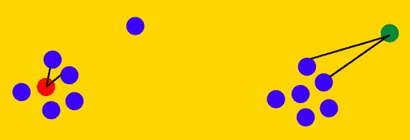
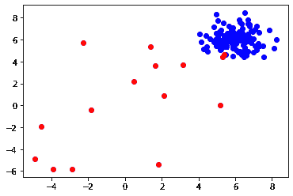
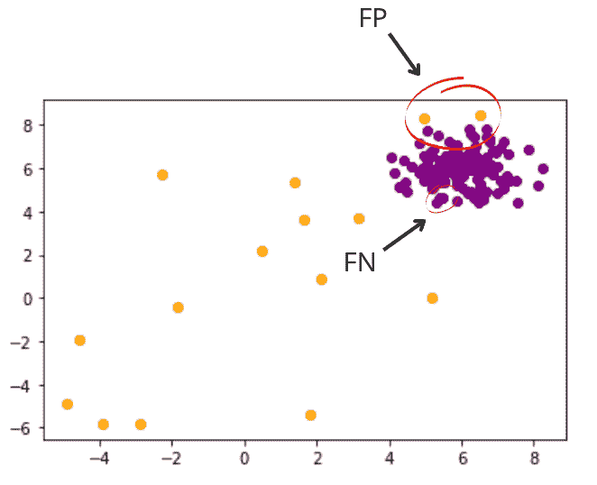

# 用 Python 中基于角度的技术检测异常值

> 原文：<https://blog.paperspace.com/outlier-detection-with-abod/>


Photo by [Greg Rakozy](https://unsplash.com/@grakozy?utm_source=ghost&utm_medium=referral&utm_campaign=api-credit) / [Unsplash](https://unsplash.com/?utm_source=ghost&utm_medium=referral&utm_campaign=api-credit)

**基于角度的异常值检测** (ABOD)是一种用于检测给定数据集中异常值或异常值的流行技术，通常在多变量环境中使用。它是检测异常值的几何方法的一部分。这方面的其他方法包括基于深度的技术[和基于凸包概念的技术](https://www.frontiersin.org/articles/10.3389/fphy.2022.873848/full)。对于这个博客，我们将只关注 ABOD，它的理论和一个简短的教程，使用 [PyOD python 包](https://pyod.readthedocs.io/en/latest/)来实现它。但在此之前，让我们定义一个离群值。任何具有与数据集中的大多数观察值完全不同的属性的观察值或数据点都称为异常值/异常值。数据集中的异常值可能由于许多因素而出现，例如仪器记录误差、人为误差、多数群体的自然变化等。

当处理用例时，例如银行领域的欺诈交易检测、电子商务领域的销售峰谷分析、识别网络中的恶意节点/数据包等，您可能希望检测数据集中的异常。除了不一定要求将检测异常值作为最终目标的用例之外，在尝试拟合学习大多数数据点所拥有的一般模式的模型时，您可能希望考虑处理数据集中的这些数据点。通常，剔除异常值的决定取决于开发人员考虑的因素，如潜在的异常值是否是群体的自然组成部分，或者它是否是由一些仪器误差等因素导致的。数据中的异常会导致学习扭曲的数据表示，提供底层数据的误导性表示。因此，在处理这些点时，有必要通过坚持机器学习模型的假设来更好地拟合机器学习模型。

此外，根据部署这些系统的域的敏感性，保守一点通常是一个好的做法，与[假阴性](https://en.wikipedia.org/wiki/False_positives_and_false_negatives) (FN)相比，有较高的[假阳性](https://en.wikipedia.org/wiki/False_positives_and_false_negatives) (FP)。这主要是因为在现实世界中，你可以通过加入一个人来监督最终的决定。但是，这可能会增加总周转时间，并导致很少的询问。但是这仍然比跳过一个异常现象然后后悔要好的多。例如，最好保守一点，停止任何不寻常的高额付款进出银行账户，然后通过 IVR 或与客户的正常电话确认来解决，而不是被骗。

***误报——模型说这是个异常值。但不是离群值。***

*****假阴性——模型表示这不是异常值。但这是个例外。*****

*****现在让我们深入了解 ABOD 及其变体的细节-*****

## ****基于角度的异常检测(ABOD)****

****该技术基于关注由多变量特征空间中任意三个数据点的集合形成的角度的思想。对于异常值和正常点，角包围区大小的变化是不同的。通常，内侧点的观察到的方差高于外侧点，因此这种测量有助于我们对正常点和外侧点进行不同的聚类。基于角度的离群值(ABOD)技术在高维空间中工作得非常好，不像其他基于距离的测量方法那样受到“维数灾难”的困扰。高维空间中任意两点之间的距离几乎是相似的。在这种情况下，角度可以更好地描述亲密度。****

*****该算法非常简单，描述如下-*****

1.  ****迭代每个数据点，计算它 *(pivot)* 与所有其他数据对形成的角度，并将它们存储在角度列表中。****
2.  ****计算在步骤 1 中创建的角度列表的方差。****
3.  ****小于特定阈值的方差值可以被标记为潜在异常。 *(* ***低方差*** *表示支点是一个* ***异常点*** *，* ***高方差*** *表示支点是一个* ***正常点*** *)*****

****让我们也从视觉上来理解这一点****

****

ABOD illustration**** 

****如左图所示，我们可以看到两个集群，一个是正常点，另一个是异常点，即单个蓝点。如果我们选择红点作为兴趣点( *pivot* ，我们想看看这个点是不是离群点；我们将计算这个点和空间中任何其他两点所围成的角度。在对所有的对进行迭代并计算这个枢轴所包含的角度时，我们可能会观察到角度的许多变化。这样的模式表明支点是具有高内聚力的集群的一部分。****

****同样，如果我们现在观察右边的图形，将注意力集中在绿点上，重复选择任何两个其他点的过程，并观察它与枢轴所成的角度，我们可能会观察到非常小的变化。这种模式表明关注点远离多数群集，并且可能是异常值。使用基于角度的技术检测异常的整个过程具有 O(n)的相当高的复杂度，因为每次我们都需要用一个枢轴做一个三元组，然后在所有对上循环以计算包含角度的方差。****

****一个更快的版本叫做快速 ABOD。它使用[K-最近邻](https://en.wikipedia.org/wiki/K-nearest_neighbors_algorithm)来近似方差，而不是从给定枢轴的所有可能对中计算方差。随着“K”的值在 KNN 增长，该算法收敛到真实方差，并且像它的旧版本一样工作。下图显示了 ABOD 逼近异常值的速度。****

****

Approximate (Fast) ABOD**** 

****从这两个例子中可以看出，在计算包围角时，只考虑了枢轴点 c *(左边红色，右边绿色)*的 k 个最近邻居，这使得计算速度快得惊人。****

 ****## 密码

在博客的这一部分，我们将快速浏览一个例子，并使用[PyOD](https://pyod.readthedocs.io/en/latest/)包检测合成数据集中的异常。PyOD 是用于检测多元数据中异常值的最全面和可伸缩的 Python 工具包之一。它提供了 [40 多种异常检测算法](https://pyod.readthedocs.io/en/latest/index.html#implemented-algorithms)，从传统技术到使用邻近、集成和基于神经网络的方法的目标检测领域的最新发展。

*您可以使用如下所示的 **pip** 安装 PyOD-*

```py
$> pip install pyod
```

接下来，我们可以使用 PyOD 的 **generate_data** 方法在 2-D 空间中生成 150 个随机样本。我特别选择了 2-D 空间，而不是更高的值，因为它易于可视化。我还将污染率设置为 10%，即 150 个数据点中的 15 个数据点是异常值。*如文档中所述，正常点通过多元高斯分布生成，异常点通过均匀分布生成*。

```py
from pyod.utils.data import generate_data

X_train, Y_train = generate_data(   
                                    n_train=150, 
                                    n_features=2,
                                    train_only=True,
                                    contamination=0.1,
                                    random_state=42
                                 )

x1, x2 = X_train[:,0], X_train[:,1]
```

让我们看看数据分布是怎样的-

```py
import matplotlib.pyplot as plt
%matplotlib inline

for idx, i in enumerate(Y_train):
  if i==0.0: 
    color='blue'
  else: 
    color='red'
  plt.scatter(x1[idx], x2[idx], c=color)
```



Synthetic Data with Outlier(marked in red)

接下来，我们通过将 N^3 搜索空间缩小到仅计算 10 个邻居形成的角度来快速拟合 ABOD。然后我们继续计算误差%。

```py
from pyod.models.abod import ABOD

abod_model = ABOD(contamination=0.1, method='fast', n_neighbors=10)
abod_model.fit(X_train)

pred = abod_model.predict(X_train)

error = (pred != Y_train).sum()
print (f'Error % = {(error/len(pred))*100}')
>> Error % = 2.6666
```

接下来，我们绘制内点和外点的预测。

```py
import matplotlib.pyplot as plt
%matplotlib inline

for idx, i in enumerate(pred):
  if i==0.0: 
    color='purple'
  else: 
    color='orange'
  plt.scatter(x1[idx], x2[idx], c=color)
```



ABOD predictions for Outlier Detection

从上图可以看出，橙色和紫色点分别是预测的异常值和内嵌值。我们的模型总共产生 4 个错误(2 个假阳性，2 个假阴性)。

### 总结想法

因此，我们以此结束这篇博客。请随意检查 PyOD 库提供的其他算法，并尝试将其中一些算法组合起来以获得最佳结果。人们经常使用的另一种流行的无监督异常检测技术称为隔离林。请随意查看这个博客,获得这个概念的精彩演示。

谢谢大家！****